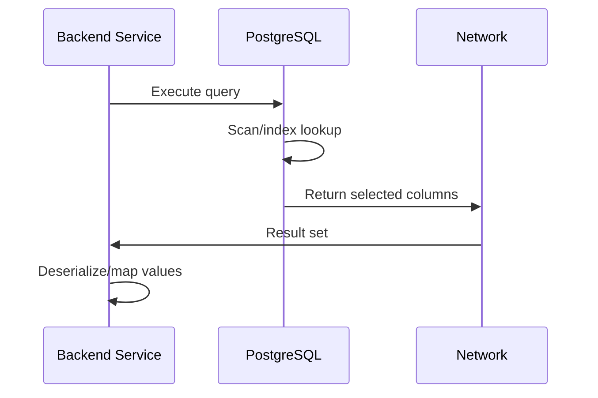

# 15- Data Type Storage and Performance

## Overview

SQL data types affect more than whether a value can be stored. They influence row size, index size, cache utilization, CPU cost, sort and join behavior, network transfer, write amplification, and the operational cost of backups and replication.

The performance impact is often indirect. A column that is only a few bytes smaller may not matter on a small table, but at billions of rows the difference can affect buffer-cache efficiency, index size, I/O, replication volume, and query latency.

The right approach is not to minimize every column. It is to choose a type that correctly represents the domain while avoiding unnecessary storage and computational overhead.

For a production database, reason about:

```text
Data type
    ↓
Row representation
    ↓
Table storage
    ↓
Indexes
    ↓
Buffer/cache utilization
    ↓
CPU + I/O
    ↓
Query latency + throughput
    ↓
Storage, replication, backup and recovery cost
```

PostgreSQL is used for the examples because its type and storage behavior provide useful production-level illustrations. Exact storage details vary across database engines.

## Why Data Type Size Matters

Suppose a table contains:

```sql
CREATE TABLE events (
    id bigint PRIMARY KEY,
    user_id bigint NOT NULL,
    event_type integer NOT NULL,
    created_at timestamptz NOT NULL
);
```

If the table grows to hundreds of millions or billions of rows, even modest differences in row and index size become operationally significant.

Smaller data structures can mean:

- More rows fitting into memory.
- Fewer disk pages required for a table.
- Smaller indexes.
- Fewer pages scanned during queries.
- Lower storage and backup volume.
- Less data transferred during replication.
- Better CPU cache utilization in some workloads.

However:

> Smaller is not automatically faster.

A poorly chosen narrow type can introduce overflow risk, expensive migrations, or unnecessary application complexity. Correctness and domain fit come first.

## How Relational Databases Store Rows

At a high level, relational databases do not normally read an entire table as one continuous object. Data is organized into pages or blocks.

For PostgreSQL, tables and indexes are stored in fixed-size pages, commonly 8 KiB.

A simplified model is:

```text
Table
│
├── Page
│   ├── Row
│   ├── Row
│   └── Row
│
├── Page
│   ├── Row
│   └── Row
│
└── ...
```

A query that needs a row generally causes the database to access the page containing that row.

If rows become larger:

```text
Larger rows
    ↓
Fewer rows per page
    ↓
More pages for the same row count
    ↓
More I/O / cache pressure
```

The exact execution behavior depends on the query, indexes, visibility, caching, and database engine.

## Fixed-Width and Variable-Length Types

Data types differ in how their values are physically represented.

Typical examples:

| Type | General storage characteristic | Performance consideration |
|---|---|---|
| `smallint` | Fixed-width integer | Compact but limited range |
| `integer` | Fixed-width integer | Good general-purpose integer |
| `bigint` | Fixed-width integer | Larger but much larger range |
| `numeric` | Variable storage depending on value | Exact but more computationally expensive |
| `boolean` | Very small representation | Appropriate for binary state |
| `text` | Variable-length | Storage grows with content |
| `varchar(n)` | Variable-length | Length limit does not inherently make it faster |
| `uuid` | Fixed-size value | Larger than 64-bit integers |
| `timestamptz` | Fixed-size timestamp representation | Efficient for temporal queries |

The database also has row-level metadata and alignment requirements, so adding up the nominal sizes of column types does not necessarily equal the final physical row size.

## Row Width and Page Density

Consider two tables:

```sql
CREATE TABLE compact_events (
    id bigint NOT NULL,
    status smallint NOT NULL
);

CREATE TABLE wider_events (
    id bigint NOT NULL,
    status bigint NOT NULL
);
```

If `status` only needs a small range, `smallint` can reduce the logical width of each row.

The effect becomes more relevant as row counts increase:

```text
Narrower rows
     │
     ├── More rows/page
     ├── Fewer table pages
     ├── Smaller scans
     └── Better cache density
```

But this should not be interpreted as a recommendation to use `smallint` everywhere. If a value can legitimately grow beyond the type's range, the resulting migration is far more expensive than the storage savings.

## Index Size

Indexes are often where data type size becomes particularly important.

A B-tree index contains keys and references to table rows. Larger keys generally produce larger indexes.

For example:

```sql
CREATE TABLE users (
    id bigint PRIMARY KEY
);
```

versus:

```sql
CREATE TABLE users (
    id uuid PRIMARY KEY
);
```

A UUID is larger than a `bigint`, so an equivalent UUID index will generally consume more space.

Larger indexes can result in:

- More disk usage.
- More buffer-cache pressure.
- More pages traversed.
- Higher index maintenance cost.
- More write amplification.

This does not mean `bigint` should replace UUIDs. If distributed identifier generation is important, UUIDs may be the better architectural choice.

The engineering decision is:

```text
Identifier requirements
        +
Expected scale
        +
Index workload
        +
Generation strategy
        ↓
Choose identifier type
```

## Primary Keys and Locality

Sequential identifiers often have favorable index locality because new values tend to be near the end of an ordered B-tree index.

For example:

```text
10001
10002
10003
10004
10005
```

Randomly distributed identifiers can create a different access pattern.

UUID behavior depends heavily on the UUID generation strategy. A randomly distributed UUID can reduce locality compared with sequential values, potentially increasing index page churn and fragmentation under heavy write workloads.

Modern UUID versions and application-specific identifier strategies can improve locality, but the appropriate choice depends on the database and workload.

Do not assume:

```text
UUID = slow
bigint = fast
```

The real question is how the identifier is generated and how the resulting index is accessed.

## Numeric Types and CPU Cost

Not all numeric types have the same computational characteristics.

Integer arithmetic is generally efficient for operations such as:

```sql
SELECT SUM(quantity)
FROM order_items;
```

Exact decimal arithmetic using `numeric` is more computationally expensive than simple fixed-width integer arithmetic in many cases.

That trade-off is acceptable when exactness is required.

For financial systems:

```sql
amount numeric(19, 4)
```

may be preferable to:

```sql
amount double precision
```

even if exact decimal arithmetic costs more CPU.

Performance optimization must never replace domain correctness.

## Monetary Values: Numeric vs Minor Units

There are two common approaches to representing money.

### Exact decimal

```sql
amount numeric(19, 4) NOT NULL
```

Advantages:

- Clear financial semantics.
- Exact decimal arithmetic.
- Natural representation for fractional currency units.
- Easy to understand.

Limitations:

- More computational overhead than integer arithmetic.
- Precision and scale need deliberate design.

### Integer minor units

```sql
amount_minor bigint NOT NULL
```

For example:

```text
₹199.50 → 19950 paise
$19.99 → 1999 cents
```

Advantages:

- Integer arithmetic.
- Explicit smallest-unit representation.
- Avoids floating-point errors.

Limitations:

- Currency-specific scaling must be understood.
- Different currencies can have different minor-unit conventions.
- Values are less immediately readable.
- Currency must be modeled alongside the amount.

A payment system may therefore use:

```sql
CREATE TABLE payments (
    id uuid PRIMARY KEY,
    amount_minor bigint NOT NULL CHECK (amount_minor >= 0),
    currency char(3) NOT NULL,
    created_at timestamptz NOT NULL DEFAULT now()
);
```

The choice should be standardized across the financial domain rather than made independently by each service.

## Text Storage and Performance

Text columns can become significant storage consumers because their size depends on actual content.

Avoid assuming:

```sql
varchar(255)
```

is inherently more efficient than:

```sql
text
```

In PostgreSQL, unconstrained `text` and `varchar` have essentially the same storage characteristics. A length constraint should represent a meaningful domain rule rather than being added for perceived performance.

For example:

```sql
name text NOT NULL
```

may be preferable to:

```sql
name varchar(255) NOT NULL
```

if `255` has no business meaning.

For genuinely bounded values:

```sql
country_code char(2) NOT NULL
```

or an appropriate constrained text representation can make the domain explicit.

## Large Text Values and TOAST

PostgreSQL uses **TOAST** (The Oversized-Attribute Storage Technique) for large variable-length values that cannot conveniently fit directly into a normal row.

Conceptually:

```text
Main table row
      │
      ├── Small values stored inline
      │
      └── Large value
             │
             └── TOAST storage
```

This allows PostgreSQL to manage large values without requiring every row to physically contain the complete oversized value.

However, TOAST is not a reason to ignore large-column design.

Large values can still increase:

- Storage consumption.
- Backup size.
- I/O.
- Query costs when selected.
- Network transfer.
- Vacuum and maintenance work.

Avoid:

```sql
SELECT *
FROM customers;
```

when the table contains large text or JSONB fields that the application does not need.

Prefer selecting only required columns:

```sql
SELECT id, name, email
FROM customers
WHERE id = $1;
```

## JSONB Storage and Performance

`jsonb` is powerful but can become expensive when used indiscriminately.

For example:

```sql
CREATE TABLE products (
    id bigint GENERATED ALWAYS AS IDENTITY PRIMARY KEY,
    metadata jsonb NOT NULL DEFAULT '{}'::jsonb
);
```

JSONB is useful when the structure is genuinely variable.

However, storing frequently accessed relational fields inside JSONB can introduce:

- Larger rows.
- More complex queries.
- Additional indexing requirements.
- Weaker relational integrity.
- More difficult migrations.

If an application frequently queries:

```sql
WHERE metadata->>'country' = 'IN'
```

and that predicate becomes operationally important, the indexing strategy must be deliberate.

A JSONB GIN index can be useful:

```sql
CREATE INDEX products_metadata_gin_idx
ON products USING gin (metadata);
```

But indexing every JSONB column by default is a mistake. Indexes consume storage and increase write cost.

## NULL and Storage

`NULL` is not equivalent to an ordinary value such as:

```text
0
false
''
```

It also affects query semantics.

For example:

```sql
SELECT *
FROM orders
WHERE discount = 0;
```

does not match:

```text
discount IS NULL
```

If a nullable column is frequently queried, indexing and query patterns need to account for that semantic distinction.

Use:

```sql
WHERE discount IS NULL
```

when looking for missing values.

Do not use arbitrary sentinel values such as:

```text
-1
999999
0
```

to represent missing data when `NULL` accurately expresses the domain.

## Data Type and Cache Efficiency

Databases maintain frequently accessed pages in memory.

Consider:

```text
RAM
│
├── Frequently accessed table pages
├── Frequently accessed index pages
└── Other database structures
```

If an index is smaller, more of it can fit in memory.

For a high-volume lookup:

```sql
SELECT id
FROM orders
WHERE customer_id = $1;
```

a compact index can potentially keep more relevant index pages cached.

This is one reason data type size can matter more for indexes than for the table itself.

However, database cache behavior is workload-dependent. Do not assume a smaller type will automatically produce a measurable latency improvement.

Measure:

```sql
EXPLAIN (ANALYZE, BUFFERS)
SELECT id
FROM orders
WHERE customer_id = $1;
```

Look for:

- Execution time.
- Shared buffer hits.
- Shared buffer reads.
- Rows examined.
- Index usage.
- Actual row counts.

## Data Types and Sorting

Sorting requires the database to compare values and potentially maintain intermediate structures in memory or temporary storage.

For example:

```sql
SELECT id, created_at
FROM events
ORDER BY created_at DESC
LIMIT 100;
```

The data type affects:

- Comparison operations.
- Sort key size.
- Memory requirements.
- Index size if an ordered index is used.

A suitable index can often eliminate or reduce sorting work:

```sql
CREATE INDEX events_created_at_idx
ON events (created_at DESC);
```

The type itself is only one part of sort performance. Query shape and indexing are usually more important.

## Data Types and Joins

Join columns should use compatible data types.

Prefer:

```sql
users.id       bigint
orders.user_id bigint
```

over:

```sql
users.id       bigint
orders.user_id text
```

The second design introduces unnecessary conversion and can complicate query planning and application logic.

A production schema should maintain consistent identifier semantics across related tables.

This is particularly important in microservice architectures where identifiers cross service boundaries.

## Data Types and Network Transfer

Data retrieved from the database eventually reaches the application.

The data path is roughly:



Selecting large values unnecessarily increases network and serialization costs.

For example, if a table contains:

```sql
description text,
metadata jsonb,
document text
```

avoid returning all three when an API only needs:

```sql
id, name, status
```

Use explicit projections instead of `SELECT *`.

This is particularly important for:

- High-QPS APIs.
- Large JSON responses.
- Mobile clients.
- Cross-region services.
- Database-to-service links with constrained bandwidth.

## Data Types and Replication

Write operations can propagate through replication systems.

A simplified flow is:

```text
Primary
   │
   ├── WAL / replication stream
   │
   ├──────────────> Replica
   │
   └──────────────> Backup / downstream consumer
```

Larger rows and indexes can increase the amount of data that must be written and maintained.

Data type choices therefore indirectly affect:

- Replication bandwidth.
- Replica replay workload.
- Backup size.
- Restore duration.
- Storage cost.

The impact becomes significant at large scale, but it should be measured against actual write volume.

## Index Write Amplification

Every additional index introduces maintenance work.

Consider:

```sql
CREATE TABLE orders (
    id bigint PRIMARY KEY,
    customer_id uuid NOT NULL,
    status text NOT NULL,
    created_at timestamptz NOT NULL
);
```

If the table has indexes on:

```text
id
customer_id
status
created_at
```

an insert may need to update several index structures.

Larger index keys increase the amount of data written.

Therefore:

```text
More indexes
    +
Larger index keys
    +
High write volume
    ↓
Higher write amplification
```

This matters for:

- Event ingestion.
- Kafka consumers writing high-volume records.
- Audit tables.
- Logging tables.
- Time-series-like workloads.

Do not add indexes simply because a column appears useful to search.

## Storage and Cost

At scale, storage is not merely a disk-capacity concern.

It affects:

- Database instance sizing.
- IOPS requirements.
- Backup storage.
- Snapshot size.
- Replication.
- Restore duration.
- Monitoring thresholds.
- Cloud infrastructure cost.

For AWS-hosted PostgreSQL, database storage, provisioned IOPS, compute, backups, replicas, and data transfer can all contribute to the operational cost.

A useful design principle is:

> Optimize for the total cost of the workload, not the byte size of an individual column.

A `bigint` instead of `integer` may add storage, but if it prevents a future migration and the table is small, that is usually an excellent trade.

## Measuring Physical Storage

Do not rely only on theoretical type sizes.

PostgreSQL provides functions for measuring actual relation sizes:

```sql
SELECT
    pg_size_pretty(pg_table_size('orders')) AS table_size,
    pg_size_pretty(pg_indexes_size('orders')) AS index_size,
    pg_size_pretty(pg_total_relation_size('orders')) AS total_size;
```

For column-level statistics, PostgreSQL's catalog and statistics views can help identify large or frequently accessed structures.

A production investigation should compare:

```text
Expected schema
        vs
Actual storage
        vs
Actual query workload
```

## Query Plan Validation

When investigating a data-type-related performance question, use the execution plan.

Example:

```sql
EXPLAIN (ANALYZE, BUFFERS)
SELECT id, total
FROM orders
WHERE customer_id = '7b9e7d6d-2e1a-4e8d-b5e5-2e3b1b5c1234'
ORDER BY created_at DESC
LIMIT 50;
```

Evaluate:

- Whether the expected index is used.
- Estimated vs actual rows.
- Shared buffer hits and reads.
- Sort operations.
- Sequential scans.
- Execution time.

Do not optimize based solely on the declared SQL type.

A query that scans 500 million rows because it lacks an appropriate index will not become fast merely because an integer was changed from `bigint` to `integer`.

## Choosing Types for High-Volume Tables

For a high-volume table, review:

| Concern | Questions |
|---|---|
| Row width | Can values be represented correctly without unnecessary width? |
| Primary key | Is `bigint` or UUID appropriate for the identifier strategy? |
| Indexes | Are key sizes reasonable for the access patterns? |
| Text | Are large values actually required in the main table? |
| JSONB | Is semi-structured storage justified? |
| Numeric | Is exact arithmetic necessary? |
| Timestamps | Does the type correctly represent an instant or calendar value? |
| NULLability | Is absence modeled correctly? |
| Growth | Can values exceed their current range? |
| Replication | Will write volume create replication pressure? |
| Backup | Will table and index size affect recovery objectives? |

## Production Example

Consider a high-volume event table:

```sql
CREATE TABLE application_events (
    id bigint GENERATED ALWAYS AS IDENTITY PRIMARY KEY,
    service_id uuid NOT NULL,
    event_type text NOT NULL,
    sequence_number bigint NOT NULL,
    occurred_at timestamptz NOT NULL,
    payload jsonb NOT NULL
);

CREATE INDEX application_events_service_time_idx
ON application_events (service_id, occurred_at DESC);
```

This design makes several deliberate choices:

- `bigint` provides substantial identifier and sequence capacity.
- UUID identifies a distributed service or entity.
- `text` avoids an arbitrary length limit for event names.
- `timestamptz` represents an absolute event time.
- `jsonb` accommodates event-specific payloads.
- The composite index reflects a likely query pattern.

For example:

```sql
SELECT id, event_type, occurred_at
FROM application_events
WHERE service_id = $1
ORDER BY occurred_at DESC
LIMIT 100;
```

The important performance decision is not simply the type of each column. It is the combination of:

```text
Data type
    +
Query pattern
    +
Index design
    +
Data volume
    +
Write/read ratio
```

## When Storage Optimization Is Worth It

Storage-focused type optimization is most valuable when:

- Tables contain hundreds of millions or billions of rows.
- Indexes are large relative to available memory.
- Storage or I/O is a major cost.
- Replication bandwidth is constrained.
- The workload is heavily write-intensive.
- Cache efficiency is important.
- Large objects dominate database storage.

It is usually lower priority when:

- The table is small.
- Queries are dominated by external network calls.
- The bottleneck is an inefficient query plan.
- The database has abundant memory and storage.
- Application-level serialization dominates latency.

Always profile before making a type change for performance.

## Common Mistakes

| Mistake | Why it is problematic | Better approach |
|---|---|---|
| Choosing the smallest type everywhere | Creates range and migration risk | Choose the smallest type that safely fits the domain |
| Assuming UUIDs are always slow | Ignores generation strategy and workload | Evaluate UUID version, locality, index size and access patterns |
| Assuming `varchar(255)` is faster than `text` | Misunderstands PostgreSQL storage behavior | Use length constraints for domain rules |
| Using `float` for financial data | Can introduce precision errors | Use `numeric` or a carefully designed minor-unit representation |
| Adding indexes without measuring | Increases write and storage costs | Index actual access patterns |
| Selecting `SELECT *` | Transfers unnecessary data | Select only required columns |
| Storing large files directly in rows | Increases database storage and operational burden | Use object storage when appropriate |
| Putting relational fields into JSONB | Weakens relational modeling | Normalize frequently queried stable attributes |
| Changing types only for theoretical performance | May produce negligible benefit | Measure actual workload first |
| Ignoring index size | Misses an important source of storage and cache pressure | Monitor table and index growth |
| Using incompatible join types | Can require casts and complicate plans | Keep related columns type-compatible |
| Optimizing bytes before query design | Often targets the wrong bottleneck | Fix query plans and access patterns first |

## Operational Best Practices

### Establish type conventions

A backend team should standardize common choices, for example:

```text
Database identifiers
    → bigint or UUID based on service architecture

Money
    → numeric or integer minor units

Absolute timestamps
    → timestamptz

Boolean state
    → boolean

General text
    → text

Semi-structured metadata
    → jsonb when justified
```

Consistency reduces design debates and prevents different services from representing the same domain concept differently.

### Monitor table and index growth

Track:

- Largest tables.
- Largest indexes.
- Growth rate.
- Rows inserted per second.
- Dead tuples.
- Vacuum activity.
- Replication lag.
- Backup growth.

A type decision that was reasonable at 10 million rows may become important at 5 billion rows.

### Test migrations

Changing:

```sql
integer → bigint
```

or:

```sql
text → another representation
```

can involve significant table or index work depending on the database and exact transformation.

Before production deployment:

1. Test against production-scale data.
2. Measure locking behavior.
3. Estimate migration duration.
4. Check replica impact.
5. Validate application compatibility.
6. Define rollback or forward-recovery procedures.

### Prefer evidence over assumptions

Use:

```sql
EXPLAIN (ANALYZE, BUFFERS)
```

for query behavior and PostgreSQL size functions for physical storage.

Use production metrics to determine whether a change actually improves:

- p50 latency.
- p95/p99 latency.
- Throughput.
- I/O.
- CPU.
- Cache hit behavior.
- Storage growth.

## Interview Traps

### Does a smaller data type always make queries faster?

No. It can improve page density and reduce storage or index size, but query performance is primarily determined by workload, indexes, query plans, caching, I/O, and CPU.

### Is `varchar(255)` more performant than `text` in PostgreSQL?

Not inherently. PostgreSQL uses similar storage mechanisms for `text` and unconstrained `varchar`. The length constraint should exist because the domain requires it.

### Why can UUID indexes be larger than integer indexes?

A UUID occupies more bytes than a 32-bit or 64-bit integer, so its index keys are larger. Generation strategy can also affect index locality.

### Why does row width matter?

Database pages contain a finite amount of data. Wider rows generally mean fewer rows per page, which can increase the number of pages required for scans and reduce cache density.

### Should `numeric` always be avoided for performance?

No. `numeric` is often the correct choice when exact decimal arithmetic is required. Correctness takes priority over small CPU differences.

### Is optimizing a column from `bigint` to `integer` usually a high-impact optimization?

Usually not unless the table and indexes are large enough for the reduced width to materially affect storage, caching, or I/O. Query and index design generally provide larger performance opportunities.

## Key Takeaways

- **Data type size affects row density, index size, cache utilization, I/O, replication, backups, and operational cost, especially at large scale.**
- **Optimize physical storage only after confirming that the type safely represents the domain; premature narrowing can create range limitations and expensive migrations.**
- **Index size and locality can matter more than table row size, particularly for high-volume primary keys and frequently accessed secondary indexes.**
- **Measure real behavior with tools such as `EXPLAIN (ANALYZE, BUFFERS)` and PostgreSQL size functions instead of assuming a smaller type will improve performance.**
- **Treat data type, query pattern, index design, data volume, and read/write workload as one performance decision rather than optimizing any column in isolation.**