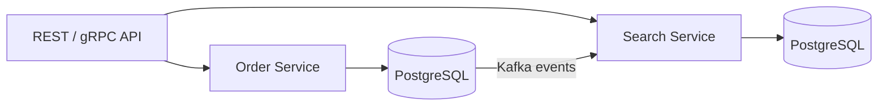

# 16- Database-Specific Data Types

## Overview

SQL defines a broad set of standard data types, but production databases also provide vendor-specific types that solve problems the SQL standard does not fully address.

These types can provide substantial benefits in areas such as:

- Semi-structured data.
- Native UUID handling.
- Network addresses.
- Full-text search.
- Geospatial data.
- Arrays and ranges.
- Efficient temporal and domain-specific operations.
- Specialized indexing.

The trade-off is **portability**. A schema that depends heavily on PostgreSQL-specific types is more tightly coupled to PostgreSQL, which can increase migration complexity and constrain database choices.

For backend systems, the decision should therefore be deliberate:

```text
Business requirement
        ↓
Standard SQL type sufficient?
        │
   ┌────┴────┐
   │         │
  Yes        No
   │         │
Standard   Database-specific type
type       ↓
   │       Evaluate portability,
   │       indexing, tooling,
   │       operational cost
   └─────────┬─────────┘
             ↓
        Schema decision
```

This document focuses primarily on PostgreSQL because it has a particularly rich set of native types. Other database engines provide their own specialized types, and their behavior should be verified against the target engine's documentation before relying on it.

## Why Database-Specific Types Exist

Standard SQL types provide common primitives such as:

- Integers.
- Decimal numbers.
- Character strings.
- Dates and timestamps.
- Boolean values.
- Binary values.

Real systems frequently need richer semantics.

For example, an IP address could be stored as:

```sql
ip_address text
```

but PostgreSQL's:

```sql
inet
```

understands that the value represents a network address and provides operators and functions specifically designed for network operations.

Similarly, storing structured application metadata as:

```sql
metadata text
```

loses the database's ability to understand the structure.

PostgreSQL's:

```sql
jsonb
```

allows the database to parse, index, and query the JSON structure.

The key benefit is therefore not merely storage. It is **native semantics**.

## Common PostgreSQL-Specific Types

| Type | Purpose | Typical use |
|---|---|---|
| `jsonb` | Binary JSON representation | Flexible metadata and semi-structured data |
| `uuid` | Universally unique identifiers | Distributed identifiers |
| `inet` | IPv4/IPv6 host or network | IP addresses and CIDR ranges |
| `cidr` | IPv4/IPv6 network | Network definitions |
| `macaddr` | MAC addresses | Networking/infrastructure data |
| `array` | Collection of values | Small, bounded collections |
| `range` | Continuous/discrete ranges | Time, numeric or ID intervals |
| `tsvector` | Full-text search document | Search indexes |
| `tsquery` | Full-text search query | Search expressions |
| `vector`* | Embeddings | Similarity search |
| `PostGIS geometry/geography`* | Geospatial data | Location and spatial queries |

\* These are generally provided through PostgreSQL extensions rather than the PostgreSQL core type system.

## UUID

A UUID is a 128-bit identifier.

PostgreSQL provides a native:

```sql
uuid
```

type.

Example:

```sql
CREATE TABLE users (
    id uuid PRIMARY KEY,
    email text NOT NULL UNIQUE
);
```

UUIDs are useful when identifiers need to be generated independently by multiple application instances or services.

They can be generated at the application layer:

```python
from uuid import UUID, uuid4

user_id: UUID = uuid4()
```

or through database-supported generation mechanisms depending on the PostgreSQL setup.

### Advantages

- Large identifier space.
- Suitable for distributed generation.
- Does not expose sequential record counts.
- Natural fit for service-to-service APIs.

### Limitations

- Larger than `integer` or `bigint`.
- Larger indexes.
- Random UUID generation can have poorer index locality than sequential identifiers.
- Text representations are significantly larger than native UUID storage.

Prefer:

```sql
id uuid
```

over:

```sql
id text
```

when the value is actually a UUID.

The native type provides validation and UUID-specific behavior while avoiding unnecessary textual storage.

## JSONB

`jsonb` stores JSON data in a decomposed binary representation.

Example:

```sql
CREATE TABLE products (
    id bigint GENERATED ALWAYS AS IDENTITY PRIMARY KEY,
    name text NOT NULL,
    metadata jsonb NOT NULL DEFAULT '{}'::jsonb
);
```

A value can contain:

```json
{
  "color": "black",
  "dimensions": {
    "width": 20,
    "height": 10
  },
  "tags": ["premium", "new"]
}
```

The database can query the structure:

```sql
SELECT id
FROM products
WHERE metadata @> '{"color": "black"}';
```

A GIN index can support many JSONB query patterns:

```sql
CREATE INDEX products_metadata_gin_idx
ON products USING gin (metadata);
```

### When JSONB is appropriate

Use it when:

- Attributes are genuinely variable.
- Schema evolution is frequent.
- The application needs flexible metadata.
- The structure is not worth modeling as many relational columns.
- The database needs to query the JSON structure.

Avoid using JSONB merely because designing a relational schema is inconvenient.

If the application frequently executes:

```sql
WHERE customer_id = $1
```

then `customer_id` should generally be a normal column rather than:

```json
{
  "customer_id": "..."
}
```

### Production concern

JSONB does not eliminate schema design. It moves part of the schema from explicit relational columns into application-managed structure.

This can make:

- Constraints harder.
- Foreign keys unavailable for nested values.
- Queries more complex.
- Migrations less explicit.
- Data quality enforcement weaker.

## Arrays

PostgreSQL supports arrays of many data types.

Example:

```sql
CREATE TABLE users (
    id bigint GENERATED ALWAYS AS IDENTITY PRIMARY KEY,
    roles text[] NOT NULL DEFAULT '{}'
);
```

A row could contain:

```text
{"admin","billing"}
```

Array operators can query membership and overlap.

For example:

```sql
SELECT id
FROM users
WHERE 'admin' = ANY (roles);
```

### When arrays are appropriate

Arrays work well for small collections that:

- Belong tightly to the owning row.
- Do not require independent lifecycle management.
- Are usually accessed together with the parent.
- Do not need rich relational relationships.

Examples include:

```text
Supported locales
Small feature flags
Short tag lists
Static configuration values
```

### When arrays are a poor choice

Avoid arrays when each element behaves like an independent entity.

For example, this is usually a poor model:

```sql
users (
    id bigint,
    project_ids bigint[]
)
```

if projects have their own lifecycle and users can have many-to-many relationships.

A junction table is normally more appropriate:

```sql
CREATE TABLE user_projects (
    user_id bigint NOT NULL,
    project_id bigint NOT NULL,
    PRIMARY KEY (user_id, project_id)
);
```

## Range Types

PostgreSQL range types represent an interval rather than a single scalar value.

Examples include:

- `int4range`
- `int8range`
- `numrange`
- `tsrange`
- `tstzrange`
- `daterange`

For example:

```sql
CREATE TABLE room_bookings (
    room_id bigint NOT NULL,
    booking_period tstzrange NOT NULL
);
```

A booking can be represented as:

```text
[2026-08-31 10:00, 2026-08-31 11:00)
```

The half-open interval means:

```text
start ≤ time < end
```

This is particularly useful for scheduling and reservation systems.

### Why range types matter

Without a range type, applications often store:

```sql
start_time timestamptz,
end_time timestamptz
```

and manually implement interval logic.

A range gives the database a first-class representation of the interval and enables specialized operators and indexes.

### Preventing overlapping bookings

PostgreSQL can combine range types with exclusion constraints.

For example:

```sql
CREATE EXTENSION IF NOT EXISTS btree_gist;

CREATE TABLE room_bookings (
    room_id bigint NOT NULL,
    booking_period tstzrange NOT NULL,
    EXCLUDE USING gist (
        room_id WITH =,
        booking_period WITH &&
    )
);
```

This lets the database reject overlapping bookings for the same room.

This is a strong production pattern because correctness is enforced at the database boundary rather than relying exclusively on application-level checks.

## Network Address Types

PostgreSQL provides:

```text
inet
cidr
macaddr
macaddr8
```

Example:

```sql
CREATE TABLE access_logs (
    id bigint GENERATED ALWAYS AS IDENTITY PRIMARY KEY,
    client_ip inet NOT NULL,
    requested_at timestamptz NOT NULL
);
```

Using `inet` provides network-aware semantics.

For example:

```sql
SELECT *
FROM access_logs
WHERE client_ip <<= '10.0.0.0/8'::cidr;
```

This can determine whether an address belongs to a network.

### `inet` vs `cidr`

| Type | Represents | Typical use |
|---|---|---|
| `inet` | Host address or network | Client/server IP addresses |
| `cidr` | Network block | Subnets and network ranges |

Do not store IP addresses as arbitrary strings when the application needs network-aware operations.

## Full-Text Search Types

PostgreSQL provides:

```text
tsvector
tsquery
```

for native full-text search.

A document can be converted into a searchable representation:

```sql
SELECT to_tsvector(
    'english',
    'PostgreSQL provides powerful database features'
);
```

A query can be represented as:

```sql
SELECT to_tsquery(
    'english',
    'database & features'
);
```

A production table might contain a generated search column:

```sql
CREATE TABLE articles (
    id bigint GENERATED ALWAYS AS IDENTITY PRIMARY KEY,
    title text NOT NULL,
    body text NOT NULL,
    search_document tsvector
        GENERATED ALWAYS AS (
            to_tsvector('english', coalesce(title, '') || ' ' || coalesce(body, ''))
        ) STORED
);

CREATE INDEX articles_search_idx
ON articles USING gin (search_document);
```

This can be useful when PostgreSQL is sufficient for the application's search requirements.

For advanced search requirements, a dedicated search engine may still be more appropriate.

## Geospatial Types

PostgreSQL can support geospatial workloads through the **PostGIS** extension.

Common concepts include:

```text
geometry
geography
Point
Polygon
LineString
```

For example:

```sql
CREATE EXTENSION IF NOT EXISTS postgis;

CREATE TABLE stores (
    id bigint GENERATED ALWAYS AS IDENTITY PRIMARY KEY,
    name text NOT NULL,
    location geography(Point, 4326) NOT NULL
);
```

A spatial index can support location queries:

```sql
CREATE INDEX stores_location_gist_idx
ON stores
USING gist (location);
```

This enables database-level operations such as:

- Distance calculations.
- Bounding-box searches.
- Polygon containment.
- Spatial intersections.

Use specialized geospatial types when location is a core part of the application's domain.

## Domain Types

PostgreSQL also supports user-defined domain types.

A domain can attach constraints to an underlying type.

For example:

```sql
CREATE DOMAIN positive_amount AS numeric(19, 4)
CHECK (VALUE >= 0);
```

It can then be reused:

```sql
CREATE TABLE invoices (
    id bigint GENERATED ALWAYS AS IDENTITY PRIMARY KEY,
    total positive_amount NOT NULL
);
```

This is useful when the same business-level constraint appears across multiple tables.

Domains can improve consistency, but they should not be used to hide important business rules that belong in a more explicit domain model.

## Composite Types

PostgreSQL supports composite types, which contain multiple fields.

Example:

```sql
CREATE TYPE address AS (
    street text,
    city text,
    postal_code text
);
```

A table can use it:

```sql
CREATE TABLE customers (
    id bigint GENERATED ALWAYS AS IDENTITY PRIMARY KEY,
    shipping_address address
);
```

Composite types are useful in specialized PostgreSQL-centric designs, but they are less common in typical backend application schemas.

They can also complicate:

- ORM mappings.
- API serialization.
- Migrations.
- Cross-database portability.

For Django or FastAPI applications intended to remain straightforward to maintain, ordinary relational columns are often easier to work with.

## XML

PostgreSQL supports an `xml` type for XML documents.

Example:

```sql
CREATE TABLE integrations (
    id bigint GENERATED ALWAYS AS IDENTITY PRIMARY KEY,
    configuration xml NOT NULL
);
```

It can be appropriate when an external system genuinely requires XML and preserving the document inside the database has operational value.

For new application designs, do not choose XML simply because it can store structured data. JSONB is generally a more natural fit for modern REST-oriented backend systems unless XML interoperability is an explicit requirement.

## `hstore`

PostgreSQL's `hstore` extension provides a key-value store where both keys and values are strings.

Example:

```sql
CREATE EXTENSION IF NOT EXISTS hstore;

CREATE TABLE users (
    id bigint GENERATED ALWAYS AS IDENTITY PRIMARY KEY,
    attributes hstore
);
```

`hstore` predates JSONB and remains useful in some workloads, but JSONB generally provides richer structures and broader functionality.

For new systems, JSONB is usually the first option to evaluate for semi-structured data.

## Extensions vs Native Types

Not every PostgreSQL-specific type belongs to PostgreSQL core.

| Capability | Typical mechanism |
|---|---|
| `uuid` | PostgreSQL type |
| `jsonb` | PostgreSQL type |
| Arrays | PostgreSQL type |
| Range types | PostgreSQL type |
| `inet` | PostgreSQL type |
| Full-text search types | PostgreSQL type |
| `vector` | Extension such as `pgvector` |
| Geospatial types | PostGIS extension |
| `hstore` | Extension |

Extensions can add powerful functionality while preserving PostgreSQL integration.

However, extensions introduce operational dependencies.

Before using one, verify:

- Supported PostgreSQL versions.
- Managed database support.
- Upgrade compatibility.
- Backup and restore behavior.
- Replication behavior.
- Migration tooling.
- Monitoring support.
- Developer environment setup.
- CI/CD provisioning.

This matters particularly for AWS-managed PostgreSQL environments where available extensions and versions depend on the service configuration.

## ORM Considerations

Database-specific types can create a gap between the relational schema and application models.

Django provides PostgreSQL-specific fields such as:

```python
from django.db import models

class Product(models.Model):
    metadata = models.JSONField(default=dict)
    tags = models.ArrayField(
        models.CharField(max_length=50),
        default=list,
    )
```

The database still remains the source of truth for storage semantics.

When using SQLAlchemy or another ORM, verify how the ORM maps:

```text
Python type
    ↓
ORM field
    ↓
SQL type
    ↓
Database-specific operators/indexes
```

Do not assume that an ORM abstraction exposes every capability of a database-specific type.

For performance-sensitive or specialized operations, direct SQL may be appropriate.

## Microservices and Database-Specific Types

Database-specific types become more important architecturally when multiple services own different databases.

For example:



A service can safely exploit PostgreSQL-specific functionality when it owns its database.

The coupling is primarily:

```text
Service
   ↕
PostgreSQL schema
```

rather than:

```text
Multiple services
        ↕
Shared database schema
```

This makes database-specific features easier to justify.

However, the service contract should not expose PostgreSQL implementation details unnecessarily.

For example, an API should expose a domain concept such as:

```json
{
  "id": "8b7c8d6e-..."
}
```

rather than forcing consumers to understand internal PostgreSQL-specific representations.

## Portability Trade-Off

The decision can be evaluated across several dimensions.

| Factor | Standard SQL types | Database-specific types |
|---|---|---|
| Portability | High | Lower |
| Native functionality | Lower | High |
| Query expressiveness | General | Often much richer |
| ORM portability | Usually better | May require vendor-specific support |
| Migration to another DB | Easier | Potentially harder |
| Performance optimization | General | Can exploit engine-specific capabilities |
| Domain semantics | Generic | Often stronger |
| Operational complexity | Lower | Can be higher |
| Vendor lock-in | Lower | Higher |

Vendor lock-in is not automatically bad.

If PostgreSQL-specific functionality substantially simplifies the system and PostgreSQL is already an intentional architectural choice, using that functionality can be the better engineering decision.

## When to Prefer Database-Specific Types

Use a database-specific type when:

- It accurately models the domain.
- The database provides important operators or indexes.
- Application-level emulation would be more complex.
- The performance benefit is meaningful.
- PostgreSQL is an intentional platform choice.
- The operational environment supports the feature.

Examples:

```text
IP addresses       → inet
Network ranges     → cidr
Structured metadata → jsonb
Time intervals     → tstzrange
Geospatial data    → PostGIS
Full-text search   → tsvector
Distributed IDs    → uuid
```

Avoid database-specific types when:

- Portability is a major requirement.
- The application only needs generic scalar behavior.
- The ORM cannot reliably support the type.
- The operational environment cannot support the extension.
- The specialized type adds complexity without meaningful value.

## Migration Considerations

Database-specific types can make migrations more involved.

Suppose a service moves from:

```sql
jsonb
```

to a database that does not provide equivalent JSON functionality.

The migration may require:

```text
PostgreSQL jsonb
      ↓
Extract structure
      ↓
Transform representation
      ↓
Create target schema
      ↓
Rewrite queries
      ↓
Rewrite indexes
      ↓
Update ORM mappings
      ↓
Validate application behavior
```

This is significantly more work than moving a simple:

```sql
integer
```

column.

Before introducing a specialized type, document:

- Why it is needed.
- What queries depend on it.
- Which indexes depend on it.
- Which application components depend on it.
- What the migration fallback would be.

## Performance Considerations

Database-specific types can improve performance because the database understands their semantics.

For example:

```text
text IP address
     ↓
String comparisons
```

versus:

```text
inet
     ↓
Network-aware operators
     ↓
Specialized indexes
```

Similarly:

```text
JSON stored as text
     ↓
Application parsing
```

versus:

```text
jsonb
     ↓
Database-aware operators
     ↓
GIN / expression indexes
```

However, specialized types can also increase storage, indexing, CPU, or write costs.

Always validate with:

```sql
EXPLAIN (ANALYZE, BUFFERS)
```

and real workload measurements.

Do not introduce a specialized type solely because it sounds more sophisticated.

## Security Considerations

Database-specific types do not replace application security controls.

For JSONB, arrays, XML, or other flexible types:

- Validate incoming data.
- Apply size limits at API boundaries.
- Avoid unbounded payloads.
- Restrict database permissions.
- Use parameterized SQL.
- Avoid constructing operators or expressions from untrusted input.
- Monitor unusually large values.

For network data:

```sql
client_ip inet
```

provides structured representation, but it does not make the value trustworthy.

An IP address supplied through an HTTP header can be attacker-controlled unless the proxy chain is configured and trusted correctly.

## Common Mistakes

| Mistake | Why it happens | Better approach |
|---|---|---|
| Using `text` for UUIDs | Treating every value as a string | Use native `uuid` |
| Using JSONB for every optional field | Avoiding schema design | Normalize stable, frequently queried attributes |
| Using arrays for many-to-many relationships | Arrays appear simpler | Use junction tables for relational entities |
| Assuming extensions are always available | Development environment differs from production | Verify managed-service support |
| Ignoring ORM support | Assuming the ORM abstracts everything | Verify generated SQL and native operator support |
| Choosing specialized types without workload evidence | Overengineering | Start from domain and access patterns |
| Ignoring migration portability | Vendor-specific feature looks convenient | Document the lock-in and fallback strategy |
| Putting large documents into JSONB | Treating JSONB as object storage | Evaluate object storage for large blobs |
| Adding broad GIN/GiST indexes automatically | Assuming indexes are free | Index actual query patterns |
| Exposing database-specific representations in APIs | Leaking storage implementation | Keep API contracts domain-oriented |

## Production Checklist

Before adopting a database-specific type, verify:

- **Domain fit** — Does the type accurately represent the business concept?
- **Query fit** — Do its native operators simplify important queries?
- **Index support** — Is there an appropriate index strategy?
- **ORM support** — Can the application's ORM map and query the type safely?
- **Migration impact** — What happens if the schema must move to another database?
- **Managed-service support** — Is the type or extension supported by the production platform?
- **Backup and restore** — Does the type behave correctly through the recovery process?
- **Replication** — Is it compatible with the chosen replication architecture?
- **Observability** — Can storage and query behavior be measured?
- **Operational ownership** — Does the team understand how to operate the feature?
- **API boundaries** — Are internal database semantics kept out of public contracts?
- **Load testing** — Has the design been tested with realistic data volume?

## Practical Decision Matrix

| Requirement | Recommended PostgreSQL approach |
|---|---|
| Sequential numeric identifier | `bigint` |
| Distributed identifier | `uuid` |
| Arbitrary structured metadata | `jsonb` |
| Small collection owned by a row | Array |
| Independent many-to-many entities | Junction table |
| Time interval | `tstzrange` / `tsrange` |
| IP address | `inet` |
| Network block | `cidr` |
| Full-text search | `tsvector` + GIN |
| Geospatial location | PostGIS |
| Reusable scalar constraint | Domain type |
| Large binary/file content | Usually object storage rather than a specialized SQL type |

## Key Takeaways

- **Database-specific types provide stronger domain semantics and database-native capabilities, but they increase coupling to the chosen database engine.**
- **Use specialized types when their operators, constraints, indexing, or performance characteristics solve a real production requirement—not simply because the database supports them.**
- **PostgreSQL types such as `jsonb`, `uuid`, `inet`, arrays, range types, and `tsvector` can substantially simplify backend data modeling when used deliberately.**
- **Extensions and ORM support must be treated as production dependencies, including managed-database compatibility, migrations, backups, replication, and CI/CD provisioning.**
- **A senior design decision explicitly weighs domain correctness, query performance, operational complexity, portability, and long-term migration cost before adopting a vendor-specific type.**