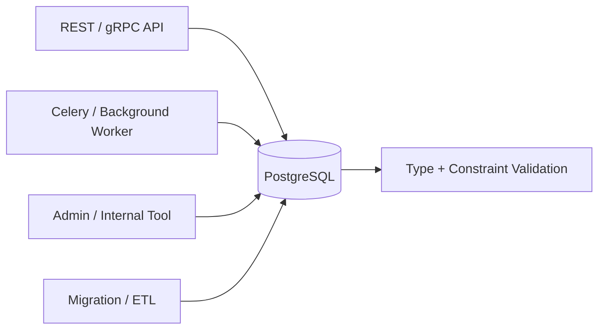
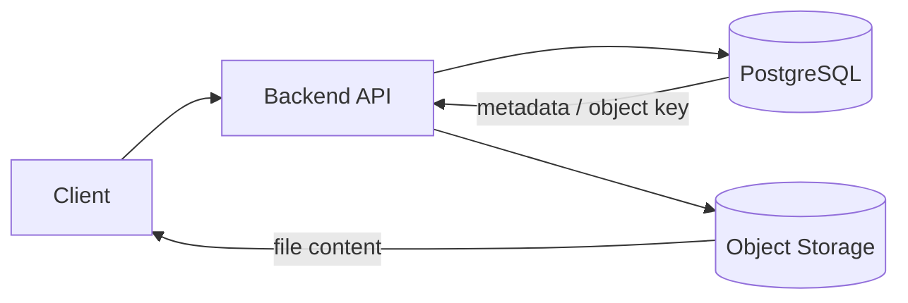
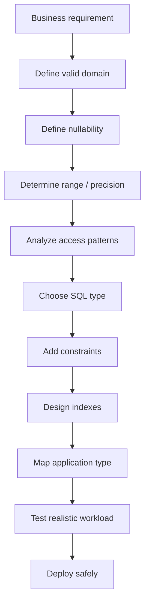

# 17- Common Data Type Mistakes

## Overview

Choosing a SQL data type is a schema design decision, not merely a storage decision. The chosen type determines which values are valid, how much storage is required, how comparisons behave, which indexes are possible, how applications serialize data, and how easily the schema can evolve.

Many production database problems originate from incorrect type selection:

- Money stored as floating-point values.
- UUIDs stored as arbitrary strings.
- Timestamps stored without timezone semantics.
- Boolean state represented by ambiguous integers or strings.
- Frequently queried attributes hidden inside JSON.
- Identifiers stored in unnecessarily large types.
- Text columns used where constrained values or enums are more appropriate.
- `NULL` used without a clear semantic distinction from an actual value.
- Precision and scale chosen without understanding business limits.
- Database-specific types adopted without considering ORM and migration behavior.

A useful engineering model is:

```text
Business meaning
      ↓
Valid value domain
      ↓
Required precision / range
      ↓
Nullability
      ↓
Database type
      ↓
Constraints
      ↓
Indexes and access patterns
      ↓
Application / ORM representation
```

The goal is not to choose the smallest possible type. The goal is to choose the **smallest type that correctly represents the domain while supporting expected access patterns and future growth**.

## Data Type Mistakes at a Glance

| Mistake | Typical consequence | Preferred approach |
|---|---|---|
| Money stored as `float` | Rounding errors | `numeric` / `decimal` |
| UUID stored as `text` | Weak validation and larger storage | Native `uuid` |
| IP address stored as `text` | No network semantics | `inet` / `cidr` |
| Timestamp stored as `date` | Lost time-of-day information | Appropriate timestamp type |
| Timestamp without timezone semantics | Ambiguous instants | `timestamptz` for instants in PostgreSQL |
| Boolean stored as strings | Inconsistent values | `boolean` |
| IDs stored as `int` without capacity analysis | Future overflow/migration risk | `bigint` where appropriate |
| Everything stored as `text` | Weak constraints and poor semantics | Domain-appropriate types |
| Large binary data stored casually in DB | Database growth and operational cost | Evaluate object storage |
| JSON used for relational data | Difficult constraints and joins | Normalized relational schema |
| Arrays used for relationships | Poor relational integrity | Junction tables |
| Excessive `NULL` usage | Ambiguous application semantics | Explicit nullability policy |
| Wrong precision/scale | Overflow or unwanted rounding | Derive from domain requirements |
| Database-specific types without planning | Vendor lock-in | Deliberate platform-specific design |

## Treat Types as Domain Constraints

A database column should communicate what the value means.

Compare:

```sql
CREATE TABLE users (
    id text,
    age text,
    active text
);
```

with:

```sql
CREATE TABLE users (
    id uuid PRIMARY KEY,
    age smallint CHECK (age >= 0),
    active boolean NOT NULL
);
```

The second schema rejects invalid representations closer to the database boundary.

This matters because data enters a production database through multiple paths:



Application validation is useful, but database constraints provide the final integrity boundary.

## Using `text` for Everything

One of the most common mistakes is defaulting to `text` because it appears flexible.

For example:

```sql
CREATE TABLE orders (
    id text,
    total text,
    paid text,
    created_at text
);
```

This loses valuable database semantics.

The database cannot naturally enforce that:

```text
total      → numeric
paid       → boolean
created_at → timestamp
id         → UUID
```

A better design is:

```sql
CREATE TABLE orders (
    id uuid PRIMARY KEY,
    total numeric(19, 4) NOT NULL,
    paid boolean NOT NULL DEFAULT false,
    created_at timestamptz NOT NULL DEFAULT now()
);
```

### Why this mistake happens

Developers often think:

> "The application knows what the value means."

Production systems have multiple writers, migrations, reporting queries, administrative operations, imports, and integrations. The database should retain as much semantic information as practical.

### Production impact

Using overly generic types can cause:

- Invalid values reaching persistent storage.
- More application-side conversion.
- Less effective indexing.
- More complex queries.
- Difficult migrations later.
- Inconsistent representations across services.

## Using Floating Point for Money

Do not normally store monetary amounts as floating-point values.

Avoid:

```sql
price double precision
```

for financial amounts where exact decimal arithmetic is required.

Prefer:

```sql
price numeric(19, 4)
```

or an integer minor-unit representation where appropriate:

```sql
price_minor_units bigint
currency_code char(3)
```

For example:

```text
USD 19.99
```

can be represented as:

```text
price_minor_units = 1999
currency_code = USD
```

The correct choice depends on the domain.

### Why floating point is dangerous

Binary floating-point formats cannot represent many decimal fractions exactly.

Conceptually:

```text
Decimal 0.1
     ↓
Binary floating-point approximation
     ↓
Stored value is close to, but not exactly, 0.1
```

Repeated arithmetic can therefore produce unexpected results.

For financial systems, exact decimal semantics are generally more important than the small storage or computational advantages of floating point.

## Choosing the Wrong Integer Size

Using an integer type that cannot accommodate expected growth can force an expensive migration.

For example:

```sql
id integer
```

may be sufficient for a small system, but PostgreSQL `integer` is limited to approximately 2.1 billion positive values.

A high-volume system may instead use:

```sql
id bigint GENERATED ALWAYS AS IDENTITY PRIMARY KEY
```

### Do not overreact

This does not mean every numeric column should automatically become `bigint`.

Consider:

```text
country_code
HTTP status
small bounded counters
```

These may have much smaller valid ranges.

The correct question is:

> What is the maximum valid value, and what is the expected growth rate?

## Using Signed Types for Naturally Non-Negative Values

Many domains have values that cannot logically be negative:

```text
quantity
inventory
age
retry_count
file_size
```

Choosing an integer type alone does not necessarily communicate that rule.

Use a constraint where appropriate:

```sql
quantity integer NOT NULL CHECK (quantity >= 0)
```

This prevents invalid states from entering the database.

### Important distinction

A type defines a **technical range**.

A constraint defines a **business-valid range**.

For example:

```sql
age smallint CHECK (age BETWEEN 0 AND 150)
```

The database type might allow values outside that range, but the domain does not.

## Incorrect Character Type Selection

Not all strings have the same requirements.

Common choices include:

```text
char(n)
varchar(n)
text
```

In PostgreSQL, `text` and `varchar` have similar performance characteristics for ordinary storage and retrieval. A `varchar(n)` length constraint can still be useful when the maximum length is part of the domain contract.

For example:

```sql
country_code char(2) NOT NULL
```

may be appropriate when the domain explicitly requires exactly two characters.

Avoid using:

```sql
varchar(255)
```

simply because it is a common convention.

The number `255` has no inherent engineering significance for most modern relational schemas.

## Misunderstanding `CHAR`

`char(n)` is fixed-length character storage with space-padding semantics.

It is often chosen because developers assume:

```text
CHAR = faster
VARCHAR = slower
```

This is generally not a sound PostgreSQL design rule.

Use fixed-length character types when fixed-length semantics are genuinely meaningful.

Otherwise, a variable-length type is usually clearer.

## Using Case-Sensitive Text for Case-Insensitive Identifiers

Suppose email addresses or external identifiers should be treated case-insensitively.

A schema such as:

```sql
email text UNIQUE
```

does not automatically establish application-level case-insensitive uniqueness.

Depending on the domain and PostgreSQL configuration, possible approaches include:

- Normalizing values in the application.
- Functional unique indexes.
- Appropriate collations.
- PostgreSQL-specific types such as `citext` where suitable.

For example:

```sql
CREATE UNIQUE INDEX users_email_lower_idx
ON users (lower(email));
```

The important principle is to define the uniqueness semantics explicitly.

Do not assume string equality matches business equality.

## Storing UUIDs as Strings

Avoid:

```sql
id varchar(36)
```

when the value is actually a UUID.

Prefer:

```sql
id uuid PRIMARY KEY
```

A native UUID type provides stronger validation and more appropriate storage semantics.

This also avoids allowing invalid values such as:

```text
"abc"
"123"
"not-a-uuid"
```

into a column that is supposed to contain UUIDs.

## Using Strings for IP Addresses

Avoid:

```sql
client_ip text
```

when IP-specific operations are required.

Prefer PostgreSQL's:

```sql
client_ip inet
```

This allows network-aware operators and functions.

For network ranges:

```sql
network cidr
```

is often more appropriate.

The type should reflect whether the column represents:

```text
A host address → inet
A network block → cidr
```

## Incorrect Date and Time Modeling

Date/time bugs are among the most expensive data modeling mistakes because they often appear only across regions and daylight-saving transitions.

Do not blindly use:

```sql
created_at timestamp
```

for an event representing an absolute instant.

In PostgreSQL, a common production choice is:

```sql
created_at timestamptz NOT NULL DEFAULT now()
```

This represents an instant in time and lets PostgreSQL handle timezone conversion according to the session timezone when displaying values.

### Distinguish the domain

| Requirement | Suitable concept |
|---|---|
| Calendar date | `date` |
| Local wall-clock time | `time` |
| Absolute instant | `timestamptz` |
| Timestamp without timezone semantics | `timestamp` |
| Duration | `interval` |

Do not store timezone names inside an ordinary timestamp column and assume the database can reconstruct the original instant.

## Storing Local Time Without Context

Consider:

```sql
appointment_time timestamp
```

What does:

```text
2026-08-31 09:00
```

mean?

It could mean:

```text
09:00 IST
09:00 UTC
09:00 America/New_York
```

Without context, the value is ambiguous.

For an appointment that occurs at a specific instant, use an appropriate timezone-aware representation and establish clear API semantics.

For recurring business events tied to a local timezone, you may need to store both:

```text
local time
timezone identifier
```

and compute actual instants when necessary.

## Confusing `NULL` With Zero or Empty Values

These are not equivalent:

```text
NULL
0
''
false
```

For example:

```sql
discount numeric(10, 2)
```

might interpret:

```text
NULL → discount was not specified / not applicable
0    → explicitly no discount
```

Replacing all `NULL` values with zero destroys that distinction.

Similarly:

```text
NULL → unknown
''   → known to be empty
```

The correct semantic depends on the domain.

## Overusing `NULL`

The opposite mistake is making nearly every column nullable:

```sql
CREATE TABLE orders (
    id uuid,
    customer_id uuid,
    status text,
    created_at timestamptz,
    total numeric,
    currency text
);
```

This creates many possible invalid or ambiguous states.

If a value is mandatory, prefer:

```sql
customer_id uuid NOT NULL
status order_status NOT NULL
created_at timestamptz NOT NULL
total numeric(19, 4) NOT NULL
currency_code char(3) NOT NULL
```

Nullability should be an intentional part of the domain model.

## Using `NOT NULL` Without Defaults

A common migration problem occurs when a new required column is added to an existing populated table.

This migration can fail:

```sql
ALTER TABLE orders
ADD COLUMN created_at timestamptz NOT NULL;
```

Existing rows have no value.

A safer migration strategy may involve:

```sql
ALTER TABLE orders
ADD COLUMN created_at timestamptz;

UPDATE orders
SET created_at = ...;

ALTER TABLE orders
ALTER COLUMN created_at SET NOT NULL;
```

The exact strategy depends on table size, locking behavior, data quality, and deployment architecture.

For large production tables, schema migrations should be designed to avoid long blocking operations.

## Using JSON for Relational Data

JSONB is powerful, but it is frequently used as an escape hatch from schema design.

Avoid turning this:

```sql
orders (
    id uuid,
    customer_id uuid,
    status text
)
```

into:

```sql
orders (
    id uuid,
    data jsonb
)
```

when `customer_id` and `status` are stable, frequently queried relational attributes.

Relational columns provide:

- Stronger typing.
- Foreign keys.
- Constraints.
- Straightforward indexing.
- Clear query semantics.

Use JSONB for genuinely flexible attributes, not for avoiding schema decisions.

## Putting Frequently Queried Data Inside JSONB

Consider:

```json
{
  "customer_id": "123",
  "status": "paid",
  "country": "IN"
}
```

If production queries constantly filter by:

```sql
customer_id
status
country
```

these may deserve first-class columns.

JSONB indexes can help, but they should not automatically be used to compensate for poor schema design.

A good model often looks like:

```text
Stable / relational attributes
        ↓
Normal columns

Flexible / optional metadata
        ↓
JSONB
```

## Using Arrays Instead of Relationships

This schema:

```sql
CREATE TABLE users (
    id bigint PRIMARY KEY,
    project_ids bigint[]
);
```

may look convenient.

But if projects are independently managed entities, it loses relational semantics.

A normalized design is:

```sql
CREATE TABLE user_projects (
    user_id bigint NOT NULL,
    project_id bigint NOT NULL,
    PRIMARY KEY (user_id, project_id)
);
```

This supports:

- Foreign keys.
- Referential integrity.
- Efficient relationship queries.
- Additional relationship attributes.
- Independent indexing.

Arrays are better suited to small collections owned by a row rather than entity relationships.

## Choosing Enum Types Without Considering Change Frequency

Enums can enforce a controlled set of values.

For example:

```sql
CREATE TYPE order_status AS ENUM (
    'pending',
    'paid',
    'cancelled',
    'refunded'
);
```

This can be appropriate for stable domain states.

However, status values frequently evolve in real systems.

If the business constantly introduces new statuses, a lookup table may provide more operational flexibility:

```sql
CREATE TABLE order_statuses (
    code text PRIMARY KEY,
    description text NOT NULL
);
```

### Decision

| Requirement | Consider |
|---|---|
| Small, stable set of values | Enum |
| Frequently changing values | Lookup/reference table |
| User-configurable values | Reference table |
| Complex state transitions | Domain model + constraints/workflow |

The important issue is not whether enums are "good" or "bad". It is whether the lifecycle of the values matches the operational characteristics of the type.

## Ignoring Precision and Scale

For:

```sql
numeric(10, 2)
```

the values mean:

```text
precision = 10
scale     = 2
```

Therefore, there are 8 digits available before the decimal point.

A common mistake is selecting precision based on the current data rather than the maximum valid business value.

For example:

```sql
amount numeric(10, 2)
```

may work during initial development and later fail when the system begins handling larger transactions.

Define precision from:

```text
Maximum business value
+
Required decimal places
+
Expected growth / regulatory requirements
```

## Implicit Type Conversion

Queries can become problematic when application values and database columns have mismatched types.

For example, if a numeric identifier is stored as:

```sql
id bigint
```

the application should bind a numeric parameter rather than repeatedly treating it as arbitrary text.

Parameter binding also avoids SQL injection risks and lets the database handle type conversion correctly.

Prefer:

```python
cursor.execute(
    "SELECT id, status FROM orders WHERE id = %s",
    [order_id],
)
```

over string construction.

## Comparing Different Numeric Types

Mixing types carelessly can introduce:

- Implicit casts.
- Unexpected precision behavior.
- Less efficient query plans in some cases.
- Hard-to-understand application behavior.

Keep domain representations consistent.

For example:

```text
Database → bigint
Python → int
API → JSON number/string according to explicit contract
```

For monetary values:

```text
Database → numeric
Python → Decimal
```

is generally preferable to converting through floating-point values.

## Python `float` vs `Decimal`

A common backend mistake is mapping a database `numeric` value into Python `float`.

Prefer:

```python
from decimal import Decimal

amount = Decimal("19.99")
```

rather than:

```python
amount = float("19.99")
```

This keeps decimal arithmetic aligned with the database's exact numeric semantics.

For Django:

```python
from django.db import models

class Invoice(models.Model):
    total = models.DecimalField(
        max_digits=19,
        decimal_places=4,
    )
```

The database and application should agree on the representation.

## Treating API Types and Database Types as Identical

An API contract and a database schema serve different purposes.

For example, a database may use:

```sql
bigint
```

while an API may expose:

```json
{
  "id": "9007199254740993"
}
```

when interoperability with JavaScript clients makes numeric precision a concern.

Similarly:

```text
PostgreSQL timestamptz
```

may be represented in an API as an RFC 3339 timestamp.

The important principle is:

```text
Database representation
        ≠
API representation
        ≠
In-memory representation
```

Define explicit conversion boundaries.

## Ignoring Index Implications

A type decision also affects indexes.

Consider:

```sql
CREATE INDEX orders_metadata_idx
ON orders USING gin (metadata);
```

A specialized index can be valuable, but indexes increase:

- Storage.
- Write amplification.
- Maintenance work.
- Vacuum workload.
- Backup size.

Do not index every specialized column automatically.

Use actual query patterns and validate with:

```sql
EXPLAIN (ANALYZE, BUFFERS)
SELECT ...
```

## Choosing a Type Based Only on Storage Size

A smaller type is not automatically better.

For example:

```text
smallint → 2 bytes
integer  → 4 bytes
bigint   → 8 bytes
```

Storage matters at scale, but other factors matter too:

- Maximum valid range.
- Arithmetic behavior.
- Index size.
- Application compatibility.
- Expected growth.
- Migration cost.
- Query patterns.

A premature optimization that saves a few bytes can create an expensive migration later.

## Storing Large Files Directly in SQL

Binary database types can store files, but that does not automatically make them the best architecture.

For large objects such as:

```text
Images
Videos
Backups
Documents
Large exports
```

object storage such as Amazon S3 is often a better architectural fit.

A common design is:



The database stores metadata:

```sql
CREATE TABLE documents (
    id uuid PRIMARY KEY,
    object_key text NOT NULL,
    content_type text NOT NULL,
    size_bytes bigint NOT NULL
);
```

while object storage handles the large payload.

This separates transactional metadata from high-volume blob storage.

## Ignoring Database-Specific Types

The opposite of overusing generic types is refusing to use database-specific types even when they provide clear value.

For PostgreSQL, examples include:

```text
uuid
jsonb
inet
cidr
tstzrange
tsvector
```

Replacing a native type with `text` may sacrifice:

- Validation.
- Native operators.
- Specialized indexes.
- Query expressiveness.
- Storage efficiency.

Database-specific types should be evaluated deliberately rather than avoided categorically.

## Ignoring Portability

Database-specific features can create vendor lock-in.

For example:

```text
PostgreSQL jsonb
PostgreSQL arrays
PostgreSQL range types
PostGIS
PostgreSQL enums
```

may require significant changes when moving to another database engine.

This is acceptable when PostgreSQL is an intentional platform decision.

It becomes a problem when the team assumes the schema is portable while silently depending on PostgreSQL behavior.

Document important vendor dependencies.

## Weak Constraints

A schema containing:

```sql
status text
```

allows:

```text
pending
Pending
PENDING
pendng
completed
done
```

unless additional controls exist.

Possible solutions include:

```sql
CHECK (status IN (...))
```

an enum, or a reference table.

For example:

```sql
status text NOT NULL
    CHECK (status IN ('pending', 'paid', 'cancelled'))
```

Constraints should encode invariants that must always hold.

## Common Constraint Mistakes

| Mistake | Problem | Better approach |
|---|---|---|
| Nullable primary identifiers | Ambiguous identity | Primary keys are inherently non-null |
| No `NOT NULL` on required columns | Invalid incomplete rows | Declare mandatory attributes |
| No range checks | Impossible domain values | Add `CHECK` constraints |
| Application-only validation | Other writers bypass validation | Enforce critical invariants in DB |
| String status without constraint | Typos create new states | Enum, lookup table, or `CHECK` |
| No foreign key | Orphaned references | Add referential integrity where appropriate |
| Generic text for structured identifiers | Invalid formats | Native/specific type or constraint |

## Migration Mistakes

Data type decisions become particularly dangerous during schema migrations.

Common mistakes include:

### Changing Types Without Auditing Existing Data

Before:

```sql
amount text
```

After:

```sql
amount numeric(19, 4)
```

Existing values may contain:

```text
"$19.99"
"N/A"
"unknown"
"19,99"
```

A direct cast can fail.

First identify and clean invalid data.

### Performing Large Blocking Conversions

Large tables may make:

```sql
ALTER TABLE ...
```

operations expensive or blocking.

For high-traffic systems, consider:

- Expand/contract migrations.
- Backfill in batches.
- Temporary compatibility columns.
- Dual writes when necessary.
- Online index creation where supported.
- Carefully planned deployment sequencing.

### Deploying Application and Schema Changes in the Wrong Order

A safer production pattern is often:

```text
Backward-compatible schema
        ↓
Deploy application that understands old + new schema
        ↓
Backfill / migrate data
        ↓
Switch reads/writes
        ↓
Remove obsolete schema
```

This is particularly important for rolling deployments across Kubernetes or other multi-instance environments.

## ORM-Specific Mistakes

ORMs reduce boilerplate but can hide database-specific behavior.

Common problems include:

- Assuming ORM field types map identically across databases.
- Ignoring generated SQL.
- Using generic fields when PostgreSQL-specific fields are required.
- Performing expensive casts in application code.
- Assuming migrations are always online.
- Not testing constraints against production-like data.

For Django, inspect generated migrations:

```bash
python manage.py makemigrations
python manage.py sqlmigrate app_name 0005
```

The second command is particularly useful for understanding the SQL generated by a migration.

## Production Type Selection Process

A practical schema design process is:



This prevents the common pattern of:

```text
Create table quickly
       ↓
Use text everywhere
       ↓
Application grows
       ↓
Queries become complex
       ↓
Data becomes inconsistent
       ↓
Expensive migration
```

## Data Type Review Checklist

Before approving a production schema, review each important column.

### Domain

- What does the value represent?
- What values are valid?
- Can the value be negative?
- Is the value bounded?
- Is the value optional?

### Representation

- Is there a native SQL type?
- Is precision required?
- Is timezone information required?
- Is exact decimal arithmetic required?
- Does the value have structured semantics?

### Integrity

- Should the column be `NOT NULL`?
- Does it need a `CHECK` constraint?
- Does it need a foreign key?
- Should uniqueness be enforced?
- Should an enum or reference table be used?

### Performance

- How frequently is the column queried?
- Will it be indexed?
- How large can the values become?
- What is the impact on row size?
- What is the impact on indexes and writes?

### Application

- How does Python represent the value?
- How does Django/FastAPI/SQLAlchemy map it?
- How will REST and gRPC APIs serialize it?
- Are there JavaScript numeric precision concerns?
- Are conversions explicit?

### Operations

- Can the type be migrated safely?
- Does it depend on PostgreSQL-specific functionality?
- Is the type supported by the production database service?
- Does backup/restore preserve it correctly?
- Can monitoring and debugging tools inspect it effectively?

## Interview Traps

### "Should money always use `bigint`?"

Not necessarily.

Money can be represented as:

```text
numeric/decimal
```

or:

```text
integer minor units
```

depending on the domain.

The important requirement is exact monetary semantics.

### "Is `varchar(255)` better than `text`?"

Not inherently.

In PostgreSQL, the performance difference is generally not a reason to choose one over the other. Use a length constraint when the business domain actually has a meaningful maximum.

### "Should every nullable value become zero?"

No.

`NULL` can represent unknown, missing, or not applicable. Replacing it with zero changes semantics.

### "Are database constraints redundant if Django validates the data?"

No.

Application validation protects the normal request path. Database constraints protect the persistent data regardless of which application component writes it.

### "Should JSONB replace normalization?"

No.

JSONB is useful for flexible data. Stable, relational, frequently queried entities generally benefit from ordinary columns and relationships.

### "Is a smaller type always faster?"

No.

Storage size matters, particularly for large tables and indexes, but correctness, range, query behavior, migration cost, and application compatibility also matter.

## Key Takeaways

- **Choose data types from domain semantics, valid ranges, precision, nullability, and access patterns—not from convenience or habit.**
- **Avoid generic representations such as `text` or JSONB when native types and relational structures provide stronger integrity and better query behavior.**
- **Treat monetary values, timestamps, UUIDs, booleans, NULL semantics, and precision/scale as high-risk areas requiring explicit design decisions.**
- **Database constraints, types, and indexes form part of the application's integrity and performance boundary; ORM validation alone is not sufficient.**
- **A production-ready type decision considers current correctness, future growth, query performance, ORM/API mappings, migration strategy, and operational cost.**