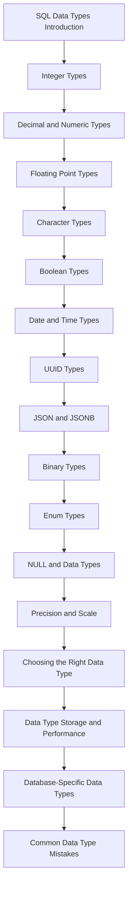

# README

## Overview

SQL data types define the valid representation of data stored in a relational database. Choosing the correct type affects data integrity, storage requirements, query behavior, indexing, application compatibility, schema evolution, and long-term operational cost.

This section focuses primarily on PostgreSQL-oriented SQL data modeling, while connecting database types to backend applications such as Python, Django, FastAPI, REST APIs, and microservices.

The documents progress from type fundamentals through specific data types, production trade-offs, and common design mistakes.

## Navigation

- [01- SQL Data Types Introduction](./01-%20SQL%20Data%20Types%20Introduction.md) — Data type fundamentals, type selection, domain modeling, and database/application boundaries
- [02- Integer Types](./02-%20Integer%20Types.md) — Integer ranges, signed values, identity columns, and capacity planning
- [03- Decimal and Numeric Types](./03-%20Decimal%20and%20Numeric%20Types.md) — Exact decimal arithmetic, NUMERIC, monetary values, precision, and scale
- [04- Floating Point Types](./04-%20Floating%20Point%20Types.md) — REAL, DOUBLE PRECISION, approximation, numerical accuracy, and scientific workloads
- [05- Character Types](./05-%20Character%20Types.md) — CHAR, VARCHAR, TEXT, length constraints, encoding, and string semantics
- [06- Boolean Types](./06-%20Boolean%20Types.md) — Boolean representation, three-valued logic, NULL, defaults, and application mappings
- [07- Date and Time Types](./07-%20Date%20and%20Time%20Types.md) — Dates, timestamps, time zones, intervals, UTC, and distributed-system time handling
- [08- UUID Types](./08-%20UUID%20Types.md) — UUID representation, identifiers, generation strategies, indexing, and distributed systems
- [09- JSON and JSONB](./09-%20JSON%20and%20JSONB.md) — Semi-structured data, PostgreSQL JSONB, indexing, querying, and relational boundaries
- [10- Binary Types](./10-%20Binary%20Types.md) — Binary data, bytea, large objects, application handling, and object-storage trade-offs
- [11- Enum Types](./11-%20Enum%20Types.md) — PostgreSQL enums, controlled vocabularies, schema evolution, and lookup-table alternatives
- [12- NULL and Data Types](./12-%20NULL%20and%20Data%20Types.md) — Nullability, three-valued logic, missing versus empty values, defaults, and constraints
- [13- Precision and Scale](./13-%20Precision%20and%20Scale.md) — Numeric precision, decimal scale, capacity planning, rounding, and financial data
- [14- Choosing the Right Data Type](./14-%20Choosing%20the%20Right%20Data%20Type.md) — Practical type-selection methodology based on domain, constraints, performance, and growth
- [15- Data Type Storage and Performance](./15-%20Data%20Type%20Storage%20and%20Performance.md) — Row size, indexes, storage overhead, cache behavior, and query performance
- [16- Database-Specific Data Types](./16-%20Database-Specific%20Data%20Types.md) — PostgreSQL-specific types, portability, vendor lock-in, and production trade-offs
- [17- Common Data Type Mistakes](./17-%20Common%20Data%20Type%20Mistakes.md) — Production pitfalls, incorrect type choices, migration problems, and ORM issues

## Recommended Reading Order

The files are intentionally ordered from foundational type concepts toward production-level design decisions.



## Type Selection Framework

When designing a column, evaluate the decision in this order:

| Concern | Question |
|---|---|
| Domain | What does the value actually represent? |
| Validity | Which values are valid? |
| Range | What is the minimum and maximum possible value? |
| Precision | Does the value require exact decimal representation? |
| Nullability | Is absence different from zero, empty, or false? |
| Semantics | Does the database provide a native type for the value? |
| Querying | How will the value be filtered, sorted, joined, or aggregated? |
| Indexing | Will the column participate in indexes? |
| Growth | Could the current type become insufficient? |
| Application mapping | How will Python, Django, FastAPI, or another service represent it? |
| API contract | How should the value be serialized over REST or gRPC? |
| Portability | Is a database-specific type an intentional dependency? |
| Migration | Can the type be changed safely after the table contains production data? |

## Backend Engineering Context

A database type is only one part of the complete data representation:

```text
                Database
                   │
                   ▼
             SQL Data Type
                   │
                   ▼
              ORM / Driver
                   │
                   ▼
           Application Object
                   │
                   ▼
             API Contract
                   │
                   ▼
        Client / Other Service
```

For example, a monetary value may be represented as:

```text
PostgreSQL       → numeric(19, 4)
Python           → Decimal
Django           → DecimalField
REST API         → Explicit decimal representation
JSON serializer  → Carefully defined contract
```

The database schema and application model should agree on the value's semantics, while API serialization should be treated as a separate contract.

## Production Priorities

A production data type should provide more than syntactic validity.

Prioritize:

- **Correctness** — represent the domain without loss of information.
- **Integrity** — reject invalid values at the database boundary where appropriate.
- **Performance** — consider row size, indexes, sorting, joins, and query execution.
- **Scalability** — account for expected data volume and value growth.
- **Reliability** — make invalid or ambiguous states difficult to persist.
- **Operability** — ensure migrations, backups, restores, and monitoring remain manageable.
- **Compatibility** — understand ORM, driver, API, and cross-service representations.
- **Maintainability** — prefer explicit semantics over generic storage formats.
- **Portability** — use database-specific capabilities deliberately rather than accidentally.

## Related Data Modeling Concepts

Data types should not be designed in isolation. They interact directly with:

- `NOT NULL` constraints
- `CHECK` constraints
- Primary keys
- Foreign keys
- Unique constraints
- Indexes
- Default values
- Generated columns
- JSON/JSONB modeling
- Normalization
- Schema migrations
- ORM field mappings

A strong schema combines these mechanisms:

```text
Data Type
    +
Nullability
    +
Constraints
    +
Relationships
    +
Indexes
    +
Access Patterns
    =
Production-Ready Data Model
```

## Key Takeaways

- **Use this section to progress from SQL type fundamentals to production-grade data type decisions.**
- **Choose types according to domain semantics, valid ranges, precision, nullability, access patterns, and expected growth.**
- **Treat database types, constraints, indexes, ORM mappings, and API representations as interconnected design decisions.**
- **Prefer strong native types and explicit constraints over generic representations such as unrestricted text or JSONB.**
- **Production data type choices should account for correctness, performance, scalability, migrations, application compatibility, and operational cost.**