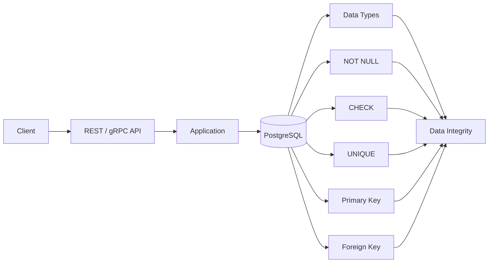
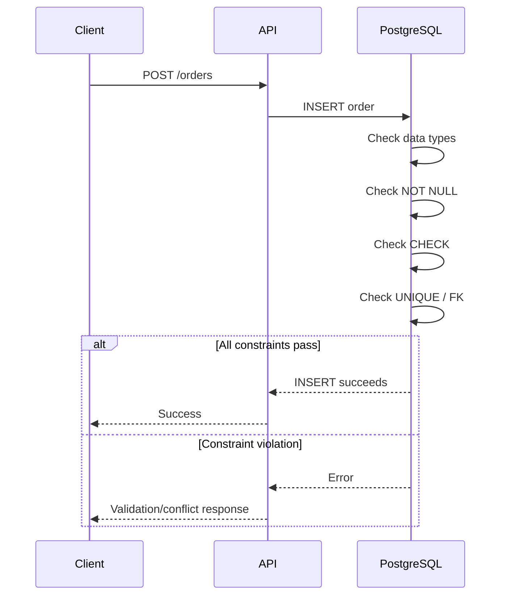

# 01- Constraints Introduction

## Overview

Database constraints are rules enforced by the database to protect the integrity and validity of stored data. They define which states are allowed in a relational schema and prevent invalid data from entering through application bugs, concurrent requests, administrative scripts, background workers, or other services.

Constraints belong at the database boundary because application-level validation alone is not sufficient. A Django or FastAPI service may validate an incoming request, but the database is the final authority shared by every writer.

A production schema commonly combines:

- Data types to define the representation of a value
- `NOT NULL` to control whether a value may be absent
- `CHECK` constraints to enforce domain rules
- `UNIQUE` constraints to enforce uniqueness
- Primary keys to identify rows
- Foreign keys to enforce relationships
- Defaults to provide values when appropriate
- Exclusion constraints for more advanced PostgreSQL integrity rules



## Why Constraints Matter

Without database constraints, invalid application state can become persistent data.

Consider an order table:

```sql
CREATE TABLE orders (
    id bigint GENERATED ALWAYS AS IDENTITY,
    customer_id bigint,
    status text,
    total numeric(19, 4),
    PRIMARY KEY (id)
);
```

Nothing prevents the database from accepting:

```text
status = 'something_invalid'
total = -500
customer_id = 999999999
```

The application may intend to prevent these states, but another process can still write directly to the database.

A stronger design moves invariant enforcement into the schema:

```sql
CREATE TABLE orders (
    id bigint GENERATED ALWAYS AS IDENTITY,
    customer_id bigint NOT NULL,
    status text NOT NULL,
    total numeric(19, 4) NOT NULL,
    PRIMARY KEY (id),
    CHECK (status IN ('pending', 'paid', 'cancelled')),
    CHECK (total >= 0)
);
```

The database now rejects invalid states regardless of which application or process attempts the write.

## Types of Constraints

| Constraint | Primary purpose | Typical use |
|---|---|---|
| `NOT NULL` | Prevent missing values | Required attributes |
| `CHECK` | Enforce row-level predicates | Valid ranges and states |
| `UNIQUE` | Prevent duplicate values | Email addresses, external IDs |
| `PRIMARY KEY` | Uniquely identify rows | Entity identity |
| `FOREIGN KEY` | Enforce relationships | Orders → customers |
| `DEFAULT` | Supply a value when omitted | Timestamps, initial status |
| `EXCLUDE` | Prevent conflicting values | Overlapping reservations |

A single column can participate in multiple constraints.

For example:

```sql
email text NOT NULL UNIQUE
```

means:

- The value cannot be `NULL`.
- Two rows cannot contain the same email value.

## Constraint Enforcement

Constraints are checked by the database during relevant write operations.



Constraint enforcement is part of the database's transactional behavior. Under concurrent writes, the database coordinates constraint checks using its transaction and locking mechanisms rather than relying on application-level checks.

This distinction is critical for uniqueness.

An application check such as:

```sql
SELECT 1
FROM users
WHERE email = 'user@example.com';
```

followed by an `INSERT` is subject to a race:

```text
Transaction A: email does not exist
Transaction B: email does not exist
Transaction A: INSERT
Transaction B: INSERT
```

A `UNIQUE` constraint provides the authoritative protection against this race.

## `NOT NULL`

`NOT NULL` specifies that a column must contain a value.

```sql
CREATE TABLE users (
    id bigint GENERATED ALWAYS AS IDENTITY PRIMARY KEY,
    email text NOT NULL
);
```

An attempt to insert a missing email fails:

```sql
INSERT INTO users DEFAULT VALUES;
```

Use `NOT NULL` when absence is not a valid domain state.

Do not use it merely because an ORM field is usually populated. Determine whether the business domain actually permits absence.

### `NOT NULL` and Empty Values

`NULL`, an empty string, zero, and `false` are different states.

```text
NULL       → value is absent/unknown
''         → value is an empty string
0          → numeric value zero
false      → Boolean false
```

For example, if a customer's display name is required, `NOT NULL` does not necessarily prevent:

```sql
display_name = ''
```

A separate `CHECK` constraint may be appropriate:

```sql
display_name text NOT NULL
    CHECK (length(trim(display_name)) > 0)
```

## `CHECK` Constraints

A `CHECK` constraint requires a Boolean expression to evaluate successfully for a row.

```sql
CREATE TABLE products (
    id bigint GENERATED ALWAYS AS IDENTITY PRIMARY KEY,
    price numeric(19, 4) NOT NULL,
    stock integer NOT NULL,
    CHECK (price >= 0),
    CHECK (stock >= 0)
);
```

This is appropriate for invariants that depend on values within the same row.

Examples:

```sql
CHECK (quantity > 0)

CHECK (discount_percent >= 0 AND discount_percent <= 100)

CHECK (start_at < end_at)

CHECK (status IN ('pending', 'active', 'disabled'))
```

### Important `CHECK` Semantics

A `CHECK` expression passes when it evaluates to `TRUE` **or `NULL`**.

For example:

```sql
CHECK (age >= 18)
```

does not by itself prevent:

```sql
age = NULL
```

If `NULL` is invalid, combine the constraint with `NOT NULL`:

```sql
age integer NOT NULL CHECK (age >= 18)
```

This is a common interview and production trap.

### What `CHECK` Should Not Do

Do not use a simple `CHECK` constraint to enforce rules that depend on other rows.

For example, this kind of rule is not appropriate for a normal row-level `CHECK`:

```text
A customer cannot have more than three active subscriptions.
```

The rule depends on multiple rows. Use appropriate database mechanisms such as:

- Unique indexes
- Partial indexes
- Exclusion constraints
- Transactions
- Triggers
- Explicit application workflows

depending on the invariant.

## `UNIQUE` Constraints

A `UNIQUE` constraint ensures that duplicate values are rejected.

```sql
CREATE TABLE users (
    id bigint GENERATED ALWAYS AS IDENTITY PRIMARY KEY,
    email text NOT NULL UNIQUE
);
```

A duplicate insert fails:

```sql
INSERT INTO users (email)
VALUES ('user@example.com');
```

The constraint is especially important for values used as business identifiers or lookup keys.

Typical examples:

- Email addresses
- Payment-provider customer IDs
- External resource IDs
- Idempotency keys
- Tenant-specific usernames
- API identifiers

### Composite Uniqueness

Uniqueness can apply to multiple columns together:

```sql
CREATE TABLE memberships (
    user_id bigint NOT NULL,
    organization_id bigint NOT NULL,
    UNIQUE (user_id, organization_id)
);
```

This allows the same user and organization IDs individually but prevents duplicate membership pairs.

### `NULL` and `UNIQUE`

In PostgreSQL, a standard unique constraint allows multiple `NULL` values because `NULL` values are not considered equal under normal unique semantics.

If the business rule requires a value to be present and unique:

```sql
email text NOT NULL UNIQUE
```

Do not rely on `UNIQUE` alone.

For optional values, PostgreSQL also supports specialized uniqueness behavior through indexes, including partial indexes and configurable `NULLS NOT DISTINCT` semantics in supported PostgreSQL versions.

## Primary Keys

A primary key identifies each row within a table.

```sql
CREATE TABLE users (
    id bigint GENERATED ALWAYS AS IDENTITY PRIMARY KEY
);
```

A primary key provides:

- Uniqueness
- Non-nullability
- A logical identity for the row
- A target for foreign-key relationships

A table can have only one primary key constraint, but that primary key can contain multiple columns.

```sql
PRIMARY KEY (tenant_id, user_id)
```

Primary keys are commonly indexed automatically by the database.

For most new PostgreSQL schemas, a surrogate `bigint` or UUID primary key is often simpler than using mutable business attributes as the primary key.

## Foreign Keys

A foreign key enforces referential integrity between tables.

```sql
CREATE TABLE customers (
    id bigint GENERATED ALWAYS AS IDENTITY PRIMARY KEY
);

CREATE TABLE orders (
    id bigint GENERATED ALWAYS AS IDENTITY PRIMARY KEY,
    customer_id bigint NOT NULL,
    FOREIGN KEY (customer_id)
        REFERENCES customers(id)
);
```

The database prevents an order from referencing a customer that does not exist.

Foreign keys protect against:

- Orphaned rows
- Invalid references
- Accidental deletion of referenced entities

### Foreign-Key Actions

PostgreSQL supports actions such as:

```sql
ON DELETE RESTRICT
ON DELETE CASCADE
ON DELETE SET NULL
```

For example:

```sql
CREATE TABLE order_items (
    id bigint GENERATED ALWAYS AS IDENTITY PRIMARY KEY,
    order_id bigint NOT NULL,
    FOREIGN KEY (order_id)
        REFERENCES orders(id)
        ON DELETE CASCADE
);
```

Deleting an order also deletes its order items.

Use cascading deletes deliberately. `CASCADE` can remove a large dependency tree unexpectedly if applied to high-value entities.

### Indexing Foreign Keys

A foreign key does not automatically imply that the referencing column has an index.

For frequently joined or deleted/updated parent rows, index the child-side foreign key when the access pattern benefits from it:

```sql
CREATE INDEX idx_orders_customer_id
ON orders (customer_id);
```

This can significantly improve joins and parent-row deletion/update checks on large tables.

## Defaults

A `DEFAULT` supplies a value when an `INSERT` does not provide one.

```sql
CREATE TABLE jobs (
    id bigint GENERATED ALWAYS AS IDENTITY PRIMARY KEY,
    status text NOT NULL DEFAULT 'pending',
    created_at timestamptz NOT NULL DEFAULT now()
);
```

Defaults are useful for values that have a deterministic database-side initial state.

They are not a substitute for constraints.

For example:

```sql
status text DEFAULT 'pending'
```

does not prevent someone from explicitly inserting:

```sql
status = 'invalid'
```

If only specific states are valid:

```sql
status text NOT NULL DEFAULT 'pending'
    CHECK (status IN ('pending', 'running', 'completed', 'failed'))
```

## Constraint Naming

Explicit constraint names improve migrations, observability, and debugging.

Instead of:

```sql
CREATE TABLE products (
    price numeric NOT NULL CHECK (price >= 0)
);
```

prefer:

```sql
CREATE TABLE products (
    price numeric NOT NULL,
    CONSTRAINT products_price_non_negative
        CHECK (price >= 0)
);
```

Example naming convention:

| Constraint | Example |
|---|---|
| Primary key | `users_pkey` |
| Foreign key | `orders_customer_id_fkey` |
| Unique | `users_email_key` |
| Check | `products_price_non_negative` |

Naming conventions should be consistent across the schema and migration tooling.

## Constraints and Application Validation

Application validation and database constraints solve different problems.

| Layer | Responsibility |
|---|---|
| API validation | Reject malformed requests early |
| Application validation | Provide user-friendly domain validation |
| Database constraints | Guarantee persistent data integrity |
| Database transaction | Guarantee atomic state transitions |

For example:

```text
HTTP request
    ↓
Pydantic / Django validation
    ↓
Business logic
    ↓
Transaction
    ↓
PostgreSQL constraints
    ↓
Committed state
```

A FastAPI or Django application should still validate input before issuing SQL because database errors are less useful to users.

However, the application should not assume its validation is the final integrity boundary.

### Handling Constraint Errors

Applications should translate expected constraint violations into appropriate API responses.

For example:

```text
UNIQUE violation
    ↓
HTTP 409 Conflict

CHECK violation
    ↓
HTTP 400 / 422 depending on API semantics

FOREIGN KEY violation
    ↓
HTTP 400 / 404 / 409 depending on the operation
```

The exact mapping should follow the API's established error contract.

## Constraints and Transactions

Constraints become especially important in concurrent systems.

Consider two requests attempting to create the same idempotency key:

```text
Request A ──┐
            ├── INSERT
Request B ──┘
```

Without a database uniqueness constraint, both requests may succeed.

With:

```sql
CREATE UNIQUE INDEX payments_idempotency_key_idx
ON payments (idempotency_key);
```

only one transaction can successfully establish the unique value.

The application should handle the resulting conflict deterministically rather than relying on a pre-insert existence check.

## Constraints and ORMs

ORMs expose many database constraints through application models.

Django example:

```python
from django.db import models


class Product(models.Model):
    name = models.CharField(max_length=200)
    price = models.DecimalField(max_digits=19, decimal_places=4)

    class Meta:
        constraints = [
            models.CheckConstraint(
                condition=models.Q(price__gte=0),
                name="product_price_non_negative",
            ),
            models.UniqueConstraint(
                fields=["name"],
                name="product_name_unique",
            ),
        ]
```

The important distinction is that ORM validation and database enforcement are not identical.

For production systems:

- Treat database constraints as authoritative.
- Keep application validation for user experience.
- Use migrations to version schema changes.
- Test actual database behavior rather than only ORM validation.
- Account for differences between local, test, and production database engines.

## Adding Constraints to Existing Tables

Adding a constraint to a populated production table can fail if existing rows violate it.

For example:

```sql
ALTER TABLE users
ADD CONSTRAINT users_email_not_null
CHECK (email IS NOT NULL);
```

Before enforcing the rule, inspect existing data:

```sql
SELECT count(*)
FROM users
WHERE email IS NULL;
```

A safer migration strategy is often:

1. Identify violating rows.
2. Remediate or backfill the data.
3. Add the constraint using a deployment strategy appropriate for the table size and workload.
4. Validate the constraint.
5. Remove temporary application compatibility logic.

PostgreSQL provides advanced mechanisms such as `NOT VALID` and later `VALIDATE CONSTRAINT` for some constraint types, which can reduce the impact of validation on heavily used tables.

Large production migrations should be designed around:

- Table size
- Lock behavior
- Write traffic
- Replication
- Deployment ordering
- Rollback strategy
- Backfill duration

## Performance Considerations

Constraints have a cost, but that cost is normally justified by the integrity guarantees they provide.

Potential overhead includes:

- Additional index maintenance for primary and unique constraints
- Foreign-key checks
- Additional work during inserts and updates
- Storage consumed by supporting indexes
- Validation work during schema changes

For example:

```sql
email text UNIQUE
```

requires uniqueness enforcement, typically through a unique index.

The performance trade-off should be evaluated against the cost of corrupt or inconsistent data. Removing an important constraint solely to optimize writes is usually the wrong optimization.

## Security Considerations

Constraints are not an authorization system.

A `CHECK` constraint can enforce:

```sql
CHECK (amount >= 0)
```

but it cannot determine whether the current user is authorized to modify the amount.

Keep responsibilities separate:

```text
Authorization → Application / database security policies
Data validity → Constraints
Atomicity → Transactions
Authentication → Identity system
```

For sensitive systems, use appropriate database privileges so application roles cannot arbitrarily modify schema objects or bypass intended controls.

## Reliability and High Availability

Constraints improve reliability because invalid state is rejected consistently by every writer.

In highly available systems:

- Apply schema migrations consistently across primary and replicas.
- Test constraint changes against production-sized datasets.
- Monitor replication lag during heavy migrations or backfills.
- Avoid application deployments that assume a constraint exists before the migration has completed.
- Use backward-compatible migration sequencing for rolling deployments.

A common deployment pattern is:

```text
Expand
  ↓
Deploy compatible application
  ↓
Backfill / migrate
  ↓
Enforce constraint
  ↓
Contract old behavior
```

This is safer than simultaneously deploying application code and a breaking schema change.

## Common Mistakes

### Relying Only on Application Validation

```text
API validates email uniqueness
        ↓
Database has no UNIQUE constraint
        ↓
Concurrent requests create duplicates
```

**Fix:** enforce invariants at the database layer.

### Using `DEFAULT` as Validation

```sql
status text DEFAULT 'pending'
```

does not restrict other values.

**Fix:**

```sql
status text NOT NULL DEFAULT 'pending'
    CHECK (status IN ('pending', 'paid', 'cancelled'))
```

### Assuming `CHECK` Rejects `NULL`

```sql
CHECK (age >= 18)
```

does not reject `NULL`.

**Fix:**

```sql
age integer NOT NULL CHECK (age >= 18)
```

when `NULL` is invalid.

### Using `UNIQUE` Without Considering `NULL`

An optional unique column can contain multiple `NULL` values under standard PostgreSQL unique semantics.

Determine whether that behavior matches the domain before designing the constraint.

### Overusing `ON DELETE CASCADE`

Cascading deletes can remove large amounts of related data.

Use them when the child entity has a clear lifecycle dependency on its parent. Otherwise, prefer an explicit deletion policy.

### Enforcing Cross-Row Rules with Application Checks

Checking:

```sql
SELECT count(*)
FROM subscriptions
WHERE customer_id = 42
  AND status = 'active';
```

and then inserting a new row is vulnerable to concurrency races.

The invariant should be represented with a database mechanism capable of enforcing it atomically.

### Making Every Column Nullable

Nullable columns create additional application states:

```text
value exists
value does not exist
```

If a field is conceptually required, `NOT NULL` reduces ambiguity and simplifies application logic.

### Ignoring Constraint Names

Auto-generated names can make migration failures harder to diagnose and constraint changes harder to manage.

Use stable, descriptive names for important constraints.

## Interview Traps

| Question | Correct reasoning |
|---|---|
| Is application validation enough? | No. Database constraints protect shared persistent state. |
| Does `CHECK (x > 0)` reject `NULL`? | No. `NULL` makes the expression unknown; use `NOT NULL` if required. |
| Does `UNIQUE` prevent multiple `NULL`s? | Standard PostgreSQL unique semantics allow multiple `NULL`s. |
| Does a foreign key automatically create an index on the referencing column? | No. Add one when query and maintenance patterns require it. |
| Can a table have multiple primary keys? | No. It has one primary key constraint, potentially composed of multiple columns. |
| Are defaults constraints? | A default supplies omitted values but does not restrict explicitly supplied values. |
| Should all business rules be `CHECK` constraints? | No. Some rules span rows, tables, external systems, or authorization boundaries. |

## Production Checklist

Before shipping a schema, verify:

- Required fields are `NOT NULL`.
- Numeric ranges and state transitions have appropriate constraints.
- Business identifiers have the correct uniqueness guarantees.
- Composite uniqueness is enforced where required.
- Foreign-key relationships reflect actual ownership and lifecycle semantics.
- Foreign-key columns are indexed where access patterns justify it.
- Defaults represent valid initial states.
- Constraint names follow a consistent convention.
- Existing production data has been checked before adding new constraints.
- Constraint migrations have been tested against realistic data volume.
- Expected constraint violations are handled by the application.
- Concurrent writes cannot bypass critical invariants.
- Rolling deployments remain compatible during schema migration.

## Key Takeaways

- **Database constraints are the authoritative integrity boundary for persistent relational data.**
- **Use `NOT NULL`, `CHECK`, `UNIQUE`, primary keys, and foreign keys to make invalid database states difficult or impossible to represent.**
- **Application validation improves user experience, but it cannot replace database enforcement under concurrency or multiple writers.**
- **Understand PostgreSQL-specific semantics such as `CHECK` with `NULL`, unique handling of `NULL`, foreign-key indexing, and cascading actions.**
- **Treat constraint changes as production migrations: consider existing data, locks, replication, deployment ordering, and rollback strategy.**