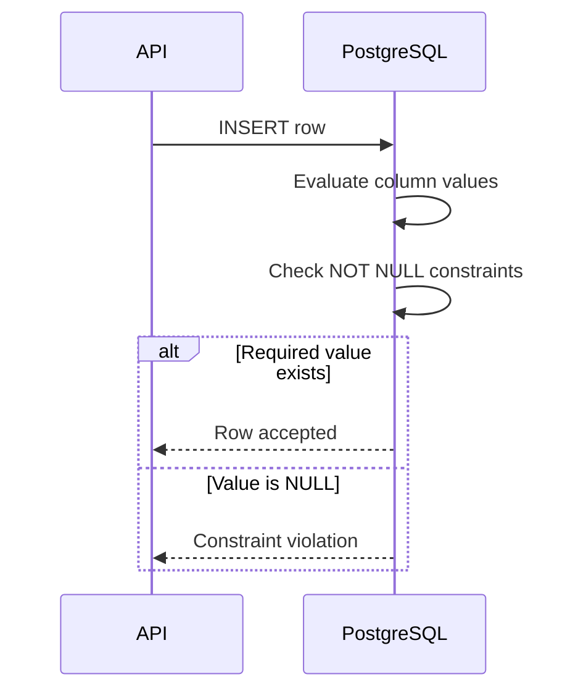
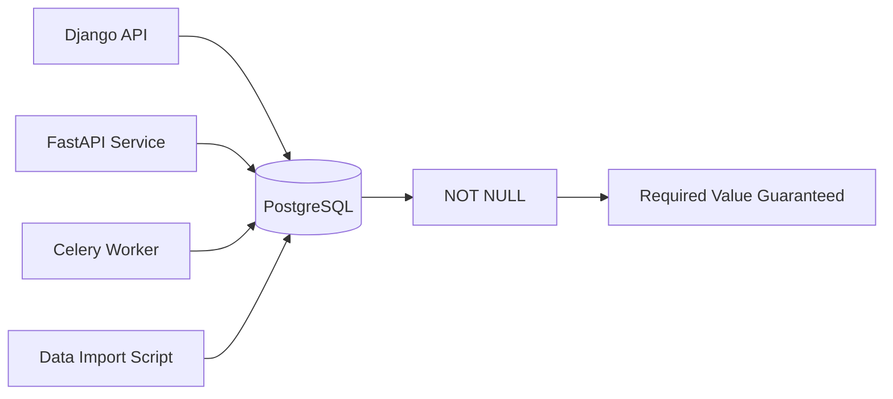

# 02- NOT NULL

## Overview

`NOT NULL` is a database constraint that requires a column to contain a value for every stored row. It is one of the simplest and most important integrity constraints because it makes the database explicitly distinguish between **required data** and **optional data**.

In production schemas, `NOT NULL` should be used whenever the domain requires a value to exist. Leaving a column nullable creates an additional state that every query, application service, serializer, and background worker must handle.

```sql
CREATE TABLE users (
    id bigint GENERATED ALWAYS AS IDENTITY PRIMARY KEY,
    email text NOT NULL,
    created_at timestamptz NOT NULL DEFAULT now()
);
```

Here, every persisted user must have an `email` and `created_at`.

`NOT NULL` does not validate whether the value is semantically correct. It only guarantees that the value is not SQL `NULL`.

## What `NULL` Means

`NULL` represents the absence of a value. It is not equivalent to:

- An empty string: `''`
- Zero: `0`
- Boolean `false`
- An empty array or JSON object
- A default value

For example:

```text
email = NULL       → no email value exists
email = ''         → email value exists but is empty
age = 0            → age is explicitly zero
active = false     → active is explicitly false
```

This distinction matters because SQL uses three-valued logic:

```text
TRUE
FALSE
UNKNOWN
```

Comparisons involving `NULL` generally produce `UNKNOWN`.

For example:

```sql
SELECT *
FROM users
WHERE email = NULL;
```

does not find rows where `email` is `NULL`.

Use:

```sql
SELECT *
FROM users
WHERE email IS NULL;
```

or:

```sql
SELECT *
FROM users
WHERE email IS NOT NULL;
```

## Why `NOT NULL` Exists

The primary purpose of `NOT NULL` is to enforce a domain invariant at the database boundary.

Without it:

```sql
CREATE TABLE orders (
    id bigint GENERATED ALWAYS AS IDENTITY PRIMARY KEY,
    customer_id bigint,
    total numeric(19, 4)
);
```

the database permits:

```text
customer_id = NULL
total = NULL
```

If the application assumes these values always exist, the schema and application disagree.

A stronger model is:

```sql
CREATE TABLE orders (
    id bigint GENERATED ALWAYS AS IDENTITY PRIMARY KEY,
    customer_id bigint NOT NULL,
    total numeric(19, 4) NOT NULL
);
```

Now invalid states are rejected regardless of which process performs the write.

This protects against:

- Application bugs
- ORM mistakes
- Background workers
- Data import scripts
- Administrative SQL
- Concurrent requests
- Other microservices
- Future applications that access the same database

## How `NOT NULL` Works

When an `INSERT` or `UPDATE` attempts to assign `NULL` to a `NOT NULL` column, PostgreSQL rejects the operation.



Example:

```sql
CREATE TABLE customers (
    id bigint GENERATED ALWAYS AS IDENTITY PRIMARY KEY,
    email text NOT NULL
);

INSERT INTO customers (email)
VALUES (NULL);
```

PostgreSQL rejects the operation with a `NOT NULL` violation.

The constraint is enforced by the database engine rather than by application code.

## `NOT NULL` vs Application Validation

Application validation and `NOT NULL` serve different purposes.

| Mechanism | Purpose |
|---|---|
| API validation | Reject invalid requests early |
| ORM validation | Provide application-level validation |
| `NOT NULL` | Guarantee persistence-level presence |
| `CHECK` | Enforce value-level rules |
| `UNIQUE` | Enforce uniqueness |
| Foreign key | Enforce relationships |

For example, FastAPI may reject a missing field:

```python
from pydantic import BaseModel


class CreateUserRequest(BaseModel):
    email: str
```

Django can similarly represent a required database field:

```python
from django.db import models


class User(models.Model):
    email = models.EmailField(null=False)
```

However, neither application-level validation nor ORM configuration should be treated as the final integrity boundary.

A database may be written by multiple services:



The database constraint protects all writers.

## `NOT NULL` and `DEFAULT`

`NOT NULL` and `DEFAULT` solve different problems.

```sql
CREATE TABLE jobs (
    id bigint GENERATED ALWAYS AS IDENTITY PRIMARY KEY,
    status text NOT NULL DEFAULT 'pending'
);
```

`DEFAULT` determines what happens when the column is omitted from an `INSERT`.

```sql
INSERT INTO jobs DEFAULT VALUES;
```

The database can populate:

```text
status = 'pending'
```

But a default does not prevent an explicitly supplied `NULL` value:

```sql
INSERT INTO jobs (status)
VALUES (NULL);
```

`NOT NULL` provides the required-value guarantee.

A useful production pattern is therefore:

```sql
status text NOT NULL DEFAULT 'pending'
```

when the domain has a valid initial state.

## `NOT NULL` and `CHECK`

`NOT NULL` should often be combined with `CHECK`.

Consider:

```sql
age integer NOT NULL CHECK (age >= 18)
```

This enforces two different invariants:

1. `age` must exist.
2. `age` must be at least `18`.

A `CHECK` constraint alone does not necessarily enforce non-nullability.

```sql
age integer CHECK (age >= 18)
```

If `age` is `NULL`, the expression:

```sql
age >= 18
```

evaluates to `UNKNOWN`, and PostgreSQL permits the row because a `CHECK` constraint passes when its expression evaluates to `TRUE` or `UNKNOWN`.

Therefore:

```sql
CHECK (age >= 18)
```

and:

```sql
age integer NOT NULL CHECK (age >= 18)
```

have materially different semantics.

This is a common interview and production trap.

## `NOT NULL` and Empty Values

`NOT NULL` does not mean "non-empty."

This constraint:

```sql
name text NOT NULL
```

still permits:

```sql
name = ''
```

If whitespace-only values are also invalid:

```sql
name text NOT NULL
    CHECK (length(trim(name)) > 0)
```

The same principle applies to other data types.

For example, a numeric column:

```sql
quantity integer NOT NULL
```

allows:

```text
quantity = 0
```

If zero is invalid:

```sql
quantity integer NOT NULL
    CHECK (quantity > 0)
```

Use the narrowest constraint that represents the actual domain invariant.

## Choosing Nullable vs `NOT NULL`

The decision should come from domain semantics rather than convenience.

Use `NOT NULL` when:

- The value is required for every entity.
- The application cannot meaningfully operate without it.
- A missing value represents invalid state.
- The field is part of a required relationship.
- A default can provide a valid value.

Allow `NULL` when:

- Absence is a meaningful business state.
- The value genuinely may not exist.
- The value becomes known later.
- "Unknown" is different from a concrete value.
- A relationship is genuinely optional.

For example:

```sql
users.phone_number
```

may legitimately be nullable if users are allowed to register without providing a phone number.

By contrast:

```sql
orders.customer_id
```

should usually be `NOT NULL` when every order must belong to a customer.

## Nullable Relationships

Optional relationships require careful modeling.

Suppose an order can optionally have a sales representative:

```sql
CREATE TABLE orders (
    id bigint GENERATED ALWAYS AS IDENTITY PRIMARY KEY,
    sales_rep_id bigint,
    FOREIGN KEY (sales_rep_id)
        REFERENCES employees(id)
);
```

Here `sales_rep_id` may be `NULL`.

If every order must have a sales representative:

```sql
sales_rep_id bigint NOT NULL
```

The distinction should represent the actual domain.

Do not make foreign keys nullable merely because it makes inserts easier.

## Adding `NOT NULL` to Existing Tables

Adding `NOT NULL` to an existing production table requires checking existing data first.

Suppose:

```sql
CREATE TABLE users (
    id bigint GENERATED ALWAYS AS IDENTITY PRIMARY KEY,
    email text
);
```

Before changing it:

```sql
ALTER TABLE users
ALTER COLUMN email SET NOT NULL;
```

check:

```sql
SELECT count(*)
FROM users
WHERE email IS NULL;
```

If the result is non-zero, the constraint cannot be safely enforced until those rows are addressed.

A production migration commonly follows:


Typical process:

1. Identify existing `NULL` values.
2. Determine the correct value for each row.
3. Backfill the data.
4. Verify there are no remaining violations.
5. Add the constraint.
6. Update application code to treat the field as required.

For large, heavily used PostgreSQL tables, migration strategy should account for locking behavior, write traffic, replication, and deployment ordering.

## Zero-Downtime Migration Considerations

A rolling deployment may temporarily run old and new application versions simultaneously.

For example:

```text
Old application → permits NULL
New application → assumes NOT NULL
```

The database constraint must not be introduced before all writes are compatible unless existing traffic is guaranteed safe.

A safer sequence is often:

```text
Deploy compatibility logic
        ↓
Backfill existing rows
        ↓
Verify invariant
        ↓
Enforce NOT NULL
        ↓
Remove temporary compatibility logic
```

The exact migration strategy depends on PostgreSQL version, table size, workload, and deployment architecture.

## Performance Considerations

`NOT NULL` generally has low runtime overhead compared with constraints that require indexes or cross-row checks.

It can improve schema clarity and allow the database and query planner to reason about nullability more precisely.

The larger performance benefit is often indirect:

- Fewer nullable states simplify queries.
- Queries may require fewer defensive expressions.
- Application serialization becomes simpler.
- Data-quality problems are rejected at write time instead of discovered later.

However, do not make columns non-null merely for theoretical query optimization. Model nullability according to domain semantics first.

## Storage Considerations

A nullable column requires the database to track whether the value is present.

In PostgreSQL, row storage includes a null bitmap when required. The exact physical representation is implementation-specific and should not be used as the primary reason to eliminate nullable columns.

The important engineering decision is semantic:

```text
Does the domain allow absence?
```

If yes, nullable may be correct.

If no, use `NOT NULL`.

## Security and Reliability

`NOT NULL` is not an authorization mechanism.

It can guarantee:

```text
password_hash is present
```

but it cannot guarantee:

```text
only authorized users may modify password_hash
```

Authorization should be handled through application authorization, database privileges, or appropriate database security mechanisms.

`NOT NULL` does contribute to reliability by preventing incomplete records from entering persistent storage.

For example:

```sql
CREATE TABLE payments (
    id bigint GENERATED ALWAYS AS IDENTITY PRIMARY KEY,
    order_id bigint NOT NULL,
    amount numeric(19, 4) NOT NULL,
    currency char(3) NOT NULL,
    created_at timestamptz NOT NULL DEFAULT now()
);
```

This prevents a payment record from being persisted without its core identifying and financial fields.

## ORM Considerations

### Django

Django's `null` option controls database nullability for most model fields.

```python
class Payment(models.Model):
    order_id = models.BigIntegerField(null=False)
    amount = models.DecimalField(
        max_digits=19,
        decimal_places=4,
        null=False,
    )
```

For string-based fields, Django commonly recommends using an empty string rather than `NULL` for "no data" in many cases. Do not automatically translate that convention to every data type or domain; model the actual business semantics.

### FastAPI and Pydantic

A Pydantic model can require a request field:

```python
from pydantic import BaseModel


class CreatePaymentRequest(BaseModel):
    order_id: int
    amount: float
    currency: str
```

This protects the API boundary but does not replace the database constraint.

A worker, migration, or another service could still attempt to write invalid data.

The robust architecture is:

```text
Request validation
        ↓
Business validation
        ↓
Database transaction
        ↓
Database constraints
        ↓
Persistent invariant
```

## Testing `NOT NULL`

Test both application behavior and database enforcement.

```sql
CREATE TABLE accounts (
    id bigint GENERATED ALWAYS AS IDENTITY PRIMARY KEY,
    email text NOT NULL
);

INSERT INTO accounts (email)
VALUES ('user@example.com');

INSERT INTO accounts (email)
VALUES (NULL);
```

The second statement must fail.

For migration testing, also test existing data:

```sql
SELECT count(*)
FROM accounts
WHERE email IS NULL;
```

Production database tests are especially valuable for constraints because ORM validation tests alone may not execute the database's actual constraint enforcement.

## Common Mistakes

### Assuming `NOT NULL` Means Valid

```sql
email text NOT NULL
```

still permits:

```text
''
invalid-email
'   '
```

depending on the domain.

Use additional constraints or application validation where appropriate.

### Using `CHECK` Instead of `NOT NULL`

```sql
CHECK (age >= 18)
```

does not necessarily reject `NULL`.

Use:

```sql
age integer NOT NULL CHECK (age >= 18)
```

when the value is mandatory.

### Confusing `NULL` With Empty Values

```sql
name text NOT NULL
```

does not reject:

```sql
name = ''
```

If empty values are invalid, explicitly enforce that rule.

### Making Everything `NOT NULL`

Not every field is required.

Forcing optional information into artificial values such as:

```text
''
0
1970-01-01
false
```

can be worse than using `NULL`, because the artificial value may become indistinguishable from a real value.

### Using Sentinel Values

Avoid patterns such as:

```text
phone_number = ''
manager_id = 0
deleted_at = '1970-01-01'
```

when `NULL` accurately represents absence.

Sentinel values introduce hidden conventions that every service must understand.

### Adding `NOT NULL` Without Data Preparation

A migration can fail because existing rows violate the new invariant.

Always inspect and remediate existing data before enforcing the constraint.

### Assuming ORM Configuration Is Enough

An ORM field configured as required does not replace a database-level constraint.

Verify the generated schema and actual production database.

## Production Checklist

Before making a column `NOT NULL`, verify:

- `NULL` is genuinely invalid according to the domain.
- Existing rows contain no `NULL` values.
- The application can populate the field on every relevant write path.
- Background workers and scripts are compatible.
- A valid default exists if omitted values should be automatically populated.
- Additional `CHECK` constraints are used when empty or out-of-range values are invalid.
- Foreign-key nullability matches relationship semantics.
- The migration has been tested against production-sized data.
- Locking and deployment-order implications have been evaluated.
- Rolling application versions remain compatible during migration.
- ORM configuration matches the actual database schema.
- Database-level constraint behavior is covered by integration tests.

## Interview Traps

| Question | Correct reasoning |
|---|---|
| Does `NOT NULL` mean the value is valid? | No. It only prevents SQL `NULL`. |
| Does `NOT NULL` reject an empty string? | No. `''` is a value, not `NULL`. |
| Does `CHECK (x > 0)` reject `NULL`? | No. A `CHECK` expression evaluating to `UNKNOWN` does not violate the constraint in PostgreSQL. |
| Does `DEFAULT` make a column non-null? | No. A default only supplies a value when the column is omitted; explicitly inserting `NULL` still requires `NOT NULL` to reject it. |
| Should every column be `NOT NULL`? | No. Nullable columns are appropriate when absence is a meaningful domain state. |
| Is ORM validation equivalent to `NOT NULL`? | No. Database constraints protect all database writers. |
| Does `NOT NULL` provide authorization? | No. It is an integrity constraint, not an access-control mechanism. |

## Key Takeaways

- **Use `NOT NULL` whenever absence is not a valid domain state.**
- **`NOT NULL` prevents SQL `NULL`, not empty strings, zero values, invalid formats, or semantically incorrect data.**
- **Combine `NOT NULL` with `CHECK`, `UNIQUE`, and foreign-key constraints when stronger invariants are required.**
- **Application and ORM validation improve developer and user experience, but database constraints remain the authoritative persistence boundary.**
- **Treat adding `NOT NULL` as a production schema migration: clean existing data, consider locking and deployment order, and verify every write path.**