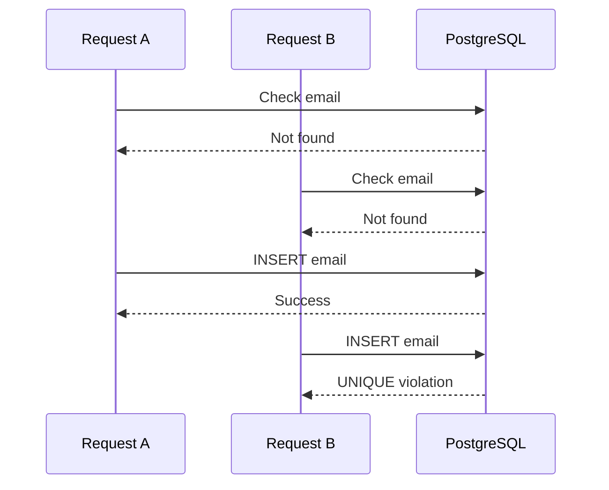
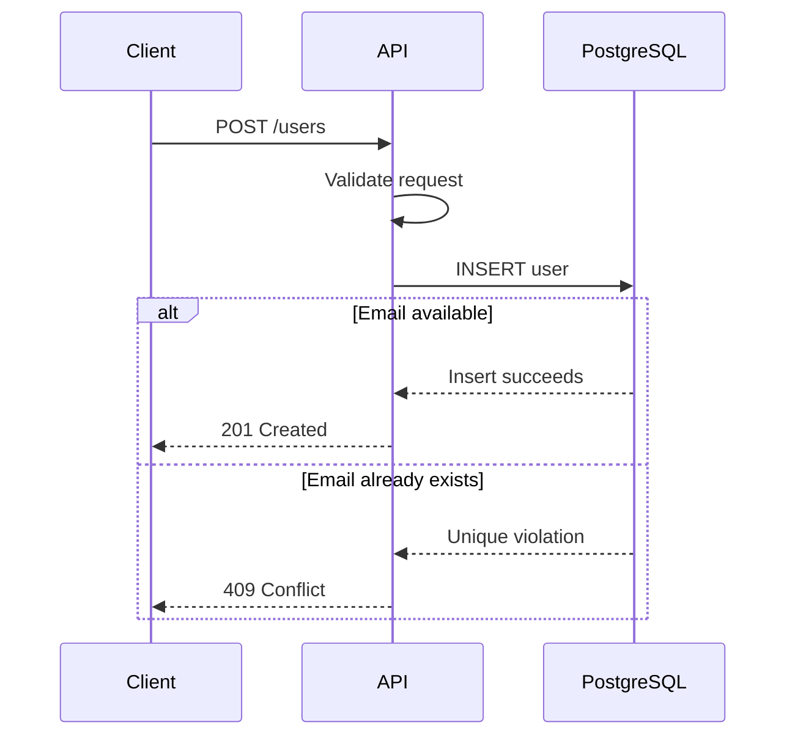

# 03- UNIQUE

## Overview

`UNIQUE` is a database constraint that enforces uniqueness of a value or combination of values across rows. It is a core data-integrity mechanism for preventing duplicate business identifiers such as email addresses, usernames, external IDs, or natural keys.

A uniqueness rule belongs in the database when duplicate values would represent an invalid state. Application-level checks such as `SELECT`-then-`INSERT` are not sufficient because concurrent requests can pass the check simultaneously.

```sql
CREATE TABLE users (
    id bigint GENERATED ALWAYS AS IDENTITY PRIMARY KEY,
    email text NOT NULL UNIQUE,
    created_at timestamptz NOT NULL DEFAULT now()
);
```

The database guarantees that two rows cannot have the same `email` value.

## Why `UNIQUE` Exists

Consider an API that creates users:

```text
Request A ──┐
            ├── Check email → available
Request B ──┘
            └── Check email → available
```

Both requests can observe that an email is available and then attempt to insert it.



A database uniqueness constraint closes this race condition.

The application can perform an availability check for user experience, but the database must remain the final authority.

## Creating a `UNIQUE` Constraint

Inline syntax:

```sql
CREATE TABLE users (
    id bigint GENERATED ALWAYS AS IDENTITY PRIMARY KEY,
    email text NOT NULL UNIQUE
);
```

Named constraint syntax:

```sql
CREATE TABLE users (
    id bigint GENERATED ALWAYS AS IDENTITY PRIMARY KEY,
    email text NOT NULL,
    CONSTRAINT uq_users_email UNIQUE (email)
);
```

Named constraints are generally preferable in production schemas because they provide meaningful names in errors, migrations, monitoring, and database inspection.

A constraint can also be added later:

```sql
ALTER TABLE users
ADD CONSTRAINT uq_users_email UNIQUE (email);
```

## `UNIQUE` and Indexes

In PostgreSQL, a regular unique constraint is backed by a unique B-tree index.

Conceptually:

```text
UNIQUE constraint
       │
       ▼
Unique index
       │
       ▼
Fast lookup + duplicate prevention
```

The index serves both integrity and lookup purposes.

For example:

```sql
CREATE TABLE customers (
    id bigint GENERATED ALWAYS AS IDENTITY PRIMARY KEY,
    external_id text NOT NULL,
    CONSTRAINT uq_customers_external_id UNIQUE (external_id)
);
```

The database can efficiently locate an existing `external_id` while simultaneously preventing duplicates.

However, a unique constraint should be treated primarily as a **data-integrity rule**. Do not add uniqueness solely because a query happens to benefit from an index; create an appropriate index when query performance is the actual requirement.

## Single-Column Uniqueness

The simplest case is uniqueness of one column:

```sql
CREATE TABLE accounts (
    id bigint GENERATED ALWAYS AS IDENTITY PRIMARY KEY,
    username text NOT NULL,
    CONSTRAINT uq_accounts_username UNIQUE (username)
);
```

This guarantees:

```text
alice
bob
charlie
```

but rejects a second:

```text
alice
```

Typical candidates include:

- Username
- Public API key identifier
- External payment-provider ID
- Order reference
- Idempotency key within an appropriate scope
- Device identifier
- Immutable business identifier

Do not assume every identifier should be globally unique. The required uniqueness scope is a domain decision.

## Composite `UNIQUE`

A composite uniqueness constraint enforces uniqueness across a combination of columns.

```sql
CREATE TABLE memberships (
    id bigint GENERATED ALWAYS AS IDENTITY PRIMARY KEY,
    organization_id bigint NOT NULL,
    user_id bigint NOT NULL,
    CONSTRAINT uq_memberships_org_user
        UNIQUE (organization_id, user_id)
);
```

This allows:

```text
organization_id | user_id
----------------+--------
1               | 10
1               | 20
2               | 10
```

but rejects:

```text
1 | 10
```

a second time.

The important point is that neither column is necessarily globally unique. The **combination** is unique.

This is common for:

- User membership in organizations
- Product SKU within a merchant
- Username within a tenant
- Sequence numbers within an account
- External IDs scoped to a provider

## Uniqueness Scope

Before creating a constraint, define the actual business scope.

For example:

```text
email globally unique
```

is different from:

```text
email unique within organization
```

The schemas are different.

Global:

```sql
CONSTRAINT uq_users_email
UNIQUE (email)
```

Tenant-scoped:

```sql
CONSTRAINT uq_users_org_email
UNIQUE (organization_id, email)
```

In multi-tenant systems, this distinction is critical.

A common production mistake is enforcing global uniqueness when the domain only requires tenant-level uniqueness.

## `UNIQUE` and `NULL`

`NULL` requires special attention.

In PostgreSQL, a normal unique constraint allows multiple `NULL` values because `NULL` represents an absent/unknown value rather than a concrete value that equals another `NULL`.

```sql
CREATE TABLE users (
    id bigint GENERATED ALWAYS AS IDENTITY PRIMARY KEY,
    phone_number text,
    CONSTRAINT uq_users_phone UNIQUE (phone_number)
);
```

Multiple rows can have:

```text
phone_number = NULL
```

while two identical non-null phone numbers cannot coexist.

If the value must always exist and be unique:

```sql
phone_number text NOT NULL,
CONSTRAINT uq_users_phone UNIQUE (phone_number)
```

This is a common pairing:

```text
NOT NULL → value must exist
UNIQUE   → values cannot duplicate
```

## Enforcing "Only One NULL"

Sometimes the requirement is different:

> Multiple rows may exist, but only one row may have a `NULL` value.

This is not the usual business requirement, but PostgreSQL supports explicit null semantics in newer versions through unique constraints with `NULLS NOT DISTINCT`.

```sql
CREATE TABLE example (
    id bigint GENERATED ALWAYS AS IDENTITY PRIMARY KEY,
    value text,
    CONSTRAINT uq_example_value
        UNIQUE NULLS NOT DISTINCT (value)
);
```

With this behavior, `NULL` values are treated as equal for uniqueness purposes.

The choice should be explicit because the default PostgreSQL behavior is multiple `NULL`s.

## Case Sensitivity

A normal text uniqueness constraint is affected by the database's comparison semantics.

For PostgreSQL:

```sql
CREATE TABLE users (
    id bigint GENERATED ALWAYS AS IDENTITY PRIMARY KEY,
    username text NOT NULL UNIQUE
);
```

Depending on the comparison rules, values such as:

```text
Alice
alice
```

are not automatically treated as identical merely because the application considers usernames case-insensitive.

If the domain requires case-insensitive uniqueness, model it explicitly.

One PostgreSQL approach is `citext`:

```sql
CREATE EXTENSION IF NOT EXISTS citext;

CREATE TABLE users (
    id bigint GENERATED ALWAYS AS IDENTITY PRIMARY KEY,
    username citext NOT NULL UNIQUE
);
```

Another approach is a unique expression index:

```sql
CREATE UNIQUE INDEX uq_users_username_lower
ON users (lower(username));
```

The expression-index approach is useful when the normalization rule should be explicit.

Do not rely on application code alone:

```python
username = username.lower()
```

because every writer must implement the exact same normalization policy.

## Normalization and Uniqueness

Uniqueness is only as correct as the representation being compared.

Consider email addresses:

```text
User@example.com
user@example.com
```

Whether these should represent the same account is a domain and authentication-policy decision.

Do not blindly apply:

```sql
UNIQUE (email)
```

and assume it solves every normalization problem.

If the application defines canonical representation, normalize consistently before persistence and enforce uniqueness on the canonical form.

For example:

```sql
CREATE UNIQUE INDEX uq_users_email_normalized
ON users (lower(email));
```

The exact normalization policy should be defined carefully, particularly for internationalized identifiers.

## Partial Unique Indexes

Sometimes uniqueness applies only to a subset of rows.

A common example is soft deletion:

```text
active user
deleted user
```

Suppose usernames must be unique among active users, but deleted users may retain their historical username.

A normal constraint:

```sql
UNIQUE (username)
```

would prevent reuse.

PostgreSQL can express the actual rule with a partial unique index:

```sql
CREATE UNIQUE INDEX uq_active_users_username
ON users (username)
WHERE deleted_at IS NULL;
```

Now uniqueness is enforced only for active rows.

This is an important distinction:

- `UNIQUE` constraint → general uniqueness rule
- Partial unique index → conditional uniqueness rule

Partial unique indexes are particularly useful for:

- Soft deletion
- Active records
- Current configuration
- One active subscription
- One primary resource
- Conditional business states

## "Exactly One" or "At Most One"

A unique constraint can enforce "at most one" but not necessarily every business rule around "exactly one."

For example:

```sql
CREATE UNIQUE INDEX uq_primary_address
ON addresses (user_id)
WHERE is_primary;
```

This guarantees that a user cannot have two primary addresses.

It does **not** guarantee that every user has exactly one primary address.

That distinction matters:

```text
UNIQUE → at most one
Additional business logic → potentially exactly one
```

Exactly-one requirements often need a combination of constraints, transactions, application logic, and sometimes database triggers depending on the domain.

## Constraint Violations

When a duplicate value is inserted:

```sql
INSERT INTO users (email)
VALUES ('user@example.com');
```

PostgreSQL rejects the operation if that email already exists.

Applications should handle this as a normal domain conflict rather than treating it as an unexpected database failure.

For an HTTP API, a uniqueness conflict commonly maps to:

```text
HTTP 409 Conflict
```

For example:

```text
POST /users

→ database unique violation
→ application translates conflict
→ HTTP 409 Conflict
```

The exact mapping depends on API semantics, but exposing raw database errors to clients should be avoided.

## `INSERT ... ON CONFLICT`

PostgreSQL provides `ON CONFLICT` for atomic handling of uniqueness conflicts.

Ignore duplicates:

```sql
INSERT INTO users (email)
VALUES ('user@example.com')
ON CONFLICT (email) DO NOTHING;
```

Update on conflict:

```sql
INSERT INTO users (email, last_seen_at)
VALUES ('user@example.com', now())
ON CONFLICT (email)
DO UPDATE
SET last_seen_at = EXCLUDED.last_seen_at;
```

This is safer than:

```text
SELECT
    ↓
if not found:
    INSERT
```

because the database handles the concurrency boundary atomically.

For production systems, understand which unique constraint or index is being targeted and whether the resulting behavior matches the business operation.

## Idempotency Keys

`UNIQUE` constraints are particularly useful for implementing idempotency.

For example:

```sql
CREATE TABLE payment_requests (
    id bigint GENERATED ALWAYS AS IDENTITY PRIMARY KEY,
    idempotency_key text NOT NULL,
    user_id bigint NOT NULL,
    status text NOT NULL,
    CONSTRAINT uq_payment_requests_idempotency_key
        UNIQUE (idempotency_key)
);
```

A client retrying the same request cannot create a second record with the same key.

However, global uniqueness may be too restrictive. If the key is only meaningful per customer, use:

```sql
CONSTRAINT uq_payment_requests_user_key
UNIQUE (user_id, idempotency_key)
```

The uniqueness scope must match the idempotency contract.

## `UNIQUE` vs `PRIMARY KEY`

Both enforce uniqueness, but they represent different semantics.

| Property | `PRIMARY KEY` | `UNIQUE` |
|---|---|---|
| Uniqueness | Yes | Yes |
| Allows `NULL` | No | Yes, normally in PostgreSQL |
| Number per table | One | Multiple |
| Typical purpose | Row identity | Candidate/business uniqueness |
| Automatically creates unique index in PostgreSQL | Yes | Yes |
| Can be composite | Yes | Yes |

A table may therefore have:

```sql
CREATE TABLE products (
    id bigint GENERATED ALWAYS AS IDENTITY PRIMARY KEY,
    sku text NOT NULL UNIQUE,
    external_id text UNIQUE
);
```

Here:

- `id` identifies the row.
- `sku` is a unique business identifier.
- `external_id` is another candidate identifier.

## `UNIQUE` vs `DISTINCT`

These concepts operate at different levels.

`UNIQUE` is a schema-level integrity rule:

```sql
CONSTRAINT uq_users_email UNIQUE (email)
```

`DISTINCT` removes duplicate values from a query result:

```sql
SELECT DISTINCT email
FROM users;
```

`DISTINCT` does not prevent future duplicates from being inserted.

If duplicate data is invalid, enforce it with a database constraint rather than discovering it with queries.

## `UNIQUE` and Performance

A unique constraint requires an index in PostgreSQL, so writes incur index-maintenance cost.

For every relevant `INSERT`, `UPDATE`, or `DELETE`, PostgreSQL may need to maintain the unique index.

Benefits include:

- Fast equality lookups
- Duplicate detection
- Strong integrity guarantees
- Useful query-planner information

Costs include:

- Additional storage
- Index maintenance during writes
- More WAL activity
- Potential contention around heavily contended keys

For most business identifiers, this overhead is appropriate because the integrity guarantee is more important than the small write cost.

Do not create redundant unique indexes.

For example:

```sql
UNIQUE (email)
```

already creates a unique index suitable for equality lookups on `email`. Creating another ordinary index on exactly the same column is usually unnecessary.

## High-Contention Uniqueness

Highly contended unique values can become a concurrency hotspot.

Examples include:

- A single global sequence-like business value
- Frequently reused idempotency keys
- A heavily contested "current" resource
- Global configuration records

The database still provides correctness, but throughput can be affected by concurrent attempts to modify the same unique-key space.

At scale:

- Keep transactions short.
- Avoid unnecessary retries.
- Use appropriate isolation levels.
- Design uniqueness scope carefully.
- Use partitioning or tenant-scoped identifiers where appropriate.
- Measure actual contention before optimizing.

Do not remove a required uniqueness constraint merely to improve write throughput.

## Adding `UNIQUE` to an Existing Table

Before adding uniqueness to an existing table, identify duplicates.

```sql
SELECT email, count(*)
FROM users
GROUP BY email
HAVING count(*) > 1;
```

For a composite key:

```sql
SELECT organization_id, user_id, count(*)
FROM memberships
GROUP BY organization_id, user_id
HAVING count(*) > 1;
```

The migration cannot simply assume existing data is valid.

A production migration commonly follows:

```text
Existing data
     ↓
Detect duplicates
     ↓
Define canonical records
     ↓
Resolve duplicates
     ↓
Verify uniqueness
     ↓
Create unique index/constraint
     ↓
Deploy application behavior
```

For large PostgreSQL tables, consider creating a unique index concurrently where appropriate:

```sql
CREATE UNIQUE INDEX CONCURRENTLY uq_users_email
ON users (email);
```

`CREATE INDEX CONCURRENTLY` reduces blocking of normal table operations, but it has operational restrictions and should be planned carefully.

If the goal is specifically a table constraint, PostgreSQL can associate an existing suitable unique index with a constraint using `USING INDEX`.

## Production Migration Strategy

A safe uniqueness migration should account for:

- Existing duplicate data
- Concurrent writes
- Application deployment order
- Locking behavior
- Index creation duration
- Replication lag
- Failed migrations
- Rollback strategy

A common deployment pattern is:

```text
1. Deploy code that tolerates duplicate-conflict errors.
2. Stop new sources of invalid duplicate data where possible.
3. Clean existing duplicates.
4. Build the unique index/constraint.
5. Monitor errors and replication.
6. Remove temporary compatibility logic later.
```

For a very large table, do not blindly run a blocking index build during peak traffic.

## Django

Django can express basic uniqueness directly in models:

```python
from django.db import models


class User(models.Model):
    email = models.EmailField(unique=True)
```

Composite uniqueness should generally use `UniqueConstraint`:

```python
from django.db import models


class Membership(models.Model):
    organization = models.ForeignKey(
        "Organization",
        on_delete=models.CASCADE,
    )
    user = models.ForeignKey(
        "User",
        on_delete=models.CASCADE,
    )

    class Meta:
        constraints = [
            models.UniqueConstraint(
                fields=["organization", "user"],
                name="uq_membership_org_user",
            ),
        ]
```

For conditional uniqueness:

```python
class Address(models.Model):
    user = models.ForeignKey("User", on_delete=models.CASCADE)
    is_primary = models.BooleanField(default=False)

    class Meta:
        constraints = [
            models.UniqueConstraint(
                fields=["user"],
                condition=models.Q(is_primary=True),
                name="uq_primary_address_per_user",
            ),
        ]
```

The database remains the final integrity boundary.

## REST APIs and Uniqueness

A typical user-registration flow might be:



An availability endpoint such as:

```text
GET /users/check-email?email=user@example.com
```

can improve user experience, but it is only advisory.

The actual creation request must still handle a uniqueness conflict because another request may claim the value between the check and the insert.

## Security Considerations

Uniqueness constraints can support security-sensitive workflows but are not themselves security controls.

For example, an idempotency key can prevent duplicate processing, but the key should not be treated as an authorization credential.

Be careful with uniqueness checks that reveal whether an account exists.

An endpoint such as:

```text
GET /users/check-email
```

may enable account enumeration if it openly reveals whether an email is registered.

For authentication systems, distinguish between:

```text
database integrity
```

and:

```text
information disclosure
```

Use appropriate API responses and rate limiting where account enumeration is a concern.

## Common Mistakes

### Checking Before Inserting

Avoid:

```text
SELECT → not found → INSERT
```

as the integrity mechanism.

Concurrent requests can both pass the check.

Use a unique constraint and handle the resulting conflict.

### Making a Business Identifier Non-Unique

If a domain says:

```text
one SKU per merchant
```

then:

```sql
UNIQUE (sku)
```

is incorrect if different merchants can reuse the SKU.

Use:

```sql
UNIQUE (merchant_id, sku)
```

### Forgetting `NULL` Semantics

A unique constraint does not normally mean "only one row can have `NULL`."

If the field is mandatory:

```sql
NOT NULL
```

should generally accompany the unique constraint.

### Assuming Case-Insensitive Uniqueness

```sql
UNIQUE (username)
```

does not automatically implement every possible case-insensitive business rule.

Define normalization or use an appropriate database type/index.

### Creating Redundant Indexes

Do not create:

```sql
UNIQUE (email)
```

and then add another identical index:

```sql
CREATE INDEX idx_users_email ON users(email);
```

unless there is a specific, demonstrated reason.

### Exposing Raw Constraint Errors

Do not return database-specific errors directly to API consumers.

Translate expected uniqueness conflicts into stable domain/API behavior.

### Ignoring Existing Duplicates

Adding uniqueness to dirty historical data can cause a migration failure.

Always inspect duplicates before enforcing the new invariant.

### Assuming `DISTINCT` Prevents Duplicates

`DISTINCT` only affects query output. It does not enforce storage integrity.

### Using Application Normalization Inconsistently

If one service lowercases identifiers and another does not, uniqueness semantics can become inconsistent.

Define canonical representation and enforce it consistently.

## Operational Checklist

Before introducing a `UNIQUE` constraint:

- Define the exact uniqueness scope.
- Decide whether uniqueness is global or tenant-scoped.
- Decide how `NULL` should behave.
- Define case-sensitivity and normalization rules.
- Search existing data for duplicates.
- Resolve historical duplicates before migration.
- Evaluate write-path concurrency.
- Handle database conflicts explicitly in application code.
- Avoid redundant indexes.
- Consider index size and write overhead.
- For large PostgreSQL tables, evaluate concurrent index creation.
- Test migrations against production-sized data.
- Monitor migration duration, locks, and replication lag.
- Ensure rolling deployments remain compatible.
- Avoid exposing raw database errors through APIs.

## Interview Traps

| Question | Correct reasoning |
|---|---|
| Does `UNIQUE` prevent duplicate rows? | It prevents duplicate values for the constrained column or column combination, not identical rows in general. |
| Can a table have multiple unique constraints? | Yes. |
| Can a unique constraint contain multiple columns? | Yes; uniqueness applies to the combination. |
| Does `UNIQUE` normally allow multiple `NULL`s in PostgreSQL? | Yes. |
| Does `UNIQUE` automatically create an index in PostgreSQL? | Yes, a unique index backs a normal unique constraint. |
| Is `UNIQUE` the same as `PRIMARY KEY`? | No. A table has one primary key but can have multiple unique constraints. |
| Is `SELECT DISTINCT` equivalent to `UNIQUE`? | No. `DISTINCT` affects query results; `UNIQUE` enforces storage integrity. |
| Does a pre-insert existence check prevent race conditions? | No. The database uniqueness constraint must enforce the invariant. |
| Can uniqueness be conditional in PostgreSQL? | Yes, typically with a partial unique index. |
| Does a unique constraint automatically provide case-insensitive uniqueness? | No. Comparison and normalization semantics must be modeled explicitly. |

## Key Takeaways

- **Use `UNIQUE` to enforce business-level uniqueness at the database boundary; application-side existence checks alone are race-prone.**
- **Choose the uniqueness scope carefully: global, tenant-scoped, composite, or conditional rules require different schema designs.**
- **Understand PostgreSQL `NULL` and comparison semantics; `UNIQUE` normally permits multiple `NULL` values.**
- **Treat unique indexes as both integrity mechanisms and write-time costs; avoid redundant indexes and plan large-table migrations carefully.**
- **Handle uniqueness conflicts explicitly in APIs and concurrent workflows, especially registration, idempotency, and resource creation.**