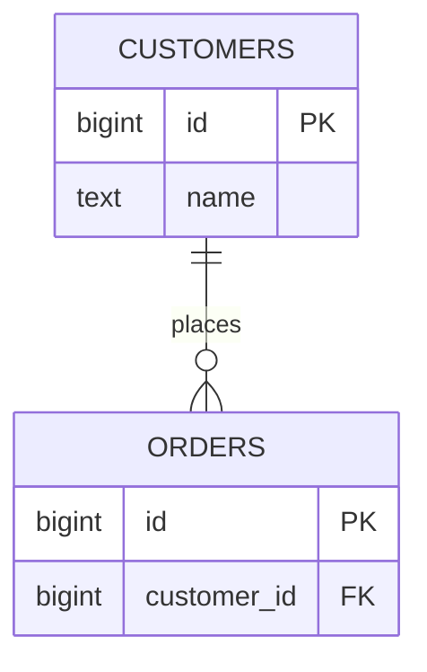

# 04- PRIMARY KEY

## Overview

A `PRIMARY KEY` is the database constraint that identifies each row in a table uniquely and establishes the table's canonical row identity.

A primary key must be:

- **Unique** across the table.
- **Non-null**.
- **Stable enough** to serve as the row's identity.
- Defined only once per table.

In PostgreSQL, defining a primary key automatically creates a unique B-tree index that supports the constraint.

```sql
CREATE TABLE users (
    id bigint GENERATED ALWAYS AS IDENTITY,
    email text NOT NULL,
    created_at timestamptz NOT NULL DEFAULT now(),

    CONSTRAINT pk_users PRIMARY KEY (id)
);
```

For backend systems, the primary key is more than an implementation detail. It affects foreign keys, indexing, joins, API design, replication, sharding, storage layout, ORM behavior, and the operational characteristics of the entire data model.

## Why Primary Keys Exist

A relational table needs a reliable way to distinguish one row from another.

Consider:

```text
users
--------------------------------
id | email
--------------------------------
1  | alice@example.com
2  | bob@example.com
```

The `id` column provides a stable identity for each row.

Without a primary key, applications can still store rows, but identifying, referencing, updating, and deleting a specific row becomes significantly harder.

A primary key provides a database-enforced invariant:

```text
For every pair of distinct rows:
their primary-key values must be different.
```

The database therefore becomes the final authority for row identity rather than relying on application conventions.

## Primary Key Properties

| Property | Primary Key |
|---|---|
| Uniqueness | Required |
| `NULL` | Not allowed |
| Number per table | One |
| Composite key | Supported |
| Index created by PostgreSQL | Yes |
| Can be referenced by foreign keys | Yes |
| Typical purpose | Row identity |

A table can have multiple unique constraints but only one primary key.

```sql
CREATE TABLE products (
    id bigint GENERATED ALWAYS AS IDENTITY PRIMARY KEY,
    sku text NOT NULL UNIQUE,
    external_id text UNIQUE
);
```

Here:

- `id` is the primary key.
- `sku` is a unique candidate/business identifier.
- `external_id` is another unique candidate identifier.

## Primary Key vs `UNIQUE`

A primary key and a unique constraint both enforce uniqueness, but they communicate different semantics.

| Characteristic | `PRIMARY KEY` | `UNIQUE` |
|---|---|---|
| Identifies the row | Yes | Not necessarily |
| Allows `NULL` | No | PostgreSQL normally allows it |
| Multiple per table | No | Yes |
| Foreign-key target | Yes | Yes, when backed by an appropriate unique constraint/index |
| Typical meaning | Canonical row identity | Alternate uniqueness rule |

For example:

```sql
CREATE TABLE customers (
    id bigint GENERATED ALWAYS AS IDENTITY PRIMARY KEY,
    email text NOT NULL UNIQUE
);
```

`id` answers:

> Which row is this?

`email` answers:

> Is another customer allowed to have this email?

These are different modeling concerns.

## Primary Key vs Candidate Key

A **candidate key** is any minimal set of columns capable of uniquely identifying a row.

For example:

```text
users
-----------------------------------
id | email              | username
-----------------------------------
1  | a@example.com      | alice
2  | b@example.com      | bob
```

Potential candidate keys could be:

```text
id
email
username
```

The schema chooses one candidate key as the primary key.

The others can be enforced using `UNIQUE`.

```sql
CREATE TABLE users (
    id bigint GENERATED ALWAYS AS IDENTITY PRIMARY KEY,
    email text NOT NULL UNIQUE,
    username text NOT NULL UNIQUE
);
```

This distinction becomes important when deciding whether a business attribute should become the physical primary key.

## Surrogate Keys

A **surrogate key** is an identifier generated specifically for database identity rather than derived from business meaning.

Common examples include:

- Auto-incrementing integer
- `bigint` identity
- UUID
- ULID-style identifier

Example:

```sql
CREATE TABLE orders (
    id bigint GENERATED ALWAYS AS IDENTITY PRIMARY KEY,
    customer_id bigint NOT NULL,
    order_number text NOT NULL UNIQUE
);
```

Here:

```text
id           → surrogate row identity
order_number → business identifier
```

This separation is often preferable in production systems because business identifiers can change or acquire new semantics while the internal row identity remains stable.

## Natural Keys

A **natural key** derives directly from business data.

Examples:

- ISO country code
- ISBN
- Tax identifier
- Immutable external identifier
- Standardized product code

Example:

```sql
CREATE TABLE countries (
    country_code char(2) PRIMARY KEY,
    name text NOT NULL
);
```

Natural keys can be appropriate when the identifier is:

- Truly unique.
- Compact.
- Stable.
- Well-defined by the domain.
- Unlikely to change.

Avoid choosing a natural key simply because it currently appears unique.

A value that looks unique today may later change because of:

- Business requirements.
- Data-provider changes.
- Mergers or acquisitions.
- Localization.
- Identifier format changes.
- Privacy requirements.

## Surrogate vs Natural Primary Keys

| Consideration | Surrogate Key | Natural Key |
|---|---|---|
| Business meaning | None | Yes |
| Stability | Usually high | Depends on domain |
| Width | Usually predictable | Variable |
| Foreign keys | Usually simple | May be wider |
| Business changes | Less disruptive | Can require cascading changes |
| Human readability | Usually low | Often higher |
| Common backend choice | Yes | Selectively |

A common production design is:

```text
Primary key → stable surrogate identity
Unique constraint → business identifier
```

This avoids coupling relational identity too tightly to business semantics.

## Integer Primary Keys

For many PostgreSQL applications, a `bigint` identity column is an excellent default.

```sql
CREATE TABLE events (
    id bigint GENERATED ALWAYS AS IDENTITY PRIMARY KEY,
    event_type text NOT NULL,
    created_at timestamptz NOT NULL DEFAULT now()
);
```

`bigint` provides a very large range while remaining compact compared with many string-based identifiers.

Advantages:

- Compact indexes.
- Efficient comparisons.
- Efficient joins.
- Efficient foreign keys.
- Good locality for sequential insertion.
- Simple ORM integration.
- Easy debugging.

Limitations:

- IDs can reveal approximate insertion volume.
- Sequential IDs are predictable.
- Generating IDs independently across multiple databases requires additional design.
- They are not globally unique across independent systems without coordination.

For a conventional single-primary PostgreSQL deployment, `bigint` identity is often a strong choice.

## Identity Columns

PostgreSQL identity columns are the modern mechanism for database-generated numeric identifiers.

```sql
CREATE TABLE users (
    id bigint GENERATED ALWAYS AS IDENTITY PRIMARY KEY,
    email text NOT NULL
);
```

The database generates the value when it is omitted from the insert.

```sql
INSERT INTO users (email)
VALUES ('alice@example.com')
RETURNING id;
```

The application receives the generated identifier without implementing its own counter.

Prefer identity columns for new PostgreSQL schemas rather than relying on legacy `serial` syntax.

## UUID Primary Keys

UUIDs provide a large identifier space suitable for systems that need identifiers generated independently.

```sql
CREATE TABLE orders (
    id uuid PRIMARY KEY,
    customer_id bigint NOT NULL,
    created_at timestamptz NOT NULL DEFAULT now()
);
```

The application can generate a UUID:

```python
from uuid import uuid4

order_id = uuid4()
```

UUIDs can be useful when:

- Multiple services generate identifiers independently.
- Records are created offline or before reaching the database.
- IDs cross system boundaries.
- Sequential IDs should not be exposed publicly.
- Distributed systems need independent ID generation.

However, UUIDs are larger than `bigint` values and can affect index size, cache behavior, and insertion locality depending on how they are generated.

## UUID Versions and Index Locality

Not all UUID generation strategies have identical database characteristics.

Random UUIDs can produce inserts throughout a large index keyspace. Over time, this can increase page churn and reduce locality compared with monotonically increasing identifiers.

Time-ordered UUID schemes can improve insertion locality while retaining the distributed-generation advantages of UUIDs.

The important engineering principle is:

```text
Distributed identifier generation
        +
Index locality
        +
Identifier exposure requirements
```

should be evaluated together.

Do not select UUIDs merely because they are popular in distributed systems.

## Composite Primary Keys

A primary key can contain multiple columns.

```sql
CREATE TABLE order_items (
    order_id bigint NOT NULL,
    product_id bigint NOT NULL,
    quantity integer NOT NULL,

    CONSTRAINT pk_order_items
        PRIMARY KEY (order_id, product_id)
);
```

The pair:

```text
(order_id, product_id)
```

must be unique.

This is appropriate when the combination itself represents the identity of the row, especially for association tables.

For example:

```text
order_id | product_id
---------+-----------
100      | 5
100      | 8
101      | 5
```

The same product can occur in different orders, but the same product cannot occur twice in the same order under this model.

## Composite Key Ordering

Column order matters.

```sql
PRIMARY KEY (organization_id, user_id)
```

creates an index ordered approximately as:

```text
organization_id → user_id
```

This is highly useful for queries such as:

```sql
SELECT *
FROM memberships
WHERE organization_id = 42;
```

and:

```sql
SELECT *
FROM memberships
WHERE organization_id = 42
  AND user_id = 100;
```

But it is generally less useful for queries filtering only on:

```sql
WHERE user_id = 100
```

This follows the leftmost-prefix behavior of a B-tree index.

Therefore, composite primary-key design should consider actual access patterns, not only logical uniqueness.

## Foreign Keys and Primary Keys

Primary keys are commonly referenced by foreign keys.

```sql
CREATE TABLE customers (
    id bigint GENERATED ALWAYS AS IDENTITY PRIMARY KEY,
    name text NOT NULL
);

CREATE TABLE orders (
    id bigint GENERATED ALWAYS AS IDENTITY PRIMARY KEY,
    customer_id bigint NOT NULL,

    CONSTRAINT fk_orders_customer
        FOREIGN KEY (customer_id)
        REFERENCES customers(id)
);
```

The relationship is:



The database now guarantees that an `orders.customer_id` value references an existing customer, subject to the configured foreign-key behavior.

## Primary Key Indexing

In PostgreSQL, creating:

```sql
PRIMARY KEY (id)
```

automatically creates a unique B-tree index.

This index supports:

```sql
SELECT *
FROM users
WHERE id = 123;
```

and:

```sql
UPDATE users
SET email = 'new@example.com'
WHERE id = 123;
```

It also supports foreign-key references to the primary key.

Do not create another identical index:

```sql
CREATE INDEX idx_users_id ON users(id);
```

unless there is a specific reason. The primary-key index already provides the basic B-tree lookup capability.

## Primary Key and Storage Locality

Primary-key choice can affect physical and logical locality.

With sequential numeric IDs:

```text
1001
1002
1003
1004
1005
```

new rows tend to enter the right-hand side of the B-tree index.

With random identifiers:

```text
a7...
42...
f1...
09...
```

new rows may be distributed throughout the index.

Potential consequences include:

- More page splits.
- More random I/O.
- Larger working sets.
- Reduced cache locality.
- Higher index-maintenance overhead.

The impact depends on workload, PostgreSQL version, index size, hardware, and write rate. It should be measured rather than assumed.

## Primary Keys in Distributed Systems

A single PostgreSQL instance can generate sequential identifiers easily.

A distributed architecture may have:

```text
Service A ──┐
Service B ──┼──→ independent database writes
Service C ──┘
```

If multiple databases independently generate integer IDs, collisions can occur when data is later merged.

Distributed systems therefore often use:

- UUIDs.
- Time-ordered UUIDs.
- Snowflake-style IDs.
- Other globally coordinated identifier schemes.

The right solution depends on whether IDs must be:

- Globally unique.
- Sortable by creation time.
- Compact.
- Generated without database access.
- Safe to expose externally.

Do not introduce distributed ID machinery unless the architecture actually requires it.

## Primary Keys in Sharding

Primary-key design becomes more important when tables are partitioned or sharded.

A key may need to support:

- Routing requests to the correct shard.
- Global uniqueness.
- Local uniqueness.
- Efficient partition pruning.
- Distributed ID generation.

For example, a tenant-oriented system might use:

```text
tenant_id + local_id
```

as a logical identity.

However, this does not automatically mean both columns should become the physical primary key.

A common design is:

```sql
CREATE TABLE documents (
    id bigint GENERATED ALWAYS AS IDENTITY PRIMARY KEY,
    tenant_id bigint NOT NULL,
    ...
);
```

with additional tenant-specific indexes or constraints based on access patterns.

Primary-key design should be made together with the partitioning/sharding strategy rather than retrofitted afterward.

## Primary Keys and API Design

A database primary key does not have to be the identifier exposed through every public API.

For example:

```text
Database:
id = 104928

Public API:
order_id = "ord_01J..."
```

Separating internal and external identifiers can provide:

- Reduced exposure of database cardinality.
- More stable public contracts.
- Freedom to change internal storage architecture.
- Better interoperability across services.

A common pattern is:

```sql
CREATE TABLE orders (
    id bigint GENERATED ALWAYS AS IDENTITY PRIMARY KEY,
    public_id uuid NOT NULL UNIQUE,
    ...
);
```

The database uses `id` for efficient internal relationships while APIs expose `public_id`.

Whether this is necessary depends on the threat model and architecture. Predictability alone is not an authorization vulnerability; authorization must still be enforced independently.

## Primary Keys and ORM Systems

### Django

Django automatically creates an auto-incrementing primary key when a model does not explicitly define one.

An explicit modern design might use:

```python
from django.db import models


class User(models.Model):
    id = models.BigAutoField(primary_key=True)
    email = models.EmailField(unique=True)
```

Django then treats `id` as the canonical model identity.

For UUIDs:

```python
import uuid

from django.db import models


class Order(models.Model):
    id = models.UUIDField(
        primary_key=True,
        default=uuid.uuid4,
        editable=False,
    )
```

Choose the database representation intentionally rather than allowing ORM defaults to determine architecture-critical identifiers accidentally.

## FastAPI and SQLAlchemy

With SQLAlchemy, a PostgreSQL model might be represented as:

```python
from sqlalchemy import BigInteger, String
from sqlalchemy.orm import DeclarativeBase, Mapped, mapped_column


class Base(DeclarativeBase):
    pass


class User(Base):
    __tablename__ = "users"

    id: Mapped[int] = mapped_column(
        BigInteger,
        primary_key=True,
    )
    email: Mapped[str] = mapped_column(
        String,
        nullable=False,
        unique=True,
    )
```

The ORM declaration should correspond to actual database constraints.

Do not rely on:

```python
primary_key=True
```

in application code while the production database has a different schema.

Database migrations and schema state remain the source of truth.

## Primary Key Generation and Transactions

Primary-key generation interacts with transaction semantics.

For PostgreSQL identity/sequence-backed integer IDs, a generated sequence value can be consumed even if the surrounding transaction later rolls back.

For example:

```sql
BEGIN;

INSERT INTO users (email)
VALUES ('alice@example.com');

ROLLBACK;
```

The generated numeric value may not be reused.

Therefore, integer primary keys should generally be treated as:

```text
unique identifiers
```

rather than:

```text
gapless business numbers
```

If a business requirement needs gapless numbering, such as legally significant invoice numbering, it should be modeled separately and handled with an appropriate transactional design.

## Primary Keys and Deletes

Deleting a row does not imply that its primary key should be reused.

For example:

```sql
DELETE FROM users
WHERE id = 123;
```

The database does not normally recycle the value `123` for a future identity-generated row.

This is desirable because identifier reuse can create ambiguity in:

- Caches.
- Logs.
- Event streams.
- Audit records.
- External references.
- Distributed systems.

Treat primary keys as durable identifiers unless the domain explicitly requires another model.

## Primary Keys and Replication

Primary keys are important for replication and change-data-capture systems.

For example:

```text
PostgreSQL
    │
    ├── WAL
    │
    ▼
CDC / Kafka
    │
    ├── Search index
    ├── Analytics
    └── Downstream services
```

Consumers need a stable way to identify the affected record.

A stable primary key simplifies:

- CDC event processing.
- Upserts.
- Cache invalidation.
- Event correlation.
- Downstream synchronization.

In event-driven architectures, avoid changing primary-key identity as part of ordinary business updates.

## Primary Keys and Caching

A primary key is commonly used as a cache key:

```text
user:{id}
```

For example:

```text
user:123
```

The database primary key therefore becomes indirectly coupled to:

- Redis keys.
- Application logs.
- Metrics.
- Events.
- URLs.
- Background jobs.

This is another reason to choose a stable identity.

However, cache keys should not be assumed to provide authorization. A request for:

```text
/users/123
```

must still verify that the caller is authorized to access user `123`.

## Security Considerations

Primary keys are identifiers, not authorization mechanisms.

A predictable identifier such as:

```text
/users/100
/users/101
/users/102
```

does not itself create a vulnerability.

The vulnerability occurs when the application trusts the identifier without checking authorization:

```text
GET /users/101
        ↓
fetch row
        ↓
return data
```

The correct flow is:

```text
request
   ↓
authenticate
   ↓
authorize resource access
   ↓
query by primary key
   ↓
return authorized representation
```

If exposing sequential identifiers creates unwanted information disclosure or enumeration risk, public opaque identifiers can be used. Authorization must still be enforced.

## Reliability and Operational Considerations

For production systems:

- Keep primary-key columns stable.
- Avoid changing primary-key values after creation.
- Avoid using mutable business attributes as primary keys unless the domain strongly justifies it.
- Index foreign-key columns used for joins and referential actions.
- Monitor index growth for very large tables.
- Consider identifier width when designing high-volume tables.
- Include primary-key fields in CDC and audit pipelines where appropriate.
- Test restore and migration procedures with realistic key volumes.
- Avoid requiring gapless IDs from identity/sequence-backed keys.
- Document whether identifiers are internal-only or public.

## Changing a Primary Key

Changing a primary key in production can be expensive because other tables may reference it.

Consider:

```text
users.id
   │
   ├── orders.user_id
   ├── sessions.user_id
   ├── payments.user_id
   └── audit_logs.user_id
```

Changing the key can require coordinated changes across all dependent foreign keys, indexes, application code, caches, and external consumers.

If a schema may eventually need a different public identifier, it is often safer to add a separate unique public identifier rather than replacing the internal primary key.

## Common Mistakes

### Using a Mutable Business Attribute as the Primary Key

Avoid:

```sql
PRIMARY KEY (email)
```

when email addresses can change.

A change to the primary key can cascade into every referencing table.

Prefer:

```sql
id bigint GENERATED ALWAYS AS IDENTITY PRIMARY KEY,
email text NOT NULL UNIQUE
```

when the domain allows email changes.

### Treating Sequential IDs as Secrets

Do not assume:

```text
id = 1000
```

must be hidden because it is predictable.

The real security boundary is authorization.

Use opaque public IDs when they provide architectural or information-disclosure benefits, but never as a replacement for authorization.

### Assuming Primary Keys Are Gapless

Sequence-backed identifiers can contain gaps because transactions can roll back or IDs can be allocated without being used.

Do not use a primary key as an invoice-numbering mechanism when the business requires gapless numbering.

### Using Random UUIDs Without Considering Index Behavior

UUIDs can simplify distributed ID generation, but random identifiers can have worse index locality than sequential identifiers.

Evaluate workload and storage behavior before choosing them.

### Creating Redundant Primary-Key Indexes

PostgreSQL already creates an index for the primary key.

Avoid creating another identical index without a demonstrated need.

### Making Every Identifier a UUID

UUIDs are useful, but not every table requires distributed ID generation.

For a conventional PostgreSQL application, `bigint` may provide better storage efficiency and locality.

Choose based on system requirements.

### Ignoring Composite-Key Access Patterns

For:

```sql
PRIMARY KEY (tenant_id, user_id)
```

the index is optimized around that ordering.

If the workload frequently searches by `user_id` alone, another index may be required.

### Assuming ORM Configuration Is the Database Constraint

An ORM model can say:

```python
primary_key=True
```

while the production database contains a different schema.

Always verify migrations and actual database metadata.

## Practical Schema Example

A production-oriented order model might use:

```sql
CREATE TABLE customers (
    id bigint GENERATED ALWAYS AS IDENTITY,
    public_id uuid NOT NULL,
    email text NOT NULL,
    created_at timestamptz NOT NULL DEFAULT now(),

    CONSTRAINT pk_customers PRIMARY KEY (id),
    CONSTRAINT uq_customers_public_id UNIQUE (public_id),
    CONSTRAINT uq_customers_email UNIQUE (email)
);

CREATE TABLE orders (
    id bigint GENERATED ALWAYS AS IDENTITY,
    public_id uuid NOT NULL,
    customer_id bigint NOT NULL,
    order_number text NOT NULL,
    created_at timestamptz NOT NULL DEFAULT now(),

    CONSTRAINT pk_orders PRIMARY KEY (id),
    CONSTRAINT uq_orders_public_id UNIQUE (public_id),
    CONSTRAINT uq_orders_order_number UNIQUE (order_number),
    CONSTRAINT fk_orders_customer
        FOREIGN KEY (customer_id)
        REFERENCES customers(id)
);
```

This separates concerns:

```text
id
→ internal relational identity

public_id
→ opaque external identifier

email / order_number
→ business uniqueness

customer_id
→ relationship to another entity
```

This separation becomes valuable as systems grow and multiple consumers depend on the schema.

## Design Decision Guide

| Requirement | Typical Choice |
|---|---|
| Conventional PostgreSQL application | `bigint` identity |
| Very large row counts | `bigint` rather than `integer` |
| Independent distributed ID generation | UUID or another distributed ID scheme |
| Public opaque identifiers | UUID/time-ordered identifier |
| Stable domain-defined identifier | Natural key may be appropriate |
| Many-to-many association identity | Composite key or surrogate key + unique constraint |
| Mutable business identifier | Prefer surrogate PK + `UNIQUE` |
| Gapless business numbering | Separate domain-specific mechanism |
| Multi-database ID generation | Globally unique/distributed identifier strategy |

## Interview Traps

| Question | Correct reasoning |
|---|---|
| Can a table have two primary keys? | No. It can have one primary key constraint, which may contain multiple columns. |
| Can a primary key contain multiple columns? | Yes; this is a composite primary key. |
| Can a primary key contain `NULL`? | No. |
| Does PostgreSQL create an index for a primary key? | Yes, a unique B-tree index by default. |
| Is a primary key the same as a unique constraint? | No. A table has one primary key but can have multiple unique constraints. |
| Should every table use an auto-increment integer? | No. Identifier strategy depends on architecture and domain requirements. |
| Are UUIDs always better for microservices? | No. They solve specific distributed-identity problems but have storage and index trade-offs. |
| Are auto-increment IDs gapless? | No. Rollbacks and sequence allocation can create gaps. |
| Is a primary key automatically a security boundary? | No. Authorization must be enforced separately. |
| Should a mutable email address usually be the primary key? | Usually no; use stable row identity and enforce email uniqueness separately. |
| Does a composite primary key automatically optimize every query involving its columns? | No. Column order matters for B-tree access patterns. |
| Can a foreign key reference a primary key? | Yes; this is one of the primary purposes of primary keys. |

## Key Takeaways

- **A primary key is the canonical, non-null, unique identity of a row and should generally remain stable for the row's lifetime.**
- **For many PostgreSQL backends, a `bigint` identity primary key is a strong default; UUIDs are valuable when distributed or opaque identifiers are actually required.**
- **Separate stable database identity from mutable business identifiers by combining a primary key with appropriately scoped `UNIQUE` constraints.**
- **Primary-key design affects indexes, joins, foreign keys, storage locality, replication, sharding, APIs, and caching, so it should be treated as an architectural decision.**
- **Primary keys enforce identity, not authorization; predictable IDs are acceptable when access control is correctly enforced.**