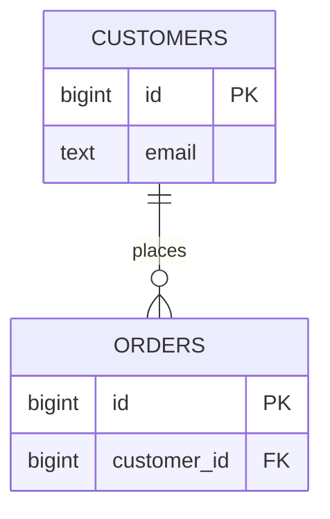
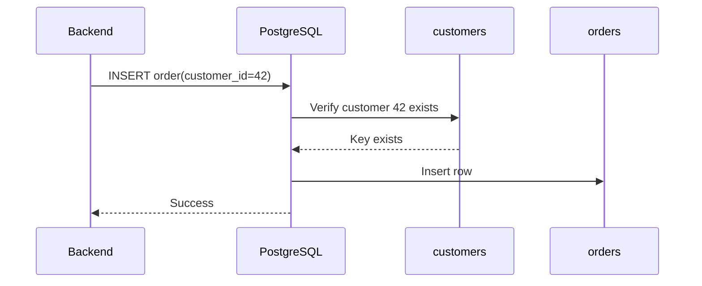
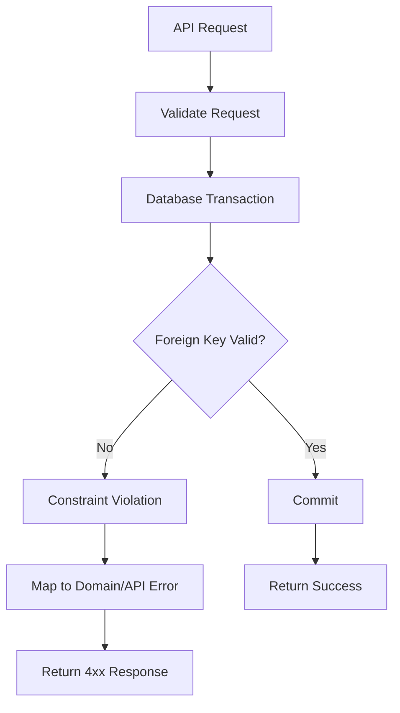

# 05- FOREIGN KEY

## Overview

A `FOREIGN KEY` is a database constraint that enforces a relationship between rows in two tables.

It ensures that a value in a child table corresponds to an existing candidate key in a parent table, unless the foreign-key column is allowed to be `NULL`.

For example:

```sql
CREATE TABLE customers (
    id bigint GENERATED ALWAYS AS IDENTITY PRIMARY KEY,
    email text NOT NULL UNIQUE
);

CREATE TABLE orders (
    id bigint GENERATED ALWAYS AS IDENTITY PRIMARY KEY,
    customer_id bigint NOT NULL,

    CONSTRAINT fk_orders_customer
        FOREIGN KEY (customer_id)
        REFERENCES customers(id)
);
```

The database now guarantees that every non-null `orders.customer_id` refers to an existing `customers.id`.

This is **referential integrity**.

Foreign keys are fundamental to relational data modeling because they move relationship correctness from application code into the database. They also affect deletes, updates, transactions, indexing, migrations, query planning, locking, and distributed application design.

## Why Foreign Keys Exist

Without a foreign key, an application could accidentally create orphaned rows:

```text
customers
---------
id
1
2

orders
---------
id | customer_id
10 | 1
11 | 999   ← no corresponding customer
```

The application may have intended `999` to refer to a customer, but the database has no way to know that without an explicit constraint.

With:

```sql
FOREIGN KEY (customer_id)
REFERENCES customers(id)
```

the database rejects invalid references.

This creates a strong invariant:

```text
orders.customer_id
        ↓
must reference
        ↓
customers.id
```

unless the relationship is explicitly optional and `customer_id` is `NULL`.

## Parent and Child Tables

The table containing the referenced key is commonly called the **parent** or **referenced** table.

The table containing the foreign key is commonly called the **child** or **referencing** table.



In this example:

```text
customers.id
    ↓
parent key

orders.customer_id
    ↓
foreign key
```

A foreign key can reference a primary key or an appropriate unique constraint.

## Basic Syntax

The inline form is concise:

```sql
CREATE TABLE orders (
    id bigint GENERATED ALWAYS AS IDENTITY PRIMARY KEY,
    customer_id bigint NOT NULL REFERENCES customers(id)
);
```

The named-constraint form is generally preferable for production schemas:

```sql
CREATE TABLE orders (
    id bigint GENERATED ALWAYS AS IDENTITY PRIMARY KEY,
    customer_id bigint NOT NULL,

    CONSTRAINT fk_orders_customer
        FOREIGN KEY (customer_id)
        REFERENCES customers(id)
);
```

Named constraints make:

- Migration failures easier to diagnose.
- Database errors easier to interpret.
- Schema inspection easier.
- Constraint management more predictable.

## How Referential Integrity Works

When inserting a child row:

```sql
INSERT INTO orders (customer_id)
VALUES (42);
```

the database verifies that the referenced parent key exists.

Conceptually:



If the parent does not exist:

```sql
INSERT INTO orders (customer_id)
VALUES (999999);
```

PostgreSQL rejects the operation with a foreign-key violation.

The application should treat this as a data-integrity error rather than attempting to simulate referential integrity through a separate `SELECT`.

## Foreign Keys and `NULL`

A foreign key does not necessarily require a relationship.

Consider:

```sql
CREATE TABLE employees (
    id bigint GENERATED ALWAYS AS IDENTITY PRIMARY KEY,
    manager_id bigint,

    CONSTRAINT fk_employee_manager
        FOREIGN KEY (manager_id)
        REFERENCES employees(id)
);
```

`manager_id = NULL` is allowed because the relationship is optional.

```text
manager_id = 42
→ employee 42 must exist

manager_id = NULL
→ no manager relationship
```

If every employee must have a manager, use:

```sql
manager_id bigint NOT NULL
```

The distinction is important:

```text
FOREIGN KEY
→ validates referenced values

NOT NULL
→ requires a value to be present
```

They solve different problems and are often used together.

## Foreign Key to a `UNIQUE` Key

A foreign key does not have to reference the primary key.

It can reference a suitable unique key.

```sql
CREATE TABLE customers (
    id bigint GENERATED ALWAYS AS IDENTITY PRIMARY KEY,
    external_id uuid NOT NULL UNIQUE
);

CREATE TABLE payments (
    id bigint GENERATED ALWAYS AS IDENTITY PRIMARY KEY,
    customer_external_id uuid NOT NULL,

    CONSTRAINT fk_payments_customer
        FOREIGN KEY (customer_external_id)
        REFERENCES customers(external_id)
);
```

The referenced columns must satisfy the database's requirements for a referenced key.

For PostgreSQL, a referenced column set must be backed by a suitable non-partial unique constraint or unique index.

However, using a surrogate primary key for internal relationships is often simpler and more efficient.

## Composite Foreign Keys

A foreign key can reference multiple columns.

Parent:

```sql
CREATE TABLE tenant_users (
    tenant_id bigint NOT NULL,
    user_id bigint NOT NULL,

    CONSTRAINT pk_tenant_users
        PRIMARY KEY (tenant_id, user_id)
);
```

Child:

```sql
CREATE TABLE user_permissions (
    tenant_id bigint NOT NULL,
    user_id bigint NOT NULL,
    permission_id bigint NOT NULL,

    CONSTRAINT fk_permissions_user
        FOREIGN KEY (tenant_id, user_id)
        REFERENCES tenant_users(tenant_id, user_id)
);
```

The relationship is validated as a pair:

```text
(tenant_id, user_id)
        ↓
must exist in tenant_users
```

This is useful for strongly tenant-scoped models where the combination of keys represents identity.

## Foreign Key Actions

A foreign key defines what should happen when the referenced parent row is updated or deleted.

Common PostgreSQL actions are:

| Action | Behavior |
|---|---|
| `NO ACTION` | Rejects the operation if the relationship would be violated; default behavior |
| `RESTRICT` | Rejects the operation when dependent rows exist |
| `CASCADE` | Propagates delete/update to dependent rows |
| `SET NULL` | Sets referencing columns to `NULL` |
| `SET DEFAULT` | Sets referencing columns to their default value |

Example:

```sql
CREATE TABLE order_items (
    id bigint GENERATED ALWAYS AS IDENTITY PRIMARY KEY,
    order_id bigint NOT NULL,

    CONSTRAINT fk_order_items_order
        FOREIGN KEY (order_id)
        REFERENCES orders(id)
        ON DELETE CASCADE
);
```

Deleting an order causes its order items to be deleted automatically.

## `ON DELETE CASCADE`

`CASCADE` is useful when the child has no meaningful independent existence.

Example:

```text
order
  └── order_items
```

If an order is permanently deleted, its items may also need to disappear.

```sql
FOREIGN KEY (order_id)
REFERENCES orders(id)
ON DELETE CASCADE
```

This is appropriate for tightly owned dependent data.

It should be used carefully for relationships involving:

- Financial records.
- Audit history.
- Compliance data.
- Shared resources.
- Large dependency graphs.

A single delete can otherwise trigger a large cascading operation.

## `ON DELETE RESTRICT` and `NO ACTION`

For important parent records, preventing accidental deletion is often safer.

```sql
FOREIGN KEY (customer_id)
REFERENCES customers(id)
ON DELETE RESTRICT
```

This expresses:

```text
Customer cannot be deleted while dependent orders exist.
```

PostgreSQL's default is `NO ACTION`.

The distinction between `NO ACTION` and `RESTRICT` becomes relevant primarily when constraints are deferrable and transaction timing matters. For ordinary immediate constraints, both prevent an invalid final relationship.

## `ON DELETE SET NULL`

Use `SET NULL` when the child can meaningfully exist without the parent.

```sql
CREATE TABLE support_tickets (
    id bigint GENERATED ALWAYS AS IDENTITY PRIMARY KEY,
    assigned_agent_id bigint,

    CONSTRAINT fk_ticket_agent
        FOREIGN KEY (assigned_agent_id)
        REFERENCES employees(id)
        ON DELETE SET NULL
);
```

If the employee is deleted:

```text
assigned_agent_id
        ↓
      NULL
```

This requires the foreign-key column to permit `NULL`.

## `ON UPDATE CASCADE`

Updates to referenced primary keys are relatively uncommon because good primary keys are normally immutable.

However, the mechanism exists:

```sql
FOREIGN KEY (country_code)
REFERENCES countries(code)
ON UPDATE CASCADE
```

For surrogate keys:

```text
customer.id
```

should normally never change.

Therefore, `ON UPDATE CASCADE` should not be used as a substitute for choosing a stable primary key.

## Immediate vs Deferrable Constraints

Most foreign-key constraints are checked immediately.

For example:

```sql
INSERT INTO orders (customer_id)
VALUES (42);
```

requires the referenced key to satisfy the constraint at the relevant statement/transaction point.

PostgreSQL also supports **deferrable** foreign keys.

```sql
CREATE TABLE child (
    id bigint PRIMARY KEY,
    parent_id bigint NOT NULL,

    CONSTRAINT fk_child_parent
        FOREIGN KEY (parent_id)
        REFERENCES parent(id)
        DEFERRABLE INITIALLY DEFERRED
);
```

With a deferred constraint, the database can postpone validation until transaction commit.

This is useful for complex transactional operations where temporarily inconsistent intermediate states are necessary.

It should not be used casually. Deferrable constraints add complexity to transaction behavior and are unnecessary for most application schemas.

## Foreign Keys and Transactions

Foreign-key checks participate in database transactions.

For example:

```sql
BEGIN;

INSERT INTO customers (id, email)
VALUES (100, 'alice@example.com');

INSERT INTO orders (customer_id)
VALUES (100);

COMMIT;
```

The database can maintain consistency across the entire transaction.

This is significantly safer than application code attempting to coordinate multiple independent operations without transactional guarantees.

A typical backend request might therefore be:

```text
HTTP request
    ↓
Django / FastAPI
    ↓
transaction
    ├── create/update parent
    ├── create/update child
    └── commit
    ↓
PostgreSQL validates constraints
    ↓
response
```

## Foreign Key Indexing

A critical production consideration is indexing the referencing column.

Suppose:

```sql
CREATE TABLE orders (
    id bigint PRIMARY KEY,
    customer_id bigint NOT NULL,
    FOREIGN KEY (customer_id) REFERENCES customers(id)
);
```

The foreign key does **not** automatically mean that PostgreSQL creates an index on:

```sql
orders.customer_id
```

An index is often important:

```sql
CREATE INDEX idx_orders_customer_id
    ON orders(customer_id);
```

This can improve:

```sql
SELECT *
FROM orders
WHERE customer_id = 42;
```

and can significantly help parent deletes or updates because the database must locate referencing rows when enforcing the relationship.

### Important Rule

```text
Referenced key
→ automatically indexed by primary key / suitable unique constraint

Referencing foreign-key column
→ usually needs its own index
```

Whether the index is required depends on workload, existing composite indexes, and query patterns.

## Composite Foreign-Key Indexes

For:

```sql
FOREIGN KEY (tenant_id, user_id)
REFERENCES tenant_users(tenant_id, user_id)
```

an index such as:

```sql
CREATE INDEX idx_permissions_tenant_user
    ON user_permissions(tenant_id, user_id);
```

is often appropriate.

Column order should reflect actual query patterns.

For example:

```sql
WHERE tenant_id = 42
  AND user_id = 100
```

can efficiently use:

```text
(tenant_id, user_id)
```

If queries frequently filter by `user_id` alone, a separate index may be necessary.

## Foreign Keys and Performance

Foreign-key constraints generally impose some overhead because the database must maintain referential integrity.

The cost is usually worthwhile because the database gains a strong correctness guarantee.

Potential performance costs include:

- Additional checks during inserts.
- Additional checks during updates.
- Work during parent deletes.
- Lock interactions.
- Index maintenance.
- Cascading operations.

Proper indexes on referencing columns are particularly important for large tables.

Without them, deleting or updating a parent row can require expensive scans of child tables.

## Large-Scale Delete Example

Consider:

```text
customers
1 million rows

orders
500 million rows
```

and:

```sql
FOREIGN KEY (customer_id)
REFERENCES customers(id)
```

Deleting one customer requires PostgreSQL to establish that there are no referencing orders, or to process the configured action.

An index on:

```sql
orders(customer_id)
```

allows PostgreSQL to find relevant child rows efficiently.

At scale, constraint design and indexing therefore become part of operational performance engineering.

## Foreign Keys in Soft-Delete Systems

Soft deletion changes the semantics of deletion.

Example:

```sql
UPDATE customers
SET deleted_at = now()
WHERE id = 42;
```

The row still physically exists.

A foreign key can still reference it:

```text
orders.customer_id = 42
```

even though application queries may treat customer `42` as deleted.

This means:

```text
Foreign key
→ enforces physical row existence

Soft-delete policy
→ enforced through application/query semantics
```

A foreign key does not understand that:

```sql
deleted_at IS NOT NULL
```

means "logically deleted."

If the business requires preventing new relationships to soft-deleted records, enforce that policy explicitly through application logic, triggers, schema design, or an appropriate transactional pattern.

## Foreign Keys and Multi-Tenancy

In multi-tenant systems, a simple foreign key can sometimes permit an invalid cross-tenant relationship.

For example:

```text
tenant 1 → user 10
tenant 2 → order 20
```

If the schema only contains:

```sql
FOREIGN KEY (user_id)
REFERENCES users(id)
```

the database verifies that user `10` exists, but it does not necessarily encode tenant ownership.

A stronger model can include tenant identity:

```sql
CREATE TABLE tenant_users (
    tenant_id bigint NOT NULL,
    user_id bigint NOT NULL,

    CONSTRAINT pk_tenant_users
        PRIMARY KEY (tenant_id, user_id)
);

CREATE TABLE orders (
    id bigint GENERATED ALWAYS AS IDENTITY PRIMARY KEY,
    tenant_id bigint NOT NULL,
    user_id bigint NOT NULL,

    CONSTRAINT fk_orders_tenant_user
        FOREIGN KEY (tenant_id, user_id)
        REFERENCES tenant_users(tenant_id, user_id)
);
```

Now the database itself enforces:

```text
(tenant_id, user_id)
must be a valid tenant-user relationship
```

This is a powerful example of using constraints to encode domain invariants rather than relying entirely on application code.

## Foreign Keys and Microservices

Foreign keys work best when related data lives inside the same transactional database.

For example:

```text
Orders DB
    ├── customers
    ├── orders
    └── order_items
```

Strong foreign keys are appropriate.

But consider:

```text
Orders Service
      ↓
Orders DB

Customer Service
      ↓
Customer DB
```

A PostgreSQL foreign key cannot normally enforce a relationship across two independent databases.

The system may instead rely on:

- Application-level validation.
- Synchronous service calls.
- Event-driven synchronization.
- Local replicated identifiers.
- Reconciliation jobs.
- Domain-specific consistency guarantees.

Do not attempt to preserve database-level foreign keys across independent service databases. This creates coupling that defeats the purpose of independent service ownership.

## Foreign Keys and Event-Driven Systems

Suppose:

```text
Customer Service
      ↓
Kafka
      ↓
Order Service
```

The order service may receive a customer identifier without having a local customer row.

A local foreign key may therefore be impossible.

Instead, the service may store:

```sql
customer_id bigint NOT NULL
```

without a database-level foreign key and rely on a defined distributed consistency model.

This is a deliberate trade-off, not an omission.

The key question is:

> Which system owns the invariant, and where can that invariant be enforced atomically?

## Foreign Keys and ORMs

### Django

Django's `ForeignKey` maps naturally to a relational foreign key.

```python
from django.db import models


class Customer(models.Model):
    email = models.EmailField(unique=True)


class Order(models.Model):
    customer = models.ForeignKey(
        Customer,
        on_delete=models.PROTECT,
    )
```

`on_delete` expresses the intended deletion behavior.

Common choices include:

```python
models.CASCADE
models.PROTECT
models.SET_NULL
models.RESTRICT
```

If using `SET_NULL`, the field must be nullable:

```python
customer = models.ForeignKey(
    Customer,
    on_delete=models.SET_NULL,
    null=True,
)
```

Django migrations should create and maintain the actual database constraint.

### SQLAlchemy

A SQLAlchemy model can declare:

```python
from sqlalchemy import BigInteger, ForeignKey
from sqlalchemy.orm import DeclarativeBase, Mapped, mapped_column


class Base(DeclarativeBase):
    pass


class Order(Base):
    __tablename__ = "orders"

    id: Mapped[int] = mapped_column(
        BigInteger,
        primary_key=True,
    )

    customer_id: Mapped[int] = mapped_column(
        ForeignKey("customers.id"),
        nullable=False,
        index=True,
    )
```

The `index=True` is an application/schema design choice that should correspond to actual access patterns.

ORM relationship declarations do not replace understanding the underlying database constraint.

## Foreign Keys and API Errors

A backend should translate constraint failures into appropriate domain/API responses.

For example:

```text
POST /orders
{
  "customer_id": 999999
}
```

If customer `999999` does not exist, the API should generally return a client-facing validation or not-found error rather than a raw database exception.

Conceptually:



Application validation can improve error messages, but the database constraint remains necessary because concurrent requests can invalidate a previous application-level check.

## Why Application-Level Validation Is Not Enough

This is unsafe:

```python
if customer_exists(customer_id):
    create_order(customer_id)
```

Two concurrent requests can observe different states:

```text
Request A: customer exists
Request B: customer deleted
Request A: create order
```

Only the database can atomically enforce the final integrity condition.

Application validation is useful for user experience.

Database constraints are necessary for correctness.

Use both when appropriate.

## Security Considerations

Foreign keys do not provide authorization.

For example:

```sql
orders.customer_id = 42
```

only means that customer `42` exists.

It does not mean:

```text
the current authenticated user
is allowed to access customer 42
```

A secure request flow is:

```text
Authentication
    ↓
Authorization
    ↓
Business validation
    ↓
Database transaction
    ↓
Foreign-key enforcement
```

For multi-tenant systems, database constraints can strengthen isolation by preventing structurally invalid cross-tenant relationships, but they should complement—not replace—application authorization.

## Migration and Deployment Considerations

Adding a foreign key to a large production table can be expensive.

Before adding:

```sql
ALTER TABLE orders
ADD CONSTRAINT fk_orders_customer
FOREIGN KEY (customer_id)
REFERENCES customers(id);
```

check for:

- Existing orphaned rows.
- Invalid `NULL` assumptions.
- Referenced-key compatibility.
- Lock behavior.
- Child-table size.
- Existing indexes.
- Migration duration.
- Deployment strategy.

A typical migration workflow is:

```text
1. Audit existing data
        ↓
2. Clean invalid references
        ↓
3. Add supporting indexes
        ↓
4. Add constraint using an appropriate rollout strategy
        ↓
5. Verify integrity
```

For PostgreSQL, `NOT VALID` can be useful for adding certain foreign-key constraints while avoiding an immediate full validation of existing rows.

```sql
ALTER TABLE orders
ADD CONSTRAINT fk_orders_customer
FOREIGN KEY (customer_id)
REFERENCES customers(id)
NOT VALID;
```

New writes are constrained while existing rows can be validated separately:

```sql
ALTER TABLE orders
VALIDATE CONSTRAINT fk_orders_customer;
```

This can be valuable for large production migrations, but lock and operational characteristics should still be tested against the actual PostgreSQL version and workload.

## Common Mistakes

### Forgetting the Foreign Key Entirely

This leaves referential integrity to application code.

If the relationship is mandatory and belongs to the same database, a database constraint is usually preferable.

### Using `CASCADE` Everywhere

`CASCADE` can turn a small delete into a large recursive operation.

Use it only where child ownership is clear.

### Forgetting to Index Foreign-Key Columns

A foreign key does not automatically provide the same indexing behavior on the child side as a primary key does on the parent side.

Review indexes for:

- Joins.
- Parent deletes.
- Parent updates.
- Filtering by foreign-key values.

### Assuming `FOREIGN KEY` Implies `NOT NULL`

This is incorrect:

```sql
customer_id bigint REFERENCES customers(id)
```

`customer_id` can still be `NULL`.

Use:

```sql
customer_id bigint NOT NULL
    REFERENCES customers(id)
```

when the relationship is mandatory.

### Performing Only an Existence Check

This pattern:

```sql
SELECT 1 FROM customers WHERE id = 42;
```

followed later by:

```sql
INSERT INTO orders (customer_id)
VALUES (42);
```

is subject to race conditions.

Use a foreign key as the final integrity guarantee.

### Using Foreign Keys Across Service Databases

Independent microservices should not be coupled through cross-database referential constraints.

Define ownership and consistency boundaries explicitly.

### Ignoring Existing Orphaned Data

Adding a constraint to an existing table can fail because historical data already violates the intended invariant.

Audit and clean the data before enforcing the constraint.

### Assuming Soft Deletes Are Understood by the Database

A foreign key sees physical rows, not application-level concepts such as:

```text
deleted_at IS NOT NULL
```

Model soft-delete semantics explicitly.

### Ignoring Tenant Boundaries

A simple foreign key may prove that a referenced record exists without proving that it belongs to the same tenant.

When tenant ownership is a database-level invariant, consider composite keys or other schema-level enforcement.

## Production Checklist

Before deploying a foreign key, verify:

- [ ] The relationship represents a real domain invariant.
- [ ] Parent key columns are appropriate referenced keys.
- [ ] Foreign-key column types are compatible.
- [ ] `NOT NULL` is used when the relationship is mandatory.
- [ ] Delete behavior is intentional.
- [ ] Update behavior is intentional.
- [ ] Existing orphaned rows have been identified.
- [ ] Referencing columns have appropriate indexes.
- [ ] Large-table migration behavior has been tested.
- [ ] Application code handles constraint violations cleanly.
- [ ] Authorization is implemented independently.
- [ ] Cross-service ownership boundaries do not rely on impossible cross-database foreign keys.

## Interview Traps

| Question | Correct reasoning |
|---|---|
| Does a foreign key have to reference a primary key? | No. It can reference a suitable unique key. |
| Does a foreign key automatically make the column `NOT NULL`? | No. `NULL` is allowed unless `NOT NULL` is specified. |
| Does PostgreSQL automatically index the child foreign-key column? | No. The referencing side often needs an explicit index. |
| Can a foreign key contain multiple columns? | Yes. Composite foreign keys are supported. |
| What does `ON DELETE CASCADE` do? | Deletes dependent child rows when the referenced parent row is deleted. |
| What does `SET NULL` require? | The referencing column must permit `NULL`. |
| Does application validation replace a foreign key? | No. Application checks can race; the database constraint provides the final integrity guarantee. |
| Can a foreign key enforce relationships across microservice databases? | Generally no. Independent databases require application/event-driven consistency mechanisms. |
| Does a foreign key enforce authorization? | No. It enforces referential integrity, not access control. |
| Does a foreign key understand soft deletes? | No. It operates on physical row existence. |
| Why index a foreign-key column? | To accelerate joins and help the database efficiently find dependent rows during parent updates/deletes. |
| When is `CASCADE` dangerous? | When parent rows have large or deep dependency graphs or when child records must be retained for audit/compliance reasons. |

## Key Takeaways

- **Foreign keys enforce referential integrity by guaranteeing that child references point to valid parent keys, unless the relationship is explicitly nullable.**
- **Use foreign keys for invariants that belong within the same transactional database; do not rely solely on application-level existence checks.**
- **Index referencing columns according to join and modification patterns, especially on large tables where parent deletes or updates must locate dependent rows efficiently.**
- **Choose `CASCADE`, `RESTRICT`/`NO ACTION`, `SET NULL`, and related actions based on domain ownership and data-retention requirements, not convenience.**
- **In distributed systems, treat database boundaries as consistency boundaries and explicitly design the alternative to cross-database referential integrity.**