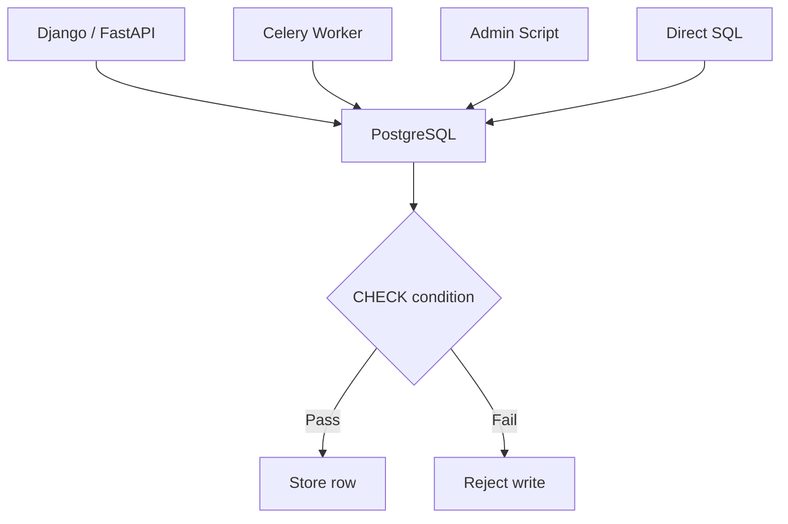
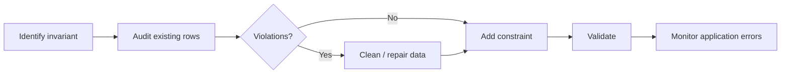

# 06- CHECK

## Overview

A `CHECK` constraint enforces a boolean condition on values stored in a table. It allows the database to reject rows that violate domain rules that cannot be expressed adequately through `NOT NULL`, `UNIQUE`, `PRIMARY KEY`, or `FOREIGN KEY`.

For example:

```sql
CREATE TABLE products (
    id bigint GENERATED ALWAYS AS IDENTITY PRIMARY KEY,
    name text NOT NULL,
    price numeric(12, 2) NOT NULL,
    stock_quantity integer NOT NULL,

    CONSTRAINT chk_products_price_positive
        CHECK (price >= 0),

    CONSTRAINT chk_products_stock_non_negative
        CHECK (stock_quantity >= 0)
);
```

The database now guarantees:

```text
price >= 0
stock_quantity >= 0
```

regardless of whether the write originates from Django, FastAPI, a background worker, a migration script, or a direct SQL client.

`CHECK` constraints are especially valuable for **domain invariants** that should remain true for every committed row.

## Why CHECK Constraints Exist

Application code can validate input:

```python
if price < 0:
    raise ValueError("price cannot be negative")
```

but application-level validation alone does not guarantee database integrity.

Multiple writers may access the same database:

```text
Django API
     \
FastAPI API
      \
Celery worker -----> PostgreSQL
      /
Admin scripts
```

Every writer would need to implement exactly the same validation.

A database constraint provides a single authoritative enforcement point:



Application validation remains useful for good API error messages, but the database constraint provides the final integrity guarantee.

## Basic Syntax

A column-level constraint:

```sql
CREATE TABLE accounts (
    id bigint GENERATED ALWAYS AS IDENTITY PRIMARY KEY,
    balance numeric(12, 2)
        CONSTRAINT chk_accounts_balance
        CHECK (balance >= 0)
);
```

A table-level constraint:

```sql
CREATE TABLE accounts (
    id bigint GENERATED ALWAYS AS IDENTITY PRIMARY KEY,
    balance numeric(12, 2) NOT NULL,

    CONSTRAINT chk_accounts_balance
        CHECK (balance >= 0)
);
```

The table-level form is more flexible when the rule involves multiple columns.

## How CHECK Works

A `CHECK` constraint evaluates an expression for each row being inserted or updated.

For example:

```sql
CREATE TABLE employees (
    id bigint GENERATED ALWAYS AS IDENTITY PRIMARY KEY,
    age integer NOT NULL,

    CONSTRAINT chk_employees_age
        CHECK (age >= 18)
);
```

This succeeds:

```sql
INSERT INTO employees (age)
VALUES (30);
```

This fails:

```sql
INSERT INTO employees (age)
VALUES (16);
```

An update is checked as well:

```sql
UPDATE employees
SET age = 16
WHERE id = 1;
```

The database rejects the update because the resulting row would violate the constraint.

Conceptually:

```text
INSERT / UPDATE
      ↓
Evaluate CHECK expression
      ↓
    ┌─────────────┐
    │ TRUE?       │
    └─────────────┘
      ↓       ↓
    Yes       No
     ↓         ↓
  Store      Reject
```

## What Values Make a CHECK Pass?

A common interview and production trap is that SQL uses **three-valued logic**:

```text
TRUE
FALSE
UNKNOWN
```

A `CHECK` constraint rejects a row when its expression evaluates to `FALSE`.

An expression evaluating to `UNKNOWN` does not violate the constraint.

For example:

```sql
CREATE TABLE users (
    age integer,

    CONSTRAINT chk_users_age
        CHECK (age >= 18)
);
```

This is accepted:

```sql
INSERT INTO users (age)
VALUES (NULL);
```

Why?

```text
NULL >= 18
→ UNKNOWN
```

The `CHECK` does not reject `UNKNOWN`.

If `age` is mandatory, combine the constraints:

```sql
age integer NOT NULL,

CONSTRAINT chk_users_age
    CHECK (age >= 18)
```

Now the responsibilities are explicit:

```text
NOT NULL
→ value must exist

CHECK
→ existing value must satisfy the rule
```

## Column-Level vs Table-Level CHECK

Column-level:

```sql
CREATE TABLE products (
    price numeric(12, 2)
        CHECK (price >= 0)
);
```

Table-level:

```sql
CREATE TABLE products (
    price numeric(12, 2) NOT NULL,
    sale_price numeric(12, 2),

    CONSTRAINT chk_products_sale_price
        CHECK (
            sale_price IS NULL
            OR sale_price <= price
        )
);
```

Use a table-level constraint when the invariant involves multiple columns.

### Example: Date Range

```sql
CREATE TABLE subscriptions (
    id bigint GENERATED ALWAYS AS IDENTITY PRIMARY KEY,
    starts_at timestamptz NOT NULL,
    ends_at timestamptz,

    CONSTRAINT chk_subscriptions_date_range
        CHECK (ends_at IS NULL OR ends_at > starts_at)
);
```

This expresses a database invariant:

```text
ends_at must be later than starts_at
```

when an end date exists.

## Common CHECK Patterns

### Non-Negative Values

```sql
CHECK (quantity >= 0)
```

Useful for:

- Inventory.
- Counters.
- Balances where negative values are invalid.
- Quantities.

### Positive Values

```sql
CHECK (amount > 0)
```

Use when zero has no valid business meaning.

### Range Validation

```sql
CHECK (percentage >= 0 AND percentage <= 100)
```

### Enumerated Values

```sql
CHECK (status IN ('pending', 'processing', 'completed', 'failed'))
```

This can be appropriate for small, stable sets of values.

### Cross-Column Validation

```sql
CHECK (end_at IS NULL OR end_at > start_at)
```

### Conditional Validation

```sql
CHECK (
    status <> 'completed'
    OR completed_at IS NOT NULL
)
```

This encodes:

```text
If status = completed
→ completed_at must exist
```

A stronger model can also enforce the inverse condition when required:

```sql
CHECK (
    status = 'completed'
    OR completed_at IS NULL
)
```

Whether both directions are necessary depends on the domain invariant.

## CHECK and NULL

Consider:

```sql
CHECK (discount_percentage >= 0 AND discount_percentage <= 100)
```

If `discount_percentage` is `NULL`, the expression evaluates to `UNKNOWN`, so the `CHECK` passes.

If the field is optional:

```sql
discount_percentage numeric(5, 2)
```

this may be intentional.

If it is required:

```sql
discount_percentage numeric(5, 2) NOT NULL
```

Use `NOT NULL` explicitly rather than assuming `CHECK` will reject missing values.

## CHECK vs ENUM

For a small set of values, PostgreSQL provides multiple modeling options.

| Approach | Strength | Limitation |
|---|---|---|
| `CHECK` | Simple, explicit, easy to alter | Values are not first-class schema objects |
| PostgreSQL `ENUM` | Strong database-level type | Adding/changing values requires schema operations |
| Lookup table + FK | Flexible and relational | Requires another table and join |
| Application-only validation | Flexible | Database cannot guarantee integrity |

Example with `CHECK`:

```sql
status text NOT NULL
    CHECK (status IN ('pending', 'paid', 'cancelled'))
```

This is often a good choice when the set is small and relatively stable.

For a highly dynamic set managed by administrators, a lookup table with a foreign key is usually more appropriate.

## CHECK vs FOREIGN KEY

These constraints solve different problems.

```text
CHECK
→ validates a condition within a row

FOREIGN KEY
→ validates a relationship between rows
```

Example:

```sql
CREATE TABLE orders (
    id bigint PRIMARY KEY,
    customer_id bigint NOT NULL,
    total numeric(12, 2) NOT NULL,

    CONSTRAINT fk_orders_customer
        FOREIGN KEY (customer_id)
        REFERENCES customers(id),

    CONSTRAINT chk_orders_total
        CHECK (total >= 0)
);
```

The foreign key verifies the customer exists.

The check constraint verifies that the order total is valid.

## CHECK and Data Types

Choose the appropriate data type before adding a constraint.

For monetary values:

```sql
amount numeric(12, 2) NOT NULL
    CHECK (amount >= 0)
```

is generally preferable to storing money as floating-point data.

For integer quantities:

```sql
quantity integer NOT NULL
    CHECK (quantity >= 0)
```

For timestamps:

```sql
starts_at timestamptz NOT NULL,
ends_at timestamptz,

CHECK (ends_at IS NULL OR ends_at >= starts_at)
```

A `CHECK` should enforce the domain rule; the data type should enforce the representation.

## CHECK Constraints and Business Rules

Not every business rule belongs in a `CHECK`.

Good candidates are deterministic invariants that can be evaluated from the row's values.

Examples:

```text
quantity >= 0
percentage BETWEEN 0 AND 100
end_at > start_at
min_value <= max_value
status-specific required fields
```

Poor candidates include rules requiring:

- External API calls.
- Current application state outside the row.
- Complex cross-service logic.
- Non-deterministic behavior.
- Aggregations over large sets of other rows.

For example, this requirement:

```text
A customer may have no more than 5 active subscriptions.
```

is not a normal `CHECK` constraint because it requires examining multiple rows.

That invariant needs a different mechanism, such as transactional logic, a unique/indexing strategy, or another database design.

## CHECK Constraints and Cross-Row Rules

A `CHECK` expression is intended to validate the row being written. It should not be treated as a general-purpose mechanism for enforcing arbitrary cross-row invariants.

For example, avoid designs conceptually equivalent to:

```text
CHECK (
    SELECT count(*)
    FROM ...
)
```

PostgreSQL does not allow subqueries in `CHECK` constraint expressions.

If a rule depends on multiple rows, consider:

- `UNIQUE` constraints.
- Partial unique indexes.
- `EXCLUDE` constraints where appropriate.
- Foreign keys.
- Transactions with appropriate locking.
- Triggers.
- Application/domain logic.

The right mechanism depends on the invariant.

## PostgreSQL CHECK Constraints

PostgreSQL supports named constraints:

```sql
CREATE TABLE payments (
    id bigint GENERATED ALWAYS AS IDENTITY PRIMARY KEY,
    amount numeric(12, 2) NOT NULL,
    currency char(3) NOT NULL,

    CONSTRAINT chk_payments_amount
        CHECK (amount > 0),

    CONSTRAINT chk_payments_currency
        CHECK (currency ~ '^[A-Z]{3}$')
);
```

Inspect constraints with:

```sql
SELECT
    conname,
    pg_get_constraintdef(oid)
FROM pg_constraint
WHERE conrelid = 'payments'::regclass;
```

Named constraints are useful during incident investigation and schema migrations.

## Adding a CHECK Constraint

Existing tables can be modified:

```sql
ALTER TABLE payments
ADD CONSTRAINT chk_payments_amount
CHECK (amount > 0);
```

If existing data violates the condition, the operation may fail during validation.

Before adding the constraint, audit the data:

```sql
SELECT *
FROM payments
WHERE amount <= 0;
```

Clean invalid data before enforcing the invariant.

## PostgreSQL `NOT VALID`

For large production tables, PostgreSQL supports adding certain `CHECK` constraints as `NOT VALID`:

```sql
ALTER TABLE payments
ADD CONSTRAINT chk_payments_amount
CHECK (amount > 0)
NOT VALID;
```

The constraint can then be validated separately:

```sql
ALTER TABLE payments
VALIDATE CONSTRAINT chk_payments_amount;
```

This can reduce the impact of validating a large existing table during the initial schema change.

The deployment still needs to be tested against the production PostgreSQL version and workload because constraint validation and locking behavior matter operationally.

## CHECK Constraint Lifecycle

A typical production migration looks like:



For a large table, a safer PostgreSQL rollout can use:

```text
Add NOT VALID
      ↓
Deploy application changes
      ↓
Validate constraint
      ↓
Monitor
```

The exact rollout depends on the migration framework, table size, write volume, and availability requirements.

## CHECK Constraints and Application Validation

A backend application should often validate before attempting the database write:

```python
if quantity < 0:
    raise ValueError("quantity must be non-negative")
```

This improves:

- API error messages.
- Client feedback.
- User experience.
- Avoidable database traffic.

But the database should still enforce the invariant:

```sql
CHECK (quantity >= 0)
```

The two layers serve different purposes:

| Layer | Responsibility |
|---|---|
| API validation | Fast, user-friendly feedback |
| Service/domain logic | Business behavior |
| Database `CHECK` | Final row-level integrity guarantee |

Do not remove the database constraint merely because the ORM validates the field.

## Django Integration

Django can express check constraints using `CheckConstraint`.

```python
from django.db import models
from django.db.models import Q


class Product(models.Model):
    price = models.DecimalField(max_digits=12, decimal_places=2)

    class Meta:
        constraints = [
            models.CheckConstraint(
                condition=Q(price__gte=0),
                name="chk_product_price_non_negative",
            ),
        ]
```

Django migrations translate this model definition into database-level schema changes for supported database backends.

The database remains the enforcement point.

Application-level validation and serializer validation can still provide more useful API errors.

## FastAPI and SQLAlchemy

With SQLAlchemy:

```python
from decimal import Decimal

from sqlalchemy import CheckConstraint, Numeric
from sqlalchemy.orm import DeclarativeBase, Mapped, mapped_column


class Base(DeclarativeBase):
    pass


class Product(Base):
    __tablename__ = "products"

    id: Mapped[int] = mapped_column(primary_key=True)
    price: Mapped[Decimal] = mapped_column(Numeric(12, 2), nullable=False)

    __table_args__ = (
        CheckConstraint(
            "price >= 0",
            name="chk_products_price_non_negative",
        ),
    )
```

FastAPI/Pydantic validation can reject invalid requests early, while PostgreSQL protects the persistent state.

## CHECK Constraints and Error Handling

A failed check constraint causes the database operation to fail.

For example:

```sql
INSERT INTO products (price)
VALUES (-10);
```

The application should not expose raw database errors directly to clients.

A typical architecture is:

```text
Request
  ↓
Pydantic / Django validation
  ↓
Service layer
  ↓
Transaction
  ↓
PostgreSQL CHECK
  ↓
Constraint violation
  ↓
Exception mapping
  ↓
API response
```

For expected user input errors, the API should return an appropriate client error rather than a generic `500`.

Constraint violations can also indicate programming or data-integrity bugs, so logging and metrics should distinguish expected validation failures from unexpected constraint failures.

## Performance Considerations

Simple `CHECK` constraints are generally inexpensive because they evaluate an expression against the row being written.

Examples:

```sql
CHECK (price >= 0)
```

and:

```sql
CHECK (quantity BETWEEN 0 AND 1000000)
```

are cheap.

More complicated expressions can increase write cost.

Avoid unnecessarily expensive expressions in high-write tables.

Remember that `CHECK` constraints generally affect write performance rather than read performance. They do not automatically create an index.

If a query frequently filters by:

```sql
WHERE quantity >= 0
```

a `CHECK` constraint does not replace an index.

## Reliability Considerations

Constraints improve reliability by making invalid database states difficult or impossible to persist.

They are especially valuable when the database has multiple writers:

```text
HTTP API
Background worker
Batch job
Admin tool
Data migration
ETL process
```

Each writer can make mistakes independently, but the database still protects the invariant.

This is one reason mature database schemas contain meaningful constraints rather than treating the database as passive storage.

## Security Considerations

A `CHECK` constraint is not an authorization mechanism.

For example:

```sql
CHECK (amount >= 0)
```

prevents negative amounts but does not determine:

```text
Who is allowed to modify the amount?
```

Authorization must remain in the application/service layer and, where appropriate, additional database security mechanisms such as roles or row-level security.

`CHECK` constraints protect **data validity**, not **access control**.

## Production Best Practices

### Name Constraints Explicitly

Prefer:

```sql
CONSTRAINT chk_orders_total_non_negative
CHECK (total >= 0)
```

over an anonymous constraint.

### Keep Invariants Close to the Data

If a rule must hold for every committed row, consider enforcing it in the database.

### Combine Constraints

Use each constraint for its intended responsibility:

```sql
email text NOT NULL UNIQUE
```

```text
NOT NULL
→ required

UNIQUE
→ no duplicates

CHECK
→ domain condition
```

### Keep Expressions Deterministic

A check should represent a stable property of the row.

Avoid depending on values that can change independently or external systems.

### Consider NULL Explicitly

If `NULL` is invalid:

```sql
value integer NOT NULL
```

Do not assume:

```sql
CHECK (value > 0)
```

will reject `NULL`.

### Audit Before Migration

Before adding a constraint to existing data:

```sql
SELECT *
FROM table_name
WHERE NOT (...expected condition...);
```

Understand and repair violations before enforcing the rule.

### Prefer Database Constraints Over Duplicated Validation Logic

If the invariant is important enough to be enforced in every write path, putting it only in Python code creates multiple opportunities for inconsistency.

## Common Mistakes

### Assuming CHECK Rejects NULL

This is incorrect:

```sql
age integer CHECK (age >= 18)
```

does not reject `NULL`.

Use:

```sql
age integer NOT NULL CHECK (age >= 18)
```

when the value is mandatory.

### Putting Every Business Rule in CHECK

A `CHECK` is not a general-purpose business-rule engine.

Rules involving other rows, services, external APIs, or complex workflows usually require different mechanisms.

### Duplicating Complex Rules Everywhere

If the same invariant is implemented independently in:

```text
Django
FastAPI
Celery
CLI
```

the implementations can drift.

Use a database constraint for row-level invariants that must hold regardless of the writer.

### Using CHECK Instead of the Correct Constraint

For example, do not emulate uniqueness with:

```sql
CHECK (email <> ...)
```

Use:

```sql
UNIQUE (email)
```

Likewise, use a foreign key for row relationships rather than a check attempting to represent referential integrity.

### Using CHECK as an Index

This:

```sql
CHECK (status = 'active')
```

does not speed up:

```sql
WHERE status = 'active'
```

If query performance requires it, create an appropriate index.

### Adding a Constraint Without Auditing Existing Data

Historical rows may already violate the intended rule.

Always identify violations before migration.

### Creating Overly Complex Expressions

Complex checks can make:

- migrations harder to reason about,
- errors harder to diagnose,
- writes more expensive,
- future schema changes harder.

Keep constraints focused and readable.

## Production Pitfalls

| Pitfall | Why it happens | Better approach |
|---|---|---|
| `NULL` unexpectedly passes | SQL three-valued logic | Combine `NOT NULL` with `CHECK` |
| Migration fails | Existing rows violate the rule | Audit and clean data first |
| API returns `500` | Constraint exception is not mapped | Translate expected violations into domain/API errors |
| Constraint becomes hard to modify | Rule is overly complex | Keep constraints focused and explicit |
| Cross-row rule is modeled as a row check | Wrong constraint mechanism | Use `UNIQUE`, indexes, transactions, triggers, or domain logic |
| Application and database disagree | Validation duplicated in multiple places | Keep the database as final integrity boundary |
| Performance issue during migration | Large table requires validation | Plan migration and consider `NOT VALID` where appropriate |

## Interview Traps

| Question | Correct reasoning |
|---|---|
| Does `CHECK (age >= 18)` reject `NULL`? | No. `NULL >= 18` evaluates to `UNKNOWN`, and `CHECK` does not reject `UNKNOWN`. |
| Does a `CHECK` constraint create an index? | No. It enforces validity but does not provide query indexing. |
| Can a `CHECK` enforce arbitrary cross-row rules? | No. It is intended for row-level expressions and cannot use subqueries in PostgreSQL. |
| Should application validation replace a `CHECK`? | No. Application validation improves feedback; the database should enforce critical invariants. |
| Can `CHECK` validate multiple columns? | Yes. Table-level checks can express cross-column invariants. |
| Is `CHECK` a replacement for `UNIQUE`? | No. Use `UNIQUE` for uniqueness. |
| Is `CHECK` a replacement for `FOREIGN KEY`? | No. Foreign keys enforce referential integrity between rows. |
| Does `CHECK` protect against unauthorized updates? | No. It validates data, not permissions. |
| Does `CHECK` improve read performance? | Not directly. It primarily adds validation during writes and does not create an index. |
| Why name a constraint? | Named constraints make migrations, diagnostics, monitoring, and schema management easier. |

## Key Takeaways

- **`CHECK` constraints enforce row-level domain invariants directly in the database, protecting data regardless of which application or process performs the write.**
- **Remember SQL's three-valued logic: a `CHECK` rejects `FALSE`, but `UNKNOWN` can pass, so combine `CHECK` with `NOT NULL` when a value is mandatory.**
- **Use the right constraint for the invariant: `CHECK` for conditions, `UNIQUE` for uniqueness, `FOREIGN KEY` for relationships, and other mechanisms for cross-row rules.**
- **Treat constraints as part of production schema design: name them, audit existing data before migrations, and plan validation carefully for large tables.**
- **Application validation improves API behavior, but database constraints remain the authoritative integrity boundary for critical row-level invariants.**