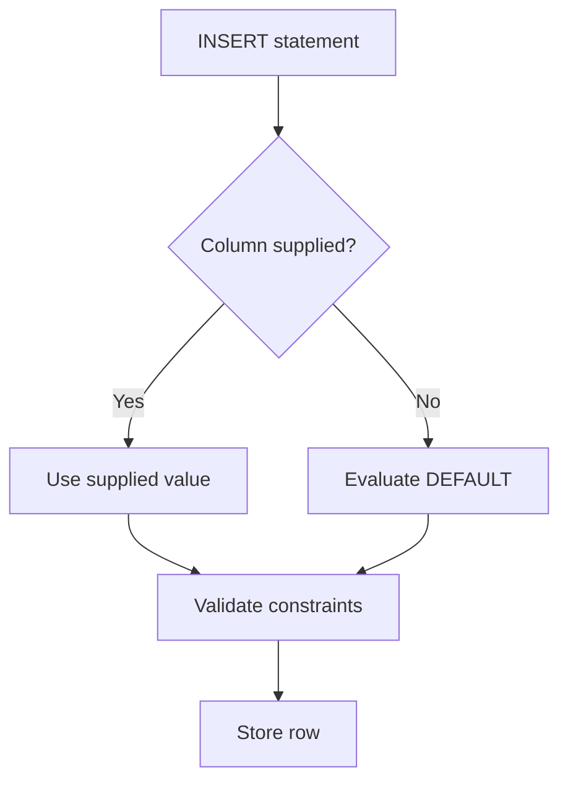
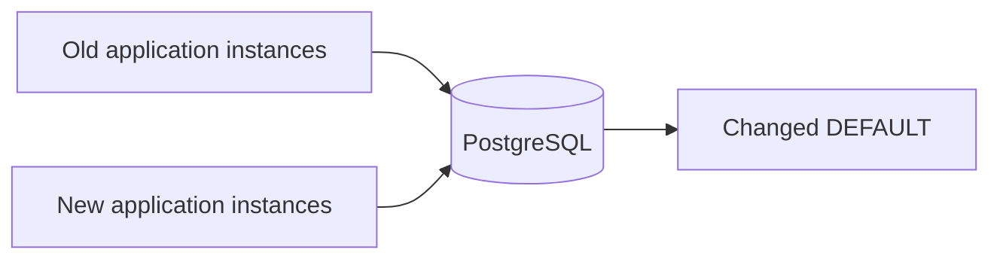

# 07- DEFAULT

## Overview

A `DEFAULT` defines a value or expression that the database uses when an `INSERT` does not provide a value for a column. It is a schema-level mechanism for establishing valid initial state without requiring every writer to explicitly supply the value.

Typical production uses include:

- Initial lifecycle states such as `pending`.
- Counters initialized to `0`.
- Boolean flags initialized to `true` or `false`.
- Database-generated timestamps.
- Database-generated UUIDs.
- Empty JSONB objects or arrays where an empty collection has clear domain meaning.

```sql
CREATE TABLE jobs (
    id bigint GENERATED ALWAYS AS IDENTITY PRIMARY KEY,
    status text NOT NULL DEFAULT 'pending',
    attempts integer NOT NULL DEFAULT 0,
    created_at timestamptz NOT NULL DEFAULT CURRENT_TIMESTAMP
);
```

A database default is particularly valuable when a database has multiple writers: web applications, background workers, administrative tools, data pipelines, and migration scripts can all benefit from the same initialization rule.

## Why DEFAULT Exists

Without a database default, every writer must explicitly initialize the column:

```sql
INSERT INTO jobs (status, attempts, created_at)
VALUES ('pending', 0, CURRENT_TIMESTAMP);
```

With a default:

```sql
INSERT INTO jobs DEFAULT VALUES;
```

the database can construct the initial state.

The write path can be viewed as:



The important distinction is that `DEFAULT` provides a value; it does not independently validate whether the resulting value is acceptable.

For example:

```sql
attempts integer NOT NULL DEFAULT 0
```

uses three different pieces of behavior:

- `DEFAULT 0` initializes omitted values.
- `NOT NULL` prevents `NULL`.
- A `CHECK` constraint can enforce additional business invariants.

```sql
CREATE TABLE jobs (
    attempts integer NOT NULL DEFAULT 0,

    CONSTRAINT chk_jobs_attempts
        CHECK (attempts >= 0)
);
```

## INSERT Semantics

Consider:

```sql
CREATE TABLE users (
    id bigint GENERATED ALWAYS AS IDENTITY PRIMARY KEY,
    display_name text DEFAULT 'Anonymous'
);
```

### Column Omitted

```sql
INSERT INTO users DEFAULT VALUES;
```

The database supplies:

```text
display_name = 'Anonymous'
```

### Explicit DEFAULT

SQL also allows the `DEFAULT` keyword:

```sql
INSERT INTO users (display_name)
VALUES (DEFAULT);
```

The column default is evaluated.

### Explicit Value

```sql
INSERT INTO users (display_name)
VALUES ('Aranya');
```

The supplied value takes precedence over the default.

### Explicit NULL

```sql
INSERT INTO users (display_name)
VALUES (NULL);
```

The default does not normally replace an explicitly supplied `NULL`.

This distinction is fundamental:

| INSERT behavior | Result |
|---|---|
| Column omitted | Default is used |
| `DEFAULT` supplied | Default is used |
| Explicit value supplied | Explicit value is used |
| Explicit `NULL` supplied | `NULL` is used, unless another rule rejects it |

If `NULL` is invalid:

```sql
display_name text NOT NULL DEFAULT 'Anonymous'
```

then explicitly supplying `NULL` fails because of `NOT NULL`.

## DEFAULT and NOT NULL

`DEFAULT` and `NOT NULL` solve different problems.

```sql
status text NOT NULL DEFAULT 'pending'
```

means:

```text
Column omitted
    ↓
Use 'pending'

Column explicitly set to NULL
    ↓
Rejected

Column explicitly set to 'running'
    ↓
Use 'running'
```

This combination is common for fields that must always have a valid initial state.

Example:

```sql
CREATE TABLE payments (
    id bigint GENERATED ALWAYS AS IDENTITY PRIMARY KEY,
    status text NOT NULL DEFAULT 'pending',
    attempt_count integer NOT NULL DEFAULT 0
);
```

The database now guarantees that a newly created payment has a non-null status and counter unless an explicit invalid value is supplied.

## DEFAULT and CHECK

A default establishes a valid initial value, while `CHECK` protects the invariant for all supplied values.

```sql
CREATE TABLE products (
    id bigint GENERATED ALWAYS AS IDENTITY PRIMARY KEY,
    stock_quantity integer NOT NULL DEFAULT 0,

    CONSTRAINT chk_products_stock_quantity
        CHECK (stock_quantity >= 0)
);
```

The default protects the omitted case:

```sql
INSERT INTO products DEFAULT VALUES;
```

The `CHECK` constraint protects explicit values:

```sql
INSERT INTO products (stock_quantity)
VALUES (-1);
```

The latter is rejected.

A strong schema often uses:

```text
DEFAULT → sensible initial state
NOT NULL → value must exist
CHECK → value must satisfy invariant
```

## Common DEFAULT Values

| Data | Example | Typical use |
|---|---|---|
| Text | `DEFAULT 'pending'` | Initial lifecycle state |
| Integer | `DEFAULT 0` | Counters |
| Boolean | `DEFAULT false` | Feature/state flags |
| Timestamp | `DEFAULT CURRENT_TIMESTAMP` | Creation time |
| UUID | `DEFAULT gen_random_uuid()` | Database-generated identifier |
| JSONB | `DEFAULT '{}'::jsonb` | Empty structured metadata |
| Array | `DEFAULT '{}'` | Empty collection |

The correct default depends on domain semantics. An arbitrary default such as `'unknown'` should not be introduced merely because the schema otherwise becomes inconvenient to write.

## DEFAULT Expressions

A default can be an expression rather than a literal.

```sql
created_at timestamptz NOT NULL DEFAULT CURRENT_TIMESTAMP
```

For UUID generation in PostgreSQL:

```sql
CREATE EXTENSION IF NOT EXISTS pgcrypto;

CREATE TABLE api_keys (
    id uuid PRIMARY KEY DEFAULT gen_random_uuid(),
    created_at timestamptz NOT NULL DEFAULT CURRENT_TIMESTAMP
);
```

This lets PostgreSQL generate values independently for each inserted row.

Defaults should remain relatively simple and deterministic from the perspective of the domain. Complex business workflows generally belong in application logic or explicit database procedures rather than being hidden inside defaults.

## DEFAULT and Timestamps

A common production pattern is:

```sql
created_at timestamptz NOT NULL DEFAULT CURRENT_TIMESTAMP
```

This makes the database responsible for generating the creation timestamp.

It is different from:

```sql
updated_at timestamptz DEFAULT CURRENT_TIMESTAMP
```

A default does **not** mean "run this expression every time the row is updated."

For example:

```sql
UPDATE jobs
SET status = 'completed'
WHERE id = 42;
```

does not automatically re-evaluate a normal `DEFAULT CURRENT_TIMESTAMP` on `updated_at`.

If `updated_at` must change on every update, use an explicit application update, a database trigger, or another deliberate mechanism.

## DEFAULT and Time Zones

For distributed backend systems, prefer timezone-aware PostgreSQL timestamps:

```sql
created_at timestamptz NOT NULL DEFAULT CURRENT_TIMESTAMP
```

This avoids depending on the local timezone configuration of individual application instances.

A typical architecture is:

```text
Web API / Worker
       |
       v
   PostgreSQL
       |
       v
timestamptz timestamp
       |
       v
API serialization
       |
       v
Client timezone/presentation
```

The database can therefore provide a consistent source of timestamp generation even when application instances run across multiple hosts, containers, or regions.

## DEFAULT and JSONB

PostgreSQL can use JSONB defaults:

```sql
CREATE TABLE users (
    id bigint GENERATED ALWAYS AS IDENTITY PRIMARY KEY,
    metadata jsonb NOT NULL DEFAULT '{}'::jsonb
);
```

This is appropriate when:

```text
{} = meaningful empty metadata
```

rather than:

```text
NULL = meaningful absence of metadata
```

The distinction matters in queries and application semantics.

For example:

```sql
WHERE metadata IS NULL
```

and:

```sql
WHERE metadata = '{}'::jsonb
```

represent different states.

Do not use a non-null empty object merely to eliminate `NULL` without deciding whether the two states actually have different domain meanings.

## DEFAULT and Identity Columns

Identity columns and ordinary defaults are related but serve different purposes.

```sql
id bigint GENERATED ALWAYS AS IDENTITY PRIMARY KEY
```

is designed for database-generated identifiers.

A normal field might instead use:

```sql
retry_count integer NOT NULL DEFAULT 0
```

The distinction is:

| Mechanism | Purpose |
|---|---|
| Identity column | Generate a column value as part of identity generation |
| `DEFAULT` | Supply a value/expression when no value is provided |
| `NOT NULL` | Reject null values |
| `CHECK` | Enforce a Boolean condition |
| `GENERATED` column | Derive a value from other row values |

Choose the mechanism that expresses the intended ownership and behavior.

## DEFAULT and Application Code

A database default and an application/ORM default are not necessarily the same thing.

For example, Django may define:

```python
from django.db import models


class Job(models.Model):
    status = models.CharField(
        max_length=32,
        default="pending",
    )
    attempts = models.PositiveIntegerField(default=0)
```

The ORM can apply those defaults before issuing SQL.

That does not automatically mean PostgreSQL has:

```sql
DEFAULT 'pending'
```

or:

```sql
DEFAULT 0
```

at the database level.

This distinction becomes important when other systems write directly to PostgreSQL.

### Application-Owned Default

```text
Django
   ↓
Python applies default
   ↓
INSERT
   ↓
PostgreSQL
```

### Database-Owned Default

```text
Django ───────┐
FastAPI ──────┤
Celery ───────┤
Admin SQL ────┤
               ↓
          PostgreSQL
               ↓
        Evaluate DEFAULT
```

If several independent writers exist, database-owned defaults can provide stronger consistency.

## SQLAlchemy and Server Defaults

SQLAlchemy distinguishes application-side defaults from server-side defaults.

Application-side:

```python
attempts = mapped_column(
    Integer,
    nullable=False,
    default=0,
)
```

Server-side:

```python
from sqlalchemy import Integer, text
from sqlalchemy.orm import Mapped, mapped_column

attempts: Mapped[int] = mapped_column(
    Integer,
    nullable=False,
    server_default=text("0"),
)
```

The second represents a database-level default.

The distinction matters when inserts can originate outside SQLAlchemy.

## DEFAULT and API Design

Database defaults should not automatically become client-controlled API fields.

For example, an API might accept:

```json
{
  "product_id": 123,
  "quantity": 2
}
```

while the database establishes:

```text
status = pending
attempt_count = 0
created_at = current timestamp
```

Clients generally should not be allowed to manipulate internal lifecycle fields simply because those columns exist.

Server-controlled values commonly include:

- Creation timestamps.
- Internal status.
- Retry counters.
- Audit metadata.
- Database-generated identifiers.

The API layer should define which fields clients may provide independently of database defaults.

## DEFAULT and Transactions

Default evaluation occurs as part of the `INSERT` statement and participates in the transaction.

```sql
BEGIN;

INSERT INTO jobs (status)
VALUES ('queued');

ROLLBACK;
```

The inserted row is rolled back along with the default-generated values.

This makes database defaults naturally compatible with transactional workflows.

However, a default does not provide transaction isolation for later state transitions.

For example:

```sql
UPDATE jobs
SET attempts = attempts + 1
WHERE id = 42;
```

is a concurrent mutation problem rather than a default-value problem.

## DEFAULT and Concurrency

Simple defaults such as:

```sql
attempts integer NOT NULL DEFAULT 0
```

do not require an application to query the database first.

This avoids unnecessary logic such as:

```text
SELECT current value
       ↓
Application calculates initial value
       ↓
INSERT
```

Instead:

```text
INSERT
  ↓
PostgreSQL evaluates DEFAULT
  ↓
Row is created
```

For generated identifiers, timestamps, and simple initial states, this centralization can reduce application-side race opportunities and duplicated initialization logic.

Defaults should not, however, be used to implement complex concurrent state transitions.

## Changing a DEFAULT

A PostgreSQL default can be changed with:

```sql
ALTER TABLE jobs
ALTER COLUMN status
SET DEFAULT 'queued';
```

This changes the behavior of future inserts.

It does **not** change existing rows.

If existing rows also need to change:

```sql
UPDATE jobs
SET status = 'queued'
WHERE status = 'pending';
```

The distinction is critical:

| Operation | Affects |
|---|---|
| `SET DEFAULT` | Future inserts |
| `UPDATE` | Existing rows |
| `DROP DEFAULT` | Future inserts after removal |

Changing a default is therefore not a data migration by itself.

## Removing a DEFAULT

A default can be removed:

```sql
ALTER TABLE jobs
ALTER COLUMN status
DROP DEFAULT;
```

If the column is also `NOT NULL`:

```sql
status text NOT NULL
```

then future inserts that omit `status` can fail.

For example:

```sql
INSERT INTO jobs DEFAULT VALUES;
```

fails because the database has neither a default value nor an explicit value for the required column.

## Production Migration Strategy

Changing defaults should be coordinated with application deployments.

Consider a Kubernetes deployment where old and new application versions temporarily coexist:



If the old version assumes:

```text
status = pending
```

while the new schema starts creating:

```text
status = queued
```

the old application may not behave correctly.

A safer rollout is:

1. Make application code compatible with both states if necessary.
2. Deploy the compatible application.
3. Change the database default.
4. Verify new writes.
5. Remove compatibility code in a later deployment.

The same reasoning applies to ECS rolling deployments and other environments where multiple application versions may coexist.

## Performance Considerations

Simple defaults have negligible overhead in most applications:

```sql
DEFAULT 0
DEFAULT false
DEFAULT CURRENT_TIMESTAMP
```

More complex expressions can add work to every insert.

A production write path already involves several operations:

```text
INSERT
  ↓
Default evaluation
  ↓
Constraint checks
  ↓
Index maintenance
  ↓
WAL generation
  ↓
Transaction commit
```

When optimizing high-throughput write workloads, consider the complete write path rather than treating defaults in isolation.

Avoid complicated defaults merely to eliminate a small amount of application code.

## Reliability Considerations

Database defaults can improve reliability by ensuring valid initial state even when different writers omit a field.

For example:

```sql
retry_count integer NOT NULL DEFAULT 0
```

protects against a worker accidentally creating a job without initializing its counter.

However, defaults can also hide application bugs.

Suppose a payment must always receive a business-selected currency. Adding:

```sql
currency text NOT NULL DEFAULT 'USD'
```

could silently convert a missing business decision into incorrect data.

The right question is:

> Is there a legitimate domain default, or is the value actually required from the caller or business workflow?

Use defaults for the former and explicit validation for the latter.

## Security Considerations

Defaults can reduce the amount of client-controlled data.

For example:

```sql
created_at timestamptz NOT NULL DEFAULT CURRENT_TIMESTAMP
```

lets the server establish the timestamp without requiring a client to submit one.

But `DEFAULT` is **not** an authorization mechanism.

A privileged database user may still explicitly provide a different value.

If a field must be protected, use appropriate:

- Database permissions.
- Application authorization.
- Row-level security where appropriate.
- Triggers where appropriate.
- Audit logging.
- Restricted write paths.

Defaults establish fallback behavior, not access control.

## Monitoring and Operational Considerations

Unexpected default behavior can be difficult to diagnose when application and database schemas diverge.

Inspect PostgreSQL column defaults with:

```sql
SELECT
    column_name,
    column_default,
    is_nullable
FROM information_schema.columns
WHERE table_schema = 'public'
  AND table_name = 'jobs'
ORDER BY ordinal_position;
```

During incidents or schema reviews, verify:

- Database defaults.
- ORM defaults.
- Migration definitions.
- Direct SQL writers.
- Background workers.
- Data pipelines.
- Existing data values.
- Rolling deployment compatibility.

Useful production signals include:

- Constraint violation rates.
- Unexpected status distributions.
- Unexpected `NULL` values.
- Failed migration counts.
- Insert failures after schema changes.
- Changes in row-state distributions following deployments.

Schema behavior should be observable through both migration tooling and database inspection.

## Common Mistakes

### Assuming DEFAULT Replaces NULL

This does not normally use the default:

```sql
INSERT INTO users (display_name)
VALUES (NULL);
```

If `NULL` is invalid:

```sql
display_name text NOT NULL DEFAULT 'Anonymous'
```

Use `NOT NULL` in addition to `DEFAULT`.

### Assuming Changing DEFAULT Updates Existing Rows

This:

```sql
ALTER TABLE jobs
ALTER COLUMN status
SET DEFAULT 'queued';
```

does not modify existing rows.

Use a separate `UPDATE` migration when historical data must change.

### Assuming DEFAULT Updates on UPDATE

This:

```sql
updated_at timestamptz DEFAULT CURRENT_TIMESTAMP
```

does not automatically change during an update.

Use explicit update logic, a trigger, or another deliberate mechanism.

### Duplicating Defaults Across Layers

Avoid inconsistent definitions such as:

```text
Django       → pending
SQLAlchemy   → queued
PostgreSQL   → pending
Worker       → processing
```

Establish a clear ownership model for initialization behavior.

### Using DEFAULT to Hide Business Errors

Avoid defaults such as:

```sql
currency text NOT NULL DEFAULT 'USD'
```

when the currency is actually required from business context.

A default should represent a legitimate domain rule.

### Confusing ORM Defaults with Server Defaults

These are different concepts:

```python
default=0
```

and:

```sql
DEFAULT 0
```

The first can be application/ORM-managed; the second is database-managed.

Know which layer actually executes the behavior.

## Interview Traps

| Question | Correct answer |
|---|---|
| Does `DEFAULT` replace explicit `NULL`? | No. Explicit `NULL` normally remains `NULL`. |
| When is a default used? | When the column is omitted or `DEFAULT` is explicitly supplied. |
| Can an explicit value override a default? | Yes. |
| Does changing a default modify existing rows? | No. |
| Does `DEFAULT CURRENT_TIMESTAMP` update on every `UPDATE`? | No. |
| Is `DEFAULT` the same as `NOT NULL`? | No. `DEFAULT` supplies a value; `NOT NULL` rejects null values. |
| Is `DEFAULT` an authorization mechanism? | No. |
| Why combine `DEFAULT` and `NOT NULL`? | To provide an initial value while preventing nulls. |
| Should every ORM default be a database default? | Not necessarily. It depends on ownership and database write paths. |
| Can defaults improve reliability? | Yes, when they represent legitimate domain initialization rules. |
| Does `DEFAULT` implement complex business logic? | It should generally not be used as a substitute for explicit business workflows. |

## Key Takeaways

- **`DEFAULT` supplies a value when an `INSERT` omits a column or explicitly uses `DEFAULT`; it does not normally replace an explicitly supplied `NULL`.**
- **Use `DEFAULT` for legitimate initial state such as counters, timestamps, flags, and lifecycle states, not to hide missing business decisions.**
- **Combine `DEFAULT` with `NOT NULL` and `CHECK` when the schema needs automatic initialization plus strong data invariants.**
- **Changing a default affects future inserts only; existing rows require a separate data migration, and rolling deployments must account for old application versions.**
- **Distinguish application/ORM defaults from database defaults and deliberately decide which layer owns initialization behavior.**