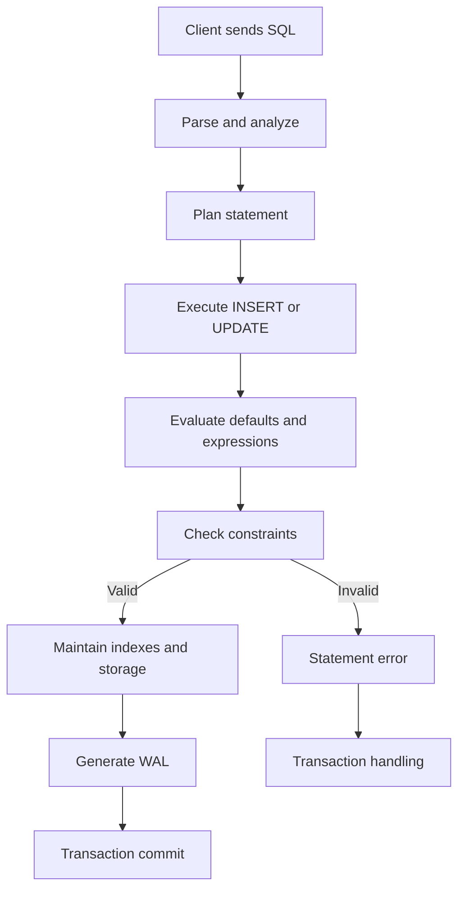

# 08- Constraint Enforcement

## Overview

Database constraints are executable rules that protect the integrity of data stored in a relational database. They move critical invariants from application assumptions into the database, where every writer must obey them.

Common constraints include:

| Constraint | Primary purpose |
|---|---|
| `NOT NULL` | Prevent missing values |
| `UNIQUE` | Prevent duplicate values |
| `PRIMARY KEY` | Uniquely identify rows |
| `FOREIGN KEY` | Enforce relationships between tables |
| `CHECK` | Enforce value-level predicates |
| `DEFAULT` | Supply a value when one is omitted |
| `EXCLUDE` | Prevent conflicting values for specific PostgreSQL data types |

Constraint enforcement is especially important in production systems with multiple writers:

```text
Django API ────────┐
FastAPI service ──┤
Celery worker ────┤
Admin tool ───────┤
Data migration ───┤
ETL / pipeline ───┤
                   ↓
              PostgreSQL
                   ↓
          Constraints enforced
                   ↓
          Consistent database
```

Application validation improves user experience, but database constraints provide the authoritative integrity boundary.

## Why Constraint Enforcement Matters

Application code is not the only path through which data reaches a database.

A system may have:

- Multiple microservices.
- Background workers.
- Administrative scripts.
- Database migrations.
- Reporting jobs.
- Data import pipelines.
- Direct SQL access.
- Legacy applications.

If an invariant exists only in Python:

```python
if quantity < 0:
    raise ValueError("Quantity cannot be negative")
```

another writer can bypass it.

A database constraint makes the rule universal:

```sql
CREATE TABLE inventory (
    id bigint GENERATED ALWAYS AS IDENTITY PRIMARY KEY,
    quantity integer NOT NULL,

    CONSTRAINT chk_inventory_quantity
        CHECK (quantity >= 0)
);
```

Now every SQL writer must satisfy the same rule.

This is a key distinction:

> Application validation protects an application workflow. Database constraints protect the database invariant.

## Constraint Enforcement Lifecycle

When PostgreSQL processes an `INSERT` or `UPDATE`, constraint enforcement is part of the database execution path.

A simplified lifecycle is:



The exact internal execution order is more nuanced than this diagram, and some checks can be deferred until later in a transaction. The important engineering principle is that constraints are enforced by the database engine rather than trusted application code.

## Immediate vs Deferred Constraints

Not every constraint must be checked immediately.

Most constraints are effectively immediate:

```sql
INSERT INTO users (email)
VALUES ('user@example.com');
```

If a `UNIQUE` constraint is violated, PostgreSQL rejects the statement.

Some constraints, particularly certain `UNIQUE`, `PRIMARY KEY`, and `FOREIGN KEY` constraints, can be declared `DEFERRABLE`.

Example:

```sql
CREATE TABLE account_transfers (
    id bigint PRIMARY KEY,
    source_account_id bigint NOT NULL,
    destination_account_id bigint NOT NULL,

    CONSTRAINT fk_source
        FOREIGN KEY (source_account_id)
        REFERENCES accounts(id)
        DEFERRABLE INITIALLY DEFERRED
);
```

A deferred constraint can be checked at transaction commit rather than at the individual statement.

This is useful when a valid final state temporarily passes through an invalid intermediate state.

```text
Transaction start
      ↓
Temporary inconsistent state
      ↓
Additional statements
      ↓
Final consistent state
      ↓
COMMIT
      ↓
Constraint validation
```

Deferred constraints should be used deliberately. They increase transactional complexity and can move failures from the statement that caused the problem to the commit operation.

## Statement-Level vs Transaction-Level Enforcement

The distinction matters operationally.

With immediate enforcement:

```sql
BEGIN;

INSERT INTO orders (...);
-- Constraint violation occurs here.

COMMIT;
```

With a deferred constraint:

```sql
BEGIN;

INSERT INTO orders (...);
-- Constraint may still be temporarily violated.

UPDATE ...;
-- Final state becomes valid.

COMMIT;
-- Constraint is checked here.
```

Application code must therefore be prepared for integrity errors at the point where the database actually performs the check.

## Application Validation vs Database Constraints

These mechanisms complement rather than replace each other.

| Concern | Application validation | Database constraint |
|---|---|---|
| User-friendly error | Excellent | Limited |
| Protects direct SQL writers | No | Yes |
| Protects background workers | Only if implemented there | Yes |
| Enforces schema invariant | Indirectly | Directly |
| Can provide rich business logic | Yes | Limited |
| Prevents race-condition violations | Not reliably by itself | Yes, for supported invariants |
| Centralized across services | Difficult | Yes |
| Requires database schema change | Usually no | Usually yes |

A robust backend commonly uses both:

```text
Request
  ↓
Application validation
  ↓
Business logic
  ↓
Transaction
  ↓
Database constraints
  ↓
Durable state
```

Application validation provides early feedback; database constraints provide final enforcement.

## Constraint Types and Enforcement Behavior

### NOT NULL

Prevents a column from containing `NULL`.

```sql
CREATE TABLE customers (
    id bigint GENERATED ALWAYS AS IDENTITY PRIMARY KEY,
    email text NOT NULL
);
```

The database rejects:

```sql
INSERT INTO customers (email)
VALUES (NULL);
```

Use it when absence is invalid.

Do not confuse:

```text
NULL
```

with:

```text
''
```

An empty string is still a non-null value.

### UNIQUE

Prevents duplicate values according to the constraint's equality semantics.

```sql
CREATE TABLE users (
    id bigint GENERATED ALWAYS AS IDENTITY PRIMARY KEY,
    email text NOT NULL UNIQUE
);
```

This protects against concurrent duplicate inserts in a way application-side "check then insert" logic cannot.

### PRIMARY KEY

A primary key identifies each row and implies uniqueness and non-nullability.

```sql
CREATE TABLE users (
    id bigint GENERATED ALWAYS AS IDENTITY PRIMARY KEY
);
```

A table has one primary key constraint, although that key can contain multiple columns.

### FOREIGN KEY

Enforces referential integrity between tables.

```sql
CREATE TABLE orders (
    id bigint GENERATED ALWAYS AS IDENTITY PRIMARY KEY,
    customer_id bigint NOT NULL,

    CONSTRAINT fk_orders_customer
        FOREIGN KEY (customer_id)
        REFERENCES customers(id)
);
```

The referenced customer must exist when the constraint is checked.

### CHECK

Enforces a Boolean condition.

```sql
CREATE TABLE products (
    price numeric(12, 2) NOT NULL,

    CONSTRAINT chk_products_price
        CHECK (price >= 0)
);
```

It is useful for invariants that can be expressed as predicates over row values.

### DEFAULT

Supplies a value when a column is omitted.

```sql
created_at timestamptz NOT NULL DEFAULT CURRENT_TIMESTAMP
```

`DEFAULT` is not a rejection constraint. It establishes initial state.

## Constraints and Concurrency

One of the strongest reasons to enforce constraints in the database is concurrency.

Consider this application logic:

```text
Request A                  Request B
---------                  ---------
SELECT email
  ↓                          SELECT email
No row found                 No row found
  ↓                          ↓
INSERT email                INSERT email
```

Both requests can observe that the email does not exist.

Without a database `UNIQUE` constraint, both may succeed.

With:

```sql
CREATE UNIQUE INDEX users_email_uq
ON users (email);
```

the database arbitrates the conflict.

```text
Request A ─────┐
               ├──> UNIQUE index ──> one succeeds
Request B ─────┘                    └─ one fails
```

The application should therefore treat database integrity errors as an expected concurrency outcome rather than relying exclusively on pre-checks.

## Constraint Enforcement and Transactions

Constraints participate in transactions.

```sql
BEGIN;

INSERT INTO users (email)
VALUES ('duplicate@example.com');

INSERT INTO users (email)
VALUES ('duplicate@example.com');

COMMIT;
```

If the second statement violates a constraint, PostgreSQL reports an error and the transaction enters a failed state unless the error is handled using an appropriate savepoint.

For example:

```sql
BEGIN;

INSERT INTO users (email)
VALUES ('existing@example.com');

SAVEPOINT before_optional_insert;

INSERT INTO users (email)
VALUES ('existing@example.com');

ROLLBACK TO SAVEPOINT before_optional_insert;

COMMIT;
```

This matters for application frameworks because an integrity error can affect the state of the current transaction.

In Django, for example, database integrity errors should generally be isolated with an appropriate nested transaction/savepoint when subsequent database operations must continue.

## Constraint Errors in APIs

A database constraint violation should not normally be exposed directly to an API client.

For example, PostgreSQL may report a unique violation involving an internal constraint name.

The API should translate that into a stable domain-level response:

```text
PostgreSQL
    ↓
IntegrityError
    ↓
Application exception handling
    ↓
Domain/API error
    ↓
HTTP 409 Conflict
```

For a uniqueness conflict:

```json
{
  "error": "email_already_registered"
}
```

The exact status code depends on the API contract, but `409 Conflict` is often appropriate when a request conflicts with the current resource state.

Do not expose:

- SQL statements.
- Connection details.
- Internal schema names.
- Database hostnames.
- Stack traces.

## Constraint Enforcement and ORMs

An ORM does not replace database constraints.

Django:

```python
class User(models.Model):
    email = models.EmailField(unique=True)
```

should result in a database-level uniqueness mechanism when migrations are correctly applied.

However, application-level validation can also run before the SQL statement.

This creates two layers:

```text
Django validation
       ↓
User-friendly error
       ↓
SQL INSERT
       ↓
Database UNIQUE enforcement
       ↓
Final integrity guarantee
```

The database remains the final authority.

The same principle applies to SQLAlchemy, Django ORM, and other persistence layers.

## Constraint Enforcement and Race Conditions

A common anti-pattern is:

```python
if not user_exists(email):
    create_user(email)
```

This is not sufficient for uniqueness.

Two requests can execute the check concurrently.

Prefer:

```sql
CREATE UNIQUE INDEX users_email_uq
ON users (email);
```

and handle the resulting conflict.

The general rule is:

> A read-before-write validation is not a substitute for an atomic database constraint.

This applies to:

- Unique usernames.
- Idempotency keys.
- External provider IDs.
- Resource names.
- Membership relationships.
- Inventory invariants.
- State-dependent records.

## Constraint Enforcement and Indexes

Some constraints require or create indexes.

For example:

```sql
PRIMARY KEY
UNIQUE
```

are backed by unique indexes in PostgreSQL.

Foreign keys are different: PostgreSQL does not automatically create an index on the referencing column.

For a high-volume relationship:

```sql
CREATE INDEX orders_customer_id_idx
ON orders(customer_id);
```

can significantly improve operations involving the child table.

This becomes particularly important for:

- Parent deletes.
- Parent updates of referenced keys.
- Joins.
- Foreign-key checks.
- Cascading operations.

Constraint correctness and index design are related but distinct concerns.

## Constraint Enforcement and Cascading Actions

Foreign keys can specify actions such as:

```sql
ON DELETE CASCADE
ON DELETE RESTRICT
ON DELETE SET NULL
```

Example:

```sql
CREATE TABLE order_items (
    id bigint GENERATED ALWAYS AS IDENTITY PRIMARY KEY,
    order_id bigint NOT NULL,

    CONSTRAINT fk_order_items_order
        FOREIGN KEY (order_id)
        REFERENCES orders(id)
        ON DELETE CASCADE
);
```

Deleting an order can then automatically delete its items.

Cascading operations are powerful but can create unexpectedly large transactions.

A production delete might become:

```text
DELETE customer
   ↓
orders
   ↓
order_items
   ↓
audit-related records
```

Before using cascading deletes, understand:

- Number of affected rows.
- Lock behavior.
- Transaction duration.
- Foreign-key indexes.
- Replication impact.
- WAL volume.
- Recovery implications.

For large datasets, explicit archival or asynchronous deletion may be more appropriate.

## Adding Constraints to Existing Tables

Adding a constraint to an existing production table requires data compatibility.

Suppose the existing table contains:

```text
quantity
--------
10
5
NULL
-2
```

Adding:

```sql
ALTER TABLE inventory
ADD CONSTRAINT chk_inventory_quantity
CHECK (quantity >= 0);
```

will fail because existing data violates the constraint.

A safe migration often involves:

```text
Existing data
     ↓
Audit violations
     ↓
Repair data
     ↓
Deploy compatible application
     ↓
Add constraint
     ↓
Verify enforcement
```

For large PostgreSQL tables, constraint rollout strategies can be important for minimizing blocking and migration risk.

PostgreSQL supports adding some constraints as `NOT VALID`, allowing existing rows to be validated separately while new writes are constrained.

Example:

```sql
ALTER TABLE inventory
ADD CONSTRAINT chk_inventory_quantity
CHECK (quantity >= 0)
NOT VALID;
```

Later:

```sql
ALTER TABLE inventory
VALIDATE CONSTRAINT chk_inventory_quantity;
```

This is particularly useful for large production tables where a single blocking validation operation could be disruptive.

## Constraint Enforcement in Zero-Downtime Deployments

Schema changes and application deployments must be compatible across versions.

Consider:

```text
             Load Balancer
                  |
        ┌─────────┴─────────┐
        ↓                   ↓
   Old application      New application
        │                   │
        └─────────┬─────────┘
                  ↓
             PostgreSQL
```

During a rolling deployment, both application versions can write simultaneously.

A constraint change must therefore be compatible with both versions whenever possible.

A common expand-and-contract approach is:

1. Introduce schema support.
2. Deploy code that works with both old and new states.
3. Backfill or validate data.
4. Enable the stricter constraint.
5. Remove obsolete application behavior later.

Avoid deploying a strict constraint first when old application versions can still generate invalid data.

## Constraint Naming

Explicit constraint names improve operations.

Prefer:

```sql
CONSTRAINT users_email_key
    UNIQUE (email)
```

over relying entirely on generated names.

For example:

```sql
CREATE TABLE users (
    id bigint GENERATED ALWAYS AS IDENTITY,
    email text NOT NULL,

    CONSTRAINT users_pkey PRIMARY KEY (id),
    CONSTRAINT users_email_key UNIQUE (email)
);
```

Benefits include:

- Easier error handling.
- Clearer migration diffs.
- Easier debugging.
- Better operational visibility.
- More predictable schema management.

Constraint names should follow a consistent project convention.

## Constraint Enforcement and Observability

Constraint failures are useful operational signals.

Monitor:

- Unique constraint violations.
- Foreign-key violations.
- Check constraint violations.
- Not-null violations.
- Migration failures.
- Error rates by endpoint.
- Error rates by background worker.
- Repeated integrity failures from a specific service.

A sudden increase in violations can indicate:

```text
Bad deployment
    ↓
Invalid writes
    ↓
Constraint failures
    ↓
API/worker errors
```

The database is protecting integrity, but a sustained violation rate can still indicate an application defect.

Log enough context to diagnose the failure without logging sensitive values unnecessarily.

Useful metadata includes:

- Service name.
- Operation.
- Constraint identifier.
- Table.
- Application version.
- Request/job identifier.
- Transaction context.

## Reliability and High Availability

Constraints are part of the database's correctness boundary, so all primary write paths should pass through the authoritative database.

In a PostgreSQL primary/replica architecture:

```text
Application
    |
    v
Primary PostgreSQL
    |
    +---- WAL ----> Read Replica
```

Writes and constraint enforcement occur on the primary.

Read replicas are generally not suitable for making authoritative decisions about whether a constraint will accept a subsequent write because replication can lag.

For example, this is unsafe as a uniqueness guarantee:

```text
Read replica → "email does not exist"
Primary       → INSERT email
```

The primary's unique constraint must remain authoritative.

## Security Considerations

Constraints are primarily integrity mechanisms, but they contribute to security indirectly.

Examples:

- `NOT NULL` prevents missing security-critical attributes.
- `FOREIGN KEY` prevents references to nonexistent principals.
- `CHECK` can prevent invalid privilege-state combinations.
- `UNIQUE` can protect identity-related uniqueness.

However, constraints do **not** replace authorization.

This is insufficient:

```sql
CHECK (user_role IN ('admin', 'user'))
```

A constraint can ensure the value is valid, but it cannot determine whether the current caller is authorized to assign `admin`.

Authorization belongs in the appropriate application or database security layer.

## Scalability Considerations

Constraint enforcement adds work to writes, but the integrity guarantee is usually worth the cost.

The cost depends on:

- Number of constraints.
- Index maintenance.
- Row volume.
- Transaction size.
- Foreign-key relationships.
- Cascading operations.
- Write concurrency.
- Data distribution.

For high-throughput systems:

- Keep constraints meaningful.
- Index foreign-key columns when workload requires it.
- Avoid unnecessarily complex checks.
- Keep transactions reasonably short.
- Avoid huge cascading deletes.
- Measure migration impact.
- Test constraint-heavy workloads under realistic concurrency.

Do not remove important constraints solely to optimize an isolated write benchmark. First identify the actual bottleneck.

## Production Best Practices

### Make Invariants Explicit

If the database must never contain negative inventory:

```sql
CHECK (quantity >= 0)
```

Do not rely only on developer discipline.

### Prefer Database-Enforced Uniqueness

Use:

```sql
UNIQUE
```

or a unique index instead of:

```text
SELECT → if absent → INSERT
```

for uniqueness guarantees.

### Use Application Validation for UX

Validate early when useful:

```text
Request
  ↓
Application validation
  ↓
Database constraint
```

The second layer remains authoritative.

### Design Constraints Around Domain Semantics

Do not add defaults or constraints merely because they make ORM models easier to construct.

Ask:

- What state is valid?
- Can the value genuinely be absent?
- Is the invariant universal?
- Does it apply to historical data?
- Can multiple services write this table?
- Does the rule belong in the database?

### Test Constraints Explicitly

Integration tests should exercise the actual database.

Example:

```python
import pytest
from django.db import IntegrityError

from orders.models import Order


@pytest.mark.django_db
def test_duplicate_external_id_is_rejected():
    Order.objects.create(external_id="provider-123")

    with pytest.raises(IntegrityError):
        Order.objects.create(external_id="provider-123")
```

Unit tests for application validation are useful, but they do not prove database enforcement.

### Treat Integrity Errors as Expected Failures

Concurrency naturally produces conflicts.

For example, two requests attempting the same idempotency key may result in one successful insert and one unique violation.

The service should handle this deliberately rather than treating every integrity error as an unexpected infrastructure outage.

## Common Mistakes and Pitfalls

### Relying Only on Application Validation

**Problem:** Another writer bypasses the application.

**Fix:** Put universal invariants in database constraints.

### Using SELECT Before INSERT for Uniqueness

**Problem:** Race conditions allow concurrent duplicates.

**Fix:** Use a unique constraint or unique index and handle conflicts.

### Adding Constraints Without Auditing Existing Data

**Problem:** Production migration fails because historical rows violate the new rule.

**Fix:** Detect and repair violations before enforcing the constraint.

### Ignoring Foreign-Key Indexing

**Problem:** Parent updates/deletes and relationship-heavy workloads can become expensive.

**Fix:** Evaluate and index referencing columns based on workload.

### Exposing Raw Constraint Errors

**Problem:** Clients receive database internals and unstable implementation details.

**Fix:** Translate database exceptions into stable domain/API errors.

### Assuming Replicas Enforce Write Constraints

**Problem:** A replica may be stale.

**Fix:** Treat the primary database as the authoritative write and constraint-enforcement point.

### Creating Overly Complex Constraints

**Problem:** Difficult migrations, debugging, and operational behavior.

**Fix:** Keep database constraints focused on stable data invariants and use application/domain logic for workflows that require richer behavior.

### Using Cascades Without Understanding Their Blast Radius

**Problem:** One delete can modify millions of rows.

**Fix:** Analyze indexes, row counts, locks, transaction duration, WAL generation, and recovery behavior before enabling cascading operations.

## Interview Traps

| Question | Correct principle |
|---|---|
| Why use database constraints if the application validates data? | The database protects all writers and provides the final integrity boundary. |
| Can application validation guarantee uniqueness under concurrency? | No. A database uniqueness constraint is required for the invariant. |
| Does `NOT NULL` reject empty strings? | No. It rejects `NULL`; empty strings are non-null values. |
| Does a foreign key automatically index the referencing column in PostgreSQL? | No. Add an index when the workload requires it. |
| Can constraints participate in transactions? | Yes. Constraint violations are transactional, and some constraints can be deferred. |
| What is a deferred constraint? | A constraint whose validation can be postponed, typically until transaction commit. |
| Does adding a constraint automatically repair existing invalid data? | No. Existing data must satisfy the constraint when it is validated. |
| Can a read replica be used to guarantee uniqueness? | No. The authoritative uniqueness decision belongs to the primary write database. |
| Should database errors be returned directly to API clients? | No. Translate them into stable application/domain errors. |
| Are constraints only about correctness? | Primarily, but they also improve reliability by preventing invalid states across independent writers. |

## Key Takeaways

- **Database constraints are the authoritative enforcement layer for relational data invariants; application validation should complement them, not replace them.**
- **Constraints are especially important under concurrency because database-enforced rules prevent race-condition violations that pre-checks cannot guarantee.**
- **Constraint changes are schema migrations: audit existing data, consider locking and validation costs, and make deployments compatible with rolling application versions.**
- **Constraint enforcement interacts with transactions, indexes, foreign keys, replication, and cascading operations, so production design must consider operational behavior rather than correctness alone.**
- **Treat integrity violations as deliberate application outcomes, translate them into stable API/domain errors, and monitor unexpected increases as signals of application or migration defects.**