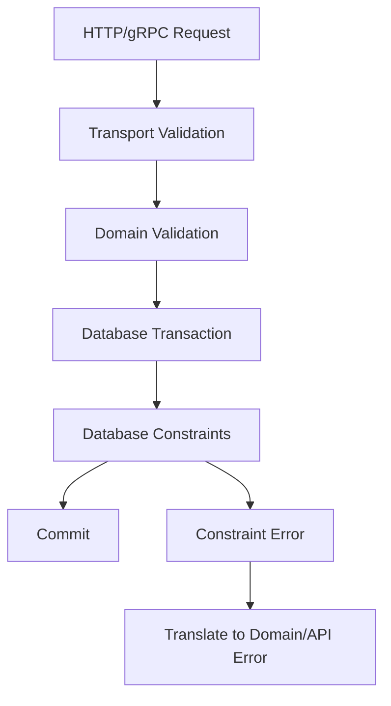

# 10- Constraints vs Application Validation

## Overview

Application validation and database constraints solve related but different problems.

**Application validation** checks whether input is acceptable before attempting a database operation. It provides fast feedback, domain-specific messages, and a convenient place for API-level validation.

**Database constraints** enforce invariants at the persistence boundary. They protect the data regardless of which application, service, worker, migration, script, or administrative tool writes to the database.

A production system generally needs both:

```text
Client
  │
  ▼
API / Application
  │
  │  Input + domain validation
  ▼
Database
  │
  │  Constraints + transactions
  ▼
Persistent state
```

The key engineering principle is:

> Application validation improves the user experience; database constraints protect data integrity.

Application validation should not be treated as a replacement for constraints when an invariant must always hold.

## Application Validation

Application validation occurs before a database operation is executed.

For example, a FastAPI endpoint might validate an order request:

```python
from decimal import Decimal

from pydantic import BaseModel, Field


class CreateOrderRequest(BaseModel):
    customer_id: int = Field(gt=0)
    total_amount: Decimal = Field(ge=Decimal("0.00"))
```

This can reject invalid input before the request reaches PostgreSQL.

### Why Application Validation Exists

Application validation is useful because it can:

- Return clear API errors.
- Avoid unnecessary database calls.
- Validate request-specific rules.
- Normalize input.
- Apply domain-specific business logic.
- Provide field-level validation messages.
- Enforce rules that depend on external services or application state.

For example:

```text
POST /orders
     │
     ▼
Parse request
     │
     ▼
Validate fields
     │
     ▼
Validate domain rules
     │
     ▼
Execute transaction
     │
     ▼
Database constraints
```

Application validation is therefore an important part of request processing, but it is not the final authority over persistent data.

## Database Constraints

A database constraint is a rule enforced by the database engine.

For example:

```sql
CREATE TABLE products (
    id bigint GENERATED ALWAYS AS IDENTITY PRIMARY KEY,
    name text NOT NULL,
    price numeric(12, 2) NOT NULL,

    CONSTRAINT products_price_nonnegative_check
        CHECK (price >= 0)
);
```

The database rejects invalid rows even if the application accidentally sends them.

```sql
INSERT INTO products (name, price)
VALUES ('Keyboard', -10.00);
```

The database rejects the operation because the persisted value violates the `CHECK` constraint.

### Why Database Constraints Exist

Constraints protect invariants at the persistence boundary.

They remain effective when data is written by:

- REST APIs.
- gRPC services.
- Django applications.
- FastAPI applications.
- Celery workers.
- Kafka consumers.
- Administrative scripts.
- ETL jobs.
- Data migration scripts.
- Other services.
- Direct SQL clients.

This is particularly important in systems where multiple execution paths can modify the same data.

## The Critical Difference

The most important distinction is **where the guarantee exists**.

| Property | Application validation | Database constraint |
|---|---|---|
| Execution location | Application process | Database engine |
| Protects direct SQL writes | No | Yes |
| Protects multiple services | Only if all implement it | Yes |
| User-friendly errors | Excellent | Usually requires translation |
| Domain-specific logic | Excellent | Limited |
| Concurrency-safe invariant | Not necessarily | Yes, when modeled correctly |
| Centralized enforcement | No | Yes |
| Prevents invalid persisted state | Only indirectly | Yes |
| Requires database schema change | No | Usually |
| Works across programming languages | No | Yes |

A senior engineer should decide which layer owns each rule rather than attempting to put every rule in one place.

## Validation Layers

A robust backend commonly has several validation layers.

### Transport Validation

Validates the request structure.

Examples:

- Required JSON fields.
- String length.
- Numeric ranges.
- Valid enum values.
- Correct UUID syntax.

FastAPI with Pydantic is an example:

```python
from pydantic import BaseModel, EmailStr


class CreateUserRequest(BaseModel):
    email: EmailStr
    display_name: str
```

This protects the API boundary.

### Domain Validation

Validates business rules.

For example:

```text
A customer cannot cancel an already-completed order.
```

This is not necessarily a database constraint.

The application can evaluate the order's current state and business context:

```python
if order.status == "completed":
    raise OrderStateError("Completed orders cannot be cancelled.")
```

### Database Constraints

Protect persistent invariants.

Examples:

```text
email must be unique
customer_id must reference an existing customer
quantity must be >= 0
required column must not be NULL
```

These rules should generally be enforced in the database.

## Which Rules Belong in the Database?

A useful rule of thumb is:

> If invalid data must never exist in the database, strongly consider enforcing it with a database constraint.

Typical candidates include:

| Rule | Recommended enforcement |
|---|---|
| Primary key uniqueness | Database |
| Foreign-key integrity | Database |
| Required value | Database + application |
| Unique email | Database + application |
| `price >= 0` | Database + application |
| `quantity > 0` | Database + application |
| Valid state transition | Usually application; sometimes database |
| Password strength | Application |
| Authorization | Application |
| External API availability | Application |
| "User must be eligible based on another service" | Application |
| Cross-system business workflow | Application |
| Immutable audit record | Database + application where appropriate |

The application can duplicate database validation for better errors and performance, but the database should remain authoritative for persistent invariants.

## Why Application Validation Alone Fails

Consider:

```python
if not User.objects.filter(email=email).exists():
    User.objects.create(email=email)
```

This appears to enforce uniqueness.

It does not.

Two requests can execute concurrently:

```text
Request A                  Request B
   │                          │
   ├─ Check email ────────────┤
   │   not found              │
   │                          ├─ Check email
   │                          │   not found
   │                          │
   ├─ INSERT                  ├─ INSERT
   │                          │
   ▼                          ▼
duplicate data
```

The application-level check is a **time-of-check/time-of-use race**.

The correct design is:

```sql
CREATE TABLE users (
    id bigint GENERATED ALWAYS AS IDENTITY PRIMARY KEY,
    email text NOT NULL,

    CONSTRAINT users_email_unique
        UNIQUE (email)
);
```

The database's unique enforcement handles concurrent transactions correctly.

## Application Validation and Database Constraints Should Work Together

A production request often follows this model:



Each layer has a different responsibility.

### Example

Suppose an order requires:

```text
quantity > 0
product must exist
customer must exist
order total >= 0
customer cannot create duplicate order reference
```

Application validation can provide immediate feedback:

```text
quantity <= 0
→ 400 Bad Request
```

Database constraints provide authoritative protection:

```text
product does not exist
→ FOREIGN KEY violation

order total < 0
→ CHECK violation

duplicate order reference
→ UNIQUE violation
```

The application should translate expected constraint failures into appropriate domain or API errors rather than exposing raw database details.

## Validation Is Not Authorization

A common architectural mistake is treating validation as a substitute for authorization.

For example:

```python
if order.customer_id == request.user.id:
    ...
```

This checks a relationship but does not necessarily establish that the caller has permission to perform the requested operation.

Authorization belongs in the application/service layer.

Database constraints generally answer:

> "Is this state structurally valid?"

Application authorization answers:

> "Is this actor allowed to cause this state change?"

These are different concerns.

## Validation Is Not Business Workflow

Consider:

```text
A customer can receive a refund only within 30 days,
unless the account has a premium support entitlement.
```

This depends on business context and potentially other systems.

It is usually application/domain logic rather than a simple database constraint.

By contrast:

```text
refund_amount >= 0
```

is a strong candidate for a database `CHECK`.

A useful separation is:

```text
Structural invariant
        ↓
Database constraint

Business decision
        ↓
Application/domain logic
```

## The Cost of Duplicate Validation

Duplicating rules in the application and database can be beneficial, but duplication creates maintenance risk.

For example:

Application:

```python
if amount < 0:
    raise ValueError("Amount cannot be negative")
```

Database:

```sql
CHECK (amount >= 0)
```

This duplication is intentional and useful because:

- The application provides a good error.
- The database guarantees integrity.

However, inconsistent rules are dangerous.

Application:

```text
amount >= 0
```

Database:

```text
amount > 0
```

Now the application accepts a value that the database rejects.

### Recommended Approach

When duplicating a rule:

1. Define the authoritative invariant clearly.
2. Keep application validation aligned with the database.
3. Test both paths.
4. Treat schema changes and validation changes as one logical change.
5. Keep database errors as a final safety boundary.

## Handling Constraint Violations

Applications should expect database constraints to reject operations.

In Django:

```python
from django.db import IntegrityError, transaction


try:
    with transaction.atomic():
        user = User.objects.create(email=email)
except IntegrityError:
    # Translate known constraint violations into a domain/API error.
    raise EmailAlreadyRegistered()
```

For PostgreSQL-backed applications, production code should preferably distinguish the specific constraint rather than treating every `IntegrityError` as a duplicate email.

For example, database drivers expose structured diagnostic information that can identify the violated constraint.

The application can then map:

```text
users_email_unique
        ↓
EmailAlreadyRegistered
        ↓
HTTP 409 Conflict
```

This is more reliable than searching arbitrary exception strings.

## HTTP Status Codes

Constraint failures should be translated according to API semantics.

A common mapping is:

| Database/domain event | Possible HTTP response |
|---|---|
| Malformed request | `400 Bad Request` |
| Validation failure | `422 Unprocessable Content` |
| Duplicate resource | `409 Conflict` |
| Missing referenced resource | `404 Not Found` or domain-specific response |
| Unexpected database failure | `500 Internal Server Error` |

The exact API contract should be consistent across the service.

Never expose raw SQL statements, table names, constraint names, or database internals directly to clients unless there is a deliberate reason.

## Concurrency Changes the Design

Application validation is often optimistic.

For example:

```text
Does email exist?
        ↓
No
        ↓
Insert
```

Between the first and second operation, another transaction may modify the database.

Database constraints move the final decision into the transactional database engine:

```text
Transaction A ───────┐
                     ├── UNIQUE(email)
Transaction B ───────┘
```

The database coordinates concurrent writes and ensures that the uniqueness invariant remains true.

This is one of the strongest reasons to use constraints for integrity rules.

## Constraints and Transactions

Constraints are evaluated as part of database statement and transaction processing.

Consider:

```sql
BEGIN;

INSERT INTO orders (
    customer_id,
    total_amount
)
VALUES (
    1001,
    250.00
);

INSERT INTO payments (
    order_id,
    amount
)
VALUES (
    999999,
    250.00
);

COMMIT;
```

If the payment's foreign key is invalid, the transaction can fail rather than silently creating inconsistent relationships.

Application validation cannot provide the same guarantee unless every writer coordinates perfectly through the same application path.

## Constraints and Microservices

Microservices make this distinction more important.

Suppose:

```text
Order Service ─────┐
                   │
Payment Worker ────┼──► PostgreSQL
                   │
Admin Script ──────┘
```

If the database contains:

```sql
CHECK (amount >= 0)
```

every writer must obey the invariant.

Application validation exists separately in each service:

```text
Order Service → validation
Payment Worker → validation
Admin Tool → validation
```

Relying exclusively on application validation means every writer must implement exactly the same rule correctly.

Database constraints provide a centralized persistence boundary.

However, do not attempt to use database constraints to enforce arbitrary distributed business rules across independent service-owned databases.

## What Should Not Be Forced Into Constraints?

Not every business rule belongs in SQL.

Avoid turning complex workflows into increasingly complicated `CHECK` expressions merely because the database can technically express them.

Examples better handled by application/domain logic include:

- Payment provider decisions.
- Authorization.
- Rate limits.
- Feature entitlements.
- External API responses.
- Complex state machines involving external systems.
- Time-sensitive business policies.
- Cross-service workflows.
- Rules requiring substantial procedural logic.

The goal is not:

```text
"Put everything in the database."
```

The goal is:

```text
"Put durable data invariants at the strongest appropriate boundary."
```

## ORM Validation Is Not a Database Constraint

This distinction is particularly important with ORMs.

For example, a Django model may define validation behavior that runs through certain application-level validation paths.

That does not automatically mean the database schema enforces the same rule.

Similarly, Pydantic validation in FastAPI validates the API model; it does not alter PostgreSQL's schema.

Think in terms of layers:

```text
Pydantic
    ↓
API validation

Django / SQLAlchemy
    ↓
ORM/application behavior

PostgreSQL
    ↓
Persistent integrity
```

Always inspect the actual database schema when the requirement is "this data must never be stored."

## Production Design Pattern

A strong production design usually follows this sequence:

```text
Client
  │
  ▼
Transport validation
  │
  ▼
Authentication / Authorization
  │
  ▼
Domain validation
  │
  ▼
Transaction
  │
  ├── Application operation
  │
  └── Database constraints
          │
          ├── Success → Commit
          │
          └── Violation → Rollback
```

The application should attempt to reject obvious invalid input early, while the database remains responsible for enforcing durable invariants.

## Security Considerations

Validation and constraints also contribute to security, but neither replaces proper security controls.

### Do Not Trust Client Validation

Frontend validation can improve UX but is never an integrity boundary.

A malicious client can bypass:

```text
JavaScript validation
mobile application validation
API client validation
```

and call the backend directly.

### Do Not Trust Application-Level Checks Alone

Multiple writers, race conditions, compromised application paths, and administrative scripts can bypass assumptions made by one code path.

Database constraints reduce the impact of such failures for structural invariants.

### Avoid Information Leakage

Do not expose database-specific errors directly:

```text
ERROR: duplicate key value violates unique constraint "users_email_unique"
```

Instead return a controlled API response:

```json
{
  "error": "email_already_registered"
}
```

The database error should remain in protected application logs where appropriate.

## Performance Considerations

Application validation can avoid unnecessary database writes.

For example:

```text
Invalid quantity
      ↓
Reject in API
      ↓
No database round trip
```

This is useful for obvious request errors.

However, pre-check queries can themselves create overhead:

```sql
SELECT 1
FROM users
WHERE email = $1;
```

followed by:

```sql
INSERT INTO users ...
```

A unique constraint allows the database to perform the authoritative check during the write itself.

For high-throughput systems, avoid unnecessary pre-check queries when the database constraint already provides the required guarantee.

A common pattern is:

```text
Application validation
    ↓
Fast rejection of obvious invalid input

Database constraint
    ↓
Authoritative integrity enforcement
```

## Reliability Considerations

Database constraints reduce the number of possible invalid database states.

That has downstream benefits for:

- Reporting.
- Analytics.
- Data pipelines.
- Cache consistency.
- Background processing.
- Replication.
- Disaster recovery.
- Operational debugging.

If invalid data enters the database, every downstream consumer must account for it.

Preventing invalid state at the persistence boundary is often cheaper than repairing it later.

## Testing Strategy

Test both application behavior and database integrity.

### Application Validation Tests

Verify that invalid requests receive appropriate responses:

```python
def test_negative_order_total_is_rejected(client):
    response = client.post(
        "/orders",
        json={
            "customer_id": 123,
            "total_amount": "-10.00",
        },
    )

    assert response.status_code == 422
```

### Database Constraint Tests

Verify that the database rejects invalid states even when bypassing the API.

For example:

```python
import pytest
from django.db import IntegrityError


def test_negative_balance_is_rejected():
    with pytest.raises(IntegrityError):
        Account.objects.create(balance=-1)
```

The exact behavior depends on the database and ORM configuration, so integration tests should run against the same database engine used in production.

### Concurrency Tests

For uniqueness and other race-sensitive invariants, include tests that exercise concurrent writes where the behavior matters.

The important property is not merely:

```text
"Application validation returns an error."
```

but:

```text
"Concurrent transactions cannot create invalid persistent state."
```

## Migration and Deployment Considerations

Adding a constraint to an existing production table can fail if existing data violates the rule.

Before adding:

```sql
ALTER TABLE accounts
ADD CONSTRAINT accounts_balance_nonnegative_check
CHECK (balance >= 0);
```

audit the existing data:

```sql
SELECT COUNT(*)
FROM accounts
WHERE balance < 0;
```

If invalid rows exist, the migration strategy may require:

1. Identify invalid records.
2. Determine the correct remediation.
3. Clean or repair the data.
4. Add the constraint.
5. Verify the constraint.
6. Deploy application validation if needed.

For large production tables, constraint creation can also involve locking and operational impact depending on the database and constraint type. Plan migrations with the database engine's locking behavior in mind.

## Common Mistakes

### Replacing Constraints With `if` Checks

```python
if email not in existing_emails:
    create_user()
```

**Problem:** Race conditions can still create duplicates.

**Fix:** Use a database `UNIQUE` constraint.

### Assuming ORM Validation Protects the Database

**Problem:** ORM validation may not execute for every write path.

**Fix:** Inspect the generated database schema and use actual constraints for persistent invariants.

### Returning Raw Database Errors

**Problem:** Leaks implementation details and produces unstable API contracts.

**Fix:** Translate known constraint violations into stable domain/API errors.

### Adding Constraints Without Auditing Existing Data

**Problem:** Production migrations can fail because historical records violate the new invariant.

**Fix:** Audit and remediate existing data before enforcing the constraint.

### Duplicating Rules Inconsistently

**Problem:** Application and database rules disagree.

**Fix:** Define one canonical invariant and keep all validation layers aligned.

### Using the Database for Complex Business Logic

**Problem:** Complex rules become difficult to test, evolve, and operate.

**Fix:** Keep domain decisions in the application while using database constraints for durable structural invariants.

### Treating Validation as Authorization

**Problem:** Input validity does not establish whether the caller is permitted to perform an operation.

**Fix:** Keep authentication and authorization as separate security concerns.

## Production Decision Matrix

| Requirement | Application | Database | Recommendation |
|---|---:|---:|---|
| Required request field | Yes | Optional/Yes | Validate at API; use `NOT NULL` when persistence requires it |
| Positive quantity | Yes | Yes | Use both |
| Unique email | Yes | **Yes** | Database constraint is authoritative |
| Foreign-key relationship | Optional | **Yes** | Use database FK |
| Password policy | **Yes** | No | Application/domain layer |
| Authorization | **Yes** | No | Application/security layer |
| External service eligibility | **Yes** | No | Application/domain layer |
| Cross-request uniqueness | Yes | **Yes** | Database constraint |
| Complex workflow state | Yes | Sometimes | Domain logic first; constrain simple invariants |
| Data type/range invariant | Yes | **Yes** | Use both when practical |

## Senior-Level Design Principle

A useful way to reason about validation is to identify the **invariant boundary**.

Ask:

> "What must remain true regardless of who writes this data?"

If the answer is:

```text
Every stored order must have a non-negative total.
```

then the database should enforce:

```sql
CHECK (total_amount >= 0)
```

If the answer is:

```text
A customer can cancel an order only if the business workflow permits cancellation.
```

that belongs primarily in domain logic.

If the answer is:

```text
Only the account owner can access the order.
```

that is authorization.

This separation keeps responsibilities clear:

| Concern | Primary owner |
|---|---|
| Request shape | API/application |
| User-facing validation | Application |
| Business decisions | Domain/application |
| Authorization | Application/security layer |
| Persistent structural integrity | Database |
| Transactional consistency | Database |
| Cross-service workflow | Distributed application architecture |

## Interview Traps

| Question | Correct answer |
|---|---|
| Is application validation enough for uniqueness? | No. Concurrent requests can race; use a database unique constraint. |
| Why validate in both application and database? | Application validation improves feedback; database constraints provide authoritative integrity. |
| Does Django/Pydantic validation automatically enforce PostgreSQL constraints? | No. Application/ORM validation and database schema enforcement are different layers. |
| Should every business rule become a `CHECK` constraint? | No. Complex domain and distributed rules generally belong in application/domain logic. |
| Can a database constraint replace authorization? | No. Constraints protect data integrity, not actor permissions. |
| Why can a pre-check followed by an insert still fail? | Another transaction can modify the data between the check and the insert. |
| What should happen when a database constraint is violated? | The application should handle expected violations and translate them into stable domain/API errors. |
| Why is a database constraint important with microservices? | Multiple writers may access the same persistence boundary, making centralized integrity enforcement valuable. |
| Should the frontend be trusted to validate data? | No. Client-side validation is only a UX layer. |
| What is the database's role in validation architecture? | It is the final enforcement boundary for invariants that must never be violated in persistent state. |

## Key Takeaways

- **Use application validation for fast feedback, request semantics, and domain rules, but use database constraints for invariants that must never be violated in persistent state.**
- **Never rely on application-level pre-checks for concurrency-sensitive rules such as uniqueness; enforce them with database constraints.**
- **Duplicate simple invariants across application and database layers when useful, but keep the rules aligned and treat the database as the authoritative persistence boundary.**
- **Keep authorization and complex business workflows in the application/domain layer rather than forcing them into database constraints.**
- **Handle expected constraint violations explicitly and translate database-specific failures into stable domain and API errors.**