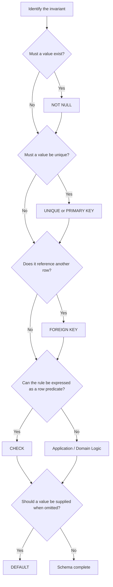
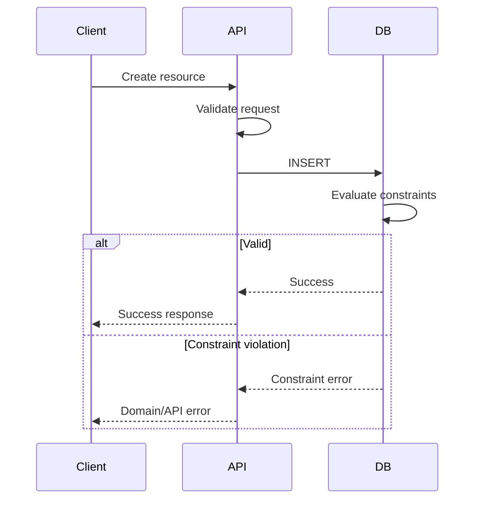

# 11- Choosing the Right Constraint

## Overview

Database constraints define invariants that the database must preserve regardless of which application or process writes the data. Choosing the right constraint is therefore a data-modelling decision, not merely a syntax decision.

The common SQL constraints serve different purposes:

| Constraint | Primary purpose | Typical invariant |
|---|---|---|
| `NOT NULL` | Require a value | Every order has a creation timestamp |
| `UNIQUE` | Prevent duplicate values | Email addresses are unique |
| `PRIMARY KEY` | Identify a row uniquely | Every user has one stable identifier |
| `FOREIGN KEY` | Preserve relationships | Every order references an existing customer |
| `CHECK` | Enforce a predicate | Quantity must be greater than zero |
| `DEFAULT` | Supply a value when omitted | New orders start in `pending` state |

A production schema commonly combines several constraints:

```sql
CREATE TABLE orders (
    id bigint GENERATED ALWAYS AS IDENTITY,
    customer_id bigint NOT NULL,
    reference text NOT NULL,
    status text NOT NULL DEFAULT 'pending',
    quantity integer NOT NULL,
    total_amount numeric(12, 2) NOT NULL,

    CONSTRAINT orders_pkey
        PRIMARY KEY (id),

    CONSTRAINT orders_reference_unique
        UNIQUE (reference),

    CONSTRAINT orders_customer_fkey
        FOREIGN KEY (customer_id)
        REFERENCES customers(id),

    CONSTRAINT orders_quantity_check
        CHECK (quantity > 0),

    CONSTRAINT orders_total_amount_check
        CHECK (total_amount >= 0)
);
```

The design principle is simple:

> Choose the strongest database constraint that directly expresses the invariant you need, and use application validation for rules that belong outside the database.

## Start With the Invariant

Do not begin by asking:

```text
"Which SQL keyword should I use?"
```

Begin by asking:

```text
"What must always be true about this data?"
```

For example:

```text
Every account must have an owner.
```

This implies:

```sql
owner_id bigint NOT NULL
```

If the owner must reference a real user:

```sql
FOREIGN KEY (owner_id) REFERENCES users(id)
```

If each user can own only one account:

```sql
UNIQUE (owner_id)
```

One business statement can therefore require multiple constraints.

## Constraint Selection Flow



`DEFAULT` is slightly different from the other constraints: it supplies a value but does not generally guarantee that the resulting value satisfies a business invariant. It is often used together with `NOT NULL`.

## `NOT NULL`

### What It Enforces

`NOT NULL` requires a column value to be non-`NULL`.

```sql
CREATE TABLE users (
    id bigint PRIMARY KEY,
    email text NOT NULL
);
```

This means:

```sql
INSERT INTO users (id)
VALUES (1);
```

fails because `email` is missing and no default supplies a value.

### When to Use It

Use `NOT NULL` when the persisted model requires a value.

Good candidates include:

- Foreign keys that are mandatory.
- Creation timestamps.
- Required monetary amounts.
- Resource status.
- Required identifiers.
- Required business attributes.

Do not use it merely because a field is usually populated in the application. Ask whether `NULL` represents a legitimate state.

### Common Mistake

Confusing an empty value with `NULL`.

These are different:

```text
NULL
''
0
false
```

A `NOT NULL` constraint rejects only `NULL`.

## `UNIQUE`

### What It Enforces

`UNIQUE` prevents duplicate values within its uniqueness scope.

```sql
CREATE TABLE users (
    id bigint PRIMARY KEY,
    email text NOT NULL,

    CONSTRAINT users_email_unique
        UNIQUE (email)
);
```

Use it for business identifiers that must not collide.

Examples:

- Email addresses.
- External IDs.
- Payment provider references.
- Order references.
- Idempotency keys.
- Tenant-scoped usernames.

### Composite Uniqueness

Sometimes uniqueness belongs to a combination of columns:

```sql
CONSTRAINT memberships_tenant_user_unique
    UNIQUE (tenant_id, user_id)
```

This means the same user cannot be a member of the same tenant twice, while the user may belong to many different tenants.

### Important Question

Ask:

> "Unique globally, or unique within a scope?"

For multi-tenant systems, this distinction is critical.

```text
Global:
email

Tenant-scoped:
(tenant_id, username)
```

### Production Consideration

A pre-check such as:

```sql
SELECT 1
FROM users
WHERE email = $1;
```

does not replace the `UNIQUE` constraint. Concurrent transactions can still race.

The database must enforce the final invariant.

## `PRIMARY KEY`

### What It Enforces

A primary key identifies each row uniquely and cannot contain `NULL`.

```sql
CREATE TABLE users (
    id bigint PRIMARY KEY
);
```

A table has one primary key definition, although that definition may contain multiple columns.

Use a primary key for the table's canonical row identity.

### Composite Primary Keys

Some relational models naturally use multiple columns:

```sql
CREATE TABLE tenant_users (
    tenant_id bigint NOT NULL,
    user_id bigint NOT NULL,

    CONSTRAINT tenant_users_pkey
        PRIMARY KEY (tenant_id, user_id)
);
```

However, application frameworks and ORMs often work more naturally with a single-column surrogate identifier. The choice should follow the domain and ecosystem rather than habit.

## `FOREIGN KEY`

### What It Enforces

A foreign key maintains referential integrity between tables.

```sql
CREATE TABLE orders (
    id bigint PRIMARY KEY,
    customer_id bigint NOT NULL,

    CONSTRAINT orders_customer_fkey
        FOREIGN KEY (customer_id)
        REFERENCES customers(id)
);
```

This prevents an order from referencing a nonexistent customer.

### When to Use It

Use foreign keys when the database owns both sides of a relationship and referential integrity must be guaranteed.

Typical examples:

```text
orders → customers
payments → orders
order_items → products
comments → posts
```

### When Not to Force It

In a microservice architecture:

```text
Order Service DB
Payment Service DB
Customer Service DB
```

a database foreign key cannot normally enforce a relationship across independent databases.

In that situation, consistency is handled through service contracts, events, workflows, and application logic.

## `CHECK`

### What It Enforces

A `CHECK` constraint requires a row-level Boolean expression to hold.

```sql
CONSTRAINT products_price_check
    CHECK (price >= 0)
```

Other examples:

```sql
CHECK (quantity > 0)

CHECK (start_at <= end_at)

CHECK (status IN ('pending', 'paid', 'cancelled'))
```

### When to Use It

Use `CHECK` for local invariants that can be expressed from the row's values.

Good candidates:

- Numeric ranges.
- Valid states.
- Date relationships.
- Conditional field relationships.
- Simple domain invariants.

Example:

```sql
CREATE TABLE subscriptions (
    id bigint PRIMARY KEY,
    starts_at timestamptz NOT NULL,
    ends_at timestamptz,

    CONSTRAINT subscriptions_date_range_check
        CHECK (ends_at IS NULL OR ends_at > starts_at)
);
```

### Limitations

A `CHECK` constraint is not a general-purpose business-rule engine.

Rules involving:

- Other services.
- Authorization.
- External APIs.
- Complex workflows.
- Arbitrary cross-row logic.

usually belong in application/domain logic or require more specialized database mechanisms.

## `DEFAULT`

### What It Does

A `DEFAULT` supplies a value when an `INSERT` omits the column.

```sql
CREATE TABLE orders (
    id bigint PRIMARY KEY,
    status text NOT NULL DEFAULT 'pending'
);
```

An insert like:

```sql
INSERT INTO orders (id)
VALUES (1001);
```

produces:

```text
status = 'pending'
```

### Important Distinction

`DEFAULT` does **not** mean:

```text
"The column can never be NULL."
```

This schema:

```sql
status text DEFAULT 'pending'
```

can still explicitly receive `NULL`:

```sql
INSERT INTO orders (status)
VALUES (NULL);
```

If `NULL` is invalid:

```sql
status text NOT NULL DEFAULT 'pending'
```

This combination is common in production.

## Choosing Between Similar Constraints

### `PRIMARY KEY` vs `UNIQUE`

| Requirement | Choice |
|---|---|
| Canonical row identity | `PRIMARY KEY` |
| Additional uniqueness rule | `UNIQUE` |
| Multiple independent unique attributes | Multiple `UNIQUE` constraints |
| Composite identity | Composite `PRIMARY KEY` |
| Nullable optional unique attribute | `UNIQUE`, with database-specific `NULL` semantics considered |

A table normally has one primary key but can have multiple unique constraints.

### `NOT NULL` vs `CHECK`

Use `NOT NULL` when the requirement is simply:

```text
A value must exist.
```

Use `CHECK` when the requirement is:

```text
The value must satisfy a predicate.
```

Examples:

```sql
email text NOT NULL

quantity integer CHECK (quantity > 0)
```

They are complementary rather than interchangeable.

### `CHECK` vs `FOREIGN KEY`

Use `CHECK` for an invariant derived from the row.

```sql
CHECK (amount >= 0)
```

Use `FOREIGN KEY` when validity depends on another table.

```sql
FOREIGN KEY (customer_id)
REFERENCES customers(id)
```

### `DEFAULT` vs Application Initialization

Application code can initialize a value:

```python
order.status = "pending"
```

but a database default is useful when the database should supply the value for every writer.

This matters when data can be inserted through:

- Multiple services.
- Administrative SQL.
- ETL.
- Scripts.
- Background jobs.

However, defaults should not hide important business decisions that belong in application logic.

## Combining Constraints

Real schemas frequently require combinations.

Consider a product inventory table:

```sql
CREATE TABLE inventory (
    product_id bigint NOT NULL,
    warehouse_id bigint NOT NULL,
    quantity integer NOT NULL DEFAULT 0,

    CONSTRAINT inventory_pkey
        PRIMARY KEY (product_id, warehouse_id),

    CONSTRAINT inventory_quantity_check
        CHECK (quantity >= 0),

    CONSTRAINT inventory_product_fkey
        FOREIGN KEY (product_id)
        REFERENCES products(id),

    CONSTRAINT inventory_warehouse_fkey
        FOREIGN KEY (warehouse_id)
        REFERENCES warehouses(id)
);
```

Each constraint expresses a different invariant:

| Constraint | Invariant |
|---|---|
| `PRIMARY KEY` | One inventory row per product/warehouse pair |
| `NOT NULL` | Product, warehouse, and quantity must exist |
| `DEFAULT` | New inventory starts at zero when quantity is omitted |
| `CHECK` | Inventory cannot be negative |
| `FOREIGN KEY` | Product and warehouse must exist |

This is the normal way to model robust relational data.

## Constraints vs Application Validation

Application validation and constraints should normally complement each other.



Application validation provides:

- Better user-facing errors.
- Early rejection.
- Request-specific rules.
- Domain-level behavior.

Database constraints provide:

- Concurrency-safe enforcement.
- Protection across writers.
- Persistent integrity.
- A final enforcement boundary.

Do not replace a required database invariant with an application `if` statement.

## Constraints and Concurrency

Constraints become particularly important under concurrent writes.

Consider uniqueness:

```text
Request A                    Request B
    │                            │
    ├─ Check email ──────────────┤
    │   not found                │
    │                            ├─ Check email
    │                            │   not found
    │                            │
    ├─ INSERT                    ├─ INSERT
    │                            │
    ▼                            ▼
```

Application-level checks can race.

A database unique constraint makes the database responsible for deciding which concurrent write succeeds.

The same principle applies to other transactional invariants: if correctness depends on concurrency control, model the invariant at the database transaction/constraint level where appropriate.

## Constraint Naming

Explicit names make production operations easier.

Prefer:

```sql
CONSTRAINT orders_customer_fkey
    FOREIGN KEY (customer_id)
    REFERENCES customers(id)
```

over relying entirely on generated names.

Useful naming conventions include:

| Constraint | Example |
|---|---|
| Primary key | `orders_pkey` |
| Foreign key | `orders_customer_fkey` |
| Unique | `users_email_unique` |
| Check | `orders_total_amount_check` |

Consistent names improve:

- Migration reviews.
- Error handling.
- Debugging.
- Schema inspection.
- Operational support.

## ORM Considerations

Framework declarations should ultimately produce the database invariants you actually require.

For Django:

```python
from django.db import models


class Product(models.Model):
    name = models.CharField(max_length=255)
    price = models.DecimalField(max_digits=12, decimal_places=2)

    class Meta:
        constraints = [
            models.CheckConstraint(
                condition=models.Q(price__gte=0),
                name="products_price_nonnegative_check",
            ),
        ]
```

The important question is not:

```text
"Did I add validation to the model?"
```

but:

```text
"Does the production database enforce the invariant?"
```

Inspect migrations and the resulting database schema as part of code review and deployment verification.

## Production Considerations

### Schema Evolution

Adding a constraint to an existing table can fail if historical data violates it.

Before adding:

```sql
ALTER TABLE orders
ADD CONSTRAINT orders_total_amount_check
CHECK (total_amount >= 0);
```

audit first:

```sql
SELECT COUNT(*)
FROM orders
WHERE total_amount < 0;
```

Clean or explicitly migrate invalid data before enforcing the invariant.

### Large Tables

Constraint changes can have operational implications depending on:

- Table size.
- Database engine.
- Constraint type.
- Existing indexes.
- Locking behavior.
- Concurrent traffic.

For high-traffic PostgreSQL systems, understand the locking and validation behavior of the specific `ALTER TABLE` operation before applying it during peak traffic.

### Index Implications

Some constraints require or create supporting indexes.

In PostgreSQL, primary keys and unique constraints are backed by unique indexes. Foreign-key columns are not automatically indexed on the referencing side.

For frequently joined or frequently updated relationships, consider an index on the foreign-key column:

```sql
CREATE INDEX orders_customer_id_idx
ON orders (customer_id);
```

This is especially important for:

- Parent lookups.
- Joins.
- Parent-row updates/deletes.
- High-cardinality relationships.

Do not blindly index every foreign key; evaluate query patterns and write costs.

### Disaster Recovery

Constraints are part of the schema and therefore part of the database's correctness model.

Backups and disaster-recovery procedures should preserve:

- Tables.
- Constraints.
- Indexes.
- Sequences/identity configuration.
- Functions and triggers where applicable.

Restoring data without restoring its integrity mechanisms can produce a database that is operationally available but semantically unsafe.

## Security Considerations

Constraints are not authorization controls, but they can reduce the impact of malformed or unexpected writes.

For example:

```sql
CHECK (amount >= 0)
```

can prevent negative values from entering financial tables through an unintended write path.

However:

```text
CHECK constraint ≠ authorization
FOREIGN KEY ≠ access control
UNIQUE ≠ authentication
```

Security decisions should remain in the appropriate authentication and authorization layers.

## Scalability Considerations

Constraints generally improve scalability by preventing invalid states early and reducing downstream cleanup.

However, every constraint can introduce work during writes.

Examples:

- Unique constraints require uniqueness enforcement.
- Foreign keys require referential-integrity checks.
- Checks require predicate evaluation.
- Index-backed constraints increase write amplification and storage usage.

The right goal is not to minimize constraints.

The goal is:

> Enforce important invariants at the lowest reliable boundary without adding unnecessary schema complexity.

## Common Mistakes

### Using `UNIQUE` When Identity Is Required

A unique email address may be unique, but it is often a poor canonical row identity because emails can change.

Prefer:

```text
PRIMARY KEY → stable internal identity
UNIQUE → business uniqueness
```

### Using `DEFAULT` Without `NOT NULL`

```sql
status text DEFAULT 'pending'
```

does not prevent explicit `NULL`.

Use:

```sql
status text NOT NULL DEFAULT 'pending'
```

when the status must always exist.

### Using `CHECK` Instead of `FOREIGN KEY`

This:

```sql
CHECK (customer_id > 0)
```

does not prove that the customer exists.

Use:

```sql
FOREIGN KEY (customer_id)
REFERENCES customers(id)
```

### Relying on Application Pre-Checks

This:

```text
SELECT → verify → INSERT
```

is not sufficient for concurrency-sensitive invariants.

Use the appropriate database constraint.

### Treating All Business Rules as Constraints

Complex business workflows can become difficult to understand when encoded entirely in SQL.

Keep the boundary clear:

```text
Data invariant → Database

Business decision → Domain/application

Authorization → Security/application

Distributed workflow → Service architecture
```

### Ignoring `NULL` Semantics

SQL's three-valued logic and database-specific uniqueness behavior can make nullable columns surprising.

Do not assume that:

```text
NULL = NULL
```

in ordinary SQL comparisons.

Design nullable uniqueness rules deliberately and test them against the production database engine.

### Using Unnamed Constraints Everywhere

Generated names can make migrations and production debugging harder.

Use stable, descriptive names for important constraints.

## Production Checklist

Before approving a schema, ask:

- Does every mandatory column have `NOT NULL`?
- Is the canonical row identity represented by a `PRIMARY KEY`?
- Are business identifiers that must not collide protected by `UNIQUE`?
- Are relationships protected by `FOREIGN KEY` where appropriate?
- Are local value invariants protected by `CHECK`?
- Are defaults used where the database should supply omitted values?
- Are application validations consistent with database constraints?
- Have concurrency and race conditions been considered?
- Are constraint names predictable and stable?
- Are foreign-key access patterns indexed appropriately?
- Will adding or modifying the constraint affect production traffic?
- Does existing data satisfy the new invariant?
- Are expected constraint violations translated into stable API errors?
- Does the constraint belong in this database, particularly in a microservice architecture?

## Decision Matrix

| Requirement | Constraint |
|---|---|
| Every row needs a value | `NOT NULL` |
| Row needs a stable canonical identity | `PRIMARY KEY` |
| Value must not duplicate another row | `UNIQUE` |
| Combination of values must not duplicate | Composite `UNIQUE` |
| Value must reference another row | `FOREIGN KEY` |
| Value must satisfy a local predicate | `CHECK` |
| Database should fill an omitted value | `DEFAULT` |
| Complex business workflow | Application/domain logic |
| Authorization rule | Application/security layer |
| Cross-service invariant | Distributed application architecture |

## Practical Example

Consider a SaaS application with tenants, users, and projects.

The requirements are:

```text
A project has a unique ID.
A project belongs to a tenant.
A project must have a name.
A tenant cannot have two projects with the same name.
A project starts in the active state.
A project state must be valid.
```

A suitable schema is:

```sql
CREATE TABLE projects (
    id bigint GENERATED ALWAYS AS IDENTITY,
    tenant_id bigint NOT NULL,
    name text NOT NULL,
    status text NOT NULL DEFAULT 'active',

    CONSTRAINT projects_pkey
        PRIMARY KEY (id),

    CONSTRAINT projects_tenant_name_unique
        UNIQUE (tenant_id, name),

    CONSTRAINT projects_tenant_fkey
        FOREIGN KEY (tenant_id)
        REFERENCES tenants(id),

    CONSTRAINT projects_status_check
        CHECK (status IN ('active', 'suspended', 'archived'))
);
```

The mapping is direct:

| Requirement | Implementation |
|---|---|
| Unique project identity | `PRIMARY KEY` |
| Project belongs to a tenant | `FOREIGN KEY` |
| Project must have tenant/name/status | `NOT NULL` |
| Name unique within tenant | Composite `UNIQUE` |
| New project starts active | `DEFAULT` |
| State must be valid | `CHECK` |

This is the preferred modelling approach: translate explicit durable invariants into explicit database constraints.

## Interview Traps

| Interview question | Strong answer |
|---|---|
| When should you use `NOT NULL`? | When `NULL` is not a valid persisted state for the column. |
| `PRIMARY KEY` vs `UNIQUE`? | The primary key represents canonical row identity; unique constraints enforce additional uniqueness rules. |
| Can application validation replace `UNIQUE`? | No. Concurrent writes can race; the database must enforce uniqueness. |
| Does `DEFAULT` prevent `NULL`? | No. Combine it with `NOT NULL` when `NULL` is invalid. |
| `CHECK` vs `FOREIGN KEY`? | `CHECK` validates a row-level predicate; `FOREIGN KEY` validates a reference to another table. |
| Should every foreign key be indexed? | Not automatically. Evaluate query, join, and parent-update/delete patterns. |
| Should every business rule be a database constraint? | No. Complex domain, authorization, external-service, and distributed workflow rules generally belong elsewhere. |
| Why use explicit constraint names? | They improve migrations, debugging, observability, and application-level error mapping. |
| Can foreign keys enforce relationships across microservice databases? | Generally no. Independent service databases require application/event-driven consistency mechanisms. |
| Why use both application validation and constraints? | Application validation provides early, useful feedback; constraints provide authoritative persistent integrity. |

## Key Takeaways

- **Choose constraints from the invariant outward: `NOT NULL` for required values, `PRIMARY KEY` for identity, `UNIQUE` for uniqueness, `FOREIGN KEY` for relationships, `CHECK` for row predicates, and `DEFAULT` for omitted values.**
- **Use database constraints for durable invariants that must survive concurrent writes and multiple data-entry paths.**
- **Combine constraints when one business requirement has multiple dimensions, such as `NOT NULL` + `DEFAULT` or composite `UNIQUE` + `FOREIGN KEY`.**
- **Keep complex business rules, authorization, and cross-service workflows in the appropriate application or distributed-system layer.**
- **Treat constraints as production schema infrastructure: name them consistently, test them, consider indexing and locking implications, and validate existing data before schema changes.**