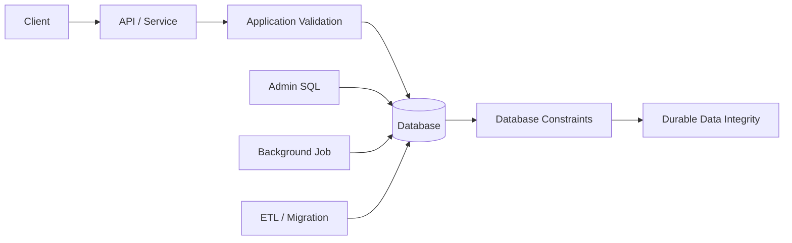
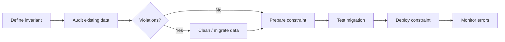

# 12- Common Constraint Mistakes

## Overview

Database constraints are one of the strongest mechanisms for protecting relational data integrity, but they are frequently misused, under-specified, or delegated entirely to application code.

Most constraint problems are not syntax errors. They are modelling errors:

- An invariant is enforced only in one application path.
- `DEFAULT` is mistaken for `NOT NULL`.
- `UNIQUE` is added without considering `NULL` semantics or tenancy.
- Foreign keys are omitted because "the application validates it."
- `CHECK` constraints encode rules that actually belong to domain logic.
- Constraint changes are deployed without considering existing data or production locking.
- ORM validation is mistaken for database enforcement.
- Constraint names are left to database-generated defaults, making migrations and operational debugging harder.

A senior backend engineer treats constraints as part of the system's correctness boundary.



The database may have multiple writers. Therefore, important invariants should not depend exclusively on one application's validation path.

## Constraint Categories

| Constraint | Protects | Typical mistake |
|---|---|---|
| `NOT NULL` | Required values | Assuming empty strings are also rejected |
| `UNIQUE` | Uniqueness | Relying on a pre-insert existence check |
| `PRIMARY KEY` | Row identity | Using mutable business data as identity |
| `FOREIGN KEY` | Referential integrity | Omitting it because the API validates references |
| `CHECK` | Row-level predicates | Encoding complex workflows in SQL |
| `DEFAULT` | Omitted values | Assuming it prevents explicit `NULL` |

## Relying Only on Application Validation

### The Mistake

A common implementation is:

```python
if not User.objects.filter(email=email).exists():
    User.objects.create(email=email)
```

This looks correct but is not sufficient for uniqueness.

Two requests can execute concurrently:

```text
Request A                         Request B
    │                                 │
    ├── SELECT email ────────────────►│
    │   not found                     │
    │                                 ├── SELECT email
    │                                 │   not found
    ├── INSERT                        │
    │                                 ├── INSERT
    ▼                                 ▼
       Duplicate logical state
```

### Correct Approach

Enforce the invariant in the database:

```sql
CREATE TABLE users (
    id bigint GENERATED ALWAYS AS IDENTITY,
    email text NOT NULL,

    CONSTRAINT users_pkey
        PRIMARY KEY (id),

    CONSTRAINT users_email_unique
        UNIQUE (email)
);
```

Application validation can still provide a better user experience, but the constraint is authoritative.

### General Rule

> Application validation improves feedback; database constraints protect correctness.

The same principle applies to:

- Idempotency keys.
- External payment references.
- Inventory-related invariants.
- Tenant-scoped uniqueness.
- Required relationships.

## Forgetting `NOT NULL`

### The Mistake

A column may be logically mandatory but declared without `NOT NULL`:

```sql
CREATE TABLE orders (
    id bigint PRIMARY KEY,
    customer_id bigint,
    status text
);
```

The application may always send these values, but another writer can still insert:

```sql
INSERT INTO orders (id)
VALUES (1001);
```

### Better Schema

```sql
CREATE TABLE orders (
    id bigint PRIMARY KEY,
    customer_id bigint NOT NULL,
    status text NOT NULL
);
```

### Production Consideration

When deciding whether to use `NOT NULL`, determine whether `NULL` represents a meaningful state.

For example:

```text
shipped_at = NULL
```

may legitimately mean:

```text
The order has not shipped yet.
```

In contrast:

```text
created_at = NULL
```

may represent invalid data.

Do not eliminate nullable columns mechanically. Model the domain state intentionally.

## Confusing `NULL` With Empty Values

`NULL`, an empty string, zero, and `false` are different values.

For example:

```sql
email text NOT NULL
```

rejects:

```sql
NULL
```

but does not reject:

```sql
''
```

If an application requires a non-empty string, `NOT NULL` alone may be insufficient.

For a database that supports the required expression semantics, a predicate can make the invariant explicit:

```sql
name text NOT NULL,

CONSTRAINT users_name_not_blank_check
    CHECK (length(trim(name)) > 0)
```

The exact expression should account for the database engine and the application's definition of valid input.

## Using `DEFAULT` Without Understanding `NULL`

### The Mistake

Developers frequently write:

```sql
status text DEFAULT 'pending'
```

and assume `status` can never be `NULL`.

That is incorrect.

This is still possible:

```sql
INSERT INTO orders (status)
VALUES (NULL);
```

### Better Schema

If status must always exist:

```sql
status text NOT NULL DEFAULT 'pending'
```

The semantics are then:

| Insert behavior | Result |
|---|---|
| Column omitted | `'pending'` |
| Explicit `'paid'` | `'paid'` |
| Explicit `NULL` | Rejected |
| Explicit valid value | Stored |

### Production Rule

Use:

```sql
NOT NULL DEFAULT ...
```

when a column has both:

1. A mandatory invariant.
2. A sensible database-side initial value.

## Assuming `UNIQUE` Means "Exactly One"

A `UNIQUE` constraint means values cannot collide according to the database's uniqueness semantics. It does not mean the column must contain a value.

For example:

```sql
email text UNIQUE
```

does not generally communicate the same business rule as:

```sql
email text NOT NULL UNIQUE
```

If every account must have an email and emails must be unique, use both.

```sql
email text NOT NULL,

CONSTRAINT users_email_unique
    UNIQUE (email)
```

### `NULL` Semantics Matter

Database engines differ in how nullable unique columns handle multiple `NULL` values and offer different mechanisms for special cases.

If the requirement is:

```text
Every user must have an email and no two users may share it.
```

do not depend on nullable uniqueness behavior. Express the requirement directly with:

```sql
NOT NULL + UNIQUE
```

## Using a Mutable Business Attribute as the Primary Key

### The Mistake

Using an email address as the primary key:

```sql
email text PRIMARY KEY
```

can tightly couple row identity to a mutable business attribute.

If a user changes their email, every dependent reference becomes more complicated.

### Better Design

Use stable identity:

```sql
id bigint GENERATED ALWAYS AS IDENTITY PRIMARY KEY,
email text NOT NULL UNIQUE
```

Now:

```text
id    → identity
email → business uniqueness
```

The email can change without changing the user's canonical database identity.

### Exception

A natural key can be appropriate when the domain truly guarantees that the key is:

- Stable.
- Immutable.
- Universally unique within the model.
- Efficient for references.
- Supported cleanly by the surrounding application ecosystem.

Do not reject natural keys categorically; evaluate the actual domain.

## Creating the Wrong Uniqueness Scope

### The Mistake

A multi-tenant application requires:

```text
Username must be unique within a tenant.
```

but the schema uses:

```sql
username text UNIQUE
```

This accidentally makes usernames globally unique.

### Correct Model

```sql
CONSTRAINT users_tenant_username_unique
    UNIQUE (tenant_id, username)
```

Now:

```text
Tenant A / alice  → valid
Tenant B / alice  → valid
Tenant A / alice  → rejected
```

### Senior-Level Question

Whenever you see a `UNIQUE` constraint, ask:

> "What is the exact scope of uniqueness?"

Possible scopes include:

- Global.
- Tenant.
- Organization.
- Account.
- Parent resource.
- Time period.
- State.

The constraint should match the actual business invariant.

## Using `CHECK` for Cross-Row Rules

`CHECK` constraints are well suited to row-local invariants:

```sql
CHECK (quantity > 0)
```

But they should not be treated as a generic mechanism for arbitrary database logic.

A requirement such as:

```text
An account may have at most one active subscription.
```

is fundamentally cross-row.

Do not assume a simple `CHECK` can enforce it.

Depending on the database and model, a unique index/constraint over an appropriate representation, an exclusion constraint, a trigger, or transactional application logic may be more appropriate.

For PostgreSQL, a partial unique index can be useful for some conditional uniqueness rules:

```sql
CREATE UNIQUE INDEX subscriptions_one_active_per_account
ON subscriptions (account_id)
WHERE status = 'active';
```

This is a database-specific design and should be chosen deliberately.

## Encoding Complex Business Workflows as Constraints

### The Mistake

Trying to encode an entire workflow inside a `CHECK`:

```sql
CHECK (
    status = 'approved'
    OR status = 'pending'
    OR ...
)
```

Simple state validation can be appropriate, but a workflow contains behavior, permissions, events, and transitions that may not belong in a constraint.

### Better Boundary

```text
Database constraint
    ↓
Simple durable invariant

Application/domain logic
    ↓
Business decisions and workflows

Authorization
    ↓
Who is allowed to perform the operation

Distributed system
    ↓
Cross-service coordination
```

A `CHECK` can enforce:

```sql
CHECK (status IN ('pending', 'paid', 'cancelled'))
```

but rules such as:

```text
Only finance administrators may transition an order
from paid to refunded.
```

belong elsewhere.

## Omitting Foreign Keys Because "The API Checks"

### The Mistake

An API verifies:

```text
customer_id exists
```

and the schema has:

```sql
customer_id bigint NOT NULL
```

but no foreign key.

Another writer can then create:

```text
orders.customer_id = 999999
```

when customer `999999` does not exist.

The database now contains an orphaned relationship.

### Correct Approach

```sql
CONSTRAINT orders_customer_fkey
    FOREIGN KEY (customer_id)
    REFERENCES customers(id)
```

### When Foreign Keys May Not Apply

Independent microservice databases are different.

For example:

```text
Customer Service DB
        │
        │ customer_id
        ▼
Order Service DB
```

The order database cannot normally enforce a relational foreign key against a separate service-owned database.

In such architectures, use appropriate:

- Service contracts.
- Events.
- Idempotent consumers.
- Reconciliation.
- Workflow/state management.

Do not pretend a distributed relationship is a local relational foreign key.

## Choosing the Wrong `ON DELETE` Behavior

Foreign keys often require an explicit deletion policy.

Common options include:

| Behavior | Meaning | Typical use |
|---|---|---|
| `NO ACTION` | Reject/delete according to constraint checking | Default-style protective behavior |
| `RESTRICT` | Prevent deletion when dependents exist | Strong ownership protection |
| `CASCADE` | Delete dependent rows | True child lifecycle |
| `SET NULL` | Clear reference | Optional relationship |
| `SET DEFAULT` | Replace with column default | Specialized models |

Example:

```sql
FOREIGN KEY (customer_id)
REFERENCES customers(id)
ON DELETE RESTRICT
```

### Dangerous `CASCADE`

Consider:

```sql
FOREIGN KEY (customer_id)
REFERENCES customers(id)
ON DELETE CASCADE
```

Deleting one customer could delete:

```text
customer
  ├── orders
  │    ├── order_items
  │    └── payments
  └── other dependent records
```

`CASCADE` should represent actual lifecycle ownership, not merely convenience.

For financial, audit, or historical records, soft deletion or restricted deletion may be more appropriate.

## Forgetting Foreign-Key Indexes

A foreign key does not necessarily mean the referencing column automatically has an index.

For example:

```sql
CREATE TABLE orders (
    id bigint PRIMARY KEY,
    customer_id bigint NOT NULL,
    FOREIGN KEY (customer_id) REFERENCES customers(id)
);
```

If queries frequently use:

```sql
SELECT *
FROM orders
WHERE customer_id = $1;
```

an index may be appropriate:

```sql
CREATE INDEX orders_customer_id_idx
ON orders (customer_id);
```

Indexes also matter for certain parent-row updates and deletes because the database may need to inspect referencing rows.

### Do Not Blindly Index Everything

Every index adds:

- Storage.
- Write amplification.
- Maintenance work.
- Potential cache pressure.

Index based on workload and access patterns.

## Using Constraints Without Considering Existing Data

Adding a constraint to a populated production table can fail.

Suppose historical data contains:

```text
quantity = -5
```

and you add:

```sql
CHECK (quantity >= 0)
```

The migration may fail because existing rows violate the new invariant.

### Safer Process



For large production tables, also investigate the database-specific locking and validation behavior before applying the schema change.

## Adding Constraints During Peak Traffic

DDL is operational work.

A constraint migration can involve:

- Table scans.
- Lock acquisition.
- Index creation.
- Validation.
- Increased I/O.
- Replication impact.

Before production deployment, evaluate:

- Table size.
- Current traffic.
- Lock behavior.
- Replica lag.
- Migration duration.
- Rollback strategy.
- Database engine/version behavior.

For large PostgreSQL tables, database-specific online or low-lock techniques may be preferable where available.

## Using Unstable Constraint Names

Allowing the database to generate names can produce names such as:

```text
users_email_key
```

or framework-generated variants that become difficult to reason about across environments and migrations.

Prefer explicit names:

```sql
CONSTRAINT users_email_unique
    UNIQUE (email)
```

Naming conventions should be predictable.

| Type | Example |
|---|---|
| Primary key | `users_pkey` |
| Foreign key | `orders_customer_fkey` |
| Unique | `users_email_unique` |
| Check | `orders_amount_nonnegative_check` |

Stable names also make database errors easier to map to application behavior.

## Treating ORM Validation as Database Enforcement

Frameworks often provide validation APIs.

For example, Django model validation can detect invalid values before persistence in some application paths.

But not every database write necessarily passes through:

```text
Django model validation
```

Possible writers include:

- Management commands.
- Data migrations.
- Raw SQL.
- Background jobs.
- ETL.
- Administrative tools.
- Other services.

The database remains the final integrity boundary for relational invariants.

### Better Mental Model

```text
Python validation
    ↓
User-friendly feedback

Database constraint
    ↓
Authoritative integrity
```

Use both when appropriate.

## Ignoring Constraint Errors in APIs

A database constraint violation is not necessarily an internal server error.

For example, a duplicate idempotency key may represent a normal application-level conflict.

The service should translate database-specific failures into stable domain/API behavior.

Conceptually:

```text
Database
    │
    │ UNIQUE violation
    ▼
Repository / data-access layer
    │
    │ Domain conflict
    ▼
Service layer
    │
    │ Resource already exists
    ▼
HTTP API
    │
    ▼
409 Conflict
```

Avoid exposing raw database error messages to clients.

## Catching All Integrity Errors

A related mistake is catching every database integrity error and returning the same response.

For example:

```python
try:
    create_order()
except IntegrityError:
    return conflict()
```

The error could instead represent:

- Duplicate key.
- Missing foreign key.
- Failed check constraint.
- Not-null violation.
- Another integrity problem.

Handle errors intentionally where practical.

Explicit constraint names make classification more reliable, while database-specific exception metadata can provide additional information.

## Using Application Defaults When the Database Is the Real Source of Truth

Suppose multiple writers create orders:

```text
REST API
Celery worker
Admin SQL
Data import
```

If only the REST API assigns:

```text
status = "pending"
```

other writers may omit it or choose inconsistent values.

If the database should own the default:

```sql
status text NOT NULL DEFAULT 'pending'
```

The default then applies to inserts that omit the column regardless of which writer performs the insert.

This is especially useful for stable structural defaults.

## Over-Constraining the Schema

More constraints are not automatically better.

For example, a developer may add:

```sql
CHECK (name <> '')
```

without understanding:

- Whether whitespace is meaningful.
- Whether normalization happens elsewhere.
- Whether legacy records intentionally contain an empty value.
- Whether the application permits temporary states.

Constraints should encode deliberate invariants, not assumptions.

### Good Constraint

```text
Every invoice must have a non-negative total.
```

### Potentially Bad Constraint

```text
Every field that usually has a value must be NOT NULL.
```

The latter can erase legitimate domain states.

## Under-Constraining the Schema

The opposite mistake is creating tables with minimal constraints:

```sql
CREATE TABLE orders (
    id bigint,
    customer_id bigint,
    status text,
    total numeric
);
```

This pushes integrity entirely into application code.

A stronger model might be:

```sql
CREATE TABLE orders (
    id bigint GENERATED ALWAYS AS IDENTITY,
    customer_id bigint NOT NULL,
    status text NOT NULL DEFAULT 'pending',
    total numeric(12, 2) NOT NULL,

    CONSTRAINT orders_pkey
        PRIMARY KEY (id),

    CONSTRAINT orders_customer_fkey
        FOREIGN KEY (customer_id)
        REFERENCES customers(id),

    CONSTRAINT orders_total_check
        CHECK (total >= 0),

    CONSTRAINT orders_status_check
        CHECK (status IN ('pending', 'paid', 'cancelled'))
);
```

The database now protects fundamental data invariants even when application code changes.

## Ignoring Database-Specific Semantics

SQL provides standard constraint concepts, but behavior and capabilities differ across engines.

Examples include:

- Nullable unique constraints.
- Deferrable constraints.
- `CHECK` behavior.
- Partial indexes.
- Referential actions.
- DDL locking.
- Constraint validation.
- Expression indexes.

PostgreSQL, MySQL, SQL Server, and Oracle are not interchangeable implementation targets.

If the production database is PostgreSQL, design and test against PostgreSQL rather than assuming generic SQL behavior.

## Ignoring Constraint Performance

Constraints are not free.

A write may require:

```text
INSERT
  ↓
NOT NULL checks
  ↓
CHECK evaluation
  ↓
Unique index enforcement
  ↓
Foreign-key validation
  ↓
Index maintenance
  ↓
Commit
```

For most applications, this overhead is a reasonable trade-off for correctness.

At high scale, however, engineers should understand:

- Index write amplification.
- Lock contention.
- Hot unique indexes.
- Foreign-key lookup costs.
- Large cascading deletes.
- Migration validation costs.

The answer is not to remove necessary constraints. It is to model them carefully and measure their operational impact.

## Using `CASCADE` for Convenience

Cascading deletion can be useful for true child entities:

```text
order
  └── order_items
```

Deleting an order may legitimately delete its order items.

But it can be dangerous for data that must survive parent deletion:

```text
customer
  └── financial transaction history
```

Before using `CASCADE`, ask:

> "Does the child record's lifecycle truly depend on the parent?"

If not, use a different deletion policy.

## Not Testing Constraint Behavior

Schema correctness should be tested explicitly.

Important test cases include:

```text
Valid insert
Invalid NULL
Duplicate unique value
Invalid foreign key
Invalid CHECK value
Omitted DEFAULT value
Explicit NULL with DEFAULT
Delete parent with dependents
Concurrent conflicting writes
```

For application tests, verify both:

1. The application produces useful errors.
2. The database rejects invalid states even when bypassing normal application validation.

## Constraint Mistakes in Django and FastAPI Applications

### Django

A Django model can express database constraints:

```python
from django.db import models


class Order(models.Model):
    customer = models.ForeignKey(
        "Customer",
        on_delete=models.PROTECT,
    )
    total = models.DecimalField(
        max_digits=12,
        decimal_places=2,
    )

    class Meta:
        constraints = [
            models.CheckConstraint(
                condition=models.Q(total__gte=0),
                name="orders_total_nonnegative_check",
            ),
        ]
```

Do not assume that serializer validation alone replaces the database constraint.

### FastAPI

FastAPI request models can validate incoming payloads:

```python
from decimal import Decimal

from pydantic import BaseModel, Field


class CreateOrderRequest(BaseModel):
    total: Decimal = Field(ge=0)
```

This is useful for API validation, but it does not protect against:

```text
Another service
Background worker
Raw SQL
Migration
Administrative write
```

The database should still enforce durable relational invariants.

## Production Review Checklist

Before shipping a schema change, review:

### Data Semantics

- Does `NULL` represent a legitimate state?
- Is an empty value different from `NULL`?
- Is the chosen data type compatible with the constraint?
- Is the invariant actually required?

### Uniqueness

- Is uniqueness global or scoped?
- Are nullable values handled intentionally?
- Is concurrency safe?
- Does the uniqueness rule match tenant boundaries?

### Relationships

- Should this relationship be a foreign key?
- What should happen when the parent is deleted?
- Is the referencing column indexed appropriately?
- Is this actually a cross-service relationship?

### Checks and Defaults

- Can the invariant be expressed as a row-level predicate?
- Is the `CHECK` expression database-compatible?
- Does `DEFAULT` need to be combined with `NOT NULL`?
- What happens when the column is explicitly set to `NULL`?

### Deployment

- Does existing data satisfy the new constraint?
- Will the migration scan or rewrite a large table?
- What locks can be acquired?
- Could replicas lag?
- Can the migration be safely rolled back?
- Have the migration steps been tested against production-scale data?

### Application Integration

- Does the application validate inputs for useful client feedback?
- Are constraint violations translated into stable API errors?
- Are all writers subject to the database constraint?
- Are database-specific error details handled safely?

## Interview Traps

| Trap | Correct reasoning |
|---|---|
| "Validation means `UNIQUE` is unnecessary." | Concurrent requests can bypass application pre-checks; the database must enforce uniqueness. |
| "`DEFAULT` means the value cannot be `NULL`." | False. Use `NOT NULL DEFAULT` when both behaviors are required. |
| "`UNIQUE` always means exactly one value exists." | No. Uniqueness prevents conflicting values; nullable columns require careful engine-specific consideration. |
| "Every foreign key automatically has an index." | Not necessarily on the referencing side; inspect the database engine and workload. |
| "`CHECK` can enforce any business rule." | It is primarily suited to row-level predicates; complex cross-row or workflow rules require other mechanisms. |
| "`CASCADE` is always safer." | It can cause large or destructive deletes; use it only when lifecycle ownership is correct. |
| "ORM validation is database validation." | ORM validation covers application paths; database constraints protect the persistent state. |
| "More constraints are always better." | Constraints should represent deliberate invariants; unnecessary constraints increase coupling and operational complexity. |
| "Foreign keys are always required in microservices." | Independent service databases cannot normally enforce cross-database foreign keys. |
| "Adding a constraint is just a metadata change." | Some changes require validation, scans, indexes, and locks and can affect production traffic. |

## Key Takeaways

- **Database constraints must protect durable invariants; application validation should complement them rather than replace them.**
- **Most constraint bugs are modelling bugs: incorrect nullability, uniqueness scope, relationship ownership, deletion behavior, or business-rule boundaries.**
- **Treat `DEFAULT`, `NOT NULL`, `UNIQUE`, `PRIMARY KEY`, `FOREIGN KEY`, and `CHECK` as distinct mechanisms and combine them when the invariant requires it.**
- **Constraint changes are production changes: audit existing data, understand locking and performance implications, and test migrations at realistic scale.**
- **Use explicit constraint names and database-specific semantics deliberately so schema behavior, error handling, migrations, and operations remain predictable.**