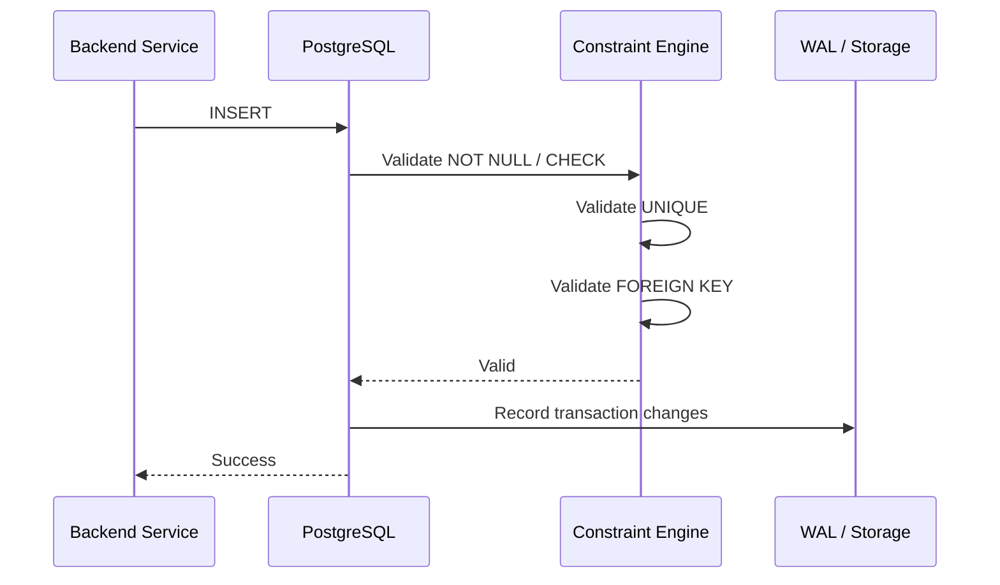

# README

## Overview

Database constraints define the integrity boundaries of a relational schema. They prevent invalid states from being persisted and ensure that core data invariants remain true regardless of which application, worker, migration, or administrative process writes to the database.

This section covers the principal SQL constraints and the engineering decisions around them:

- `NOT NULL` for required values.
- `UNIQUE` for uniqueness invariants.
- `PRIMARY KEY` for stable row identity.
- `FOREIGN KEY` for referential integrity.
- `CHECK` for row-level validity rules.
- `DEFAULT` for database-side values when a column is omitted.
- Constraint enforcement and operational behavior.
- Constraint naming conventions.
- Database constraints versus application validation.
- Choosing the appropriate constraint.
- Common production mistakes.

The goal is not merely to know constraint syntax, but to understand **which invariant belongs where, how the database enforces it, and what happens under concurrency and production load**.

## Navigation

| # | File | Description |
|---|---|---|
| 01 | [01- Constraints Introduction](./01-%20Constraints%20Introduction.md) | What database constraints are, why they matter, and how they differ from application validation |
| 02 | [02- NOT NULL](./02-%20NOT%20NULL.md) | Preventing missing values and enforcing required columns |
| 03 | [03- UNIQUE](./03-%20UNIQUE.md) | Preventing duplicate values and enforcing uniqueness invariants |
| 04 | [04- PRIMARY KEY](./04-%20PRIMARY%20KEY.md) | Stable row identity and primary-key design decisions |
| 05 | [05- FOREIGN KEY](./05-%20FOREIGN%20KEY.md) | Referential integrity, cascades, and relationship enforcement |
| 06 | [06- CHECK](./06-%20CHECK.md) | Row-level validity rules and predicate constraints |
| 07 | [07- DEFAULT](./07-%20DEFAULT.md) | Supplying database-side values when a column is omitted |
| 08 | [08- Constraint Enforcement](./08-%20Constraint%20Enforcement.md) | How the database enforces constraints under concurrency and production load |
| 09 | [09- Constraint Naming Rules](./09-%20Constraint%20Naming%20Rules.md) | Naming conventions for maintainable and debuggable constraint definitions |
| 10 | [10- Constraints vs Application Validation](./10-%20Constraints%20vs%20Application%20Validation.md) | Where each type of invariant belongs and why database constraints are not optional |
| 11 | [11- Choosing the Right Constraint](./11-%20Choosing%20the%20Right%20Constraint.md) | Matching constraints to business invariants systematically |
| 12 | [12- Common Constraint Mistakes](./12-%20Common%20Constraint%20Mistakes.md) | Production pitfalls, incorrect constraint choices, and operational failures |

## Constraint Mental Model

A useful way to reason about constraints is:

```text
                    Data Model
                        │
                        ▼
              ┌───────────────────┐
              │ Business Invariants│
              └─────────┬─────────┘
                        │
          ┌─────────────┼─────────────┐
          ▼             ▼             ▼
      Required       Identity      Relationships
       values          rules           │
          │             │              │
          ▼             ▼              ▼
      NOT NULL       PRIMARY KEY   FOREIGN KEY
                        │
                        ▼
                     UNIQUE
                        │
                        ▼
                      CHECK
                        │
                        ▼
                    DEFAULT
```

Constraints should be viewed as **database-level invariants**, not merely validation features.

For example:

```text
"An order must have a customer"
        ↓
customer_id NOT NULL

"An order's customer must exist"
        ↓
FOREIGN KEY

"An order total cannot be negative"
        ↓
CHECK

"An external payment reference cannot repeat"
        ↓
UNIQUE
```

## Constraint Reference

| Constraint | Primary purpose | Typical example |
|---|---|---|
| `NOT NULL` | Prevent missing values | `email NOT NULL` |
| `UNIQUE` | Prevent duplicate values | `email UNIQUE` |
| `PRIMARY KEY` | Identify each row | `id PRIMARY KEY` |
| `FOREIGN KEY` | Protect relationships | `customer_id REFERENCES customers(id)` |
| `CHECK` | Enforce predicates | `amount >= 0` |
| `DEFAULT` | Supply omitted values | `status DEFAULT 'pending'` |

These constraints can be combined.

For example:

```sql
CREATE TABLE orders (
    id bigint GENERATED ALWAYS AS IDENTITY,
    customer_id bigint NOT NULL,
    external_reference text NOT NULL,
    status text NOT NULL DEFAULT 'pending',
    total numeric(12, 2) NOT NULL,

    CONSTRAINT orders_pkey
        PRIMARY KEY (id),

    CONSTRAINT orders_customer_fkey
        FOREIGN KEY (customer_id)
        REFERENCES customers(id),

    CONSTRAINT orders_external_reference_unique
        UNIQUE (external_reference),

    CONSTRAINT orders_status_check
        CHECK (status IN ('pending', 'paid', 'cancelled')),

    CONSTRAINT orders_total_check
        CHECK (total >= 0)
);
```

The schema now expresses several important invariants directly.

## `NOT NULL`

`NOT NULL` specifies that a column must contain a value rather than SQL `NULL`.

```sql
CREATE TABLE users (
    id bigint PRIMARY KEY,
    email text NOT NULL
);
```

It is appropriate when the absence of a value has no valid domain meaning.

Do not use `NOT NULL` mechanically. Sometimes `NULL` represents a legitimate state:

```sql
shipped_at = NULL
```

can mean that an order has not yet shipped.

`NOT NULL` also does not reject empty strings:

```sql
email text NOT NULL
```

allows:

```sql
''
```

If blank strings are invalid, that requires additional validation or a suitable `CHECK` constraint.

## `UNIQUE`

`UNIQUE` prevents duplicate values according to the database's uniqueness semantics.

```sql
CREATE TABLE users (
    id bigint PRIMARY KEY,
    email text NOT NULL,

    CONSTRAINT users_email_unique
        UNIQUE (email)
);
```

It is essential for invariants such as:

- Unique email addresses.
- Unique external identifiers.
- Unique payment references.
- Unique idempotency keys.
- Tenant-scoped usernames.

Application code should not rely on:

```text
SELECT → check whether value exists → INSERT
```

as the sole protection against duplicates because concurrent transactions can race.

### Uniqueness Scope

Always ask:

> What is the scope of uniqueness?

For a multi-tenant application:

```sql
CONSTRAINT users_tenant_username_unique
    UNIQUE (tenant_id, username)
```

allows the same username in different tenants while preventing duplicates within one tenant.

## `PRIMARY KEY`

A primary key defines the canonical identity of a row.

```sql
CREATE TABLE customers (
    id bigint GENERATED ALWAYS AS IDENTITY,

    CONSTRAINT customers_pkey
        PRIMARY KEY (id)
);
```

A primary key provides uniqueness and non-null semantics for the key columns and serves as the normal target for foreign-key references.

A common production pattern is to separate:

```text
Stable database identity
        ↓
id

Business attributes
        ↓
email
external_reference
username
```

Business attributes can change while the primary identity remains stable.

## `FOREIGN KEY`

A foreign key protects referential integrity between related tables.

```sql
CREATE TABLE orders (
    id bigint PRIMARY KEY,
    customer_id bigint NOT NULL,

    CONSTRAINT orders_customer_fkey
        FOREIGN KEY (customer_id)
        REFERENCES customers(id)
);
```

This prevents an order from referencing a customer that does not exist.

Foreign keys are especially valuable when multiple processes can write to the same database:

```text
REST API
Celery worker
Management command
ETL process
Admin SQL
        │
        ▼
    PostgreSQL
        │
        ▼
Foreign key enforcement
```

### Delete Behavior

Foreign keys can define what happens when a referenced row is deleted.

Common actions include:

| Action | Effect | Typical use |
|---|---|---|
| `RESTRICT` | Prevent parent deletion | Protected business records |
| `NO ACTION` | Enforce referential integrity at constraint checking | Default protective behavior |
| `CASCADE` | Delete dependent rows | True child lifecycle |
| `SET NULL` | Remove the relationship | Optional relationship |
| `SET DEFAULT` | Replace reference with default | Specialized designs |

Do not use `CASCADE` simply because it makes deletion convenient. Confirm that the dependent record genuinely has the same lifecycle as the parent.

## `CHECK`

A `CHECK` constraint enforces a Boolean predicate.

```sql
CREATE TABLE products (
    id bigint PRIMARY KEY,
    price numeric(12, 2) NOT NULL,

    CONSTRAINT products_price_check
        CHECK (price >= 0)
);
```

Good uses include:

```sql
CHECK (price >= 0)
CHECK (quantity > 0)
CHECK (status IN ('pending', 'paid', 'cancelled'))
```

`CHECK` is particularly useful for simple row-level invariants.

It should not be treated as a replacement for complex domain workflows, authorization, or arbitrary cross-row business logic.

## `DEFAULT`

A `DEFAULT` supplies a value when an insert omits the column.

```sql
status text NOT NULL DEFAULT 'pending'
```

These operations have different semantics:

```sql
INSERT INTO orders DEFAULT VALUES;
```

versus explicitly supplying:

```sql
INSERT INTO orders (status)
VALUES (NULL);
```

A `DEFAULT` does not by itself prevent `NULL`.

Therefore, when both requirements apply:

```text
Column must have a value
+
Omitted value should receive a specific value
```

use:

```sql
status text NOT NULL DEFAULT 'pending'
```

Database-side defaults are especially useful when multiple writers insert into the same database.

## Constraints vs Application Validation

Application validation and database constraints solve different problems.

| Concern | Application validation | Database constraint |
|---|---|---|
| User-friendly error | Excellent | Poor |
| API payload validation | Excellent | Not its purpose |
| Protects raw SQL writes | No | Yes |
| Protects background workers | Not necessarily | Yes |
| Concurrency-safe uniqueness | Not by itself | Yes |
| Referential integrity | Not reliably | Yes |
| Domain workflow | Good | Usually inappropriate |
| Durable invariant | Incomplete | Strong |

A mature backend normally uses both:

```text
HTTP request
    │
    ▼
Pydantic / Django validation
    │
    ▼
Business logic
    │
    ▼
SQL transaction
    │
    ▼
Database constraints
    │
    ▼
Durable state
```

Application validation provides fast and useful feedback.

Database constraints provide authoritative protection.

## Choosing the Right Constraint

Use the simplest database mechanism that precisely expresses the invariant.

| Requirement | Preferred mechanism |
|---|---|
| Value must exist | `NOT NULL` |
| Value must be unique | `UNIQUE` |
| Row needs stable identity | `PRIMARY KEY` |
| Reference must exist | `FOREIGN KEY` |
| Value must satisfy row-level predicate | `CHECK` |
| Omitted value should receive a value | `DEFAULT` |
| Complex workflow | Application/domain logic |
| Cross-service relationship | Service-level consistency mechanisms |

Some requirements require combinations.

For example:

```text
Every user must have a unique email.
```

requires:

```sql
email text NOT NULL UNIQUE
```

not merely:

```sql
email text UNIQUE
```

## Constraint Enforcement

A database constraint is evaluated as part of database write processing.

A simplified insert path is:



If a constraint is violated, the transaction receives an error and the invalid state is not committed.

This matters because database constraints operate at the point where concurrent writes become durable, rather than relying on a prior application check.

## Production Considerations

### Existing Data

Adding a constraint to a populated table requires checking existing rows.

For example:

```sql
ALTER TABLE orders
ADD CONSTRAINT orders_total_check
CHECK (total >= 0);
```

can fail if existing records violate the predicate.

A safer migration process is:

```text
Audit existing data
        ↓
Fix violations
        ↓
Test migration
        ↓
Deploy constraint
        ↓
Monitor constraint violations
```

### Large Tables

Constraint changes can involve:

- Table scans.
- Index creation.
- Validation work.
- Lock acquisition.
- Increased I/O.
- Replica lag.

Before changing a heavily used production table, evaluate the database engine's specific DDL and locking behavior.

For PostgreSQL, large schema changes should be designed with production traffic and migration strategy in mind.

### Indexing Foreign Keys

A foreign key does not necessarily create an index on the referencing column.

For example:

```sql
CREATE INDEX orders_customer_id_idx
ON orders (customer_id);
```

may be appropriate when queries frequently access:

```sql
SELECT *
FROM orders
WHERE customer_id = $1;
```

Indexing should be workload-driven because every additional index adds storage and write-maintenance cost.

## Constraint Naming

Explicit names make migrations, debugging, and operational tooling easier.

Prefer names such as:

```text
users_pkey
users_email_unique
orders_customer_fkey
orders_total_check
```

A predictable naming convention makes database errors easier to map back to schema definitions and application behavior.

Avoid unnecessarily long names if the database imposes identifier-length limits.

## Common Mistakes

### Relying Only on Application Validation

```python
if not User.objects.filter(email=email).exists():
    User.objects.create(email=email)
```

This is vulnerable to concurrent requests.

Use a database `UNIQUE` constraint and handle the resulting conflict correctly.

### Assuming `DEFAULT` Prevents `NULL`

```sql
status text DEFAULT 'pending'
```

does not mean:

```text
status can never be NULL
```

Use:

```sql
status text NOT NULL DEFAULT 'pending'
```

when both properties are required.

### Assuming `NOT NULL` Rejects Empty Strings

`NOT NULL` rejects SQL `NULL`, not necessarily empty strings or whitespace.

Define the application's actual validity rule.

### Making Business Data the Primary Key

Using an email or mutable external attribute as row identity can make changes and relationships unnecessarily expensive.

Prefer a stable identifier when the domain does not guarantee that the natural key is immutable.

### Using Global `UNIQUE` in a Multi-Tenant System

If uniqueness is tenant-scoped, encode the tenant in the uniqueness definition.

```sql
UNIQUE (tenant_id, username)
```

### Omitting Foreign Keys

Application checks do not protect against every writer or race condition.

Use foreign keys when the relationship is within the same relational database and referential integrity is required.

### Using `CASCADE` Without Lifecycle Analysis

A parent deletion can recursively remove large amounts of data.

Use cascading deletes only when the dependent records genuinely belong to the parent's lifecycle.

### Overusing Constraints

Constraints should express stable invariants.

Do not turn every application rule into a database constraint merely because it is technically possible.

### Under-Constraining Tables

A schema with no meaningful constraints pushes all integrity responsibility into application code and makes future writers more dangerous.

### Catching Every Integrity Error as the Same Error

A duplicate key, foreign-key violation, and failed `CHECK` represent different failures.

Use explicit constraint names and database exception metadata to translate failures into appropriate application/API behavior.

## Framework Integration

### Django

Django can express many database constraints declaratively:

```python
from django.db import models


class Order(models.Model):
    customer = models.ForeignKey(
        "Customer",
        on_delete=models.PROTECT,
    )
    total = models.DecimalField(
        max_digits=12,
        decimal_places=2,
    )

    class Meta:
        constraints = [
            models.CheckConstraint(
                condition=models.Q(total__gte=0),
                name="orders_total_nonnegative_check",
            ),
        ]
```

Generate and review migrations carefully:

```bash
python manage.py makemigrations
python manage.py sqlmigrate app_name 0001
python manage.py migrate
```

ORM validation should complement, not replace, database enforcement.

### FastAPI and Pydantic

Request models can provide immediate API-level validation:

```python
from decimal import Decimal

from pydantic import BaseModel, Field


class CreateOrderRequest(BaseModel):
    total: Decimal = Field(ge=0)
```

The database should still enforce durable invariants:

```sql
CONSTRAINT orders_total_check
CHECK (total >= 0)
```

The API validates the request contract; the database protects persistent state.

## Testing Constraints

Constraint behavior should be tested explicitly.

Important cases include:

| Test | Expected result |
|---|---|
| Valid insert | Success |
| Missing required value | `NOT NULL` violation |
| Duplicate unique value | `UNIQUE` violation |
| Unknown referenced ID | `FOREIGN KEY` violation |
| Invalid numeric/state value | `CHECK` violation |
| Omitted defaulted column | Default applied |
| Explicit `NULL` with `DEFAULT` | Rejected if `NOT NULL` exists |
| Parent deletion with dependents | Follows configured delete action |
| Concurrent duplicate writes | At most one succeeds |

For critical uniqueness rules, concurrency tests are particularly valuable because sequential tests do not expose race conditions.

## Security Considerations

Constraints are primarily data-integrity mechanisms, but they also contribute to security.

Examples:

- `UNIQUE` constraints can prevent duplicate security-sensitive identifiers.
- `FOREIGN KEY` constraints prevent references to nonexistent records.
- `CHECK` constraints can restrict invalid state transitions at the row level.
- `NOT NULL` can prevent incomplete records from entering security-sensitive tables.

However, constraints do **not** replace authorization.

A constraint can enforce:

```sql
CHECK (status IN ('active', 'disabled'))
```

but cannot generally answer:

```text
Is this authenticated user authorized to disable this account?
```

Authorization belongs in the application or appropriate access-control layer.

## Scalability and Reliability

Constraints generally improve reliability by preventing invalid states before they become persistent data.

At scale, consider their operational costs:

- Unique indexes can become write hot spots.
- Large foreign-key relationships can make deletes expensive.
- Cascading deletes can create large transactions.
- Additional indexes increase write amplification.
- Constraint validation during migrations can consume significant I/O.
- Poorly planned DDL can block application traffic.

The correct response is not to remove necessary constraints. Instead:

- Keep invariants explicit.
- Choose appropriate indexes.
- Avoid unnecessary indexes.
- Design deletion behavior deliberately.
- Test schema migrations at realistic scale.
- Use online/low-lock database capabilities where appropriate.
- Monitor database locks, latency, errors, and replication health.

## Constraint Review Checklist

Before approving a schema change, ask:

### Data Semantics

- Is `NULL` a valid state?
- Is an empty value different from `NULL`?
- Is the chosen constraint expressing a real invariant?

### Identity and Uniqueness

- Is the primary key stable?
- What is the uniqueness scope?
- Is uniqueness global or tenant-scoped?
- Is concurrent insertion handled by the database?

### Relationships

- Should this relationship use a foreign key?
- What happens when the parent is deleted?
- Does the referencing side need an index?
- Is this relationship local to the same database?

### Defaults and Checks

- Should omitted values receive a database default?
- Does `DEFAULT` also require `NOT NULL`?
- Can the invariant be expressed as a simple `CHECK`?
- Is the rule actually business workflow rather than data integrity?

### Deployment

- Does existing data satisfy the new constraint?
- How large is the affected table?
- What locks or scans can the migration require?
- Could replicas fall behind?
- Has the migration been tested at production-like scale?

### Application Integration

- Does the API provide useful validation errors?
- Are database constraint violations translated safely?
- Can background jobs and other writers bypass application validation?
- Are constraint names stable and meaningful?

## Interview Traps

| Question or statement | Correct answer |
|---|---|
| "Why use `UNIQUE` if the API checks first?" | Application pre-checks race; the database constraint provides concurrency-safe enforcement. |
| "Does `DEFAULT` prevent `NULL`?" | No. Combine it with `NOT NULL` when required. |
| "Does `NOT NULL` reject empty strings?" | No. Empty strings are values, not SQL `NULL`. |
| "Should every foreign key have an index?" | Not automatically, but indexing is often important for query and referential-action performance. |
| "Can `CHECK` implement all business logic?" | No. It is best for suitable row-level predicates. |
| "Are foreign keys required between microservices?" | Independent service-owned databases generally cannot enforce relational foreign keys across service boundaries. |
| "Is `CASCADE` always desirable?" | No. It should reflect true ownership and lifecycle semantics. |
| "Does ORM validation guarantee database integrity?" | No. Other writers can bypass the ORM. |
| "Are more constraints always better?" | No. Constraints should represent deliberate, stable invariants. |
| "Is adding a constraint operationally free?" | No. Validation, indexes, scans, locks, and replication effects may matter significantly. |

## Key Takeaways

- **Use database constraints to enforce durable data invariants; application validation should complement them, not replace them.**
- **Choose constraints according to the invariant: `NOT NULL`, `UNIQUE`, `PRIMARY KEY`, `FOREIGN KEY`, `CHECK`, and `DEFAULT` solve different problems.**
- **Always reason about scope, concurrency, `NULL` semantics, relationship ownership, and deletion behavior before choosing a constraint.**
- **Treat constraint changes as production migrations: audit existing data, understand locking and performance implications, and test at realistic scale.**
- **Use explicit constraint names and integrate database errors carefully with Django, FastAPI, background workers, and other application writers.**