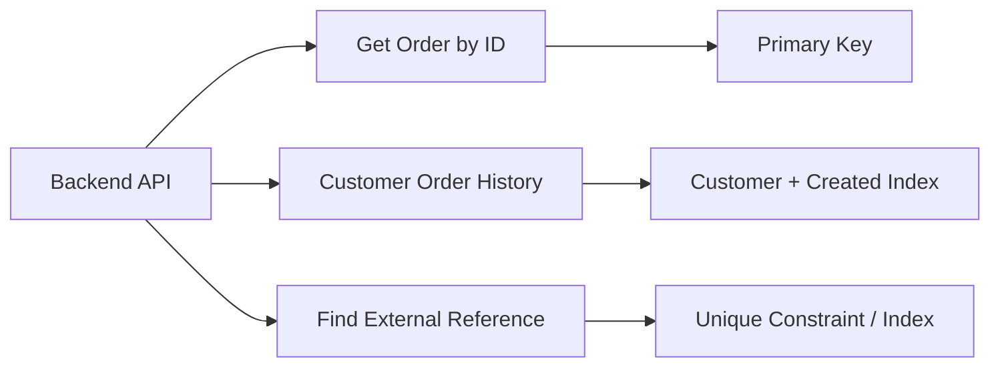

# 01- Database Schema Design

## Overview

Database schema design is the process of translating application requirements and business invariants into tables, columns, relationships, constraints, and indexes that can reliably support production workloads.

A good schema is more than a collection of tables. It defines:

- What data exists.
- How data is related.
- Which states are valid.
- Which values are required.
- Which values must be unique.
- How records are identified.
- How data evolves over time.
- Which access patterns the database must support efficiently.

For backend systems, schema design sits between the **domain model** and the **physical database implementation**.

```text
Business Requirements
        │
        ▼
Domain Model
        │
        ├── Entities
        ├── Relationships
        ├── Invariants
        └── Lifecycle
        │
        ▼
Relational Schema
        │
        ├── Tables
        ├── Columns
        ├── Keys
        ├── Constraints
        └── Indexes
        │
        ▼
Physical Database
        │
        ├── Storage
        ├── Query Planner
        ├── Transactions
        └── Concurrency
```

Schema decisions are expensive to change after production data exists. A senior backend engineer therefore designs for **correctness first, predictable access patterns second, and premature optimization last**.

## Schema Design Principles

A production schema should generally satisfy these properties:

| Property | Meaning |
|---|---|
| Correctness | Invalid states are difficult or impossible to persist |
| Consistency | Relationships and invariants remain valid |
| Clarity | The model communicates domain intent |
| Queryability | Common access patterns can be expressed efficiently |
| Evolvability | The schema can change without excessive migration risk |
| Scalability | Growth in rows, traffic, and data volume is considered |
| Operability | Backups, migrations, monitoring, and debugging remain practical |
| Security | Sensitive data and access boundaries are represented appropriately |

The goal is not to create the fewest tables or the most normalized model. The goal is to create a model whose trade-offs are understood.

## Start With the Domain

Before writing SQL, identify the important domain entities and their relationships.

For an order system:

```text
Customer
   │
   ├──< Order
   │       │
   │       └──< Order Item >── Product
   │
   └──< Address
```

The corresponding relational model might contain:

```text
customers
orders
order_items
products
addresses
```

Each table should represent a meaningful concept rather than merely mirroring an API request or UI screen.

A useful design process is:

1. Identify entities.
2. Identify attributes.
3. Identify relationships.
4. Identify cardinality.
5. Identify lifecycle rules.
6. Identify invariants.
7. Identify important queries.
8. Choose keys.
9. Add constraints.
10. Add indexes based on actual access patterns.
11. Validate the design against expected growth and operational requirements.

## Tables and Entities

A table normally represents a collection of records sharing the same structural and semantic definition.

For example:

```sql
CREATE TABLE customers (
    id bigint GENERATED ALWAYS AS IDENTITY PRIMARY KEY,
    email text NOT NULL,
    name text NOT NULL,
    created_at timestamptz NOT NULL DEFAULT now()
);
```

The table communicates several decisions:

- `id` is the stable row identity.
- `email` and `name` are required.
- `created_at` is generated by the database when omitted.
- The table represents customers rather than an arbitrary application object.

Avoid creating tables based solely on implementation convenience.

For example, splitting every field into its own table can create excessive joins and complexity without improving the domain model.

## Choosing Columns

A column should have a clear semantic meaning and an appropriate data type.

Consider:

```sql
price numeric(12, 2)
created_at timestamptz
quantity integer
is_active boolean
```

Avoid generic columns such as:

```text
value
data
field1
metadata
status_text
```

unless their semantics are genuinely generic.

### One Meaning Per Column

Prefer:

```text
first_name
last_name
```

over:

```text
name
```

when the domain needs those values independently.

Likewise, avoid packing multiple independent values into a string:

```text
"John|Doe|12345"
```

because it prevents reliable querying, validation, and indexing.

## Primary Keys

Every important entity should have a deliberate identity strategy.

A common approach is a surrogate key:

```sql
id bigint GENERATED ALWAYS AS IDENTITY PRIMARY KEY
```

This separates database identity from mutable business attributes.

For example:

```text
customer.id
        ↓
stable internal identity

customer.email
        ↓
business attribute
```

The email address may change while the customer's identity remains the same.

### Surrogate vs Natural Keys

| Strategy | Advantages | Limitations |
|---|---|---|
| Surrogate key | Stable, compact, simple relationships | Requires separate business uniqueness constraints |
| Natural key | Represents business identity directly | Can change and may be wide |
| UUID | Globally unique, useful across systems | Larger indexes and less locality than sequential numeric IDs |
| Composite key | Represents multi-column identity naturally | More complex foreign keys and queries |

There is no universal winner.

A system that requires identifiers to be generated independently across regions or services may prefer UUIDs. A centralized PostgreSQL application may find numeric identity columns simpler and more compact.

## Relationships

Relational schemas model relationships using foreign keys.

Example:

```sql
CREATE TABLE orders (
    id bigint GENERATED ALWAYS AS IDENTITY PRIMARY KEY,
    customer_id bigint NOT NULL,

    CONSTRAINT orders_customer_fkey
        FOREIGN KEY (customer_id)
        REFERENCES customers(id)
);
```

This represents:

```text
customers
    │
    │ 1
    │
    └──────────< orders
                 many
```

The foreign key ensures that an order cannot reference a nonexistent customer.

### Cardinality

Common relationship types include:

| Relationship | Example | Relational representation |
|---|---|---|
| One-to-one | User → Profile | FK + `UNIQUE` |
| One-to-many | Customer → Orders | FK on many side |
| Many-to-many | Products ↔ Orders | Junction table |

A many-to-many relationship should generally use an explicit junction table:

```sql
CREATE TABLE order_items (
    order_id bigint NOT NULL,
    product_id bigint NOT NULL,
    quantity integer NOT NULL,

    PRIMARY KEY (order_id, product_id),

    FOREIGN KEY (order_id)
        REFERENCES orders(id),

    FOREIGN KEY (product_id)
        REFERENCES products(id),

    CHECK (quantity > 0)
);
```

This makes the relationship itself a first-class data structure.

## Normalization

Normalization reduces unnecessary duplication and prevents update anomalies.

Consider:

```text
orders
------------------------------------------------
order_id
customer_name
customer_email
product_name
product_price
quantity
```

This mixes customer, order, and product data.

A normalized design separates the entities:

```text
customers
orders
products
order_items
```

### Why Normalize?

Normalization helps prevent:

- Duplicate facts.
- Inconsistent updates.
- Insert anomalies.
- Delete anomalies.
- Difficult integrity enforcement.

For example, if a customer's email is duplicated across 500 orders, changing the customer's email requires updating many rows and creates opportunities for inconsistent state.

A normalized model stores the customer once:

```text
customers
    │
    └──< orders
```

and retrieves the current customer information through the relationship.

## Practical Normalization Levels

In typical backend systems, the most useful concepts are:

### First Normal Form

Each column should contain an atomic value rather than an uncontrolled list.

Avoid:

```text
phone_numbers = "111,222,333"
```

Prefer:

```text
customer
customer_phone
```

when multiple phone numbers need independent lifecycle or querying.

### Second Normal Form

Non-key attributes should depend on the whole key rather than only part of a composite key.

This matters primarily when composite keys are used.

### Third Normal Form

Non-key attributes should generally depend on the key rather than another non-key attribute.

For example:

```text
employee_id
department_id
department_name
```

can create duplication if `department_name` is actually determined by `department_id`.

A separate `departments` table is often more appropriate.

## Normalization vs Denormalization

Normalization is a default design strategy, not an absolute rule.

Denormalization can be useful when:

- A read-heavy workload repeatedly requires expensive joins.
- A derived value is expensive to calculate.
- A reporting workload has different access requirements.
- Historical snapshots must remain immutable.
- A deliberate read model is being maintained.

Example:

```text
Normalized write model
        │
        ▼
PostgreSQL
        │
        ├── CDC / event pipeline
        ▼
Denormalized read model
```

The key requirement is to make the duplication intentional and define how it stays consistent.

Do not denormalize merely to avoid learning how joins work.

## Constraints

Constraints turn domain invariants into database-enforced rules.

A typical schema might contain:

```sql
CREATE TABLE products (
    id bigint GENERATED ALWAYS AS IDENTITY,
    sku text NOT NULL,
    price numeric(12, 2) NOT NULL,
    stock_quantity integer NOT NULL DEFAULT 0,
    status text NOT NULL DEFAULT 'active',

    CONSTRAINT products_pkey
        PRIMARY KEY (id),

    CONSTRAINT products_sku_unique
        UNIQUE (sku),

    CONSTRAINT products_price_check
        CHECK (price >= 0),

    CONSTRAINT products_stock_check
        CHECK (stock_quantity >= 0),

    CONSTRAINT products_status_check
        CHECK (status IN ('active', 'inactive'))
);
```

Constraints should protect stable invariants regardless of whether data comes from:

- Django.
- FastAPI.
- Celery.
- Management commands.
- ETL processes.
- Administrative SQL.
- Other services.

## Nullability

`NULL` is a data-modeling decision, not merely a storage detail.

Ask:

> Does absence have a meaningful domain interpretation?

For example:

```sql
shipped_at timestamptz
```

may legitimately be `NULL` because an order that has not shipped has no shipping timestamp.

By contrast:

```sql
email text NOT NULL
```

is appropriate when every customer must have an email address.

Avoid using `NULL` as a generic replacement for an unknown or inconvenient state.

## Defaults

Database defaults are useful when omitted values have a well-defined default.

```sql
status text NOT NULL DEFAULT 'pending'
```

This is especially valuable when multiple application components insert rows.

A database default does not replace `NOT NULL`:

```sql
status text DEFAULT 'pending'
```

still permits explicit `NULL` unless the column is otherwise constrained.

Be deliberate about whether a default should be generated by:

- The database.
- The application.
- A sequence/identity mechanism.
- A trigger.

Prefer simple database defaults for stable storage-level behavior.

## Business Rules

Not every business rule belongs in the schema.

Good database invariants include:

```sql
CHECK (quantity > 0)
UNIQUE (tenant_id, username)
FOREIGN KEY (customer_id) REFERENCES customers(id)
```

Complex workflow rules usually belong in application/domain logic.

For example:

```text
An order may be cancelled only before fulfillment.
```

This may involve:

- Current order state.
- Fulfillment state.
- Payment state.
- Authorization.
- Time-dependent business rules.

A simple `CHECK` may not be the right representation.

The distinction is:

```text
Database constraint
    ↓
"Can this state exist?"

Application/domain logic
    ↓
"Is this operation allowed now?"
```

## Index Design

Indexes should be derived from access patterns rather than added to every column.

Suppose the application frequently executes:

```sql
SELECT id, status, created_at
FROM orders
WHERE customer_id = $1
ORDER BY created_at DESC
LIMIT 50;
```

A useful index may be:

```sql
CREATE INDEX orders_customer_created_idx
ON orders (customer_id, created_at DESC);
```

The index is shaped around the query:

```text
WHERE customer_id = ?
ORDER BY created_at DESC
```

### Index Trade-Offs

Indexes improve reads but increase:

- Storage consumption.
- Write cost.
- WAL generation.
- Vacuum/maintenance work.
- Migration complexity.

A senior engineer asks:

> Which query does this index make faster, and what does it cost the write path?

## Data Access Patterns

Schema design and query design should be considered together.

For an order service, common access patterns might include:

```text
Get order by ID
Get customer's recent orders
Get pending orders
Get order items
Find order by external reference
```

The schema should support these paths deliberately.



The important principle is:

> **Model the data correctly first, then optimize the physical representation around real access patterns.**

## Schema and Transactions

Schema design affects transaction boundaries.

For example, creating an order and its items should generally be atomic:

```text
BEGIN
   │
   ├── INSERT orders
   │
   ├── INSERT order_items
   │
   ├── validate constraints
   │
   └── COMMIT
```

If any required operation fails:

```text
ROLLBACK
```

This prevents partially persisted business state.

In Django:

```python
from django.db import transaction


@transaction.atomic
def create_order(customer_id, items):
    # Create order and related records atomically.
    ...
```

In SQL:

```sql
BEGIN;

INSERT INTO orders (...);
INSERT INTO order_items (...);
INSERT INTO order_items (...);

COMMIT;
```

The transaction boundary should correspond to a business operation that must maintain consistency.

## Schema Evolution

Production schemas evolve continuously.

Typical changes include:

- Adding columns.
- Adding constraints.
- Adding indexes.
- Renaming columns.
- Splitting tables.
- Backfilling data.
- Removing deprecated fields.

A safe migration often follows an expand-and-contract approach.


For example, when renaming a heavily used column:

```text
Add new column
      ↓
Deploy code writing both
      ↓
Backfill historical rows
      ↓
Switch reads to new column
      ↓
Stop writing old column
      ↓
Remove old column later
```

Avoid assuming that schema changes are instantaneous or risk-free on large production tables.

## Migration Safety

Before applying a migration to a large production database, consider:

- Table size.
- Existing indexes.
- Lock behavior.
- Query traffic.
- Replica lag.
- Backfill duration.
- Transaction size.
- Rollback strategy.
- Monitoring.
- Application compatibility.

A migration that succeeds instantly on a development database may become an operational incident on a multi-billion-row production table.

## Production Example

Consider a multi-tenant SaaS application.

A reasonable core model might be:

```sql
CREATE TABLE tenants (
    id bigint GENERATED ALWAYS AS IDENTITY PRIMARY KEY,
    name text NOT NULL
);

CREATE TABLE users (
    id bigint GENERATED ALWAYS AS IDENTITY PRIMARY KEY,
    tenant_id bigint NOT NULL,
    email text NOT NULL,
    created_at timestamptz NOT NULL DEFAULT now(),

    CONSTRAINT users_tenant_fkey
        FOREIGN KEY (tenant_id)
        REFERENCES tenants(id),

    CONSTRAINT users_tenant_email_unique
        UNIQUE (tenant_id, email)
);

CREATE INDEX users_tenant_created_idx
ON users (tenant_id, created_at DESC);
```

This design encodes:

- Stable user identity.
- Tenant ownership.
- Tenant-scoped uniqueness.
- Referential integrity.
- Database-generated creation time.
- A likely access path for tenant-scoped queries.

The important design decision is not merely the SQL syntax. It is identifying that:

```text
email uniqueness
```

is scoped by:

```text
tenant
```

rather than globally.

## ORM Considerations

ORM models should reflect the relational design rather than hide it.

Django example:

```python
from django.db import models


class User(models.Model):
    tenant = models.ForeignKey(
        "Tenant",
        on_delete=models.PROTECT,
    )
    email = models.EmailField()
    created_at = models.DateTimeField(auto_now_add=True)

    class Meta:
        constraints = [
            models.UniqueConstraint(
                fields=["tenant", "email"],
                name="users_tenant_email_unique",
            ),
        ]
        indexes = [
            models.Index(
                fields=["tenant", "-created_at"],
                name="users_tenant_created_idx",
            ),
        ]
```

Review generated migrations rather than treating ORM migrations as opaque operations.

Useful commands include:

```bash
python manage.py makemigrations
python manage.py sqlmigrate app_name 0001
python manage.py migrate
```

For SQLAlchemy or other ORMs, apply the same principle: understand the SQL and physical database effects produced by the model definitions.

## Microservices and Database Ownership

In a microservice architecture, database boundaries become part of the architecture.

A typical design is:

```text
Order Service
    │
    ▼
Orders Database

Payment Service
    │
    ▼
Payments Database

Inventory Service
    │
    ▼
Inventory Database
```

Do not create cross-service foreign keys merely to preserve relational modeling.

Instead:

```text
Order Service
    │
    └── customer_id
            │
            └── Customer Service owns customer record
```

The order service may store the customer identifier without directly enforcing a foreign key against another service's database.

Cross-service consistency is then handled through APIs, events, workflows, idempotency, and reconciliation.

## Audit and Historical Data

Some domains require preserving historical state rather than merely storing the current state.

For example:

```text
orders
    ↓
current order state

order_status_history
    ↓
historical state transitions
```

A history table might contain:

```sql
CREATE TABLE order_status_history (
    id bigint GENERATED ALWAYS AS IDENTITY PRIMARY KEY,
    order_id bigint NOT NULL,
    status text NOT NULL,
    changed_at timestamptz NOT NULL DEFAULT now(),

    CONSTRAINT order_status_history_order_fkey
        FOREIGN KEY (order_id)
        REFERENCES orders(id)
);
```

Do not overwrite historical facts when the domain requires an audit trail.

At the same time, avoid creating audit tables for every entity without a concrete operational or compliance requirement.

## Soft Deletes

Soft deletion typically introduces a field such as:

```sql
deleted_at timestamptz
```

instead of physically deleting the row.

This can help with:

- Recovery.
- Audit requirements.
- Historical references.
- Business workflows.

But it also creates complexity:

- Every query may need to exclude deleted rows.
- Unique constraints may need special handling.
- Storage continues growing.
- Foreign-key semantics become less obvious.

In PostgreSQL, a partial unique index can sometimes model active-record uniqueness:

```sql
CREATE UNIQUE INDEX users_email_active_unique
ON users (email)
WHERE deleted_at IS NULL;
```

This should be used only when the business semantics genuinely require uniqueness among active records.

## Security Considerations

Schema design should minimize unnecessary exposure of sensitive data.

Consider:

- Store only data that the application actually needs.
- Separate highly sensitive information when access boundaries justify it.
- Use appropriate database roles and permissions.
- Avoid exposing internal identifiers unnecessarily through public APIs when the threat model requires opaque identifiers.
- Encrypt sensitive data where appropriate.
- Never treat database constraints as authorization controls.

For multi-tenant systems, tenant isolation should be enforced at the appropriate application and database layers.

A foreign key such as:

```sql
FOREIGN KEY (tenant_id)
```

does not by itself prevent a user from querying another tenant's rows.

## Scalability Considerations

Schema design should account for expected growth.

Important questions include:

| Question | Why it matters |
|---|---|
| How many rows will exist? | Influences index and storage strategy |
| How quickly will rows grow? | Influences partitioning and maintenance |
| Which queries dominate? | Determines useful indexes |
| How frequently are rows updated? | Determines write amplification |
| Are records append-only? | Influences storage and archival strategies |
| Will tenants vary greatly in size? | Helps identify hot tenants |
| Will data require archival? | Prevents unbounded table growth |
| Is the workload read- or write-heavy? | Shapes physical design |

Do not introduce partitioning, sharding, or denormalization solely because they are common at large companies.

Start with a sound relational model and introduce complexity when measured requirements justify it.

## Reliability and High Availability

Schema design affects operational recovery.

A production database should have:

- Automated backups.
- Point-in-time recovery where supported and required.
- Tested restore procedures.
- Replication appropriate to availability requirements.
- Migration procedures that account for replicas.
- Monitoring for storage, locks, replication lag, and query performance.

A normalized schema with strong constraints can make recovery safer because invalid relationships are rejected during restoration or subsequent writes.

Disaster recovery should also consider:

```text
Database
   │
   ├── Backups
   ├── Replicas
   ├── WAL / PITR
   └── Restore validation
```

Replication is not a substitute for backups.

## Observability

Monitor the operational consequences of schema decisions.

Useful signals include:

- Query latency.
- Query throughput.
- Index usage.
- Sequential scans.
- Lock waits.
- Deadlocks.
- Constraint violations.
- Table and index size.
- Autovacuum behavior.
- Replication lag.
- Database connection utilization.

For PostgreSQL, tools such as `EXPLAIN` and `EXPLAIN ANALYZE` help validate whether indexes and schema decisions actually improve query execution.

Example:

```sql
EXPLAIN (ANALYZE, BUFFERS)
SELECT id, status, created_at
FROM orders
WHERE customer_id = 42
ORDER BY created_at DESC
LIMIT 50;
```

Do not optimize based solely on the presence of an index. Verify the execution plan and production workload.

## Common Schema Design Mistakes

### Modeling the API Instead of the Domain

An API response is not automatically a good relational schema.

```text
JSON response
    ≠
Database model
```

API contracts can aggregate, rename, or transform multiple entities.

### Storing Lists in Strings

Avoid:

```text
"python,django,postgresql"
```

when individual values need querying, validation, or relationships.

Use a proper relational structure or an appropriate database-native collection type when its semantics are justified.

### Missing Constraints

A schema that depends entirely on application code is vulnerable to:

- Concurrent writes.
- Background workers.
- Data migrations.
- Administrative scripts.
- Future services.

Encode durable invariants in the database.

### Over-Normalizing

Creating many tiny tables can produce:

- Excessive joins.
- More complex queries.
- Higher application complexity.
- Harder operational debugging.

Normalize based on actual dependencies and domain semantics.

### Premature Denormalization

Duplicating data without a consistency strategy creates multiple sources of truth.

Before denormalizing, define:

```text
Source of truth
+
Update mechanism
+
Failure handling
+
Reconciliation strategy
```

### Indexing Every Column

Indexes are not free.

Every unnecessary index can increase write latency, storage consumption, and maintenance cost.

### Ignoring Query Patterns

A theoretically elegant schema can still perform poorly if common queries require expensive scans or joins.

Schema design and query design must be evaluated together.

### Using Mutable Business Attributes as Identity

Using an email address as the only row identity can make changes and relationships difficult.

Prefer stable identifiers and enforce business uniqueness separately.

### Poor Tenant Modeling

A global unique constraint may be wrong for tenant-scoped data.

Always define the intended scope of uniqueness explicitly.

### Dangerous Cascades

Cascading deletes can remove large amounts of data unexpectedly.

Use `CASCADE` only when the child genuinely has the same lifecycle as the parent.

## Schema Review Checklist

Before shipping a schema, verify:

### Domain

- Does every table represent a meaningful domain concept?
- Are relationships modeled explicitly?
- Are entity lifecycles understood?
- Are historical requirements identified?

### Data Types

- Are column types appropriate?
- Are timestamps timezone-aware where necessary?
- Is precision appropriate for monetary values?
- Are identifiers sized appropriately?
- Is `NULL` semantically meaningful?

### Integrity

- Are primary keys defined?
- Are required columns `NOT NULL`?
- Are uniqueness requirements enforced?
- Are foreign keys appropriate?
- Are row-level invariants represented with `CHECK` constraints?
- Are defaults intentional?

### Performance

- What are the most common queries?
- Which indexes support those queries?
- What is the expected row count?
- What is the write amplification from indexes?
- Have representative queries been analyzed?

### Scalability

- What happens as the table grows by 10× or 100×?
- Are there hot partitions or tenants?
- Will indexes remain manageable?
- Is archival required?
- Is partitioning actually justified?

### Operations

- Can the schema evolve safely?
- What locks can migrations acquire?
- How will existing data be backfilled?
- What happens to replicas?
- Can the database be restored reliably?

### Security

- Is sensitive data minimized?
- Are database permissions appropriate?
- Are tenant boundaries enforced?
- Are public API identifiers designed deliberately?

## Interview Traps

| Question | Strong answer |
|---|---|
| Should every table be fully normalized? | Normalize by default, but deliberate denormalization can be justified by workload, read models, or historical requirements. |
| Should every foreign key have an index? | Not automatically, but indexing common referencing columns is often important for query and referential-action performance. |
| Is schema design independent of query design? | No. Access patterns strongly influence indexes and sometimes physical modeling. |
| Why use a surrogate primary key? | It provides stable identity independent of mutable business attributes. |
| Does a foreign key enforce authorization? | No. It enforces referential integrity, not access control. |
| Should microservices share foreign keys? | Independently owned service databases generally should not have cross-service relational foreign keys. |
| Is denormalization bad? | No. Uncontrolled denormalization is bad; deliberate duplication with a clear source of truth can be useful. |
| Are database constraints redundant if the ORM validates data? | No. Constraints protect data from all writers and provide authoritative concurrency-safe enforcement. |
| Does an index always improve performance? | No. It can be unused or even harmful because of storage and write-maintenance overhead. |
| Is replication enough for disaster recovery? | No. Replicas can replicate accidental deletes or corruption; backups and tested recovery procedures remain necessary. |

## Key Takeaways

- **Design the schema around domain entities, relationships, invariants, and lifecycle rather than mirroring API payloads or application objects.**
- **Normalize by default, but denormalize deliberately when measured access patterns, read models, or historical requirements justify duplication.**
- **Use primary keys, foreign keys, uniqueness, nullability, checks, and defaults to make invalid persistent states difficult or impossible.**
- **Treat schema design and query design as one engineering problem: indexes and physical choices should follow real access patterns and workload characteristics.**
- **Design for evolution from the beginning—production migrations, data backfills, tenant boundaries, observability, backups, and recovery are part of schema design.**