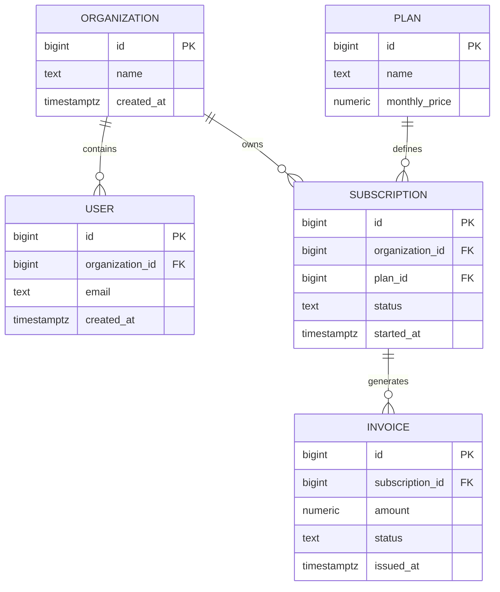

# 02- Entity Relationship Modeling

## Overview

Entity Relationship (ER) modeling is a conceptual and logical technique for designing relational databases around **entities, attributes, relationships, and business rules**.

It provides a bridge between business requirements and the physical SQL schema:

```text
Business Requirements
        │
        ▼
Domain Entities
        │
        ▼
Relationships + Cardinality
        │
        ▼
ER Model
        │
        ▼
Relational Schema
        │
        ├── Tables
        ├── Primary Keys
        ├── Foreign Keys
        ├── Constraints
        └── Indexes
```

ER modeling is particularly useful before implementing a production schema because relationship mistakes are expensive to fix after data, application code, APIs, and integrations depend on them.

A useful ER model answers:

- What are the important entities?
- What attributes belong to each entity?
- How are entities related?
- How many records can participate in a relationship?
- Is participation optional or mandatory?
- Which entity owns the relationship?
- Which business rules must be enforced?
- Which relationships require their own entity?

## Entity

An **entity** represents a distinct domain concept that has its own identity and lifecycle.

Typical backend entities include:

```text
Customer
Order
Product
Payment
Invoice
Subscription
Address
Organization
User
```

For example, an e-commerce system might identify:

```text
Customer
Order
Product
```

as separate entities because each has independent attributes and lifecycle behavior.

An entity normally becomes a table in a relational implementation, although the mapping is not always one-to-one.

## Attributes

Attributes describe an entity.

For example:

```text
Customer
├── id
├── email
├── name
└── created_at
```

The corresponding relational representation might be:

```sql
CREATE TABLE customers (
    id bigint GENERATED ALWAYS AS IDENTITY PRIMARY KEY,
    email text NOT NULL,
    name text NOT NULL,
    created_at timestamptz NOT NULL DEFAULT now()
);
```

An attribute should represent one meaningful piece of information.

Avoid modeling multiple independent facts as a single uncontrolled value:

```text
phone_numbers = "1111111111,2222222222"
```

If phone numbers have their own lifecycle or need independent querying, model them separately.

## Entity Identity

Every entity needs a way to distinguish one instance from another.

For example:

```text
Customer
    ├── id = 101
    ├── email = alice@example.com
    └── name = Alice

Customer
    ├── id = 102
    ├── email = bob@example.com
    └── name = Bob
```

A relational schema commonly uses a surrogate primary key:

```sql
id bigint GENERATED ALWAYS AS IDENTITY PRIMARY KEY
```

Business attributes can then have separate uniqueness constraints:

```sql
CONSTRAINT customers_email_unique UNIQUE (email)
```

This separates:

```text
Identity
    ↓
id

Business uniqueness
    ↓
email
```

That distinction becomes important when business attributes can change.

## Relationships

A relationship describes how entities are associated.

For example:

```text
Customer ────────< Order
```

means:

> One customer can have many orders.

A relational implementation normally places the foreign key on the many side:

```sql
CREATE TABLE orders (
    id bigint GENERATED ALWAYS AS IDENTITY PRIMARY KEY,
    customer_id bigint NOT NULL,

    CONSTRAINT orders_customer_fkey
        FOREIGN KEY (customer_id)
        REFERENCES customers(id)
);
```

The relationship is represented by:

```text
orders.customer_id
        │
        ▼
customers.id
```

## Cardinality

Cardinality describes how many instances of one entity can be associated with another.

The common relationship types are:

| Relationship | Example | Typical relational representation |
|---|---|---|
| One-to-one | User → Profile | FK + `UNIQUE` |
| One-to-many | Customer → Orders | FK on many side |
| Many-to-many | Students ↔ Courses | Junction table |
| Optional one-to-one | User → Profile | Nullable FK + `UNIQUE`, or separate lifecycle modeling |
| Optional one-to-many | Customer → Orders | FK may be nullable only if an order can legitimately exist without a customer |

Cardinality is a domain decision, not merely a database implementation detail.

## One-to-One Relationships

A one-to-one relationship means one entity can correspond to at most one entity on the other side.

For example:

```text
User ─────── Profile
  1            1
```

A database implementation can enforce this with a unique foreign key:

```sql
CREATE TABLE user_profiles (
    user_id bigint PRIMARY KEY,
    display_name text,
    timezone text,

    CONSTRAINT user_profiles_user_fkey
        FOREIGN KEY (user_id)
        REFERENCES users(id)
);
```

Using the foreign key as the primary key ensures:

```text
One user → at most one profile
```

### When to Use One-to-One

One-to-one modeling is useful when:

- The related data has a separate lifecycle.
- Different permissions apply to the related data.
- The related data is optional.
- Separating the table improves storage or operational boundaries.
- The entity has substantially different access patterns.

Do not create one-to-one tables simply because a large table has many columns. Sometimes keeping closely related attributes in one table is simpler and more efficient.

## One-to-Many Relationships

One-to-many is one of the most common relational relationships.

Example:

```text
Customer
   │
   ├── Order
   ├── Order
   └── Order
```

Schema:

```sql
CREATE TABLE customers (
    id bigint GENERATED ALWAYS AS IDENTITY PRIMARY KEY,
    email text NOT NULL UNIQUE
);

CREATE TABLE orders (
    id bigint GENERATED ALWAYS AS IDENTITY PRIMARY KEY,
    customer_id bigint NOT NULL,

    CONSTRAINT orders_customer_fkey
        FOREIGN KEY (customer_id)
        REFERENCES customers(id)
);
```

The foreign key belongs on the **many side**:

```text
customers.id
     ▲
     │
orders.customer_id
```

This is a frequent interview question.

## Optional Relationships

Not every relationship must exist.

For example:

```text
User ─────── Profile
  1          0..1
```

A user may exist before a profile is created.

The relational representation may use:

```sql
user_id bigint UNIQUE REFERENCES users(id)
```

with `user_id` nullable if the relationship itself is optional.

However, optionality should reflect domain semantics.

Do not make a foreign key nullable merely because the application sometimes does not know the value.

Distinguish:

```text
Relationship does not exist
```

from:

```text
Relationship should exist but data is missing
```

The former may justify `NULL`; the latter usually indicates an integrity problem.

## Many-to-Many Relationships

A many-to-many relationship occurs when multiple records on both sides can be associated.

Example:

```text
Student ─────< Enrollment >───── Course
```

A student can enroll in many courses, and a course can contain many students.

A relational database normally resolves this through a junction table:

```sql
CREATE TABLE students (
    id bigint GENERATED ALWAYS AS IDENTITY PRIMARY KEY,
    name text NOT NULL
);

CREATE TABLE courses (
    id bigint GENERATED ALWAYS AS IDENTITY PRIMARY KEY,
    name text NOT NULL
);

CREATE TABLE enrollments (
    student_id bigint NOT NULL,
    course_id bigint NOT NULL,
    enrolled_at timestamptz NOT NULL DEFAULT now(),

    PRIMARY KEY (student_id, course_id),

    CONSTRAINT enrollments_student_fkey
        FOREIGN KEY (student_id)
        REFERENCES students(id),

    CONSTRAINT enrollments_course_fkey
        FOREIGN KEY (course_id)
        REFERENCES courses(id)
);
```

The junction table becomes:

```text
students
   │
   │ 1
   ▼
enrollments
   ▲
   │ 1
   │
courses
```

Conceptually:

```text
Student N ─────── N Course
        ↓
  Enrollment
```

## Relationship Attributes

A relationship itself may have attributes.

Consider:

```text
Order ───── Product
```

If the relationship needs:

```text
quantity
unit_price
discount
created_at
```

those attributes belong to the relationship.

Therefore:

```text
Order ─────< Order Item >───── Product
```

rather than trying to place them on either `orders` or `products`.

Example:

```sql
CREATE TABLE order_items (
    order_id bigint NOT NULL,
    product_id bigint NOT NULL,
    quantity integer NOT NULL,
    unit_price numeric(12, 2) NOT NULL,

    PRIMARY KEY (order_id, product_id),

    CONSTRAINT order_items_order_fkey
        FOREIGN KEY (order_id)
        REFERENCES orders(id),

    CONSTRAINT order_items_product_fkey
        FOREIGN KEY (product_id)
        REFERENCES products(id),

    CONSTRAINT order_items_quantity_check
        CHECK (quantity > 0),

    CONSTRAINT order_items_unit_price_check
        CHECK (unit_price >= 0)
);
```

This is a critical modeling pattern:

> If a relationship has meaningful attributes, model the relationship as an entity.

## Recursive Relationships

An entity can relate to itself.

For example:

```text
Employee
   │
   └── reports_to ──> Employee
```

A relational implementation uses a self-referencing foreign key:

```sql
CREATE TABLE employees (
    id bigint GENERATED ALWAYS AS IDENTITY PRIMARY KEY,
    name text NOT NULL,
    manager_id bigint,

    CONSTRAINT employees_manager_fkey
        FOREIGN KEY (manager_id)
        REFERENCES employees(id)
);
```

This supports:

```text
CEO
 ├── Engineering Manager
 │     ├── Backend Engineer
 │     └── Backend Engineer
 └── Sales Manager
```

Recursive relationships are common for:

- Organizational hierarchies.
- Categories.
- Folder structures.
- Comment threads.
- Bill-of-materials structures.

For deep or highly queried hierarchies, a simple adjacency list may eventually require additional strategies such as recursive queries, materialized paths, closure tables, or specialized representations.

## Weak Entities

A weak entity depends on another entity for its identity or lifecycle.

For example:

```text
Order
  │
  └── Order Item
```

An order item generally has little meaning outside its order.

A composite key can express this:

```sql
PRIMARY KEY (order_id, product_id)
```

Alternatively, the child may have its own surrogate ID while retaining the foreign key.

The choice depends on:

- Whether the child has an independent identity.
- Whether external systems reference it.
- Query patterns.
- Key width.
- Domain semantics.

Do not automatically use composite keys or surrogate keys without considering how the entity is used.

## Participation

Cardinality and participation are related but different concepts.

Consider:

```text
Customer ───── Order
```

Possible business rules include:

```text
Customer → 0..N Orders
Order    → exactly 1 Customer
```

This means:

- A customer can exist without orders.
- An order cannot exist without a customer.

The database can express the second rule with:

```sql
customer_id bigint NOT NULL
```

plus a foreign key.

This distinction is important because:

```text
1:N
```

does not automatically mean:

```text
Every parent must have at least one child.
```

A parent can legitimately have zero children.

## ER Modeling Example

Consider a subscription platform.

Business requirements:

- An organization can have many users.
- A user belongs to one organization.
- An organization can have many subscriptions.
- A subscription references one plan.
- A plan can have many subscriptions.
- A subscription can have many invoices.
- An invoice belongs to exactly one subscription.

The ER model can be represented as:



The ER model makes relationship ownership and cardinality visible before implementation details such as indexes are considered.

## From ER Model to SQL

A practical transformation looks like:

```text
Entity
   ↓
Table

Attribute
   ↓
Column

Entity identity
   ↓
Primary key

One-to-many relationship
   ↓
Foreign key

Many-to-many relationship
   ↓
Junction table

Mandatory attribute
   ↓
NOT NULL

Unique business value
   ↓
UNIQUE constraint

Domain invariant
   ↓
CHECK constraint
```

For example:

```text
Customer
    │
    └──< Order
```

becomes:

```sql
CREATE TABLE customers (
    id bigint GENERATED ALWAYS AS IDENTITY PRIMARY KEY
);

CREATE TABLE orders (
    id bigint GENERATED ALWAYS AS IDENTITY PRIMARY KEY,
    customer_id bigint NOT NULL,

    CONSTRAINT orders_customer_fkey
        FOREIGN KEY (customer_id)
        REFERENCES customers(id)
);
```

## ER Modeling and Normalization

ER modeling identifies the domain structure. Normalization determines how that structure should be represented without unnecessary duplication.

Consider:

```text
Order
├── customer_id
├── customer_email
├── product_id
├── product_name
└── quantity
```

This combines several concepts.

A more appropriate model is:

```text
Customer
    │
    └──< Order
             │
             └──< Order Item >── Product
```

This allows:

- Customer data to be maintained once.
- Product data to be maintained once.
- Orders to represent their own lifecycle.
- Order items to represent the order-product relationship.

Normalization should still be balanced against actual workload and domain requirements.

## ER Modeling and Constraints

An ER diagram describes relationships conceptually, but production SQL must enforce important invariants.

For example:

```text
User ───── Organization
  N          1
```

should normally become:

```sql
organization_id bigint NOT NULL
```

and:

```sql
FOREIGN KEY (organization_id)
REFERENCES organizations(id)
```

If the domain says that an email must be unique within an organization:

```sql
CONSTRAINT users_organization_email_unique
    UNIQUE (organization_id, email)
```

The ER model and constraint model should therefore be consistent.

## ER Modeling and Indexes

ER diagrams do not normally show every index.

However, relationship modeling should lead to considering indexes on foreign-key columns and common access paths.

Suppose:

```text
Organization
    │
    └──< User
```

and the application frequently executes:

```sql
SELECT id, email
FROM users
WHERE organization_id = $1
ORDER BY created_at DESC
LIMIT 100;
```

A useful index may be:

```sql
CREATE INDEX users_organization_created_idx
ON users (organization_id, created_at DESC);
```

The foreign key establishes correctness; the index addresses performance.

These are separate concerns.

## Data Ownership

ER modeling becomes more nuanced in distributed systems.

In a monolithic application:

```text
Orders DB
    │
    ├── customers
    ├── orders
    └── order_items
```

Foreign keys can directly enforce relationships.

In a microservice architecture:

```text
Customer Service
    │
    └── Customer Database

Order Service
    │
    └── Order Database
```

The order service may store:

```text
customer_id
```

without a database-level foreign key to the customer service database.

The relationship is then enforced through distributed mechanisms such as:

- Service APIs.
- Events.
- Idempotent consumers.
- Reconciliation jobs.
- Domain-level validation.

Do not confuse a logical relationship with a database-level foreign key.

## Multi-Tenant ER Modeling

For SaaS systems, tenant ownership should be visible in the model.

Example:

```text
Organization
    │
    ├──< User
    ├──< Project
    └──< Invoice
```

A relational implementation might use:

```sql
CREATE TABLE projects (
    id bigint GENERATED ALWAYS AS IDENTITY PRIMARY KEY,
    organization_id bigint NOT NULL,
    name text NOT NULL,

    CONSTRAINT projects_organization_fkey
        FOREIGN KEY (organization_id)
        REFERENCES organizations(id),

    CONSTRAINT projects_organization_name_unique
        UNIQUE (organization_id, name)
);
```

This communicates two different rules:

```text
organization_id
    ↓
ownership

(organization_id, name)
    ↓
tenant-scoped uniqueness
```

A foreign key alone does not provide tenant isolation or authorization.

Application authorization, database permissions, row-level security where appropriate, and query design must address those concerns.

## Temporal and Historical Relationships

Some relationships change over time.

For example:

```text
Employee ─── Department
```

If the application must know the employee's historical department assignments, storing only:

```text
employees.department_id
```

is insufficient.

A history model may instead be:

```text
Employee
    │
    └──< Department Assignment >── Department
```

with:

```sql
CREATE TABLE employee_department_assignments (
    employee_id bigint NOT NULL,
    department_id bigint NOT NULL,
    started_at timestamptz NOT NULL,
    ended_at timestamptz,

    FOREIGN KEY (employee_id)
        REFERENCES employees(id),

    FOREIGN KEY (department_id)
        REFERENCES departments(id),

    CHECK (ended_at IS NULL OR ended_at > started_at)
);
```

Historical requirements should be identified during modeling because they can materially change the schema.

## Production Design Workflow

A practical ER modeling workflow is:

1. Identify domain entities.
2. Define entity identity.
3. Identify attributes and their types.
4. Identify relationships.
5. Determine cardinality.
6. Determine optional vs mandatory participation.
7. Identify relationship attributes.
8. Resolve many-to-many relationships.
9. Identify recursive relationships.
10. Define important invariants.
11. Translate the model into relational tables.
12. Add primary keys and foreign keys.
13. Add uniqueness, nullability, checks, and defaults.
14. Map important access patterns.
15. Design indexes.
16. Review migration and operational implications.

This avoids jumping directly from requirements to `CREATE TABLE` statements without first understanding the domain.

## Common ER Modeling Mistakes

### Treating Every Noun as a Table

Requirements may contain many nouns:

```text
Order
Customer
Shipping Address
Payment Method
Discount
```

Not every noun necessarily deserves an independent table.

The deciding factors are:

- Independent identity.
- Lifecycle.
- Relationships.
- Reuse.
- Query requirements.
- Ownership.
- Domain semantics.

### Missing Relationship Entities

A common mistake is:

```text
Order ───── Product
```

while ignoring:

```text
quantity
unit_price
discount
```

These values belong to the relationship, so an `OrderItem` entity is required.

### Incorrect Cardinality

Modeling:

```text
Customer 1 ─── 1 Order
```

when a customer can create many orders causes fundamental schema problems.

Cardinality should be derived from domain rules rather than assumptions.

### Using Nullable Foreign Keys for Convenience

This:

```sql
customer_id bigint
```

instead of:

```sql
customer_id bigint NOT NULL
```

weakens the schema if every order must have a customer.

Nullability should represent real domain optionality.

### Missing Uniqueness

Suppose the domain requires:

```text
One user email per organization
```

A foreign key does not enforce that.

You need:

```sql
UNIQUE (organization_id, email)
```

### Modeling Many-to-Many as Arrays or Delimited Strings

Avoid:

```text
course.student_ids = "1,4,7,10"
```

when relationships need relational querying, integrity, or metadata.

Use a junction table.

### Overusing One-to-One Tables

Splitting every logical group of fields into separate tables can create unnecessary joins and complexity.

A one-to-one table should have a domain or operational reason.

### Ignoring Lifecycle

If a child cannot exist independently, its lifecycle should be reflected in the relationship and delete/update behavior.

For example:

```text
Order → Order Items
```

may justify cascading deletion if order items have no independent meaning.

Conversely, historical financial records may require `RESTRICT` or `PROTECT`-style behavior.

### Ignoring Historical Requirements

Replacing:

```text
current_status
```

may not be sufficient when the business needs:

```text
who changed it
when it changed
what it changed from
what it changed to
```

Model historical relationships explicitly when required.

## Production Considerations

### Referential Integrity

Use foreign keys when the related entities are within the same database ownership boundary and referential integrity matters.

This prevents orphaned records:

```text
orders.customer_id
        │
        X
        │
customer does not exist
```

from being persisted.

### Delete Behavior

Choose delete behavior deliberately:

| Behavior | Appropriate when |
|---|---|
| `CASCADE` | Child has no independent lifecycle |
| `RESTRICT` / `NO ACTION` | Parent deletion must be blocked |
| `SET NULL` | Relationship is optional and child survives |
| Application-managed deletion | Complex business workflow is involved |

Do not use `CASCADE` merely because it makes deletes convenient.

### Large Tables

As relationships grow into millions or billions of rows:

- Index common foreign-key access paths.
- Avoid unnecessary indexes.
- Monitor join performance.
- Consider archival requirements.
- Evaluate partitioning only when workload characteristics justify it.
- Review migration locking behavior.
- Monitor vacuum and storage growth in PostgreSQL.

### High Availability

ER modeling itself does not provide high availability.

Production database architecture may additionally require:

```text
Application
    │
    ▼
Primary Database
    │
    ├── Replica
    ├── Backups
    └── Point-in-Time Recovery
```

Relationship correctness remains important on every database instance, while replication and recovery provide availability and durability.

### Observability

Track the operational consequences of the model through:

- Slow queries.
- Query execution plans.
- Lock waits.
- Deadlocks.
- Foreign-key violations.
- Constraint violations.
- Table growth.
- Index growth.
- Replication lag.

For PostgreSQL, validate important queries with:

```sql
EXPLAIN (ANALYZE, BUFFERS)
SELECT o.id, o.created_at
FROM orders AS o
WHERE o.customer_id = 42
ORDER BY o.created_at DESC
LIMIT 50;
```

## ORM Mapping

ER relationships map directly to common ORM concepts.

Django:

```python
from django.db import models


class Organization(models.Model):
    name = models.CharField(max_length=200)


class User(models.Model):
    organization = models.ForeignKey(
        Organization,
        on_delete=models.PROTECT,
        related_name="users",
    )
    email = models.EmailField()

    class Meta:
        constraints = [
            models.UniqueConstraint(
                fields=["organization", "email"],
                name="users_organization_email_unique",
            ),
        ]
```

The ORM expresses:

```text
Organization 1 ─── N User
```

while the generated database schema provides:

```text
organization_id
    ↓
FOREIGN KEY

(organization_id, email)
    ↓
UNIQUE
```

Senior backend engineers should inspect the resulting migration and SQL rather than assuming that ORM declarations automatically produce the intended physical design.

## API and ER Model Boundaries

An API model should not necessarily mirror the ER model.

For example, the database may contain:

```text
orders
order_items
products
customers
```

while the REST API returns:

```json
{
  "id": 1001,
  "customer": {
    "id": 42,
    "name": "Alice"
  },
  "items": [
    {
      "product_id": 7,
      "quantity": 2
    }
  ]
}
```

The API aggregates multiple entities into one representation.

Therefore:

```text
ER Model
    ≠
API Response Model
```

This separation allows the database to remain normalized while APIs evolve independently.

## Interview Traps

| Question | Strong answer |
|---|---|
| Where does the foreign key go in a one-to-many relationship? | Usually on the many side. |
| How do you implement many-to-many relationships relationally? | Use a junction table containing foreign keys to both entities. |
| How do you enforce one-to-one? | A foreign key plus a uniqueness constraint; using the FK as the primary key is also common. |
| Does `1:N` mean every parent has at least one child? | No. It describes maximum cardinality; participation may still be optional. |
| Where should relationship attributes go? | In a relationship/junction entity when they describe the association itself. |
| Can an ER diagram represent database indexes completely? | Usually no. Indexes are physical access-path decisions derived from workload and queries. |
| Is every relationship a foreign key? | Not necessarily. Cross-service relationships may be logical relationships without database-level foreign keys. |
| Does a foreign key enforce authorization? | No. It enforces referential integrity, not user access permissions. |
| Should every entity have a separate table? | No. Table boundaries should follow domain identity, lifecycle, relationships, and access requirements. |
| Is an ER model sufficient for production schema design? | No. It must be followed by physical decisions involving types, constraints, indexes, migrations, workload, and operations. |

## Key Takeaways

- **ER modeling translates domain concepts into entities, attributes, relationships, cardinality, and participation rules before physical SQL implementation.**
- **One-to-many relationships normally use a foreign key on the many side, while many-to-many relationships require a junction entity.**
- **If a relationship has meaningful attributes such as quantity, price, or timestamps, model that relationship explicitly as an entity.**
- **ER structure, constraints, normalization, and indexes solve different problems and should be designed together without conflating them.**
- **In distributed systems, logical relationships can cross service boundaries even when database-level foreign keys cannot; ownership and consistency mechanisms must then be explicit.**