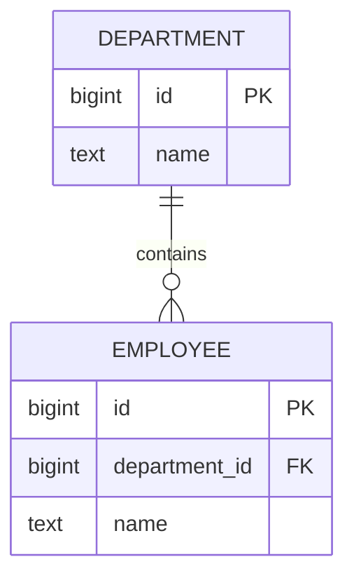

# 03- Normalization Introduction

## Overview

Database normalization is the systematic process of structuring relational data to reduce unnecessary redundancy and prevent anomalies while preserving the correctness of the model.

The primary goal is not to create the maximum possible number of tables. The goal is to ensure that each fact is stored in an appropriate place and that relationships between facts are represented explicitly.

A normalized design generally provides:

- Less duplicated data.
- Fewer update inconsistencies.
- Clearer ownership of facts.
- Stronger data integrity.
- More predictable schema evolution.
- Better alignment between domain entities and relational structures.

Normalization is primarily a **logical data-modeling technique**. Physical concerns such as indexes, partitioning, caching, replication, and query performance are considered afterward and may justify carefully controlled denormalization.

## Why Normalization Exists

Consider an order table containing repeated customer information:

```text
orders
┌──────────┬─────────────┬────────────────────┬─────────────┐
│ order_id │ customer_id │ customer_email     │ customer_name│
├──────────┼─────────────┼────────────────────┼─────────────┤
│ 1001     │ 42          │ alice@example.com  │ Alice       │
│ 1002     │ 42          │ alice@example.com  │ Alice       │
│ 1003     │ 42          │ alice@example.com  │ Alice       │
└──────────┴─────────────┴────────────────────┴─────────────┘
```

The same customer facts are stored repeatedly.

If Alice changes her email address, every affected row must be updated correctly.

A normalized model separates the entities:

```text
customers
┌────┬────────────────────┬───────┐
│ id │ email              │ name  │
├────┼────────────────────┼───────┤
│ 42 │ alice@example.com  │ Alice │
└────┴────────────────────┴───────┘

orders
┌──────────┬─────────────┐
│ order_id │ customer_id │
├──────────┼─────────────┤
│ 1001     │ 42          │
│ 1002     │ 42          │
│ 1003     │ 42          │
└──────────┴─────────────┘
```

Now the customer fact is stored once and orders reference it through a foreign key.

## Data Anomalies

Normalization is largely about preventing three classes of anomalies.

### Update Anomaly

Suppose a customer's email is duplicated across 1,000 orders.

Changing the email requires updating all 1,000 rows.

If one row is missed, the database contains contradictory representations of the same fact.

Normalized design:

```text
Customer email
      │
      ▼
customers.email
      │
      └── referenced by orders
```

The fact has a single authoritative location.

### Insert Anomaly

Suppose customer information can only be inserted as part of an order.

A new customer who has not placed an order cannot be represented cleanly.

Separating:

```text
customers
orders
```

allows a customer to exist independently of whether an order exists.

### Delete Anomaly

Suppose the only record containing a customer's information is also the customer's last order.

Deleting the order could unintentionally delete the only representation of the customer.

Normalization separates independent entities so that deleting one relationship does not necessarily destroy unrelated facts.

## The Core Normalization Principle

A useful engineering heuristic is:

> Store each fact once, at the level where that fact actually belongs.

For example:

```text
Customer
    ├── id
    ├── email
    └── name

Order
    ├── id
    ├── customer_id
    └── created_at

Product
    ├── id
    ├── name
    └── current_price

Order Item
    ├── order_id
    ├── product_id
    ├── quantity
    └── unit_price
```

Notice that:

- Customer attributes belong to `Customer`.
- Order attributes belong to `Order`.
- Product attributes belong to `Product`.
- Attributes describing the order-product relationship belong to `Order Item`.

This is more useful in practice than memorizing normal-form definitions in isolation.

## Functional Dependencies

Functional dependencies provide the formal reasoning behind normalization.

A functional dependency:

```text
A → B
```

means:

> Given a value of `A`, the value of `B` is determined.

For example:

```text
customer_id → customer_email
```

if each customer has exactly one email address.

If a table contains:

```text
customer_id
customer_email
order_id
```

then storing `customer_email` alongside every order introduces repeated information because:

```text
customer_id → customer_email
```

The customer attributes belong with the customer identifier.

Another example:

```text
product_id → product_name
product_id → current_price
```

while:

```text
(order_id, product_id) → quantity
```

because quantity is a property of a specific product within a specific order.

Functional dependencies help determine where attributes belong.

## Normalization Levels

The most commonly discussed normal forms are:

| Normal Form | Main concern |
|---|---|
| First Normal Form (1NF) | Atomic values and well-defined rows/columns |
| Second Normal Form (2NF) | No partial dependency on part of a composite key |
| Third Normal Form (3NF) | No transitive dependency of non-key attributes on a key |
| Boyce-Codd Normal Form (BCNF) | Every determinant is a candidate key |
| Fourth Normal Form (4NF) | Eliminates problematic independent multivalued dependencies |
| Fifth Normal Form (5NF) | Addresses certain complex join dependencies |

For most application databases, understanding **1NF through 3NF**, plus the reasoning behind BCNF, is sufficient for everyday schema design. Higher normal forms become relevant in specialized relational models.

## First Normal Form

### What It Means

A relation is generally considered to satisfy 1NF when:

- Each column represents a single logical value.
- Values are atomic for the purposes of the model.
- Rows can be uniquely identified.
- Repeating groups are not embedded inside a column.

Avoid structures such as:

```text
customer
├── id
├── name
└── phone_numbers = "1111111111,2222222222"
```

Instead:

```text
customers
    │
    └──< customer_phone_numbers
```

For example:

```sql
CREATE TABLE customer_phone_numbers (
    id bigint GENERATED ALWAYS AS IDENTITY PRIMARY KEY,
    customer_id bigint NOT NULL,
    phone_number text NOT NULL,

    CONSTRAINT customer_phone_numbers_customer_fkey
        FOREIGN KEY (customer_id)
        REFERENCES customers(id)
);
```

Now individual phone numbers can be:

- Queried.
- Validated.
- Indexed.
- Added or removed independently.
- Related to additional metadata.

### Important Nuance

"Atomic" does not mean that every value must be a single primitive character or token.

PostgreSQL supports types such as:

- `jsonb`
- Arrays
- Composite types

These can be valid engineering choices when the data is genuinely semi-structured or has appropriate access patterns.

Normalization should not become a dogmatic prohibition against every structured value.

## Second Normal Form

2NF primarily matters when a table has a **composite candidate key**.

A relation violates 2NF when a non-key attribute depends on only part of a composite key.

Consider:

```text
order_items
┌──────────┬────────────┬───────────────┬──────────────┐
│ order_id │ product_id │ product_name  │ quantity     │
└──────────┴────────────┴───────────────┴──────────────┘
```

Assume:

```text
(order_id, product_id) → quantity
product_id → product_name
```

`product_name` depends only on `product_id`, not the complete composite key.

Therefore, `product_name` does not belong in `order_items`.

A normalized design is:

```text
products
    ├── product_id
    └── product_name

order_items
    ├── order_id
    ├── product_id
    └── quantity
```

### Why 2NF Matters

It prevents partial duplication in association tables.

A common practical pattern is:

```text
Many-to-many relationship
        ↓
Junction table
        ↓
Only relationship-specific attributes belong there
```

## Third Normal Form

3NF addresses **transitive dependencies**.

Suppose:

```text
employees
├── employee_id
├── department_id
├── department_name
```

Assume:

```text
employee_id → department_id
department_id → department_name
```

Therefore:

```text
employee_id → department_name
```

indirectly through `department_id`.

`department_name` is a department attribute, not an employee attribute.

Normalize it into:

```text
employees
├── employee_id
└── department_id

departments
├── department_id
└── department_name
```

The relationship becomes:



## 3NF in Practical Backend Systems

Consider an API that creates employees:

```http
POST /employees
```

The request may contain:

```json
{
  "name": "Alice",
  "department_id": 10
}
```

The database can retrieve the department name through the relationship rather than requiring the client to submit:

```json
{
  "name": "Alice",
  "department_id": 10,
  "department_name": "Engineering"
}
```

This gives one authoritative source for the department name.

The API representation and normalized storage model do not need to be identical.

## Normalization and Referential Integrity

Normalization establishes logical separation; constraints enforce the resulting relationships.

Example:

```sql
CREATE TABLE departments (
    id bigint GENERATED ALWAYS AS IDENTITY PRIMARY KEY,
    name text NOT NULL UNIQUE
);

CREATE TABLE employees (
    id bigint GENERATED ALWAYS AS IDENTITY PRIMARY KEY,
    department_id bigint NOT NULL,
    name text NOT NULL,

    CONSTRAINT employees_department_fkey
        FOREIGN KEY (department_id)
        REFERENCES departments(id)
);
```

This combination provides:

```text
department_id
      │
      ▼
departments.id
```

and prevents an employee from referencing a nonexistent department.

Normalization without constraints can still result in corrupted relationships.

## Normalization vs Denormalization

Normalization is the usual starting point for transactional systems.

Denormalization intentionally introduces redundancy to improve a specific workload or operational requirement.

| Concern | Normalization | Denormalization |
|---|---|---|
| Data duplication | Minimized | Intentional |
| Update consistency | Easier | More complex |
| Joins | Potentially more | Often fewer |
| Write complexity | Usually lower | Can increase |
| Read performance | Workload-dependent | Can improve |
| Storage | Usually lower | Usually higher |
| Cache-like projections | Less suitable | Well suited |
| Reporting/read models | Sometimes insufficient | Often useful |

The important distinction is:

> Denormalization should be driven by a measurable requirement, not by fear of joins.

## When Normalization Helps

Normalization is especially valuable for:

- OLTP systems.
- Financial transactions.
- User/account data.
- Inventory.
- Orders.
- Payments.
- Systems requiring strong consistency.
- Data with frequent updates.
- Domains where duplicate facts would be dangerous.

For example, storing a customer's current legal name in one authoritative customer record is generally preferable to duplicating it across every transactional record.

## When Denormalization Can Be Appropriate

Denormalization can be justified when:

- A read path is demonstrably too expensive.
- A high-volume query repeatedly performs expensive joins.
- A read model is intentionally materialized.
- Analytics workloads require different structures.
- Search indexes need flattened documents.
- Historical snapshots must preserve values independently of current master data.

For example, an order may intentionally store:

```text
unit_price
product_name
```

inside `order_items` even though product information exists elsewhere.

This is not necessarily bad normalization.

The critical question is whether those values represent **historical transaction facts**.

If a product currently costs `$20`, but an order was placed at `$15`, then:

```text
order_items.unit_price = 15
```

is not redundant data. It represents the price at the time of the transaction.

## Normalization Does Not Mean "Never Duplicate Data"

This is one of the most important distinctions for senior engineers.

Consider:

```sql
CREATE TABLE order_items (
    order_id bigint NOT NULL,
    product_id bigint NOT NULL,
    quantity integer NOT NULL,
    unit_price numeric(12, 2) NOT NULL
);
```

Suppose:

```text
products.current_price = 20.00
order_items.unit_price   = 15.00
```

The two values answer different questions:

```text
Product current price
        ↓
"What does this product cost now?"

Order item price
        ↓
"What price did this customer actually pay?"
```

The duplication is intentional because the semantics differ.

## Normalization and Query Performance

A common beginner mistake is assuming:

```text
More tables = slower database
```

This is incomplete.

Modern relational databases are designed to execute joins efficiently when:

- Relationships are properly indexed.
- Predicates are selective.
- Statistics are accurate.
- Queries are designed correctly.
- The schema matches access patterns.

For example:

```sql
SELECT
    o.id,
    o.created_at,
    c.email
FROM orders AS o
JOIN customers AS c
    ON c.id = o.customer_id
WHERE o.customer_id = $1
ORDER BY o.created_at DESC
LIMIT 50;
```

Appropriate indexes may make this highly efficient:

```sql
CREATE INDEX orders_customer_created_idx
ON orders (customer_id, created_at DESC);
```

Normalization and indexing solve different problems:

```text
Normalization
    ↓
Logical correctness + reduced redundancy

Indexes
    ↓
Efficient access paths
```

## Normalization and Transactions

Normalized transactional schemas work particularly well with ACID transactions.

Consider creating an order:

```text
BEGIN
   │
   ├── Insert order
   │
   ├── Insert order items
   │
   ├── Update inventory
   │
   └── COMMIT
```

If a constraint fails:

```text
Constraint violation
       ↓
ROLLBACK
       ↓
No partially committed order
```

The database can therefore maintain relationships and invariants atomically.

## Normalization in Django

Django models commonly map naturally to normalized relational structures:

```python
from django.db import models


class Department(models.Model):
    name = models.CharField(max_length=200, unique=True)


class Employee(models.Model):
    department = models.ForeignKey(
        Department,
        on_delete=models.PROTECT,
        related_name="employees",
    )
    name = models.CharField(max_length=200)
```

This creates a relationship:

```text
Department 1 ───── N Employee
```

Instead of storing:

```text
employee.department_name
```

for every employee.

For production systems, use database-level constraints in addition to application-level validation where the invariant must hold regardless of which application path writes the database.

## Normalization and Microservices

Normalization is scoped to a database ownership boundary.

For example:

```text
Customer Service
    │
    └── customer_db

Order Service
    │
    └── order_db
```

The order database may contain:

```text
customer_id
```

without a foreign key to the customer database.

The relationship still exists logically:

```text
Order → Customer
```

but referential integrity is no longer enforced by a single relational database.

Consistency may instead depend on:

- Service APIs.
- Events through Kafka.
- Idempotent consumers.
- Reconciliation jobs.
- Explicit ownership rules.

Do not attempt to recreate cross-service foreign keys through tightly coupled database access.

## A Practical Normalization Workflow

For a new schema:

1. Identify the entities.
2. Identify the facts associated with each entity.
3. Identify candidate keys.
4. Identify functional dependencies.
5. Separate independent entities.
6. Resolve many-to-many relationships.
7. Check for repeating or multi-valued attributes.
8. Check for partial dependencies on composite keys.
9. Check for transitive dependencies.
10. Add foreign keys and other integrity constraints.
11. Review important query patterns.
12. Add indexes based on actual access paths.
13. Identify deliberate denormalization requirements.
14. Document why any intentional redundancy exists.

This process provides a useful boundary between **logical modeling** and **physical optimization**.

## Normalization Review Example

Start with:

```text
orders
├── order_id
├── customer_id
├── customer_email
├── customer_name
├── product_id
├── product_name
├── quantity
├── unit_price
└── department_name
```

Potential dependencies include:

```text
customer_id → customer_email, customer_name
product_id → product_name
(order_id, product_id) → quantity, unit_price
```

A normalized design becomes:

```text
customers
├── id
├── email
└── name

products
├── id
└── name

orders
├── id
└── customer_id

order_items
├── order_id
├── product_id
├── quantity
└── unit_price
```

If `department_name` actually describes the product, then it belongs with the appropriate product/department model rather than being repeated in every order row.

This reasoning is more important than mechanically applying a normal-form checklist.

## Production Considerations

### Schema Evolution

Normalized schemas make ownership clearer during migrations.

For example, if department names change:

```text
departments.name
```

has one authoritative location.

A migration can modify the column once instead of rewriting millions of employee records containing duplicated department names.

### Data Integrity

Use database constraints to protect normalized relationships:

```sql
PRIMARY KEY
FOREIGN KEY
UNIQUE
NOT NULL
CHECK
```

Application validation improves developer and user experience, but database constraints protect the invariant at the persistence boundary.

### Indexing

Foreign keys and frequently joined columns should be reviewed for appropriate indexes.

For PostgreSQL, a foreign key does not automatically create an index on the referencing column.

For example:

```sql
CREATE INDEX orders_customer_id_idx
ON orders (customer_id);
```

may be necessary depending on workload.

However, do not blindly index every column. Each index increases:

- Storage.
- Write amplification.
- Maintenance work.
- Vacuum overhead.
- Write latency.

### High-Volume Tables

On large transactional tables:

- Keep the normalized model logically clean.
- Measure query performance.
- Inspect execution plans.
- Add workload-driven indexes.
- Consider materialized read models when justified.
- Use partitioning only when it addresses a real workload or operational problem.
- Avoid denormalizing simply to eliminate ordinary indexed joins.

### Reliability and Recovery

Normalized schemas can simplify recovery because authoritative facts have clear ownership.

Backups, replicas, and point-in-time recovery remain necessary regardless of normalization.

Normalization is not a substitute for:

- Backups.
- Replication.
- Disaster recovery.
- Transactions.
- Monitoring.

### Security

Normalization can reduce the number of locations containing sensitive attributes.

For example, keeping customer contact information in one authoritative table can reduce unnecessary duplication of personally identifiable information across transactional tables.

However, normalization does not automatically provide access control.

Use appropriate:

- Database roles.
- Application authorization.
- Encryption.
- Row-level security where appropriate.
- Audit mechanisms.

## Common Mistakes

### Over-Normalizing

A schema can become unnecessarily fragmented:

```text
user
  ↓
user_profile
  ↓
user_profile_metadata
  ↓
user_profile_metadata_preferences
```

without meaningful domain justification.

Excessive fragmentation can cause:

- More joins.
- More complicated queries.
- Harder ORM usage.
- More complicated migrations.
- Higher cognitive overhead.

Normalize based on data dependencies and domain boundaries, not a desire to maximize table count.

### Treating Normalization as a Performance Rule

Normalization is not synonymous with slow queries.

If a query is slow:

```text
Slow query
    ↓
EXPLAIN
    ↓
Identify bottleneck
    ↓
Index / query / schema optimization
```

Do not immediately duplicate data.

### Blindly Applying 3NF

Formal normalization rules are useful, but domain semantics matter.

A historical transaction value may intentionally differ from a current master value.

For example:

```text
products.price
```

and:

```text
order_items.unit_price
```

can legitimately contain different values.

### Storing Relationships as Strings

Avoid:

```text
order.product_ids = "12,17,42"
```

when those relationships need:

- Referential integrity.
- Joins.
- Individual updates.
- Indexing.
- Relationship metadata.

Use a junction table.

### Confusing NULL with Missing Entity

A nullable foreign key means the relationship may be absent.

It does not mean:

```text
The application does not know the value yet
```

without further domain reasoning.

Model optionality intentionally.

### Denormalizing Without an Ownership Model

If the same fact exists in multiple tables, define:

```text
Source of truth
      ↓
Derived copies
      ↓
Synchronization mechanism
```

Without this, denormalization creates multiple competing authorities.

## Interview Traps

| Question | Strong answer |
|---|---|
| Why normalize a database? | To reduce redundancy and prevent update, insert, and delete anomalies while preserving data integrity. |
| Does normalization eliminate all duplicate values? | No. Values can legitimately repeat, and intentional denormalization may be appropriate. |
| What does 1NF address? | Atomic relational values and removal of repeating groups. |
| When is 2NF especially relevant? | Tables with composite candidate keys and potential partial dependencies. |
| What does 3NF prevent? | Non-key attributes depending transitively on a key. |
| Does normalization always improve performance? | No. It primarily improves logical integrity; physical performance depends on workload, indexes, queries, and architecture. |
| Should every database be fully normalized? | No. Normalize as the default, then denormalize deliberately when measurable requirements justify it. |
| Is historical transaction data always redundant? | No. A historical value can represent a different business fact from the current master value. |
| Does an ORM replace normalization? | No. ORM models still need sound relational design and database constraints. |
| Does normalization work across microservice databases? | Logical modeling does, but database-level referential integrity generally stops at the database ownership boundary. |

## Key Takeaways

- **Normalization organizes facts according to their dependencies and ownership, reducing redundancy and preventing update, insert, and delete anomalies.**
- **1NF, 2NF, and 3NF provide practical reasoning tools: atomic values, no partial dependencies, and no transitive dependencies.**
- **Normalization is a logical correctness technique, not a rule that every schema must minimize joins or maximize table count.**
- **Intentional redundancy is valid when it represents a different business fact, such as an order's historical unit price, or when a measured workload justifies a read-oriented projection.**
- **Production schema design starts normalized, then combines constraints, indexes, workload analysis, and carefully documented denormalization where necessary.**