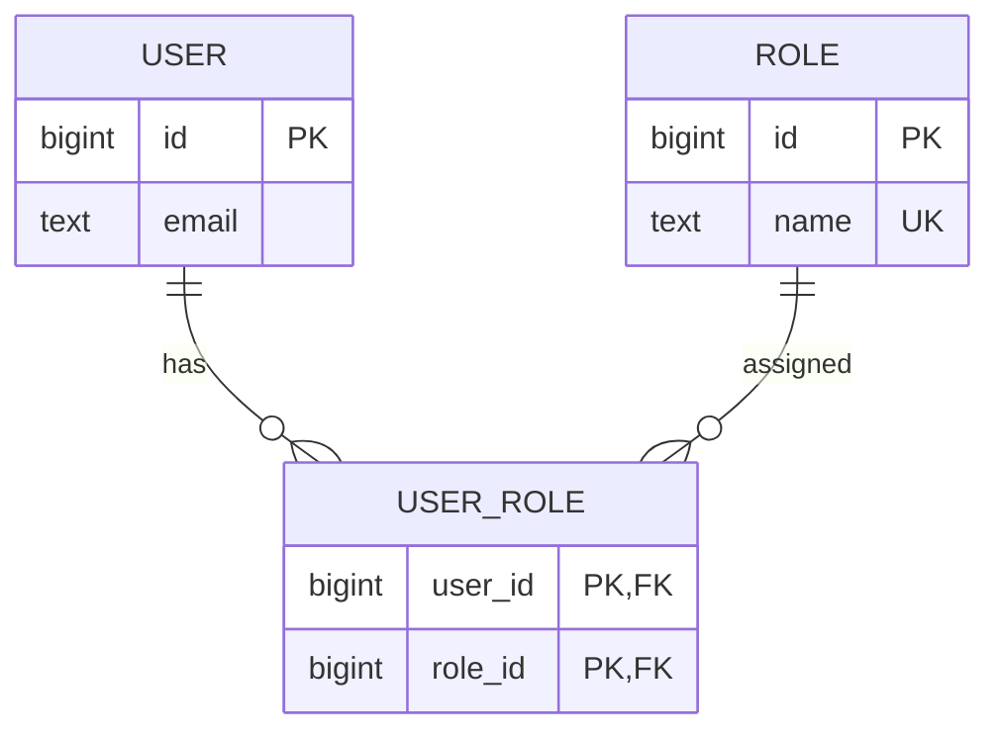

# 04- First Normal Form

## Overview

First Normal Form (1NF) is the foundational normalization rule for relational database design. It establishes that a table should represent data as well-defined rows and columns, with each column containing a single value for the meaning of that attribute and without repeating groups embedded inside a row.

1NF matters because relational operations such as filtering, joining, indexing, updating, and enforcing constraints work most predictably when relationships are represented structurally rather than encoded inside strings or application-specific collections.

A practical interpretation is:

> If a value represents multiple independently addressable facts, model those facts as rows or related entities rather than hiding them inside one column.

1NF is a starting point, not a complete schema-design methodology. A table can satisfy 1NF and still violate 2NF, 3NF, or contain serious domain-modeling problems.

## What 1NF Addresses

A relational table should have:

- A clearly defined row representing one logical record.
- Columns representing attributes of that record.
- Values that are atomic with respect to the model.
- No repeating groups such as `phone_1`, `phone_2`, `phone_3`.
- No comma-separated or otherwise serialized collections when the individual elements are relational facts.
- A key that allows individual rows to be uniquely identified.

Consider:

```text
customers
┌────┬─────────────┬─────────────────────────────┐
│ id │ name        │ phone_numbers               │
├────┼─────────────┼─────────────────────────────┤
│ 42 │ Alice       │ 1111111111,2222222222       │
└────┴─────────────┴─────────────────────────────┘
```

The `phone_numbers` column contains multiple independently meaningful phone numbers.

A relational design would normally represent them separately:

```text
customers
┌────┬─────────┐
│ id │ name    │
├────┼─────────┤
│ 42 │ Alice   │
└────┴─────────┘

customer_phone_numbers
┌────┬─────────────┬──────────────┐
│ id │ customer_id │ phone_number │
├────┼─────────────┼──────────────┤
│ 1  │ 42          │ 1111111111   │
│ 2  │ 42          │ 2222222222   │
└────┴─────────────┴──────────────┘
```

Now each phone number can be independently queried, indexed, validated, deleted, or associated with additional attributes.

## Why 1NF Exists

Without 1NF-style modeling, application logic often becomes responsible for interpreting structured data that the database cannot naturally reason about.

For example:

```text
phone_numbers = "1111111111,2222222222,3333333333"
```

requires application code to:

1. Parse the string.
2. Split the values.
3. Validate each value.
4. Search the collection.
5. Modify one element.
6. Serialize the collection again.

A relational representation allows the database to perform these operations directly:

```sql
SELECT phone_number
FROM customer_phone_numbers
WHERE customer_id = $1;
```

This becomes particularly important as requirements evolve.

Today the requirement may be:

```text
Customer → phone numbers
```

Tomorrow it may become:

```text
Customer → phone number
                 ├── type
                 ├── verified_at
                 ├── country_code
                 └── is_primary
```

A dedicated relation accommodates that evolution naturally.

## Atomic Values

### What "Atomic" Means

In normalization terminology, an atomic value is a value that is treated as one indivisible attribute for the purposes of the relational model.

For example:

```text
email = "alice@example.com"
```

is normally one attribute value.

But:

```text
emails = "alice@example.com,bob@example.com"
```

contains multiple independently addressable email values.

The important question is not whether a value is technically stored as one database value. The question is whether the application treats its contents as multiple relational facts.

### Atomicity Is Model-Dependent

Atomicity should not be interpreted as:

> Every column must contain a primitive scalar.

Modern databases support structured types. PostgreSQL, for example, supports:

- `jsonb`
- Arrays
- Composite types

These can be appropriate when the data is genuinely semi-structured and does not require relational treatment.

Therefore, this can be valid:

```sql
CREATE TABLE webhook_events (
    id bigint GENERATED ALWAYS AS IDENTITY PRIMARY KEY,
    payload jsonb NOT NULL,
    received_at timestamptz NOT NULL DEFAULT now()
);
```

The `payload` may intentionally represent an external event document.

The design question is whether the contents of `payload` need to participate as independently managed relational facts.

## Repeating Groups

A classic 1NF violation is representing multiple occurrences of the same attribute as separate columns.

Avoid:

```text
customers
├── id
├── name
├── phone_1
├── phone_2
├── phone_3
└── phone_4
```

This creates structural problems:

- The maximum number of values is predetermined.
- Queries must inspect multiple columns.
- Adding another value requires schema changes.
- Constraints become repetitive.
- Indexing each value independently becomes awkward.
- Application code becomes more complex.

Use:

```text
customers
├── id
└── name

customer_phone_numbers
├── id
├── customer_id
└── phone_number
```

The number of phone numbers is now data rather than schema.

## Comma-Separated Values

Avoid storing relational collections as strings:

```sql
CREATE TABLE users (
    id bigint PRIMARY KEY,
    roles text NOT NULL
);
```

with:

```text
roles = "admin,editor,auditor"
```

This makes operations such as:

```sql
WHERE roles = 'admin'
```

incorrect for collection membership.

Searching with string manipulation is also fragile:

```sql
WHERE ',' || roles || ',' LIKE '%,admin,%'
```

This is difficult to index and maintain correctly.

A relational representation is usually preferable:

```sql
CREATE TABLE roles (
    id bigint GENERATED ALWAYS AS IDENTITY PRIMARY KEY,
    name text NOT NULL UNIQUE
);

CREATE TABLE user_roles (
    user_id bigint NOT NULL,
    role_id bigint NOT NULL,

    PRIMARY KEY (user_id, role_id),

    FOREIGN KEY (user_id) REFERENCES users(id),
    FOREIGN KEY (role_id) REFERENCES roles(id)
);
```

The database can now enforce the relationship.

## Many-to-Many Relationships

1NF commonly leads to the recognition that many-to-many relationships require a separate relation.

For example:

```text
User ───────< User Role >─────── Role
```



The junction table contains one relationship per row.

For example:

```text
user_id | role_id
--------+--------
42      | 1
42      | 2
42      | 5
```

This is much more flexible than:

```text
user.roles = "admin,editor,auditor"
```

## Nested and Structured Data

Not every nested structure violates the practical intent of 1NF.

For example, an API may receive:

```json
{
  "customer_id": 42,
  "preferences": {
    "language": "en",
    "timezone": "Asia/Kolkata"
  }
}
```

Whether `preferences` should become separate relational columns depends on how the application uses it.

If the database frequently needs:

```sql
WHERE language = 'en'
```

or:

```sql
ORDER BY timezone
```

then relational columns may be more appropriate.

If the data is:

- Rarely queried.
- Flexible in structure.
- Controlled by an external schema.
- Stored primarily for retrieval or auditing.

then PostgreSQL `jsonb` may be a reasonable choice.

The key distinction is between **relational facts that need database-level behavior** and **semi-structured documents that are intentionally treated as documents**.

## Practical PostgreSQL Example

### Poor Relational Design

```sql
CREATE TABLE customers (
    id bigint GENERATED ALWAYS AS IDENTITY PRIMARY KEY,
    name text NOT NULL,
    phone_numbers text NOT NULL
);
```

Example value:

```text
+919810000001,+919810000002
```

Problems include:

- No foreign-key relationship.
- Individual values cannot be naturally indexed.
- Updating one phone number requires parsing.
- Uniqueness across phone numbers is difficult to enforce.
- Additional phone metadata requires further parsing conventions.

### 1NF-Oriented Design

```sql
CREATE TABLE customers (
    id bigint GENERATED ALWAYS AS IDENTITY PRIMARY KEY,
    name text NOT NULL
);

CREATE TABLE customer_phone_numbers (
    id bigint GENERATED ALWAYS AS IDENTITY PRIMARY KEY,
    customer_id bigint NOT NULL,
    phone_number text NOT NULL,
    phone_type text NOT NULL,
    is_primary boolean NOT NULL DEFAULT false,

    CONSTRAINT customer_phone_numbers_customer_fkey
        FOREIGN KEY (customer_id)
        REFERENCES customers(id)
        ON DELETE CASCADE,

    CONSTRAINT customer_phone_numbers_unique
        UNIQUE (customer_id, phone_number)
);
```

Now each phone number is an independently addressable row.

## Querying a 1NF Design

Find all phone numbers for a customer:

```sql
SELECT phone_number, phone_type, is_primary
FROM customer_phone_numbers
WHERE customer_id = $1
ORDER BY id;
```

Find customers with a specific phone number:

```sql
SELECT customer_id
FROM customer_phone_numbers
WHERE phone_number = $1;
```

With an appropriate index:

```sql
CREATE INDEX customer_phone_numbers_phone_idx
ON customer_phone_numbers (phone_number);
```

The database can use a normal B-tree access path instead of parsing a serialized collection.

## Constraints and 1NF

1NF improves the ability to enforce database constraints at the correct level.

For example, suppose each customer may have only one primary phone number.

A PostgreSQL partial unique index can enforce this:

```sql
CREATE UNIQUE INDEX customer_one_primary_phone_idx
ON customer_phone_numbers (customer_id)
WHERE is_primary;
```

This is substantially stronger than relying on application code to inspect a serialized list.

The relationship between modeling and constraints is important:

```text
Good relational structure
        ↓
Individual facts become rows
        ↓
Constraints can target those facts
        ↓
Database can enforce invariants
```

## 1NF and Application Code

A normalized relational representation usually simplifies backend code.

In Django:

```python
from django.db import models


class Customer(models.Model):
    name = models.CharField(max_length=200)


class CustomerPhoneNumber(models.Model):
    customer = models.ForeignKey(
        Customer,
        on_delete=models.CASCADE,
        related_name="phone_numbers",
    )
    phone_number = models.CharField(max_length=32)
    phone_type = models.CharField(max_length=32)
    is_primary = models.BooleanField(default=False)

    class Meta:
        constraints = [
            models.UniqueConstraint(
                fields=["customer", "phone_number"],
                name="customer_phone_unique",
            ),
        ]
```

The application can now work with individual objects rather than manually parsing and serializing strings.

Database constraints should still be treated as the authoritative enforcement layer for invariants that must hold regardless of which application path performs the write.

## 1NF and JSON

A common interview trap is:

> "If JSON contains multiple fields, JSON always violates 1NF."

That is too simplistic.

The appropriate question is whether the database is expected to treat the internal JSON elements as relational attributes.

For example:

```sql
CREATE TABLE audit_events (
    id bigint GENERATED ALWAYS AS IDENTITY PRIMARY KEY,
    event_type text NOT NULL,
    payload jsonb NOT NULL,
    created_at timestamptz NOT NULL DEFAULT now()
);
```

This can be a sensible design for immutable event payloads.

By contrast, this can become problematic:

```sql
CREATE TABLE products (
    id bigint PRIMARY KEY,
    attributes jsonb NOT NULL
);
```

when the system needs to frequently:

- Filter by individual attributes.
- Enforce uniqueness.
- Create relational foreign keys.
- Join attributes with other entities.
- Maintain strict types and invariants.

In that case, some or all of the structure may belong in relational columns or related tables.

## 1NF and NULL

1NF does not mean that every column must be `NOT NULL`.

For example:

```sql
CREATE TABLE employees (
    id bigint GENERATED ALWAYS AS IDENTITY PRIMARY KEY,
    name text NOT NULL,
    middle_name text
);
```

`middle_name` can legitimately be `NULL` because the attribute itself is singular.

The distinction is:

```text
NULL
↓
No value for this attribute

Multiple values in one column
↓
Potential violation of the relational structure
```

These are different modeling concerns.

## 1NF and Keys

Rows should be uniquely identifiable.

A primary key provides a common mechanism:

```sql
CREATE TABLE customer_phone_numbers (
    id bigint GENERATED ALWAYS AS IDENTITY PRIMARY KEY,
    customer_id bigint NOT NULL,
    phone_number text NOT NULL
);
```

A composite key can also be appropriate:

```sql
CREATE TABLE user_roles (
    user_id bigint NOT NULL,
    role_id bigint NOT NULL,

    PRIMARY KEY (user_id, role_id)
);
```

The key design should reflect the domain and relationship semantics rather than being chosen mechanically.

## 1NF vs Later Normal Forms

1NF solves a different class of problems from 2NF and 3NF.

| Normal Form | Primary concern |
|---|---|
| 1NF | Atomic relational values and repeating groups |
| 2NF | Partial dependency on part of a composite key |
| 3NF | Transitive dependency between non-key attributes |
| BCNF | Every determinant is a candidate key |

Example:

```text
order_items
├── order_id
├── product_id
├── product_name
└── quantity
```

Removing `product_name` because it depends only on `product_id` is primarily a **2NF** concern when `(order_id, product_id)` is the key.

First removing multi-valued attributes and repeating groups is the 1NF foundation.

## Production Considerations

### Query Performance

A separate table does not inherently mean poor performance.

For example:

```sql
SELECT c.id, c.name
FROM customers AS c
JOIN customer_phone_numbers AS p
    ON p.customer_id = c.id
WHERE p.phone_number = $1;
```

can be efficient with:

```sql
CREATE INDEX customer_phone_numbers_phone_idx
ON customer_phone_numbers (phone_number);

CREATE INDEX customer_phone_numbers_customer_idx
ON customer_phone_numbers (customer_id);
```

Use `EXPLAIN (ANALYZE, BUFFERS)` to determine whether a real query requires optimization rather than assuming the normalized structure is inherently slow.

### Write Performance

Normalized collections can increase row counts.

One customer with 10 phone numbers produces:

```text
1 customer row
10 phone-number rows
```

This is usually a reasonable trade-off because each value is independently manageable.

At high scale, optimize the actual workload through:

- Appropriate indexes.
- Batch writes.
- Query planning.
- Connection pooling.
- Partitioning where justified.
- Read replicas where appropriate.

Do not abandon relational modeling solely because a child table contains many rows.

### Indexing

Index the access paths your application actually uses.

For example:

```sql
CREATE INDEX customer_phone_numbers_customer_idx
ON customer_phone_numbers (customer_id);
```

and, if reverse lookup is common:

```sql
CREATE INDEX customer_phone_numbers_phone_idx
ON customer_phone_numbers (phone_number);
```

Avoid indexing every column by default because indexes increase storage and write-maintenance costs.

### Schema Evolution

Repeating columns create schema-level limits:

```text
phone_1
phone_2
phone_3
```

Adding `phone_4` requires a migration.

A child table has no fixed maximum:

```text
customer_phone_numbers
```

New phone numbers are ordinary inserts.

This distinction becomes increasingly valuable as product requirements evolve.

### Security and Privacy

A relational design makes individual sensitive values easier to control and audit.

For example, individual phone records can have:

- Access policies.
- Audit events.
- Verification timestamps.
- Retention rules.
- Encryption strategies.

Avoid duplicating sensitive data merely for convenience. Fewer authoritative copies generally reduce the number of locations that must be protected.

## When Structured Values Are Appropriate

A senior engineer should distinguish between relational data and document data rather than applying 1NF mechanically.

Structured values can be appropriate for:

| Use case | Typical approach |
|---|---|
| Relational entity attributes | Normal columns |
| Many-to-many relationships | Junction table |
| Frequently queried relationship facts | Related table |
| External webhook payload | `jsonb` |
| Flexible metadata | `jsonb` |
| Immutable event document | `jsonb` |
| High-integrity business attributes | Relational columns |
| Arbitrary user-defined metadata | Often `jsonb` |

The decision should consider:

- Query patterns.
- Integrity requirements.
- Schema stability.
- Ownership.
- Update frequency.
- Indexing requirements.
- Expected data volume.
- Operational complexity.

## Common Mistakes

### Using Comma-Separated Values

```text
roles = "admin,editor,auditor"
```

This pushes relational work into application code.

**Better:** use a junction table when roles are relational entities.

### Creating Fixed Repeating Columns

```text
tag_1
tag_2
tag_3
```

This encodes a cardinality limit in the schema.

**Better:** use a related table when the number of tags is variable.

### Assuming Every JSON Object Is Invalid

JSON can be an appropriate storage representation for genuinely semi-structured data.

**Better:** determine whether individual JSON fields need relational semantics.

### Treating 1NF as the Entire Normalization Process

A table can satisfy 1NF while still having:

- Partial dependencies.
- Transitive dependencies.
- Excessive redundancy.

**Better:** continue evaluating 2NF, 3NF, and the domain's functional dependencies.

### Ignoring Query Patterns

A normalized model may be logically correct but poorly indexed.

**Better:** separate logical design from physical optimization and use workload-driven indexes.

### Moving Everything Into JSON to Avoid Tables

This often starts as a convenience and later creates:

- Difficult queries.
- Weak integrity enforcement.
- Complex validation.
- Difficult migrations.
- Inconsistent data shapes.

**Better:** use relational columns for stable, high-integrity business facts and structured storage where flexibility is actually required.

## Interview Traps

| Question | Strong answer |
|---|---|
| What does 1NF mean? | A relation has well-defined rows and columns, with values treated as atomic for the model and without repeating groups. |
| Is a comma-separated list 1NF? | Generally no when the elements are independently meaningful relational values. |
| Are multiple columns like `phone_1`, `phone_2`, `phone_3` a good design? | Generally no; they represent a repeating group and impose an artificial cardinality limit. |
| Does 1NF prohibit JSON? | No. Structured types can be appropriate when the data is intentionally treated as a document rather than a set of relational facts. |
| Does every column need to be `NOT NULL` for 1NF? | No. NULLability and atomicity are separate concerns. |
| Does 1NF require a primary key? | A practical relational design should have a way to uniquely identify rows, although formal definitions of 1NF and key requirements vary by relational theory. |
| Does normalization always improve performance? | No. It primarily improves logical structure and integrity; performance depends on workload, indexes, queries, and physical design. |
| Why use a junction table? | To represent multiple relationship instances as individual rows and allow relational constraints and indexes. |
| Is one JSON document per row always denormalized? | Not necessarily. It depends on whether the internal data is intended to have relational semantics. |

## Key Takeaways

- **1NF establishes a clean relational structure: each row represents one logical record and values are atomic with respect to the model.**
- **Repeating columns and serialized collections such as comma-separated IDs should generally be replaced with rows and relationships when the elements are independently meaningful.**
- **1NF enables normal relational operations and database constraints to operate on individual facts instead of requiring application-level parsing.**
- **Structured types such as PostgreSQL `jsonb` are not automatically wrong; use them deliberately when the data is genuinely semi-structured or document-oriented.**
- **1NF is only the foundation of normalization; after establishing it, evaluate functional dependencies and continue with 2NF, 3NF, and workload-driven physical design.**