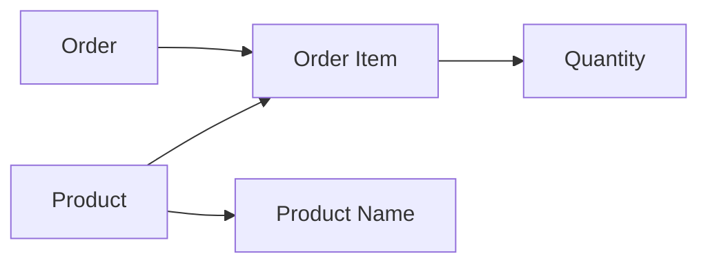

# 05- Second Normal Form

## Overview

Second Normal Form (2NF) builds on First Normal Form (1NF) by eliminating **partial functional dependencies**.

A relation is in 2NF when:

- It is already in 1NF.
- Every non-key attribute depends on the **whole candidate key**, not merely part of a composite candidate key.

The important phrase is **whole key**.

2NF primarily matters when a table has a **composite candidate key**. If every candidate key consists of a single column, partial dependency cannot occur, so a 1NF relation with only single-column candidate keys is automatically in 2NF.

Consider an order-item table:

```text
order_id | product_id | product_name | quantity
---------+------------+--------------+---------
1001     | 10         | Keyboard     | 2
1001     | 20         | Mouse        | 1
1002     | 10         | Keyboard     | 3
```

Suppose:

```text
(order_id, product_id)
```

uniquely identifies each row.

Then:

```text
quantity
```

depends on both:

```text
order_id + product_id
```

but:

```text
product_name
```

depends only on:

```text
product_id
```

That is a partial dependency, so the relation is not in 2NF.

## Functional Dependency

2NF requires understanding **functional dependency**.

A functional dependency:

```text
A → B
```

means that knowing `A` uniquely determines `B`.

For example:

```text
product_id → product_name
```

If `product_id = 10` always identifies the same product name, then `product_id` functionally determines `product_name`.

For an order-item relation:

```text
(order_id, product_id) → quantity
product_id → product_name
```

The second dependency is the problem because `product_name` depends on only part of the composite key.

### Candidate Key

A candidate key is a minimal set of attributes that uniquely identifies a row.

For:

```text
order_items
```

the candidate key might be:

```text
(order_id, product_id)
```

The key contains two attributes, so it is composite.

A non-key attribute such as `quantity` should depend on:

```text
(order_id, product_id)
```

rather than only:

```text
order_id
```

or:

```text
product_id
```

## Partial Dependency

A partial dependency exists when a non-key attribute depends on only a proper subset of a composite candidate key.

Suppose:

```text
PRIMARY KEY (order_id, product_id)
```

and:

```text
product_id → product_name
```

Then:

```text
(order_id, product_id) → product_name
```

is technically true, but it is not a full dependency because `product_id` alone is sufficient.

This causes redundancy:

```text
order_id | product_id | product_name | quantity
---------+------------+--------------+---------
1001     | 10         | Keyboard     | 2
1001     | 20         | Mouse        | 1
1002     | 10         | Keyboard     | 3
1003     | 10         | Keyboard     | 4
```

`Keyboard` is repeated for every order containing product `10`.

## Why 2NF Exists

The primary goal of 2NF is to prevent attributes from being stored in a relation where they depend on only part of the relation's key.

Without 2NF, common anomalies appear.

| Anomaly | Example |
|---|---|
| Update anomaly | Renaming a product requires changing many order-item rows |
| Insert anomaly | A product cannot be stored without an order |
| Delete anomaly | Deleting the last order containing a product may remove product information |
| Redundancy | Product attributes repeat across many order rows |

These problems become more expensive as data volume grows.

## Practical Example

### Before 2NF

```sql
CREATE TABLE order_items (
    order_id bigint NOT NULL,
    product_id bigint NOT NULL,
    product_name text NOT NULL,
    quantity integer NOT NULL,

    PRIMARY KEY (order_id, product_id)
);
```

The dependencies are:

```text
(order_id, product_id) → quantity
product_id → product_name
```

The first dependency is valid.

The second dependency is partial because `product_name` depends only on `product_id`.

Therefore, the table is not in 2NF.

### After 2NF

Move product-specific attributes into a product relation:

```sql
CREATE TABLE products (
    id bigint GENERATED ALWAYS AS IDENTITY PRIMARY KEY,
    name text NOT NULL
);

CREATE TABLE order_items (
    order_id bigint NOT NULL,
    product_id bigint NOT NULL,
    quantity integer NOT NULL,

    PRIMARY KEY (order_id, product_id),

    FOREIGN KEY (product_id)
        REFERENCES products(id)
);
```

Now:

```text
products
    product_id → product_name

order_items
    (order_id, product_id) → quantity
```

Each non-key attribute depends on the appropriate key.

## Data Flow

The relationship can be viewed as:



The key idea is that `quantity` describes the **relationship between an order and a product**, while `product_name` describes the **product itself**.

This distinction is one of the most useful practical ways to recognize 2NF violations.

## Entity Ownership

A useful design question is:

> Which entity does this attribute actually describe?

Consider:

```text
order_id
product_id
quantity
product_name
product_price
```

Typically:

| Attribute | Describes |
|---|---|
| `order_id` | Order |
| `product_id` | Product |
| `quantity` | Order-product relationship |
| `product_name` | Product |
| `product_price` | Depends on business semantics |

`quantity` belongs to `order_items`.

`product_name` belongs to `products`.

`product_price` requires more care.

If the system needs the **current catalog price**, it belongs to `products` or a price relation.

If the system needs the **price actually charged at order time**, storing it in `order_items` is usually correct:

```sql
CREATE TABLE order_items (
    order_id bigint NOT NULL,
    product_id bigint NOT NULL,
    quantity integer NOT NULL,
    unit_price numeric(12, 2) NOT NULL,

    PRIMARY KEY (order_id, product_id)
);
```

Here:

```text
(order_id, product_id) → quantity
(order_id, product_id) → unit_price
```

`unit_price` is an attribute of the historical order line, not merely an attribute of the product.

This is an important production-level distinction: **normalization follows business semantics, not just column names**.

## Composite Keys and 2NF

2NF is specifically concerned with composite candidate keys.

For example:

```sql
CREATE TABLE user_roles (
    user_id bigint NOT NULL,
    role_id bigint NOT NULL,
    assigned_at timestamptz NOT NULL,

    PRIMARY KEY (user_id, role_id)
);
```

The key is:

```text
(user_id, role_id)
```

and:

```text
assigned_at
```

describes the relationship represented by that row.

There is no obvious dependency such as:

```text
user_id → assigned_at
```

or:

```text
role_id → assigned_at
```

Therefore, the attribute depends on the complete relationship key.

## Single-Column Keys

Consider:

```sql
CREATE TABLE products (
    id bigint GENERATED ALWAYS AS IDENTITY PRIMARY KEY,
    name text NOT NULL,
    category_id bigint NOT NULL
);
```

The candidate key is:

```text
id
```

There is no proper subset of a one-column key.

Therefore, partial dependency is impossible.

This means:

> A relation with only single-column candidate keys cannot violate 2NF due to partial dependency.

This is a common interview point.

However, such a table can still violate **3NF**.

For example:

```text
product_id → category_id
category_id → category_name
```

If `category_name` is stored directly in `products`, the issue is a transitive dependency rather than a 2NF violation.

## Surrogate Keys and 2NF

A common production design is:

```sql
CREATE TABLE order_items (
    id bigint GENERATED ALWAYS AS IDENTITY PRIMARY KEY,
    order_id bigint NOT NULL,
    product_id bigint NOT NULL,
    quantity integer NOT NULL
);
```

The primary key is now a single surrogate key:

```text
id
```

Strictly speaking, this removes the partial-dependency issue with respect to the declared primary key.

But that does **not** automatically mean the underlying model has eliminated the dependency problem.

The business relationship may still be:

```text
(order_id, product_id)
```

and the application may require it to be unique:

```sql
ALTER TABLE order_items
ADD CONSTRAINT order_items_order_product_unique
UNIQUE (order_id, product_id);
```

The important lesson is:

> Adding a surrogate key does not magically remove business functional dependencies.

Normalization should be evaluated against the relation's candidate keys and business semantics, not only against the column chosen as the primary key.

## 2NF vs 1NF

| Concern | 1NF | 2NF |
|---|---|---|
| Atomic values | Yes | Assumed |
| Repeating groups | Eliminated | Assumed eliminated |
| Composite keys | Allowed | Relevant |
| Partial dependencies | Not the focus | Eliminated |
| Single-column keys | Valid | Automatically avoid partial dependency |
| Functional dependencies | Basic foundation | Whole-key dependency |

A typical normalization progression is:

```text
1NF
 ↓
Eliminate repeating groups and non-atomic relational values
 ↓
2NF
 ↓
Eliminate partial dependencies
 ↓
3NF
 ↓
Eliminate transitive dependencies
```

## 2NF vs 3NF

Consider:

```text
order_id
product_id
product_name
category_id
category_name
quantity
```

with:

```text
(order_id, product_id) → quantity
product_id → product_name
product_id → category_id
category_id → category_name
```

There are two different normalization problems.

### Partial Dependency

```text
product_id → product_name
```

`product_name` depends on part of the composite key.

This violates 2NF.

### Transitive Dependency

```text
product_id → category_id
category_id → category_name
```

Therefore:

```text
product_id → category_name
```

through `category_id`.

This is a 3NF concern.

A strong normalization analysis identifies the dependency type rather than simply saying that "the table has too much duplicated data."

## Production Schema Example

A practical order system might use:

```sql
CREATE TABLE products (
    id bigint GENERATED ALWAYS AS IDENTITY PRIMARY KEY,
    name text NOT NULL,
    current_price numeric(12, 2) NOT NULL
);

CREATE TABLE orders (
    id bigint GENERATED ALWAYS AS IDENTITY PRIMARY KEY,
    customer_id bigint NOT NULL,
    created_at timestamptz NOT NULL DEFAULT now()
);

CREATE TABLE order_items (
    order_id bigint NOT NULL,
    product_id bigint NOT NULL,
    quantity integer NOT NULL,
    unit_price numeric(12, 2) NOT NULL,

    PRIMARY KEY (order_id, product_id),

    FOREIGN KEY (order_id)
        REFERENCES orders(id),

    FOREIGN KEY (product_id)
        REFERENCES products(id),

    CHECK (quantity > 0),
    CHECK (unit_price >= 0)
);
```

This separates:

```text
Product
    ↓
Current product attributes

Order
    ↓
Order-level attributes

Order Item
    ↓
Order + Product relationship
    ↓
Historical transaction attributes
```

This design also supports important invariants directly in PostgreSQL.

## ORM Considerations

Django naturally maps this model to separate entities:

```python
from django.db import models


class Product(models.Model):
    name = models.CharField(max_length=200)
    current_price = models.DecimalField(max_digits=12, decimal_places=2)


class Order(models.Model):
    customer_id = models.BigIntegerField()
    created_at = models.DateTimeField(auto_now_add=True)


class OrderItem(models.Model):
    order = models.ForeignKey(Order, on_delete=models.CASCADE)
    product = models.ForeignKey(Product, on_delete=models.PROTECT)
    quantity = models.PositiveIntegerField()
    unit_price = models.DecimalField(max_digits=12, decimal_places=2)

    class Meta:
        constraints = [
            models.UniqueConstraint(
                fields=["order", "product"],
                name="order_item_order_product_unique",
            ),
        ]
```

The ORM model makes the entity boundaries explicit, but the underlying database constraints remain important.

Application validation alone cannot protect the database from every concurrent writer, background worker, migration, script, or service.

## Querying the Normalized Design

Retrieve order details:

```sql
SELECT
    oi.order_id,
    oi.product_id,
    p.name,
    oi.quantity,
    oi.unit_price
FROM order_items AS oi
JOIN products AS p
    ON p.id = oi.product_id
WHERE oi.order_id = $1;
```

The additional join is not inherently a performance problem.

With appropriate indexes and a well-designed query plan, normalized relational structures can support high-throughput workloads.

The important question is whether the query workload and indexes match the model.

## Indexing Considerations

The primary key:

```sql
PRIMARY KEY (order_id, product_id)
```

creates an index beginning with:

```text
order_id
```

This efficiently supports:

```sql
WHERE order_id = $1
```

It does not necessarily provide an efficient access path for:

```sql
WHERE product_id = $1
```

If reverse lookup is common, add an index:

```sql
CREATE INDEX order_items_product_idx
ON order_items (product_id);
```

This is an example of separating:

- **Logical normalization**
- **Physical indexing**

Normalization determines where data belongs.

Indexes determine how efficiently common access paths can retrieve it.

## Advantages

2NF provides several practical benefits:

- Reduces repeated entity attributes.
- Prevents many update anomalies.
- Makes entity ownership clearer.
- Reduces inconsistent copies of the same fact.
- Improves maintainability.
- Makes foreign-key relationships more natural.
- Creates cleaner boundaries for indexes and constraints.
- Supports schema evolution without duplicating entity attributes.

## Limitations

2NF does not solve every database-design problem.

A relation can be in 2NF and still have:

- Transitive dependencies.
- Poor indexing.
- Incorrect cardinality modeling.
- Inappropriate data types.
- Missing constraints.
- Excessive joins for a specific workload.
- Poorly designed historical data.
- Denormalization that is necessary but undocumented.

Normalization is a logical design technique, not a substitute for workload analysis.

## When Denormalization Is Reasonable

Production systems sometimes intentionally duplicate data for performance or historical correctness.

For example:

```text
orders
├── id
├── customer_id
├── customer_name_snapshot
└── ...
```

If `customer_name_snapshot` records the customer's name at the time of purchase, this is not merely accidental duplication. It may be an intentional historical snapshot.

Similarly, analytics systems may denormalize data into reporting tables or materialized views to optimize read-heavy workloads.

The important distinction is:

```text
Accidental redundancy
        ↓
Data inconsistency risk

Intentional denormalization
        ↓
Documented invariant + controlled synchronization
```

Do not denormalize simply because joins appear inconvenient.

## Performance Considerations

Normalization can increase the number of relations involved in a query, but performance should be evaluated empirically.

For PostgreSQL:

```sql
EXPLAIN (ANALYZE, BUFFERS)
SELECT
    oi.product_id,
    p.name,
    oi.quantity
FROM order_items AS oi
JOIN products AS p
    ON p.id = oi.product_id
WHERE oi.order_id = 1001;
```

Investigate:

- Join strategy.
- Index usage.
- Rows estimated vs actual.
- Buffer reads.
- Sort operations.
- Sequential scans.
- Query latency.

Typical optimization tools include:

- Composite indexes.
- Covering indexes where justified.
- Query restructuring.
- Connection pooling.
- Read replicas for appropriate workloads.
- Caching.
- Materialized views.
- Intentional denormalization.

Do not compromise logical data integrity prematurely to avoid a join.

## Scalability Considerations

A normalized schema can scale effectively when:

- Keys are appropriately indexed.
- Foreign keys are indexed where required by workload.
- Queries use selective predicates.
- Transactions remain appropriately scoped.
- Connection pools are sized correctly.
- High-volume tables are monitored.
- Hot rows and contention are controlled.

At larger scale, senior-level database design requires reasoning about both:

```text
Logical model
+
Physical storage
+
Query workload
+
Concurrency
+
Operational constraints
```

2NF addresses the logical model. It does not prescribe the complete physical architecture.

## Reliability and Data Integrity

2NF reduces the number of places where an entity attribute must be updated.

For example, if product information exists only in:

```text
products
```

then changing:

```text
product_name
```

requires one logical update.

If the product name is duplicated across millions of order-item records, consistency becomes much harder.

Foreign keys reinforce the separation:

```sql
FOREIGN KEY (product_id)
REFERENCES products(id)
```

This ensures an order item cannot reference a nonexistent product.

Together:

```text
Normalization
    ↓
Clear data ownership
    ↓
Foreign keys + constraints
    ↓
Database-enforced integrity
```

## Common Mistakes

### Thinking 2NF Means "No Duplicate Data"

2NF specifically addresses **partial functional dependencies**.

Duplicate data can arise for many other reasons.

**Better:** identify candidate keys and functional dependencies first.

### Applying 2NF Without Checking Composite Keys

If the table has only single-column candidate keys, partial dependency cannot exist.

**Better:** first identify candidate keys.

### Assuming a Surrogate Key Solves Everything

Changing:

```text
PRIMARY KEY (order_id, product_id)
```

to:

```text
PRIMARY KEY (id)
```

does not remove business dependencies.

**Better:** still identify natural or business candidate keys and enforce them where appropriate.

### Moving Attributes Without Understanding Their Semantics

`unit_price` may look like a product attribute, but in an order system it can represent the historical transaction price.

**Better:** determine what the attribute means at the business level.

### Removing Historical Snapshots

Some duplicated values are intentional.

For example:

```text
order_items.unit_price
```

may be required because the product's current price can change later.

**Better:** distinguish historical facts from accidental redundancy.

### Optimizing for Joins Too Early

A developer may denormalize a table simply to avoid a join.

**Better:** measure query performance with realistic data and workload before introducing redundancy.

## Production Pitfalls

### Missing Uniqueness on Relationship Tables

Using a surrogate primary key:

```sql
id bigint PRIMARY KEY
```

without enforcing:

```text
(order_id, product_id)
```

can allow duplicate order items.

Use:

```sql
UNIQUE (order_id, product_id)
```

when the business rule requires one row per product per order.

### Incorrect Foreign-Key Actions

Choosing `ON DELETE CASCADE` without understanding the business lifecycle can cause unexpected data deletion.

For transactional data, `ON DELETE RESTRICT` or `ON DELETE PROTECT` semantics may be more appropriate.

### Over-Normalizing

Splitting every attribute into separate tables can produce excessive joins and operational complexity.

Normalization should reflect meaningful entity boundaries, not a goal of maximizing the number of tables.

### Ignoring Workload

A logically normalized design can still perform poorly if high-frequency access patterns are not indexed.

Use production-like workloads and query plans to validate the physical design.

## Interview Traps

| Question | Strong answer |
|---|---|
| What is 2NF? | A relation is in 1NF and every non-key attribute depends on the whole candidate key, not a proper subset. |
| When does 2NF matter most? | When a relation has composite candidate keys. |
| Can a table with a single-column primary key violate 2NF? | Not due to partial dependency on that primary key, because it has no proper non-empty subset. |
| What is a partial dependency? | A non-key attribute depends on only part of a composite candidate key. |
| Why is `product_name` problematic in `order_items`? | If `(order_id, product_id)` is the key and `product_id → product_name`, the attribute depends only on part of the key. |
| Does adding a surrogate primary key automatically normalize a table? | No. Business functional dependencies and candidate keys still matter. |
| Is every duplicated value a 2NF violation? | No. Duplication can be intentional, historical, or related to other design concerns. |
| Does normalization always improve performance? | No. It improves logical structure and integrity; physical performance depends on workload, indexes, query plans, and architecture. |
| What comes after 2NF? | 3NF, which primarily addresses transitive dependencies. |

## Key Takeaways

- **2NF requires a table to be in 1NF and eliminates partial dependencies of non-key attributes on composite candidate keys.**
- **2NF is primarily relevant to tables with composite candidate keys; single-column candidate keys cannot have partial dependencies.**
- **Separate attributes according to what they describe: entity attributes belong to entities, while relationship attributes belong to relationship tables.**
- **Surrogate primary keys do not eliminate business functional dependencies; candidate keys and business uniqueness still need to be identified and enforced.**
- **Normalization is logical design, not performance tuning; use indexes, query plans, and measured workloads before introducing intentional denormalization.**