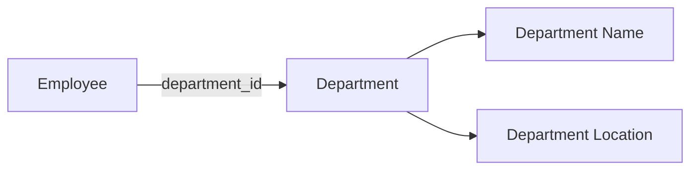

# 06- Third Normal Form

## Overview

Third Normal Form (3NF) builds on First Normal Form (1NF) and Second Normal Form (2NF) by eliminating **transitive dependencies** between non-key attributes.

A relation is in 3NF when:

- It is already in 2NF.
- Non-key attributes do not depend on other non-key attributes through a transitive dependency.

The practical goal is to ensure that an attribute describing an entity is stored with the key that determines it, rather than being indirectly determined through another non-key attribute.

Consider:

```text
employees
------------------------------------------------
employee_id | department_id | department_name
------------------------------------------------
101         | 10            | Engineering
102         | 10            | Engineering
103         | 20            | Finance
```

Assume:

```text
employee_id → department_id
department_id → department_name
```

Therefore:

```text
employee_id → department_name
```

through `department_id`.

`department_name` is transitively dependent on `employee_id`, so the relation is not in 3NF.

The usual solution is to separate departments from employees.

## Functional Dependencies

Functional dependency is the foundation for reasoning about 3NF.

If:

```text
A → B
```

then `A` functionally determines `B`.

For an employee model:

```text
employee_id → employee_name
employee_id → department_id
department_id → department_name
```

The important dependency is:

```text
department_id → department_name
```

because `department_name` describes the department, not the employee.

When `department_name` is stored in `employees`, the table contains an indirect dependency:

```text
employee_id
    ↓
department_id
    ↓
department_name
```

This is a transitive dependency.

## What Is a Transitive Dependency?

A transitive dependency exists when a non-key attribute depends on another non-key attribute that is itself functionally dependent on the key.

Conceptually:

```text
Primary Key
    ↓
Non-Key Attribute A
    ↓
Non-Key Attribute B
```

If `B` is dependent on `A` rather than directly on the key, the relation has a transitive dependency.

For example:

```text
employee_id → department_id
department_id → department_name
```

Therefore:

```text
employee_id → department_name
```

but the dependency path is:

```text
employee_id → department_id → department_name
```

The database should generally model these facts separately.

## 2NF vs 3NF

The distinction is important because both normal forms address different dependency problems.

| Normal Form | Main problem addressed | Typical example |
|---|---|---|
| 1NF | Non-atomic values and repeating groups | Multiple phone numbers in one column |
| 2NF | Partial dependency | `product_id → product_name` when key is `(order_id, product_id)` |
| 3NF | Transitive dependency | `department_id → department_name` inside `employees` |

A useful progression is:

```text
1NF
  ↓
Atomic attributes and no repeating groups
  ↓
2NF
  ↓
No partial dependency on composite keys
  ↓
3NF
  ↓
No transitive dependency among non-key attributes
```

## Practical Example

### Before 3NF

```sql
CREATE TABLE employees (
    id bigint GENERATED ALWAYS AS IDENTITY PRIMARY KEY,
    name text NOT NULL,
    department_id bigint NOT NULL,
    department_name text NOT NULL
);
```

Suppose:

```text
id → name
id → department_id
department_id → department_name
```

The dependency:

```text
department_id → department_name
```

means that multiple employees in the same department repeat the department name.

For example:

```text
id  | name  | department_id | department_name
----+-------+---------------+----------------
101 | Alice | 10            | Engineering
102 | Bob   | 10            | Engineering
103 | Carol | 20            | Finance
```

Changing the name of department `10` requires updating multiple rows.

That creates an update anomaly.

## After 3NF

Separate the department entity:

```sql
CREATE TABLE departments (
    id bigint GENERATED ALWAYS AS IDENTITY PRIMARY KEY,
    name text NOT NULL UNIQUE
);

CREATE TABLE employees (
    id bigint GENERATED ALWAYS AS IDENTITY PRIMARY KEY,
    name text NOT NULL,
    department_id bigint NOT NULL,

    FOREIGN KEY (department_id)
        REFERENCES departments(id)
);
```

Now:

```text
employees
    employee_id → department_id

departments
    department_id → department_name
```

Each fact is stored with the entity that owns it.

## Entity Ownership

A practical way to identify 3NF violations is to ask:

> If this non-key value changes, which entity actually changed?

Consider:

```text
employee_id
employee_name
department_id
department_name
department_location
```

The ownership is:

| Attribute | Entity |
|---|---|
| `employee_id` | Employee |
| `employee_name` | Employee |
| `department_id` | Department relationship |
| `department_name` | Department |
| `department_location` | Department |

Therefore, department attributes should normally live in `departments`.

This approach is often easier to apply in real backend systems than memorizing the formal definition alone.

## Data Flow

The normalized model separates employee and department data:



The employee stores the relationship:

```text
employee.department_id
```

The department stores department-specific facts:

```text
department.name
department.location
```

This avoids storing multiple copies of the same department information.

## Anomalies Prevented by 3NF

### Update Anomaly

Without 3NF:

```text
employee_id | department_id | department_name
101         | 10            | Engineering
102         | 10            | Engineering
103         | 10            | Engineering
```

Renaming the department requires multiple updates.

With 3NF:

```sql
UPDATE departments
SET name = 'Platform Engineering'
WHERE id = 10;
```

Only one department row changes.

### Insert Anomaly

Without a separate `departments` table, a department may not be representable until an employee exists.

With 3NF:

```sql
INSERT INTO departments (name)
VALUES ('Security');
```

A department can exist independently.

### Delete Anomaly

If the last employee in a department is deleted from a denormalized table, the department information may disappear as a side effect.

A separate `departments` table preserves the department independently of employee records.

## 3NF and Candidate Keys

The formal definition of 3NF is more precise than simply saying "no transitive dependencies."

A relation is in 3NF if, for every non-trivial functional dependency:

```text
X → A
```

at least one of these is true:

- `X` is a superkey.
- `A` is a prime attribute, meaning it is part of a candidate key.

This definition matters in advanced database design because some relations can satisfy the formal 3NF definition even when they contain dependencies that look unusual from a simplified perspective.

For most application-schema design, the practical heuristic remains:

> Non-key attributes should depend on the key, the whole key, and nothing but the key.

This mnemonic summarizes the progression:

```text
1NF → atomic values
2NF → the whole key
3NF → nothing but the key
```

The mnemonic is useful, but formal functional-dependency analysis should be used when the schema is complex.

## 3NF and Surrogate Keys

Consider:

```sql
CREATE TABLE employees (
    id bigint GENERATED ALWAYS AS IDENTITY PRIMARY KEY,
    department_id bigint NOT NULL,
    department_name text NOT NULL
);
```

Because `id` is a single-column primary key, the table cannot have a partial dependency on the declared primary key.

However:

```text
department_id → department_name
```

can still exist.

The surrogate key does not make the dependency disappear.

This is an important distinction:

> A surrogate key changes how rows are identified; it does not change the business relationships between attributes.

If `department_id` determines `department_name`, storing both in `employees` still creates a transitive dependency from the employee key.

## 3NF and Foreign Keys

Foreign keys make the normalized relationship explicit:

```sql
CREATE TABLE departments (
    id bigint GENERATED ALWAYS AS IDENTITY PRIMARY KEY,
    name text NOT NULL UNIQUE
);

CREATE TABLE employees (
    id bigint GENERATED ALWAYS AS IDENTITY PRIMARY KEY,
    name text NOT NULL,
    department_id bigint NOT NULL,

    CONSTRAINT employees_department_fk
        FOREIGN KEY (department_id)
        REFERENCES departments(id)
);
```

The data flow becomes:

```text
employees.department_id
        ↓
departments.id
        ↓
departments.name
```

The foreign key does not itself create 3NF.

Instead, it enforces the relationship established by the logical data model.

## Querying a 3NF Schema

Normalization usually means that related data must be joined when queried.

For example:

```sql
SELECT
    e.id,
    e.name,
    d.name AS department_name
FROM employees AS e
JOIN departments AS d
    ON d.id = e.department_id
WHERE e.id = $1;
```

The join is the expected consequence of separating the entities.

For PostgreSQL, make sure common access paths are supported by appropriate indexes.

The primary key on `departments.id` is already indexed. If the application frequently queries employees by department, an index on `employees.department_id` is appropriate:

```sql
CREATE INDEX employees_department_id_idx
ON employees (department_id);
```

## Normalization vs Query Performance

Normalization and performance solve different problems.

Normalization answers:

> Where should each fact be stored?

Indexing and query optimization answer:

> How should that fact be retrieved efficiently?

A normalized schema can perform well with:

- Appropriate indexes.
- Efficient joins.
- Selective predicates.
- Correct cardinality estimates.
- Connection pooling.
- Reasonable transaction scopes.
- Proper query plans.

Use PostgreSQL query analysis when performance matters:

```sql
EXPLAIN (ANALYZE, BUFFERS)
SELECT
    e.id,
    e.name,
    d.name AS department_name
FROM employees AS e
JOIN departments AS d
    ON d.id = e.department_id
WHERE e.department_id = $1;
```

Do not denormalize merely because a join exists.

Measure the actual workload first.

## Django Example

A Django model can represent the same normalized structure:

```python
from django.db import models


class Department(models.Model):
    name = models.CharField(max_length=200, unique=True)


class Employee(models.Model):
    name = models.CharField(max_length=200)
    department = models.ForeignKey(
        Department,
        on_delete=models.PROTECT,
        related_name="employees",
    )
```

Then:

```python
employees = (
    Employee.objects
    .select_related("department")
    .filter(department_id=department_id)
)
```

`select_related()` allows Django to retrieve the employee and department data through a SQL join rather than issuing a separate query for every employee.

This is particularly important for avoiding the **N+1 query problem**.

## FastAPI and Service Boundaries

In a FastAPI service, the database schema should still enforce the same domain relationships regardless of how the API is exposed.

For example:

```text
HTTP request
    ↓
FastAPI endpoint
    ↓
Service layer
    ↓
Repository / SQL
    ↓
employees
    ↓
departments
```

Application-layer validation may provide better error messages, but the database should remain authoritative for structural integrity.

The same principle applies to:

- Django management commands.
- Celery workers.
- Scheduled jobs.
- Data migrations.
- Administrative scripts.
- Other microservices.

Any writer that bypasses application validation should still encounter database-level integrity rules.

## When 3NF Is Useful

3NF is especially useful when:

- Multiple rows share the same entity attributes.
- An attribute belongs to another identifiable entity.
- Changes to one fact would otherwise require multiple updates.
- The schema has clear entity relationships.
- Data consistency is more important than eliminating joins.
- Multiple services or processes write to the same database.

It provides a strong default for transactional relational systems.

## When Strict 3NF May Not Be Enough

3NF does not guarantee an optimal production schema.

A schema can be in 3NF and still have:

- Poor indexes.
- Incorrect cardinalities.
- Hot rows.
- Excessive joins.
- Poor query patterns.
- Inefficient data types.
- Missing constraints.
- Poor partitioning decisions.
- Incorrect transaction boundaries.

Conversely, intentionally denormalized data can be appropriate.

Examples include:

- Read-optimized reporting tables.
- Materialized views.
- Search indexes.
- Analytics warehouses.
- Historical snapshots.
- Carefully designed caching structures.

The important requirement is that denormalization should be **intentional and controlled**.

## Denormalization Example

Suppose an order must retain the customer's name exactly as it appeared at purchase time.

It may be appropriate to store:

```sql
CREATE TABLE orders (
    id bigint GENERATED ALWAYS AS IDENTITY PRIMARY KEY,
    customer_id bigint NOT NULL,
    customer_name_snapshot text NOT NULL,
    created_at timestamptz NOT NULL DEFAULT now()
);
```

`customer_name_snapshot` duplicates information from the customer entity, but it represents a historical fact.

It should not be treated as an accidental copy that must always track the current customer name.

This illustrates an important production principle:

> Normalization should preserve business semantics, not blindly eliminate every repeated value.

## Operational Considerations

### Migrations

Moving a transitive attribute into a separate table requires careful migration planning for production data.

A typical migration may involve:

1. Create the new table.
2. Populate it from existing data.
3. Add the foreign key.
4. Backfill relationships.
5. Deploy application code that reads from the new structure.
6. Remove the redundant column after verification.

For large tables, avoid assuming that all migration operations are instant or lock-free.

### Backfills

A large backfill should account for:

- Transaction size.
- Lock duration.
- Replica lag.
- Database CPU and I/O.
- Application traffic.
- Retry behavior.

A migration that is logically correct can still cause production incidents if executed without workload awareness.

### Monitoring

After schema changes, monitor:

- Query latency.
- Database CPU.
- I/O utilization.
- Lock waits.
- Deadlocks.
- Connection pool saturation.
- Replica lag.
- Error rates.
- Query-plan regressions.

For PostgreSQL deployments on AWS, these metrics can be observed through PostgreSQL tooling and services such as Amazon RDS or Aurora monitoring.

## Reliability Considerations

A normalized schema reduces the number of copies of mutable facts.

That reduces the synchronization surface:

```text
One source of truth
        ↓
Fewer writes
        ↓
Fewer opportunities for inconsistent state
```

Foreign keys and unique constraints should reinforce important business invariants.

For example:

```sql
CREATE TABLE departments (
    id bigint GENERATED ALWAYS AS IDENTITY PRIMARY KEY,
    name text NOT NULL UNIQUE
);
```

The database now guarantees that two departments cannot accidentally have the same name when that uniqueness rule is part of the domain model.

## Security Considerations

Normalization is not primarily a security mechanism, but a well-structured schema can reduce inconsistent copies of sensitive data.

For example, if employee information is duplicated across multiple tables unnecessarily, access-control and retention policies become harder to manage consistently.

Production systems should still apply:

- Least-privilege database roles.
- Restricted write permissions.
- Parameterized queries.
- Encryption in transit.
- Encryption at rest where required.
- Auditing for sensitive operations.
- Appropriate data retention policies.

Schema normalization does not replace authorization.

## Common Mistakes

### Treating 3NF as "No Duplicate Values"

3NF is about **functional dependencies**, not simply duplicate values.

A repeated value can be legitimate.

**Better:** identify what determines the value and which entity owns it.

### Confusing 2NF and 3NF

Partial dependency:

```text
(order_id, product_id) → product_name
product_id → product_name
```

is a 2NF concern.

Transitive dependency:

```text
employee_id → department_id
department_id → department_name
```

is a 3NF concern.

### Assuming a Surrogate Key Prevents Transitive Dependencies

A table with:

```text
id
department_id
department_name
```

can still contain:

```text
department_id → department_name
```

**Better:** analyze business functional dependencies independently of the surrogate key.

### Splitting Tables Without Understanding the Domain

Not every relationship requires another table.

**Better:** identify real entities and functional dependencies rather than decomposing mechanically.

### Ignoring Historical Data

A value may intentionally be copied because it represents a historical snapshot.

**Better:** distinguish mutable current state from immutable historical facts.

### Denormalizing Before Measuring

Avoid duplicating columns simply to eliminate joins.

**Better:** inspect actual query plans and production-like workloads first.

## Production Pitfalls

### Duplicate Entity Records

If a new `departments` table is created without an appropriate uniqueness rule:

```text
10 | Engineering
11 | Engineering
```

the normalization effort can still produce inconsistent domain data.

Use constraints appropriate to the business rule:

```sql
UNIQUE (name)
```

### Missing Foreign-Key Indexes

Foreign keys maintain logical integrity, but indexes must be designed around actual access patterns and database behavior.

For frequently filtered relationships:

```sql
CREATE INDEX employees_department_id_idx
ON employees (department_id);
```

### Over-Normalization

Creating many tiny tables can make common queries unnecessarily complex.

Normalization should produce meaningful entity boundaries, not a maximum number of relations.

### Treating Database Design as Independent of Workload

The logical model and physical model must work together.

A production database requires consideration of:

```text
Schema
+ indexes
+ query patterns
+ concurrency
+ transaction behavior
+ data volume
+ operational constraints
```

## 3NF and Microservices

Normalization becomes more nuanced in microservice architectures.

A single service may own:

```text
employees
departments
```

and enforce their relationship locally.

Across service boundaries, however, a foreign key cannot usually enforce a relationship between independent databases.

For example:

```text
Employee Service
    employees

Department Service
    departments
```

The relationship may instead be represented by:

```text
employees.department_id
```

with validation handled through service-level contracts and workflows.

This does not mean relational normalization becomes irrelevant.

It means that the **database ownership boundary** becomes part of the architecture.

Avoid creating distributed joins as a substitute for proper service boundaries.

## Interview Traps

| Question | Strong answer |
|---|---|
| What is 3NF? | A relation is in 2NF and has no problematic transitive dependency of non-key attributes on a candidate key. |
| What is a transitive dependency? | A dependency where a key determines a non-key attribute through another non-key attribute. |
| Give an example. | `employee_id → department_id → department_name`. |
| What does 3NF prevent? | Redundant storage of attributes that belong to another entity and the resulting update, insert, and delete anomalies. |
| How does 3NF differ from 2NF? | 2NF removes partial dependencies; 3NF addresses transitive dependencies. |
| Can a single-column primary-key table violate 3NF? | Yes. A single-column key prevents partial dependency on that key, but transitive dependencies can still exist. |
| Does adding a surrogate key guarantee 3NF? | No. Functional dependencies must still be analyzed. |
| Does 3NF mean there can be no duplicated values? | No. Repeated values can be valid, and intentional denormalization may be appropriate. |
| Does 3NF guarantee good performance? | No. Indexes, query plans, workload, concurrency, and physical design still determine performance. |
| Should production systems always use strict 3NF? | 3NF is a strong default for transactional systems, but intentional denormalization can be justified by measured workload requirements and business semantics. |

## Key Takeaways

- **3NF builds on 2NF by eliminating problematic transitive dependencies between non-key attributes.**
- **A practical design rule is that attributes should depend on the key, the whole key, and nothing but the key.**
- **Separate entity-specific attributes into the relation whose key functionally determines them, using foreign keys to enforce relationships.**
- **Surrogate primary keys do not eliminate business functional dependencies or guarantee 3NF.**
- **Use 3NF as a strong transactional default, then introduce intentional denormalization only when workload measurements and business semantics justify it.**