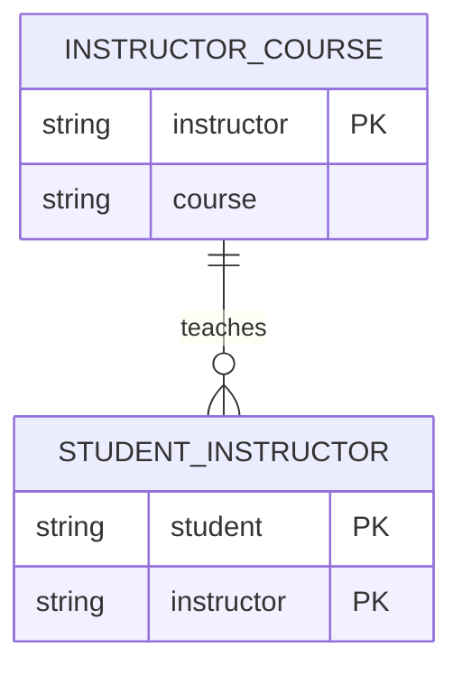

# 07- BCNF

## Overview

Boyce-Codd Normal Form (BCNF) is a stricter form of normalization than Third Normal Form (3NF). It addresses schemas where a functional dependency can still create redundancy even though the relation technically satisfies 3NF.

The core rule is:

> For every non-trivial functional dependency `X → Y`, `X` must be a superkey.

In other words, **every determinant must be a candidate key or contain one**.

BCNF matters primarily when a relation has multiple candidate keys or overlapping functional dependencies. Most straightforward application schemas can be designed in 3NF without encountering BCNF-specific problems, but BCNF becomes important when modeling complex business rules.

## Relationship Between 3NF and BCNF

The normal forms can be viewed as progressively stronger constraints:

```text
1NF
 ↓
2NF
 ↓
3NF
 ↓
BCNF
```

Every BCNF relation is in 3NF, but not every 3NF relation is in BCNF.

The important distinction is:

| Normal Form | Key requirement for `X → Y` |
|---|---|
| 2NF | No non-key attribute depends on only part of a composite candidate key |
| 3NF | `X` is a superkey, or `Y` is a prime attribute |
| BCNF | `X` must always be a superkey |

BCNF removes the exception allowed by 3NF for dependencies whose right-hand side is a prime attribute.

## Functional Dependencies

BCNF requires understanding functional dependencies.

Given:

```text
X → Y
```

`X` is called the **determinant** because its value determines `Y`.

For example:

```text
employee_id → employee_name
```

means an `employee_id` uniquely determines an employee's name.

If `employee_id` is a primary key, then `employee_id` is a superkey and the dependency satisfies BCNF.

The problem occurs when a determinant is **not** a superkey.

For example:

```text
instructor → course
```

is problematic if `instructor` does not uniquely identify a row in the relation.

## Candidate Keys and Superkeys

BCNF depends heavily on the distinction between candidate keys and superkeys.

### Superkey

A superkey is any set of attributes that uniquely identifies a row.

If:

```text
student_id
```

uniquely identifies a student, then:

```text
{student_id}
{student_id, student_name}
{student_id, email}
```

can all be superkeys.

### Candidate Key

A candidate key is a **minimal** superkey.

If `student_id` alone uniquely identifies a row:

```text
{student_id}
```

is a candidate key.

A candidate key cannot contain unnecessary attributes.

### BCNF Rule

For every functional dependency:

```text
X → Y
```

BCNF requires:

```text
X is a superkey
```

Therefore, a candidate key satisfies the requirement because every candidate key is a superkey.

## A Canonical BCNF Violation

Consider a university relation:

```text
student_course_instructor
--------------------------------------
student | course | instructor
```

Assume these business rules:

```text
(student, course) → instructor
instructor → course
```

The first dependency means:

> A student taking a particular course has one instructor.

The second means:

> Each instructor teaches only one course.

Suppose the data is:

```text
student | course       | instructor
--------+--------------+-----------
Alice   | Database     | Smith
Bob     | Database     | Smith
Alice   | Networking   | Jones
```

The candidate keys are:

```text
(student, course)
(student, instructor)
```

because:

```text
student + course → instructor
student + instructor → course
```

However:

```text
instructor → course
```

is also a functional dependency.

`instructor` is not a superkey because it does not uniquely identify a complete row.

Therefore:

```text
instructor → course
```

violates BCNF.

## Why This Can Still Satisfy 3NF

This is the important interview-level distinction.

The relation can satisfy 3NF because `course` is a **prime attribute**: it participates in the candidate key `(student, course)`.

The 3NF condition allows:

```text
X → Y
```

when `Y` is a prime attribute, even if `X` is not a superkey.

BCNF does not allow this exception.

Therefore:

```text
3NF:  instructor → course    ✓
BCNF: instructor → course    ✗
```

because `instructor` is not a superkey.

## Decomposing Into BCNF

The violating dependency is:

```text
instructor → course
```

A natural decomposition is:

```text
instructor_course
-----------------
instructor
course
```

and:

```text
student_instructor
------------------
student
instructor
```

The resulting model is:



The dependency:

```text
instructor → course
```

now has `instructor` as the key of `instructor_course`.

The dependency is therefore BCNF-compliant.

## SQL Representation

A relational implementation might look like:

```sql
CREATE TABLE instructor_course (
    instructor_id bigint PRIMARY KEY,
    course_id bigint NOT NULL
);

CREATE TABLE student_instructor (
    student_id bigint NOT NULL,
    instructor_id bigint NOT NULL,

    PRIMARY KEY (student_id, instructor_id),

    FOREIGN KEY (instructor_id)
        REFERENCES instructor_course(instructor_id)
);
```

The important structural change is that the fact:

```text
instructor → course
```

is represented in the relation where `instructor` is the key.

## How to Check BCNF

For a relation to satisfy BCNF, analyze each meaningful functional dependency.

Use this process:

1. Identify all functional dependencies.
2. Identify all candidate keys.
3. For every dependency `X → Y`, determine whether it is trivial.
4. If it is non-trivial, determine whether `X` is a superkey.
5. If any determinant is not a superkey, the relation violates BCNF.
6. Decompose the relation around the violating dependency.

The key question is:

> Does every determinant uniquely identify a row?

If the answer is no, investigate a BCNF violation.

## Trivial vs Non-Trivial Dependencies

A dependency is trivial when the attributes on the right-hand side are already contained in the determinant.

For example:

```text
(student_id, course_id) → course_id
```

is trivial.

BCNF does not require the determinant of a trivial dependency to be a superkey.

The interesting cases are non-trivial dependencies such as:

```text
instructor_id → course_id
```

where `course_id` is not already part of the determinant.

## BCNF vs 3NF

| Property | 3NF | BCNF |
|---|---:|---:|
| Stronger than 2NF | Yes | Yes |
| Every determinant must be a superkey | No | Yes |
| Allows prime-attribute exception | Yes | No |
| Every BCNF relation is 3NF | — | Yes |
| Every 3NF relation is BCNF | No | — |
| Can preserve all functional dependencies after decomposition | Generally possible | Not always |
| Main goal | Reduce dependency anomalies while preserving dependencies | Remove all non-key determinants |

The last two rows are particularly important for database design.

## Dependency Preservation

A decomposition is **dependency preserving** when the original functional dependencies can be enforced by constraints on the decomposed relations without requiring joins.

BCNF decomposition can sacrifice dependency preservation.

This creates a real engineering trade-off:

```text
Higher normalization
        ↓
Less redundancy
        ↓
Potentially more relations
        ↓
Potentially harder dependency enforcement
```

3NF is often preferred when preserving functional dependencies is more important than achieving the strongest possible normal form.

## Lossless Decomposition

A good decomposition must also be **lossless**.

A lossless decomposition allows the original relation to be reconstructed without introducing incorrect combinations of data.

For the example:

```text
R(student, course, instructor)
```

decomposed into:

```text
R1(instructor, course)
R2(student, instructor)
```

the shared attribute:

```text
instructor
```

connects the relations.

The decomposition should preserve the valid relationships without generating spurious rows.

A normalization exercise that produces BCNF but loses information is not a successful schema design.

## Production Perspective

BCNF is primarily a **logical data-modeling tool**.

In a production backend, the workflow is usually:

```text
Business rules
    ↓
Functional dependencies
    ↓
Candidate keys
    ↓
Normalized logical model
    ↓
Physical schema
    ↓
Indexes + constraints
    ↓
Query workload optimization
```

Do not begin by mechanically decomposing every table until it reaches BCNF.

Start with the business rules.

For example, if a system says:

> An instructor can teach only one course.

that is a domain rule.

If that rule is genuinely invariant, it should influence the database design.

If the business later changes to:

> An instructor can teach multiple courses.

then the functional dependency:

```text
instructor → course
```

is no longer valid.

The correct normal form depends on the actual business semantics.

## BCNF in Backend Systems

In Django or SQLAlchemy-based applications, BCNF is not something the ORM automatically guarantees.

The ORM can generate:

- Primary keys.
- Foreign keys.
- Unique constraints.
- Check constraints.
- Indexes.

But determining whether a model is in BCNF requires understanding the underlying business functional dependencies.

For example, this Django model:

```python
class InstructorCourse(models.Model):
    instructor = models.OneToOneField(
        "Instructor",
        on_delete=models.PROTECT,
        primary_key=True,
    )
    course = models.ForeignKey(
        "Course",
        on_delete=models.PROTECT,
    )
```

implicitly represents:

```text
instructor → course
```

The `OneToOneField` communicates that an instructor can have only one associated course.

The important point is that the **constraint expresses the business dependency**; the ORM is only the mechanism used to declare it.

## Constraints and BCNF

Normalization and constraints solve related but different problems.

| Concern | Mechanism |
|---|---|
| Identify entity | Primary key |
| Enforce relationship | Foreign key |
| Enforce uniqueness | `UNIQUE` |
| Enforce domain condition | `CHECK` |
| Supply missing value | `DEFAULT` |
| Represent functional dependency | Keys and uniqueness constraints |
| Achieve BCNF | Correct relation decomposition |

For example:

```sql
CREATE TABLE instructor_course (
    instructor_id bigint PRIMARY KEY,
    course_id bigint NOT NULL,

    CONSTRAINT instructor_course_unique
        UNIQUE (instructor_id)
);
```

The primary key already makes `instructor_id` unique, so the explicit `UNIQUE` constraint would be redundant.

A clean production schema should avoid unnecessary duplicate constraints.

## Performance Considerations

BCNF can increase the number of relations.

That may result in:

- More joins.
- More complex queries.
- More complex ORM loading.
- More indexes.
- More difficult reporting queries.

However, decomposition can also reduce:

- Duplicate storage.
- Update volume.
- Write amplification.
- Inconsistency risk.

Therefore, performance should be evaluated using the actual workload.

For PostgreSQL:

```sql
EXPLAIN (ANALYZE, BUFFERS)
SELECT
    si.student_id,
    ic.course_id
FROM student_instructor AS si
JOIN instructor_course AS ic
    ON ic.instructor_id = si.instructor_id
WHERE si.student_id = $1;
```

The correct response to an expensive join is not automatically denormalization.

First evaluate:

- Indexes.
- Join cardinality.
- Query predicates.
- Table size.
- Statistics.
- Query plan.
- Access patterns.

## BCNF and Indexing

Normalization does not remove the need for indexes.

For the example:

```sql
CREATE INDEX student_instructor_instructor_id_idx
ON student_instructor (instructor_id);
```

This can support queries that start from an instructor and find associated students.

The primary key:

```sql
PRIMARY KEY (student_id, instructor_id)
```

already provides an index optimized for lookups beginning with `student_id`.

It does not necessarily provide an efficient index for:

```sql
WHERE instructor_id = $1
```

because `instructor_id` is the second column of the composite index.

Index design should therefore follow query patterns.

## BCNF and Distributed Systems

BCNF is most directly applicable within a single relational database.

In a microservice architecture:

```text
Student Service
    students

Teaching Service
    instructors
    courses
```

cross-service functional dependencies cannot normally be enforced with a foreign key.

The architectural boundary becomes important:

```text
Database constraint
        ↓
Works within database ownership boundary

Service contract / workflow
        ↓
Works across service boundaries
```

Do not attempt to force BCNF across independent databases by creating synchronous distributed joins or tightly coupled write paths.

Instead:

- Define ownership clearly.
- Keep local invariants in the owning database.
- Use APIs or events for cross-service coordination.
- Treat distributed consistency as an architectural concern.

## Advantages

BCNF provides strong structural guarantees.

### Reduced Redundancy

Facts are stored closer to the determinants that define them.

### Fewer Update Anomalies

Changing a fact generally requires fewer rows to be modified.

### Stronger Integrity

Every non-trivial determinant corresponds to a superkey.

### Clearer Domain Modeling

BCNF decomposition can expose hidden business relationships that were previously buried inside a large relation.

## Limitations

BCNF is not universally optimal.

### More Tables

Decomposition can increase schema complexity.

### More Joins

Queries may need to combine multiple relations.

### Dependency Preservation Trade-Off

Some BCNF decompositions may make certain functional dependencies harder to enforce directly.

### Modeling Complexity

Identifying all functional dependencies requires domain knowledge.

### Physical Performance Is Separate

A logically elegant BCNF schema can still perform poorly because of bad indexes or query patterns.

## Common Mistakes

### Thinking 3NF and BCNF Are Identical

They are not.

3NF allows a dependency where the determinant is not a superkey if the dependent attribute is prime.

BCNF does not.

### Assuming Every Table Should Be BCNF

BCNF is a logical design target, not a production checkbox.

Use it when the underlying functional dependencies justify the decomposition.

### Ignoring Candidate Keys

BCNF cannot be evaluated correctly without identifying candidate keys.

A table's primary key alone may not reveal all candidate keys.

### Treating a Surrogate Key as the Only Dependency

Adding:

```sql
id bigint PRIMARY KEY
```

does not eliminate other business dependencies.

For example:

```text
instructor_id → course_id
```

may still exist.

### Ignoring Business Rules

Functional dependencies come from domain rules.

Do not infer them merely from data that happens to look unique today.

### Denormalizing Without Measuring

A join is not automatically a performance problem.

Use `EXPLAIN (ANALYZE, BUFFERS)` and production-like workloads before introducing redundant data.

## Production Pitfalls

### Data That Is Accidentally Unique

Suppose current data contains:

```text
instructor | course
-----------+---------
Smith      | Database
Jones      | Networking
```

This does not prove:

```text
instructor → course
```

The dependency must be guaranteed by the domain.

### Changing Business Rules

If an instructor later teaches multiple courses, a schema built around:

```text
instructor → course
```

may become invalid.

Schema constraints should reflect durable business invariants.

### Over-Normalized Reporting Models

Transactional schemas benefit from normalization, while analytics workloads often favor dimensional or denormalized structures.

Do not assume the transactional schema should also be the reporting schema.

### Large Production Migrations

Decomposing an existing table can involve:

- Backfilling new relations.
- Creating indexes.
- Adding foreign keys.
- Dual writes during migration.
- Validating consistency.
- Removing old columns.

For large PostgreSQL tables, migration design must account for locks, replication lag, I/O, and application traffic.

## Interview Traps

| Question | Strong answer |
|---|---|
| What is BCNF? | A relation is in BCNF if every non-trivial functional dependency has a determinant that is a superkey. |
| Is BCNF stronger than 3NF? | Yes. Every BCNF relation is in 3NF, but some 3NF relations are not in BCNF. |
| Why can 3NF allow a dependency that BCNF rejects? | 3NF permits the right-hand side to be a prime attribute when the determinant is not a superkey. BCNF has no such exception. |
| What is the key test for BCNF? | For every non-trivial dependency `X → Y`, verify that `X` is a superkey. |
| Can a relation be in 3NF but not BCNF? | Yes. This happens when a non-superkey determinant determines a prime attribute. |
| Why not always use BCNF? | BCNF can increase decomposition and joins and may sacrifice dependency preservation. |
| What is dependency preservation? | The ability to enforce the original functional dependencies using constraints on the decomposed relations without requiring joins. |
| What is lossless decomposition? | A decomposition from which the original relation can be reconstructed without spurious tuples. |
| Does a surrogate key guarantee BCNF? | No. Business functional dependencies can still violate BCNF. |
| Is BCNF a performance optimization? | No. It is a logical normalization property. Performance depends on physical design and workload. |

## Key Takeaways

- **BCNF requires every determinant in every non-trivial functional dependency to be a superkey.**
- **BCNF is stricter than 3NF; a relation can satisfy 3NF while still violating BCNF.**
- **Candidate keys and functional dependencies must be identified before BCNF can be evaluated correctly.**
- **BCNF decomposition can reduce redundancy but may increase joins and sacrifice dependency preservation.**
- **Use BCNF as a logical modeling tool, then validate the resulting design against business rules, query workload, constraints, and operational requirements.**