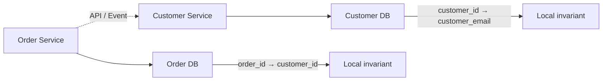

# 08- Functional Dependencies

## Overview

A **functional dependency (FD)** describes a relationship between attributes in a relational schema where the value of one attribute set determines the value of another.

The notation is:

```text
X → Y
```

It means:

> For any two rows in a relation, if their values for `X` are equal, their values for `Y` must also be equal.

Functional dependencies are the foundation for:

- Identifying candidate keys.
- Understanding redundancy.
- Designing normalized schemas.
- Detecting update, insert, and delete anomalies.
- Reasoning about 2NF, 3NF, and BCNF.
- Determining whether a database constraint represents a real business rule.

Functional dependencies are primarily **logical data-modeling rules**. They are not automatically visible from the current data and should be derived from domain semantics and enforced with database constraints where appropriate.

## Basic Notation

For a relation:

```text
R(A, B, C)
```

a dependency:

```text
A → B
```

means that `A` determines `B`.

Consider:

```text
employee_id | employee_name | department_id
------------+---------------+--------------
101         | Alice         | 10
102         | Bob           | 20
103         | Carol         | 10
```

If `employee_id` uniquely identifies an employee:

```text
employee_id → employee_name
employee_id → department_id
```

Both dependencies hold.

However:

```text
department_id → employee_name
```

does not hold because multiple employees can belong to the same department.

## Why Functional Dependencies Matter

Functional dependencies tell you which facts belong together.

Without understanding them, a schema can appear reasonable while storing the same fact repeatedly.

For example:

```text
employee_id | employee_name | department_id | department_name
------------+---------------+---------------+---------------
101         | Alice         | 10            | Engineering
102         | Bob           | 10            | Engineering
103         | Carol         | 10            | Engineering
```

The business rule may be:

```text
department_id → department_name
```

The department name is therefore repeated for every employee in the department.

If the department is renamed, multiple rows must be updated.

A normalized design separates the dependencies:

```text
employee
--------
employee_id
employee_name
department_id

department
----------
department_id
department_name
```

Now:

```text
employee_id → employee_name
employee_id → department_id
department_id → department_name
```

The database structure follows the functional dependencies.

## Determinants and Dependents

For:

```text
X → Y
```

`X` is the **determinant** and `Y` is the **dependent**.

Example:

```text
customer_id → email
```

Here:

- `customer_id` is the determinant.
- `email` is the dependent.

The dependency says that one customer ID maps to one email address under the modeled business rules.

The determinant does not necessarily have to be a primary key.

For example:

```text
email → customer_id
```

could also hold if email addresses are required to be unique.

That means `email` may be a candidate key.

## Functional Dependency vs Correlation

A functional dependency is a **guaranteed rule**, not a pattern observed in a dataset.

Suppose today's data contains:

```text
country | currency
--------+---------
India   | INR
Japan   | JPY
USA     | USD
```

You might infer:

```text
country → currency
```

But this is only valid if the domain guarantees it.

Historical currencies, multiple currencies, or other business rules could invalidate the assumption.

Similarly, this data:

```text
employee_id | phone
------------+------------
101         | 555-1000
102         | 555-2000
```

does not prove:

```text
phone → employee_id
```

You need a business rule or database uniqueness guarantee establishing that phone numbers are unique.

## Types of Functional Dependencies

### Trivial Functional Dependency

A dependency is trivial when the attributes on the right-hand side are already contained in the left-hand side.

Example:

```text
(employee_id, email) → email
```

The dependent attribute `email` is already part of the determinant.

Trivial dependencies do not impose meaningful uniqueness requirements.

### Non-Trivial Functional Dependency

A dependency is non-trivial when the right-hand side contains an attribute not present in the determinant.

Example:

```text
employee_id → email
```

assuming `email` is not part of `employee_id`.

These dependencies are important for normalization and BCNF analysis.

### Completely Non-Trivial Dependency

A dependency is completely non-trivial when the determinant and dependent attribute sets have no attributes in common.

Example:

```text
employee_id → department_name
```

assuming the attributes are disjoint.

This distinction is mainly useful in theoretical normalization analysis.

## Single-Attribute and Composite Determinants

The determinant can contain multiple attributes.

For example:

```text
(student_id, course_id) → grade
```

means that a student's grade is determined by the combination of the student and course.

Neither attribute may determine the grade independently:

```text
student_id → grade       -- does not hold
course_id → grade        -- does not hold
```

but:

```text
(student_id, course_id) → grade
```

does hold.

Composite determinants are particularly important for understanding 2NF.

## Candidate Keys and Functional Dependencies

Functional dependencies are used to determine candidate keys.

Consider:

```text
orders(
    order_id,
    customer_id,
    order_date,
    customer_email
)
```

Suppose:

```text
order_id → customer_id
order_id → order_date
customer_id → customer_email
```

From these dependencies:

```text
order_id → customer_email
```

can be derived through transitivity.

If:

```text
order_id → customer_id
customer_id → customer_email
```

then:

```text
order_id → customer_email
```

This is important because candidate-key analysis requires understanding what attributes can determine all attributes in a relation.

## Attribute Closure

The **closure** of an attribute set `X`, written:

```text
X+
```

is the set of all attributes functionally determined by `X` using a given set of functional dependencies.

Attribute closure is commonly used to determine whether a set of attributes is a superkey.

Consider:

```text
R(A, B, C, D)
```

with:

```text
A → B
B → C
AC → D
```

Start with:

```text
A+ = {A}
```

Apply:

```text
A → B
```

giving:

```text
A+ = {A, B}
```

Then:

```text
B → C
```

gives:

```text
A+ = {A, B, C}
```

Now:

```text
AC → D
```

can be applied because `A` and `C` are both in the closure:

```text
A+ = {A, B, C, D}
```

Because `A+` contains every attribute in `R`, `A` is a superkey.

## Practical Closure Algorithm

For a determinant `X`:

1. Initialize `X+` with all attributes in `X`.
2. Find an FD whose left-hand side is contained in `X+`.
3. Add its right-hand-side attributes to `X+`.
4. Repeat until no new attributes can be added.
5. If `X+` contains every attribute in the relation, `X` is a superkey.
6. If no proper subset of `X` is also a superkey, `X` is a candidate key.

This reasoning is central to database normalization interviews.

## Armstrong's Axioms

Functional dependencies can be derived using **Armstrong's axioms**.

The three fundamental inference rules are:

| Rule | Meaning |
|---|---|
| Reflexivity | If `Y ⊆ X`, then `X → Y` |
| Augmentation | If `X → Y`, then `XZ → YZ` |
| Transitivity | If `X → Y` and `Y → Z`, then `X → Z` |

These rules are sound and complete for reasoning about functional dependencies.

### Reflexivity

If:

```text
(A, B) → A
```

the dependency is automatically true because `A` is already part of the determinant.

### Augmentation

If:

```text
A → B
```

then adding the same attributes to both sides gives:

```text
AC → BC
```

### Transitivity

If:

```text
A → B
B → C
```

then:

```text
A → C
```

Transitivity is especially important when identifying indirect dependencies that can lead to normalization problems.

## Derived Inference Rules

Armstrong's axioms can produce useful derived rules.

### Union

If:

```text
A → B
A → C
```

then:

```text
A → BC
```

### Decomposition

If:

```text
A → BC
```

then:

```text
A → B
A → C
```

### Pseudotransitivity

If:

```text
A → B
BC → D
```

then:

```text
AC → D
```

These rules help reason about larger dependency sets without manually comparing every possible row.

## Transitive Dependencies

A transitive dependency occurs when:

```text
A → B
B → C
```

therefore:

```text
A → C
```

For example:

```text
employee_id → department_id
department_id → department_name
```

therefore:

```text
employee_id → department_name
```

The dependency is indirect.

This pattern is important in 3NF because non-key attributes should not depend transitively on a candidate key through another non-key attribute.

## Partial Dependencies

A partial dependency occurs when a non-key attribute depends on only part of a composite candidate key.

Suppose:

```text
enrollment(student_id, course_id, student_name, grade)
```

with:

```text
(student_id, course_id) → grade
student_id → student_name
```

The candidate key is:

```text
(student_id, course_id)
```

but:

```text
student_id → student_name
```

uses only part of the candidate key.

This is a partial dependency and violates 2NF.

The usual decomposition is:

```text
student(student_id, student_name)

enrollment(student_id, course_id, grade)
```

## Functional Dependencies and Normal Forms

Functional dependencies provide the reasoning behind normalization.

| Normal Form | Dependency concern |
|---|---|
| 1NF | Atomic attribute values and no repeating groups |
| 2NF | Eliminates partial dependencies on composite candidate keys |
| 3NF | Eliminates problematic transitive dependencies |
| BCNF | Every non-trivial determinant must be a superkey |

The progression is:

```text
Functional Dependencies
          ↓
Candidate Keys
          ↓
Partial / Transitive Dependencies
          ↓
2NF / 3NF
          ↓
BCNF
```

## Functional Dependencies and Database Constraints

A functional dependency often maps directly to a database uniqueness constraint.

Suppose:

```text
email → user_id
```

is a business rule.

A PostgreSQL implementation might be:

```sql
CREATE TABLE users (
    user_id bigint GENERATED ALWAYS AS IDENTITY PRIMARY KEY,
    email text NOT NULL,

    CONSTRAINT users_email_unique UNIQUE (email)
);
```

The `UNIQUE` constraint enforces the required uniqueness at the database boundary.

Without it, application code such as:

```python
if not User.objects.filter(email=email).exists():
    User.objects.create(email=email)
```

is vulnerable to concurrent requests.

Two transactions can both observe that the email does not exist and then attempt to insert it.

The database constraint provides the authoritative enforcement point.

## Functional Dependencies and NULL

NULL complicates reasoning about functional dependencies.

Consider:

```text
user_id → phone_number
```

A user may have no phone number:

```text
user_id | phone_number
--------+------------
101     | NULL
102     | NULL
```

The functional dependency can still conceptually hold because the same `user_id` determines the user's phone value, including the possibility that the value is unknown or absent.

However, SQL uniqueness semantics around `NULL` are DBMS-specific.

For example, PostgreSQL's normal `UNIQUE` constraint permits multiple `NULL` values.

Therefore:

```sql
UNIQUE (phone_number)
```

does not necessarily mean:

> Every user must have a distinct phone number.

It means non-null values must satisfy the uniqueness rule, subject to the database's NULL semantics.

If the business rule is conditional, model it explicitly.

## Functional Dependencies in Production Schema Design

A senior engineer should translate domain rules into explicit dependencies before choosing constraints.

Example:

```text
Business rule:
Each account has exactly one primary email.

Dependency:
account_id → primary_email

Database representation:
account_id is the key
```

Another rule:

```text
Business rule:
An email address can belong to at most one account.

Dependency:
email → account_id

Database representation:
UNIQUE(email)
```

These are different dependencies and can require different constraints.

A single table may legitimately contain both:

```text
account_id → email
email → account_id
```

When both hold, both attributes identify the same entity and may each form a candidate key.

## Functional Dependencies in ORMs

ORM declarations should represent, not replace, the underlying dependency model.

For example, Django:

```python
class User(models.Model):
    email = models.EmailField(unique=True)
```

communicates:

```text
email → user
```

through a database uniqueness constraint.

For more complex conditions, use explicit database constraints:

```python
from django.db import models


class Subscription(models.Model):
    account_id = models.BigIntegerField()
    plan_id = models.BigIntegerField()
    active = models.BooleanField(default=True)

    class Meta:
        constraints = [
            models.UniqueConstraint(
                fields=["account_id"],
                condition=models.Q(active=True),
                name="one_active_subscription_per_account",
            ),
        ]
```

This represents a conditional uniqueness rule rather than an unrestricted functional dependency.

The exact behavior depends on the database backend and ORM support, so production constraints should be verified against the actual database engine.

## Functional Dependencies Across Services

Functional dependencies are easiest to enforce within one relational database.

In a microservice architecture:

```text
Order Service DB
    order_id → customer_id

Customer Service DB
    customer_id → customer_email
```

The second dependency belongs to another database boundary.

A foreign key cannot normally enforce a relationship across independent service databases.

The architecture therefore becomes:



Cross-service invariants must instead be handled through:

- Service APIs.
- Events.
- Idempotent workflows.
- Application-level coordination.
- Reconciliation processes where appropriate.

Do not assume a database-level functional dependency exists across independently owned databases.

## Functional Dependencies and Denormalization

Functional dependencies remain useful even when deliberately denormalizing.

Suppose:

```text
customer_id → customer_name
```

and an order table duplicates:

```text
customer_id
customer_name
```

The duplicate `customer_name` is intentional denormalization.

The dependency has not disappeared.

The engineering question becomes:

> How will the system maintain consistency when `customer_name` changes?

Possible strategies include:

- Treating the duplicated value as a historical snapshot.
- Updating the derived copy synchronously.
- Publishing an event and updating asynchronously.
- Recomputing the value when needed.
- Accepting bounded staleness.

Denormalization should therefore be an explicit consistency decision, not an accidental consequence of poor modeling.

## Production Considerations

### Derive Dependencies From Business Rules

Do not infer a functional dependency solely from current data.

Ask:

- Is the relationship guaranteed?
- Is it enforced?
- Can the business rule change?
- Is the dependency global or conditional?
- Is it scoped by tenant, organization, region, or status?

### Enforce Important Dependencies

If a functional dependency represents a critical invariant, enforce it as close to the data as practical.

Typical mechanisms include:

- `PRIMARY KEY`
- `UNIQUE`
- `FOREIGN KEY`
- `CHECK`
- Exclusion constraints where supported
- Application logic for invariants that cannot be expressed relationally

### Consider Concurrency

Application-only validation is vulnerable to race conditions.

Prefer:

```text
Application validation
        +
Database constraint
        ↓
Defense in depth
```

The application can provide good error messages and early feedback, while the database remains authoritative.

### Consider Scope

A dependency may be scoped.

For example:

```text
(tenant_id, email) → user_id
```

may be valid while:

```text
email → user_id
```

is not.

This is common in multi-tenant systems where identifiers only need to be unique within a tenant.

### Consider Time

A dependency can change depending on whether the schema models current state or historical state.

For example:

```text
product_id → product_name
```

may hold for the current product catalog but should not necessarily be used to determine the product name on an historical invoice.

An invoice may intentionally store:

```text
product_name_at_purchase
```

because the historical value is part of the transaction record.

## Common Mistakes

### Confusing Uniqueness With Functional Dependency

If `email` is unique:

```text
email → user_id
```

may hold.

But uniqueness must reflect an actual business rule, not merely today's dataset.

### Assuming Primary Keys Are the Only Determinants

A relation can have multiple candidate keys.

For example:

```text
user_id → email
email → user_id
```

if both are unique.

BCNF analysis must consider all relevant determinants.

### Ignoring Composite Determinants

Some dependencies require combinations:

```text
(order_id, product_id) → quantity
```

Neither `order_id` nor `product_id` alone determines quantity.

### Treating Sample Data as Proof

A dependency is not established because no conflicting rows currently exist.

The domain rule must guarantee the relationship.

### Confusing Functional Dependency With Foreign Key Dependency

A foreign key says:

> A value must reference a valid value in another relation.

A functional dependency says:

> One attribute set determines another attribute set.

They solve different problems.

### Ignoring Conditional Dependencies

A rule such as:

```text
account_id → active_subscription
```

may only be intended for active subscriptions.

The actual constraint might be:

```text
one active subscription per account
```

which requires conditional uniqueness rather than an unrestricted dependency.

## Interview Traps

| Question | Strong answer |
|---|---|
| What is a functional dependency? | A constraint where an attribute set `X` determines another attribute set `Y`, written `X → Y`. |
| What is the determinant? | The left-hand side of a functional dependency. |
| What is a trivial FD? | An FD where the right-hand-side attributes are already contained in the determinant. |
| What is attribute closure? | The set of attributes functionally determined by a given attribute set under a dependency set. |
| How do you determine whether `X` is a superkey? | Compute `X+`; if it contains every attribute in the relation, `X` is a superkey. |
| What is a candidate key? | A minimal superkey. |
| What is a partial dependency? | A non-key attribute depends on only part of a composite candidate key. |
| What is a transitive dependency? | An indirect dependency such as `A → B` and `B → C`, which implies `A → C`. |
| What is the relationship between FDs and normalization? | Functional dependencies provide the logical basis for identifying keys and normalization violations. |
| Does current data prove a functional dependency? | No. An FD must represent a guaranteed business or schema rule, not merely an observed pattern. |
| How can an FD be enforced in SQL? | Often through primary keys or unique constraints, depending on the dependency. |
| Can an FD exist without a primary key? | Yes. A unique candidate key or other determinant can establish an FD. |
| Are FDs and foreign keys the same? | No. FDs describe determination; foreign keys enforce referential integrity. |
| Why do FDs matter for BCNF? | BCNF requires every non-trivial FD's determinant to be a superkey. |

## Key Takeaways

- **A functional dependency `X → Y` means that `X` uniquely determines the value of `Y` under the domain rules.**
- **Functional dependencies are the foundation for identifying candidate keys and reasoning about 2NF, 3NF, and BCNF.**
- **Attribute closure is the practical technique for determining whether an attribute set is a superkey.**
- **Do not infer functional dependencies merely from current data; derive them from durable business rules and enforce important invariants with database constraints.**
- **Functional dependencies remain relevant in denormalized and distributed systems because they describe consistency rules even when enforcement moves beyond a single relational table.**