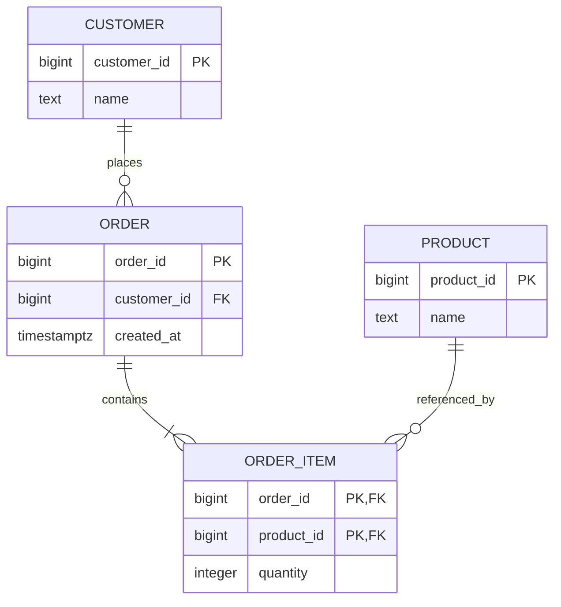
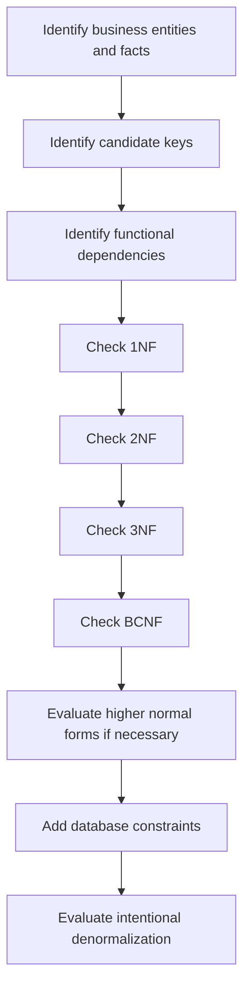
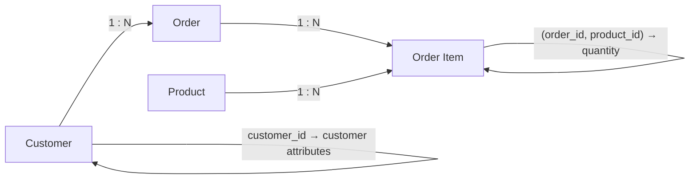

# 09- Normalization Rules

## Overview

**Normalization** is a systematic approach to structuring relational data so that each fact is stored in an appropriate place and dependencies between attributes are represented correctly.

The core objective is not to minimize the number of tables. It is to create a schema that:

- Represents business rules accurately.
- Minimizes unnecessary redundancy.
- Prevents insert, update, and delete anomalies.
- Makes data ownership explicit.
- Preserves data integrity.
- Provides predictable behavior as the system evolves.

Normalization is based primarily on **functional dependencies**, candidate keys, and relational decomposition.

The commonly discussed normal forms are:

```text
1NF → 2NF → 3NF → BCNF → 4NF → 5NF
```

For most transactional backend systems, **3NF and BCNF** cover the majority of practical normalization decisions. Higher normal forms address more specialized dependency problems.

Normalization is also not an absolute production rule. A senior engineer may deliberately denormalize for performance, reporting, historical snapshots, or operational simplicity. The important distinction is that denormalization should be **intentional and backed by a consistency strategy**.

## Why Normalization Exists

Poorly structured relational tables tend to store multiple independent facts together.

For example:

```text
order_id | customer_id | customer_name | product_id | product_name | quantity
---------+-------------+---------------+------------+--------------+---------
1001     | 42          | Alice         | 501        | Keyboard     | 2
1001     | 42          | Alice         | 502        | Mouse        | 1
1002     | 42          | Alice         | 503        | Monitor      | 1
```

This table contains facts about:

- Orders.
- Customers.
- Products.
- Order items.

The same customer information is repeated across orders, and product information is repeated across order items.

This creates anomalies.

### Update Anomaly

Changing a customer's name may require updating multiple rows.

If one row is missed, the database contains contradictory customer data.

### Insert Anomaly

If customer information is stored only alongside orders, creating a customer without an order becomes awkward or impossible without introducing NULLs or placeholder data.

### Delete Anomaly

Deleting a customer's final order could accidentally remove the only stored record of that customer.

Normalization separates these independent facts:



## Normalization and Functional Dependencies

Functional dependencies describe how attributes determine other attributes.

For example:

```text
customer_id → customer_name
product_id → product_name
order_id → customer_id
(order_id, product_id) → quantity
```

These dependencies reveal the ownership of facts.

If:

```text
customer_id → customer_name
```

then `customer_name` belongs with the customer identified by `customer_id`, not repeatedly in every order row.

If:

```text
(order_id, product_id) → quantity
```

then `quantity` belongs to the relationship between an order and a product.

Normalization uses these dependencies to decide where attributes should live.

## Normalization Workflow

A practical normalization process is:



In production schema design, normalization should be performed alongside:

- Access-pattern analysis.
- Transaction boundaries.
- Constraint design.
- Index design.
- Expected data volume.
- Availability requirements.
- Reporting requirements.

## First Normal Form

**First Normal Form (1NF)** requires a relation to represent rows and attributes in a relationally appropriate structure, including atomic attribute values and no repeating groups within a column.

A problematic design might store:

```text
order_id | product_ids
---------+----------------
1001     | 501,502,503
```

The `product_ids` column contains multiple logical values.

A normalized design uses a separate relationship:

```text
order_items
-----------
order_id
product_id
```

For example:

```text
order_id | product_id
---------+----------
1001     | 501
1001     | 502
1001     | 503
```

### Why 1NF Matters

Atomic values make relational operations predictable.

Instead of parsing:

```text
501,502,503
```

the database can efficiently perform:

```sql
SELECT product_id
FROM order_items
WHERE order_id = 1001;
```

and enforce relationships with foreign keys.

### Production Considerations

Do not interpret 1NF as:

> Every column must contain a primitive scalar and JSON is always wrong.

Modern relational databases such as PostgreSQL support JSON and arrays for legitimate use cases.

The relevant question is whether the data represents:

- A genuinely atomic value for the application domain.
- Or multiple relational entities that should be independently queried and constrained.

Storing an array of product IDs instead of an `order_items` table is usually problematic because it makes referential integrity, indexing, querying, and transactional updates harder.

## Second Normal Form

**Second Normal Form (2NF)** requires:

1. The relation is in 1NF.
2. Every non-key attribute depends on the **whole candidate key**, not merely part of a composite candidate key.

2NF matters primarily when candidate keys are composite.

Consider:

```text
enrollment(
    student_id,
    course_id,
    student_name,
    course_name,
    grade
)
```

with:

```text
(student_id, course_id) → grade
student_id → student_name
course_id → course_name
```

The candidate key is:

```text
(student_id, course_id)
```

But:

```text
student_id → student_name
```

depends only on part of the key.

Likewise:

```text
course_id → course_name
```

depends only on part of the key.

The relation therefore violates 2NF.

A normalized design is:

```text
student
-------
student_id
student_name

course
------
course_id
course_name

enrollment
----------
student_id
course_id
grade
```

### Why 2NF Matters

Without 2NF, independent facts become duplicated across rows.

If a course name changes, every enrollment row for that course may require modification.

Separating the dependencies gives each fact a clear owner.

### Important Qualification

If a relation has only single-attribute candidate keys, it is automatically in 2NF once it satisfies 1NF because no proper subset of a single attribute key exists.

This is a common interview point.

## Third Normal Form

**Third Normal Form (3NF)** eliminates problematic transitive dependencies of non-key attributes on candidate keys.

Consider:

```text
employee(
    employee_id,
    department_id,
    department_name
)
```

with:

```text
employee_id → department_id
department_id → department_name
```

Therefore:

```text
employee_id → department_name
```

through a transitive dependency.

The department name is determined by `department_id`, not directly by the employee.

A normalized design is:

```text
employee
--------
employee_id
department_id

department
----------
department_id
department_name
```

### Formal 3NF Rule

A relation is in 3NF if for every non-trivial functional dependency:

```text
X → A
```

at least one of the following is true:

- `X` is a superkey.
- `A` is a prime attribute, meaning it belongs to at least one candidate key.

This formal definition is more precise than simply saying:

> No transitive dependencies.

The simplified explanation is useful for learning, but the formal rule matters when analyzing schemas with multiple candidate keys.

## Boyce-Codd Normal Form

**BCNF** is stricter than 3NF.

A relation is in BCNF if for every non-trivial functional dependency:

```text
X → Y
```

`X` is a superkey.

Therefore:

```text
Every determinant must be a superkey.
```

BCNF addresses dependency structures that can satisfy 3NF while still having problematic redundancy.

A useful comparison is:

| Normal Form | Main Requirement |
|---|---|
| 1NF | Atomic relational values; no repeating groups |
| 2NF | No partial dependency on a composite candidate key |
| 3NF | Every non-trivial FD has a superkey determinant or prime dependent |
| BCNF | Every non-trivial FD has a superkey determinant |
| 4NF | Addresses problematic multivalued dependencies |
| 5NF | Addresses problematic join dependencies |

## Fourth Normal Form

**Fourth Normal Form (4NF)** addresses **multivalued dependencies**.

Consider:

```text
employee_skill_language
-----------------------
employee_id
skill
language
```

Suppose an employee can independently have:

- Multiple skills.
- Multiple languages.

If skills and languages are independent, storing their combinations creates unnecessary multiplication.

For example:

```text
employee_id | skill    | language
------------+----------+---------
101         | Python   | English
101         | Python   | Bengali
101         | SQL      | English
101         | SQL      | Bengali
```

The combinations may not represent separate facts.

Instead:

```text
employee_skill
-------------
employee_id
skill

employee_language
-----------------
employee_id
language
```

4NF is more specialized than 3NF and BCNF and is less frequently discussed in everyday backend schema design.

## Fifth Normal Form

**Fifth Normal Form (5NF)**, also called **Project-Join Normal Form**, addresses certain complex **join dependencies**.

The concern is whether a relation contains information that can be losslessly decomposed into smaller relations and reconstructed through joins without introducing invalid combinations.

5NF is uncommon in typical CRUD-oriented backend systems but can matter in highly relational domains involving complex many-to-many business rules.

A practical engineer should understand its purpose without automatically decomposing every schema to 5NF.

## Lossless Decomposition

Normalization should not destroy information.

A decomposition is **lossless** when joining the decomposed relations can reconstruct the original relation without generating incorrect rows or losing information.

Consider:

```text
employee(employee_id, department_id, department_name)
```

with:

```text
department_id → department_name
```

Decompose into:

```text
employee(employee_id, department_id)
department(department_id, department_name)
```

Joining on:

```sql
employee.department_id = department.department_id
```

reconstructs the original information.

A good decomposition should therefore be evaluated for:

- Lossless join.
- Dependency preservation.
- Correct candidate keys.
- Enforceability of business rules.

## Dependency Preservation

A decomposition is **dependency-preserving** when the original functional dependencies can be enforced using the decomposed relations without requiring expensive joins or cross-table reasoning.

For example:

```text
department_id → department_name
```

can be enforced directly inside:

```text
department(department_id, department_name)
```

This is preferable to requiring application code to reconstruct and validate the dependency across unrelated tables.

### Why Dependency Preservation Matters

A mathematically valid decomposition may still be operationally inconvenient if enforcing an important business rule requires complex queries or application coordination.

For production schemas, prefer designs where critical invariants map naturally to:

- Primary keys.
- Unique constraints.
- Foreign keys.
- Check constraints.
- Appropriate indexes.

## Normalization vs Denormalization

Normalization and denormalization solve different problems.

| Concern | Normalization | Denormalization |
|---|---|---|
| Data redundancy | Minimizes | Intentionally increases |
| Consistency | Easier to maintain | Requires explicit strategy |
| Writes | Usually simpler | May require multiple updates |
| Reads | May require joins | Can reduce joins |
| Storage | Usually lower | Usually higher |
| Reporting | May require more joins | Can simplify reads |
| Schema complexity | More relations | Fewer or wider relations |
| Typical use | OLTP systems | Read-heavy paths, analytics, projections |

The correct production decision depends on workload.

A normalized PostgreSQL schema might be:

```text
orders
customers
products
order_items
```

A read model might intentionally contain:

```text
order_summary
-------------
order_id
customer_name
total_amount
item_count
last_updated_at
```

The summary table can be maintained through:

- Synchronous writes.
- Background jobs.
- Kafka events.
- Database triggers in selected cases.
- Materialized views.
- Periodic recomputation.

The key is to define the source of truth and acceptable staleness.

## Normalization in OLTP Systems

Normalization is particularly valuable for transactional systems such as:

- Banking.
- Payments.
- Order management.
- Inventory.
- User/account management.
- Subscription systems.

These systems typically prioritize:

- Strong consistency.
- Transactional integrity.
- Correct concurrent updates.
- Explicit ownership of data.

A normalized schema makes it easier to enforce invariants at the database layer.

For example:

```sql
CREATE TABLE departments (
    department_id bigint GENERATED ALWAYS AS IDENTITY PRIMARY KEY,
    name text NOT NULL UNIQUE
);

CREATE TABLE employees (
    employee_id bigint GENERATED ALWAYS AS IDENTITY PRIMARY KEY,
    department_id bigint NOT NULL,
    name text NOT NULL,

    CONSTRAINT employees_department_fk
        FOREIGN KEY (department_id)
        REFERENCES departments (department_id)
);
```

The schema directly represents:

```text
department_id → department.name
employee_id → employee.department_id
```

## Normalization and ORMs

ORMs such as Django do not eliminate the need for relational modeling.

A normalized Django model might be:

```python
from django.db import models


class Department(models.Model):
    name = models.CharField(max_length=200, unique=True)


class Employee(models.Model):
    name = models.CharField(max_length=200)
    department = models.ForeignKey(
        Department,
        on_delete=models.PROTECT,
        related_name="employees",
    )
```

The ORM expresses relationships, but the database remains responsible for enforcing important relational invariants.

Avoid designing models purely around:

```text
"What object structure is easiest to serialize?"
```

Instead ask:

```text
"What facts exist?"
"Which entity owns each fact?"
"What determines each attribute?"
"Which invariants must the database enforce?"
```

## Normalization and Query Performance

Normalization does not inherently mean poor performance.

A normalized design may require joins:

```sql
SELECT
    o.order_id,
    c.name
FROM orders AS o
JOIN customers AS c
    ON c.customer_id = o.customer_id;
```

With appropriate indexes and a capable query planner, joins are often inexpensive relative to the cost of maintaining duplicated data.

However, high-volume workloads can make repeated joins expensive.

Before denormalizing, evaluate:

- Query execution plans.
- Cardinality.
- Index selectivity.
- Join algorithms.
- Buffer/cache behavior.
- Query frequency.
- Read/write ratio.
- Replication architecture.

Use tools such as PostgreSQL:

```sql
EXPLAIN (ANALYZE, BUFFERS)
SELECT
    o.order_id,
    c.name
FROM orders AS o
JOIN customers AS c
    ON c.customer_id = o.customer_id
WHERE o.customer_id = 42;
```

Do not denormalize merely because a query contains a join.

## Normalization and Indexing

Normalization and indexing are separate concerns.

A normalized schema can still perform poorly if frequently queried columns are not indexed.

For example:

```sql
CREATE INDEX orders_customer_id_idx
    ON orders (customer_id);
```

The foreign key relationship provides referential integrity, but indexing the referencing column may still be important for:

- Joins.
- Parent deletion/update checks.
- Customer-specific order queries.

The exact indexing strategy depends on the workload and database engine.

Avoid adding indexes automatically to every column. Indexes improve some reads but increase:

- Storage.
- Write cost.
- Vacuum/maintenance work.
- WAL generation.
- Backup size.

## Normalization and Transactions

Normalization can affect transaction boundaries.

Suppose creating an order requires:

1. Creating an order.
2. Creating multiple order items.
3. Updating inventory.

These operations may span multiple normalized tables but still belong to one business transaction.

In PostgreSQL-backed applications, use a transaction where atomicity is required.

Django example:

```python
from django.db import transaction


@transaction.atomic
def create_order(customer, items):
    order = Order.objects.create(customer=customer)

    for item in items:
        OrderItem.objects.create(
            order=order,
            product_id=item.product_id,
            quantity=item.quantity,
        )

    return order
```

Normalization creates separate relations; it does not imply that each table operation must be committed independently.

## Multi-Tenant Normalization

Multi-tenant systems often introduce tenant-scoped dependencies.

Instead of:

```text
email → user
```

the actual rule may be:

```text
(tenant_id, email) → user
```

This means the same email can exist in different tenants but must be unique within a tenant.

PostgreSQL can represent this with:

```sql
CREATE TABLE users (
    user_id bigint GENERATED ALWAYS AS IDENTITY PRIMARY KEY,
    tenant_id bigint NOT NULL,
    email text NOT NULL,

    CONSTRAINT users_tenant_email_unique
        UNIQUE (tenant_id, email)
);
```

Normalization must therefore consider the **scope of a dependency**, not merely attribute names.

## Temporal and Historical Data

Normalization describes current and logical dependencies, but historical records often require deliberate duplication.

For example, an invoice may store:

```text
product_id
product_name_at_purchase
unit_price_at_purchase
```

Even if:

```text
product_id → current_product_name
```

holds for the product catalog, the invoice intentionally captures historical facts.

Removing the duplicated value could make historical reconstruction dependent on mutable product data.

This is not necessarily a normalization failure. It is often a deliberate **snapshotting decision**.

## Operational Considerations

### Schema Migrations

Normalization changes can require expensive migrations.

Splitting:

```text
orders.customer_name
```

into:

```text
customers.name
orders.customer_id
```

may require:

1. Creating the new table.
2. Backfilling customer records.
3. Adding foreign keys.
4. Updating application writes.
5. Migrating reads.
6. Removing the old column after validation.

For large production tables, avoid assuming that a logically correct normalized schema can be introduced with a single blocking migration.

Use phased migrations when necessary.

### High Availability

Normalized schemas can increase the number of relations involved in a request, but they do not inherently prevent high availability.

HA concerns should focus on:

- Database replication.
- Connection management.
- Failover.
- Query latency.
- Transaction duration.
- Lock contention.
- Read replicas where appropriate.

Do not denormalize solely as an HA strategy.

### Backups and Disaster Recovery

Normalization generally reduces duplicated storage, but disaster recovery is primarily concerned with:

- Backup frequency.
- Point-in-time recovery.
- Replication.
- Recovery time objective (RTO).
- Recovery point objective (RPO).
- Restore testing.

A normalized schema does not guarantee recoverability.

### Monitoring

Monitor normalized production databases for:

- Slow joins.
- Lock waits.
- Long-running transactions.
- Deadlocks.
- Sequential scans on large tables.
- Index bloat.
- Replication lag.
- Connection saturation.
- Query-plan regressions.

Normalization should be evaluated against real workload behavior rather than theoretical table counts.

## Common Normalization Mistakes

### Treating "More Tables" as Automatically Better

Over-normalization can create excessive joins and unnecessary complexity.

The goal is not:

```text
maximum number of tables
```

The goal is:

```text
correct dependency representation + maintainable performance
```

### Normalizing Without Understanding Business Rules

A schema cannot be normalized correctly if its functional dependencies are unknown.

First identify:

```text
What determines what?
```

Then determine where each fact belongs.

### Using Application Code to Maintain Relationships

This is fragile:

```python
if not Employee.objects.filter(
    department_id=department_id
).exists():
    ...
```

Application checks should not replace database constraints when the database can enforce the invariant.

### Assuming ORM Validation Is Database Enforcement

Django model validation and application validation are not equivalent to a database constraint.

Concurrent requests can bypass application-level checks.

Use database constraints for critical invariants.

### Denormalizing Prematurely

This pattern is risky:

```text
"Joins are slow, so duplicate everything."
```

Measure first.

Use:

```text
EXPLAIN ANALYZE
metrics
production workload
query frequency
```

to establish an actual bottleneck.

### Ignoring Candidate Keys

Normalization depends on candidate keys.

If you incorrectly identify the key, you can incorrectly classify:

- Partial dependencies.
- Transitive dependencies.
- 3NF violations.
- BCNF violations.

### Confusing 3NF With BCNF

3NF permits a non-trivial dependency where the determinant is not a superkey in some cases if the dependent attribute is prime.

BCNF does not.

The practical rule:

```text
3NF:
X is a superkey OR Y is prime.

BCNF:
X must be a superkey.
```

### Treating JSON as a Normalization Escape Hatch

Putting relational data into JSON can hide dependencies rather than solve them.

For example:

```json
{
  "department_id": 10,
  "department_name": "Engineering"
}
```

inside every employee row does not remove:

```text
department_id → department_name
```

It merely makes that dependency harder for the database to enforce.

## Normalization Decision Framework

When reviewing a schema, ask these questions in order:

| Question | Engineering purpose |
|---|---|
| What entities and facts exist? | Establish domain structure |
| What are the candidate keys? | Identify determinants |
| What functional dependencies exist? | Establish ownership and relationships |
| Is the schema in 1NF? | Eliminate repeating groups and inappropriate multi-value structures |
| Is it in 2NF? | Remove partial dependencies |
| Is it in 3NF? | Remove problematic transitive dependencies |
| Is BCNF required? | Check all determinants against candidate keys |
| Are higher normal forms relevant? | Evaluate multivalued/join dependencies |
| Are constraints enforceable? | Protect invariants at the database boundary |
| Do query patterns justify denormalization? | Optimize based on measured workload |
| What is the source of truth? | Control consistency after denormalization |

## Practical Design Example

An initially poor schema might look like:

```text
order_data
----------
order_id
customer_id
customer_name
customer_email
product_id
product_name
quantity
```

Potential dependencies:

```text
order_id → customer_id
customer_id → customer_name
customer_id → customer_email
product_id → product_name
(order_id, product_id) → quantity
```

The table combines multiple independent entities.

A normalized design is:

```text
customers
---------
customer_id PK
name
email UNIQUE

orders
------
order_id PK
customer_id FK

products
--------
product_id PK
name

order_items
-----------
order_id PK/FK
product_id PK/FK
quantity
```

The resulting dependency ownership is clearer:



The schema now allows each fact to be updated in one logical location while preserving referential integrity through foreign keys.

## When to Stop Normalizing

A practical stopping point for many transactional systems is **3NF**, sometimes **BCNF**, provided the resulting schema correctly represents business dependencies.

Consider stopping when:

- Important functional dependencies are correctly represented.
- Critical invariants can be enforced.
- Queries remain understandable.
- Transactions remain manageable.
- Performance meets requirements.
- Further decomposition adds complexity without meaningful integrity benefits.

Move toward denormalization when there is evidence such as:

- Repeated expensive joins.
- High read amplification.
- Strict latency requirements.
- Large analytical workloads.
- Frequently accessed derived data.
- Requirements for historical snapshots.
- Specialized read models.

Denormalization should introduce an explicit consistency contract:

```text
Source of truth
      ↓
Derived / duplicated representation
      ↓
Update mechanism
      ↓
Allowed staleness
      ↓
Reconciliation strategy
```

## Key Takeaways

- **Normalization uses functional dependencies and candidate keys to place each fact in the correct relational structure and reduce anomalies.**
- **1NF, 2NF, 3NF, and BCNF address progressively stronger dependency problems; 3NF or BCNF is sufficient for many transactional backend schemas.**
- **A correct decomposition should preserve information, maintain important dependencies, and allow critical business rules to be enforced through database constraints.**
- **Normalization is not a performance doctrine; measure query behavior before denormalizing, and make any duplication an explicit consistency decision.**
- **Senior-level schema design balances normalization, constraints, transactions, query performance, operational complexity, and the system's source-of-truth model.**