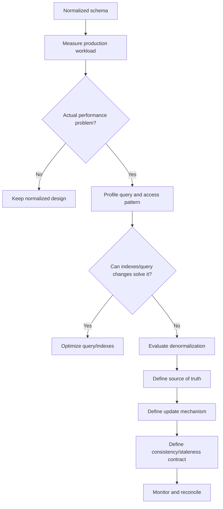
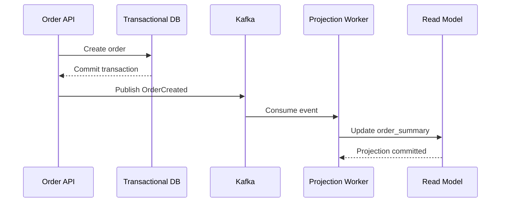
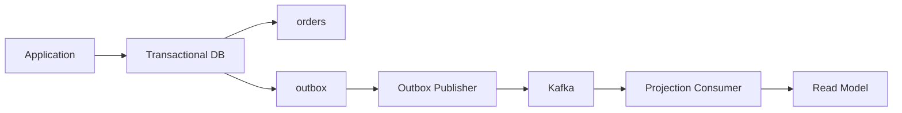

# 10- Denormalization

## Overview

**Denormalization** is the deliberate introduction of redundancy into a relational schema to improve a specific system characteristic, usually read performance, query simplicity, or availability of derived data.

Normalization answers:

> How should facts be stored to minimize redundancy and preserve integrity?

Denormalization answers:

> Where is controlled redundancy justified by the workload and operational requirements?

A normalized transactional model might separate:

```text
customers
orders
order_items
products
```

A denormalized read model might instead expose:

```text
order_summary
------------
order_id
customer_name
item_count
total_amount
last_updated_at
```

The second representation duplicates or derives information from the normalized source of truth. That duplication is useful only if the resulting performance or operational benefit justifies the additional consistency complexity.

Denormalization is therefore an **engineering optimization**, not a substitute for proper schema design.

## Why Denormalization Exists

A normalized schema avoids redundant facts, but normalization can introduce additional joins.

For a frequently executed endpoint:

```text
GET /customers/{id}/orders
```

the database may need to access:

```text
customers
    ↓
orders
    ↓
order_items
    ↓
products
```

A well-indexed relational database can handle joins efficiently, but at sufficiently high scale the repeated work may become a measurable bottleneck.

Denormalization can reduce:

- Join depth.
- Read amplification.
- CPU required for repeated aggregation.
- Network round trips between application and database.
- Query complexity.
- Latency for high-volume read paths.

The trade-off is that duplicated data must remain sufficiently consistent.

## Normalization vs Denormalization

| Concern | Normalization | Denormalization |
|---|---|---|
| Redundancy | Minimized | Intentional |
| Data integrity | Easier | More complex |
| Writes | Usually simpler | Can require additional writes |
| Reads | May require joins | Often simpler |
| Storage | Lower | Higher |
| Query complexity | Can increase | Can decrease |
| Consistency model | Usually straightforward | Must be explicitly designed |
| Best fit | Transactional source of truth | Optimized read paths and derived data |
| Main risk | Excessive joins or complexity | Stale or inconsistent duplicated data |

The choice should be driven by workload characteristics rather than ideology.

## When to Consider Denormalization

Denormalization is appropriate when there is a demonstrated requirement such as:

- A hot read path repeatedly performs expensive joins.
- The same aggregation is computed thousands or millions of times.
- A strict latency target cannot be met efficiently with the normalized query.
- A read-heavy workload benefits from precomputed values.
- A service requires a specialized read model.
- Historical values must be preserved as snapshots.
- Cross-service joins are impossible or undesirable.
- Reporting workloads should not repeatedly execute expensive transactional queries.

A typical decision process is:



## Core Principle: Optimize a Read Model, Not the Source of Truth

The safest denormalization strategy is often:

```text
Normalized transactional model
             ↓
       Derived representation
             ↓
       Read-heavy workload
```

The normalized model remains authoritative.

For example:

```text
customers
orders
order_items
products
```

remain the source of truth, while:

```text
order_summary
```

is a derived representation optimized for a particular query.

This separation makes the consistency model explicit.

## Common Denormalization Techniques

### Duplicate Frequently Accessed Attributes

Suppose an API repeatedly needs:

```text
order_id
customer_id
customer_name
```

Instead of joining `orders` and `customers` for every request, the order table may contain:

```text
orders
------
order_id
customer_id
customer_name
```

This can reduce read complexity but introduces a consistency problem:

```text
customers.name
        ↓
must remain consistent with
        ↓
orders.customer_name
```

If the customer's name changes, every affected order may need updating.

This approach is appropriate only when the duplicated value has a well-defined consistency requirement.

### Store Derived Values

Instead of repeatedly calculating:

```sql
SELECT
    order_id,
    SUM(quantity * unit_price) AS total_amount
FROM order_items
GROUP BY order_id;
```

a system may maintain:

```text
orders.total_amount
```

This changes an expensive repeated aggregation into a simple lookup.

However, every modification to an order item must correctly update the aggregate.

### Precompute Counts

A frequently requested count can be stored directly:

```text
orders.item_count
```

rather than repeatedly executing:

```sql
SELECT COUNT(*)
FROM order_items
WHERE order_id = $1;
```

This is useful when:

- The query is extremely frequent.
- The count is relatively expensive.
- Slightly stale values are acceptable.

It is dangerous when the value is used as a financial or security-critical invariant unless updates are guaranteed to be atomic and correct.

### Materialized Views

PostgreSQL materialized views provide another form of precomputed data.

```sql
CREATE MATERIALIZED VIEW customer_order_summary AS
SELECT
    customer_id,
    COUNT(*) AS order_count,
    SUM(total_amount) AS lifetime_value
FROM orders
GROUP BY customer_id;
```

The result can be indexed and queried like a table.

Refresh:

```sql
REFRESH MATERIALIZED VIEW customer_order_summary;
```

For workloads requiring concurrent reads during refresh, PostgreSQL supports:

```sql
REFRESH MATERIALIZED VIEW CONCURRENTLY customer_order_summary;
```

subject to the required unique-index conditions.

Materialized views are useful when:

- The underlying computation is expensive.
- Data can tolerate refresh latency.
- The database is a suitable place to maintain the derived representation.

They are less suitable when derived data must be updated immediately after every transaction.

## Read Models

A dedicated read model is often preferable to modifying the transactional schema solely for one query pattern.

For example:

```text
                ┌────────────────────┐
                │ Transactional DB   │
                │                    │
                │ customers          │
                │ orders             │
                │ order_items        │
                └─────────┬──────────┘
                          │
                    domain events
                          │
                          ▼
                ┌────────────────────┐
                │ Projection Worker  │
                └─────────┬──────────┘
                          │
                          ▼
                ┌────────────────────┐
                │ Read Model         │
                │                    │
                │ order_summary      │
                │ customer_summary   │
                └────────────────────┘
```

In a microservice architecture, Kafka can transport domain events:

```text
Order Service
     │
     │ OrderCreated
     ▼
   Kafka
     │
     ├──────────────► Search projection
     │
     ├──────────────► Reporting projection
     │
     └──────────────► Customer dashboard
```

This is a form of denormalization because multiple representations of the same domain facts exist for different access patterns.

The trade-off is usually **eventual consistency**.

## Application-Level Denormalization

An application may maintain a derived field explicitly.

For example:

```python
from django.db import models


class Order(models.Model):
    customer = models.ForeignKey(
        "Customer",
        on_delete=models.PROTECT,
        related_name="orders",
    )
    total_amount = models.DecimalField(
        max_digits=12,
        decimal_places=2,
        default=0,
    )
```

The application can update `total_amount` as order items change.

However, this requires careful transaction design. A derived field should not become silently incorrect because one code path updates `OrderItem` without updating `Order.total_amount`.

Prefer centralizing the write path and enforcing database-level invariants where possible.

## Transactional Denormalization

Some denormalization can remain strongly consistent inside a database transaction.

For example:

```sql
BEGIN;

UPDATE orders
SET total_amount = total_amount + 25.00
WHERE order_id = 1001;

INSERT INTO order_items (
    order_id,
    product_id,
    quantity,
    unit_price
)
VALUES (
    1001,
    501,
    1,
    25.00
);

COMMIT;
```

If both operations succeed or both roll back, the duplicated aggregate remains synchronized.

This approach provides stronger consistency than asynchronous projection but increases write complexity.

Use it when the derived value is required to be immediately correct.

## Event-Driven Denormalization

For large distributed systems, derived data can be updated asynchronously.

Example:



The read model may temporarily lag behind the transactional database.

Therefore the system must explicitly define:

```text
Source of truth: Transactional DB
Derived state: Read model
Consistency: Eventual
Expected lag: e.g. < 5 seconds
Recovery: Replay events / rebuild projection
```

Do not describe such a system as strongly consistent merely because the underlying database is strongly consistent.

## Dual Writes

A dangerous denormalization pattern is:

```text
Application
   ├── write DB A
   └── write DB B
```

If the first succeeds and the second fails, the representations diverge.

For example:

```python
save_order()
save_order_summary()
```

can fail halfway through.

This is especially problematic across independent databases.

Prefer patterns such as:

- Transactional updates within one database.
- Transactional outbox.
- Event-driven projections.
- CDC where appropriate.
- Idempotent consumers.
- Rebuildable read models.

## Transactional Outbox

The transactional outbox pattern can make event-driven denormalization more reliable.



The order and the outbox event are committed in the same database transaction.

```sql
BEGIN;

INSERT INTO orders (
    order_id,
    customer_id,
    total_amount
)
VALUES (
    1001,
    42,
    125.00
);

INSERT INTO outbox (
    event_type,
    aggregate_id,
    payload
)
VALUES (
    'OrderCreated',
    '1001',
    '{"order_id": 1001, "customer_id": 42}'
);

COMMIT;
```

A publisher later reads the outbox and publishes the event.

This avoids the classic failure mode where the database transaction succeeds but the event publication is lost.

## Idempotency and Reprocessing

Asynchronous denormalization requires consumers to tolerate:

- Duplicate events.
- Retries.
- Out-of-order events.
- Consumer restarts.
- Partial failures.

A projection should ideally be idempotent.

For example:

```sql
INSERT INTO order_summary (
    order_id,
    customer_id,
    total_amount,
    version
)
VALUES (
    1001,
    42,
    125.00,
    7
)
ON CONFLICT (order_id)
DO UPDATE SET
    customer_id = EXCLUDED.customer_id,
    total_amount = EXCLUDED.total_amount,
    version = EXCLUDED.version
WHERE order_summary.version < EXCLUDED.version;
```

The version check prevents an older event from overwriting newer state.

The exact implementation depends on the event model and ordering guarantees.

## Denormalization and Consistency Models

Every duplicated value needs an explicit consistency policy.

| Model | Behavior | Typical use |
|---|---|---|
| Strongly consistent | Derived value updated in same transaction | Financial/accounting invariants |
| Transactionally consistent | Multiple representations committed atomically | Same-database aggregates |
| Eventually consistent | Derived value catches up asynchronously | Dashboards, search, feeds |
| Snapshot consistent | Value intentionally captures historical state | Invoices, audit records |
| Best effort | Temporary stale data accepted | Non-critical analytics |

A senior engineer should be able to answer:

> What happens if the denormalized representation is stale?

If the answer is unknown, the design is incomplete.

## Source of Truth

Every duplicated attribute should have a clear owner.

For example:

```text
customers.name
    ↓
SOURCE OF TRUTH

orders.customer_name
    ↓
DERIVED / SNAPSHOT VALUE
```

The system should document:

- Which field is authoritative.
- Who updates the derived field.
- Whether updates are synchronous or asynchronous.
- Maximum expected staleness.
- How failures are detected.
- How the derived data can be rebuilt.

Avoid two-way synchronization:

```text
A updates B
B updates A
```

This creates conflict-resolution problems and unclear ownership.

Prefer:

```text
A = authoritative
B = derived
```

## Historical Snapshots

Not all duplication is performance-driven.

Consider an invoice:

```text
invoice_items
-------------
product_id
product_name
unit_price
quantity
```

The product catalog may later change:

```text
products.name
products.current_price
```

The invoice still needs to preserve:

```text
product_name_at_invoice_time
unit_price_at_invoice_time
```

This is intentional duplication.

The invoice is recording a historical business fact rather than attempting to mirror the current product table.

This distinction is important:

> Current-state duplication and historical snapshots have different consistency requirements.

Historical snapshots should generally be immutable after the business event is finalized.

## Denormalization and Indexing

Denormalization does not eliminate the need for indexes.

Suppose:

```text
order_summary
------------
customer_id
created_at
total_amount
```

and the dominant query is:

```sql
SELECT
    order_id,
    created_at,
    total_amount
FROM order_summary
WHERE customer_id = $1
ORDER BY created_at DESC
LIMIT 50;
```

A suitable index may be:

```sql
CREATE INDEX order_summary_customer_created_idx
    ON order_summary (customer_id, created_at DESC);
```

The denormalized table and index should be designed around actual access patterns.

Avoid compensating for poor indexing by duplicating increasingly large amounts of data.

## Storage and Write Amplification

Denormalization trades read work for additional storage and write work.

If one customer attribute is duplicated into one million orders, a single customer update may require one million row updates.

This can cause:

- Large write amplification.
- More WAL generation.
- Lock contention.
- Table and index bloat.
- Increased replication traffic.
- Longer vacuum work.
- Larger backups.

Therefore, ask:

```text
How frequently does the source value change?
How many rows contain the duplicate?
How frequently is the duplicate read?
```

Duplicating a value that rarely changes may be inexpensive.

Duplicating a frequently changing value across millions of rows can be operationally expensive.

## Denormalization and PostgreSQL

PostgreSQL provides several mechanisms that can support denormalized designs:

- Materialized views.
- Generated columns for deterministic expressions.
- JSONB for appropriate semi-structured data.
- Partial and covering indexes.
- Common table expressions and advanced SQL.
- Triggers where appropriate.
- Logical replication and CDC integrations.

For example, a generated column can materialize a deterministic expression without requiring application code to maintain it:

```sql
CREATE TABLE products (
    product_id bigint GENERATED ALWAYS AS IDENTITY PRIMARY KEY,
    price numeric(12, 2) NOT NULL,
    tax_rate numeric(5, 4) NOT NULL,
    price_with_tax numeric(12, 2)
        GENERATED ALWAYS AS (price * (1 + tax_rate)) STORED
);
```

Generated columns are useful for deterministic row-local derivations, but they are not a general replacement for aggregates or cross-table denormalization.

## Denormalization and Redis

Redis can sometimes provide a denormalized representation outside the relational database.

For example:

```text
PostgreSQL
   ↓
Source of truth

Redis
   ↓
Cached / derived representation
```

This is often better understood as **caching** rather than relational denormalization.

The distinction matters:

- Denormalization stores redundant data as part of the persistent data model.
- Caching stores data primarily to accelerate access and can often be discarded and rebuilt.

Do not treat Redis as a permanent source of truth unless the architecture explicitly requires that model.

## Denormalization in Microservices

Microservices frequently require duplicated data because cross-service joins are undesirable.

For example:

```text
Order Service
    owns:
    customer_id

Customer Service
    owns:
    customer_name
```

The Order Service might maintain:

```text
order_view
----------
order_id
customer_id
customer_name
```

This avoids making every order read synchronously dependent on the Customer Service.

The trade-off is eventual consistency:

```text
Customer Service
      │
      │ CustomerUpdated
      ▼
    Kafka
      │
      ▼
Order projection
      │
      ▼
order_view
```

This improves service autonomy and read latency at the cost of stale data windows and additional operational complexity.

## Denormalization and CQRS

**CQRS** separates write and read models.

A normalized transactional model can serve writes while a denormalized projection serves reads:

```text
                Commands
                   │
                   ▼
          ┌─────────────────┐
          │ Write Model     │
          │ normalized      │
          └────────┬────────┘
                   │
                 Events
                   │
                   ▼
          ┌─────────────────┐
          │ Read Projection │
          │ denormalized    │
          └────────┬────────┘
                   │
                   ▼
                 Queries
```

CQRS is useful when read and write workloads have substantially different requirements.

It should not be introduced merely because denormalization is required. CQRS introduces additional:

- Components.
- Deployment complexity.
- Failure modes.
- Consistency concerns.
- Operational overhead.

## Safe Denormalization Workflow

A production workflow should look like:

1. Establish a measurable performance or architectural requirement.
2. Profile the existing normalized query.
3. Optimize indexes and SQL first.
4. Determine whether the bottleneck remains.
5. Define exactly what data will be duplicated or derived.
6. Identify the authoritative source.
7. Choose synchronous or asynchronous maintenance.
8. Define consistency and staleness requirements.
9. Make updates idempotent where asynchronous processing is used.
10. Add monitoring and reconciliation.
11. Load-test the new design.
12. Document the invariants and recovery process.

## Rebuilding Derived Data

A robust denormalized system should be able to rebuild derived representations.

For example:

```text
orders + order_items
        │
        │ replay / recompute
        ▼
order_summary
```

If the projection becomes corrupted, the team should have a documented recovery process.

Possible strategies include:

- Full recomputation.
- Event replay.
- Incremental backfill.
- Materialized-view refresh.
- CDC replay.
- Periodic reconciliation jobs.

A read model that cannot be rebuilt is effectively another source of truth, whether the team intended that or not.

## Reconciliation

Asynchronous systems should detect divergence rather than assuming it cannot happen.

A reconciliation job might periodically compare:

```text
orders.total_amount
```

with:

```sql
SELECT SUM(quantity * unit_price)
FROM order_items
WHERE order_id = $1;
```

The exact strategy depends on scale and business criticality.

For large datasets, reconciliation should usually be:

- Incremental.
- Batched.
- Rate-limited.
- Observable.
- Safe to rerun.

Do not run an expensive full-table reconciliation every few minutes on a large production database without considering its operational impact.

## Monitoring

Denormalized systems require additional observability.

Monitor:

### Read Performance

- P50/P95/P99 latency.
- Query execution time.
- Database CPU.
- Buffer/cache hit behavior.
- Rows examined versus returned.

### Consistency

- Projection lag.
- Number of failed events.
- Consumer retry counts.
- Dead-letter queue size.
- Reconciliation mismatches.
- Stale-record age.

### Write Cost

- WAL volume.
- Replication lag.
- Update rate.
- Lock contention.
- Vacuum activity.
- Table/index growth.

A useful production metric is:

```text
projection_lag_seconds
```

rather than simply reporting that a consumer is "healthy."

A consumer can be running while still being hours behind.

## Reliability Considerations

Denormalization introduces additional failure modes.

For asynchronous projections, consider:

- Kafka availability.
- Consumer restarts.
- Poison messages.
- Duplicate delivery.
- Out-of-order events.
- Schema evolution.
- Projection rebuilds.
- Backfills.
- Dead-letter queues.

For synchronous duplication, consider:

- Transaction boundaries.
- Lock contention.
- Update amplification.
- Failure rollback.
- Concurrent updates.

The more derived representations a system maintains, the more important explicit recovery procedures become.

## Security Considerations

Duplicated data expands the number of locations containing potentially sensitive information.

For example, copying customer information into:

```text
orders
Redis
Kafka events
analytics tables
search indexes
```

can increase:

- Access-control complexity.
- Data-retention obligations.
- Backup exposure.
- Audit scope.
- Deletion complexity.

When a user requests data deletion, every derived representation may need to be considered.

Avoid denormalizing sensitive data simply for convenience.

Where possible, duplicate only the minimum information required by the access pattern.

## Cost Considerations

Denormalization can reduce compute cost for frequent reads while increasing:

- Storage.
- Write I/O.
- Database CPU during updates.
- Replication traffic.
- Kafka throughput.
- Consumer infrastructure.
- Operational complexity.

For cloud deployments such as AWS, evaluate the entire architecture rather than only database query latency.

For example:

```text
Expensive database joins
        ↓
Denormalized read model
        ↓
More Kafka traffic + storage + consumers
```

The optimization is worthwhile only if the total system economics improve.

## Common Mistakes

### Denormalizing Before Measuring

Bad reasoning:

```text
"Joins are slow, therefore denormalize."
```

Better reasoning:

```text
Measure
→ identify bottleneck
→ optimize query/indexes
→ measure again
→ denormalize only if justified
```

### Creating Multiple Sources of Truth

This is dangerous:

```text
customers.name
orders.customer_name
customer_search.name
redis.customer_name
```

with no clear ownership.

Define one authoritative representation and treat the others as derived.

### Ignoring Update Frequency

Duplicating a frequently changing attribute across millions of rows can create enormous write amplification.

Estimate:

```text
change frequency × number of duplicated rows
```

before adopting the design.

### Assuming Eventual Consistency Is Free

Asynchronous projections introduce stale-data windows.

If an API requires the newest value immediately after a write, an eventually consistent projection may violate the requirement.

### Using Triggers for Everything

Database triggers can keep derived values synchronized but can also hide write behavior from application developers.

Use them selectively when the invariant is genuinely database-owned and the operational behavior is well understood.

### Maintaining Derived Data Through Many Code Paths

If five services can independently update the same derived field, divergence becomes likely.

Centralize ownership and update logic.

### No Rebuild Strategy

If a projection is corrupted and the team cannot regenerate it from authoritative data, the system has created an operational dependency on the derived representation.

### Denormalizing Large Mutable Objects

Copying entire customer profiles into every order can create unnecessary update amplification.

Prefer copying only the attributes required by the access pattern.

### Confusing Cache With Denormalized Persistence

Redis caching and relational denormalization have different durability and consistency semantics.

Do not rely on a cache as the authoritative copy unless explicitly designed for that role.

## Interview Traps

### "Is Denormalization Bad Database Design?"

No.

Denormalization is bad when it is **uncontrolled or unjustified**.

Intentional duplication can be an appropriate response to:

- Read performance requirements.
- Service boundaries.
- Historical requirements.
- Reporting workloads.
- Specialized read models.

### "Should You Always Normalize to 3NF?"

No.

3NF provides a strong baseline for relational integrity, but production architecture must also consider:

- Access patterns.
- Performance.
- Scalability.
- Consistency.
- Operational complexity.

### "Does Denormalization Always Improve Performance?"

No.

It may reduce joins but increase:

- Write cost.
- Storage.
- Cache pressure.
- Replication traffic.
- Maintenance work.

Poorly designed denormalization can make the system slower overall.

### "Is a Materialized View Denormalization?"

It can be considered a form of derived or denormalized representation because it stores precomputed results, although its maintenance semantics differ from ordinary duplicated columns or tables.

### "Is CQRS Required for Denormalization?"

No.

A system can denormalize within a single relational database without CQRS.

CQRS is an architectural pattern that may use denormalized read models when separate read and write models are beneficial.

## Production Checklist

Before shipping a denormalized design, verify:

- [ ] The performance or architectural problem is measurable.
- [ ] Existing indexes and query plans have been evaluated.
- [ ] The source of truth is explicitly documented.
- [ ] Every duplicated field has an ownership model.
- [ ] The update mechanism is defined.
- [ ] Consistency requirements are documented.
- [ ] Maximum acceptable staleness is defined.
- [ ] Concurrent updates are handled safely.
- [ ] Asynchronous consumers are idempotent where required.
- [ ] Duplicate and out-of-order events are handled.
- [ ] Projection failures are observable.
- [ ] Derived data can be rebuilt.
- [ ] Reconciliation is possible.
- [ ] Storage and write amplification are understood.
- [ ] Security and data-retention implications are reviewed.
- [ ] Backups and disaster recovery include derived stores where necessary.
- [ ] Load testing confirms the expected improvement.

## Key Takeaways

- **Denormalization is deliberate redundancy used to solve a measured performance, scalability, architectural, or historical-data requirement.**
- **Keep a clear source of truth and treat duplicated tables, columns, caches, and read models as derived representations unless they are explicitly authoritative.**
- **Choose the consistency mechanism deliberately: database transactions for strong consistency, or reliable event-driven projections when eventual consistency is acceptable.**
- **Production denormalization requires idempotency, observability, reconciliation, and a rebuild strategy—not just duplicated columns.**
- **Normalize by default, measure first, and denormalize only when the resulting read or architectural benefits justify the additional write, storage, and consistency complexity.**