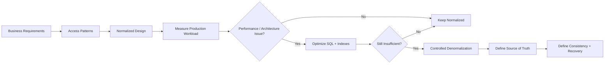
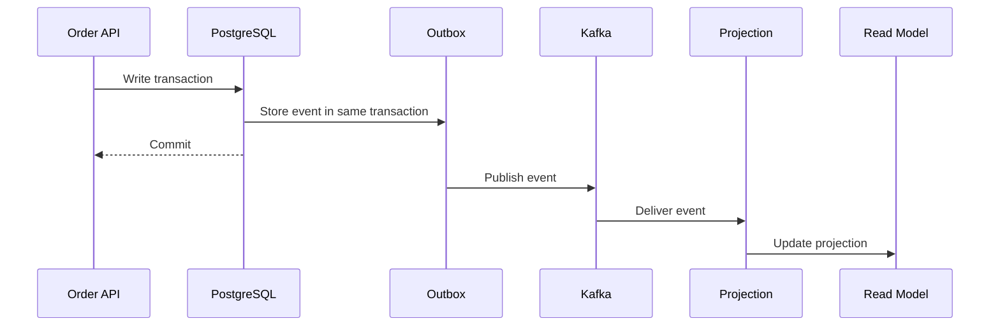

# 11- Normalization vs Denormalization

## Overview

**Normalization** and **denormalization** are complementary database design strategies.

Normalization structures relational data to minimize unnecessary duplication and protect data integrity. Denormalization intentionally introduces controlled redundancy to optimize a known workload, simplify a read path, preserve historical state, or reduce coupling between services.

The practical engineering question is not:

> "Should databases always be normalized?"

It is:

> "What data model provides the required correctness, performance, scalability, and operational characteristics for this workload?"

A common production architecture starts with a normalized transactional model and introduces denormalized representations only where measurements or architectural boundaries justify them.



## Normalization

### What It Is

Normalization decomposes data into related tables so that each fact has an appropriate place of ownership and unnecessary redundancy is reduced.

A normalized order model might look like:

```text
customers
---------
customer_id
name
email

orders
------
order_id
customer_id
created_at

order_items
-----------
order_id
product_id
quantity
unit_price

products
--------
product_id
name
```

An order does not need to duplicate the customer's email or product name merely because those values are needed when displaying an order.

### Why It Exists

Normalization primarily helps:

- Prevent inconsistent duplicate values.
- Reduce update anomalies.
- Make data ownership explicit.
- Enforce relationships with foreign keys.
- Keep transactional writes predictable.
- Reduce unnecessary storage.
- Represent business entities independently.

Normalization is especially valuable for systems where correctness and transactional integrity are more important than minimizing every join.

### How It Works

Instead of:

```text
orders
-------------------------------------------------
order_id | customer_name | customer_email | ...
```

the database separates independent facts:

```text
customers
    │
    │ 1:N
    ▼
orders
    │
    │ 1:N
    ▼
order_items
    │
    │ N:1
    ▼
products
```

Queries reconstruct the required representation using joins.

```sql
SELECT
    o.order_id,
    c.name AS customer_name,
    p.name AS product_name,
    oi.quantity
FROM orders AS o
JOIN customers AS c
    ON c.customer_id = o.customer_id
JOIN order_items AS oi
    ON oi.order_id = o.order_id
JOIN products AS p
    ON p.product_id = oi.product_id
WHERE o.order_id = $1;
```

A relational database is designed to perform such joins efficiently when appropriate indexes and query plans exist.

## Denormalization

### What It Is

Denormalization intentionally stores redundant or precomputed information.

For example:

```text
orders
------
order_id
customer_id
customer_name
total_amount
item_count
```

`customer_name`, `total_amount`, or `item_count` may be derived from other authoritative data.

The duplication is acceptable only when the system has a deliberate strategy for maintaining it.

### Why It Exists

Denormalization can improve:

- Read latency.
- Query simplicity.
- Repeated aggregation performance.
- Read scalability.
- Service autonomy.
- Historical data preservation.

The cost is increased complexity around writes, consistency, storage, and recovery.

## Side-by-Side Comparison

| Dimension | Normalization | Denormalization |
|---|---|---|
| Data duplication | Minimized | Intentional |
| Integrity | Easier to enforce | More complex |
| Reads | May require joins | Often simpler |
| Writes | Usually simpler | Potentially more expensive |
| Storage | Usually lower | Usually higher |
| Consistency | Easier | Must be explicitly designed |
| Query complexity | Can increase | Often decreases |
| Recovery | Generally simpler | Requires derived-data strategy |
| Best use | Transactional source of truth | Optimized read models and specialized workloads |
| Primary risk | Excessive joins | Stale or divergent data |

Neither approach is universally superior.

## Normalization Levels and Their Practical Role

Normalization is commonly discussed through normal forms such as:

- First Normal Form (1NF)
- Second Normal Form (2NF)
- Third Normal Form (3NF)
- Boyce-Codd Normal Form (BCNF)

In production systems, **3NF is often a useful baseline** for transactional relational models.

Higher normalization is not automatically better. The design must still account for:

- Query patterns.
- Constraints.
- Indexes.
- Transaction boundaries.
- Reporting requirements.
- Historical requirements.
- Service boundaries.

The goal is not to maximize the theoretical normal form at all costs.

## A Practical Example

Consider a product catalog and order system.

### Normalized Model

```text
products
--------
product_id
name
current_price

orders
------
order_id
customer_id

order_items
-----------
order_id
product_id
quantity
unit_price
```

Notice that `unit_price` exists on `order_items`.

This is intentional.

The current product price may change after an order is placed, but the order needs the price that applied when the transaction occurred.

Therefore:

```text
products.current_price
        ↓
current business state

order_items.unit_price
        ↓
historical transaction fact
```

This is not necessarily "bad duplication." It represents different business semantics.

## Where Normalization Works Best

Normalization is usually preferred for:

### Transactional Systems

Examples include:

- Payments.
- Orders.
- Inventory.
- User accounts.
- Billing.
- Permissions.

These systems typically require strong integrity guarantees.

### Frequently Updated Data

If a value changes frequently and is duplicated across millions of rows, maintaining the copies can create significant write amplification.

Keeping one authoritative copy is usually safer.

### Complex Relationship Models

Normalized schemas make relationships explicit:

```text
User
 │
 ├── Orders
 │
 └── Addresses
```

This is easier to constrain and reason about than embedding copies of entire objects throughout the database.

## Where Denormalization Works Best

Denormalization becomes attractive when the workload is strongly read-oriented or when a particular representation is repeatedly expensive to produce.

### Repeated Aggregations

Instead of repeatedly executing:

```sql
SELECT
    customer_id,
    COUNT(*) AS order_count,
    SUM(total_amount) AS lifetime_value
FROM orders
GROUP BY customer_id;
```

a system may maintain:

```text
customer_summary
---------------
customer_id
order_count
lifetime_value
```

This trades computation at read time for maintenance at write or projection time.

### Hot Read Paths

Suppose an API repeatedly needs:

```text
order_id
customer_name
item_count
total_amount
```

A dedicated `order_summary` representation can avoid repeatedly reconstructing the same response from several tables.

### Historical Snapshots

Invoices, financial statements, and audit records often require immutable historical values.

For example:

```text
invoice_items
-------------
product_name
unit_price
quantity
```

The product catalog may change later, but the invoice must continue to represent what was actually sold.

### Microservices

A service should generally avoid requiring synchronous joins across another service's database.

Instead:

```text
Customer Service
      │
      │ CustomerUpdated
      ▼
    Kafka
      │
      ▼
Order Service projection
      │
      ▼
order_view
```

The Order Service can maintain the customer information required for its own read paths.

This increases service autonomy but usually introduces eventual consistency.

## The Most Important Distinction: Source of Truth

Every denormalized field should have an explicit owner.

For example:

```text
customers.name
    │
    └── authoritative

orders.customer_name
    │
    └── derived
```

The system should know:

- Which field is authoritative.
- Who updates the derived value.
- How quickly it must become consistent.
- What happens when synchronization fails.
- How the derived representation is rebuilt.

Avoid designs where two representations can independently modify the same business fact.

Bad:

```text
A ──updates──> B
A <──updates── B
```

Better:

```text
A = source of truth
B = derived representation
```

## Consistency Trade-Off

Normalization and denormalization often differ most significantly in consistency complexity.

With a normalized transactional model:

```text
BEGIN
  update customer
  update order
COMMIT
```

the database can enforce atomicity within the transaction.

With an asynchronous denormalized model:

```text
Transactional DB
      │
      ▼
    Event
      │
      ▼
 Read Model
```

the read model may temporarily lag behind.

Therefore, the design must define:

```text
Source of truth: PostgreSQL
Read model: order_summary
Consistency: eventual
Maximum expected lag: 5 seconds
Recovery: event replay / rebuild
```

"Eventually consistent" is an engineering property that should be specified, not an incidental side effect.

## Performance Trade-Off

### Normalized Read Path

```text
API
 │
 ▼
PostgreSQL
 │
 ├── customers
 ├── orders
 ├── order_items
 └── products
```

The query may require several joins and aggregations.

### Denormalized Read Path

```text
API
 │
 ▼
PostgreSQL
 │
 └── order_summary
```

The query may become much simpler.

However, the write path can become more expensive:

```text
One business update
       │
       ├── source table
       ├── derived table
       ├── indexes
       └── events
```

Therefore, denormalization often means:

> Move work from reads to writes.

That is beneficial when the workload is heavily read-biased and the additional write cost is acceptable.

## Read-to-Write Ratio

Workload shape matters.

Suppose a record is:

```text
Written: 100 times/day
Read:    100,000 times/day
```

Precomputing a frequently requested representation may be worthwhile.

Conversely:

```text
Written: 100,000 times/day
Read:    100 times/day
```

Duplicating the value may create unnecessary write amplification.

A useful decision framework is:

```text
Read frequency
×
Read cost
×
Latency requirement

versus

Write frequency
×
Update amplification
×
Consistency cost
```

This is not a literal formula for every architecture, but it captures the engineering trade-off.

## Query Optimization Comes Before Denormalization

A common mistake is to denormalize immediately because a query is slow.

First inspect:

- Execution plan.
- Indexes.
- Cardinality estimates.
- Join strategy.
- Filtering.
- Sorting.
- Aggregations.
- Network round trips.
- Returned row count.

For PostgreSQL:

```sql
EXPLAIN (ANALYZE, BUFFERS)
SELECT
    o.order_id,
    c.name,
    o.created_at
FROM orders AS o
JOIN customers AS c
    ON c.customer_id = o.customer_id
WHERE o.customer_id = $1
ORDER BY o.created_at DESC
LIMIT 50;
```

Possible solutions may include:

```sql
CREATE INDEX orders_customer_created_idx
    ON orders (customer_id, created_at DESC);
```

If indexing and query optimization solve the problem, denormalization may add complexity without providing meaningful benefit.

## Denormalization Patterns

| Pattern | Example | Main Benefit | Main Cost |
|---|---|---|---|
| Duplicate attribute | `orders.customer_name` | Avoid join | Update propagation |
| Precomputed aggregate | `customer.order_count` | Faster reads | Maintaining correctness |
| Summary table | `order_summary` | Optimized read model | Additional storage |
| Materialized view | Aggregated reporting view | Precomputed SQL | Refresh complexity |
| Historical snapshot | `invoice.unit_price` | Preserves past state | Intentional duplication |
| Search projection | Search document | Fast search/read | Eventual consistency |
| Cache | Redis representation | Very low read latency | Invalidation/expiry |

## Materialized Views

PostgreSQL materialized views can provide a database-managed derived representation.

```sql
CREATE MATERIALIZED VIEW customer_order_summary AS
SELECT
    customer_id,
    COUNT(*) AS order_count,
    SUM(total_amount) AS lifetime_value
FROM orders
GROUP BY customer_id;
```

The view can then be indexed:

```sql
CREATE UNIQUE INDEX customer_order_summary_pk
    ON customer_order_summary (customer_id);
```

It can be refreshed:

```sql
REFRESH MATERIALIZED VIEW customer_order_summary;
```

For suitable workloads, PostgreSQL also supports concurrent refresh:

```sql
REFRESH MATERIALIZED VIEW CONCURRENTLY customer_order_summary;
```

Materialized views are useful when:

- The computation is expensive.
- Data does not need to be updated after every transaction.
- The database should own the derived representation.

They are less suitable when the application requires immediate incremental updates.

## Application-Level Denormalization

A Django application may maintain a derived value:

```python
from django.db import models


class Order(models.Model):
    customer = models.ForeignKey(
        "Customer",
        on_delete=models.PROTECT,
        related_name="orders",
    )
    total_amount = models.DecimalField(
        max_digits=12,
        decimal_places=2,
        default=0,
    )
```

If `total_amount` is derived from `OrderItem` records, every write path that changes items must preserve the invariant.

For example:

```text
OrderItem created
       ↓
Order.total_amount updated
```

If another code path modifies `OrderItem` without updating the aggregate, the denormalized value becomes incorrect.

For critical values, prefer transactional updates and database constraints where possible.

## Event-Driven Read Models

For distributed systems, a denormalized read model can be maintained asynchronously.



This design can scale well but requires handling:

- Duplicate events.
- Retries.
- Out-of-order events.
- Consumer failures.
- Poison messages.
- Schema evolution.
- Projection rebuilds.

Consumers should be idempotent when delivery can be repeated.

## Transactional Outbox

When the transactional database is the source of truth, the **transactional outbox pattern** is a common way to reliably drive asynchronous projections.

```sql
BEGIN;

INSERT INTO orders (
    order_id,
    customer_id,
    total_amount
)
VALUES (
    1001,
    42,
    125.00
);

INSERT INTO outbox (
    event_type,
    aggregate_id,
    payload
)
VALUES (
    'OrderCreated',
    '1001',
    '{"order_id": 1001, "customer_id": 42}'
);

COMMIT;
```

The database transaction guarantees that the order and event record are committed together.

A separate publisher can then deliver the outbox event to Kafka.

This avoids a common dual-write failure:

```text
DB commit succeeds
       ↓
Kafka publish fails
       ↓
Read model never receives the event
```

## Denormalization vs Caching

These concepts are related but not identical.

### Denormalization

Persistent redundant representation:

```text
PostgreSQL
 ├── orders
 └── order_summary
```

The derived data is part of the application's persistent data model.

### Caching

Discardable acceleration layer:

```text
PostgreSQL
     │
     ▼
   Redis
```

A cache should generally be rebuildable from the authoritative database.

This distinction affects:

- Recovery.
- Durability.
- Consistency.
- Backup strategy.
- Operational ownership.

Redis should not automatically become the source of truth merely because it contains a denormalized representation.

## Denormalization vs CQRS

CQRS separates command and query models.

```text
                 Commands
                    │
                    ▼
          ┌──────────────────┐
          │ Normalized Write │
          │ Model            │
          └────────┬─────────┘
                   │
                 Events
                   │
                   ▼
          ┌──────────────────┐
          │ Denormalized     │
          │ Read Model       │
          └────────┬─────────┘
                   │
                   ▼
                 Queries
```

CQRS often uses denormalized read models, but denormalization does not require CQRS.

Do not introduce CQRS merely because one query is expensive.

The architectural complexity must be justified by the workload and system requirements.

## Production Decision Framework

Use the following sequence when choosing between normalization and denormalization.

### Start With the Domain

Identify:

- Entities.
- Relationships.
- Business invariants.
- Ownership.
- Transaction boundaries.
- Historical facts.

Build a normalized model unless there is a clear reason not to.

### Analyze Access Patterns

Document actual queries:

```text
GET /orders/{id}
GET /customers/{id}/orders
GET /dashboard
GET /reports/revenue
```

Identify:

- Frequency.
- Latency requirements.
- Result size.
- Read/write ratio.
- Consistency requirements.

### Measure

Use:

```text
EXPLAIN ANALYZE
database metrics
application tracing
P95/P99 latency
load tests
production query statistics
```

Do not optimize based solely on intuition.

### Optimize the Normalized Model

Before introducing redundancy, consider:

- Better indexes.
- Query rewriting.
- Pagination.
- Reducing selected columns.
- Avoiding unnecessary joins.
- Connection pooling.
- Read replicas where appropriate.
- Materialized views.
- Caching.

### Introduce Controlled Redundancy

If the problem remains, define:

```text
What is duplicated?
Who owns the original?
How is it updated?
How stale can it become?
How is failure detected?
How is it rebuilt?
```

## Production Considerations

### Data Integrity

A denormalized value should have an explicit invariant.

For example:

```text
orders.total_amount
=
SUM(order_items.quantity * order_items.unit_price)
```

If that invariant matters to billing, do not casually maintain it through a best-effort asynchronous process.

### Write Amplification

Duplicating data across many rows can make a small logical change physically expensive.

For example:

```text
customer.name changes
       ↓
1 customer row
       ↓
1,000,000 duplicated order rows
```

This can increase:

- WAL volume.
- Replication traffic.
- Lock contention.
- Vacuum work.
- Index maintenance.
- Backup size.

### Replication

More writes can increase replication lag.

This matters particularly when:

```text
Primary
  │
  ├── Replica 1
  ├── Replica 2
  └── Replica 3
```

are serving read traffic.

Denormalization that increases write volume can therefore indirectly affect read availability.

### Disaster Recovery

Derived data should have a documented recovery strategy.

Possible approaches:

- Rebuild from normalized tables.
- Replay domain events.
- Recompute materialized views.
- Restore from backup.
- Run incremental backfills.

If a denormalized representation cannot be reconstructed, it may be functioning as a second source of truth.

## Security Considerations

Redundant data means more copies to secure.

A customer attribute might exist in:

```text
PostgreSQL
Kafka
Redis
Search index
Analytics warehouse
Backups
```

Each additional copy can increase:

- Access-control requirements.
- Retention requirements.
- Data deletion complexity.
- Audit scope.
- Exposure during incidents.

Avoid duplicating sensitive data merely to save a small amount of query complexity.

Prefer the minimum data required by the access pattern.

## Monitoring

Normalized systems should primarily monitor:

- Query latency.
- Query plans.
- Lock contention.
- CPU.
- I/O.
- Connection utilization.
- Replication lag.

Denormalized systems require additional monitoring:

- Projection lag.
- Failed projection events.
- Retry counts.
- Dead-letter queues.
- Reconciliation failures.
- Derived-data freshness.
- Write amplification.
- Storage growth.

A useful metric is:

```text
projection_lag_seconds
```

A consumer can be technically "running" while being several hours behind.

## Common Mistakes

### Treating Normalization as a Performance Rule

Normalization is primarily about data organization and integrity.

A normalized schema is not automatically slow.

Poor indexes and inefficient queries can be slow regardless of normalization.

### Treating Denormalization as a Shortcut

Denormalization does not eliminate complexity.

It moves complexity into:

- Writes.
- Synchronization.
- Consistency.
- Recovery.
- Monitoring.

### Denormalizing Before Profiling

Do not duplicate data because a query "looks complicated."

Measure the actual bottleneck.

### Maintaining Multiple Sources of Truth

This creates ambiguity:

```text
orders.customer_name
customers.name
customer_profile.name
```

If all three can be modified independently, consistency becomes difficult to reason about.

### Ignoring Write Amplification

A duplicated field may look cheap until its source changes frequently across millions of records.

### Assuming Eventual Consistency Is Acceptable

For payment authorization or account balances, stale data can be unacceptable.

For dashboards or search results, several seconds of staleness may be fine.

The business requirement determines the appropriate model.

### No Rebuild Strategy

Derived data should generally be reconstructible.

Without a rebuild strategy, operational recovery becomes difficult.

### Using Denormalization to Avoid Learning SQL

Denormalization should solve a measurable architectural or performance problem, not compensate for poor query construction.

## Interview Traps

| Question | Strong Answer |
|---|---|
| Is normalization always better? | No. It is a strong baseline for integrity, but workload requirements may justify controlled redundancy. |
| Is denormalization bad design? | No. Intentional, measured denormalization is a valid production optimization. |
| Does denormalization always improve performance? | No. It can reduce read work while increasing write, storage, and synchronization costs. |
| Should you denormalize before adding indexes? | Usually no. Profile and optimize the normalized query first. |
| Does denormalization mean eventual consistency? | Not necessarily. It can be transactionally maintained within the same database or asynchronously projected. |
| Is a cache the same as denormalization? | No. A cache is generally a discardable acceleration layer; denormalized persistence is part of the data model. |
| Does CQRS require denormalization? | No. CQRS can use denormalized read models, but the patterns are independent. |
| What is the key question for duplicated data? | Which representation is authoritative, and how is the derived representation kept correct? |

## Practical Rule of Thumb

A production-friendly default is:

```text
Normalize first
     ↓
Define constraints
     ↓
Add appropriate indexes
     ↓
Measure workload
     ↓
Optimize queries
     ↓
Measure again
     ↓
Denormalize only when justified
     ↓
Define consistency + recovery
     ↓
Monitor the derived representation
```

This approach preserves relational integrity while allowing targeted optimization.

## Decision Matrix

| Requirement | Preferred Starting Point |
|---|---|
| Strong transactional integrity | Normalization |
| Frequently changing shared attributes | Normalization |
| Complex relational writes | Normalization |
| Repeated expensive reads | Consider denormalization |
| Repeated expensive aggregation | Materialized/derived representation |
| Historical snapshot | Intentional duplication |
| Cross-service read model | Denormalized projection |
| Search-optimized representation | Denormalized search projection |
| Low-latency disposable data | Cache |
| Unknown workload | Normalize and measure |

## Key Takeaways

- **Normalization is the default strategy for maintaining clear ownership, relational integrity, and predictable transactional writes.**
- **Denormalization is controlled redundancy that should be introduced only for a measured performance, scalability, historical, or architectural requirement.**
- **Always define the source of truth, consistency model, update mechanism, and rebuild strategy for denormalized data.**
- **Optimize queries and indexes before denormalizing; moving work from reads to writes is a trade-off, not a free performance improvement.**
- **Senior-level database design balances correctness, workload characteristics, latency, scalability, operational complexity, and total system cost rather than blindly maximizing normalization.**