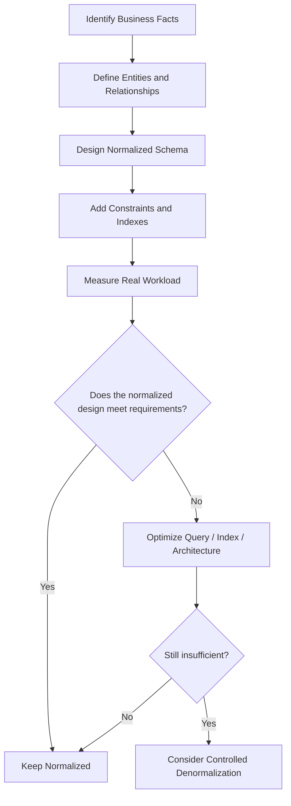
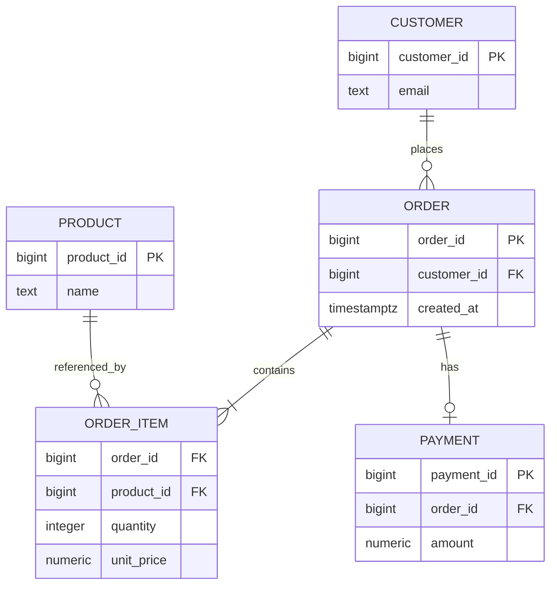
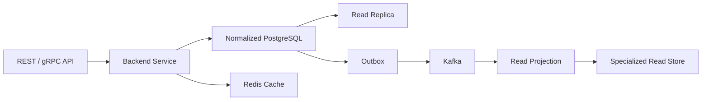

# 12- When to Normalize

## Overview

Normalization is the default relational database design strategy for organizing data around clear ownership, reducing unnecessary duplication, and preserving data integrity.

The important production question is not whether a schema can be normalized further. It is whether normalization provides the right balance of:

- Data integrity
- Transactional correctness
- Query complexity
- Read and write performance
- Storage efficiency
- Scalability
- Operational simplicity

For most transactional systems, start with a normalized model and introduce denormalization only when a measured requirement justifies the additional complexity.

Normalization is particularly valuable when the same business fact is frequently updated, when strong consistency matters, or when multiple workflows depend on a single authoritative representation.



## What Normalization Solves

Normalization primarily prevents multiple copies of the same logical fact from becoming independently authoritative.

Consider:

```text
orders
---------------------------------------------------------
order_id | customer_name | customer_email | total_amount
```

If the customer's email changes, potentially thousands of order rows may contain an old value.

A normalized design separates the entities:

```text
customers
---------
customer_id
name
email

orders
------
order_id
customer_id
total_amount
```

The customer's email now has one authoritative location.

This reduces the risk of:

- Update anomalies
- Insert anomalies
- Delete anomalies
- Conflicting copies of the same fact
- Difficult synchronization logic

## When to Normalize

Normalization should generally be the starting point when one or more of the following conditions apply.

### Strong Data Integrity Requirements

Normalize when incorrect or inconsistent data can cause business or financial problems.

Examples:

- Payments
- Account balances
- Inventory
- Permissions
- Billing
- Order state
- Subscription state

A payment system should not maintain multiple independently writable copies of a customer's financial state merely to avoid joins.

The database should have clear ownership of critical facts and enforce important invariants using transactions and constraints.

### Frequently Updated Data

Normalization is particularly useful when attributes change independently of the records that reference them.

For example:

```text
customers
---------
customer_id
email
phone
status
```

If customer information is duplicated into millions of unrelated rows, changing one customer attribute can cause substantial write amplification.

With normalization:

```text
UPDATE customers
SET email = $1
WHERE customer_id = $2;
```

One logical update affects one authoritative record.

### Multiple Consumers of the Same Data

When several parts of the application depend on the same fact, a normalized source of truth simplifies consistency.

For example:

```text
Customer
   │
   ├── Order Service
   ├── Support Service
   ├── Billing Service
   └── Notification Service
```

The customer identity and core attributes should have a well-defined owner rather than being independently modified everywhere.

In a monolithic PostgreSQL application, this is often naturally represented through normalized tables and foreign keys.

In a microservice architecture, the same principle applies conceptually, although each service may maintain its own read model.

### Complex Transactional Relationships

Normalize when the domain contains many relationships between independently managed entities.

For example:



This structure makes ownership and relationships explicit.

### Unknown or Evolving Workloads

Normalize when access patterns are not yet well understood.

Early in a project, optimizing for hypothetical query patterns can result in unnecessary duplication.

A normalized schema provides a cleaner foundation from which different read paths can later be optimized.

The workflow should generally be:

```text
Correct model
    ↓
Measure workload
    ↓
Identify bottleneck
    ↓
Optimize
    ↓
Denormalize if justified
```

## How Normalization Helps With Updates

Consider a denormalized model:

```text
orders
---------------------------------------------------
order_id | customer_id | customer_name | customer_email
```

Suppose customer `42` has 500,000 orders.

Changing the customer's email potentially requires:

```text
500,000 row updates
```

The normalized model requires:

```text
1 customer row update
```

The difference can affect:

- WAL generation
- Replication traffic
- Index maintenance
- Lock duration
- Vacuum workload
- Storage
- Backup size

This becomes significant at scale.

## Normalization and Transaction Boundaries

Normalization often aligns naturally with transactional boundaries.

For example, creating an order may involve:

```text
orders
order_items
inventory
```

A PostgreSQL transaction can update the appropriate normalized tables atomically:

```sql
BEGIN;

INSERT INTO orders (
    order_id,
    customer_id,
    created_at
)
VALUES (
    $1,
    $2,
    CURRENT_TIMESTAMP
);

INSERT INTO order_items (
    order_id,
    product_id,
    quantity,
    unit_price
)
VALUES
    ($1, $3, $4, $5);

COMMIT;
```

Foreign keys, unique constraints, check constraints, and transactions can collectively enforce the domain's invariants.

Normalization does not guarantee correctness by itself; the schema still needs appropriate constraints and transaction design.

## Normalization and Query Performance

A common misconception is:

> "Normalization makes queries slow."

Normalization can increase the number of joins required by a query, but joins are a fundamental operation in relational databases.

For example:

```sql
SELECT
    o.order_id,
    c.email,
    o.created_at
FROM orders AS o
JOIN customers AS c
    ON c.customer_id = o.customer_id
WHERE c.customer_id = $1
ORDER BY o.created_at DESC
LIMIT 50;
```

With appropriate indexes, this can be efficient.

For example:

```sql
CREATE INDEX orders_customer_created_idx
    ON orders (customer_id, created_at DESC);
```

The correct response to a slow normalized query is not automatically denormalization.

First inspect the execution plan:

```sql
EXPLAIN (ANALYZE, BUFFERS)
SELECT
    o.order_id,
    c.email,
    o.created_at
FROM orders AS o
JOIN customers AS c
    ON c.customer_id = o.customer_id
WHERE c.customer_id = $1
ORDER BY o.created_at DESC
LIMIT 50;
```

Look for:

- Sequential scans on large tables
- Incorrect or missing indexes
- Large intermediate result sets
- Poor join strategies
- Expensive sorts
- Cardinality estimation problems
- Excessive rows removed by filters
- High buffer reads

## Normalize Before Denormalizing

A practical optimization sequence is:

### Improve the Query

Remove:

- Unnecessary joins
- Unused columns
- Redundant subqueries
- Unnecessary aggregations

Prefer selecting only what the API needs.

### Add Appropriate Indexes

Indexes should reflect actual access patterns.

For example:

```sql
CREATE INDEX orders_customer_created_idx
    ON orders (customer_id, created_at DESC);
```

Do not create indexes simply because a column exists.

### Reduce Network Round Trips

A backend service may accidentally execute:

```text
1 query for customers
+
N queries for orders
```

This N+1 pattern can make a normalized schema appear slow when the actual problem is application-level query behavior.

Django provides mechanisms such as:

```python
Order.objects.select_related("customer")
```

and:

```python
Customer.objects.prefetch_related("orders")
```

Use them based on the relationship and query pattern rather than indiscriminately.

### Measure Again

Compare:

- P50 latency
- P95 latency
- P99 latency
- CPU
- I/O
- Rows scanned
- Buffer usage
- Database connection usage

Only after understanding the actual bottleneck should denormalization become a serious option.

## When Normalization Is Especially Valuable in PostgreSQL

PostgreSQL provides strong relational features that make normalized designs practical:

- Foreign keys
- Unique constraints
- Check constraints
- Transactions
- MVCC
- Common table expressions
- Window functions
- Efficient join strategies
- Partial and composite indexes
- Materialized views

This means many workloads can remain normalized while still achieving good performance.

For example, a normalized transactional model can coexist with a materialized view for expensive reporting:

```text
Normalized tables
       │
       ├── transactional queries
       │
       └── materialized reporting view
```

The transactional source remains normalized while the expensive read representation is optimized separately.

## Normalization and Django

Django models naturally map well to normalized relational designs.

For example:

```python
from django.db import models


class Customer(models.Model):
    email = models.EmailField(unique=True)


class Order(models.Model):
    customer = models.ForeignKey(
        Customer,
        on_delete=models.PROTECT,
        related_name="orders",
    )
    created_at = models.DateTimeField(auto_now_add=True)


class OrderItem(models.Model):
    order = models.ForeignKey(
        Order,
        on_delete=models.CASCADE,
        related_name="items",
    )
    product_id = models.BigIntegerField()
    quantity = models.PositiveIntegerField()
    unit_price = models.DecimalField(
        max_digits=12,
        decimal_places=2,
    )
```

This keeps:

```text
Customer data → Customer
Order data → Order
Line-item data → OrderItem
```

The application can then use `select_related()` and `prefetch_related()` to efficiently retrieve related data.

## When Not to Normalize Further

Normalization should not become an objective independent of system requirements.

There are legitimate cases where further normalization is unnecessary or harmful.

### Read-Heavy APIs

Suppose an endpoint is called millions of times per hour and always requires the same representation assembled from many tables.

A dedicated read model may be more appropriate:

```text
orders
order_items
customers
products
      │
      ▼
order_summary
```

The normalized tables remain authoritative while the summary is optimized for the hot read path.

### Analytics and Reporting

Analytical queries often involve:

- Large scans
- Aggregations
- Historical data
- Multiple joins

A reporting model may intentionally differ from the transactional model.

Possible approaches include:

- Materialized views
- Star schemas
- Data warehouses
- ETL/ELT pipelines
- Precomputed aggregates

The transactional schema does not need to be shaped exclusively around analytical queries.

### Historical Snapshots

Sometimes duplication represents a different business fact rather than an accidental copy.

For example:

```text
products.current_price
```

and:

```text
order_items.unit_price
```

are both legitimate.

`products.current_price` represents the current catalog state.

`order_items.unit_price` represents the price actually used in the historical transaction.

This is **intentional duplication**, not necessarily poor normalization.

### Service-Specific Read Models

In microservices, a service may need data owned by another service.

For example:

```text
Customer Service
      │
      │ CustomerUpdated
      ▼
    Kafka
      │
      ▼
Order Service
      │
      ▼
customer_projection
```

The Order Service may store only the customer fields required for its own workflows.

This can reduce synchronous service-to-service calls and improve availability, but introduces synchronization and eventual-consistency concerns.

## Normalization vs Denormalization Decision

| Situation | Preferred Approach |
|---|---|
| Strong transactional consistency | Normalize |
| Frequently changing shared attributes | Normalize |
| Many independent update paths | Normalize |
| Complex relational writes | Normalize |
| Unknown workload | Normalize first |
| Slow query caused by missing index | Normalize + fix index |
| Slow query caused by inefficient SQL | Normalize + optimize query |
| Expensive repeated aggregation | Consider derived representation |
| Very high-volume read path | Consider denormalization |
| Historical transaction state | Intentional snapshot/duplication |
| Cross-service read requirements | Consider read projection |
| Analytics workload | Separate analytical model |
| Disposable low-latency data | Consider cache |

## A Useful Cost Model

A senior engineer should consider both read and write costs.

For normalization:

```text
Read:
  joins + filtering + aggregation

Write:
  fewer duplicated updates
  strong local consistency
```

For denormalization:

```text
Read:
  fewer joins / precomputed results

Write:
  additional updates
  synchronization
  validation
  storage
```

A rough workload model is:

```text
Total Cost
=
(Read Operations × Read Cost)
+
(Write Operations × Write Cost)
+
(Consistency Cost)
+
(Operational Cost)
```

The exact values depend on the database, workload, hardware, and architecture.

The important point is that denormalization changes where the system pays the cost.

## Production Signals That Support Normalization

Normalization is usually a good choice when:

- Write volume is high.
- Shared attributes change frequently.
- Transactions require strong consistency.
- Data ownership is clear.
- Queries are already within latency requirements.
- Database CPU and I/O are healthy.
- Indexes are effective.
- Replication lag is under control.
- Storage growth is predictable.
- The schema is still evolving.

Do not introduce redundancy simply because the schema contains joins.

## Production Signals That May Justify Denormalization

Consider denormalization when:

- A measured query remains expensive after optimization.
- The same expensive computation occurs at very high frequency.
- Read latency has strict P95/P99 requirements.
- The workload is strongly read-heavy.
- A projection can isolate a bounded read model.
- Cross-service joins are creating unacceptable coupling.
- A precomputed aggregate substantially reduces database work.
- The consistency requirements permit the chosen synchronization model.

The key word is **measured**.

## Consistency Requirements

Before denormalizing, classify the data.

| Data Type | Typical Consistency Requirement |
|---|---|
| Payment authorization | Strong |
| Account balance | Strong |
| Inventory reservation | Strong |
| Order status | Often strong within transaction |
| Search index | Often eventual |
| Dashboard metrics | Often eventual |
| Recommendation data | Often eventual |
| Analytics aggregates | Usually eventual |
| Cache entries | Usually eventual |

If stale data can cause financial loss, incorrect authorization, double spending, or inventory corruption, asynchronous denormalization requires significantly more scrutiny.

## Operational Requirements

Every persistent denormalized representation should have answers to:

```text
Who owns the source data?
How is the derived data updated?
How stale can it become?
How are failures detected?
How are duplicate events handled?
How are out-of-order events handled?
How is the representation rebuilt?
How is historical data backfilled?
How is corruption detected?
```

A production design should be able to recover a derived representation without manually editing millions of rows.

## Monitoring Normalized Systems

For normalized PostgreSQL workloads, monitor:

- Query latency
- P95/P99 latency
- Query execution plans
- Database CPU
- Disk I/O
- Buffer cache behavior
- Connection pool utilization
- Lock contention
- Deadlocks
- Replication lag
- Table and index growth

For application workloads, also monitor:

- N+1 queries
- Queries per request
- Connection acquisition time
- ORM query duration

## Common Mistakes

### Normalizing Everything Without Considering Access Patterns

A theoretically elegant schema can still produce an inefficient application if every API request requires excessive joins and aggregation.

Design around business facts first, then optimize real access patterns.

### Denormalizing to Hide Bad SQL

This is one of the most common mistakes.

Bad:

```text
Slow query
    ↓
Duplicate everything
    ↓
Problem "solved"
```

Better:

```text
Slow query
    ↓
EXPLAIN ANALYZE
    ↓
Fix query/index/schema issue
    ↓
Measure
    ↓
Consider denormalization only if necessary
```

### Assuming More Tables Automatically Means Better Design

Normalization is not about maximizing table count.

Overly fragmented schemas can create unnecessary complexity and difficult query paths.

The goal is meaningful separation of independent facts.

### Ignoring Historical Semantics

Duplicated values can be correct when they represent historical facts.

For example:

```text
order_items.unit_price
```

should not be replaced with:

```text
products.current_price
```

when historical transaction accuracy matters.

### Confusing Cache With Source Data

A Redis cache can accelerate reads, but the application should generally be able to rebuild it from authoritative storage.

Do not turn an optimization layer into an accidental source of truth.

### Introducing Eventual Consistency Without a Business Requirement

A dashboard can tolerate stale data.

A payment authorization usually cannot.

Choose the consistency model from business requirements rather than infrastructure convenience.

## Interview Traps

| Interview Question | Strong Engineering Answer |
|---|---|
| Should every database be fully normalized? | No. Normalize transactional data by default, then optimize based on workload and requirements. |
| Does normalization hurt performance? | It can increase join work, but indexes and query planning often make normalized designs highly performant. |
| When should you denormalize? | After measuring a real bottleneck and determining that controlled redundancy provides a worthwhile benefit. |
| Is duplicate data always a normalization violation? | No. Historical snapshots and derived representations can intentionally duplicate values for valid reasons. |
| What should you do before denormalizing? | Inspect execution plans, optimize SQL, add appropriate indexes, reduce unnecessary work, and measure again. |
| What is the biggest risk of denormalization? | Maintaining consistency between the authoritative and derived representations. |
| Should read models replace normalized tables? | Usually no. For transactional systems, the normalized model commonly remains the source of truth while read models optimize specific workloads. |
| Can normalized data scale? | Yes. Proper indexes, partitioning where appropriate, query optimization, caching, replicas, and workload separation can support very large systems. |

## Practical Decision Checklist

Before choosing normalization, verify:

- [ ] Each business fact has a clear owner.
- [ ] Relationships are represented explicitly.
- [ ] Foreign keys and unique constraints protect important invariants.
- [ ] Transaction boundaries are well defined.
- [ ] Expected access patterns are understood.
- [ ] Query performance has been measured.
- [ ] Appropriate indexes exist.
- [ ] ORM query behavior has been inspected.
- [ ] Read replicas or caching have been considered where appropriate.
- [ ] Reporting workloads are separated when necessary.
- [ ] Denormalization is not being used to compensate for poor SQL.

## Normalization in a Production Architecture

A common mature architecture looks like:



The important principle is that normalization does not prevent architectural optimization.

A system can have:

- A normalized transactional database.
- Read replicas for scale.
- Redis for low-latency caching.
- Kafka for asynchronous integration.
- Specialized read projections.
- Materialized views for expensive aggregates.
- Analytical storage for reporting.

The transactional model remains optimized for correctness while other representations optimize specific workloads.

## Key Takeaways

- **Normalize by default when data integrity, clear ownership, frequent updates, and transactional consistency are important.**
- **A normalized schema is not inherently slow; optimize SQL, indexes, ORM behavior, and query plans before introducing redundancy.**
- **Do not normalize for theoretical purity—avoid unnecessary fragmentation and design around meaningful business facts and relationships.**
- **Denormalization is justified when measured workload, historical semantics, or architectural boundaries require a specialized representation.**
- **The right database design separates authoritative transactional data from derived representations and makes consistency, recovery, and operational costs explicit.**