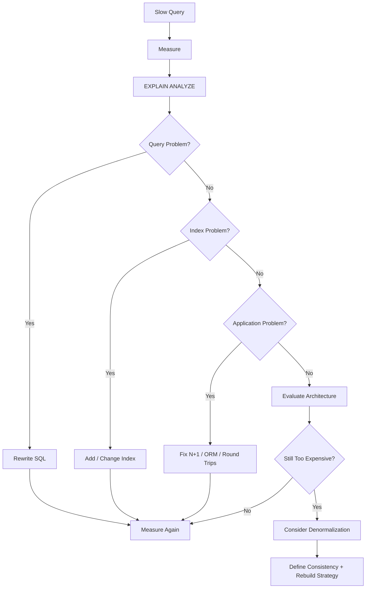
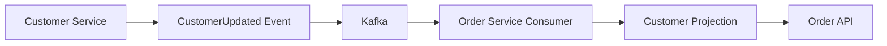

# 13- When to Denormalize

## Overview

Denormalization is the deliberate introduction of redundant or precomputed data into a database or read model to improve performance, reduce query complexity, or decouple a workload from a normalized transactional schema.

The important distinction is **intentional redundancy**. Duplicate data is not automatically bad database design. It becomes a design problem when multiple copies can diverge without a well-defined ownership and synchronization strategy.

For production systems, the usual approach is:

```text
Normalize for correctness
        ↓
Measure the workload
        ↓
Optimize queries and indexes
        ↓
Identify the actual bottleneck
        ↓
Denormalize only where justified
        ↓
Define consistency + rebuild strategy
```

Denormalization should therefore be treated as a performance and architecture decision, not as an alternative database-design philosophy.

## Why Denormalization Exists

A normalized relational schema minimizes unnecessary duplication and gives each business fact a clear home. However, highly optimized read workloads can repeatedly reconstruct the same information through:

- Multiple joins
- Aggregations
- Sorting
- Filtering
- Complex calculations
- Cross-service requests
- Repeated lookups

If the same expensive computation occurs millions of times, storing a derived representation can be cheaper than recomputing it for every request.

For example:

```text
Normalized model

customers
orders
order_items
products

        ↓ JOIN + AGGREGATE

Order History API
```

A denormalized read model can instead provide:

```text
order_history_view
------------------
order_id
customer_name
order_total
item_count
last_updated
```

The API can read one optimized representation rather than reconstructing the result repeatedly.

## Normalization vs Denormalization

| Dimension | Normalization | Denormalization |
|---|---|---|
| Data duplication | Minimized | Intentional |
| Write complexity | Usually lower | Usually higher |
| Read complexity | Can require joins | Often simpler |
| Consistency | Easier to maintain | Requires synchronization |
| Storage | Usually lower | Usually higher |
| Read performance | Often good with indexes | Can be better for targeted workloads |
| Write performance | Often predictable | Can degrade due to propagation |
| Recovery | Simpler source of truth | Requires rebuild strategy |
| Best fit | OLTP and transactional data | Hot reads, projections, aggregates |
| Primary risk | Excessive joins or fragmentation | Stale or inconsistent derived data |

## When to Denormalize

Denormalization is appropriate when there is a concrete reason to trade write and consistency complexity for faster or simpler reads.

Common scenarios include:

- Very high read-to-write ratios
- Expensive repeated joins
- Expensive repeated aggregations
- Strict API latency requirements
- Large-scale dashboards
- Search-oriented read models
- Service-specific projections
- Materialized aggregates
- Historical snapshots
- Reporting workloads
- Systems where synchronous cross-service calls are too expensive

The decision should be supported by production measurements rather than assumptions.

## First Fix the Real Performance Problem

Denormalization should not be the first response to a slow query.

Use an optimization sequence such as:



Before denormalizing, inspect:

- `EXPLAIN (ANALYZE, BUFFERS)`
- Query latency
- Rows scanned
- Index usage
- Join cardinality
- Sort operations
- Buffer reads
- Database CPU
- Disk I/O
- Lock contention
- Application query count
- Connection pool utilization

A missing composite index can often be fixed with substantially less complexity than maintaining a second copy of the data.

## Common Forms of Denormalization

Denormalization does not always mean adding duplicate columns to existing tables. There are several strategies.

### Duplicate Attributes

Store frequently accessed attributes alongside the referencing record.

```text
orders
---------------------------------------------
order_id
customer_id
customer_name
customer_email
total_amount
```

This removes a join for a common read path.

The trade-off is that customer changes now require synchronization.

### Precomputed Aggregates

Store values that are expensive to calculate repeatedly.

For example:

```text
product
----------------
product_id
review_count
average_rating
```

instead of calculating:

```sql
SELECT
    COUNT(*),
    AVG(rating)
FROM reviews
WHERE product_id = $1;
```

on every product request.

The derived values must have a defined update strategy.

### Materialized Views

A database can persist the result of an expensive query.

For example:

```sql
CREATE MATERIALIZED VIEW daily_sales AS
SELECT
    DATE(created_at) AS sales_date,
    COUNT(*) AS order_count,
    SUM(total_amount) AS revenue
FROM orders
GROUP BY DATE(created_at);
```

The view can then be indexed and queried efficiently.

```sql
CREATE INDEX daily_sales_date_idx
    ON daily_sales (sales_date);
```

The trade-off is that the materialized view is not automatically current with every underlying transaction.

### Dedicated Read Models

A separate table can be shaped around a specific API or query.

```text
Transactional model
-------------------
customers
orders
order_items
products

             │
             ▼
      projection pipeline
             │
             ▼

Read model
----------
order_id
customer_name
order_total
item_count
latest_status
```

This is common in systems using event-driven architectures or CQRS-style read models.

### Historical Snapshots

Some duplication is required because the value represents a fact at a specific point in time.

For example:

```text
products.current_price
```

and:

```text
order_items.unit_price
```

are not necessarily redundant representations of the same fact.

`current_price` represents the current catalog state.

`unit_price` represents the price agreed upon for the historical order.

Changing the product's current price must not alter historical orders.

## Denormalization for Read-Heavy APIs

Consider an API:

```text
GET /customers/{id}/order-history
```

The normalized implementation might require:

```sql
customers
    ↓
orders
    ↓
order_items
    ↓
products
```

and potentially additional aggregation.

If the endpoint receives extremely high traffic, the same joins may be repeated constantly.

A read model can instead contain exactly what the endpoint needs:

```text
customer_order_history
----------------------
customer_id
order_id
customer_name
order_total
item_count
latest_status
created_at
```

The API becomes:

```sql
SELECT
    order_id,
    customer_name,
    order_total,
    item_count,
    latest_status,
    created_at
FROM customer_order_history
WHERE customer_id = $1
ORDER BY created_at DESC
LIMIT 50;
```

This can substantially reduce database work for a hot read path.

The important architectural distinction is that this table should normally be considered **derived data**, not the authoritative source of customer or order information.

## Denormalization and Microservices

Denormalization becomes particularly useful when data crosses service boundaries.

Suppose:

```text
Order Service
     │
     │ needs customer display name
     ▼
Customer Service
```

If every order request synchronously calls Customer Service, latency and availability become coupled.

A projection can instead store the required customer information locally:



The Order Service can now serve the read locally.

The trade-off is eventual consistency:

```text
Customer updated
      ↓
Event published
      ↓
Consumer processes event
      ↓
Projection updated
```

During that interval, the Order Service may temporarily return the previous customer name.

This is acceptable for some display-oriented use cases but inappropriate when stale data could violate a critical business invariant.

## Choosing What to Duplicate

Do not duplicate an entire entity merely because one attribute is needed.

Instead, identify the exact read requirement.

For example, if an order page requires:

```text
customer_name
customer_avatar
```

the read model may store only those fields.

Avoid blindly copying:

```text
customer_id
name
email
phone
address
preferences
billing_information
status
...
```

unless the workload actually requires them.

Smaller projections provide:

- Less storage
- Lower synchronization cost
- Smaller indexes
- Lower event payloads
- Fewer consistency relationships
- Easier rebuilds

## Consistency Models

Every denormalized representation needs an explicit consistency model.

### Strong Consistency

The derived representation is updated as part of the same transaction as the authoritative data.

This is useful when stale data is unacceptable, but it increases transaction complexity.

### Transactionally Consistent Derived Data

A value can sometimes be maintained within the same database transaction.

For example:

```sql
BEGIN;

INSERT INTO orders (
    order_id,
    customer_id,
    total_amount
)
VALUES ($1, $2, $3);

UPDATE customers
SET order_count = order_count + 1
WHERE customer_id = $2;

COMMIT;
```

This keeps both values consistent within the same database transaction.

However, the duplicated field becomes another invariant that must be maintained by every write path.

### Eventual Consistency

The source transaction succeeds first, and the derived representation is updated asynchronously.

```text
Source DB
   │
   ▼
Outbox / Event
   │
   ▼
Kafka
   │
   ▼
Consumer
   │
   ▼
Read Model
```

This improves decoupling and write-path latency but introduces temporary staleness and operational complexity.

## The Outbox Pattern

When denormalization is driven by events, publishing directly to Kafka after a database transaction can create a failure window.

For example:

```text
BEGIN
  UPDATE orders
COMMIT

publish Kafka event
```

If the process crashes after `COMMIT` but before publishing, the read model may never receive the event.

The transactional outbox pattern addresses this by storing the event in the same transaction:

```sql
BEGIN;

UPDATE orders
SET status = 'shipped'
WHERE order_id = $1;

INSERT INTO outbox_events (
    event_type,
    aggregate_id,
    payload,
    created_at
)
VALUES (
    'OrderShipped',
    $1,
    $2,
    CURRENT_TIMESTAMP
);

COMMIT;
```

A separate publisher can then deliver the outbox event to Kafka.

This creates a more reliable path:

```text
Database Transaction
        │
        ├── Source Change
        │
        └── Outbox Event
                 │
                 ▼
              Publisher
                 │
                 ▼
               Kafka
                 │
                 ▼
             Projection
```

## Idempotency and Duplicate Events

Denormalized projections must assume that event delivery can fail and retry.

A consumer should therefore be designed to tolerate duplicate events.

For example, maintain an event identifier:

```text
processed_events
----------------
event_id PRIMARY KEY
```

or use a deterministic projection update.

Conceptually:

```text
Event A
   ↓
Projection updated
   ↓
Consumer crashes
   ↓
Event A delivered again
   ↓
Projection remains correct
```

At-least-once delivery without idempotent consumers can produce corrupted counters or duplicated records.

## Ordering and Out-of-Order Events

Event-driven projections may receive events out of order.

For example:

```text
OrderCreated
OrderShipped
OrderCancelled
```

could arrive as:

```text
OrderCreated
OrderCancelled
OrderShipped
```

A robust projection may need:

- Event versions
- Sequence numbers
- Timestamps where appropriate
- Optimistic concurrency checks
- State-transition validation

For example:

```text
aggregate_version = 12
```

A consumer can reject or defer an event whose version is older than the version already applied.

Do not assume message arrival order automatically represents business order.

## Rebuilding Denormalized Data

A senior-level denormalization design must answer:

> Can the derived data be deleted and rebuilt?

Ideally:

```text
Authoritative Data
       │
       ▼
Rebuild / Backfill
       │
       ▼
Derived Read Model
```

For example:

```sql
TRUNCATE TABLE customer_order_history;
```

followed by a controlled backfill from authoritative tables or events.

If the projection cannot be rebuilt, it may contain too much independent state or insufficient source information.

Rebuildability is a major operational advantage.

## Backfills and Schema Changes

When the source schema or projection schema changes, production systems may need to backfill millions or billions of rows.

Use controlled processes:

- Batch processing
- Rate limiting
- Checkpointing
- Retry handling
- Progress metrics
- Idempotent operations
- Monitoring
- Rollback or reprocessing strategy

Avoid a single unbounded transaction such as:

```sql
INSERT INTO read_model
SELECT ...
FROM very_large_table;
```

for a large production dataset unless the operational impact has been evaluated.

Large backfills can create:

- Excessive WAL
- Replication lag
- Lock contention
- High I/O
- CPU saturation
- Storage pressure

## Denormalization and Indexing

Denormalization does not eliminate the need for indexes.

A read model should still be indexed around actual access patterns.

For example:

```sql
CREATE INDEX customer_order_history_customer_created_idx
    ON customer_order_history (
        customer_id,
        created_at DESC
    );
```

If the API performs:

```sql
WHERE customer_id = $1
ORDER BY created_at DESC
LIMIT 50
```

the index directly supports the access pattern.

Avoid indexing every projected column. Additional indexes increase:

- Storage
- Write cost
- Vacuum work
- Maintenance
- Cache pressure

## Denormalization and PostgreSQL

PostgreSQL provides several mechanisms that can reduce the need for manual denormalization:

- Composite indexes
- Partial indexes
- Covering indexes using `INCLUDE`
- Materialized views
- Partitioning
- Window functions
- Common table expressions
- Efficient join algorithms

For example, a covering index may eliminate heap access for a particular read path:

```sql
CREATE INDEX orders_customer_created_covering_idx
    ON orders (customer_id, created_at DESC)
    INCLUDE (order_id, total_amount);
```

Whether this is beneficial should be validated with execution plans and workload measurements.

Do not assume a denormalized table is automatically faster than a well-indexed normalized schema.

## Denormalization and Caching

Caching and denormalization solve related but different problems.

```text
Normalized database
        │
        ├── Redis cache
        │
        └── Denormalized read model
```

Redis is generally an ephemeral performance layer.

A persistent denormalized table is part of the application's data architecture and requires a durable synchronization and recovery strategy.

A cache should normally be disposable:

```text
Cache lost
   ↓
Read from source
   ↓
Rebuild cache
```

A persistent projection should likewise have a documented rebuild process.

## When to Denormalize Into the Primary Database

Denormalization inside the same PostgreSQL database can be appropriate when:

- The read path is extremely common.
- The duplicated data has a clear owner.
- Updates happen frequently enough to maintain it transactionally.
- Cross-table computation is measurably expensive.
- A separate service or storage system would add unnecessary complexity.

Example:

```text
products
--------
product_id
review_count
average_rating
```

This can work well when the application maintains the aggregate reliably.

The downside is that every review write may now affect the product aggregate.

## When to Use a Separate Read Model

Prefer a separate read model when:

- The read shape is substantially different from the transactional schema.
- Read traffic is much higher than write traffic.
- The representation is derived from multiple aggregates.
- The workload needs independent scaling.
- Eventual consistency is acceptable.
- The read model may eventually move to another datastore.

For example:

```text
PostgreSQL
    │
    ▼
Kafka
    │
    ├── Search Projection → OpenSearch
    ├── Analytics Projection → Warehouse
    └── API Projection → PostgreSQL / DynamoDB
```

This allows each workload to use an appropriate storage model.

## Production Decision Framework

Use the following decision sequence.

### Establish the Requirement

Define:

- Target latency
- Traffic volume
- Read/write ratio
- Consistency requirement
- Availability requirement
- Data freshness requirement
- Storage constraints

### Measure the Current Design

Capture:

- P50/P95/P99 latency
- CPU
- I/O
- Query execution time
- Buffer usage
- Rows scanned
- Query frequency
- Lock contention

### Optimize the Normalized Design

Try:

- Query rewriting
- Composite indexes
- Covering indexes
- Partial indexes
- ORM optimization
- Batch queries
- Connection-pool tuning
- Read replicas
- Caching

### Evaluate Denormalization

Ask:

```text
Will duplication materially reduce the bottleneck?
What consistency model is acceptable?
Who owns the data?
How is it updated?
What happens when updates fail?
Can it be rebuilt?
How much storage will it require?
How will backfills work?
How will stale data be detected?
```

### Validate Operationally

Load-test the design before rollout.

Measure both:

```text
Read performance improvement
```

and:

```text
Additional write + synchronization cost
```

A 10× faster read query may not justify a 20× increase in write amplification for a write-heavy system.

## Monitoring Denormalized Systems

A denormalized system requires monitoring beyond normal database metrics.

Track:

| Metric | Why It Matters |
|---|---|
| Projection lag | Measures freshness |
| Event consumer failures | Detects synchronization failures |
| Event retry count | Detects unstable consumers |
| Dead-letter events | Identifies unprocessable changes |
| Projection row count | Detects missing/duplicate data |
| Rebuild duration | Measures recoverability |
| Source vs projection reconciliation | Detects silent divergence |
| Read-model latency | Measures user-facing performance |
| Kafka consumer lag | Indicates processing backlog |
| Database CPU/I/O | Detects infrastructure pressure |

For critical projections, periodic reconciliation can compare authoritative and derived data.

## Security Considerations

Denormalization can accidentally expand the security boundary.

Suppose the source table contains:

```text
customer_id
name
email
phone
billing_information
internal_notes
```

A read model should not copy all fields merely because they are available.

Project only the fields required by the consumer:

```text
customer_id
display_name
avatar_url
```

Benefits include:

- Smaller data footprint
- Reduced accidental exposure
- Simpler access control
- Lower compliance scope
- Easier deletion workflows

This is especially important when data is copied across services, databases, regions, or analytical platforms.

## Cost Considerations

Denormalization trades one type of cost for another.

Potential additional costs include:

- Storage
- Additional indexes
- Write amplification
- Event processing
- Kafka throughput
- Consumer compute
- Backfills
- Replication
- Operational maintenance

A denormalized system can be cheaper overall if it removes enough database CPU or expensive synchronous service calls.

Evaluate the entire architecture rather than comparing table storage alone.

## Common Mistakes

### Denormalizing Before Measuring

Bad approach:

```text
"Joins are slow."
        ↓
Duplicate the data.
```

Better:

```text
Measure
  ↓
EXPLAIN ANALYZE
  ↓
Optimize
  ↓
Measure again
  ↓
Denormalize if required
```

### Treating Derived Data as the Source of Truth

A read model should not silently become authoritative.

Define:

```text
Source of truth → PostgreSQL
Derived model   → Read optimization
```

unless the architecture explicitly assigns ownership elsewhere.

### Forgetting Update Paths

If a value exists in five places, every relevant write path must account for those five representations.

One missed path creates divergence.

### Ignoring Failed Synchronization

Events can fail.

Consumers can crash.

Networks can fail.

Kafka can accumulate lag.

A production design needs retries, dead-letter handling where appropriate, idempotency, monitoring, and replay mechanisms.

### Using Counters Without Considering Concurrency

A naive application-level pattern:

```python
product.review_count += 1
product.save()
```

can lose updates under concurrent requests.

Database-side atomic updates are safer:

```sql
UPDATE products
SET review_count = review_count + 1
WHERE product_id = $1;
```

For distributed projections, use appropriate concurrency and idempotency mechanisms instead.

### Copying Sensitive Data Everywhere

Duplicating personal or confidential information across services increases security and compliance complexity.

Project the minimum required fields.

### No Rebuild Strategy

If a projection becomes corrupted and there is no reliable way to regenerate it, the system has created a new operational dependency.

Treat rebuildability as a design requirement.

### Over-Denormalizing

Duplicating everything can produce:

- Large rows
- Excessive write amplification
- Complex synchronization
- Larger indexes
- Higher storage costs
- Difficult schema evolution

Denormalize the specific bottleneck, not the entire domain.

## Beginner Mistakes vs Senior Engineering Concerns

| Beginner Focus | Senior Focus |
|---|---|
| "Avoid joins" | Measure actual join cost |
| "Duplicate data for speed" | Define ownership and consistency |
| "Use a cache" | Define invalidation and recovery |
| "Use Kafka" | Design idempotency, ordering, retries, and replay |
| "Create a read table" | Define projection lifecycle and rebuildability |
| "More indexes are faster" | Balance read speed against write and storage cost |
| "Eventually consistent is fine" | Verify business tolerance for staleness |
| "The query is slow" | Inspect execution plan and workload distribution |

## Interview Traps

| Question | Strong Answer |
|---|---|
| When should you denormalize? | When a measured workload justifies trading additional storage, write complexity, or consistency complexity for better read performance or architecture. |
| Should denormalization be the first optimization? | No. First inspect queries, execution plans, indexes, ORM behavior, and workload characteristics. |
| Is duplicate data always bad? | No. Historical snapshots, aggregates, caches, and read projections can intentionally duplicate data. |
| What is the biggest problem with denormalization? | Maintaining consistency between the authoritative and derived representations. |
| How do you handle eventual consistency? | Define freshness requirements, monitor lag, make consumers idempotent, handle retries, and provide replay/rebuild mechanisms. |
| Why use a read model? | To optimize a specific access pattern without forcing the transactional schema to serve every workload. |
| How do you recover a corrupted read model? | Rebuild it from authoritative data or replayable events. |
| Why is the outbox pattern useful? | It atomically records the source change and the event to prevent losing an event between a database commit and message publication. |

## Practical Checklist

Before introducing denormalization:

- [ ] A measurable performance or architectural problem exists.
- [ ] The current query plan has been inspected.
- [ ] Appropriate indexes have been evaluated.
- [ ] N+1 queries and unnecessary round trips have been eliminated.
- [ ] The read/write ratio is understood.
- [ ] The required consistency model is explicit.
- [ ] The authoritative source is clearly defined.
- [ ] Every synchronization path is identified.
- [ ] Duplicate event handling is designed.
- [ ] Event ordering requirements are understood.
- [ ] Projection lag is measurable.
- [ ] Failed updates can be retried.
- [ ] The derived representation can be rebuilt.
- [ ] Backfill procedures are defined.
- [ ] Security-sensitive fields are minimized.
- [ ] Storage and operational costs have been estimated.
- [ ] Load testing confirms the expected benefit.

## Key Takeaways

- **Denormalize only for a measured workload or explicit architectural requirement, not because joins are theoretically undesirable.**
- **Treat denormalized data as a controlled trade-off: faster reads in exchange for additional storage, write, synchronization, and operational complexity.**
- **Every derived representation needs clear ownership, consistency semantics, idempotent updates, monitoring, and a reliable rebuild strategy.**
- **For microservices, read projections can remove synchronous dependencies, but they introduce eventual consistency, event ordering, retry, and replay concerns.**
- **The safest production strategy is usually normalized transactional data plus targeted denormalized read models, aggregates, caches, or materialized views for proven hot paths.**