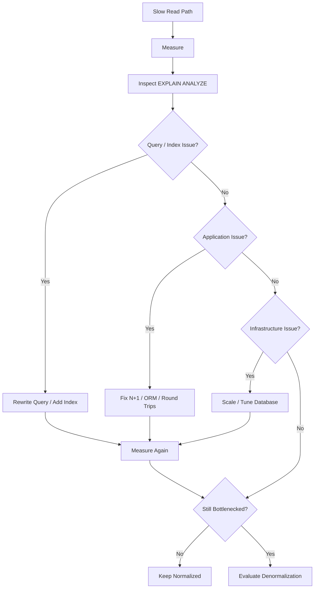
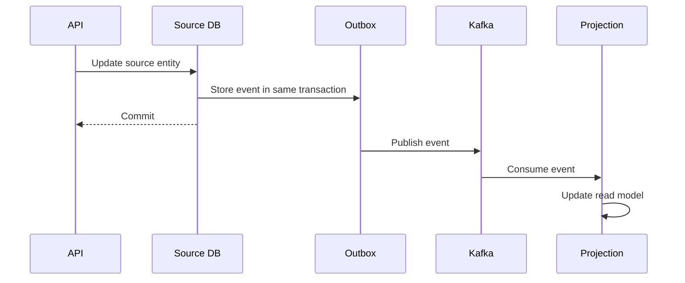

# 14- Choosing Between Normalization and Denormalization

## Overview

Normalization and denormalization are not competing rules where one is universally correct. They are design choices used to balance **data integrity, write complexity, read performance, storage cost, and operational complexity**.

A normalized relational schema keeps each business fact in an appropriate location and uses relationships to reconstruct the required view. A denormalized schema intentionally duplicates or precomputes information to optimize a specific workload.

A production-oriented decision process is:

```text
Business requirements
        ↓
Model the data correctly
        ↓
Prefer a normalized transactional design
        ↓
Measure real workload
        ↓
Optimize queries and indexes
        ↓
Identify remaining bottleneck
        ↓
Evaluate denormalization
        ↓
Define consistency + ownership + rebuild strategy
        ↓
Load test and operate
```

The key principle is:

> **Normalize by default; denormalize deliberately when measured workload or architectural requirements justify the additional complexity.**

## Normalization and Denormalization

### Normalization

Normalization decomposes data into related tables so that each fact has a clear owner and unnecessary redundancy is minimized.

For an e-commerce system:

```text
customers
    │
    └── orders
          │
          └── order_items
                 │
                 └── products
```

Customer information belongs to `customers`, order information belongs to `orders`, and product information belongs to `products`.

A query can reconstruct the required representation with joins.

### Denormalization

Denormalization intentionally stores information in a form optimized for a particular workload.

For example:

```text
customer_order_summary
----------------------
customer_id
customer_name
order_count
total_spend
last_order_at
```

The data may be derived from several normalized tables but is stored explicitly because the application repeatedly needs that exact representation.

## Core Trade-Off

The fundamental trade-off can be expressed as:

```text
Normalization
    ↓
Less duplication
    ↓
Simpler consistency
    ↓
Potentially more joins / computation

Denormalization
    ↓
More duplication / precomputation
    ↓
Potentially faster or simpler reads
    ↓
More synchronization / write complexity
```

Neither side is automatically faster or better.

A normalized schema with appropriate indexes can outperform a poorly designed denormalized schema, while a carefully designed read model can outperform repeated complex joins by a large margin.

## Decision Criteria

Evaluate the design across several dimensions.

| Factor | Prefer Normalization | Consider Denormalization |
|---|---|---|
| Data integrity | Critical | Still required, but derived copies can exist |
| Write volume | High | Lower or manageable |
| Read volume | Moderate | Very high |
| Read query complexity | Low | High and repetitive |
| Joins | Cheap / selective | Expensive at scale |
| Aggregations | Infrequent | Repeated and expensive |
| Consistency requirement | Strong | Eventual consistency acceptable |
| Data duplication | Undesirable | Acceptable |
| Schema simplicity | Important | Read optimization more important |
| Operational complexity | Must remain low | Additional infrastructure acceptable |
| Rebuildability | Less relevant | Essential for derived data |

## Start With a Normalized Model

For transactional systems, normalization should generally be the starting point.

Consider an order system:

```sql
CREATE TABLE customers (
    customer_id BIGINT GENERATED ALWAYS AS IDENTITY PRIMARY KEY,
    name TEXT NOT NULL,
    email TEXT NOT NULL UNIQUE
);

CREATE TABLE orders (
    order_id BIGINT GENERATED ALWAYS AS IDENTITY PRIMARY KEY,
    customer_id BIGINT NOT NULL REFERENCES customers(customer_id),
    status TEXT NOT NULL,
    created_at TIMESTAMPTZ NOT NULL DEFAULT CURRENT_TIMESTAMP
);

CREATE TABLE order_items (
    order_id BIGINT NOT NULL REFERENCES orders(order_id),
    product_id BIGINT NOT NULL REFERENCES products(product_id),
    quantity INTEGER NOT NULL,
    unit_price NUMERIC(12, 2) NOT NULL,
    PRIMARY KEY (order_id, product_id)
);
```

This design gives each fact a clear location.

For example:

- Customer email is owned by `customers`.
- Order status is owned by `orders`.
- Ordered quantity is owned by `order_items`.
- Historical unit price belongs to the order item because it represents the price at purchase time.

Normalization makes updates predictable and prevents many classes of update anomalies.

## Why Normalization Is Usually the Default

A normalized transactional model provides several important properties.

### Clear Ownership

Every business fact has an authoritative location.

```text
customers.email
        ↓
single source of truth
```

There is no question about which copy should be updated.

### Better Data Integrity

Foreign keys, unique constraints, checks, and transactions can enforce relationships directly in the database.

### Lower Write Amplification

Changing a customer's email normally requires updating one row rather than every order containing a copied email address.

### Easier Schema Evolution

A change to the authoritative customer representation does not require synchronizing every historical or derived copy.

### Better Long-Term Maintainability

Future developers can reason about where data comes from without discovering a large number of synchronization rules.

## Why Normalization Can Become Expensive

Normalization has costs too.

Suppose an API needs:

```text
Customer
Orders
Order totals
Item counts
Product names
Latest order status
```

The database may need multiple joins and aggregations:

```sql
SELECT
    o.order_id,
    c.name AS customer_name,
    SUM(oi.quantity * oi.unit_price) AS order_total,
    COUNT(oi.product_id) AS item_count,
    o.status,
    o.created_at
FROM orders AS o
JOIN customers AS c
    ON c.customer_id = o.customer_id
JOIN order_items AS oi
    ON oi.order_id = o.order_id
WHERE o.customer_id = $1
GROUP BY
    o.order_id,
    c.name,
    o.status,
    o.created_at
ORDER BY o.created_at DESC
LIMIT 50;
```

This may be perfectly acceptable.

At high scale, however, repeatedly executing expensive joins and aggregations can become a measurable database bottleneck.

The correct response is not immediately to duplicate the data.

First investigate the workload.

## Optimize Before Denormalizing

A practical optimization sequence is:



Before denormalizing, evaluate:

- Query execution plans
- Composite indexes
- Covering indexes
- Partial indexes
- N+1 queries
- ORM-generated SQL
- Query frequency
- Read replicas
- Connection pooling
- Caching
- Pagination strategy
- Database CPU
- I/O
- Lock contention

For PostgreSQL:

```sql
EXPLAIN (ANALYZE, BUFFERS)
SELECT
    order_id,
    customer_id,
    status,
    created_at
FROM orders
WHERE customer_id = $1
ORDER BY created_at DESC
LIMIT 50;
```

A missing index can often be fixed without changing the data model.

## When Normalization Is the Better Choice

Prefer normalization when:

### Strong Consistency Is Required

If multiple representations of the same business fact must always agree, duplication increases risk.

Examples include:

- Account balances
- Inventory ownership
- Authorization state
- Financial ledger entries
- Critical order state

For these workloads, preserving authoritative transactional state is usually more important than eliminating joins.

### Writes Are Frequent

Every duplicate representation creates additional work.

If:

```text
1 source row
    ↓
5 duplicated rows
```

must be updated on every change, write amplification can become significant.

### Data Changes Frequently

Highly mutable data is expensive to duplicate because synchronization occurs often.

### Queries Are Already Fast

If the normalized schema meets the latency and throughput requirements, denormalization creates complexity without providing meaningful value.

### The Domain Is Transaction-Heavy

Core OLTP systems generally benefit from clear ownership, constraints, and transactional consistency.

## When Denormalization Is the Better Choice

Consider denormalization when the workload has a clear read or architectural bottleneck.

### Very High Read-to-Write Ratio

Example:

```text
100,000 reads
       ↓
100 writes
```

If every read performs expensive computation, precomputing the result may be worthwhile.

### Repeated Expensive Aggregations

For example:

```sql
SELECT
    COUNT(*),
    AVG(rating)
FROM reviews
WHERE product_id = $1;
```

If this executes millions of times, storing:

```text
product.review_count
product.average_rating
```

may be justified.

### Complex Read Shapes

A transactional schema may be optimized for correctness while an API needs a completely different representation.

A dedicated read model can match the API directly.

### Eventual Consistency Is Acceptable

If users can tolerate data being a few seconds behind, an asynchronous projection can remove expensive synchronous work.

### Cross-Service Dependencies Are Expensive

In microservices, a service may need data owned by another service.

Duplicating a small read projection can avoid synchronous service-to-service calls.

## The Most Important Question: What Is the Source of Truth?

Every denormalized design should explicitly identify ownership.

For example:

```text
Customer Service
      │
      │ authoritative
      ▼
Customer Database
      │
      │ CustomerUpdated event
      ▼
Kafka
      │
      ▼
Order Service
      │
      ▼
Customer Read Projection
```

The projection contains a copy of customer information, but it does not own the customer entity.

This distinction prevents accidental bidirectional synchronization.

## Consistency Requirements Should Drive the Decision

Ask how stale the data is allowed to be.

| Requirement | Typical Approach |
|---|---|
| Must be immediately correct | Normalized transaction / transactional update |
| Milliseconds of staleness acceptable | Carefully managed projection or cache |
| Seconds of staleness acceptable | Asynchronous projection |
| Minutes of staleness acceptable | Batch aggregation / materialized view |
| Historical value required | Persist snapshot at event time |

Do not introduce eventual consistency simply because it improves performance.

The business must be able to tolerate the resulting behavior.

## Example: Product Reviews

A normalized model:

```text
products
    │
    └── reviews
```

The application can calculate:

```sql
SELECT
    COUNT(*) AS review_count,
    AVG(rating) AS average_rating
FROM reviews
WHERE product_id = $1;
```

This is appropriate when review traffic and product-page traffic are modest.

At larger scale, a product table might maintain:

```text
product_id
review_count
average_rating
```

Now:

```text
GET /products/{id}
        ↓
single product lookup
        ↓
review_count
average_rating
```

The read path becomes cheaper.

But the system must now guarantee that review writes correctly update those values.

## Example: E-Commerce Order History

Suppose the normalized schema requires several joins for:

```text
GET /customers/{id}/orders
```

If the endpoint becomes a very high-volume read path, create a purpose-built projection:

```text
customer_order_summary
----------------------
customer_id
order_id
customer_name
order_total
item_count
status
created_at
```

Then:

```sql
SELECT
    order_id,
    customer_name,
    order_total,
    item_count,
    status,
    created_at
FROM customer_order_summary
WHERE customer_id = $1
ORDER BY created_at DESC
LIMIT 50;
```

This is a strong denormalization candidate because the representation is directly aligned with a known access pattern.

## Same Database vs Separate Read Store

Denormalization does not necessarily require another database.

### Same PostgreSQL Database

Use a dedicated table or materialized view when:

- The workload remains relational.
- Strong operational simplicity is valuable.
- The derived data belongs to the same application.
- PostgreSQL can handle the workload.

Example:

```text
PostgreSQL
├── normalized transactional tables
└── denormalized read tables
```

### Separate Read Store

Use another datastore when the access pattern requires different capabilities.

For example:

```text
PostgreSQL
    │
    ▼
Kafka
    ├── Search Projection → OpenSearch
    ├── Analytics → Data Warehouse
    └── API Read Model → DynamoDB / PostgreSQL
```

This is an architectural decision rather than merely a schema optimization.

The operational cost is substantially higher, so the benefit should be clear.

## Materialized Views

A materialized view can be useful when a derived result is expensive to compute but does not need to be updated for every transaction.

```sql
CREATE MATERIALIZED VIEW monthly_sales AS
SELECT
    DATE_TRUNC('month', created_at) AS month,
    COUNT(*) AS order_count,
    SUM(total_amount) AS revenue
FROM orders
GROUP BY DATE_TRUNC('month', created_at);
```

It can then be refreshed:

```sql
REFRESH MATERIALIZED VIEW monthly_sales;
```

This is useful for reporting workloads where slightly stale data is acceptable.

The limitation is freshness and refresh cost.

For frequently changing transactional data, an incremental projection may be more appropriate.

## Denormalization and Caching

Do not confuse caching with persistent denormalization.

```text
Database
   │
   ├── Normalized source
   │
   └── Denormalized read model
             │
             ▼
          Redis cache
```

Redis can provide low-latency access to frequently requested data, but cache entries should generally be disposable.

A persistent read model has stronger operational requirements:

- Durable storage
- Synchronization
- Replay
- Reconciliation
- Backfills
- Schema migrations

If losing the representation means losing business data, it is not merely a cache.

## Event-Driven Denormalization

For asynchronous read models, the source service can publish domain events.



The projection may temporarily lag behind the source.

This architecture works well when:

- Events are durable.
- Consumers are idempotent.
- Ordering requirements are understood.
- Failures can be retried.
- Projection state can be rebuilt.

## Transactional Outbox

Publishing an event directly after committing the source transaction creates a failure window:

```text
COMMIT database
      ↓
process crashes
      ↓
event never published
```

The transactional outbox pattern stores the event in the same transaction:

```sql
BEGIN;

UPDATE orders
SET status = 'shipped'
WHERE order_id = $1;

INSERT INTO outbox_events (
    event_id,
    event_type,
    aggregate_id,
    payload,
    created_at
)
VALUES (
    $2,
    'OrderShipped',
    $1,
    $3,
    CURRENT_TIMESTAMP
);

COMMIT;
```

A publisher then forwards the outbox event to Kafka.

This makes the source change and event creation atomic.

## Idempotency

Asynchronous delivery commonly involves retries.

A projection consumer must therefore tolerate duplicate events.

For example:

```text
Event 123
   ↓
Projection updated
   ↓
Consumer crashes
   ↓
Event 123 retried
   ↓
Projection must remain correct
```

Use mechanisms such as:

- Unique event IDs
- Idempotent updates
- Version checks
- Upserts
- Consumer-side deduplication

Avoid blindly incrementing counters for every received event unless duplicate delivery is explicitly handled.

## Rebuildability

A senior-level denormalization decision must answer:

> What happens if the read model is deleted or becomes corrupted?

A healthy architecture allows:

```text
Authoritative Data
        ↓
Replay / Backfill
        ↓
Rebuilt Projection
```

For example:

```text
orders
  │
  ├── historical data
  │
  ▼
rebuild job
  │
  ▼
customer_order_summary
```

Rebuildability reduces operational risk and makes schema evolution easier.

A derived model that cannot be reconstructed should be treated much more carefully because it has effectively become an independent source of state.

## Data Freshness

Define freshness explicitly.

For example:

```text
Projection SLA:
P95 freshness < 5 seconds
```

Monitor the actual value rather than assuming the consumer is keeping up.

Useful metrics include:

- Event age
- Consumer lag
- Projection update timestamp
- Failed events
- Retry count
- Dead-letter queue size
- Reconciliation failures

For user-facing systems, expose or internally track enough information to determine whether the projection is healthy.

## Write Amplification

Denormalization can make writes substantially more expensive.

Suppose:

```text
One order update
    ↓
orders
    ↓
customer summary
    ↓
search projection
    ↓
analytics projection
```

One logical change may produce multiple physical writes.

At scale, this affects:

- Database CPU
- WAL volume
- Replication traffic
- Kafka throughput
- Consumer capacity
- Storage
- Network bandwidth

Therefore, evaluate **total system cost**, not just read latency.

## Storage and Index Costs

Duplicated data consumes storage.

Indexes on denormalized tables add additional storage and write maintenance.

For example:

```sql
CREATE INDEX customer_order_summary_customer_created_idx
ON customer_order_summary (
    customer_id,
    created_at DESC
);
```

This is useful when the primary access pattern is:

```sql
WHERE customer_id = $1
ORDER BY created_at DESC
LIMIT 50;
```

But unnecessary indexes increase write cost.

Design indexes around actual query patterns.

## Security and Data Governance

Every duplicate copy expands the data footprint.

If the source contains:

```text
name
email
phone
address
payment metadata
internal notes
```

do not automatically replicate every field.

A projection may need only:

```text
customer_id
display_name
avatar_url
```

This reduces:

- Exposure risk
- Storage requirements
- Access-control complexity
- Compliance scope
- Data deletion complexity

This is particularly important when data crosses service or datastore boundaries.

## High Availability and Failure Handling

Denormalized architectures introduce additional failure modes.

Consider:

```text
Source DB
    ↓
Kafka
    ↓
Projection Consumer
    ↓
Read DB
```

The source system may be healthy while the projection is stale.

Production systems should define behavior for:

- Kafka outages
- Consumer crashes
- Database failures
- Poison messages
- Schema incompatibilities
- Consumer lag
- Partial backfills
- Duplicate events
- Out-of-order events

For critical user flows, determine whether the application can fall back to the source of truth when the read model is unavailable.

## Choosing Between the Two

A practical decision matrix:

| Situation | Recommended Starting Point |
|---|---|
| Financial transaction | Normalize |
| Inventory ownership | Normalize |
| Authorization state | Normalize |
| Frequently updated entity | Normalize |
| Moderate CRUD workload | Normalize |
| Simple indexed query | Normalize |
| Repeated expensive aggregation | Consider denormalization |
| Extremely hot read endpoint | Consider denormalization |
| API-specific projection | Denormalized read model |
| Cross-service display data | Projection / denormalization |
| Search index | Specialized projection |
| Analytics workload | Materialized / analytical model |
| Historical snapshot | Store intentional snapshot |
| Cacheable hot data | Redis cache |
| Eventual consistency unacceptable | Prefer transactional source |

## Production Decision Framework

Before denormalizing, document the following:

### Workload

```text
Reads per second:
Writes per second:
Read/write ratio:
P50 latency:
P95 latency:
P99 latency:
Data size:
Growth rate:
```

### Consistency

```text
Maximum acceptable staleness:
Strong consistency required?:
Can stale data affect money or authorization?:
```

### Ownership

```text
Authoritative source:
Derived representation:
Who updates it:
Who can rebuild it:
```

### Operational Requirements

```text
Replay strategy:
Backfill strategy:
Failure handling:
Monitoring:
Alerting:
Recovery procedure:
```

If these questions cannot be answered, the denormalization design is not production-ready.

## Common Mistakes

### Denormalizing Because Joins "Are Slow"

Joins are not inherently slow.

Performance depends on:

- Cardinality
- Selectivity
- Indexes
- Query shape
- Data volume
- Execution plan
- Buffer/cache behavior

Measure the actual query before changing the schema.

### Duplicating Mutable Data Without an Owner

If `customer.email` exists in ten tables, determine exactly which copy is authoritative.

Otherwise updates become unreliable.

### Ignoring Write Cost

Optimizing a read path can accidentally make the write path much more expensive.

Always measure both.

### Introducing Eventual Consistency Without Business Approval

A user may see:

```text
Order status: shipped
```

while another projection still shows:

```text
Order status: processing
```

This may be acceptable for analytics but unacceptable for a financial workflow.

### No Replay or Rebuild Strategy

If a consumer bug corrupts millions of rows, a production team needs a way to recover.

### Treating Redis as a Permanent Source of Truth

A cache can disappear.

Persistent business state should have durable ownership elsewhere unless the architecture explicitly makes the cache datastore authoritative.

### Over-Denormalizing

Do not copy entire entities into every read model.

Project the minimum information required for the access pattern.

### Maintaining Derived Counters Naively

Application-level read-modify-write operations can lose concurrent updates.

Prefer atomic database operations where appropriate:

```sql
UPDATE products
SET review_count = review_count + 1
WHERE product_id = $1;
```

For distributed projections, use idempotency and versioning rather than assuming every event is processed exactly once.

## Beginner Mistakes vs Senior Concerns

| Beginner Question | Senior Engineering Question |
|---|---|
| Should I normalize? | What workload and invariants are we optimizing for? |
| Are joins bad? | What does the execution plan show? |
| Can I duplicate this field? | Who owns the field and how is divergence prevented? |
| Should I use Redis? | Is this cache or durable derived state? |
| Should I use Kafka? | What are the delivery, ordering, retry, and replay semantics? |
| Is eventual consistency faster? | Can the business tolerate the freshness window? |
| Is the read model faster? | What is the total write, storage, and operational cost? |
| Can we create a summary table? | How will it be rebuilt, migrated, reconciled, and monitored? |

## Interview Traps

### "Is Normalization Always Better?"

No.

Normalization is usually the safer starting point for transactional data, but targeted denormalization can be the correct production design when measured workload characteristics justify it.

### "Does Denormalization Mean Bad Database Design?"

No.

Intentional redundancy can be a valid design technique for:

- Read models
- Aggregates
- Materialized views
- Historical snapshots
- Search indexes
- Cross-service projections

### "Should You Denormalize for Every Performance Problem?"

No.

First investigate query plans, indexes, ORM behavior, caching, connection management, and application-level inefficiencies.

### "Is a Denormalized Table a Source of Truth?"

Usually not.

A projection should generally be derived from an authoritative source and be rebuildable.

### "Is Eventual Consistency Always a Problem?"

No.

It is a trade-off. It becomes a problem when the business operation requires immediate consistency.

## Practical Checklist

Before choosing normalization or denormalization:

- [ ] Identify the authoritative business facts.
- [ ] Model transactional data with clear ownership.
- [ ] Define consistency requirements.
- [ ] Measure actual read and write workloads.
- [ ] Inspect slow query execution plans.
- [ ] Optimize indexes and SQL first.
- [ ] Check for ORM N+1 queries.
- [ ] Evaluate caching where appropriate.
- [ ] Determine whether the bottleneck is actually database computation.
- [ ] Estimate the impact of denormalization on writes.
- [ ] Define synchronization semantics.
- [ ] Define projection ownership.
- [ ] Define maximum acceptable staleness.
- [ ] Make asynchronous consumers idempotent.
- [ ] Handle retries and failures.
- [ ] Monitor projection lag.
- [ ] Define reconciliation checks.
- [ ] Define backfill and rebuild procedures.
- [ ] Minimize replicated sensitive data.
- [ ] Load-test the complete system.
- [ ] Re-evaluate the decision as workload characteristics change.

## Key Takeaways

- **Normalize transactional data by default because clear ownership, constraints, and strong consistency are valuable production properties.**
- **Denormalize only when a measured workload or architectural requirement justifies the additional storage, write, consistency, and operational complexity.**
- **Optimize SQL, indexes, ORM behavior, caching, and infrastructure before changing the data model for performance.**
- **Every denormalized representation needs explicit ownership, consistency semantics, synchronization, monitoring, and a reliable rebuild or replay strategy.**
- **The best production architecture is often hybrid: normalized source-of-truth data combined with targeted aggregates, caches, materialized views, or read projections.**