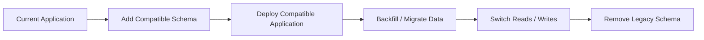

# 15- Schema Evolution

## Overview

Schema evolution is the controlled process of changing a database schema as an application and its data model change over time.

In production systems, schema changes are rarely isolated SQL operations. A change to a table can affect:

- Application code
- ORM models
- API contracts
- Background workers
- Batch jobs
- Reports
- ETL pipelines
- Read replicas
- Database indexes
- Denormalized projections
- Deployment and rollback procedures

The central challenge is **compatibility during change**. In a rolling deployment, old and new application versions can run simultaneously, so the database must often support both versions temporarily.

A safe schema evolution strategy therefore favors **small, backward-compatible changes**, explicit migration sequencing, observability, and a clear rollback or recovery strategy.

## Why Schema Evolution Matters

A database schema is a contract between persistent data and the software that consumes it.

For example:

```text
Application v1
      │
      ▼
┌───────────────┐
│   Database    │
└───────────────┘
      ▲
      │
Application v2
```

If version 2 immediately removes or changes something version 1 still requires, a rolling deployment can fail:

```text
Deploy v2
   │
   ├── Instance A → v2
   ├── Instance B → v1
   └── Instance C → v1
              │
              ▼
        incompatible schema
```

Schema evolution must therefore account for **temporal compatibility**, not only the final desired schema.

## Schema Changes and Application Deployments

A common mistake is treating these two operations as one atomic change:

```text
Change database
      ↓
Deploy application
```

In production, deployment is usually distributed and gradual.

A safer approach is:



This is commonly called an **expand-and-contract** approach.

## Expand-and-Contract

Expand-and-contract separates a breaking schema change into compatible phases.

Suppose an application currently has:

```sql
users.full_name
```

and the desired model is:

```text
users.first_name
users.last_name
```

Do not immediately rename or remove `full_name`.

Instead:

```text
Phase 1: Expand
    Add first_name and last_name

Phase 2: Migrate
    Populate new columns

Phase 3: Deploy
    Application reads/writes new columns

Phase 4: Verify
    Confirm legacy column is no longer required

Phase 5: Contract
    Remove full_name
```

This allows different application versions to coexist safely.

## Expand Phase

The expand phase introduces schema elements without breaking the current application.

```sql
ALTER TABLE users
ADD COLUMN first_name TEXT,
ADD COLUMN last_name TEXT;
```

The old application continues using:

```text
full_name
```

while the new columns exist but are not yet required.

### Production Considerations

Before executing the migration, evaluate:

- Table size
- Lock behavior
- Existing transactions
- Replication impact
- Index creation cost
- Available disk space
- Query traffic
- Maintenance windows
- Database engine behavior

A logically simple `ALTER TABLE` can have significant operational consequences depending on the database and exact operation.

## Backfilling Existing Data

Adding columns is only part of the migration.

Existing rows may need to be populated:

```sql
UPDATE users
SET
    first_name = split_part(full_name, ' ', 1),
    last_name = NULLIF(
        substring(full_name FROM position(' ' IN full_name) + 1),
        ''
    )
WHERE first_name IS NULL;
```

For a large production table, avoid assuming one massive update is always safe.

Large backfills can cause:

- Long transactions
- Lock contention
- WAL growth
- Replication lag
- Increased I/O
- Table bloat
- Resource contention with application traffic

A production backfill may instead process rows in controlled batches.

## Dual Writes

During a migration, there may be a period where both old and new representations must remain synchronized.

Conceptually:

```text
Application
    │
    ├── write full_name
    │
    ├── write first_name
    └── write last_name
```

Dual writes can provide compatibility, but they introduce consistency risk.

For example:

```text
full_name = "John Smith"
first_name = "John"
last_name = "Smyth"
```

The database now contains conflicting representations.

If dual writes are required, define:

- Which representation is authoritative
- How conflicts are resolved
- How failed writes are detected
- How existing rows are backfilled
- How synchronization is verified
- When the legacy representation can be removed

Whenever possible, prefer designs that avoid maintaining two independent authoritative representations.

## Application-Level Compatibility

During a migration, application code may need to understand both schema versions.

For example:

```python
def get_display_name(user):
    if user.first_name:
        return f"{user.first_name} {user.last_name or ''}".strip()

    return user.full_name
```

This allows a gradual migration rather than requiring every row to be migrated before deployment.

The compatibility code should have a defined removal point. Temporary migration logic that remains indefinitely becomes permanent complexity.

## Contract Phase

Once all application instances use the new schema and the migration is verified, remove the legacy structure.

```sql
ALTER TABLE users
DROP COLUMN full_name;
```

This is the **contract** phase.

Do not combine expansion and contraction into one deployment when old application versions may still be running.

## Adding a Column

Adding a nullable column is usually one of the simplest schema changes:

```sql
ALTER TABLE orders
ADD COLUMN fulfillment_reference TEXT;
```

Existing rows can remain `NULL`.

If the field must eventually be mandatory, use a staged approach:

```text
Add nullable column
        ↓
Deploy code that writes it
        ↓
Backfill existing rows
        ↓
Validate data
        ↓
Make NOT NULL
```

For example:

```sql
ALTER TABLE orders
ALTER COLUMN fulfillment_reference SET NOT NULL;
```

The final constraint should only be added after existing and new data satisfy it.

## Adding a NOT NULL Column

This is a common migration trap.

Avoid assuming this is always safe:

```sql
ALTER TABLE orders
ADD COLUMN source TEXT NOT NULL;
```

Existing rows have no value for the new column, so the database must somehow establish a valid value.

A safer conceptual sequence is:

```sql
ALTER TABLE orders
ADD COLUMN source TEXT;
```

Then:

```sql
UPDATE orders
SET source = 'legacy'
WHERE source IS NULL;
```

Then enforce the invariant:

```sql
ALTER TABLE orders
ALTER COLUMN source SET NOT NULL;
```

For large tables, perform the backfill incrementally rather than issuing one uncontrolled transaction.

## Adding Indexes

Indexes can be operationally expensive on large tables.

In PostgreSQL, when appropriate, use concurrent index creation:

```sql
CREATE INDEX CONCURRENTLY orders_customer_created_idx
ON orders (customer_id, created_at DESC);
```

`CREATE INDEX CONCURRENTLY` reduces blocking of normal writes but has different operational and transactional behavior than ordinary index creation.

For example, PostgreSQL does not allow `CREATE INDEX CONCURRENTLY` inside a transaction block.

Migration frameworks therefore need to account for this explicitly.

## Renaming Columns

A direct rename:

```sql
ALTER TABLE users
RENAME COLUMN name TO display_name;
```

can break old application instances that still reference `name`.

For a rolling deployment, a compatibility sequence is safer:

```text
Add display_name
      ↓
Populate display_name
      ↓
Application supports both
      ↓
Deploy new application
      ↓
Stop using name
      ↓
Verify
      ↓
Drop name
```

The same principle applies to table renames.

## Dropping Columns

Dropping a column is generally a **destructive operation**.

Before:

```sql
ALTER TABLE users
DROP COLUMN legacy_status;
```

verify that the column is not referenced by:

- Application code
- ORM models
- Background workers
- Reporting queries
- BI tools
- ETL jobs
- Stored procedures
- Data pipelines
- Operational scripts

A useful production rule is:

> **Stop using first; delete later.**

This gives the system time to prove that the old schema element is no longer required.

## Changing Data Types

Changing a column type can be more complicated than changing a column name.

For example:

```sql
ALTER TABLE accounts
ALTER COLUMN balance TYPE NUMERIC(19, 4);
```

Potential concerns include:

- Existing values
- Conversion cost
- Index compatibility
- Locking
- Application serialization
- ORM behavior
- API representation
- Precision and rounding

For risky type changes, use a new column and migrate explicitly:

```text
old_column
    │
    ▼
new_column
    │
    ▼
backfill
    │
    ▼
application switch
    │
    ▼
remove old_column
```

This provides greater control and makes validation easier.

## Large-Table Migrations

Large tables require special treatment.

A table containing:

```text
10 million rows
100 million rows
1 billion rows
```

should not automatically be migrated using the same strategy as a development database.

Evaluate:

| Concern | Questions |
|---|---|
| Locking | Will the operation block reads or writes? |
| Duration | Could it run for minutes or hours? |
| WAL | How much write-ahead log could it generate? |
| Replication | Could replicas fall behind? |
| I/O | Can storage handle the additional load? |
| CPU | Will application queries compete for resources? |
| Disk | Is there sufficient temporary and permanent space? |
| Rollback | Can the operation actually be reversed? |
| Traffic | Is the table heavily used during deployment? |

Run migrations against production-like data volumes before production deployment.

## Backfill Strategy

For large datasets, process data in bounded batches.

Conceptually:

```text
Find next batch
      ↓
Update batch
      ↓
Commit
      ↓
Measure
      ↓
Repeat
```

A keyset-based strategy is often preferable to repeatedly scanning increasingly large offsets.

Example:

```sql
UPDATE orders
SET source = 'legacy'
WHERE order_id > $1
  AND order_id <= $2
  AND source IS NULL;
```

The exact strategy depends on the table's primary key, data distribution, workload, and database engine.

Backfills should usually have:

- Bounded batch size
- Transaction boundaries
- Progress tracking
- Rate limiting where necessary
- Retry handling
- Monitoring
- A safe restart mechanism

## Migration Idempotency

A migration or operational backfill should be designed carefully so that failures do not leave the system unrecoverable.

For example:

```sql
UPDATE orders
SET source = 'legacy'
WHERE source IS NULL
  AND order_id > $1
  AND order_id <= $2;
```

Running the operation again does not modify rows already populated.

Idempotency is particularly valuable for:

- Deployment retries
- Failed CI/CD jobs
- Interrupted backfills
- Kubernetes job restarts
- Disaster recovery procedures

## Database Migrations in Django

Django migrations provide versioned schema changes.

For example:

```bash
python manage.py makemigrations
python manage.py migrate
```

A migration might contain:

```python
from django.db import migrations, models


class Migration(migrations.Migration):
    dependencies = [
        ("orders", "0012_previous"),
    ]

    operations = [
        migrations.AddField(
            model_name="order",
            name="source",
            field=models.CharField(
                max_length=32,
                null=True,
            ),
        ),
    ]
```

For large production changes, do not assume that because Django generated a migration, the migration is automatically operationally safe.

Review:

- Generated SQL
- Lock behavior
- Table size
- Index creation strategy
- Backfill requirements
- Transaction behavior
- Deployment ordering

Django's migration abstraction does not eliminate database-level operational concerns.

## Schema Evolution in Microservices

In microservices, schema evolution happens at multiple boundaries:

```text
Service A
   │
   ├── Database schema
   │
   └── API / Event contract
              │
              ▼
          Service B
              │
              └── Consumer
```

Changing a database schema can affect only one service if the database is properly owned.

Changing an event contract can affect many independent consumers.

For example:

```json
{
  "event_type": "OrderCreated",
  "order_id": "123",
  "customer_id": "456"
}
```

Adding an optional field is generally easier to roll out than removing or changing the meaning of an existing field.

Prefer additive evolution:

```text
Old event:
order_id
customer_id

New event:
order_id
customer_id
currency
```

Consumers that understand `currency` can use it while older consumers continue functioning.

## Schema Evolution and API Compatibility

Database schema and API schema should not be changed independently without considering their relationship.

For example:

```text
PostgreSQL
    ↓
Django / FastAPI
    ↓
REST / gRPC
    ↓
Clients
```

Removing a database field may require changes to the API representation.

A safe sequence may be:

```text
Stop exposing field
      ↓
Deploy clients / consumers
      ↓
Verify usage
      ↓
Stop application dependency
      ↓
Drop database field
```

The correct ordering depends on whether the API itself has external consumers.

## Rollback vs Roll-Forward

A critical production distinction is that **application rollback does not necessarily imply database rollback**.

Suppose deployment `v2` adds a column:

```text
Database = v2 schema
Application = v2
```

If `v2` fails and the application rolls back:

```text
Database = v2 schema
Application = v1
```

This is safe only if the v2 schema remains backward compatible with v1.

Therefore, prefer migrations that allow:

```text
DB v2
  ↑
supports
  ↑
App v1 + App v2
```

rather than relying on destructive database rollback.

### Why Database Rollbacks Are Difficult

A migration may:

- Delete data
- Rewrite values
- Change types
- Drop indexes
- Remove columns
- Trigger large table rewrites
- Generate significant WAL
- Interact with concurrent transactions

A reverse migration may therefore be expensive or impossible.

For destructive changes, backups and forward recovery are often more realistic than assuming a perfect reverse migration exists.

## Deployment Ordering

A robust deployment pipeline separates database and application concerns.

Example:

```text
CI
 │
 ├── Test migration
 ├── Test application
 └── Validate compatibility
       │
       ▼
Production
 │
 ├── Expand schema
 │
 ├── Deploy application
 │
 ├── Backfill
 │
 ├── Verify
 │
 └── Contract schema
```

The exact order depends on the migration.

For high-risk migrations, consider:

- Staged rollouts
- Feature flags
- Canary deployments
- Migration observability
- Manual approval gates
- Automated rollback of application deployment
- Delayed destructive cleanup

## Feature Flags and Schema Changes

Feature flags can decouple schema deployment from feature activation.

```text
Schema exists
     ↓
Application supports new schema
     ↓
Feature flag OFF
     ↓
Validation
     ↓
Feature flag ON
     ↓
Observe
```

This is useful when a new feature requires significant database changes but the application deployment needs to be separated from customer-visible behavior.

A feature flag does not replace schema compatibility. The inactive application version must still work with the expanded schema.

## Observability

Schema changes should be observable like any other production change.

Monitor:

- Migration duration
- Database locks
- Query latency
- Error rates
- CPU
- I/O
- Connection utilization
- Replication lag
- WAL generation
- Table size
- Dead tuples / bloat
- Backfill throughput
- Backfill failures

For asynchronous migrations, track progress explicitly:

```text
Rows processed
Rows remaining
Rows failed
Processing rate
Estimated completion
Replication lag
```

## Lock Monitoring in PostgreSQL

When investigating migration impact, PostgreSQL lock information can help identify blocking sessions.

For example:

```sql
SELECT
    pid,
    usename,
    state,
    wait_event_type,
    wait_event,
    query
FROM pg_stat_activity
WHERE wait_event_type = 'Lock';
```

For production operations, correlate database lock information with deployment timestamps and application metrics.

## Migration Testing

A migration should be tested against realistic conditions.

Test:

- Empty database
- Current production-like schema
- Production-like data volume
- Large tables
- Existing indexes
- Active concurrent traffic
- Replication
- Failed migration execution
- Interrupted backfill
- Application rollback
- Retry behavior

A migration that succeeds in a local Docker PostgreSQL instance with 100 rows proves very little about its production behavior on a multi-terabyte database.

## Schema Version Compatibility

Think about schema versions explicitly.

```text
        Database Schema
             │
       ┌─────┴─────┐
       ▼           ▼
    App v1       App v2
```

During rolling deployment:

```text
Schema must support:
    App v1
    App v2
```

After migration completion:

```text
Schema supports:
    App v2
```

This temporal compatibility model is one of the most important concepts in production schema evolution.

## Common Schema Evolution Patterns

| Change | Safer Pattern |
|---|---|
| Add nullable column | Add → deploy → populate → optionally enforce |
| Add required column | Add nullable → write → backfill → validate → `NOT NULL` |
| Rename column | Add new → dual-read/write if necessary → switch → remove old |
| Remove column | Stop using → observe → remove |
| Change data type | Add new column → transform → switch → remove old |
| Large backfill | Batch → monitor → throttle → retry |
| Add large index | Use database-specific online/concurrent mechanism where appropriate |
| Change event schema | Prefer additive fields |
| Change API field | Deprecate → migrate consumers → remove |
| Denormalized projection | Update contract → rebuild/backfill → verify |

## Common Mistakes

### Making a Destructive Change First

Dropping a column before proving that nobody uses it can cause immediate production failures.

Prefer:

```text
Deprecate
→ stop usage
→ observe
→ remove
```

### Combining Expand and Contract

Doing this in one deployment:

```sql
ADD new_column;
DROP old_column;
```

can break older application instances.

Separate the operations when compatibility is required.

### Assuming Migrations Are Instant

A migration that takes milliseconds on development data may take hours on production data.

Always evaluate scale and database implementation details.

### Running Huge Backfills in One Transaction

A massive transaction can generate excessive WAL, hold resources for too long, and increase replication lag.

Use bounded batches where appropriate.

### Forgetting Background Workers

Developers often update the API application but forget:

- Celery workers
- Scheduled jobs
- Kafka consumers
- Data pipelines
- Admin scripts

Old workers may continue running against the database during deployment.

### Treating Rollback as Guaranteed

Some schema changes are irreversible.

Design deployments so that application rollback can work with the newer schema when possible.

### Leaving Dual-Write Logic Forever

Migration code often becomes permanent because nobody removes it.

Track the cleanup as an explicit engineering task and verify that the legacy path is unused.

### Ignoring External Consumers

A database field may feed:

- Reporting
- ETL
- BI
- Data science pipelines
- External integrations

Application source-code searches alone may not reveal every dependency.

### No Backfill Verification

A backfill completing successfully does not prove the resulting data is correct.

Use validation queries and reconciliation metrics.

## Production Checklist

Before deploying a schema change:

- [ ] Identify every application and worker that uses the affected schema.
- [ ] Determine whether old and new application versions can coexist.
- [ ] Classify the migration as additive, destructive, or transformational.
- [ ] Estimate table size and migration duration.
- [ ] Review generated SQL.
- [ ] Evaluate locks and transaction behavior.
- [ ] Check available disk capacity.
- [ ] Assess replication and WAL impact.
- [ ] Test against production-like data.
- [ ] Define deployment ordering.
- [ ] Define rollback or roll-forward behavior.
- [ ] Plan large backfills separately.
- [ ] Make operational jobs restartable where possible.
- [ ] Add monitoring and alerts.
- [ ] Define validation queries.
- [ ] Verify background workers and consumers.
- [ ] Identify external data consumers.
- [ ] Delay destructive cleanup until usage has stopped.
- [ ] Document the migration and recovery procedure.

## Key Takeaways

- **Treat schema changes as compatibility and deployment problems, not merely SQL changes.**
- **Use expand-and-contract for changes that must coexist with older application versions during rolling deployments.**
- **Separate large backfills and destructive cleanup from the initial schema expansion, and make them observable and restartable.**
- **Design for roll-forward recovery because many destructive database changes cannot be safely reversed.**
- **Test migrations at production-like scale and monitor locks, latency, replication, WAL, resource usage, and data correctness.**