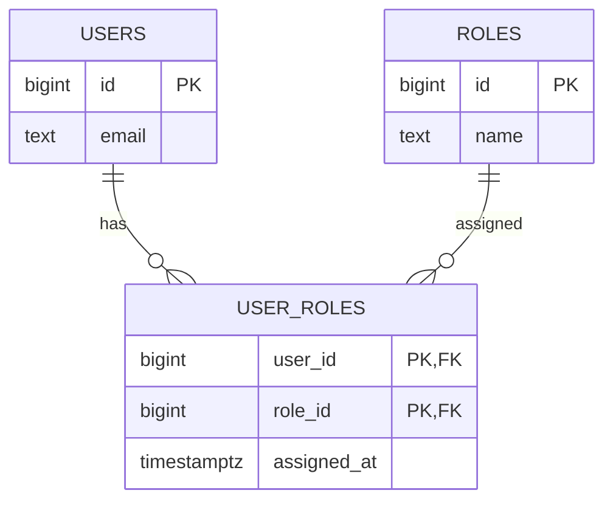
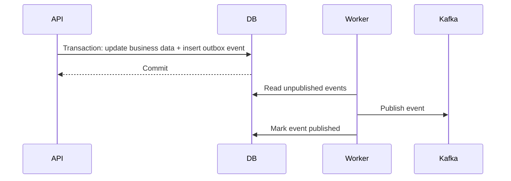
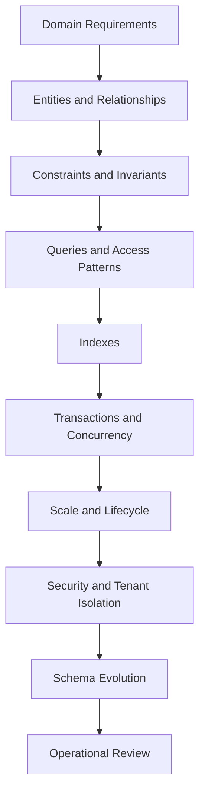

# 16- Common Database Design Mistakes

## Overview

Database design mistakes are rarely caused by not knowing SQL syntax. They usually come from incorrect assumptions about data ownership, relationships, access patterns, constraints, lifecycle, or future change.

A database schema is part of the backend system's architecture. It determines how data is stored, validated, queried, modified, migrated, replicated, backed up, and eventually retired.

A production-quality design should balance:

- Data correctness
- Referential integrity
- Query performance
- Maintainability
- Scalability
- Transactional requirements
- Operational complexity
- Schema evolution
- Security
- Cost

Normalization provides a strong default for transactional systems, but blindly normalizing or denormalizing without understanding workload characteristics can also create problems.

## Designing Tables Around the Application Instead of the Domain

A common mistake is designing tables around today's API response rather than the underlying business entities and relationships.

For example, an API may return:

```json
{
  "order_id": 1001,
  "customer_name": "Alice",
  "customer_email": "alice@example.com",
  "product_name": "Keyboard",
  "quantity": 2,
  "unit_price": 75.00
}
```

It does not mean all of these attributes belong in one table.

A more appropriate model might be:

```text
customers
    │
    └── orders
          │
          └── order_items
                    │
                    └── products
```

The API representation is a **view of the domain**, not necessarily the persistence model.

### Why This Matters

If the schema follows an API response too literally:

- Customer data gets duplicated.
- Product information becomes inconsistent.
- Updates become harder.
- Relationships become unclear.
- Schema changes become tightly coupled to API changes.

Design the persistence model around business entities and invariants first, then build API projections on top of it.

## Missing Primary Keys

Every independently identifiable entity should normally have a stable primary key.

Avoid tables such as:

```sql
CREATE TABLE customer_preferences (
    email TEXT,
    preference TEXT
);
```

without a clearly defined key.

A better design might be:

```sql
CREATE TABLE customer_preferences (
    customer_id BIGINT PRIMARY KEY,
    preference TEXT NOT NULL
);
```

The primary key provides:

- Identity
- Uniqueness
- Referential integrity
- Efficient row targeting
- A target for foreign keys

### Production Consideration

The choice between integer, UUID, and other identifier strategies should be deliberate.

| Identifier | Advantages | Trade-offs |
|---|---|---|
| `BIGINT` | Compact, efficient indexes, simple | Predictable and usually database-generated |
| UUID | Globally unique, useful across systems | Larger indexes and less locality depending on generation strategy |
| Natural key | Meaningful domain value | Business values can change and become poor identifiers |

Do not use a natural attribute as a primary key merely because it currently appears unique.

## Using Natural Keys Without Care

A natural key is an attribute with business meaning, such as:

```text
email
ISBN
country_code
```

It may appear suitable as a primary key, but business identifiers can change.

For example:

```text
customer.email
```

can change when a customer updates their email address.

Using a surrogate key:

```text
customer.id
```

allows the email to change without changing references throughout the database.

Natural keys can still be protected with a unique constraint:

```sql
ALTER TABLE customers
ADD CONSTRAINT customers_email_key UNIQUE (email);
```

The important distinction is:

> **Identity and uniqueness are related but not identical concepts.**

## Missing Foreign Keys

Application code should not be the only thing preventing invalid relationships.

Avoid:

```sql
CREATE TABLE orders (
    id BIGINT PRIMARY KEY,
    customer_id BIGINT NOT NULL
);
```

when `customer_id` is logically required to reference `customers.id`, but no foreign key exists.

Use:

```sql
CREATE TABLE orders (
    id BIGINT PRIMARY KEY,
    customer_id BIGINT NOT NULL REFERENCES customers(id)
);
```

The database can then reject:

```text
order.customer_id = nonexistent customer
```

### Why Foreign Keys Matter

They enforce invariants regardless of the write path.

Without database constraints, invalid data can enter through:

- REST APIs
- Admin interfaces
- Celery jobs
- Scripts
- Data imports
- SQL clients
- ETL pipelines

Application validation alone is insufficient for critical relational invariants.

## Incorrect Foreign Key Actions

Adding a foreign key is not enough. Its deletion behavior matters.

For example:

```sql
FOREIGN KEY (customer_id)
REFERENCES customers(id)
ON DELETE CASCADE
```

can be dangerous if deleting a customer unexpectedly deletes:

```text
customer
  └── orders
       └── order_items
            └── payments
```

Consider the business meaning before choosing:

- `CASCADE`
- `RESTRICT`
- `NO ACTION`
- `SET NULL`

| Action | Typical use |
|---|---|
| `CASCADE` | Child has no independent meaning without parent |
| `RESTRICT` / `NO ACTION` | Parent must not be deleted while dependencies exist |
| `SET NULL` | Relationship is optional and child can survive |
| No explicit action | Database default behavior applies |

Do not use `CASCADE` merely because it makes cleanup convenient.

## Storing Multiple Values in One Column

A common anti-pattern is:

```text
user_id | roles
--------|-----------------------
1       | admin,editor,reporter
```

This makes querying and enforcing relationships difficult.

Prefer a relationship table:

```text
users
roles
user_roles
```

Example:

```sql
CREATE TABLE user_roles (
    user_id BIGINT NOT NULL REFERENCES users(id),
    role_id BIGINT NOT NULL REFERENCES roles(id),
    PRIMARY KEY (user_id, role_id)
);
```

This supports:

```sql
SELECT role_id
FROM user_roles
WHERE user_id = $1;
```

### Exceptions

Arrays or JSON can be appropriate when the data is genuinely a document-like attribute and does not require relational integrity or frequent relational querying.

The mistake is not using JSON or arrays. The mistake is using them to avoid modeling relationships.

## Repeating Columns

Avoid schemas such as:

```text
phone_1
phone_2
phone_3
```

or:

```text
product_1
product_2
product_3
```

These represent a one-to-many relationship using columns instead of rows.

Prefer:

```text
customers
customer_phones
```

with one row per phone number.

Repeating columns make:

- Constraints harder
- Queries awkward
- Indexing inconsistent
- Maximum cardinality arbitrary
- Schema evolution painful

## Excessive Use of JSON

PostgreSQL's `jsonb` is powerful, but it should not become a replacement for relational modeling.

Avoid putting core transactional fields into:

```sql
metadata JSONB
```

simply because schema design feels easier.

For example, if every order must have a currency:

```text
orders.currency
```

is usually more appropriate than:

```text
orders.metadata["currency"]
```

Relational columns provide:

- Stronger type semantics
- Constraints
- Simpler queries
- Conventional indexes
- Easier data migrations
- Better schema discoverability

Use JSON when the data is naturally variable, externally defined, sparse, or document-oriented.

## Over-Normalization

Normalization reduces redundancy and update anomalies, but excessive normalization can make common operations unnecessarily complex.

For example, retrieving a product display might require joining:

```text
products
→ product_variants
→ product_attributes
→ attribute_definitions
→ localized_values
```

If the workload requires this query thousands of times per second, the design should be evaluated against actual access patterns.

Possible solutions include:

- Better indexes
- Query optimization
- Read models
- Materialized views
- Caching
- Carefully selected denormalization

The correct question is not:

> "Is this normalized enough?"

It is:

> "Does this schema preserve correctness while supporting the workload efficiently?"

## Blind Denormalization

The opposite mistake is duplicating data before proving that it is necessary.

For example:

```text
orders.customer_name
customers.name
```

creates multiple representations of the same fact.

Now the system must decide:

```text
Which value is authoritative?
What happens when the customer changes their name?
How are historical orders represented?
```

Denormalization should have an explicit reason such as:

- Measured query latency
- High read frequency
- Expensive aggregation
- Reporting workload
- Read-model requirements

It should also have a synchronization strategy.

## Missing Constraints

Application-level validation does not replace database constraints.

Weak:

```python
if quantity > 0:
    save()
```

Stronger:

```sql
ALTER TABLE order_items
ADD CONSTRAINT order_items_quantity_positive
CHECK (quantity > 0);
```

Useful constraints include:

- `NOT NULL`
- `UNIQUE`
- `PRIMARY KEY`
- `FOREIGN KEY`
- `CHECK`
- Exclusion constraints where supported and appropriate

Constraints turn business invariants into enforceable database rules.

## Incorrect Nullability

`NULL` represents the absence or unknown state of a value. It should not be used simply because a field might be inconvenient to populate.

For example:

```sql
email TEXT NULL
```

may be correct if email is genuinely optional.

But:

```sql
created_at TIMESTAMP NULL
```

is often suspicious if every row should have a creation timestamp.

Explicitly define the invariant:

```sql
created_at TIMESTAMPTZ NOT NULL DEFAULT now()
```

### Common Nullability Problems

- Treating empty string as equivalent to `NULL`
- Allowing `NULL` for mandatory attributes
- Using `NULL` to represent multiple business states
- Forgetting that `NULL = NULL` is not `TRUE`
- Creating unnecessary nullable foreign keys

If a business process has multiple states, model those states explicitly rather than overloading `NULL`.

## Confusing Empty, Unknown, and Not Applicable

These states are not necessarily equivalent:

```text
NULL
''
0
false
```

For example:

```text
discount_percentage = NULL
```

could mean "not calculated."

Whereas:

```text
discount_percentage = 0
```

could mean "calculated and no discount applies."

The schema should preserve meaningful distinctions when the business logic depends on them.

## Missing Unique Constraints

Application code may assume uniqueness without the database enforcing it.

For example:

```python
existing = User.objects.filter(email=email).first()

if not existing:
    User.objects.create(email=email)
```

Two concurrent requests can both observe no existing row and create duplicates.

The database should enforce the invariant:

```sql
ALTER TABLE users
ADD CONSTRAINT users_email_key UNIQUE (email);
```

Then application code handles a uniqueness violation appropriately.

This is a concurrency issue, not merely a validation issue.

## Incorrect Unique Constraints

A unique constraint can also be too broad.

Suppose usernames should be unique within an organization, not globally.

Incorrect:

```sql
UNIQUE (username)
```

Correct:

```sql
UNIQUE (organization_id, username)
```

The constraint should match the actual business invariant.

## Missing Composite Constraints

Many relationships have uniqueness rules involving multiple columns.

For example, a user should have at most one membership in an organization:

```sql
CREATE TABLE organization_memberships (
    organization_id BIGINT NOT NULL REFERENCES organizations(id),
    user_id BIGINT NOT NULL REFERENCES users(id),
    role TEXT NOT NULL,
    PRIMARY KEY (organization_id, user_id)
);
```

Using only an auto-generated `id` would not prevent duplicate memberships.

## Poor Index Design

Adding indexes indiscriminately is another common mistake.

Indexes improve reads but introduce:

- Additional storage
- Write amplification
- Maintenance cost
- Vacuum overhead
- More complex query planning

A production index should correspond to actual query patterns.

For example:

```sql
CREATE INDEX orders_customer_created_idx
ON orders (customer_id, created_at DESC);
```

may support:

```sql
SELECT id, created_at, total_amount
FROM orders
WHERE customer_id = $1
ORDER BY created_at DESC
LIMIT 50;
```

### Composite Index Ordering

Column order matters.

An index on:

```text
(customer_id, created_at)
```

is not equivalent to:

```text
(created_at, customer_id)
```

The optimal order depends on filtering, ordering, cardinality, and workload.

Use query plans rather than intuition alone.

## Indexing Every Foreign Key Without Analysis

Foreign keys are frequently filtered or joined on, so indexing them is often useful, but not every foreign key automatically needs its own index.

Evaluate:

- Query frequency
- Join patterns
- Cardinality
- Table size
- Write volume
- Existing composite indexes

For example, a composite index beginning with `customer_id` may already support queries that use the foreign key.

## Using `SELECT *` in Critical Queries

Avoid:

```sql
SELECT *
FROM orders
WHERE customer_id = $1;
```

for performance-sensitive application paths.

Explicit columns:

```sql
SELECT id, status, total_amount, created_at
FROM orders
WHERE customer_id = $1;
```

make the data contract clearer and reduce unnecessary data transfer.

They can also make index-only access possible in some workloads.

## Ignoring Query Access Patterns

A schema should be evaluated together with its important queries.

Consider:

```text
Schema
   +
Queries
   +
Indexes
   +
Workload
   =
Database design
```

A theoretically elegant schema can still perform poorly if it does not support actual access patterns.

Before finalizing a schema, identify:

- High-frequency reads
- High-frequency writes
- Large scans
- Critical joins
- Sorting requirements
- Pagination patterns
- Aggregations
- Retention requirements

## Poor Pagination Design

Offset pagination:

```sql
SELECT *
FROM orders
ORDER BY created_at DESC
LIMIT 50 OFFSET 100000;
```

can become increasingly expensive as the offset grows.

For large datasets, keyset pagination is often preferable.

Example:

```sql
SELECT id, created_at, total_amount
FROM orders
WHERE (created_at, id) < ($1, $2)
ORDER BY created_at DESC, id DESC
LIMIT 50;
```

The index should support the access pattern:

```sql
CREATE INDEX orders_created_id_idx
ON orders (created_at DESC, id DESC);
```

Keyset pagination also requires a stable ordering. Including a unique tie-breaker such as `id` prevents ambiguous page boundaries.

## Using Floating Point for Monetary Values

Avoid:

```sql
amount DOUBLE PRECISION
```

for values where exact decimal arithmetic is required.

Prefer:

```sql
amount NUMERIC(19, 4)
```

or store the smallest currency unit as an integer when that fits the domain:

```text
amount_minor_units = 1099
```

The correct representation depends on the financial domain and required precision.

Do not rely on application-side floating-point rounding to preserve financial correctness.

## Poor Timestamp Modeling

Avoid ambiguous timestamps such as:

```sql
created_at TIMESTAMP
```

when the application operates across multiple time zones and the intended semantics are an absolute instant.

In PostgreSQL, a common choice for an instant is:

```sql
created_at TIMESTAMPTZ NOT NULL DEFAULT now()
```

Store instants consistently and convert them to user-local time at presentation boundaries.

Also distinguish:

```text
created_at
updated_at
occurred_at
scheduled_for
date_of_birth
```

These have different semantics and should not automatically use the same type or timezone treatment.

## Missing Audit Information

For important business entities, it may be necessary to know:

- When the record was created
- When it was modified
- Which actor changed it
- What changed
- Why it changed

A minimal model might include:

```sql
created_at TIMESTAMPTZ NOT NULL DEFAULT now(),
updated_at TIMESTAMPTZ NOT NULL DEFAULT now()
```

For sensitive workflows, an append-only audit/event table may be more appropriate than attempting to reconstruct history from current row state.

Do not add audit columns automatically to every table without considering actual requirements.

## Using Soft Delete Everywhere

Soft deletion often looks convenient:

```sql
deleted_at TIMESTAMPTZ
```

but introduces complexity.

Every query may need to account for:

```text
deleted_at IS NULL
```

It can also affect:

- Unique constraints
- Foreign keys
- Storage growth
- Indexes
- Reporting
- GDPR/privacy workflows
- Retention policies

Soft delete is appropriate when business requirements need recoverability or historical visibility.

It should not be treated as a universal replacement for deletion.

## Incorrect Soft-Delete Uniqueness

Suppose a system allows a deleted username to be reused.

A normal constraint:

```sql
UNIQUE (username)
```

would still prevent reuse.

PostgreSQL can use a partial unique index:

```sql
CREATE UNIQUE INDEX users_username_active_key
ON users (username)
WHERE deleted_at IS NULL;
```

Now uniqueness applies only to active rows.

This is an example of aligning physical constraints with business rules.

## Storing Derived Data Without a Strategy

Suppose:

```text
orders.total_amount
```

is derived from:

```text
order_items.quantity × unit_price
```

Storing the total can be useful for performance or historical correctness, but now it is duplicated state.

The design must define:

- Source of truth
- When the value is calculated
- Whether it can change
- How corrections happen
- How reconciliation works

For financial orders, storing the finalized total may be correct because historical prices and business rules must remain stable.

The issue is not derived data itself; it is **uncontrolled duplicated state**.

## Mutable Historical Data

A common modeling error is assuming current entity state is sufficient for historical records.

For example:

```text
products.price
```

should not necessarily determine the price of an order created six months ago.

An order item often needs to capture the transactional value:

```sql
CREATE TABLE order_items (
    id BIGINT PRIMARY KEY,
    order_id BIGINT NOT NULL REFERENCES orders(id),
    product_id BIGINT REFERENCES products(id),
    quantity INTEGER NOT NULL CHECK (quantity > 0),
    unit_price NUMERIC(19, 4) NOT NULL
);
```

`unit_price` represents the price used by that transaction rather than the product's current price.

Historical data should preserve facts that must remain stable.

## Modeling State as Unstructured Strings

This is weak:

```text
status = "whatever application sends"
```

If valid states are known, enforce them.

For PostgreSQL, one option is a `CHECK` constraint:

```sql
status TEXT NOT NULL
    CHECK (status IN ('pending', 'paid', 'cancelled'));
```

For more complex workflows, a reference table or carefully managed enum strategy may be appropriate.

The important part is ensuring invalid states cannot silently enter the database.

## Enum Design Without Considering Evolution

Enums can provide strong constraints, but they can also make schema evolution more operationally involved depending on the database and migration strategy.

Before using an enum, consider:

- How frequently values change
- Whether values are controlled by code
- Whether metadata is attached to states
- Whether administrators need configurable states
- Migration and deployment requirements

For frequently changing business states, a reference table may provide more flexibility.

## Polymorphic Foreign Keys

A common anti-pattern is:

```text
target_type
target_id
```

where `target_id` may reference completely different tables.

For example:

```text
comments.target_type = "post"
comments.target_id = 123

comments.target_type = "video"
comments.target_id = 456
```

A normal relational foreign key cannot enforce that `target_id` exists in the appropriate table.

Alternatives include:

- Separate relationship tables
- Shared parent tables
- Explicit nullable foreign keys
- Database-specific modeling strategies

Use polymorphic references only when their integrity and query requirements are well understood.

## Incorrect Many-to-Many Modeling

Many-to-many relationships should generally have an association table.



The association table can also carry relationship attributes:

```text
assigned_at
assigned_by
role_scope
expires_at
```

Treat the relationship itself as a domain object when it has meaningful state.

## Ignoring Data Lifecycle

Database design should account for what happens after data becomes old.

Consider:

```text
hot data
   ↓
warm data
   ↓
cold/archive data
   ↓
retention expiry
```

Without lifecycle planning, high-volume tables can grow indefinitely.

For event or audit-heavy systems, consider:

- Partitioning
- Archival
- Retention policies
- Object storage
- Purging
- Compliance requirements
- Backup implications

Lifecycle design should be established before a table becomes operationally difficult to manage.

## Ignoring Multi-Tenant Isolation

For SaaS systems, tenant boundaries are fundamental data-model constraints.

A common pattern is:

```text
tenant_id
```

on tenant-owned tables.

For example:

```sql
CREATE TABLE projects (
    id BIGINT PRIMARY KEY,
    tenant_id BIGINT NOT NULL REFERENCES tenants(id),
    name TEXT NOT NULL
);
```

Queries must consistently enforce tenant isolation:

```sql
SELECT id, name
FROM projects
WHERE tenant_id = $1;
```

For stronger protection in PostgreSQL, Row-Level Security can be considered where appropriate.

Tenant isolation should not rely exclusively on developers remembering to add a `WHERE tenant_id = ...` clause.

## Cross-Tenant Unique Constraints

A tenant-aware schema often requires composite uniqueness.

For example:

```sql
CREATE UNIQUE INDEX projects_tenant_name_key
ON projects (tenant_id, name);
```

This means:

```text
Tenant A → "Billing"
Tenant B → "Billing"
```

can both exist, while duplicate names within the same tenant are prevented.

A global unique constraint would incorrectly couple independent tenants.

## Missing Referential Integrity Across Services

Microservices introduce a boundary where database foreign keys usually should not cross service ownership boundaries.

Avoid a shared database model such as:

```text
Service A DB
    │
    └── FK ──> Service B DB
```

Instead:

```text
Service A DB     Service B DB
     │                │
     └── API / Events ┘
```

A service should generally own its data and expose stable interfaces to other services.

Distributed consistency then becomes an architectural problem involving:

- APIs
- Events
- Idempotency
- Retries
- Outbox patterns
- Reconciliation

Do not solve service-boundary problems by creating cross-service database dependencies.

## Using the Database as an Integration Queue

A database table can be used for job processing, but blindly polling business tables for work creates coupling and operational complexity.

For asynchronous event delivery, an outbox pattern can be more reliable:



The transaction ensures the business update and event record are committed together.

The outbox is then processed asynchronously and should be designed for retries and duplicate delivery.

## Designing Without Transactions in Mind

A schema is only useful if its operations can preserve required invariants.

For example:

```text
Debit account A
Credit account B
```

should not leave the system in a state where only one operation succeeded.

If the business invariant requires atomicity, model and implement the operation using a database transaction.

Consider:

- Transaction boundaries
- Isolation level
- Locking
- Deadlocks
- Retry behavior
- Idempotency

Database design and transaction design should be considered together.

## Assuming Application Transactions Guarantee Everything

A transaction does not automatically solve concurrency problems.

For example, this pattern can still be unsafe:

```text
SELECT stock
IF stock > requested:
    UPDATE stock
```

Two concurrent transactions may both observe sufficient stock.

A safer approach can use an atomic update:

```sql
UPDATE inventory
SET available = available - $1
WHERE product_id = $2
  AND available >= $1;
```

Then verify the affected row count.

The schema, query, transaction, and concurrency model must work together.

## Ignoring Concurrency in Constraints

Application checks are vulnerable to race conditions.

Weak:

```text
Check uniqueness
      ↓
Insert
```

Two requests can execute the check concurrently.

Strong:

```text
Database UNIQUE constraint
      ↓
Concurrent inserts
      ↓
One succeeds
One fails
```

The database should enforce invariants that must remain true under concurrency.

## Poor Naming

Inconsistent naming creates operational and maintenance friction.

Avoid mixing:

```text
user_id
customerID
createdDate
created_at
```

within the same schema.

Choose conventions and apply them consistently.

Typical relational conventions include:

```text
snake_case
singular/plural table convention
_id suffix for foreign keys
created_at / updated_at
```

The exact convention matters less than consistency.

## Ambiguous Names

Names such as:

```text
value
data
type
status
name
```

can become difficult to understand without context.

Prefer domain-specific names:

```text
unit_price
payment_status
customer_name
event_type
```

Good names reduce the amount of schema knowledge developers need to hold in their heads.

## Reserved Words and Database-Specific Names

Avoid unnecessarily using names that conflict with SQL keywords or database-specific functionality.

For example:

```text
user
order
group
```

may require quoting or special handling depending on the database.

Prefer explicit names such as:

```text
users
orders
user_groups
```

This improves portability and reduces tooling surprises.

## Missing Documentation

A schema should communicate important domain decisions.

Document:

- Non-obvious columns
- State transitions
- Units
- Currency semantics
- Timezone semantics
- Ownership
- Retention
- Denormalized fields
- Derived values
- Legacy compatibility fields

For example:

```sql
CREATE TABLE order_items (
    id BIGINT PRIMARY KEY,
    quantity INTEGER NOT NULL CHECK (quantity > 0),
    unit_price NUMERIC(19, 4) NOT NULL
);
```

The schema expresses some invariants directly. Domain-specific semantics that cannot be expressed through constraints should be documented alongside the model.

## Database Design Review Process

A practical schema review should examine several dimensions.



### Domain Review

Ask:

- What are the entities?
- Who owns each entity?
- What relationships exist?
- Which attributes are immutable?
- Which values are derived?
- What constitutes identity?

### Integrity Review

Ask:

- Which fields are mandatory?
- Which values must be unique?
- Which relationships require foreign keys?
- Which states are valid?
- Which business rules need constraints?

### Query Review

Ask:

- What are the top read paths?
- What are the top write paths?
- Which queries require joins?
- Which queries require ordering?
- How will pagination work?
- Which tables will become large?

### Operational Review

Ask:

- How will the schema evolve?
- How will large tables be migrated?
- What happens during rolling deployment?
- What needs backup and recovery?
- What data can be archived?
- What metrics indicate database pressure?

## Production Design Checklist

Before approving a schema, verify:

- [ ] Every core entity has a stable primary key.
- [ ] Foreign-key relationships are explicitly modeled.
- [ ] Important business invariants are database-enforced.
- [ ] Nullability reflects actual business semantics.
- [ ] Natural keys are not being used accidentally as mutable identifiers.
- [ ] Many-to-many relationships use association tables where appropriate.
- [ ] Repeating groups are modeled as rows rather than repeated columns.
- [ ] JSON is used deliberately rather than as an escape hatch.
- [ ] Unique constraints match the real business scope.
- [ ] Composite constraints are considered.
- [ ] Indexes correspond to important access patterns.
- [ ] Composite index ordering has been evaluated.
- [ ] Pagination strategy is appropriate for expected scale.
- [ ] Monetary values use appropriate exact representations.
- [ ] Timestamp semantics are explicit.
- [ ] Historical values are preserved where required.
- [ ] Data retention and archival requirements are understood.
- [ ] Tenant isolation is enforced where applicable.
- [ ] Transaction and concurrency requirements are defined.
- [ ] Schema ownership is clear for microservices.
- [ ] Migration and rollback/roll-forward strategies are defined.
- [ ] Large-table operations have been tested at realistic scale.
- [ ] Security-sensitive data has appropriate access controls.
- [ ] Backups and disaster recovery requirements are understood.

## Interview Traps

### "Normalization Always Improves Database Design"

False.

Normalization reduces redundancy and update anomalies, but production design must also account for workload, latency, query complexity, and operational constraints.

### "Foreign Keys Are Only for Data Validation"

False.

Foreign keys communicate domain relationships and allow the database to enforce referential integrity across all write paths.

### "Indexes Always Make Queries Faster"

False.

Indexes can improve selected queries but increase storage and write costs. Poorly chosen indexes may not be used by the optimizer.

### "The Application Can Enforce Uniqueness"

Not safely under concurrency.

If uniqueness is an invariant, enforce it with a database constraint or unique index.

### "JSON Means You Do Not Need Schema Design"

False.

JSON moves schema decisions from relational columns into document structure. It can be useful, but it does not eliminate modeling, indexing, validation, or lifecycle concerns.

### "A Database Migration Can Always Be Rolled Back"

False.

Destructive changes, data transformations, and large migrations may be difficult or impossible to reverse safely.

### "Soft Delete Is Safer Than Hard Delete"

Not automatically.

Soft deletion preserves rows but increases query, indexing, uniqueness, retention, and compliance complexity.

## Key Takeaways

- **Design around domain entities, relationships, invariants, and access patterns rather than today's API responses.**
- **Enforce critical correctness rules in the database with primary keys, foreign keys, unique constraints, `NOT NULL`, and `CHECK` constraints.**
- **Treat indexes, denormalization, JSON, and derived data as deliberate workload-driven decisions rather than default solutions.**
- **Account for concurrency, historical correctness, data lifecycle, tenant isolation, and schema evolution during initial design.**
- **A production database design is successful when it balances correctness, performance, scalability, maintainability, and operational safety.**