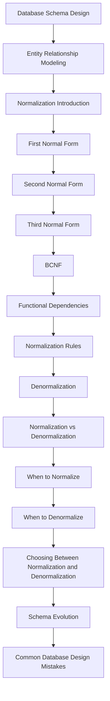
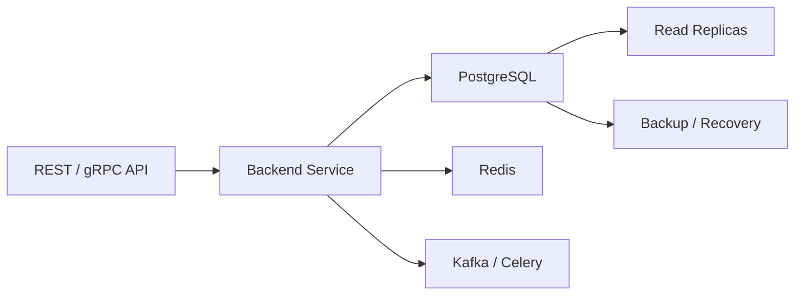

# README

## Overview

Database design and normalization define how application data is structured, related, constrained, and evolved over time.

This section focuses on designing relational schemas that preserve data integrity while remaining practical for production workloads. It moves from core schema design and entity relationships through normalization theory, functional dependencies, denormalization, and schema evolution.

The goal is not to normalize every table mechanically. A senior backend engineer should be able to reason about:

- What the real business entities and relationships are
- Which attributes depend on which keys
- Which invariants must be enforced by the database
- Where normalization prevents anomalies
- When denormalization is justified by workload requirements
- How schema decisions affect queries, indexes, transactions, and concurrency
- How schemas evolve safely in production
- How database ownership works in distributed systems

## Navigation

| # | Section | Layer | Description |
|---|---|---|---|
| 01 | [Database Schema Design](./01-%20Database%20Schema%20Design.md) | Schema and Data Management | Designing production-ready relational schemas |
| 02 | [Entity Relationship Modeling](./02-%20Entity%20Relationship%20Modeling.md) | Schema and Data Management | Entities, relationships, cardinality, and ER modeling |
| 03 | [Normalization Introduction](./03-%20Normalization%20Introduction.md) | Schema and Data Management | Why normalization exists and the problems it solves |
| 04 | [First Normal Form](./04-%20First%20Normal%20Form.md) | Schema and Data Management | Atomic values and eliminating repeating groups |
| 05 | [Second Normal Form](./05-%20Second%20Normal%20Form.md) | Schema and Data Management | Removing partial dependencies |
| 06 | [Third Normal Form](./06-%20Third%20Normal%20Form.md) | Schema and Data Management | Removing transitive dependencies |
| 07 | [BCNF](./07-%20BCNF.md) | Schema and Data Management | Boyce-Codd Normal Form and stronger dependency-based normalization |
| 08 | [Functional Dependencies](./08-%20Functional%20Dependencies.md) | Schema and Data Management | Reasoning about attribute dependencies |
| 09 | [Normalization Rules](./09-%20Normalization%20Rules.md) | Schema and Data Management | Practical rules for evaluating relational schemas |
| 10 | [Denormalization](./10-%20Denormalization.md) | Schema and Data Management | Intentionally introducing controlled redundancy |
| 11 | [Normalization vs Denormalization](./11-%20Normalization%20vs%20Denormalization.md) | Schema and Data Management | Trade-offs between integrity and read performance |
| 12 | [When to Normalize](./12-%20When%20to%20Normalize.md) | Schema and Data Management | Situations where normalized designs are preferable |
| 13 | [When to Denormalize](./13-%20When%20to%20Denormalize.md) | Schema and Data Management | Workload-driven reasons for controlled redundancy |
| 14 | [Choosing Between Normalization and Denormalization](./14-%20Choosing%20Between%20Normalization%20and%20Denormalization.md) | Schema and Data Management | A systematic decision framework |
| 15 | [Schema Evolution](./15-%20Schema%20Evolution.md) | Production Engineering | Safely changing schemas in production |
| 16 | [Common Database Design Mistakes](./16-%20Common%20Database%20Design%20Mistakes.md) | Production Engineering | Common modeling, integrity, performance, and operational failures |

## Recommended Learning Flow

The files are ordered to build from relational modeling fundamentals toward production-level design decisions.



## How the Topics Connect

### Schema Design and Entity Modeling

Start by identifying domain entities, attributes, relationships, cardinality, ownership, and identity.

For example:

```text
Customer
   │
   └── Order
         │
         └── Order Item
                 │
                 └── Product
```

This establishes the structural model before normalization decisions are made.

### Normalization

Normalization uses dependencies and keys to reduce unnecessary redundancy and prevent anomalies.

The progression covered here is:

```text
1NF
 ↓
2NF
 ↓
3NF
 ↓
BCNF
```

Each stage addresses specific classes of dependency and redundancy problems.

Normalization should be treated as a reasoning tool rather than a requirement to decompose every possible table.

### Functional Dependencies

Functional dependencies provide the theoretical foundation for understanding normalization.

The key relationship is:

```text
X → Y
```

meaning that a value of `X` determines a value of `Y` within the relation's intended semantics.

Understanding functional dependencies makes it easier to reason about:

- Candidate keys
- Partial dependencies
- Transitive dependencies
- 3NF
- BCNF
- Decomposition
- Redundancy

### Denormalization

Denormalization intentionally introduces redundancy when the resulting trade-off is beneficial.

Typical motivations include:

- Reducing expensive joins
- Optimizing high-volume read paths
- Supporting reporting workloads
- Maintaining read models
- Reducing repeated aggregation

Denormalization should have an explicit source-of-truth and synchronization strategy.

### Schema Evolution

A production schema is not static.

Application releases may require:

```text
Application change
      ↓
Schema migration
      ↓
Data migration
      ↓
Compatibility period
      ↓
Application rollout
      ↓
Cleanup
```

Schema evolution therefore connects database modeling directly to deployment strategy, CI/CD, backward compatibility, availability, and operational safety.

## Production Perspective

Database modeling decisions should be evaluated against the complete backend system rather than in isolation.



A schema affects:

- API query latency
- Transaction duration
- Lock contention
- Index size
- Write amplification
- Replication lag
- Backup size
- Migration duration
- Storage cost
- Recovery time

For high-volume PostgreSQL systems, schema design should therefore be reviewed alongside query plans, workload characteristics, indexing, transaction boundaries, and operational requirements.

## Core Engineering Principles

### Model the Domain Before the API

An API response is a representation of data, not necessarily the correct relational schema.

Avoid designing tables simply by copying JSON response structures.

### Enforce Important Invariants

If a rule must always be true, prefer database enforcement where practical.

Examples:

```sql
PRIMARY KEY
FOREIGN KEY
UNIQUE
NOT NULL
CHECK
```

Application validation remains useful for user-facing errors and business workflows, but it should not be the only protection for critical relational invariants.

### Normalize by Default for Transactional Data

Normalized schemas are generally a strong starting point for systems with:

- Frequent writes
- Strong consistency requirements
- Multiple update paths
- Complex relationships
- High data integrity requirements

Optimize from measured workload characteristics rather than prematurely duplicating data.

### Denormalize Deliberately

Before adding duplicated state, identify:

1. The performance problem.
2. The workload causing it.
3. Why existing indexes or queries are insufficient.
4. Which value is authoritative.
5. How duplicated data stays consistent.
6. How the system detects and repairs divergence.

### Design for Change

Consider schema evolution before production deployment.

Prefer migration strategies that allow old and new application versions to coexist during rolling deployments.

For large tables, avoid assuming that a schema change is instantaneous or harmless.

## Common Decision Framework

When evaluating a schema, ask these questions in order:

| Question | What to evaluate |
|---|---|
| What are the entities? | Domain boundaries and ownership |
| What identifies each entity? | Primary and candidate keys |
| How are entities related? | Foreign keys and cardinality |
| What must always be true? | Constraints and invariants |
| What depends on what? | Functional dependencies |
| Is redundancy necessary? | Normalization level |
| What are the critical queries? | Access patterns |
| How will those queries scale? | Indexes and query plans |
| Is duplication justified? | Denormalization trade-offs |
| How will data change? | Transactions and concurrency |
| How will the schema evolve? | Migration strategy |
| What happens at scale? | Partitioning, lifecycle, replication |
| Who owns the data? | Service and domain boundaries |

## Backend Technology Mapping

The concepts in this section apply directly to common backend frameworks and infrastructure.

| Technology | Database Design Relevance |
|---|---|
| Python | Data access patterns and domain modeling |
| Django | ORM models, relationships, migrations, constraints |
| FastAPI | API-to-database data flow and transaction boundaries |
| PostgreSQL | Constraints, indexes, transactions, JSONB, partitioning |
| Redis | Deciding what belongs in durable storage versus cache |
| Kafka | Event-driven propagation of changes between services |
| Celery | Asynchronous workflows and consistency considerations |
| Docker | Reproducible database development environments |
| Kubernetes | Deployment ordering and migration coordination |
| CI/CD | Automated migration testing and safe rollout strategies |
| AWS | Managed PostgreSQL deployments, backups, replicas, and operational scaling |

## Navigation

| # | Section | Layer | Description |
|---|---|---|---|
| 01 | [Database Schema Design](./01-%20Database%20Schema%20Design.md) | Schema and Data Management | Designing production-ready relational schemas |
| 02 | [Entity Relationship Modeling](./02-%20Entity%20Relationship%20Modeling.md) | Schema and Data Management | Entities, relationships, cardinality, and ER modeling |

### Normalization

| # | Section | Layer | Description |
|---|---|---|---|
| 03 | [Normalization Introduction](./03-%20Normalization%20Introduction.md) | Schema and Data Management | Why normalization exists and the problems it solves |
| 04 | [First Normal Form](./04-%20First%20Normal%20Form.md) | Schema and Data Management | Atomic values and eliminating repeating groups |
| 05 | [Second Normal Form](./05-%20Second%20Normal%20Form.md) | Schema and Data Management | Removing partial dependencies |
| 06 | [Third Normal Form](./06-%20Third%20Normal%20Form.md) | Schema and Data Management | Removing transitive dependencies |
| 07 | [BCNF](./07-%20BCNF.md) | Schema and Data Management | Boyce-Codd Normal Form and stronger dependency-based normalization |
| 08 | [Functional Dependencies](./08-%20Functional%20Dependencies.md) | Schema and Data Management | Reasoning about attribute dependencies |
| 09 | [Normalization Rules](./09-%20Normalization%20Rules.md) | Schema and Data Management | Practical rules for evaluating relational schemas |

### Denormalization and Design Trade-offs

| # | Section | Layer | Description |
|---|---|---|---|
| 10 | [Denormalization](./10-%20Denormalization.md) | Schema and Data Management | Intentionally introducing controlled redundancy |
| 11 | [Normalization vs Denormalization](./11-%20Normalization%20vs%20Denormalization.md) | Schema and Data Management | Trade-offs between integrity and read performance |
| 12 | [When to Normalize](./12-%20When%20to%20Normalize.md) | Schema and Data Management | Situations where normalized designs are preferable |
| 13 | [When to Denormalize](./13-%20When%20to%20Denormalize.md) | Schema and Data Management | Workload-driven reasons for controlled redundancy |
| 14 | [Choosing Between Normalization and Denormalization](./14-%20Choosing%20Between%20Normalization%20and%20Denormalization.md) | Schema and Data Management | A systematic decision framework |

### Production Design

| # | Section | Layer | Description |
|---|---|---|---|
| 15 | [Schema Evolution](./15-%20Schema%20Evolution.md) | Production Engineering | Safely changing schemas in production |
| 16 | [Common Database Design Mistakes](./16-%20Common%20Database%20Design%20Mistakes.md) | Production Engineering | Common modeling, integrity, performance, and operational failures |

## Key Takeaways

- **Start with domain entities, relationships, keys, and invariants before optimizing the physical schema.**
- **Use normalization to control redundancy and preserve correctness, then evaluate denormalization against measured workload requirements.**
- **Treat functional dependencies, constraints, indexes, transactions, and query patterns as interconnected parts of database design.**
- **Design schemas for production realities: concurrency, scale, data lifecycle, service ownership, migrations, backups, and recovery.**
- **A strong database design balances correctness, performance, maintainability, scalability, and safe evolution rather than maximizing normalization alone.**