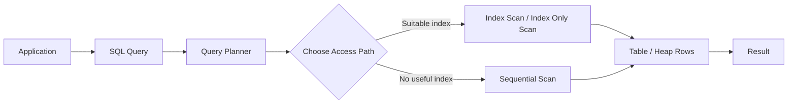
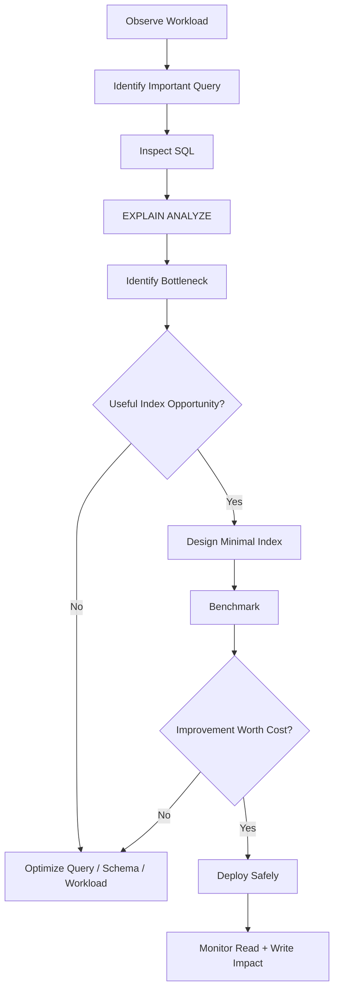

# 01- Index Fundamentals

## Overview

An index is a database data structure that provides a faster access path to rows than scanning the entire table. In relational databases such as PostgreSQL, indexes are primarily used to reduce the amount of data the query executor must inspect for selective predicates, joins, ordering, and uniqueness enforcement.

Indexes are not free. They consume storage, increase write cost, add maintenance work, and can themselves become a performance problem when poorly designed.

A production engineer should therefore think about indexes as **workload-specific access paths**, not as generic performance switches.



## Why Indexes Exist

Without an appropriate index, a database may need to inspect many or all rows to answer a query.

Consider:

```sql
SELECT id, email
FROM users
WHERE email = 'user@example.com';
```

With one million users and no suitable index, the database may perform a sequential scan:

```text
users table
├── row 1     → compare email
├── row 2     → compare email
├── row 3     → compare email
├── ...
└── row 1M    → compare email
```

An index can provide a much smaller search structure:

```text
email index
      │
      ├── user@example.com
      │        │
      │        └── row location
      │
      └── other email values
```

The database can locate the matching index entry and then retrieve the corresponding row instead of examining every row.

The exact performance improvement depends on:

- Table size
- Predicate selectivity
- Index type
- Query shape
- Data distribution
- Cache state
- Row width
- Concurrent workload
- Storage characteristics
- Query planner estimates

## What an Index Contains

Conceptually, an index contains ordered or otherwise organized representations of indexed values and references to the underlying table rows.

For a B-tree index:

```text
                    Root
                   /    \
                Node     Node
               /   \     /   \
             ...   ... ...   ...
              │
              ▼
        Indexed key
              │
              ▼
       Row reference
```

The index does not normally contain a complete copy of the table.

In PostgreSQL's heap-based storage model, a conventional index points toward table tuples using tuple identifiers. The database may therefore perform:

```text
Index
  ↓
matching index entries
  ↓
heap/table pages
  ↓
requested columns
```

An index-only scan can avoid heap access when the index contains everything needed for the query and PostgreSQL's visibility information permits it.

## B-Tree Index

B-tree is the general-purpose index type used for most relational database workloads.

In PostgreSQL:

```sql
CREATE INDEX idx_users_email
ON users (email);
```

B-tree indexes are effective for many predicates involving ordering and equality.

Typical supported patterns include:

```sql
WHERE email = 'user@example.com'

WHERE created_at >= TIMESTAMP '2026-01-01'

WHERE created_at BETWEEN TIMESTAMP '2026-01-01'
                     AND TIMESTAMP '2026-02-01'

ORDER BY created_at
```

The important property is that values are maintained in an ordered structure.

### When to Use B-Tree

Use a B-tree when queries commonly perform:

- Equality lookups
- Range queries
- Sorting
- Prefix-like ordering patterns supported by the database
- Uniqueness enforcement

For most ordinary application indexes, B-tree should be the first index type considered.

## Selectivity

Selectivity describes how effectively a predicate narrows the candidate rows.

Suppose a table contains 10 million rows.

```text
WHERE country = 'IN'
```

may match millions of rows.

By contrast:

```text
WHERE email = 'user@example.com'
```

may match exactly one row.

The second predicate is highly selective.

A useful mental model is:

```text
High selectivity
    ↓
Few matching rows
    ↓
Index more likely to help

Low selectivity
    ↓
Many matching rows
    ↓
Sequential scan may be cheaper
```

However, **low-cardinality columns are not automatically useless as index columns**. A boolean column can still be useful when combined with other predicates, especially in a composite or partial index.

## Query Planner and Index Selection

The database does not blindly use an index whenever one exists.

PostgreSQL's planner estimates the cost of alternative execution plans and chooses the plan it expects to be cheapest.

For example:

```sql
EXPLAIN
SELECT id, email
FROM users
WHERE email = 'user@example.com';
```

A plan might contain:

```text
Index Scan using idx_users_email on users
```

For a query returning a large fraction of the table, the planner may instead choose:

```text
Seq Scan on users
```

This is not necessarily a failure.

An index scan can require random page access, while a sequential scan can read table pages efficiently.

### Production Rule

Do not treat:

```text
"Index exists"
```

as equivalent to:

```text
"Query is optimized"
```

Always inspect the actual query plan for important queries.

## EXPLAIN and EXPLAIN ANALYZE

Use `EXPLAIN` to inspect the planner's chosen execution plan.

```sql
EXPLAIN
SELECT id, email
FROM users
WHERE email = 'user@example.com';
```

Use `EXPLAIN ANALYZE` to execute the query and compare estimated versus actual behavior.

```sql
EXPLAIN (ANALYZE, BUFFERS)
SELECT id, email
FROM users
WHERE email = 'user@example.com';
```

Important information includes:

| Metric | Why It Matters |
|---|---|
| Scan type | Shows sequential, index, bitmap, or other access path |
| Estimated rows | Planner's expectation |
| Actual rows | Real number returned |
| Planning Time | Cost of constructing the plan |
| Execution Time | Runtime of the query |
| Buffers | Indicates page reads and cache behavior |
| Rows Removed by Filter | Can reveal inefficient filtering |
| Heap Fetches | Important for index-only scans |

Large differences between estimated and actual row counts can indicate stale or insufficient statistics, data skew, or a query whose selectivity is difficult to estimate.

## Composite Indexes

A composite index contains multiple columns.

```sql
CREATE INDEX idx_orders_customer_status
ON orders (customer_id, status);
```

The column order matters.

This index is well suited to queries such as:

```sql
SELECT id, created_at
FROM orders
WHERE customer_id = 42
  AND status = 'pending';
```

It can also help with queries using the leading column:

```sql
WHERE customer_id = 42
```

But the same index is generally not equivalent to having an independent index beginning with `status`.

### Leftmost Prefix Principle

For an index:

```text
(customer_id, status, created_at)
```

think of the access path as beginning with:

```text
customer_id
    ↓
status
    ↓
created_at
```

Queries that constrain the leading portion generally benefit more directly.

For example:

| Query Predicate | Typical Fit |
|---|---|
| `customer_id = ?` | Good |
| `customer_id = ? AND status = ?` | Very good |
| `customer_id = ? AND status = ? AND created_at > ?` | Very good |
| `status = ?` | Usually poor fit |
| `created_at > ?` | Usually poor fit |

Modern PostgreSQL can use indexes in more sophisticated ways than this simplified rule suggests, so the final answer should come from `EXPLAIN`, not from the rule alone.

## Column Order in Composite Indexes

Index column order should be driven by query patterns rather than by arbitrary conventions.

Consider:

```sql
CREATE INDEX idx_orders_customer_status_created
ON orders (customer_id, status, created_at);
```

This may be appropriate when the dominant workload is:

```sql
WHERE customer_id = ?
  AND status = ?
ORDER BY created_at DESC
```

The correct ordering depends on:

- Equality predicates
- Range predicates
- Sorting requirements
- Join conditions
- Data distribution
- Query frequency

Do not blindly assume "highest cardinality first" is always the correct rule.

## Unique Indexes

A unique index enforces uniqueness while also providing an access path.

For example:

```sql
CREATE UNIQUE INDEX ux_users_email
ON users (email);
```

For application-level invariants, a database constraint is often clearer:

```sql
ALTER TABLE users
ADD CONSTRAINT users_email_key UNIQUE (email);
```

A uniqueness constraint may be implemented using a unique index by PostgreSQL.

This is important because application checks such as:

```python
if not User.objects.filter(email=email).exists():
    create_user()
```

are insufficient under concurrency.

Two requests can both observe that the email does not exist and then attempt to insert it.

The database constraint is the authoritative protection.

## Primary Keys and Indexes

A primary key identifies each row and requires uniqueness and non-null semantics.

In PostgreSQL, defining:

```sql
CREATE TABLE users (
    id bigint PRIMARY KEY,
    email text NOT NULL
);
```

automatically creates the required unique index supporting the primary key.

Do not create another redundant index on the same primary-key column without a specific reason.

## Foreign Key Indexes

Foreign keys maintain referential integrity, but a foreign key does **not universally imply that an index is automatically created on the referencing column**.

For example:

```sql
CREATE TABLE orders (
    id bigint PRIMARY KEY,
    customer_id bigint NOT NULL REFERENCES customers(id)
);
```

For common access patterns, you may want:

```sql
CREATE INDEX idx_orders_customer_id
ON orders (customer_id);
```

This is particularly important for:

- Looking up child rows by parent
- Joining parent and child tables
- Deleting or updating referenced parent rows
- Supporting cascading operations

The exact need depends on workload and database behavior.

## Partial Indexes

A partial index indexes only rows satisfying a predicate.

For example:

```sql
CREATE INDEX idx_orders_pending
ON orders (created_at)
WHERE status = 'pending';
```

This can be highly effective when:

- Only a small subset of rows is queried frequently.
- The predicate is stable.
- The query's predicate matches the index predicate closely.

Example:

```sql
SELECT id, created_at
FROM orders
WHERE status = 'pending'
ORDER BY created_at;
```

A partial index can be substantially smaller than indexing every row.

### Production Benefits

Partial indexes can reduce:

- Index storage
- Write amplification
- Cache pressure
- Index maintenance cost

But they require the planner to establish that the query predicate can use the index predicate.

## Expression Indexes

An expression index indexes the result of an expression.

Example:

```sql
CREATE INDEX idx_users_lower_email
ON users (lower(email));
```

This supports:

```sql
SELECT id
FROM users
WHERE lower(email) = 'user@example.com';
```

Without an appropriate expression index, applying a function to a column can prevent a normal index on the raw column from being useful for that expression.

Expression indexes are useful when the application consistently queries transformed values.

## Covering Indexes

A covering index contains additional columns needed by a query.

PostgreSQL supports this using `INCLUDE`:

```sql
CREATE INDEX idx_users_email_include_name
ON users (email)
INCLUDE (id, name);
```

This can support an index-only scan for queries such as:

```sql
SELECT id, name
FROM users
WHERE email = 'user@example.com';
```

The included columns are not part of the index's search ordering.

Use covering indexes selectively. They increase index size and write overhead.

## Index-Only Scans

An index-only scan can return query results from the index without fetching the corresponding table rows.

Conceptually:

```text
Normal index scan:

Index → Table pages → Result

Index-only scan:

Index → Result
```

However, PostgreSQL's visibility rules mean that an index-only scan may still need heap access for some entries.

Therefore:

```text
Index contains required columns
```

does not guarantee:

```text
Zero heap access
```

Table vacuuming and visibility-map state can affect how effective index-only scans are.

## Index Types in PostgreSQL

PostgreSQL provides multiple index types for different workloads.

| Index Type | Typical Use |
|---|---|
| B-tree | Equality, ranges, ordering |
| Hash | Equality lookups in specialized cases |
| GIN | Arrays, JSONB, full-text/search-like membership |
| GiST | Geometric, range, and extensible operator classes |
| SP-GiST | Specialized partitioned search structures |
| BRIN | Very large tables with naturally correlated physical order |

The correct index type depends on the operators and data access pattern.

For most conventional application queries, B-tree remains the default starting point.

## BRIN Indexes

BRIN indexes are particularly useful for very large tables where column values correlate with physical row order.

A common example is an append-heavy event table:

```text
Older rows ─────────────────────── Newer rows
timestamps increase with insertion order
```

A BRIN index can summarize ranges of table pages instead of storing an entry for every row.

Example:

```sql
CREATE INDEX idx_events_created_at_brin
ON events USING BRIN (created_at);
```

BRIN indexes are usually much smaller than B-tree indexes, but they are not a general replacement for B-tree indexes.

They depend heavily on physical correlation.

## GIN Indexes

GIN indexes are commonly used for multi-valued data such as PostgreSQL arrays and JSONB.

Example:

```sql
CREATE INDEX idx_products_metadata
ON products USING GIN (metadata);
```

For workloads involving JSONB containment or key/value searches, GIN can provide access paths that a normal B-tree cannot efficiently provide.

However, GIN indexes can be relatively large and write-intensive.

Do not add a GIN index merely because a table contains JSONB.

Index the operators and query patterns the application actually uses.

## Indexes and Write Performance

Every additional index creates work during writes.

For:

```sql
INSERT INTO orders (...)
VALUES (...);
```

the database must update:

```text
Table
+
Index A
+
Index B
+
Index C
+
...
```

Likewise, updates to indexed columns can require index maintenance.

Therefore:

```text
More indexes
    ↓
Faster selected reads
    +
More write cost
    +
More storage
    +
More maintenance
```

This trade-off becomes significant for high-write systems.

## Index Storage and Cache Pressure

Indexes consume disk space and memory.

A large index may compete with:

- Table pages
- Other indexes
- Frequently accessed data
- Shared buffers
- Operating-system page cache

An index that is technically correct but too large to remain useful in cache can have a different performance profile from a small, frequently accessed index.

This is one reason targeted indexes are preferable to indexing every column.

## Indexes and Updates

An indexed column has additional costs when updated.

For example:

```sql
UPDATE users
SET email = 'new@example.com'
WHERE id = 42;
```

If `email` is indexed, the database must maintain the corresponding index entry.

For frequently updated columns, indexing can therefore increase write amplification.

A senior engineer should evaluate:

```text
Read frequency
vs
Write frequency
vs
Query latency requirements
```

rather than optimizing one dimension in isolation.

## Indexes and Sorting

Indexes can sometimes satisfy an `ORDER BY` without requiring a separate sort.

For example:

```sql
CREATE INDEX idx_orders_customer_created
ON orders (customer_id, created_at DESC);
```

This may help:

```sql
SELECT id, created_at
FROM orders
WHERE customer_id = 42
ORDER BY created_at DESC
LIMIT 50;
```

This pattern is especially valuable for APIs implementing:

- Recent activity
- User timelines
- Order history
- Notifications
- Audit records

The combination of:

```text
WHERE + ORDER BY + LIMIT
```

is a common opportunity for carefully designed composite indexes.

## Pagination and Indexes

Offset pagination:

```sql
SELECT id, created_at
FROM orders
ORDER BY created_at DESC
LIMIT 50 OFFSET 100000;
```

can become expensive because the database may still need to walk through many earlier rows.

Keyset pagination can use an ordered index more effectively:

```sql
SELECT id, created_at
FROM orders
WHERE created_at < TIMESTAMP '2026-08-01 12:00:00'
ORDER BY created_at DESC
LIMIT 50;
```

For stable ordering, a unique tie-breaker is often needed:

```sql
SELECT id, created_at
FROM orders
WHERE (created_at, id) < (TIMESTAMP '2026-08-01 12:00:00', 12345)
ORDER BY created_at DESC, id DESC
LIMIT 50;
```

Corresponding index:

```sql
CREATE INDEX idx_orders_created_id
ON orders (created_at DESC, id DESC);
```

This pattern is useful for high-volume APIs.

## Indexes and ORMs

Indexes should be designed around generated SQL, not ORM model definitions alone.

For Django:

```python
class Order(models.Model):
    customer_id = models.BigIntegerField()
    status = models.CharField(max_length=32)
    created_at = models.DateTimeField()

    class Meta:
        indexes = [
            models.Index(
                fields=["customer_id", "status", "-created_at"],
                name="order_customer_status_created_idx",
            ),
        ]
```

The important question is not:

```text
"Does the model have an index?"
```

but:

```text
"What SQL does the application generate, and what workload does it create?"
```

Inspect generated SQL and validate critical queries with PostgreSQL's execution plans.

## Indexes and REST APIs

Consider an API:

```text
GET /customers/42/orders?status=pending&limit=50
```

A likely query is:

```sql
SELECT id, created_at, total
FROM orders
WHERE customer_id = 42
  AND status = 'pending'
ORDER BY created_at DESC
LIMIT 50;
```

A potentially appropriate index is:

```sql
CREATE INDEX idx_orders_customer_status_created
ON orders (customer_id, status, created_at DESC);
```

The index should be validated with realistic data and:

```sql
EXPLAIN (ANALYZE, BUFFERS)
SELECT id, created_at, total
FROM orders
WHERE customer_id = 42
  AND status = 'pending'
ORDER BY created_at DESC
LIMIT 50;
```

This is the production workflow:

```text
API requirement
      ↓
Generated SQL
      ↓
Observed workload
      ↓
Candidate index
      ↓
EXPLAIN ANALYZE
      ↓
Benchmark
      ↓
Production monitoring
```

## Index Design Workflow

Use a workload-driven process.

### Identify the Query

Start with the actual slow or high-frequency query.

```sql
SELECT id, created_at, total
FROM orders
WHERE customer_id = $1
  AND status = $2
ORDER BY created_at DESC
LIMIT $3;
```

### Inspect the Existing Plan

```sql
EXPLAIN (ANALYZE, BUFFERS)
SELECT id, created_at, total
FROM orders
WHERE customer_id = 42
  AND status = 'pending'
ORDER BY created_at DESC
LIMIT 50;
```

### Identify the Access Pattern

Determine:

- Equality predicates
- Range predicates
- Join predicates
- Sorting
- Grouping
- Projection
- Cardinality
- Query frequency

### Create the Smallest Useful Index

Avoid creating several overlapping indexes without evidence.

```sql
CREATE INDEX idx_orders_customer_status_created
ON orders (customer_id, status, created_at DESC);
```

### Validate Again

Re-run the query plan and compare:

- Execution time
- Buffers
- Rows scanned
- Rows returned
- CPU
- I/O
- Planning behavior

### Measure Production Impact

Observe both:

```text
Read-side improvement
```

and:

```text
Write-side cost
```

A query becoming faster does not automatically mean the overall system became faster.

## Concurrent Index Creation

Creating an index on a large production PostgreSQL table requires operational planning.

PostgreSQL supports:

```sql
CREATE INDEX CONCURRENTLY idx_orders_customer_status
ON orders (customer_id, status);
```

`CONCURRENTLY` reduces the blocking impact on ordinary writes compared with a regular index build, but it has additional execution cost and operational constraints.

It cannot be used inside a transaction block.

For Django migrations, concurrent index creation generally requires an appropriate non-atomic migration strategy.

Example:

```python
from django.db import migrations, models


class Migration(migrations.Migration):
    atomic = False

    operations = [
        migrations.AddIndexConcurrently(
            model_name="order",
            index=models.Index(
                fields=["customer_id", "status"],
                name="order_customer_status_idx",
            ),
        ),
    ]
```

Use this pattern when migration size and production availability justify it, and test the operational behavior before deployment.

## Index Maintenance

Indexes require ongoing maintenance.

In PostgreSQL, autovacuum and related maintenance processes help manage table and index health.

Monitor:

- Index size
- Table size
- Query latency
- Index usage
- Bloat
- Vacuum activity
- Dead tuples
- Write volume
- Replication impact

An index that is never used but consumes significant storage and write resources should be investigated.

Do not drop an index solely because a short observation window shows zero usage. Validate application behavior, seasonal workloads, failover paths, administrative queries, and deployment history first.

## Finding Unused Indexes

PostgreSQL statistics can help identify indexes with low usage.

For example:

```sql
SELECT
    schemaname,
    relname AS table_name,
    indexrelname AS index_name,
    idx_scan
FROM pg_stat_user_indexes
ORDER BY idx_scan ASC;
```

A more useful investigation includes index size:

```sql
SELECT
    schemaname,
    relname AS table_name,
    indexrelname AS index_name,
    idx_scan,
    pg_size_pretty(pg_relation_size(indexrelid)) AS index_size
FROM pg_stat_user_indexes
ORDER BY pg_relation_size(indexrelid) DESC;
```

Treat these statistics as evidence, not automatic deletion instructions.

## Redundant and Overlapping Indexes

Indexes can overlap.

Suppose a table has:

```text
(customer_id)
(customer_id, status)
(customer_id, status, created_at)
```

Some queries may use all three, but others may make the shorter indexes redundant.

However, redundancy must be evaluated against:

- Query patterns
- Index ordering
- Partial predicates
- Unique constraints
- Foreign keys
- Sort requirements
- Index-only scans
- Write workload

Avoid removing an index without validating the workload.

## Common Indexing Mistakes

### Indexing Every Column

Adding indexes to every column creates unnecessary:

- Storage consumption
- Write overhead
- Maintenance
- Planner complexity

Index access patterns, not columns.

### Ignoring Query Shape

An index on:

```sql
customer_id
```

does not automatically optimize:

```sql
WHERE status = ?
ORDER BY created_at DESC
```

Design indexes around actual predicates and ordering.

### Creating Duplicate Indexes

ORM migrations, manually created indexes, and evolving schemas can accidentally create overlapping indexes.

Audit indexes periodically.

### Assuming Every Query Should Use an Index

For large result sets, sequential scanning may be cheaper.

The planner choosing a sequential scan can be correct.

### Using Functions Without Considering Indexes

This query:

```sql
WHERE lower(email) = 'user@example.com'
```

may require an expression index:

```sql
CREATE INDEX idx_users_lower_email
ON users (lower(email));
```

### Ignoring Data Distribution

An index can behave differently when data distribution changes.

A predicate that was selective at 100,000 rows may match a large portion of the table at 100 million rows.

### Ignoring Writes

Every index affects insert, update, and delete operations.

High-throughput write paths require particularly careful index budgeting.

### Treating Indexes as a Substitute for Query Design

Indexes cannot fix every problem.

A query with:

- unnecessary joins
- excessive result sets
- inefficient pagination
- functions preventing index usage
- poor filtering
- incorrect data access patterns

may remain expensive even after adding indexes.

## Performance Investigation Checklist

When a query is slow:

1. Capture the actual SQL.
2. Check query frequency and latency.
3. Run `EXPLAIN (ANALYZE, BUFFERS)`.
4. Compare estimated and actual row counts.
5. Identify the access path.
6. Check whether filtering, joining, or sorting dominates the cost.
7. Inspect existing indexes.
8. Check for redundant or overlapping indexes.
9. Create a workload-specific candidate index if justified.
10. Benchmark before and after.
11. Measure write overhead.
12. Monitor production behavior after deployment.

## Production Considerations

### Reliability

Indexes are part of the database's operational state.

Index creation on large tables can consume significant:

- CPU
- Memory
- I/O
- Disk space

Plan large index builds during periods where the database has sufficient capacity.

### High Availability

For replicated PostgreSQL environments, index creation and large index changes can affect:

- WAL generation
- Replica lag
- Storage consumption
- Recovery time

Monitor replicas while performing heavy index operations.

### Scalability

At scale, index design should account for:

```text
Table growth
+
Query growth
+
Write throughput
+
Index growth
+
Replication
+
Storage
```

An index that works well at 10 million rows may require reevaluation at 1 billion rows.

### Monitoring

Track:

- Query latency
- Query throughput
- Buffer reads
- Cache hit behavior
- Index scan counts
- Sequential scan counts
- Index size
- Database I/O
- Replication lag
- Lock activity

Application observability tools and PostgreSQL statistics should be combined rather than relying on a single metric.

### Disaster Recovery

Indexes increase the size of database storage and can affect backup and restore characteristics.

When evaluating large indexes, consider:

- Backup size
- Restore duration
- Replica rebuild time
- Storage capacity
- Recovery objectives

In some architectures, indexes can be rebuilt after restoration, but this must be explicitly planned rather than assumed.

## Security Considerations

Indexes are primarily a performance mechanism, but they can have security and operational implications.

Avoid indexing sensitive data without a legitimate workload requirement.

Consider:

- Storage and backup copies of indexed values
- Encryption at rest
- Access control
- Data retention requirements
- Whether indexed expressions expose derived sensitive information
- Whether uniqueness constraints reveal business rules through application behavior

For sensitive identifiers, consider whether hashing, tokenization, or another representation is appropriate before choosing an indexing strategy.

## Interview Traps

| Question | Strong Answer |
|---|---|
| Does an index always make a query faster? | No. The planner may choose a sequential scan when it is cheaper. |
| Does every foreign key automatically get an index? | No. Check the database and ORM behavior; PostgreSQL does not automatically index every referencing foreign-key column. |
| Why does composite index column order matter? | B-tree ordering determines which predicates and orderings can efficiently use the leading portion of the index. |
| Why not index every column? | Indexes consume storage and increase insert, update, delete, and maintenance costs. |
| What should you do before adding an index? | Inspect the real query and execution plan, then validate the candidate against realistic workload. |
| Can an index eliminate all table reads? | Sometimes an index-only scan can avoid heap reads, but PostgreSQL visibility rules can still require heap access. |
| Is a sequential scan evidence of a missing index? | No. Sequential scanning may be the cheapest plan. |
| What is the difference between a normal and partial index? | A partial index contains only rows satisfying a specified predicate. |
| What is a covering index? | An index containing all columns needed by a query, potentially enabling an index-only scan. |
| What is the main trade-off of indexing? | Faster selected reads in exchange for additional storage and write/maintenance cost. |

## Practical PostgreSQL Reference

### Create an Index

```sql
CREATE INDEX idx_orders_customer_id
ON orders (customer_id);
```

### Create a Composite Index

```sql
CREATE INDEX idx_orders_customer_status_created
ON orders (customer_id, status, created_at DESC);
```

### Create a Unique Index

```sql
CREATE UNIQUE INDEX ux_users_email
ON users (email);
```

### Create a Partial Index

```sql
CREATE INDEX idx_orders_pending_created
ON orders (created_at DESC)
WHERE status = 'pending';
```

### Create an Expression Index

```sql
CREATE INDEX idx_users_lower_email
ON users (lower(email));
```

### Create a Covering Index

```sql
CREATE INDEX idx_users_email_include_name
ON users (email)
INCLUDE (id, name);
```

### Inspect a Query Plan

```sql
EXPLAIN (ANALYZE, BUFFERS)
SELECT id, created_at
FROM orders
WHERE customer_id = 42
ORDER BY created_at DESC
LIMIT 50;
```

### Inspect Index Usage

```sql
SELECT
    schemaname,
    relname AS table_name,
    indexrelname AS index_name,
    idx_scan,
    pg_size_pretty(pg_relation_size(indexrelid)) AS index_size
FROM pg_stat_user_indexes
ORDER BY idx_scan DESC;
```

### Inspect Indexes for a Table

```sql
SELECT
    indexname,
    indexdef
FROM pg_indexes
WHERE tablename = 'orders';
```

## Recommended Engineering Approach

A production indexing strategy should follow:



The most effective indexing decisions are usually narrow and evidence-based:

```text
Actual workload
    ↓
Actual query
    ↓
Actual execution plan
    ↓
Targeted index
    ↓
Measured improvement
```

This approach avoids both extremes:

```text
No indexes
```

and:

```text
Index everything
```

The objective is a balanced access-path strategy that keeps critical reads fast without imposing unnecessary costs on writes, storage, replication, and operations.

## Key Takeaways

- **Indexes are workload-specific access paths, not universal query accelerators.**
- **Design indexes from real query predicates, joins, ordering, and pagination patterns, then validate them with `EXPLAIN (ANALYZE, BUFFERS)`.**
- **Composite index column order matters because the leading portion of the index determines which access patterns can be exploited efficiently.**
- **Every index has a cost in storage, writes, maintenance, replication, and operational complexity, so avoid redundant or speculative indexes.**
- **Production indexing is an iterative process: observe, measure, design, benchmark, deploy safely, and monitor both read and write impact.**