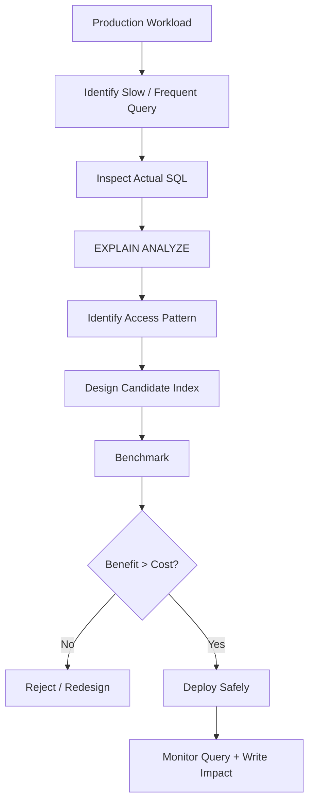

# 02- Why Indexes Exist

## Overview

Indexes exist to make frequently executed data-access patterns cheaper by providing the database with an alternative access path to table data.

Without an index, the database may need to inspect a large portion of a table to determine which rows satisfy a query. With an appropriate index, the database can often locate candidate rows directly and avoid unnecessary page reads.

The key engineering trade-off is:

> **Indexes optimize reads by adding storage, write amplification, and maintenance cost.**

Indexes are therefore not a property of a table in isolation. They are a response to a **workload**: the queries the application actually executes, their frequency, selectivity, latency requirements, and write volume.


## The Problem Without Indexes

Consider a `users` table containing 10 million rows:

```sql
CREATE TABLE users (
    id bigint PRIMARY KEY,
    email text NOT NULL,
    name text NOT NULL,
    created_at timestamptz NOT NULL
);
```

An application frequently executes:

```sql
SELECT id, name
FROM users
WHERE email = 'alice@example.com';
```

If there is no suitable index on `email`, the database may perform a sequential scan:

```text
users
├── row 1       → check email
├── row 2       → check email
├── row 3       → check email
├── ...
├── row 9,999,999
└── row 10,000,000
```

Even if only one row matches, the database may have to inspect many table pages to discover that fact.

This creates an important distinction:

```text
Rows returned ≠ Rows inspected
```

A query returning one row can still be expensive if the database must examine millions of rows to find it.

## The Alternative Access Path

An index provides a separate structure organized around one or more columns.

```sql
CREATE INDEX idx_users_email
ON users (email);
```

Conceptually:

```text
Email Index
────────────────────────────
alice@example.com  → row location
bob@example.com    → row location
carol@example.com  → row location
...
```

The database can use the index to find the relevant entry and then retrieve the corresponding table row.

The conceptual access path becomes:

```text
Query
  ↓
Index lookup
  ↓
Matching row references
  ↓
Table pages
  ↓
Result
```

Instead of:

```text
Query
  ↓
Scan table pages
  ↓
Check every candidate row
  ↓
Result
```

The performance difference can be substantial for selective queries on large tables.

## Why This Matters in Backend Systems

Database queries are frequently on the critical path of API requests.

A typical request may look like:

```text
Client
  ↓
Nginx / Load Balancer
  ↓
FastAPI / Django application
  ↓
ORM
  ↓
PostgreSQL
  ↓
Query execution
  ↓
Response
```

If the database spends 500 ms scanning a large table, application-level optimizations may have limited impact.

An appropriate index can reduce the database portion of the request substantially.

For example:

```text
GET /users/alice@example.com
```

might generate:

```sql
SELECT id, name
FROM users
WHERE email = $1;
```

A unique or highly selective index on `email` is a natural access path for this workload.

## How Indexes Reduce Work

Indexes primarily reduce the amount of data the database must inspect.

Suppose a table contains:

```text
10,000,000 rows
```

and the query needs:

```text
1 row
```

A sequential scan conceptually performs:

```text
10,000,000 row checks
```

A suitable B-tree index can navigate through a much smaller search structure and identify the relevant entry.

The exact number of operations is implementation-dependent, but the important property is that a balanced tree avoids scanning every indexed value.

For a B-tree, lookup complexity is approximately:

```text
O(log N)
```

for locating a key, although real query performance also depends on:

- Index height
- Page size
- Cache state
- Random versus sequential I/O
- Table lookups
- Visibility checks
- Selectivity
- Concurrent workload

Do not reduce database performance analysis to Big-O alone.

## Why B-Trees Are Effective

A B-tree maintains keys in an ordered, balanced structure.

Conceptually:

```text
                         Root
                       /      \
                     /          \
                  Node          Node
                 /   \          /   \
               ...   ...      ...   ...
                ↓                 ↓
             Leaf pages      Leaf pages
```

The database can navigate toward the relevant key rather than inspecting unrelated keys.

This ordering also enables more than equality lookups.

For example:

```sql
WHERE id = 100
```

and:

```sql
WHERE created_at >= '2026-01-01'
```

and:

```sql
ORDER BY created_at DESC
```

can all potentially benefit from a B-tree index.

## Indexes Are Not Always Faster

An important production concept is that the database chooses whether to use an index.

PostgreSQL's query planner estimates the cost of different execution strategies.

Consider:

```sql
SELECT *
FROM users
WHERE country = 'IN';
```

If 40% of the table belongs to India, using an index may not be cheaper than reading the table sequentially.

The planner may choose:

```text
Seq Scan
```

instead of:

```text
Index Scan
```

This can be the correct decision.

The objective is not:

> "Make every query use an index."

The objective is:

> "Provide efficient access paths and allow the planner to choose the cheapest one."

## Selectivity Is Central

Index usefulness is strongly influenced by selectivity.

Suppose a table contains 10 million users.

### Highly Selective

```sql
WHERE email = 'alice@example.com'
```

Potential result:

```text
1 row
```

### Poorly Selective

```sql
WHERE is_active = true
```

Potential result:

```text
9 million rows
```

The first query is an obvious candidate for an index.

The second may not benefit from a simple index on `is_active`, particularly when most rows satisfy the condition.

However, low-cardinality columns are not automatically bad index columns. They can become useful in:

- Composite indexes
- Partial indexes
- Highly skewed data distributions
- Queries where the predicate matches a small subset

The workload and execution plan determine whether the index is useful.

## Indexes Optimize I/O

For large databases, the important resource is often not just CPU but data movement.

A table consists of storage pages. A query that scans millions of rows may require many pages to be read and processed.

An index can reduce unnecessary page access:

```text
Without index:

Query
  ↓
Many table pages
  ↓
Many rows inspected
  ↓
Few rows returned


With index:

Query
  ↓
Small index path
  ↓
Relevant table pages
  ↓
Few rows inspected
```

This is particularly valuable when the table is much larger than the database's effective cache.

## Indexes and Database Cache

Modern databases rely heavily on memory caching.

Frequently accessed:

- Table pages
- Index pages
- Query-related structures

may remain in memory.

A small, frequently used index can therefore be especially valuable because the database may be able to traverse the index without repeatedly reading it from storage.

However, large indexes consume cache capacity.

For example:

```text
Available memory
├── Frequently accessed table pages
├── Frequently accessed indexes
├── Other indexes
└── Database overhead
```

Adding unnecessary indexes can increase memory pressure and reduce the effective cache available for other useful data.

## Indexes and Sorting

Indexes do more than accelerate `WHERE` clauses.

An appropriately ordered index can also provide rows in the order required by a query.

Consider:

```sql
SELECT id, created_at
FROM orders
WHERE customer_id = 42
ORDER BY created_at DESC
LIMIT 50;
```

A suitable index might be:

```sql
CREATE INDEX idx_orders_customer_created
ON orders (customer_id, created_at DESC);
```

This can potentially allow PostgreSQL to locate the customer's rows and retrieve the newest rows in the required order without performing a large separate sort.

This pattern is common in:

- Order history APIs
- Notification feeds
- Activity timelines
- Audit logs
- Recent events
- User dashboards

## Indexes and `LIMIT`

Indexes become particularly valuable when a query needs only a small number of rows from an ordered result.

Consider:

```sql
SELECT id, created_at
FROM orders
WHERE customer_id = 42
ORDER BY created_at DESC
LIMIT 20;
```

With:

```sql
CREATE INDEX idx_orders_customer_created
ON orders (customer_id, created_at DESC);
```

the database may be able to:

```text
Find customer_id = 42
        ↓
Start at newest created_at
        ↓
Read 20 rows
        ↓
Stop
```

Without an appropriate access path, it may need to identify and sort many more rows before producing the first 20.

This is one reason indexes are particularly important for latency-sensitive APIs.

## Indexes and Joins

Indexes can also reduce the cost of joins.

Consider:

```sql
SELECT o.id, o.total
FROM orders o
JOIN customers c
  ON c.id = o.customer_id
WHERE c.id = 42;
```

An index on:

```sql
orders(customer_id)
```

can provide an efficient path from the customer to its orders.

```sql
CREATE INDEX idx_orders_customer_id
ON orders (customer_id);
```

This is particularly useful when:

```text
One parent
    ↓
Many child rows
```

is a common access pattern.

Indexes on join columns should still be validated against actual query plans and cardinalities.

## Indexes and Uniqueness

Indexes can enforce data integrity as well as improve access.

For example:

```sql
CREATE UNIQUE INDEX ux_users_email
ON users (email);
```

This ensures that two users cannot have the same email value.

In application code, this is stronger than:

```python
if not user_exists(email):
    create_user(email)
```

because application-level checks can race under concurrency:

```text
Request A → email does not exist
Request B → email does not exist
Request A → INSERT
Request B → INSERT
```

A database uniqueness constraint provides authoritative enforcement.

In PostgreSQL, prefer expressing business invariants as constraints where appropriate:

```sql
ALTER TABLE users
ADD CONSTRAINT users_email_key UNIQUE (email);
```

## Indexes and Write Cost

Indexes improve some reads by making writes more expensive.

Consider:

```sql
INSERT INTO orders (
    customer_id,
    status,
    created_at,
    total
)
VALUES (
    42,
    'pending',
    now(),
    199.99
);
```

The database must maintain:

```text
orders table
+
customer_id index
+
status index
+
created_at index
+
composite index
+
...
```

Each additional index introduces maintenance work.

The trade-off is therefore:

| More Indexes | Fewer Indexes |
|---|---|
| Faster selected reads | Potentially slower reads |
| More storage | Less storage |
| Higher write overhead | Lower write overhead |
| More maintenance | Less maintenance |
| More cache pressure | Lower cache pressure |
| More operational complexity | Simpler schema |

For read-heavy workloads, additional indexes can be justified.

For write-heavy workloads, indiscriminate indexing can become a major bottleneck.

## Indexes and Updates

Updating an indexed column can also require index maintenance.

For example:

```sql
UPDATE users
SET email = 'new@example.com'
WHERE id = 42;
```

If `email` is indexed, PostgreSQL must maintain the index representation of that value.

Frequently updated columns therefore require careful consideration.

A senior engineer should evaluate:

```text
Read frequency
+
Read latency requirement
+
Write frequency
+
Write latency requirement
+
Storage cost
```

rather than treating index creation as a one-dimensional optimization.

## Indexes and Deletes

Deletes also affect indexes.

```sql
DELETE FROM orders
WHERE id = 123;
```

The database must account for the row's presence in associated indexes.

High-delete workloads can therefore create substantial maintenance activity.

In PostgreSQL, dead tuples and index/table bloat are operational concerns that require vacuuming and monitoring.

## Indexes and Large Tables

The larger a table becomes, the more important good access paths can become.

A query that performs acceptably on:

```text
50,000 rows
```

may become unacceptable at:

```text
500 million rows
```

This is why database design should consider expected growth.

A production index strategy should ask:

- How large is the table today?
- How fast is it growing?
- What queries dominate traffic?
- Which queries are latency-sensitive?
- What is the write rate?
- How large will the index become?
- What happens when the dataset is 10× larger?

## Indexes and Pagination

Offset pagination can become increasingly expensive:

```sql
SELECT id, created_at
FROM orders
ORDER BY created_at DESC
LIMIT 50 OFFSET 100000;
```

Even with an index, the database may need to walk past many earlier entries.

Keyset pagination can make better use of an ordered index:

```sql
SELECT id, created_at
FROM orders
WHERE created_at < $1
ORDER BY created_at DESC
LIMIT 50;
```

For stable ordering, use a deterministic tie-breaker:

```sql
SELECT id, created_at
FROM orders
WHERE (created_at, id) < ($1, $2)
ORDER BY created_at DESC, id DESC
LIMIT 50;
```

with:

```sql
CREATE INDEX idx_orders_created_id
ON orders (created_at DESC, id DESC);
```

This is often a better fit for high-volume feeds and APIs.

## Indexes and ORM-Generated SQL

Backend engineers frequently work through Django ORM or SQLAlchemy rather than writing SQL manually.

That does not remove the need to understand indexes.

For example, Django code:

```python
orders = (
    Order.objects
    .filter(customer_id=customer_id, status="pending")
    .order_by("-created_at")[:50]
)
```

may generate a query resembling:

```sql
SELECT id, created_at, total
FROM orders
WHERE customer_id = $1
  AND status = $2
ORDER BY created_at DESC
LIMIT 50;
```

The index should be designed around the generated SQL:

```sql
CREATE INDEX idx_orders_customer_status_created
ON orders (customer_id, status, created_at DESC);
```

The important engineering question is:

> **What SQL does the ORM actually execute?**

not:

> **What fields exist on the model?**

## Indexes Exist Because Queries Have Different Access Patterns

A single table may support many different operations:

```text
Users
├── Lookup by email
├── Lookup by external ID
├── List by organization
├── List recent users
├── Filter by status
└── Sort by creation time
```

One index cannot necessarily optimize all of them.

For example:

```text
(email)
(organization_id, created_at)
(status, created_at)
(external_id)
```

Each index exists because it supports a particular workload.

This is why index design is fundamentally a **query-pattern design problem**.

## Why Not Store Everything in an Index?

A natural question is:

> If indexes make reads faster, why not put every column into one huge index?

Because indexes have costs.

A huge index:

- Consumes significant storage
- Requires more I/O
- Increases write amplification
- Uses more memory/cache
- Takes longer to build
- Takes longer to maintain
- Can increase replication and backup overhead
- May not improve the target query

The correct strategy is to build **minimal, workload-specific indexes**.

## Covering Indexes

Sometimes the database can answer a query entirely from an index.

Consider:

```sql
SELECT id, name
FROM users
WHERE email = $1;
```

A PostgreSQL covering index can include the projected columns:

```sql
CREATE INDEX idx_users_email_covering
ON users (email)
INCLUDE (id, name);
```

The goal is to make an index-only scan possible:

```text
Index
├── email
├── id
└── name
        ↓
      Result
```

instead of:

```text
Index
  ↓
Table
  ↓
Result
```

This can reduce table-page access for suitable workloads, but it increases index size.

An index-only scan is also dependent on PostgreSQL's visibility information, so the presence of all required columns does not guarantee that heap access will never occur.

## Partial Indexes

Indexes can be limited to a subset of rows.

For example, suppose only pending orders are frequently processed:

```sql
CREATE INDEX idx_orders_pending
ON orders (created_at)
WHERE status = 'pending';
```

This can be much smaller than indexing every order.

It is useful when:

```text
Most rows = completed
Small subset = pending
Queries frequently target pending
```

For example:

```sql
SELECT id, created_at
FROM orders
WHERE status = 'pending'
ORDER BY created_at
LIMIT 100;
```

Partial indexes are another example of indexes existing to match a specific workload rather than a generic table structure.

## Different Index Types Exist for Different Problems

B-tree is not the only index structure.

PostgreSQL provides several index types:

| Index Type | Typical Workload |
|---|---|
| B-tree | Equality, ranges, ordering |
| Hash | Equality-oriented workloads |
| GIN | Arrays, JSONB, membership-style searches |
| GiST | Geometric, range, and extensible search |
| SP-GiST | Specialized partitioned search structures |
| BRIN | Very large tables with physical data correlation |

The index type should follow the operators and data access pattern.

For conventional relational application queries, B-tree is usually the starting point.

## How to Prove an Index Helps

Do not rely on assumptions.

Start with the actual query:

```sql
SELECT id, name
FROM users
WHERE email = 'alice@example.com';
```

Inspect the plan:

```sql
EXPLAIN (ANALYZE, BUFFERS)
SELECT id, name
FROM users
WHERE email = 'alice@example.com';
```

Look for:

- Scan type
- Estimated rows
- Actual rows
- Execution time
- Buffer reads
- Rows removed by filtering
- Heap fetches
- Sort operations

After adding an index:

```sql
CREATE INDEX idx_users_email
ON users (email);
```

run the same analysis again.

The goal is to establish:

```text
Before
  ↓
Measured bottleneck
  ↓
Candidate index
  ↓
After
  ↓
Measured improvement
```

## Query Planner Cost Model

The planner considers estimated costs rather than simply counting SQL operations.

A simplified model is:

```text
Candidate plans
      ↓
Estimate rows
      ↓
Estimate I/O
      ↓
Estimate CPU
      ↓
Estimate sorting/join costs
      ↓
Choose lowest estimated cost
```

Statistics influence these estimates.

If statistics are stale or inaccurate, the planner may make poor choices even when a suitable index exists.

This is why database maintenance and statistics are part of index effectiveness.

## Production Indexing Workflow

A disciplined workflow looks like this:



### Identify the Workload

Look at:

- Slow queries
- High-frequency queries
- High-total-time queries
- Latency-sensitive endpoints
- Expensive background jobs
- Common joins
- Frequent sorting and pagination

### Inspect the SQL

Understand:

```text
WHERE
JOIN
ORDER BY
GROUP BY
LIMIT
SELECT
```

before designing the index.

### Inspect the Execution Plan

Use:

```sql
EXPLAIN (ANALYZE, BUFFERS)
...
```

to establish the current behavior.

### Design the Smallest Useful Index

Avoid creating multiple speculative indexes.

### Benchmark

Compare:

- Execution time
- Buffer reads
- CPU
- I/O
- Rows examined
- Planning behavior

### Measure Write Impact

Test inserts, updates, and deletes against realistic workloads.

### Monitor Production

Validate that the index continues to provide value as data and traffic evolve.

## Production Considerations

### Storage

Indexes consume disk space.

Large indexes increase:

- Database storage requirements
- Backup size
- Replica storage
- Restore requirements
- Migration duration

Storage should therefore be included in capacity planning.

### Write Amplification

Every additional index increases work for:

- `INSERT`
- `UPDATE`
- `DELETE`

This becomes especially important for high-throughput services.

### Replication

Index creation and heavy write activity can increase WAL generation and affect replica lag in PostgreSQL environments.

Monitor replication health during large schema changes.

### High Availability

For large production tables, index creation should be planned carefully.

PostgreSQL supports:

```sql
CREATE INDEX CONCURRENTLY idx_orders_customer_id
ON orders (customer_id);
```

This reduces blocking of concurrent writes compared with a regular index build, but it has additional operational costs and restrictions.

### Monitoring

Monitor both query performance and index health.

Useful signals include:

```text
Query latency
Query throughput
Index scans
Sequential scans
Buffer reads
Index size
Table size
Vacuum activity
Dead tuples
Replication lag
Disk utilization
```

An index that is unused and large may be a candidate for removal, but usage statistics must be interpreted over a representative period.

### Schema Evolution

Index creation should be treated as a deployment operation rather than a harmless SQL statement.

For large tables:

```text
Migration
  ↓
Index build
  ↓
CPU / I/O impact
  ↓
WAL generation
  ↓
Replica impact
  ↓
Potential application latency
```

Use staged deployment and appropriate migration tooling for production systems.

## Common Mistakes

### Adding an Index Without Measuring the Query

Why it happens:

```text
"Column is used in WHERE → add index"
```

Why it is wrong:

The query may not be selective, or another bottleneck may dominate.

Better approach:

```text
Actual query
→ EXPLAIN
→ candidate index
→ benchmark
```

### Indexing Every Foreign Key Automatically

Foreign-key columns are common index candidates, but not every foreign key necessarily needs a separate index.

Evaluate:

- Child-row lookups
- Joins
- Parent deletes/updates
- Cascading operations
- Actual workload

### Indexing Low-Cardinality Columns in Isolation

An index on:

```sql
is_active
```

may be ineffective when nearly every row has:

```text
is_active = true
```

But a partial or composite index can still be valuable.

### Creating Duplicate Indexes

Schemas often accumulate redundant indexes through:

- ORM migrations
- Manual database changes
- Multiple teams
- Schema evolution

Audit existing indexes before adding new ones.

### Assuming Indexes Eliminate All I/O

An index scan may still require table-page access.

```text
Index lookup
  ↓
Heap/table fetch
  ↓
Result
```

Covering indexes and index-only scans can reduce this cost but do not guarantee zero table access.

### Ignoring Write Performance

A read optimization can become a system-wide regression if it adds significant write overhead.

### Ignoring Growth

A query may be fast at:

```text
1 million rows
```

and unacceptable at:

```text
500 million rows
```

Index design should consider expected growth.

## Interview Traps

| Question | Strong Answer |
|---|---|
| Why do indexes exist? | To provide efficient alternative access paths so the database can avoid unnecessary table scanning. |
| Does an index always improve performance? | No. The planner may prefer a sequential scan when that is cheaper. |
| Why not index every column? | Indexes consume storage and add insert, update, delete, and maintenance costs. |
| Why does selectivity matter? | Highly selective predicates reduce the candidate row set, making index access more likely to be cheaper than scanning. |
| Why are indexes useful for `ORDER BY`? | Ordered indexes can sometimes provide rows in the required order and avoid an expensive sort. |
| Can indexes improve joins? | Yes. Indexes on join keys can provide efficient lookup paths, depending on join strategy and cardinality. |
| Why can a query returning one row still be slow? | It may need to inspect many rows or pages before finding that row. |
| What does `EXPLAIN ANALYZE` provide? | The executed query plan with actual runtime and row information, allowing comparison with planner estimates. |
| What is the main index trade-off? | Faster selected reads versus additional storage, write amplification, and maintenance cost. |
| Is a sequential scan always bad? | No. For large result sets or poorly selective predicates, sequential scanning may be the cheapest strategy. |

## Practical PostgreSQL Examples

### Create a Basic Index

```sql
CREATE INDEX idx_users_email
ON users (email);
```

### Create a Composite Index

```sql
CREATE INDEX idx_orders_customer_status_created
ON orders (customer_id, status, created_at DESC);
```

### Create a Partial Index

```sql
CREATE INDEX idx_orders_pending_created
ON orders (created_at DESC)
WHERE status = 'pending';
```

### Create a Covering Index

```sql
CREATE INDEX idx_users_email_covering
ON users (email)
INCLUDE (id, name);
```

### Inspect an Execution Plan

```sql
EXPLAIN (ANALYZE, BUFFERS)
SELECT id, name
FROM users
WHERE email = 'alice@example.com';
```

### Inspect Index Usage

```sql
SELECT
    schemaname,
    relname AS table_name,
    indexrelname AS index_name,
    idx_scan,
    pg_size_pretty(pg_relation_size(indexrelid)) AS index_size
FROM pg_stat_user_indexes
ORDER BY idx_scan DESC;
```

### Inspect Existing Index Definitions

```sql
SELECT
    indexname,
    indexdef
FROM pg_indexes
WHERE tablename = 'orders';
```

## The Senior-Level Mental Model

A useful way to reason about indexes is:

```text
Query workload
      ↓
Access pattern
      ↓
Selectivity + cardinality
      ↓
Candidate access path
      ↓
Query planner
      ↓
Actual I/O + CPU
      ↓
Observed latency
```

An index is valuable when it reduces the total cost of an important workload enough to justify its ongoing cost.

The question should therefore not be:

> "Should this column have an index?"

Instead ask:

> "Which production queries need a cheaper access path, and what is the smallest index that provides it?"

That distinction separates schema design from workload-driven database engineering.

## Key Takeaways

- **Indexes exist to provide efficient alternative access paths that reduce unnecessary row and page inspection.**
- **The value of an index depends on workload, selectivity, query shape, data distribution, and the database planner—not simply on whether a column appears in a `WHERE` clause.**
- **Indexes improve reads at the cost of storage, write amplification, cache pressure, replication impact, and maintenance complexity.**
- **Use actual SQL and `EXPLAIN (ANALYZE, BUFFERS)` to prove that an index improves a production-relevant query.**
- **Good index design is workload-driven: optimize important access patterns while keeping the total index footprint under control.**