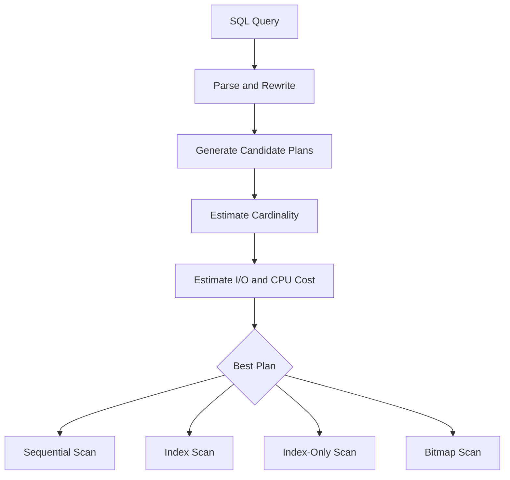
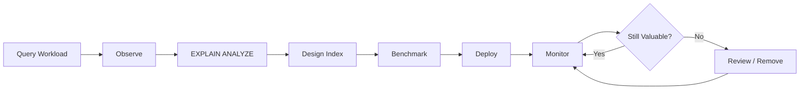

# 03- How Indexes Work

## Overview

A database index is a separate data structure that provides an alternative access path to table data. Instead of scanning table pages and evaluating every row, the database can navigate an index to locate relevant keys and then retrieve the corresponding rows.

Understanding how indexes work internally is more important than memorizing statements such as "indexes make queries faster." Index performance depends on:

- Index data structure
- Key ordering
- Query predicates
- Selectivity and cardinality
- Table and index size
- Cache state
- Physical storage
- Query planner estimates
- Read/write workload

For most transactional PostgreSQL workloads, the B-tree is the default index structure. It supports equality, range predicates, and ordered access efficiently.

The core execution model is:

```text
SQL query
   ↓
Query planner
   ↓
Choose access path
   ↓
Index traversal
   ↓
Locate matching entries
   ↓
Fetch table rows when required
   ↓
Return result
```

An index does not replace the table. It provides another structure through which the database can reach the table efficiently.

## Why Indexes Need Their Own Data Structure

A table is optimized primarily for storing rows. The physical order of rows is not necessarily the order required by a query.

Consider:

```sql
SELECT id, name
FROM users
WHERE email = 'alice@example.com';
```

Without an index, PostgreSQL may scan the table:

```text
Table
┌───────────────────────────┐
│ row 1                     │
│ row 2                     │
│ row 3                     │
│ ...                       │
│ row 10,000,000            │
└───────────────────────────┘
            ↓
     Evaluate email
            ↓
      Matching rows
```

The database has no efficient way to know which physical table page contains the requested email unless some access structure provides that information.

An index maintains a searchable representation of values and references to the underlying table rows.

```text
Index
┌────────────────────────────────┐
│ alice@example.com → row/page   │
│ bob@example.com   → row/page   │
│ carol@example.com → row/page   │
└────────────────────────────────┘
```

The index turns a potentially large table search into a much narrower lookup.

## The B-Tree

A B-tree is a balanced, multi-level tree structure designed to work efficiently with block-oriented storage.

A simplified representation is:

```text
                         Root
                    ┌─────┴─────┐
                    ↓           ↓
                 Internal    Internal
                ┌───┴───┐   ┌───┴───┐
                ↓       ↓   ↓       ↓
              Leaf     Leaf Leaf    Leaf
                ↓       ↓   ↓       ↓
              keys     keys keys    keys
```

Real database implementations use pages containing multiple keys rather than one key per node.

This high fan-out keeps the tree relatively shallow.

For a large index:

```text
Root
  ↓
Internal page
  ↓
Internal page
  ↓
Leaf page
```

Only a small number of page navigations may be necessary to locate a key.

## Why B-Trees Are Shallow

A database page can contain many index entries.

Suppose a simplified internal page can distinguish between thousands of key ranges. A tree with only a few levels can therefore address a very large number of leaf entries.

This is one reason B-trees are effective for disk and SSD-backed databases.

Conceptually:

```text
1 root page
     ↓
many internal pages
     ↓
many leaf pages
     ↓
millions of indexed entries
```

The important property is **high fan-out**, not the exact number of levels.

## What an Index Entry Contains

An index entry generally contains:

```text
Indexed key
+
Reference to the corresponding table row
```

The exact representation depends on the database engine and index type.

For PostgreSQL B-tree indexes on ordinary tables, the index ultimately identifies heap tuples using tuple identifiers (TIDs).

Conceptually:

```text
email = alice@example.com
             ↓
        index entry
             ↓
         heap TID
             ↓
        table tuple
```

The index therefore usually does not contain the entire table row.

This distinction matters when understanding why an index lookup can still require table I/O.

## Index Traversal

Consider:

```sql
SELECT *
FROM users
WHERE email = 'alice@example.com';
```

with:

```sql
CREATE INDEX idx_users_email
ON users (email);
```

A simplified traversal is:

```text
Query
  ↓
Root index page
  ↓
Internal index page
  ↓
Leaf index page
  ↓
email = alice@example.com
  ↓
Heap tuple reference
  ↓
Table page
  ↓
Row
```

The database follows key ranges through the tree until it reaches the leaf page containing the requested value.

For equality predicates, the traversal can stop once the matching key range has been identified.

## Equality Lookups

B-tree indexes efficiently support equality predicates such as:

```sql
SELECT *
FROM users
WHERE email = 'alice@example.com';
```

The database searches for:

```text
alice@example.com
```

rather than checking every row.

This is particularly valuable when the predicate is highly selective.

Examples of common equality lookups:

```sql
WHERE id = $1
WHERE email = $1
WHERE external_id = $1
WHERE customer_id = $1
```

## Range Lookups

B-trees also preserve key ordering.

Therefore they can efficiently support ranges:

```sql
SELECT *
FROM orders
WHERE created_at >= $1
  AND created_at < $2;
```

The database can:

```text
Navigate to first qualifying key
        ↓
Read adjacent leaf entries
        ↓
Continue until upper bound
```

This is different from an equality lookup because the database may need to read many consecutive index entries.

The cost therefore depends heavily on how many rows satisfy the range.

## Ordered Access

Because B-tree keys are ordered, indexes can sometimes satisfy `ORDER BY`.

Consider:

```sql
SELECT id, created_at
FROM orders
ORDER BY created_at DESC
LIMIT 100;
```

An index such as:

```sql
CREATE INDEX idx_orders_created_at
ON orders (created_at DESC);
```

may allow PostgreSQL to read the index in the required order.

Conceptually:

```text
Index
newest
  ↓
newer
  ↓
...
  ↓
older
```

The database can stop after finding the first 100 qualifying rows.

This is particularly powerful when combined with `LIMIT`.

## Index Scan vs Sequential Scan

An index does not guarantee an index scan.

PostgreSQL can choose among different access paths.

### Sequential Scan

```text
Table pages
   ↓
Read many/all pages
   ↓
Evaluate predicate
   ↓
Return matches
```

### Index Scan

```text
Index
  ↓
Find matching entries
  ↓
Fetch table rows
  ↓
Return matches
```

### Index-Only Scan

```text
Index
  ↓
Obtain required values
  ↓
Return result
```

The planner chooses based on estimated cost.

A sequential scan can be faster when the query needs a large fraction of the table because sequential I/O can be much more efficient than many scattered table lookups.

## The Hidden Cost of an Index Scan

An index lookup is not necessarily:

```text
Index → result
```

For a normal index scan, it may be:

```text
Index
  ↓
Tuple reference
  ↓
Heap/table page
  ↓
Tuple
```

If matching rows are scattered across many table pages, the database may perform substantial random page access.

For example:

```text
Index
 ├── row → page 10
 ├── row → page 900
 ├── row → page 42
 ├── row → page 17
 └── row → page 700
```

If many rows match, the table lookups can become expensive.

This is one reason an index scan can lose to a sequential scan for low-selectivity queries.

## Index-Only Scans

A covering index can contain all columns required by a query.

For example:

```sql
CREATE INDEX idx_users_email_covering
ON users (email)
INCLUDE (id, name);
```

For:

```sql
SELECT id, name
FROM users
WHERE email = $1;
```

the index contains:

```text
email
id
name
```

so PostgreSQL may be able to avoid fetching the heap tuple for the requested column values.

The execution path can become:

```text
Index
  ↓
Required values
  ↓
Result
```

However, PostgreSQL still needs to determine whether tuples are visible to the transaction. Its visibility map allows suitable pages to be confirmed without visiting the heap.

Therefore:

> A covering index makes an index-only scan possible; it does not guarantee one.

## Composite Indexes

An index can contain multiple columns:

```sql
CREATE INDEX idx_orders_customer_status_created
ON orders (
    customer_id,
    status,
    created_at DESC
);
```

The index is ordered lexicographically:

```text
(customer_id, status, created_at)
```

Conceptually:

```text
customer 42
├── pending
│   ├── newest
│   ├── ...
│   └── oldest
└── completed
    ├── newest
    └── oldest

customer 43
├── pending
└── completed
```

This allows the database to efficiently navigate combinations of these columns.

## The Leftmost Prefix Principle

For a B-tree index:

```sql
(customer_id, status, created_at)
```

the leading column has special importance.

Queries such as:

```sql
WHERE customer_id = $1
```

can use the index effectively.

So can:

```sql
WHERE customer_id = $1
  AND status = $2;
```

And:

```sql
WHERE customer_id = $1
  AND status = $2
ORDER BY created_at DESC;
```

But an index beginning with `customer_id` is generally not equivalent to an index beginning with `status` for:

```sql
WHERE status = $1;
```

The database may still use the index in some circumstances, but it cannot generally navigate directly to one contiguous `status` range when `customer_id` is unconstrained.

This is why composite index column order matters.

## Equality Before Range

A common composite-index design pattern is:

```text
Equality predicates
        ↓
Range predicate
        ↓
Ordering requirements
```

For example:

```sql
SELECT id, total
FROM orders
WHERE customer_id = $1
  AND status = 'pending'
  AND created_at >= $2
ORDER BY created_at DESC
LIMIT 50;
```

A candidate index is:

```sql
CREATE INDEX idx_orders_customer_status_created
ON orders (
    customer_id,
    status,
    created_at DESC
);
```

The first columns narrow the search space, while `created_at` provides ordered range access.

The exact optimal ordering depends on the workload and planner behavior; "most selective column first" is not a universal rule.

## Index Pages and Table Pages

Indexes and tables are both stored in pages.

Conceptually:

```text
Database
├── Table
│   ├── Page 1
│   ├── Page 2
│   └── ...
│
└── Index
    ├── Root page
    ├── Internal pages
    └── Leaf pages
```

The database reads these pages through its buffer/cache system.

An index therefore has a physical footprint that affects:

- Disk usage
- Memory pressure
- Cache hit rates
- I/O
- Backup size
- Replication
- Maintenance

Indexes are not free metadata.

## Cache Effects

Suppose a frequently used index is small enough to remain mostly cached:

```text
Application
    ↓
Query
    ↓
Index pages already in memory
    ↓
Fast traversal
    ↓
Required table pages
```

This can make repeated indexed lookups very efficient.

However, adding many large indexes can consume memory that could otherwise cache table pages.

Therefore, index design influences the entire database memory hierarchy.

## Index Selectivity

Suppose:

```text
Table size = 10 million rows
```

Query A:

```sql
WHERE email = 'alice@example.com'
```

returns:

```text
1 row
```

Query B:

```sql
WHERE country = 'IN'
```

returns:

```text
4 million rows
```

The first is highly selective.

The second is not.

For Query B, an index could cause:

```text
Index
  ↓
Millions of tuple references
  ↓
Millions of heap fetches
```

A sequential scan may be cheaper.

Selectivity therefore influences whether an index is useful, but it is only one part of the planner's cost model.

## Cardinality and Statistics

The planner needs estimates about the data.

PostgreSQL collects statistics such as:

- Number of distinct values
- Value distributions
- Most common values
- Histograms
- Correlation information

These statistics influence decisions such as:

```text
Index Scan vs Seq Scan
Nested Loop vs Hash Join
Join order
Estimated result size
```

For example, if the planner estimates that:

```text
WHERE status = 'pending'
```

returns 10 rows when it actually returns 5 million, it may choose an unsuitable plan.

After substantial data changes, statistics need to remain current through PostgreSQL's `ANALYZE` and autovacuum mechanisms.

## Correlation Between Table and Index Order

The physical ordering of table rows can influence index-scan performance.

Suppose an index orders rows by:

```text
created_at
```

and the table was physically populated in approximately the same order.

Then nearby index entries may point to nearby table pages.

Conceptually:

```text
Index entries:
1 → page 10
2 → page 10
3 → page 11
4 → page 11
5 → page 12
```

This has better locality than:

```text
1 → page 800
2 → page 17
3 → page 921
4 → page 4
5 → page 700
```

Correlation is therefore another factor that can affect the cost of indexed access.

## Page Splits

B-tree indexes must remain ordered as new keys are inserted.

When a page does not have enough room for a new entry, the database may split the page.

Conceptually:

```text
Before:

[ A B C D E ]

Insert F

After:

[ A B C ] → [ D E F ]
```

Actual implementation details are more sophisticated, but the important point is that index maintenance can involve page restructuring.

High-write workloads therefore create ongoing index maintenance work.

## Random Inserts and Index Locality

Consider an index on:

```sql
id
```

where IDs increase monotonically.

New values tend to arrive near one side of the index.

Now consider random UUID-like keys.

New values are distributed across the index:

```text
Random key
   ↓
Potentially many different leaf pages
```

This can produce different write and locality characteristics.

Modern UUID schemes can provide better temporal locality than fully random UUIDv4 values, but the appropriate identifier strategy depends on system requirements.

The senior-level lesson is not "UUIDs are bad."

It is:

> Key distribution affects index maintenance, locality, storage behavior, and write performance.

## Indexes and MVCC in PostgreSQL

PostgreSQL uses Multi-Version Concurrency Control (MVCC).

Updates do not simply overwrite a row in place in the conceptual sense. New row versions are created while old versions may remain until they are no longer needed.

This has implications for indexes and maintenance.

A high-update workload can generate:

```text
New row versions
       ↓
Dead tuples
       ↓
Vacuum activity
       ↓
Table/index maintenance
```

Index design therefore interacts with PostgreSQL's storage and vacuum behavior.

## Index Bloat

Indexes can accumulate unused or inefficiently arranged space over time, particularly under heavy update/delete workloads.

This can contribute to:

- Larger indexes
- More page reads
- Increased cache pressure
- Longer maintenance operations

Index bloat should be measured rather than assumed.

Operational responses can include:

- Regular vacuuming
- `REINDEX`
- `REINDEX CONCURRENTLY` where appropriate
- Better index design
- Removing redundant indexes

Maintenance strategy depends on PostgreSQL version, workload, index type, and operational constraints.

## Indexes and Writes

For:

```sql
INSERT INTO orders (...)
VALUES (...);
```

PostgreSQL must maintain every affected index.

Conceptually:

```text
INSERT
  ↓
Table modification
  ├── Index A update
  ├── Index B update
  ├── Index C update
  └── Index D update
```

Therefore:

```text
More indexes
    ↓
More write work
    ↓
More WAL / I/O / maintenance
```

The same principle applies to updates and deletes.

## Indexes and HOT Updates

PostgreSQL can sometimes perform a Heap-Only Tuple (HOT) update when an update does not modify indexed columns and there is suitable space on the same heap page.

This can reduce index maintenance.

Conceptually:

```text
Update non-indexed column
        ↓
HOT update possible
        ↓
Less index modification
```

If indexed columns are changed, the opportunity for a HOT update may be lost.

This is another reason not to index columns without a workload-driven reason.

## Expression Indexes

An index can be built on an expression rather than a raw column.

For example:

```sql
CREATE INDEX idx_users_lower_email
ON users (lower(email));
```

This supports queries such as:

```sql
SELECT id
FROM users
WHERE lower(email) = lower($1);
```

Without the expression index, a function applied to the indexed column may prevent a normal index on `email` from providing the required access path.

The query expression and index expression need to align appropriately.

## Partial Indexes

A partial index contains only rows satisfying a predicate.

Example:

```sql
CREATE INDEX idx_orders_pending
ON orders (created_at DESC)
WHERE status = 'pending';
```

The index is conceptually:

```text
All orders
├── completed → not indexed
├── cancelled → not indexed
└── pending   → indexed
```

This can produce a much smaller structure when the indexed subset is small.

It is particularly useful for workloads such as:

- Pending jobs
- Active records
- Unprocessed events
- Non-deleted records
- Current subscriptions

## How a Query Uses a Partial Index

For:

```sql
SELECT id
FROM orders
WHERE status = 'pending'
ORDER BY created_at DESC
LIMIT 100;
```

PostgreSQL can reason that qualifying rows belong to the partial index predicate.

The access path can become:

```text
Partial index
    ↓
Newest pending orders
    ↓
First 100
```

The query must contain conditions compatible with the partial-index predicate for the planner to establish that the index is applicable.

## Indexes and Joins

Consider:

```sql
SELECT o.id
FROM customers c
JOIN orders o
  ON o.customer_id = c.id
WHERE c.id = $1;
```

An index on:

```sql
orders(customer_id)
```

can provide an efficient path to the customer's orders.

The execution can conceptually be:

```text
Customer
   ↓
customer_id = 42
   ↓
Orders index
   ↓
Matching order rows
```

Without the index, the database may need to consider a much larger portion of `orders`.

The actual plan could still use a hash join, merge join, or another strategy depending on cardinality and cost estimates.

## Indexes and Foreign Keys

A foreign-key column is often an index candidate because child rows are commonly retrieved by parent key:

```sql
SELECT *
FROM orders
WHERE customer_id = $1;
```

However, a foreign key does not universally imply that the database automatically creates the required index.

For PostgreSQL, a foreign key constraint on the child table does not automatically create an index on the referencing column.

Applications should therefore evaluate and create appropriate indexes based on:

- Join patterns
- Child-row lookups
- Parent updates/deletes
- Cascading operations
- Query workload

## Indexes and Sorting

Consider:

```sql
SELECT id, created_at
FROM events
WHERE tenant_id = $1
ORDER BY created_at DESC
LIMIT 100;
```

An index such as:

```sql
CREATE INDEX idx_events_tenant_created
ON events (tenant_id, created_at DESC);
```

matches the access pattern:

```text
tenant_id
    ↓
created_at DESC
    ↓
first 100 rows
```

This can avoid scanning and sorting a large number of candidate rows.

The combination of:

```text
Equality filter
+
Ordering
+
LIMIT
```

is one of the most valuable index patterns in API-heavy backend systems.

## Indexes and Keyset Pagination

Offset pagination:

```sql
SELECT id, created_at
FROM events
ORDER BY created_at DESC
LIMIT 50 OFFSET 100000;
```

requires the database to move past many preceding entries.

Keyset pagination can instead use the last-seen key:

```sql
SELECT id, created_at
FROM events
WHERE (created_at, id) < ($1, $2)
ORDER BY created_at DESC, id DESC
LIMIT 50;
```

with:

```sql
CREATE INDEX idx_events_created_id
ON events (created_at DESC, id DESC);
```

The database can navigate close to the continuation point rather than discarding a large number of preceding rows.

This is useful for:

- Activity feeds
- Audit logs
- Message histories
- Large event streams
- High-volume REST APIs

## Query Planner Decision Flow

A simplified PostgreSQL planning process looks like:



The database is not deciding:

```text
Index = good
Sequential scan = bad
```

It is deciding:

```text
Which access path has the lowest estimated execution cost?
```

## Bitmap Index Scans

PostgreSQL can use a bitmap strategy when many rows match an indexed predicate.

Conceptually:

```text
Index
  ↓
Collect matching tuple locations
  ↓
Build bitmap
  ↓
Visit relevant heap pages
  ↓
Return rows
```

This can be more efficient than performing individual random heap fetches for every index entry.

A simplified comparison:

| Strategy | Typical Use |
|---|---|
| Sequential Scan | Large portion of table required |
| Index Scan | Small selective result |
| Index-Only Scan | Required data available from index and visibility permits |
| Bitmap Heap Scan | Many matching rows with useful index filtering |

Actual plan selection depends on cost estimates and workload.

## How to Inspect Index Behavior

Use:

```sql
EXPLAIN (ANALYZE, BUFFERS)
SELECT id, name
FROM users
WHERE email = 'alice@example.com';
```

Important fields include:

| Plan Information | What It Tells You |
|---|---|
| `Index Scan` | An index is being traversed and table tuples are fetched |
| `Index Only Scan` | Query may be satisfied from index data |
| `Bitmap Index Scan` | Index is used to build matching tuple locations |
| `Seq Scan` | Table pages are scanned sequentially |
| `actual time` | Measured execution timing |
| `rows` | Estimated and actual row counts |
| `Buffers` | Shared buffer activity |
| `Heap Fetches` | Heap accesses during an index-only scan |

For production investigation, `BUFFERS` is particularly useful because latency alone does not explain whether the query is I/O-bound or CPU-bound.

## Practical Example

Create a workload:

```sql
CREATE TABLE orders (
    id bigint GENERATED ALWAYS AS IDENTITY PRIMARY KEY,
    customer_id bigint NOT NULL,
    status text NOT NULL,
    created_at timestamptz NOT NULL,
    total numeric(12, 2) NOT NULL
);
```

Suppose the API executes:

```sql
SELECT id, created_at, total
FROM orders
WHERE customer_id = $1
  AND status = 'pending'
ORDER BY created_at DESC
LIMIT 50;
```

A candidate index is:

```sql
CREATE INDEX idx_orders_customer_status_created
ON orders (
    customer_id,
    status,
    created_at DESC
)
INCLUDE (id, total);
```

The index provides:

```text
customer_id
    ↓
status
    ↓
created_at DESC
    ↓
id + total
```

This aligns the index with:

```text
WHERE customer_id = ?
WHERE status = ?
ORDER BY created_at DESC
LIMIT 50
SELECT id, created_at, total
```

It may allow PostgreSQL to perform a highly efficient index-only access path, subject to visibility-map conditions and planner decisions.

## What an Index Does Not Do

Indexes do not:

- Make every query fast
- Eliminate table I/O in every case
- Guarantee an index scan
- Automatically solve poor schema design
- Replace query optimization
- Replace appropriate partitioning for every large-table workload
- Eliminate the cost of returning millions of rows
- Make unbounded queries safe
- Compensate for inefficient application behavior

For example:

```sql
SELECT *
FROM orders
WHERE customer_id = $1;
```

may still be expensive if the customer has 20 million orders.

The index can efficiently locate those rows, but the application still has to process and transmit the result.

## Common Mistakes

### Thinking an Index Is a Pointer to a Row and Nothing More

Indexes contain structured searchable data, not merely a flat list of pointers.

Their ordering and internal organization are what make efficient traversal possible.

### Assuming Every Indexed Query Is `O(log n)`

Finding a key in a B-tree can be approximately logarithmic, but query execution includes:

- Index traversal
- Matching index entries
- Heap access
- Visibility checks
- Result processing
- Sorting when necessary

A query matching millions of rows is not effectively an `O(log n)` operation.

### Ignoring Heap Access

An index scan can still require many table-page reads.

Always inspect the actual execution plan.

### Creating Composite Indexes in Arbitrary Column Order

For:

```sql
(a, b, c)
```

column order affects which query patterns can efficiently navigate the index.

Design the index from actual predicates and ordering requirements.

### Believing the Most Selective Column Must Always Come First

Selectivity matters, but composite-index ordering depends on the complete workload.

Equality predicates, range predicates, ordering, join patterns, and query frequency all matter.

### Forcing Index Usage

Trying to make every query use an index is usually the wrong goal.

The planner should choose the cheapest access path.

### Ignoring Index Maintenance

Indexes consume:

- Disk
- Memory
- CPU
- I/O
- WAL
- Maintenance time

An unused index is still a production cost.

## Production Considerations

### Measure Before and After

Use:

```sql
EXPLAIN (ANALYZE, BUFFERS)
```

before and after an index change.

Compare:

- Execution time
- Planning time
- Actual rows
- Buffer hits
- Buffer reads
- Heap fetches
- Query throughput

### Test With Production-Like Data

An index that works well against:

```text
100,000 rows
```

may behave differently against:

```text
500 million rows
```

Test with representative:

- Data volume
- Data distribution
- Cardinality
- Query frequency
- Concurrency

### Monitor Write Impact

After adding an index, monitor:

```text
INSERT latency
UPDATE latency
DELETE latency
WAL generation
Replication lag
CPU
I/O
Disk usage
```

### Monitor Index Usage

PostgreSQL exposes index statistics through views such as:

```sql
SELECT
    schemaname,
    relname AS table_name,
    indexrelname AS index_name,
    idx_scan,
    pg_size_pretty(pg_relation_size(indexrelid)) AS index_size
FROM pg_stat_user_indexes
ORDER BY idx_scan DESC;
```

A low `idx_scan` count does not automatically mean an index is useless. Some indexes support constraints or infrequent but critical operations.

### Build Large Indexes Carefully

For production PostgreSQL systems, consider:

```sql
CREATE INDEX CONCURRENTLY idx_orders_customer_id
ON orders (customer_id);
```

`CONCURRENTLY` can reduce blocking of normal table writes during index creation, but it requires more work and has operational restrictions.

Large index builds should be planned around:

- Traffic
- CPU
- Disk I/O
- WAL generation
- Replica lag
- Available disk space
- Deployment rollback strategy

## Security Considerations

Indexes are primarily a performance mechanism, but they can indirectly affect security and reliability.

### Avoid Data Leakage Through Query Design

An index does not enforce authorization.

For multi-tenant systems, queries still need correct tenant scoping:

```sql
SELECT id, total
FROM orders
WHERE tenant_id = $1
  AND id = $2;
```

An index can optimize this query:

```sql
CREATE INDEX idx_orders_tenant_id_id
ON orders (tenant_id, id);
```

but the application or database authorization layer must still enforce the tenant boundary.

### Avoid Dynamic SQL for Index or Query Decisions

Index optimization does not justify constructing SQL through string concatenation.

Use parameterized queries:

```sql
SELECT id, total
FROM orders
WHERE tenant_id = $1
  AND id = $2;
```

Indexes optimize execution after the database receives the query; they do not make unsafe SQL construction safe.

## Scalability and Reliability

Indexes become increasingly important as data volume and traffic grow, but they must scale with the workload.

A mature indexing strategy considers:

```text
Traffic growth
+
Data growth
+
Write growth
+
Index growth
+
Replication
+
Backup/restore
```

For very large systems, indexes may be combined with:

- Table partitioning
- Read replicas
- Connection pooling
- Caching
- Archival
- Keyset pagination
- Workload isolation

Do not use indexes as a substitute for architectural scaling when the underlying workload requires a different strategy.

## Index Lifecycle in a Production System

A useful operational lifecycle is:



Treat indexes as managed production assets.

They should be:

- Named consistently
- Created through migrations
- Tested before deployment
- Monitored after deployment
- Reviewed as workloads change
- Removed when demonstrably redundant or obsolete

## Key Takeaways

- **A B-tree index is a balanced, page-oriented search structure that lets the database navigate directly toward matching keys instead of scanning the entire table.**
- **An index scan can still require table-page access; index-only scans can reduce this cost when the index contains the required data and PostgreSQL visibility information permits it.**
- **Composite-index column order determines which predicates and ordering requirements can be efficiently supported, making query shape more important than generic indexing rules.**
- **The query planner chooses between sequential scans, index scans, bitmap scans, and other strategies based on estimated cost, statistics, selectivity, and physical access patterns.**
- **Indexes are production resources: they improve selected reads but consume storage, cache, CPU, I/O, and write capacity, so they must be measured and monitored throughout their lifecycle.**