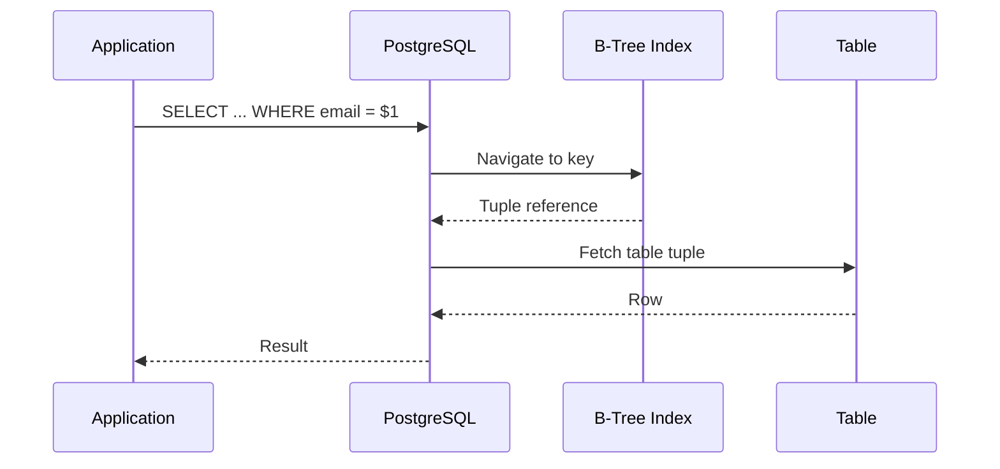
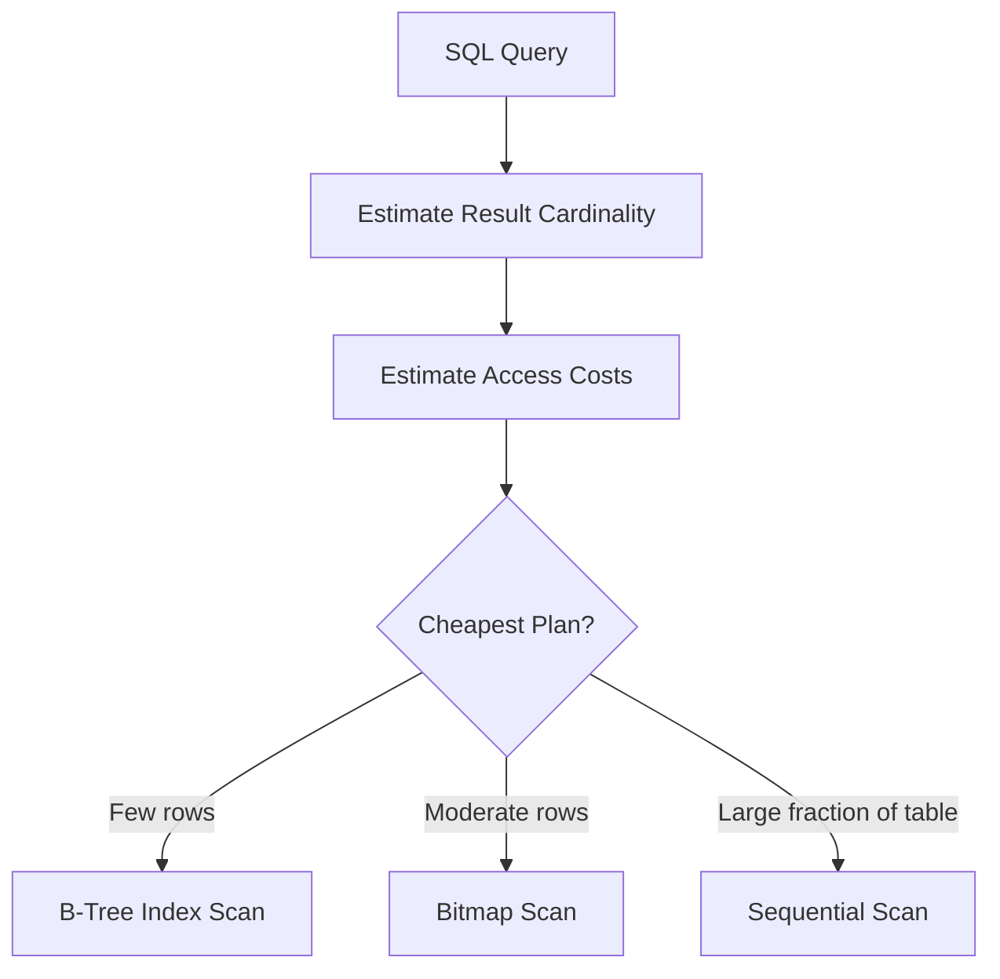

# 04- B-Tree Indexes

## Overview

A B-tree index is the default general-purpose index structure for most relational database workloads. In PostgreSQL, B-tree indexes support equality, range comparisons, ordered access, prefix-compatible composite predicates, and many uniqueness constraints.

The important engineering idea is that a B-tree maintains indexed keys in a balanced, searchable structure:

```text
                         Root
                    ┌──────┴──────┐
                    ↓             ↓
               Internal       Internal
              ┌────┴────┐     ┌────┴────┐
              ↓         ↓     ↓         ↓
            Leaf      Leaf   Leaf      Leaf
              ↓         ↓     ↓         ↓
            keys      keys   keys      keys
```

Unlike an in-memory binary search tree, database B-trees are designed around storage pages. Each page can contain many keys and pointers, giving the tree high fan-out and keeping it shallow even when the table contains millions or billions of rows.

For backend engineers, B-tree indexes are especially important for:

- API lookup queries
- Primary-key access
- Unique constraints
- Foreign-key access patterns
- Time-range queries
- Sorting and pagination
- Composite filtering
- Join operations
- Multi-tenant data access

A B-tree should not be treated as a guarantee that a query will use an index. The database optimizer evaluates the expected cost of different access paths and may correctly choose a sequential scan instead.

## Why B-Trees Exist

A table is optimized for storing rows, not for answering every possible lookup efficiently.

Consider:

```sql
SELECT id, name
FROM users
WHERE email = 'alice@example.com';
```

Without an appropriate index, the database may need to inspect a large number of table rows:

```text
Table
┌──────────────┐
│ Row 1        │
│ Row 2        │
│ Row 3        │
│ ...          │
│ Row N        │
└──────────────┘
       ↓
Evaluate email for each row
       ↓
Matching row
```

With:

```sql
CREATE INDEX idx_users_email
ON users (email);
```

the database gains another access path:

```text
Query
  ↓
B-tree index
  ↓
Locate email key
  ↓
Find table tuple reference
  ↓
Fetch row
```

The index avoids examining every table row when the indexed access path is cheaper.

## What a B-Tree Is

A B-tree is a balanced search tree optimized for block/page-based storage.

Its major properties are:

| Property | Engineering significance |
|---|---|
| Ordered keys | Supports equality, ranges, and ordered access |
| Balanced height | Predictable traversal depth |
| High fan-out | Few levels even for large indexes |
| Page-oriented storage | Efficient interaction with database storage |
| Sorted leaf entries | Efficient sequential traversal of key ranges |
| Dynamic updates | Supports inserts and deletes without rebuilding the entire index |

The exact implementation differs between database engines. PostgreSQL's implementation is a B-tree variant designed around database pages and concurrency requirements rather than a textbook binary tree.

## B-Tree Structure

A simplified B-tree can be visualized as:

```text
                    [50]
                  /      \
          [20, 35]        [70, 90]
         /   |   \        /   |   \
       ...  ...  ...    ...  ...  ...
```

The root and internal pages contain separator keys that guide navigation.

Leaf pages contain the actual indexed key entries and references needed to locate table tuples.

The leaves are linked logically, allowing the database to walk through adjacent key ranges efficiently.

Conceptually:

```text
Leaf 1  →  Leaf 2  →  Leaf 3  →  Leaf 4
  10         30         50         70
  20         40         60         80
```

This ordered leaf structure is important for range queries and ordered scans.

## B-Tree Lookup

Suppose:

```sql
CREATE INDEX idx_users_email
ON users (email);
```

and the query is:

```sql
SELECT *
FROM users
WHERE email = 'alice@example.com';
```

A simplified traversal is:

```text
                         Root
                           ↓
                    Compare target
                           ↓
                     Internal page
                           ↓
                    Compare target
                           ↓
                       Leaf page
                           ↓
             alice@example.com
                           ↓
                     Tuple reference
                           ↓
                       Heap row
```

The database does not normally inspect every index entry.

It uses the ordering of keys to determine which child page can contain the target value.

## Why B-Trees Are Fast

A common oversimplification is:

> B-trees are fast because lookup is O(log n).

That is directionally correct for tree traversal, but incomplete for database systems.

Actual query cost includes:

```text
Index traversal
+
Matching index entries
+
Heap/table access
+
Visibility checks
+
CPU processing
+
Result construction
```

A highly selective lookup may be very cheap:

```text
10,000,000 table rows
        ↓
1 matching row
```

A query matching 5,000,000 rows can still be expensive even when an index exists.

The index reduces the cost of locating qualifying rows; it does not make processing a huge result set free.

## High Fan-Out

Traditional binary trees have at most two children per node.

Database B-trees have many child pointers per page.

Conceptually:

```text
Binary tree:

             50
            /  \
          25    75
         / \    / \
       ...

B-tree:

              [25 50 75]
             /   |   |   \
           ...  ... ...  ...
```

High fan-out significantly reduces tree height.

For database storage, this matters because traversing the tree can involve reading pages from memory or storage.

A shallow tree means fewer page accesses.

## B-Tree Pages

Database indexes are stored in pages rather than as individual objects allocated independently for every key.

Conceptually:

```text
B-tree index
│
├── Root page
│
├── Internal page
│   ├── key
│   ├── key
│   └── child references
│
└── Leaf pages
    ├── key + tuple reference
    ├── key + tuple reference
    └── ...
```

The database buffer manager caches frequently accessed pages.

Therefore, a B-tree lookup can often involve:

```text
CPU
 ↓
Cached root
 ↓
Cached internal page
 ↓
Cached leaf page
 ↓
Heap page
```

rather than physical storage access for every level.

## Equality Searches

B-trees are excellent for equality predicates:

```sql
SELECT *
FROM users
WHERE id = $1;
```

```sql
SELECT *
FROM users
WHERE email = $1;
```

```sql
SELECT *
FROM orders
WHERE external_id = $1;
```

For highly selective values, an index can reduce the amount of data the database must inspect dramatically.

Primary keys and unique constraints commonly rely on B-tree indexes in PostgreSQL.

## Range Searches

B-trees are also designed for ordered range access.

For example:

```sql
SELECT id, total
FROM orders
WHERE created_at >= $1
  AND created_at < $2;
```

The database can:

1. Navigate to the first qualifying key.
2. Read adjacent leaf entries.
3. Continue until the upper bound is reached.

Conceptually:

```text
Index:

Jan 01
Jan 02
Jan 03
Jan 04  ← start
Jan 05
Jan 06
Jan 07
Jan 08  ← end
Jan 09
Jan 10

        └──────────┘
          scan range
```

This is one of the most important reasons B-trees are useful for timestamp columns.

## Supported Comparison Operators

B-tree indexes generally support ordering operators such as:

```sql
=
<
<=
>
>=
```

and can therefore support queries involving:

```sql
WHERE price >= 100
WHERE created_at < $1
WHERE score BETWEEN $1 AND $2
```

They can also support ordered access for `ORDER BY` when the query shape and index ordering are compatible.

## `ORDER BY` and B-Trees

Consider:

```sql
SELECT id, created_at
FROM orders
ORDER BY created_at DESC
LIMIT 100;
```

A suitable index:

```sql
CREATE INDEX idx_orders_created_at_desc
ON orders (created_at DESC);
```

can allow the database to read the index in the required order.

Instead of:

```text
Read many rows
      ↓
Sort rows
      ↓
Take first 100
```

the database may use:

```text
B-tree
  ↓
Read newest entries first
  ↓
Take 100
```

This is especially valuable when `LIMIT` is small relative to the table.

## Index Ordering

PostgreSQL supports explicit index sort direction:

```sql
CREATE INDEX idx_orders_created_at
ON orders (created_at DESC);
```

B-tree indexes can also generally be scanned in the opposite direction.

Therefore, an index on:

```sql
created_at
```

can often support both ascending and descending access.

Explicit index direction becomes more important with multi-column ordering.

For example:

```sql
ORDER BY customer_id ASC, created_at DESC
```

may require an index whose column ordering matches the desired mixed-direction pattern.

## Composite B-Tree Indexes

A B-tree can contain multiple columns:

```sql
CREATE INDEX idx_orders_customer_status_created
ON orders (
    customer_id,
    status,
    created_at DESC
);
```

The ordering is lexicographic:

```text
customer_id
    ↓
status
    ↓
created_at
```

Conceptually:

```text
customer 10
├── pending
│   ├── newest
│   ├── ...
│   └── oldest
└── completed
    ├── newest
    └── oldest

customer 11
├── pending
└── completed
```

This allows the database to efficiently locate a subset of the index based on leading columns.

## The Leftmost Prefix

For:

```sql
(customer_id, status, created_at)
```

the first column defines the primary ordering of the index.

These queries can make strong use of the index:

```sql
WHERE customer_id = $1
```

```sql
WHERE customer_id = $1
  AND status = $2
```

```sql
WHERE customer_id = $1
  AND status = $2
  AND created_at >= $3
```

But:

```sql
WHERE status = $1
```

does not provide the same direct navigation because `customer_id` is unconstrained.

The important principle is:

> Composite B-tree indexes are ordered by their leading columns; column order must reflect the query workload.

This is sometimes called the **leftmost-prefix principle**, although modern query planners have additional capabilities and the exact usability of an index should always be verified with `EXPLAIN`.

## Equality Before Range

A common index design pattern is:

```text
Equality predicates
        ↓
Range predicate
        ↓
Ordering
```

For:

```sql
SELECT id, total
FROM orders
WHERE customer_id = $1
  AND status = 'pending'
  AND created_at >= $2
ORDER BY created_at DESC
LIMIT 50;
```

a candidate index is:

```sql
CREATE INDEX idx_orders_customer_status_created
ON orders (
    customer_id,
    status,
    created_at DESC
)
INCLUDE (id, total);
```

This allows the index to narrow the search using:

```text
customer_id
     ↓
status
     ↓
created_at range/order
```

The exact design should be validated against real query plans and workload characteristics.

## B-Trees and Selectivity

Consider a table containing 100 million rows.

Query A:

```sql
WHERE id = 123
```

may return one row.

Query B:

```sql
WHERE status = 'active'
```

may return 90 million rows.

An index on `status` exists, but using it for Query B may be more expensive than scanning the table.

The planner might choose:

```text
Index scan:
index → millions of entries → heap pages
```

or:

```text
Sequential scan:
table pages → evaluate predicate
```

The optimizer chooses based on estimated cost.

Therefore:

> The existence of a B-tree index does not imply that PostgreSQL should use it.

## B-Tree Index Scan

A simplified index scan looks like:



This illustrates why a normal index scan can require two logical structures:

```text
Index → Heap
```

The index locates the tuple; the heap contains the row.

## Index-Only Scans

If the query only needs columns available from the index, PostgreSQL may perform an index-only scan.

Example:

```sql
CREATE INDEX idx_users_email_covering
ON users (email)
INCLUDE (id, name);
```

Query:

```sql
SELECT id, name
FROM users
WHERE email = $1;
```

The index contains:

```text
email
id
name
```

so PostgreSQL may avoid fetching the heap tuple.

However, PostgreSQL's MVCC visibility rules mean that an index-only scan can still need heap access for some tuples.

The visibility map determines whether heap visibility information can be trusted without visiting the table page.

Therefore:

> `INCLUDE` makes an index capable of covering a query; it does not guarantee an index-only scan.

## B-Trees and `NULL`

B-tree indexes can contain `NULL` values.

For example:

```sql
CREATE INDEX idx_users_deleted_at
ON users (deleted_at);
```

can support queries involving:

```sql
WHERE deleted_at IS NULL
```

The planner's ability to use the index depends on the query, data distribution, and cost estimates.

For frequently accessed "active row" workloads, a partial index can often be more efficient:

```sql
CREATE INDEX idx_users_active
ON users (id)
WHERE deleted_at IS NULL;
```

## Unique B-Tree Indexes

B-tree indexes are commonly used to enforce uniqueness.

For example:

```sql
CREATE UNIQUE INDEX ux_users_email
ON users (email);
```

This provides both:

- An indexed access path for `email`
- A uniqueness guarantee

In production schema design, prefer a database constraint when the business rule is a constraint:

```sql
ALTER TABLE users
ADD CONSTRAINT users_email_key
UNIQUE (email);
```

The database will maintain the necessary unique index as part of enforcing the constraint.

Application-level checks such as:

```python
if not User.objects.filter(email=email).exists():
    create_user(...)
```

are not sufficient under concurrency.

Two requests can pass the check simultaneously.

Database-enforced uniqueness provides the required correctness boundary.

## B-Trees and Foreign Keys

Suppose:

```sql
CREATE TABLE orders (
    id bigint PRIMARY KEY,
    customer_id bigint NOT NULL REFERENCES customers(id)
);
```

An index on:

```sql
orders(customer_id)
```

can efficiently support:

```sql
SELECT *
FROM orders
WHERE customer_id = $1;
```

It can also be important for parent-row updates/deletes depending on the foreign-key action and workload.

PostgreSQL does not automatically create an index on the referencing side of a foreign key.

Therefore, foreign-key columns should be evaluated as explicit index candidates.

## B-Trees and Joins

Consider:

```sql
SELECT o.id, o.total
FROM customers c
JOIN orders o
  ON o.customer_id = c.id
WHERE c.id = $1;
```

An index on:

```sql
orders(customer_id)
```

provides an efficient access path to the customer's orders.

Conceptually:

```text
customers.id = 42
       ↓
orders.customer_id index
       ↓
matching orders
```

However, PostgreSQL can also choose hash joins, merge joins, or sequential scans depending on estimated cardinality and cost.

Do not design indexes solely from the join syntax; inspect the actual workload.

## B-Trees and Keyset Pagination

B-tree ordering makes indexes particularly useful for keyset pagination.

Instead of:

```sql
SELECT id, created_at
FROM events
ORDER BY created_at DESC
LIMIT 50 OFFSET 100000;
```

use a continuation key:

```sql
SELECT id, created_at
FROM events
WHERE (created_at, id) < ($1, $2)
ORDER BY created_at DESC, id DESC
LIMIT 50;
```

with:

```sql
CREATE INDEX idx_events_created_id
ON events (created_at DESC, id DESC);
```

The database can navigate directly toward the continuation point.

This is generally preferable for large datasets because offset pagination can require the database to process and discard increasingly large numbers of preceding rows.

## B-Tree Page Splits

B-tree indexes must remain ordered when new keys are inserted.

If a leaf page becomes full, the database may split it.

Conceptually:

```text
Before:

[10 20 30 40 50]

Insert 35

After:

[10 20 30] → [35 40 50]
```

The real implementation also updates parent structures and manages concurrency.

Page splits can generate additional work and affect index locality.

High-write workloads therefore need careful index management.

## Sequential Keys vs Random Keys

Consider an index on an increasing key:

```text
1001
1002
1003
1004
1005
```

New entries generally arrive near the end of the key space.

Random identifiers can distribute inserts across many parts of the B-tree.

This can affect:

- Page locality
- Page splits
- Cache behavior
- Write amplification
- Index size

This does not mean random UUIDs are universally wrong. Identifier choice should consider distributed-system requirements, privacy, ordering, storage characteristics, and workload.

## B-Trees and Updates

Every affected index may need maintenance when rows are inserted, updated, or deleted.

For:

```sql
UPDATE orders
SET status = 'completed'
WHERE id = $1;
```

an index on `status` may require index maintenance because an indexed value changed.

Conceptually:

```text
UPDATE
  ↓
Heap tuple changes
  ↓
Affected indexes evaluated
  ↓
Index maintenance
```

An index on a frequently updated column can therefore increase write overhead.

This is one reason indexes should be workload-driven rather than added indiscriminately.

## PostgreSQL MVCC and Indexes

PostgreSQL uses MVCC, meaning multiple row versions can exist during normal operation.

Updates and deletes can produce dead tuples that later require cleanup.

A high-write workload can therefore produce:

```text
Updates/deletes
      ↓
Dead tuples
      ↓
VACUUM
      ↓
Storage cleanup
```

Indexes participate in this storage lifecycle.

Poorly maintained or heavily modified indexes can become larger than necessary and increase I/O and cache pressure.

## B-Tree Index Bloat

Index bloat refers to inefficiently utilized index space.

Potential symptoms include:

- Index size growing disproportionately
- Increased page reads
- Higher cache pressure
- Longer maintenance operations

Useful operational tools include:

```sql
SELECT
    schemaname,
    relname AS table_name,
    indexrelname AS index_name,
    pg_size_pretty(pg_relation_size(indexrelid)) AS index_size,
    idx_scan
FROM pg_stat_user_indexes
ORDER BY pg_relation_size(indexrelid) DESC;
```

Do not remove an index solely because `idx_scan` is low. An index may support:

- Constraints
- Rare but critical queries
- Operational procedures
- Foreign-key-related workloads

Index removal should be based on workload evidence.

## Partial B-Tree Indexes

A partial index indexes only rows satisfying a predicate.

Example:

```sql
CREATE INDEX idx_orders_pending_created
ON orders (created_at DESC)
WHERE status = 'pending';
```

If only a small percentage of orders are pending, this index can be substantially smaller than:

```sql
CREATE INDEX idx_orders_status_created
ON orders (status, created_at DESC);
```

A query such as:

```sql
SELECT id, created_at
FROM orders
WHERE status = 'pending'
ORDER BY created_at DESC
LIMIT 100;
```

can potentially use the partial index directly.

Partial indexes are especially useful for operational subsets such as:

- Active records
- Pending jobs
- Unprocessed events
- Non-deleted rows
- Current subscriptions

## Expression B-Tree Indexes

A B-tree can index an expression.

Example:

```sql
CREATE INDEX idx_users_lower_email
ON users (lower(email));
```

This supports access patterns such as:

```sql
SELECT id
FROM users
WHERE lower(email) = lower($1);
```

Without an expression index, a normal index on:

```sql
email
```

may not provide the required access path for the transformed expression.

The indexed expression and query expression need to be compatible.

## B-Tree Operator Classes

At a more advanced level, PostgreSQL B-tree behavior is defined through operator classes.

An operator class tells PostgreSQL which operators and ordering semantics are appropriate for an indexed data type.

This matters for advanced types and custom database behavior.

Most application developers do not need to configure operator classes manually, but senior engineers should know that:

> Index behavior is determined not only by the physical structure but also by the comparison semantics associated with the indexed data type.

## When B-Trees Are a Good Choice

Use a B-tree when the workload needs:

| Workload | B-tree suitability |
|---|---|
| Equality lookup | Excellent |
| Range lookup | Excellent |
| `ORDER BY` | Excellent when ordering matches |
| Primary key | Excellent |
| Unique constraint | Excellent |
| Foreign-key lookup | Often appropriate |
| Timestamp filtering | Excellent |
| Keyset pagination | Excellent |
| Prefix text search | Sometimes |
| Full-text search | Usually not the right structure |
| JSON containment | Usually use specialized indexes |
| Spatial queries | Usually use spatial indexes |

B-tree is the default starting point, not the universal answer.

## When Not to Use a B-Tree

A different index type may be more appropriate when the query semantics differ.

For example:

- PostgreSQL `GIN` for many inverted-index workloads such as suitable JSONB or full-text use cases
- PostgreSQL `GiST` for certain geometric, range, and extensible search workloads
- PostgreSQL `BRIN` for very large tables where physical row ordering correlates strongly with indexed values

The correct choice follows the query workload rather than the popularity of an index type.

## B-Tree vs Sequential Scan

The optimizer's decision can be summarized as:



These boundaries are not fixed percentages.

They depend on:

- Table size
- Index size
- Selectivity
- Data distribution
- Physical correlation
- Cache state
- Random page cost
- CPU cost
- Query projection
- Concurrent workload

## Inspecting B-Tree Usage

Use:

```sql
EXPLAIN (ANALYZE, BUFFERS)
SELECT id, created_at, total
FROM orders
WHERE customer_id = $1
  AND status = 'pending'
ORDER BY created_at DESC
LIMIT 50;
```

Look for nodes such as:

```text
Index Scan
Index Only Scan
Bitmap Index Scan
Bitmap Heap Scan
Seq Scan
```

Also compare:

```text
estimated rows
actual rows
execution time
shared hit blocks
shared read blocks
heap fetches
```

A particularly important diagnostic is a large mismatch between estimated and actual row counts.

For example:

```text
estimated rows: 10
actual rows:    2,000,000
```

can cause the planner to choose an inappropriate access strategy.

## Practical Production Example

Suppose a REST API exposes:

```text
GET /customers/{customer_id}/orders?status=pending&limit=50
```

The database query is:

```sql
SELECT id, created_at, total
FROM orders
WHERE customer_id = $1
  AND status = $2
ORDER BY created_at DESC
LIMIT $3;
```

A suitable B-tree candidate is:

```sql
CREATE INDEX idx_orders_customer_status_created
ON orders (
    customer_id,
    status,
    created_at DESC
)
INCLUDE (id, total);
```

The request path becomes:

```text
Client
  ↓
Nginx / Load Balancer
  ↓
FastAPI / Django
  ↓
Parameterized SQL
  ↓
PostgreSQL planner
  ↓
B-tree index
  ↓
Matching order rows
  ↓
API serialization
  ↓
Client
```

The index is valuable because it aligns with the complete access pattern:

```text
Filter:
customer_id
status

Order:
created_at DESC

Projection:
id
created_at
total
```

The design should still be validated using realistic data and:

```sql
EXPLAIN (ANALYZE, BUFFERS)
```

## Production Considerations

### Create Indexes Through Migrations

For Django or other migration-based systems, index definitions should be version-controlled and deployed through the normal schema migration process.

Avoid manually creating production indexes without recording the change in the schema-management system.

### Large Index Creation

For a large PostgreSQL table, consider:

```sql
CREATE INDEX CONCURRENTLY idx_orders_customer_id
ON orders (customer_id);
```

`CONCURRENTLY` reduces blocking of normal table writes compared with a standard index build, but it has additional execution cost and operational restrictions.

Index creation should be planned around:

- Production traffic
- CPU
- I/O
- Disk capacity
- WAL generation
- Replica lag
- Deployment windows

### Monitor Index Size

Useful information includes:

```sql
SELECT
    indexrelname AS index_name,
    pg_size_pretty(pg_relation_size(indexrelid)) AS size
FROM pg_stat_user_indexes
ORDER BY pg_relation_size(indexrelid) DESC;
```

Large indexes can affect:

- Backup size
- Restore time
- Replication
- Cache efficiency
- Storage costs

### Monitor Index Usage

PostgreSQL provides usage statistics:

```sql
SELECT
    schemaname,
    relname AS table_name,
    indexrelname AS index_name,
    idx_scan,
    idx_tup_read,
    idx_tup_fetch
FROM pg_stat_user_indexes
ORDER BY idx_scan DESC;
```

Use these metrics alongside query logs and workload analysis.

### Test With Production-Like Data

Index behavior depends on data distribution.

A development database containing:

```text
10,000 rows
```

cannot reliably predict behavior on:

```text
500 million rows
```

Test with realistic:

- Row counts
- Cardinalities
- Value distributions
- Query concurrency
- Read/write ratios
- Cache conditions

## Common Mistakes

### Creating an Index for Every Column

This produces:

```text
More indexes
   ↓
Higher write cost
   ↓
More storage
   ↓
More cache pressure
   ↓
More maintenance
```

Index columns based on real query patterns.

### Assuming B-Tree Means Fast for Everything

B-trees are excellent for ordered scalar comparisons.

They are not a universal solution for:

- Full-text search
- Arbitrary substring search
- Spatial queries
- Every JSON query
- Every high-cardinality analytical workload

### Ignoring Composite Column Order

These are not equivalent:

```sql
(customer_id, status)
```

and:

```sql
(status, customer_id)
```

Both contain the same columns, but they provide different ordered access paths.

### Using Functions Without Considering the Index

This:

```sql
WHERE lower(email) = lower($1)
```

may not use a normal:

```sql
INDEX(email)
```

as effectively as expected.

Consider an expression index when the access pattern is stable and justified.

### Indexing Low-Selectivity Columns Automatically

An index on:

```sql
is_active boolean
```

is not automatically useful.

If almost every row is:

```text
is_active = true
```

the planner may prefer a sequential scan.

A partial index may be more appropriate for a small, frequently queried subset.

### Forgetting Write Performance

Every additional index can increase the cost of:

```text
INSERT
UPDATE
DELETE
```

Optimize the complete workload, not only individual read queries.

### Trusting `EXPLAIN` Without `ANALYZE`

`EXPLAIN` shows the estimated plan.

For actual execution behavior, use:

```sql
EXPLAIN (ANALYZE, BUFFERS)
```

carefully in production environments because `ANALYZE` executes the query.

For writes, use a safe transaction or a non-mutating reproduction when appropriate.

## Interview Traps

**"Does a B-tree always make a query faster?"**

No. The planner can prefer a sequential scan when many rows match or when sequential access is cheaper.

**"Why are B-trees good for range queries?"**

Because their keys are ordered and their leaf pages can be traversed sequentially across a key range.

**"Why does a composite index's column order matter?"**

Because the index is ordered lexicographically by its leading columns.

**"Why can an index scan still be expensive?"**

Because matching index entries may require many heap/table page accesses.

**"Does an index on a foreign key always exist automatically?"**

Not necessarily. In PostgreSQL, the referencing column is not automatically indexed simply because a foreign-key constraint exists.

**"Why can a sequential scan beat an index scan?"**

When a large portion of the table is required, sequential page access can be cheaper than many scattered index-to-heap accesses.

**"Does `INCLUDE` guarantee an index-only scan?"**

No. It makes the required data available in the index, but PostgreSQL's visibility requirements and planner decisions still determine the actual execution strategy.

## Key Takeaways

- **B-trees are balanced, page-oriented, ordered structures that efficiently support equality, range, uniqueness, and ordered-access workloads.**
- **A B-tree's high fan-out keeps the tree shallow, while ordered leaf pages make range scans and compatible `ORDER BY` operations efficient.**
- **Composite B-tree indexes depend heavily on column order; design them around actual equality, range, join, ordering, and pagination patterns.**
- **A B-tree does not guarantee an index scan or fast execution; PostgreSQL chooses between index, bitmap, and sequential access based on estimated cost and data distribution.**
- **Indexes improve selected read paths but impose storage, cache, maintenance, and write costs, so production index design must be measured and continuously reviewed.**