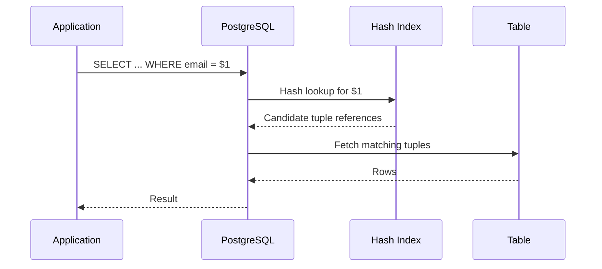

# 05- Hash Indexes

## Overview

A hash index organizes indexed values using a hash function rather than maintaining them in sorted order. Its primary purpose is efficient **equality lookup**:

```sql
WHERE column = value
```

Conceptually, the database computes a hash of the search value and uses that hash to locate the relevant index bucket:

```text
Search value
     ↓
Hash function
     ↓
Hash value
     ↓
Bucket
     ↓
Matching index entries
     ↓
Table rows
```

Hash indexes are fundamentally different from B-tree indexes. A B-tree preserves ordering, which enables equality, range, and ordered queries. A hash index intentionally gives up ordering to specialize in equality comparisons.

In PostgreSQL, hash indexes are durable, WAL-logged, crash-safe indexes and can be used for equality operators. They are therefore a legitimate production index type, but B-tree remains the default choice for most ordinary equality lookups because it supports equality plus additional access patterns.

## Why Hash Indexes Exist

A relational database needs an efficient way to find rows without scanning an entire table.

Consider:

```sql
SELECT id, email
FROM users
WHERE email = 'alice@example.com';
```

Without an index:

```text
Users table
     ↓
Scan row 1
Scan row 2
Scan row 3
...
Scan row N
     ↓
Matching rows
```

A hash index provides another access path:

```text
                    email = 'alice@example.com'
                                  ↓
                            Hash function
                                  ↓
                              Hash value
                                  ↓
                               Bucket
                                  ↓
                         Matching index entry
                                  ↓
                              Table row
```

The important trade-off is that the hash structure is optimized for equality rather than ordering.

## Hash Index vs B-Tree

The most important distinction is what the index can answer efficiently.

| Capability | Hash Index | B-tree Index |
|---|---:|---:|
| Equality (`=`) | Excellent | Excellent |
| Range (`<`, `>`, `BETWEEN`) | No | Excellent |
| `ORDER BY` | No | Excellent |
| Prefix-compatible ordering | No | Yes |
| Unique constraint | Not the general mechanism | Yes |
| Keyset pagination | No | Excellent |
| Equality-heavy lookup | Excellent | Excellent |
| General-purpose default | No | Yes |

For example:

```sql
WHERE user_id = $1
```

is compatible with both.

But:

```sql
WHERE created_at >= $1
```

requires an ordering-aware structure such as a B-tree.

Likewise:

```sql
ORDER BY created_at DESC
```

cannot benefit from the ordering of a hash index because hash indexes do not preserve key order.

## How Hash Indexes Work

A hash index applies a hash function to an indexed value.

Conceptually:

```text
                 "alice@example.com"
                           ↓
                      hash(value)
                           ↓
                       18374621
                           ↓
                   bucket = hash % N
                           ↓
                        Bucket 5
                           ↓
                    Index entry
```

Different values can produce the same hash value. This is a **hash collision**.

Therefore, a hash index cannot assume:

```text
same hash ⇒ same value
```

Instead, the database must ultimately verify that the indexed value satisfies the requested equality condition.

The hash function is primarily used to identify the relevant bucket efficiently.

## Buckets

A hash index divides its address space into buckets.

A simplified representation is:

```text
Hash index
│
├── Bucket 0
│   ├── entry
│   └── entry
│
├── Bucket 1
│   └── entry
│
├── Bucket 2
│   ├── entry
│   ├── entry
│   └── entry
│
└── Bucket N
    └── entry
```

The database computes a hash value and uses it to identify the bucket where candidate entries reside.

As the index grows, the database can expand its bucket structure rather than keeping a fixed number of buckets forever.

## Hash Collisions

A collision occurs when different values produce the same hash value.

For example:

```text
hash("alice@example.com") → 42
hash("bob@example.com")   → 42
```

A real hash function is designed to distribute values well, but collisions are unavoidable because the input space is much larger than the finite hash space.

The database therefore treats the hash as a routing mechanism rather than proof of equality.

Conceptually:

```text
Search:
"alice@example.com"
       ↓
hash → 42
       ↓
Bucket 42
       ↓
Candidate entries
       ↓
Verify equality
       ↓
Matching row
```

## Equality Is the Key Use Case

Hash indexes are intended for equality predicates such as:

```sql
SELECT *
FROM users
WHERE email = $1;
```

```sql
SELECT *
FROM sessions
WHERE token_hash = $1;
```

```sql
SELECT *
FROM devices
WHERE device_identifier = $1;
```

They are not intended for:

```sql
WHERE email > $1
```

or:

```sql
WHERE created_at BETWEEN $1 AND $2
```

or:

```sql
ORDER BY email;
```

The hash function destroys the original ordering of values.

## Hash Index Access Path

A simplified execution path looks like:



This resembles a normal index lookup at the application level, but the internal index navigation differs from a B-tree.

## Hash Indexes in PostgreSQL

PostgreSQL supports hash indexes using:

```sql
CREATE INDEX idx_users_email_hash
ON users USING HASH (email);
```

The `USING HASH` clause explicitly selects a hash index.

You can inspect the index definition with:

```sql
SELECT
    indexname,
    indexdef
FROM pg_indexes
WHERE tablename = 'users';
```

For query planning:

```sql
EXPLAIN (ANALYZE, BUFFERS)
SELECT id
FROM users
WHERE email = 'alice@example.com';
```

The optimizer decides whether the hash index is actually cheaper than another available access path.

## Hash Indexes Are Not Automatically Faster

A common misconception is:

> Equality query + hash index = fastest possible query.

That is not a safe assumption.

PostgreSQL can choose among:

- Sequential scan
- B-tree index scan
- Hash index scan
- Bitmap access paths
- Other available plans

based on estimated cost.

For example, if a predicate matches most rows:

```sql
WHERE status = 'active'
```

a sequential scan may still be cheaper.

Similarly, if a B-tree already provides an efficient equality lookup plus additional ordering capabilities, replacing it with a hash index may provide little or no practical benefit.

## Hash Indexes and B-Trees for Equality

For a query:

```sql
SELECT *
FROM users
WHERE id = $1;
```

both of these can support equality access:

```sql
CREATE INDEX idx_users_id_btree
ON users (id);
```

```sql
CREATE INDEX idx_users_id_hash
ON users USING HASH (id);
```

The B-tree generally provides more flexibility because the same index can also support ordered operations:

```sql
WHERE id > $1
```

and:

```sql
ORDER BY id;
```

Therefore, a hash index should usually be considered when the workload is specifically equality-oriented and there is a demonstrated reason to prefer it.

## Hash Indexes and Primary Keys

Do not use a hash index as a replacement for a normal primary-key index.

For:

```sql
CREATE TABLE users (
    id bigint PRIMARY KEY
);
```

PostgreSQL creates a unique B-tree index to support the primary-key constraint.

The B-tree is appropriate because primary keys require uniqueness enforcement and commonly participate in ordered and range operations.

A hash index is not a general replacement for the index supporting a primary key.

## Hash Indexes and Unique Constraints

A hash index should not be viewed as the normal mechanism for enforcing uniqueness.

For:

```sql
CREATE TABLE users (
    email text UNIQUE
);
```

PostgreSQL uses a unique B-tree index to enforce the constraint.

This provides both:

```text
Uniqueness
+
Efficient equality lookup
+
Ordered access
```

The distinction matters because an index's query-access capability and a database constraint's integrity semantics are separate design concerns.

## Hash Indexes and Range Queries

Hash indexes do not preserve the relationship between neighboring values.

For example:

```text
Input values:

10
20
30
40
50
```

A B-tree preserves:

```text
10 → 20 → 30 → 40 → 50
```

A hash index might distribute them conceptually as:

```text
Bucket 0 → 30
Bucket 1 → 10, 50
Bucket 2 → 40
Bucket 3 → 20
```

Therefore, the database cannot efficiently walk the hash index to answer:

```sql
WHERE value BETWEEN 20 AND 40;
```

A B-tree is the appropriate structure for this workload.

## Hash Indexes and `ORDER BY`

A hash index cannot provide ordered results.

This query:

```sql
SELECT id
FROM users
ORDER BY email;
```

cannot use the ordering of a hash index because there is no ordering to exploit.

The database would still need another mechanism to produce sorted output.

For workloads where both equality and ordering matter, a B-tree is generally more useful.

## Hash Index Growth

A hash index must accommodate an increasing number of indexed entries.

As the number of entries grows, the hash structure can expand its bucket address space.

Conceptually:

```text
Small index

Buckets
[0] [1] [2] [3]


Growth

Buckets
[0] [1] [2] [3] [4] [5] [6] [7]
```

This allows the database to maintain a useful distribution of entries as the index grows.

The details of bucket allocation, overflow handling, and page management are implementation-specific.

## Overflow Pages

Hash buckets can require additional pages when many entries map to the same bucket.

Conceptually:

```text
Bucket
  ↓
Primary page
  ↓
Overflow page
  ↓
Overflow page
```

A poorly distributed workload can therefore cause longer chains of pages to inspect.

A good hash function minimizes clustering by distributing values across buckets.

This is one reason hash indexes depend heavily on effective hashing rather than only on the abstract hash-table concept.

## Hash Indexes and MVCC

PostgreSQL uses MVCC, so index behavior must be understood alongside row-version visibility.

A hash index can identify candidate tuples, but the database still has to apply PostgreSQL's visibility rules when returning table rows.

Conceptually:

```text
Hash lookup
    ↓
Candidate tuple
    ↓
MVCC visibility checks
    ↓
Visible row?
    ├── Yes → return
    └── No  → ignore
```

This means that an index lookup is not equivalent to bypassing PostgreSQL's transactional visibility model.

## Hash Indexes and Updates

Indexes introduce write-maintenance overhead.

For:

```sql
UPDATE users
SET email = $1
WHERE id = $2;
```

if `email` is indexed, the database must maintain the index as the indexed value changes.

This contributes to:

- CPU usage
- WAL generation
- I/O
- Storage growth
- Vacuum and cleanup work

Therefore, even a highly efficient equality index has a cost on write-heavy tables.

## Hash Indexes and Write-Heavy Workloads

Consider a high-volume event table:

```text
100,000 inserts/sec
```

with multiple indexes.

Every additional index increases the amount of work associated with writes.

The design problem is therefore:

```text
Read performance
       ↕
Write performance
       ↕
Storage
       ↕
Maintenance
```

Hash indexes are not free simply because their lookup semantics are simple.

Use them when the workload justifies them rather than adding them alongside an existing B-tree without evidence.

## Practical Example

Suppose an application frequently performs exact device-token lookups:

```sql
SELECT device_id, user_id
FROM devices
WHERE token_hash = $1;
```

A hash index can be created as:

```sql
CREATE INDEX idx_devices_token_hash
ON devices USING HASH (token_hash);
```

The lookup is strictly equality-based:

```text
token_hash = exact value
```

However, before choosing this over a B-tree, benchmark the real workload:

```sql
EXPLAIN (ANALYZE, BUFFERS)
SELECT device_id, user_id
FROM devices
WHERE token_hash = $1;
```

Compare it with a B-tree implementation on equivalent data.

Do not infer production performance from theoretical complexity alone.

## Hash Indexes in Backend Applications

A typical FastAPI or Django request might follow:

```text
Client
  ↓
Nginx / Load Balancer
  ↓
Application
  ↓
Parameterized SQL
  ↓
PostgreSQL planner
  ↓
Hash index
  ↓
Matching rows
  ↓
Application serialization
  ↓
Client
```

For example, an application might use:

```python
cursor.execute(
    """
    SELECT device_id, user_id
    FROM devices
    WHERE token_hash = %s
    """,
    (token_hash,),
)
```

The parameterized query prevents SQL injection and allows PostgreSQL to treat the value as a query parameter rather than interpolated SQL text.

The index structure is an execution concern; application code should generally express the required predicate rather than attempt to force a particular index type.

## Hash Indexes and Parameterized Queries

Prefer:

```python
cursor.execute(
    """
    SELECT id
    FROM users
    WHERE email = %s
    """,
    (email,),
)
```

over:

```python
query = f"""
    SELECT id
    FROM users
    WHERE email = '{email}'
"""
```

Index selection does not change the requirement for safe SQL construction.

Indexes optimize access paths; they do not provide SQL injection protection.

## When to Consider a Hash Index

A hash index may be worth evaluating when:

| Condition | Assessment |
|---|---|
| Workload is equality-only | Strong fit |
| Range queries are required | Poor fit |
| Ordering is required | Poor fit |
| Existing B-tree is sufficient | Usually unnecessary |
| Equality lookups dominate | Potentially useful |
| Index is large | Benchmark carefully |
| Write rate is high | Evaluate maintenance overhead |
| Query latency is already acceptable | Avoid unnecessary complexity |
| Production benchmark demonstrates benefit | Strong justification |

The key phrase is **evaluate**, not automatically **use**.

## When a B-Tree Is Better

A B-tree is usually the better choice when a column participates in multiple query patterns.

For example:

```sql
WHERE user_id = $1
```

```sql
WHERE user_id > $1
```

```sql
ORDER BY user_id;
```

```sql
WHERE user_id BETWEEN $1 AND $2;
```

One B-tree can support these related access patterns.

A hash index would only address the equality case.

## Operational Considerations

### Inspect Indexes

Use:

```sql
SELECT
    schemaname,
    tablename,
    indexname,
    indexdef
FROM pg_indexes
WHERE schemaname NOT IN ('pg_catalog', 'information_schema');
```

### Inspect Query Plans

Use:

```sql
EXPLAIN (ANALYZE, BUFFERS)
SELECT id
FROM devices
WHERE token_hash = $1;
```

Look for:

```text
Hash Scan
Index Scan
Seq Scan
Bitmap Index Scan
```

and compare:

- Actual execution time
- Estimated rows
- Actual rows
- Buffer hits
- Buffer reads
- Planning time

### Monitor Index Usage

PostgreSQL exposes index statistics:

```sql
SELECT
    schemaname,
    relname AS table_name,
    indexrelname AS index_name,
    idx_scan,
    idx_tup_read,
    idx_tup_fetch
FROM pg_stat_user_indexes
ORDER BY idx_scan DESC;
```

Treat these statistics as workload evidence rather than automatic instructions to remove low-use indexes.

### Monitor Index Size

```sql
SELECT
    schemaname,
    relname AS table_name,
    indexrelname AS index_name,
    pg_size_pretty(pg_relation_size(indexrelid)) AS index_size
FROM pg_stat_user_indexes
ORDER BY pg_relation_size(indexrelid) DESC;
```

Large indexes consume:

- Disk
- Backup capacity
- Cache
- I/O bandwidth

and may increase maintenance costs.

## Production Considerations

### Benchmark Before Adopting

If a B-tree already satisfies the query, switching to a hash index should have a measurable reason.

Benchmark using:

- Production-like row counts
- Representative data distributions
- Real query shapes
- Realistic concurrency
- Warm and cold cache conditions where relevant
- Read/write workloads

A microbenchmark on a small development database is insufficient.

### Avoid Forcing Index Usage

Do not build application logic around assumptions such as:

```text
"This query must use the hash index."
```

PostgreSQL's optimizer should choose the access path based on its cost model.

Use `EXPLAIN` to understand decisions instead of attempting to force a specific plan prematurely.

### Account for Replication

Index creation and maintenance generate database work and WAL.

On systems with read replicas, large index changes can contribute to:

- Replica lag
- Increased I/O
- Longer recovery windows

Schema changes should therefore be included in deployment planning.

### Account for Backups and Recovery

Indexes increase database storage requirements and can affect:

- Backup size
- Restore duration
- Provisioned storage
- Disaster-recovery procedures

A rarely useful index is not merely a small performance optimization; it is an ongoing operational cost.

## Common Mistakes

### Replacing Every B-Tree Equality Index With a Hash Index

Both structures support equality, but B-trees support many additional operations.

Before replacing an existing B-tree, determine whether the same column is used for:

- Ranges
- Sorting
- Pagination
- Joins
- Composite indexes
- Other ordered access patterns

### Assuming Hash Means O(1) Query Performance

Hash tables are often described as having average O(1) lookup complexity.

Database performance is more complicated.

Actual execution can include:

```text
Hash calculation
+
Bucket access
+
Collision handling
+
Index page reads
+
Heap access
+
MVCC visibility
+
Result processing
```

Disk, memory, cache state, concurrency, and row distribution all matter.

### Ignoring Selectivity

An equality predicate can still match millions of rows.

For example:

```sql
WHERE country_code = 'IN'
```

may return a large fraction of a table.

An index does not automatically make such a query efficient.

### Using Hash Indexes for Ranges

This is fundamentally mismatched:

```sql
WHERE created_at >= $1
```

A hash index cannot efficiently navigate the ordered range.

Use a B-tree or another index structure appropriate to the workload.

### Using Hash Indexes for Sorting

This does not benefit from hash ordering:

```sql
ORDER BY email;
```

Hash indexes intentionally do not preserve value ordering.

### Adding Both B-Tree and Hash Indexes Without Evidence

For the same column:

```sql
CREATE INDEX idx_users_email_btree
ON users (email);

CREATE INDEX idx_users_email_hash
ON users USING HASH (email);
```

you now have two indexes to maintain.

This can increase:

- Insert cost
- Update cost
- Delete cost
- Storage usage
- Cache pressure
- Backup size
- Maintenance complexity

Only keep both if workload measurements justify the duplication.

### Assuming an Index Is Always Used

The optimizer may correctly choose:

```text
Seq Scan
```

even when a hash index exists.

Always inspect:

```sql
EXPLAIN (ANALYZE, BUFFERS)
```

against representative data.

## Interview Traps

**"What is the primary advantage of a hash index?"**

Efficient equality-based lookup without requiring the index to preserve sorted key order.

**"Can a hash index efficiently answer a range query?"**

No. Hashing destroys the ordering relationship between values.

**"Why is B-tree usually the default instead of hash?"**

A B-tree supports equality while also supporting range queries, ordering, and other ordered access patterns.

**"Does a hash index guarantee O(1) database query time?"**

No. Hash lookup is only one part of query execution. Page access, collisions, heap access, visibility checks, and result processing still contribute to the cost.

**"Can different values have the same hash?"**

Yes. Hash collisions are unavoidable, so the database must verify equality rather than treating a hash match as proof of value equality.

**"Should you create both a B-tree and hash index for an equality-heavy column?"**

Not by default. Both indexes increase storage and write-maintenance costs. Benchmark first and retain both only when there is a demonstrated workload benefit.

**"Can a hash index enforce a primary key?"**

A hash index is not the normal structure used to back PostgreSQL primary-key uniqueness. PostgreSQL uses a unique B-tree index for a primary key.

## Key Takeaways

- **Hash indexes specialize in equality lookups and use hashed values to locate candidate index entries efficiently.**
- **Hash indexes do not preserve key ordering, so they are unsuitable for efficient range scans, ordered access, and `ORDER BY` operations.**
- **B-trees usually remain the better general-purpose choice because they support equality plus ranges, sorting, pagination, and uniqueness.**
- **Hash collisions, heap access, MVCC visibility, caching, and I/O mean that theoretical hash-table complexity does not directly translate into database query latency.**
- **Use a hash index only when an equality-focused workload and production measurements provide a clear reason to prefer it over a B-tree.**