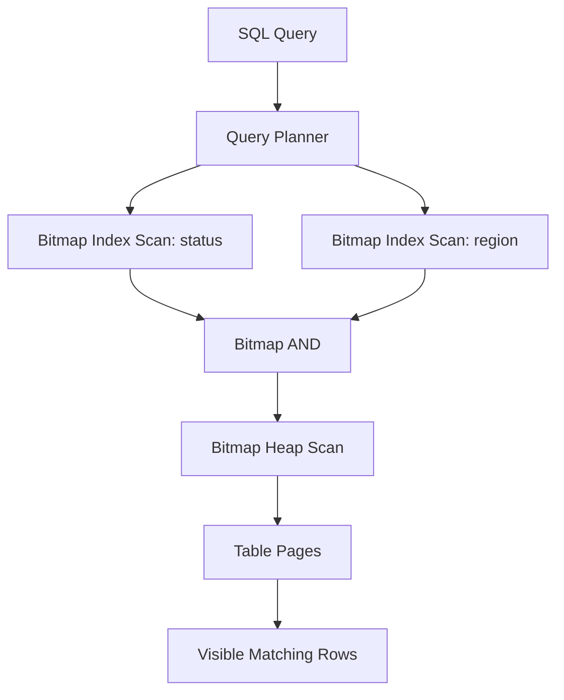
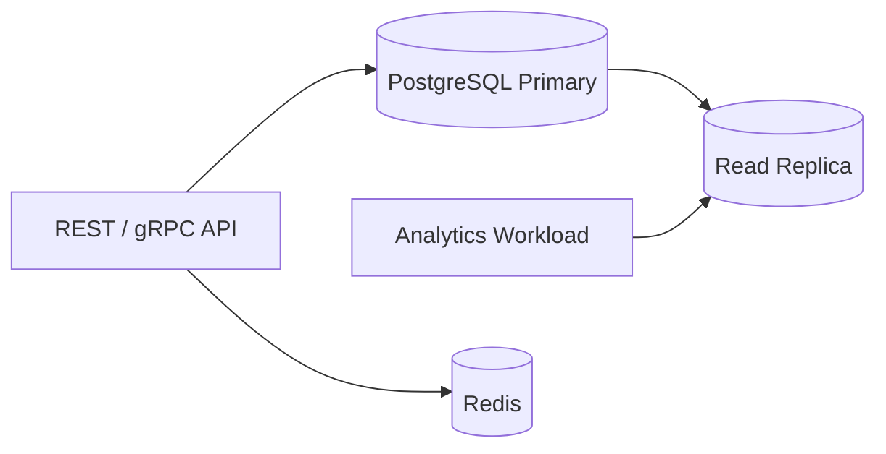

# 06- Bitmap Indexes

## Overview

A **bitmap index** represents the membership of rows in a set of bitmaps, allowing the database to combine filtering conditions using fast bitwise operations.

For a simplified table:

| Row | Status | Region |
|---:|---|---|
| 1 | active | IN |
| 2 | inactive | US |
| 3 | active | US |
| 4 | active | IN |

A bitmap representation could conceptually look like:

```text
status = active
1 0 1 1

region = IN
1 0 0 1
```

A query such as:

```sql
WHERE status = 'active'
  AND region = 'IN'
```

can conceptually perform:

```text
active bitmap:  1 0 1 1
IN bitmap:      1 0 0 1
                -------
AND result:     1 0 0 1
```

The database can then identify the rows represented by the resulting bitmap.

Bitmap indexing is particularly valuable for **analytical workloads**, especially when queries combine multiple predicates over large datasets and the indexed columns have relatively low or moderate cardinality.

However, "bitmap index" is not a universal SQL feature. Different database engines implement bitmap access differently. PostgreSQL, for example, does **not** provide a standalone persistent bitmap index type like some analytical databases. Instead, PostgreSQL can build **bitmap execution plans from ordinary indexes**, combining multiple indexes through bitmap operations.

## Why Bitmap Indexes Exist

Traditional indexes often answer a predicate by navigating one index structure:

```text
Query
  ↓
Index
  ↓
Matching row locations
  ↓
Table
```

Bitmap-based execution introduces another strategy:

```text
Query
  ↓
Index A → Bitmap A ─┐
                    ├→ Bitmap AND/OR → Row locations
Index B → Bitmap B ─┘
                                      ↓
                                    Table
```

This becomes useful when a query contains several selective predicates:

```sql
SELECT *
FROM orders
WHERE status = 'completed'
  AND region = 'IN'
  AND channel = 'mobile';
```

Instead of requiring one composite index containing every predicate, the database may retrieve candidate row locations from several indexes and combine them.

## Bitmap Representation

A bitmap is fundamentally a sequence of bits:

```text
Row:       1 2 3 4 5 6 7 8
Bitmap:    1 0 1 1 0 0 1 0
```

A `1` indicates that the corresponding row is a candidate for the predicate.

For example:

```text
status = 'active'

Rows:       1 2 3 4 5 6 7 8
Bitmap:     1 0 1 1 0 0 1 0
```

Another predicate:

```text
region = 'IN'

Rows:       1 2 3 4 5 6 7 8
Bitmap:     1 0 0 1 0 1 1 0
```

An `AND` operation gives:

```text
1 0 1 1 0 0 1 0
1 0 0 1 0 1 1 0
-----------------
1 0 0 1 0 0 1 0
```

The database can then visit the corresponding table rows.

## Bitmap AND and OR

The major advantage of bitmap representations is that Boolean operations are extremely efficient.

### AND

For:

```sql
WHERE status = 'active'
  AND region = 'IN'
```

the database can conceptually perform:

```text
Bitmap(status = active)
             AND
Bitmap(region = IN)
             ↓
        Candidate rows
```

### OR

For:

```sql
WHERE status = 'active'
   OR status = 'pending'
```

the database can conceptually perform:

```text
Bitmap(active)
        OR
Bitmap(pending)
        ↓
Candidate rows
```

This is particularly useful for complex analytical filtering.

## Bitmap Execution in PostgreSQL

PostgreSQL does not provide a `CREATE BITMAP INDEX` statement.

Instead, it can construct a bitmap from ordinary indexes and then perform a **Bitmap Heap Scan**.

For example:

```sql
CREATE INDEX idx_orders_status
ON orders (status);

CREATE INDEX idx_orders_region
ON orders (region);
```

A query such as:

```sql
SELECT *
FROM orders
WHERE status = 'completed'
  AND region = 'IN';
```

may produce a plan conceptually similar to:

```text
Bitmap Heap Scan
  └── BitmapAnd
      ├── Bitmap Index Scan on idx_orders_status
      └── Bitmap Index Scan on idx_orders_region
```

The exact plan depends on table size, statistics, selectivity, cost settings, cache state, and other factors.

Inspect it with:

```sql
EXPLAIN (ANALYZE, BUFFERS)
SELECT *
FROM orders
WHERE status = 'completed'
  AND region = 'IN';
```

## PostgreSQL Bitmap Scan Architecture

A simplified PostgreSQL execution flow is:



The important distinction is that PostgreSQL's bitmap scan is an **execution strategy**, not a separate persistent bitmap index structure.

## Bitmap Index Scan vs Bitmap Heap Scan

These two operations are easy to confuse.

### Bitmap Index Scan

A Bitmap Index Scan reads an ordinary index and produces a bitmap of candidate tuple locations.

Conceptually:

```text
B-tree index
    ↓
Matching index entries
    ↓
Bitmap
```

### Bitmap Heap Scan

A Bitmap Heap Scan uses the generated bitmap to visit the relevant table pages.

Conceptually:

```text
Bitmap
  ↓
Relevant heap pages
  ↓
Rows on those pages
  ↓
Visibility / predicate checks
  ↓
Result
```

The combination allows PostgreSQL to efficiently process multiple indexed predicates.

## Why Not Always Use an Index Scan?

Suppose a query finds many rows.

An ordinary index scan might repeatedly jump between index pages and table pages:

```text
Index
 ↓
Heap page 100
 ↓
Heap page 7
 ↓
Heap page 500
 ↓
Heap page 21
 ↓
...
```

This can result in scattered heap access.

A bitmap strategy can first collect matching tuple locations, then visit relevant heap pages in a more organized manner:

```text
Index lookups
      ↓
Build bitmap
      ↓
Group tuple locations by heap page
      ↓
Visit relevant pages
```

This can reduce random heap access for moderately large result sets.

## Lossy and Exact Bitmap Pages

A senior-level PostgreSQL detail is that bitmap representations can be **exact** or **lossy**.

An exact bitmap can identify individual tuple locations.

A lossy bitmap may only identify that a particular heap page contains candidate tuples.

Conceptually:

```text
Exact:

Page 42
  ├── Row 3
  ├── Row 7
  └── Row 15


Lossy:

Page 42
  └── Some candidate rows
```

With a lossy bitmap, PostgreSQL must recheck the predicate against tuples from the affected page.

This can appear in an execution plan as:

```text
Recheck Cond
```

For example:

```text
Bitmap Heap Scan on orders
  Recheck Cond: (...)
```

Lossy behavior can occur when the bitmap exceeds available memory constraints.

## `work_mem` and Bitmap Scans

PostgreSQL uses `work_mem` for various operations, including memory-intensive query operations.

If a bitmap becomes too large to maintain at full precision, PostgreSQL may use lossy representation.

This can increase CPU work because more rows may need predicate rechecking.

For example:

```text
Small bitmap
    ↓
Exact tuple locations
    ↓
Less rechecking


Large bitmap
    ↓
Lossy pages
    ↓
More candidate tuples
    ↓
More rechecking
```

Increasing `work_mem` can sometimes improve a bitmap-heavy query, but raising it globally without understanding concurrency can cause excessive memory consumption.

A safer approach is to evaluate the specific workload and memory requirements.

## Bitmap Indexes and Cardinality

Bitmap structures are particularly attractive when columns have relatively few distinct values.

Examples include:

```text
status:
active
inactive
pending
cancelled
```

or:

```text
gender:
male
female
unknown
```

or:

```text
region:
IN
US
GB
DE
...
```

A column with millions of distinct values has a different workload profile.

For example:

```text
request_id
UUID
email
```

usually has high cardinality and is commonly better served by conventional B-tree indexes for transactional equality lookups.

The appropriate threshold is workload- and implementation-dependent; there is no universal cardinality cutoff.

## Cardinality and Selectivity Are Different

Do not confuse **cardinality** with **selectivity**.

Cardinality refers to the number of distinct values:

```text
status → 5 distinct values
```

Selectivity describes how much a predicate reduces the candidate set.

For example:

```sql
WHERE status = 'active'
```

could match:

```text
70% of rows
```

while:

```sql
WHERE status = 'cancelled'
```

could match:

```text
0.5% of rows
```

The same column can therefore produce very different query behavior depending on the selected value.

## Bitmap Indexes in OLAP Workloads

Bitmap indexing is especially associated with **OLAP** workloads.

Typical analytical queries look like:

```sql
SELECT
    region,
    COUNT(*)
FROM sales
WHERE
    product_category = 'electronics'
    AND channel = 'online'
    AND order_status = 'completed'
GROUP BY region;
```

The query may combine several relatively low-cardinality dimensions.

Conceptually:

```text
Product bitmap ──┐
Channel bitmap ──┼── AND ──> Candidate rows
Status bitmap ───┘
                         ↓
                    Aggregation
```

This pattern is fundamentally different from a typical OLTP lookup:

```sql
SELECT *
FROM users
WHERE id = $1;
```

The OLTP lookup generally benefits from a conventional B-tree index.

## Bitmap Indexes vs B-Tree Indexes

| Property | Bitmap Index / Bitmap Access | B-tree |
|---|---|---|
| Equality filtering | Excellent | Excellent |
| Combining multiple predicates | Excellent | Good |
| Range queries | Generally not the primary strength | Excellent |
| Ordered scans | No | Excellent |
| Low-cardinality analytical columns | Strong fit | Often adequate |
| High-cardinality point lookup | Usually not ideal | Strong fit |
| OLTP write-heavy workload | Often problematic depending on implementation | Strong fit |
| OLAP filtering | Strong fit | Good |
| Boolean bitmap operations | Native strength | Not native |
| PostgreSQL standalone index type | No | Yes |
| PostgreSQL bitmap execution | Yes | Source indexes can feed it |

The distinction between **bitmap index** and **bitmap scan** is critical when discussing PostgreSQL.

## Composite B-Tree vs Bitmap Combination

Suppose a table has:

```sql
CREATE INDEX idx_orders_status
ON orders (status);

CREATE INDEX idx_orders_region
ON orders (region);
```

PostgreSQL may combine them:

```text
status index ──> Bitmap A ──┐
                            ├── BitmapAnd
region index ──> Bitmap B ──┘
```

An alternative is a composite index:

```sql
CREATE INDEX idx_orders_status_region
ON orders (status, region);
```

Neither approach is universally superior.

A composite index can be highly effective for a known query pattern:

```sql
WHERE status = $1
  AND region = $2
```

But bitmap combination can provide flexibility when multiple independent predicates occur in different combinations.

The right choice depends on workload shape, query frequency, selectivity, write cost, and index size.

## Practical PostgreSQL Example

Consider:

```sql
CREATE TABLE orders (
    id bigint PRIMARY KEY,
    customer_id bigint NOT NULL,
    status text NOT NULL,
    region text NOT NULL,
    channel text NOT NULL,
    total_amount numeric(12, 2) NOT NULL,
    created_at timestamptz NOT NULL
);
```

Create independent indexes:

```sql
CREATE INDEX idx_orders_status
ON orders (status);

CREATE INDEX idx_orders_region
ON orders (region);

CREATE INDEX idx_orders_channel
ON orders (channel);
```

Now execute:

```sql
EXPLAIN (ANALYZE, BUFFERS)
SELECT COUNT(*)
FROM orders
WHERE status = 'completed'
  AND region = 'IN'
  AND channel = 'mobile';
```

Depending on the data distribution, PostgreSQL may choose a plan resembling:

```text
Aggregate
  ↓
Bitmap Heap Scan
  ↓
BitmapAnd
  ├── Bitmap Index Scan: status
  ├── Bitmap Index Scan: region
  └── Bitmap Index Scan: channel
```

But it may instead choose a composite index, a regular index scan, or a sequential scan.

The plan is determined by the optimizer rather than by the mere existence of multiple indexes.

## Why Bitmap Scans Can Be Faster

Bitmap scans can be advantageous when:

- Several predicates are indexed independently.
- Each predicate eliminates a meaningful portion of the table.
- The combined result is too large for an efficient point-by-point index scan.
- Heap access would otherwise be relatively random.
- The query is reading enough rows to justify bitmap construction.

The process has an explicit setup cost:

```text
Index scans
     ↓
Bitmap construction
     ↓
Bitmap combination
     ↓
Heap page access
```

For a query returning only one row, that setup may be unnecessary overhead.

## When Bitmap Access Is a Poor Fit

Bitmap-oriented execution may be less useful when:

- The query returns very few rows.
- A highly selective B-tree lookup already provides a cheap path.
- The workload requires ordered output.
- The workload is dominated by frequent small OLTP writes.
- The indexed predicates have poor selectivity.
- The query can be served efficiently by a covering or composite index.

Always validate the actual execution plan.

## Write Workloads and Bitmap Indexes

Persistent bitmap indexes in some database systems can have significant write-maintenance implications.

A frequently changing low-cardinality value can modify bitmap structures repeatedly.

This creates a fundamental trade-off:

```text
Fast analytical filtering
        ↕
Write amplification
        ↕
Concurrency
        ↕
Maintenance complexity
```

This is one reason bitmap indexing is commonly associated with read-heavy analytical systems rather than high-throughput transactional systems.

PostgreSQL's bitmap execution is different: it constructs the bitmap during query execution from ordinary indexes, so the persistent index itself is not a bitmap structure.

## PostgreSQL vs Dedicated Bitmap Index Implementations

The term "bitmap index" can refer to different mechanisms.

| Database / System | Typical Bitmap Capability |
|---|---|
| PostgreSQL | Bitmap execution using ordinary indexes |
| Oracle | Persistent bitmap indexes |
| Some analytical databases | Bitmap indexes / bitmap-oriented structures |
| MySQL/InnoDB | No traditional bitmap index type |

This distinction matters in interviews and architecture discussions.

If the requirement is specifically:

> "Create a bitmap index in PostgreSQL."

the technically accurate answer is that PostgreSQL does not provide a traditional standalone bitmap index type. PostgreSQL can, however, combine ordinary indexes through bitmap execution.

## Backend Application Considerations

For a Django or FastAPI application backed by PostgreSQL, application code normally does not need to know whether PostgreSQL chooses:

```text
Index Scan
Bitmap Index Scan
Bitmap Heap Scan
Seq Scan
```

The application expresses the query:

```python
orders = Order.objects.filter(
    status="completed",
    region="IN",
    channel="mobile",
)
```

PostgreSQL determines the execution strategy.

The engineering responsibility is to:

1. Create indexes that support important access patterns.
2. Maintain accurate statistics.
3. Inspect execution plans.
4. Benchmark representative workloads.
5. Remove redundant indexes when appropriate.

## Statistics Matter

PostgreSQL's optimizer relies on statistics to estimate:

- Number of rows
- Value distributions
- Selectivity
- Correlations
- Cost of different access paths

After major data distribution changes, stale statistics can contribute to poor plan choices.

Typical maintenance includes:

```sql
ANALYZE orders;
```

Autovacuum normally handles statistics maintenance as part of routine database operations, but large bulk changes and unusual workloads may require explicit attention.

## Monitoring Bitmap Query Performance

Use:

```sql
EXPLAIN (ANALYZE, BUFFERS)
SELECT COUNT(*)
FROM orders
WHERE status = 'completed'
  AND region = 'IN';
```

Pay attention to:

| Metric | Why It Matters |
|---|---|
| Planning Time | Planner overhead |
| Execution Time | End-to-end database execution |
| Rows Removed by Filter | Possible poor selectivity |
| Heap Blocks Read | Physical I/O |
| Heap Blocks Hit | Cache effectiveness |
| Recheck Cond | Relevant to lossy bitmap processing |
| Actual vs estimated rows | Statistics quality |
| Scan type | Whether bitmap execution was selected |

A useful production workflow is:

```text
Slow query
   ↓
EXPLAIN (ANALYZE, BUFFERS)
   ↓
Identify scan strategy
   ↓
Check selectivity and estimates
   ↓
Check indexes
   ↓
Check statistics
   ↓
Benchmark alternative
   ↓
Deploy measured improvement
```

## `EXPLAIN` Example

A representative plan might contain:

```text
Bitmap Heap Scan on orders
  Recheck Cond: ((status = 'completed') AND (region = 'IN'))
  Heap Blocks: exact=1250
  -> BitmapAnd
       -> Bitmap Index Scan on idx_orders_status
       -> Bitmap Index Scan on idx_orders_region
```

The important interpretation is:

```text
Bitmap Index Scan
    ↓
Find candidate tuple locations

BitmapAnd
    ↓
Combine predicates

Bitmap Heap Scan
    ↓
Fetch relevant table pages

Recheck
    ↓
Verify candidates when necessary
```

Do not judge a query solely by the scan name. Examine actual execution time and buffer behavior.

## Production Considerations

### Use Bitmap Strategies for the Right Workload

Bitmap execution is particularly valuable for read-heavy analytical queries with multiple indexed predicates.

For high-throughput transactional systems, prioritize predictable point lookups and carefully designed B-tree indexes.

### Avoid Index Explosion

Creating an index for every filterable column can produce:

- More storage
- More write overhead
- More vacuum work
- More cache pressure
- More complex query planning

For example, adding ten indexes because an API has ten optional filters is rarely a good design by itself.

Measure actual query patterns first.

### Consider Composite Indexes

If a query is extremely common:

```sql
WHERE tenant_id = $1
  AND status = $2
  AND created_at >= $3
```

a carefully designed composite B-tree may outperform a collection of independent indexes.

Index design should follow the workload rather than the number of columns in the table.

### Consider Multitenancy

For SaaS systems, tenant filtering is often highly important:

```sql
WHERE tenant_id = $1
  AND status = $2;
```

A useful composite index may be:

```sql
CREATE INDEX idx_orders_tenant_status
ON orders (tenant_id, status);
```

This can be more appropriate than relying solely on independent bitmap-combinable indexes.

### Consider Read Replicas

Analytical queries can consume significant CPU, memory, and I/O.

For sufficiently large systems, separating analytical workloads onto replicas or dedicated analytical infrastructure can protect transactional workloads.

A common architecture is:



For larger analytical requirements, a dedicated warehouse or OLAP system may be more appropriate than forcing an OLTP database to perform large analytical scans.

## Security Considerations

Indexes and bitmap execution do not change application security requirements.

Continue to use:

- Parameterized SQL
- ORM query parameters
- Least-privilege database roles
- Tenant-aware authorization
- Appropriate row-level security where required

For example:

```python
orders = Order.objects.filter(
    tenant_id=request.tenant_id,
    status=requested_status,
)
```

An efficient index does not prevent a tenant-isolation bug.

Performance optimization must never remove authorization predicates simply because they make a query faster.

## Scalability Considerations

At scale, consider:

- Table size
- Index size
- Query concurrency
- Cache hit rate
- Data distribution
- Write volume
- Replication topology
- Partitioning
- Analytical workload isolation

Partitioning can sometimes reduce the amount of data considered by a query before indexes are even evaluated.

For example, a large event table might be partitioned by time:

```text
events
├── events_2026_08
├── events_2026_09
└── events_2026_10
```

A query restricted to one month can then benefit from partition pruning before index processing.

Bitmap execution and partition pruning solve different problems and can complement each other.

## Common Mistakes

### Confusing Bitmap Indexes With Bitmap Heap Scans

In PostgreSQL:

```text
Bitmap Index Scan
```

does not mean PostgreSQL has a persistent bitmap index.

It means an existing index is being used to produce a bitmap.

### Assuming PostgreSQL Supports `USING BITMAP`

This is not valid PostgreSQL syntax:

```sql
CREATE INDEX idx_orders_status
ON orders USING BITMAP (status);
```

PostgreSQL supports bitmap **execution**, not a traditional standalone bitmap index type.

### Assuming Bitmap Is Always Faster

Bitmap construction has overhead.

For:

```sql
WHERE id = $1
```

a highly selective B-tree lookup is usually a much more direct access path.

### Ignoring Cardinality

Low-cardinality columns can be useful in bitmap-oriented analytical workloads, but low cardinality does not automatically mean "create a bitmap index."

The workload, database engine, and query plan determine whether bitmap access is beneficial.

### Ignoring Data Distribution

A predicate such as:

```sql
WHERE status = 'active'
```

may match:

```text
95% of rows
```

If so, an index-based strategy may not provide much benefit.

### Increasing `work_mem` Globally to Fix One Query

A larger `work_mem` can reduce lossy bitmap behavior in some cases, but it is allocated per operation and potentially per concurrent query.

A global increase can therefore create substantial memory pressure.

Tune based on measured workload rather than treating `work_mem` as a universal bitmap setting.

### Creating Every Possible Single-Column Index

Multiple independent indexes can sometimes be combined, but that does not make unlimited indexing a good strategy.

Every index has ongoing costs:

```text
INSERT
  ↓
Maintain indexes
  ↓
More WAL / I/O
  ↓
More storage
  ↓
More maintenance
```

Design indexes around real access patterns.

## Production Pitfalls

| Pitfall | Why It Happens | Better Approach |
|---|---|---|
| Bitmap scan expected but not chosen | Cost model prefers another plan | Inspect `EXPLAIN` |
| Bitmap scan is slow | Too many candidate rows | Improve selectivity or index design |
| Many lossy pages | Bitmap memory pressure | Investigate `work_mem` and query shape |
| Poor row estimates | Stale or insufficient statistics | Run `ANALYZE`, review statistics |
| Too many indexes | Indexes added per API filter | Index measured query patterns |
| Analytical query harms OLTP | Shared database resources | Isolate workloads where necessary |
| Composite index ignored | Column order doesn't match workload | Revisit index column order |
| Read performance improves but writes degrade | Excessive indexes | Measure write amplification |

## Interview Traps

**"Does PostgreSQL have bitmap indexes?"**

Not in the traditional sense of a persistent bitmap index type. PostgreSQL supports bitmap execution plans that can construct bitmaps from ordinary indexes.

**"What is a Bitmap Index Scan?"**

It is an execution operation that scans an existing index and produces a bitmap representing candidate tuple locations.

**"What is a Bitmap Heap Scan?"**

It consumes the bitmap and accesses the corresponding heap pages to retrieve candidate rows.

**"Why combine multiple indexes into a bitmap?"**

To efficiently implement multiple predicates by combining candidate row locations using operations such as bitmap `AND` and `OR`.

**"Are bitmap indexes good for OLTP?"**

Persistent bitmap indexes can be problematic for frequently updated transactional data because index maintenance can be expensive. Bitmap execution in PostgreSQL is different because the bitmap is constructed during query execution from ordinary indexes.

**"Why can PostgreSQL show `Recheck Cond` during a bitmap heap scan?"**

Bitmap representations can become lossy, representing candidate heap pages rather than exact tuple locations. PostgreSQL then rechecks the predicate against candidate rows.

**"Is a low-cardinality column automatically a good bitmap-index candidate?"**

No. Cardinality is only one factor. Query selectivity, workload type, update frequency, database implementation, and actual execution plans also matter.

## Key Takeaways

- **Bitmap techniques represent candidate rows compactly and make Boolean combinations such as `AND` and `OR` efficient.**
- **PostgreSQL does not provide a traditional standalone bitmap index type; it can build bitmap execution plans from ordinary indexes.**
- **Bitmap execution is particularly useful for queries combining multiple predicates over moderately large result sets, especially in analytical workloads.**
- **Bitmap scans can become lossy, causing predicate rechecks, and memory settings such as `work_mem` can influence this behavior.**
- **Choose between bitmap execution, composite indexes, and conventional index scans based on actual workload characteristics and `EXPLAIN (ANALYZE, BUFFERS)` evidence.**