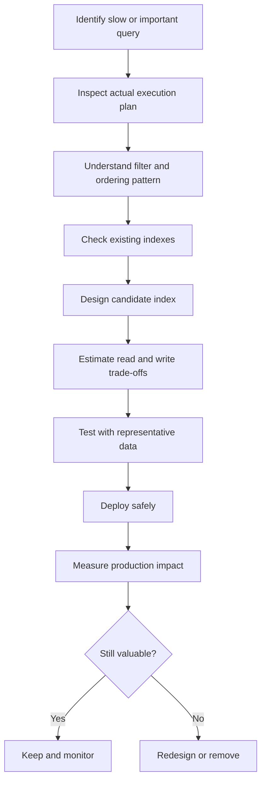

# 08- Non-Clustered Indexes

## Overview

A **non-clustered index**, also called a **secondary index** in many database systems, is an index structure stored separately from the table's primary row storage.

It provides an additional access path into a table without changing the table's underlying physical organization.

Conceptually:

```text
                         Query
                           │
                           ▼
                  Non-Clustered Index
                           │
                  key + row locator
                           │
                           ▼
                     Table Storage
                           │
                           ▼
                         Row
```

Without an appropriate index, the database may need to inspect a large portion of the table:

```text
Query
  │
  ▼
Sequential scan
  │
  ├── Row 1
  ├── Row 2
  ├── Row 3
  ├── ...
  └── Row N
```

With a selective non-clustered index:

```text
Query
  │
  ▼
Index lookup
  │
  ▼
Matching row locations
  │
  ▼
Fetch required rows
```

Non-clustered indexes are fundamental to production SQL performance because a table usually needs multiple efficient access paths for different query patterns.

## Why Non-Clustered Indexes Exist

A table can only have one underlying physical organization, but an application typically queries the same data in many different ways.

Consider:

```sql
CREATE TABLE orders (
    id bigint PRIMARY KEY,
    customer_id bigint NOT NULL,
    status varchar(32) NOT NULL,
    created_at timestamp NOT NULL,
    total_amount numeric(12, 2) NOT NULL
);
```

The application may issue all of these queries:

```sql
SELECT *
FROM orders
WHERE id = $1;
```

```sql
SELECT *
FROM orders
WHERE customer_id = $1;
```

```sql
SELECT *
FROM orders
WHERE status = 'pending';
```

```sql
SELECT *
FROM orders
WHERE created_at >= $1
ORDER BY created_at;
```

One physical table ordering cannot efficiently represent every access pattern.

Secondary indexes solve this by providing independent structures:

```text
                         orders table
                              │
          ┌───────────────────┼───────────────────┐
          │                   │                   │
          ▼                   ▼                   ▼
   Index on id       Index on customer_id   Index on created_at
```

Each index is optimized for a different lookup pattern.

## How a Non-Clustered Index Works

A simplified B-tree secondary index looks like:

```text
                    Root
                   /    \
                  /      \
             Branch      Branch
             /   \        /   \
           Leaf Leaf    Leaf  Leaf
             │    │       │    │
             ▼    ▼       ▼    ▼
          key+row-locator entries
```

For example:

```text
customer_id | row locator
------------+------------
1001        | row A
1001        | row D
1002        | row B
1003        | row C
```

For:

```sql
SELECT *
FROM orders
WHERE customer_id = 1001;
```

the database can:

1. Traverse the index.
2. Locate entries for `customer_id = 1001`.
3. Obtain row locations.
4. Fetch the corresponding table rows.
5. Return the results.

The exact row locator differs by database engine.

## Index Lookup vs Table Lookup

A secondary index often contains only enough information to identify matching rows.

For:

```sql
SELECT *
FROM orders
WHERE customer_id = 1001;
```

the execution can conceptually be:

```text
Secondary index
      │
      ▼
customer_id = 1001
      │
      ▼
Row locations
      │
      ▼
Table
      │
      ▼
Complete rows
```

The second step can become expensive when a query matches many rows.

This is one of the most important production considerations for non-clustered indexes.

## Selectivity

**Selectivity** describes how effectively an index condition narrows the candidate rows.

Consider a million-row table.

An index on:

```text
order_id
```

is usually highly selective because a specific ID may match one row.

An index on:

```text
status
```

might be poorly selective if the table contains:

```text
pending → 300,000 rows
completed → 600,000 rows
failed → 100,000 rows
```

A query such as:

```sql
WHERE status = 'completed'
```

may match 60% of the table.

Using the index can require a large number of table-row lookups, potentially making a sequential scan cheaper.

Therefore:

> Having an index does not mean the optimizer should use it.

The optimizer chooses an access path based on estimated cost.

## Cardinality and Selectivity

These concepts are related but not identical.

| Concept | Meaning |
|---|---|
| Cardinality | Number of distinct values |
| Selectivity | How narrowly a predicate filters rows |
| High cardinality | Many distinct values |
| Low cardinality | Few distinct values |

For example:

```text
user_id → millions of distinct values
status  → a few distinct values
```

A `user_id` equality predicate is often highly selective.

A `status` equality predicate may not be.

However, **low cardinality does not automatically make an index useless**. A low-cardinality column can still be valuable when combined with another column or when a particular value is rare.

## Composite Non-Clustered Indexes

A composite index contains multiple columns.

```sql
CREATE INDEX idx_orders_customer_created
ON orders (customer_id, created_at);
```

Conceptually:

```text
(customer_id, created_at)
        ↓
1001, 2026-08-01
1001, 2026-08-03
1001, 2026-08-05
1002, 2026-08-01
1002, 2026-08-04
```

This can efficiently support:

```sql
SELECT *
FROM orders
WHERE customer_id = $1
  AND created_at >= $2
ORDER BY created_at;
```

Column order is important.

An index on:

```text
(customer_id, created_at)
```

is not equivalent to:

```text
(created_at, customer_id)
```

The database organizes the index according to the leading column first.

## Leftmost Prefix Principle

For a B-tree index:

```sql
CREATE INDEX idx_orders_customer_created
ON orders (customer_id, created_at);
```

the leading column is:

```text
customer_id
```

Queries filtering by `customer_id` can generally use the index effectively.

Queries filtering by both columns can also use it:

```sql
WHERE customer_id = $1
  AND created_at >= $2
```

But a query only filtering on:

```sql
WHERE created_at >= $1
```

does not get the same benefit from this index as it would from an index beginning with `created_at`.

The exact optimizer behavior varies by database, but the design principle remains:

> Put columns in an order that matches important query access patterns.

## Equality Before Range

A common composite-index pattern is:

```text
equality columns → range columns → ordering columns
```

For example:

```sql
CREATE INDEX idx_orders_tenant_created_id
ON orders (tenant_id, created_at, id);
```

supports:

```sql
WHERE tenant_id = $1
  AND created_at >= $2
  AND created_at < $3
ORDER BY created_at, id
```

The exact ideal ordering depends on the workload, but this pattern is frequently useful for multitenant applications and time-based queries.

Do not apply this rule mechanically. Query frequency, selectivity, ordering, and database-specific optimizer behavior all matter.

## Covering Indexes

A **covering index** contains all columns needed by a query, allowing the database to answer the query from the index without fetching the base table row.

Consider:

```sql
SELECT customer_id, created_at, total_amount
FROM orders
WHERE customer_id = $1
ORDER BY created_at DESC
LIMIT 50;
```

A suitable index might be:

```sql
CREATE INDEX idx_orders_customer_created
ON orders (customer_id, created_at DESC)
INCLUDE (total_amount);
```

Conceptually:

```text
Index
├── customer_id
├── created_at
└── total_amount
```

The database may be able to return the required data directly from the index.

In PostgreSQL, `INCLUDE` columns are stored as non-key payload columns. They can support index-only scans but do not participate in index ordering.

## Index-Only Scans

In PostgreSQL, a covering index can allow an **index-only scan** when the visibility information permits it.

Conceptually:

```text
Query
  │
  ▼
Index
  │
  ├── filter columns
  ├── ordering columns
  └── output columns
  │
  ▼
Return data
```

Instead of:

```text
Index
  ↓
Heap
  ↓
Row
```

the database may avoid many heap accesses.

Example:

```sql
CREATE INDEX idx_orders_customer_created
ON orders (customer_id, created_at DESC)
INCLUDE (status, total_amount);
```

Then inspect:

```sql
EXPLAIN (ANALYZE, BUFFERS)
SELECT customer_id, created_at, status, total_amount
FROM orders
WHERE customer_id = 42
ORDER BY created_at DESC
LIMIT 50;
```

Look for an `Index Only Scan` when appropriate.

An index-only scan is an optimization, not a guarantee. PostgreSQL's visibility map and table modification patterns affect whether heap access is still required.

## Partial Indexes

A partial index indexes only rows satisfying a predicate.

For example:

```sql
CREATE INDEX idx_orders_pending
ON orders (created_at)
WHERE status = 'pending';
```

This can be highly effective when only a small subset of rows is frequently queried.

Example:

```sql
SELECT *
FROM orders
WHERE status = 'pending'
ORDER BY created_at
LIMIT 100;
```

Instead of indexing every order:

```text
1,000,000 rows
```

the index may contain only:

```text
50,000 pending rows
```

Advantages include:

- Smaller index
- Lower storage cost
- Lower write overhead for excluded rows
- Potentially better cache efficiency
- More targeted query performance

Limitations:

- The query predicate must be compatible with the index predicate.
- It is workload-specific.
- Changes in data distribution can reduce its usefulness.

## Expression Indexes

A secondary index can sometimes be created on an expression rather than a raw column.

For example:

```sql
CREATE INDEX idx_users_lower_email
ON users (lower(email));
```

This can support:

```sql
SELECT *
FROM users
WHERE lower(email) = lower($1);
```

Without an expression index, applying a function to the column can prevent a normal index on `email` from being used efficiently.

This is particularly useful for:

- Case-insensitive lookups
- Normalized values
- Computed search keys
- Domain-specific expressions

The expression must match the query pattern appropriately.

## Unique Non-Clustered Indexes

A secondary index can also enforce uniqueness.

For example:

```sql
CREATE UNIQUE INDEX idx_users_email
ON users (email);
```

This provides both:

```text
Lookup optimization
+
Uniqueness enforcement
```

In production systems, uniqueness is usually a data-integrity requirement rather than merely a performance optimization.

For example:

```text
email
  ↓
unique
  ↓
one account per email
```

Application-level checks alone are not sufficient because concurrent requests can race.

## Indexes and Concurrent Requests

Consider two requests:

```text
Request A → check email → not found
Request B → check email → not found
Request A → insert
Request B → insert
```

Without a database-level uniqueness constraint, both may succeed.

A unique index allows the database to enforce the invariant atomically.

In PostgreSQL:

```sql
CREATE UNIQUE INDEX idx_users_email
ON users (lower(email));
```

The application should still handle the resulting uniqueness violation appropriately.

## Non-Clustered Indexes in PostgreSQL

PostgreSQL's ordinary B-tree indexes are separate from the heap table.

Conceptually:

```text
                  PostgreSQL
                      │
          ┌───────────┴───────────┐
          │                       │
       B-tree                    Heap
       index                      │
          │                       │
          └──── tuple locator ────┘
```

The index stores index entries and references table tuples.

PostgreSQL can also use:

- B-tree indexes
- Hash indexes
- GiST indexes
- SP-GiST indexes
- GIN indexes
- BRIN indexes

Not all of these behave identically, and "non-clustered" is primarily a storage-organization distinction rather than a statement that every secondary index must be a B-tree.

## Non-Clustered Indexes in SQL Server

SQL Server explicitly distinguishes:

- Clustered indexes
- Nonclustered indexes

A nonclustered index contains index keys and a row locator.

When the table has a clustered index, the row locator in a nonclustered index identifies the row through the clustered key.

Conceptually:

```text
Nonclustered index
        │
        ▼
Clustered key
        │
        ▼
Clustered index
        │
        ▼
Table row
```

This creates an important design consideration: changing the clustered key can affect the storage requirements and lookup behavior of nonclustered indexes.

## Key Lookups

Suppose:

```sql
CREATE INDEX idx_orders_customer
ON orders (customer_id);
```

and the query is:

```sql
SELECT id, status, total_amount
FROM orders
WHERE customer_id = 42;
```

The index may identify matching rows but not contain all requested columns.

Conceptually:

```text
Index
  │
  ├── customer_id
  └── row locator
          │
          ▼
      table row
          │
          ├── id
          ├── status
          └── total_amount
```

For a small number of matching rows, this can be very efficient.

For a large number of matching rows:

```text
1 index lookup
      +
100,000 row lookups
```

the cumulative cost can become significant.

This is why query plans matter more than simply checking whether an index exists.

## Write Amplification

Indexes improve reads but increase write work.

For:

```sql
INSERT INTO orders (...);
```

the database may need to update:

```text
Table
 +
Index A
 +
Index B
 +
Index C
```

Every additional index can therefore increase:

- Insert cost
- Update cost
- Delete cost
- WAL/log generation
- Storage consumption
- Cache pressure
- Vacuum or maintenance work

This leads to a critical production principle:

> Indexes are not free.

A write-heavy system should avoid indexes that do not provide measurable value.

## Updates and Index Maintenance

An update can require index maintenance when an indexed column changes.

For example:

```sql
UPDATE orders
SET status = 'completed'
WHERE id = $1;
```

If `status` is indexed, the index entry may need to be updated.

If the table has many indexes:

```text
UPDATE
  ↓
Table modification
  ├── Index A update
  ├── Index B update
  ├── Index C update
  └── Index D update
```

This can make frequently updated indexed columns expensive.

In PostgreSQL, MVCC also means updates create new tuple versions, making table and index maintenance an important part of long-running production workloads.

## Index Size and Memory

Indexes consume disk space and compete for memory/cache capacity.

Suppose:

```text
Table       → 500 GB
Indexes     → 300 GB
```

The indexes may be essential, but their size affects:

- Storage costs
- Backup size
- Cache efficiency
- Index build time
- Replication/WAL volume
- Recovery duration

A smaller, targeted index can sometimes outperform a much larger general-purpose index because more of it fits in memory.

## Index Bloat and Fragmentation

Index structures can accumulate unused or inefficiently organized space depending on the database engine and workload.

In PostgreSQL, MVCC and ongoing modifications can contribute to index and table bloat.

Production systems should monitor:

- Index size
- Dead tuples
- Table size
- Query performance
- Vacuum activity
- Maintenance operations

Do not rebuild indexes automatically without understanding the database engine and the actual cause of the problem.

## Creating Indexes in Production

For a small development table:

```sql
CREATE INDEX idx_orders_customer_id
ON orders (customer_id);
```

may be sufficient.

For a large production PostgreSQL table, creating an index can have significant operational impact.

PostgreSQL supports:

```sql
CREATE INDEX CONCURRENTLY idx_orders_customer_id
ON orders (customer_id);
```

This reduces blocking of normal table writes compared with a regular index build, but it has trade-offs:

- Takes longer
- Performs more work
- Cannot run inside a transaction block
- Requires operational monitoring
- Can leave an invalid index after certain failures

Framework migrations must account for these characteristics.

For Django, large production index changes should be designed explicitly rather than blindly relying on a migration generated by the ORM.

## Zero-Downtime Index Deployment

A production index rollout should be treated as a deployment operation.

A typical PostgreSQL workflow is:

```text
Deploy migration
      │
      ▼
Create index concurrently
      │
      ▼
Monitor database load
      │
      ▼
Verify query plan
      │
      ▼
Observe production performance
```

Before creating an index, evaluate:

- Table size
- Write rate
- Available disk
- Replica lag
- CPU/I/O utilization
- Expected build duration
- Application traffic

An index can improve application latency while simultaneously creating temporary resource pressure during construction.

## Monitoring Index Usage

Do not judge indexes only by their existence.

For PostgreSQL, inspect index statistics:

```sql
SELECT
    schemaname,
    relname AS table_name,
    indexrelname AS index_name,
    idx_scan,
    idx_tup_read,
    idx_tup_fetch
FROM pg_stat_user_indexes
ORDER BY idx_scan DESC;
```

Also inspect query plans:

```sql
EXPLAIN (ANALYZE, BUFFERS)
SELECT *
FROM orders
WHERE customer_id = 42;
```

Useful signals include:

- Index scans
- Sequential scans
- Rows estimated vs actual
- Buffer hits
- Buffer reads
- Execution time
- Planning time

An apparently unused index may still be required for constraints or infrequent latency-sensitive operations, so usage statistics should inform rather than automatically dictate removal.

## Statistics and Query Planning

The optimizer needs accurate statistics to estimate query costs.

After significant data distribution changes, stale statistics can lead to poor decisions:

```text
Actual distribution
       ≠
Optimizer estimate
       ↓
Wrong access path
```

In PostgreSQL, `ANALYZE` updates planner statistics:

```sql
ANALYZE orders;
```

Autovacuum normally handles routine statistics maintenance, but highly unusual workloads may require explicit tuning.

An index can be perfectly designed and still not be chosen if the optimizer estimates that another plan is cheaper.

## Index Design Workflow

A production-oriented index should normally follow this process:



This is more reliable than adding indexes based only on column names.

## Practical Example

Consider a Django/FastAPI backend serving an order-history endpoint:

```text
GET /api/orders?customer_id=42&limit=50
```

The database query is:

```sql
SELECT id, status, created_at, total_amount
FROM orders
WHERE customer_id = $1
ORDER BY created_at DESC
LIMIT 50;
```

A candidate index is:

```sql
CREATE INDEX idx_orders_customer_created
ON orders (customer_id, created_at DESC)
INCLUDE (status, total_amount, id);
```

The design reflects the query:

```text
customer_id
    ↓
equality filter

created_at DESC
    ↓
ordering

status, total_amount, id
    ↓
returned columns
```

The final decision should still be validated with:

```sql
EXPLAIN (ANALYZE, BUFFERS)
SELECT id, status, created_at, total_amount
FROM orders
WHERE customer_id = 42
ORDER BY created_at DESC
LIMIT 50;
```

## Index Redundancy

Redundant indexes increase write cost without providing meaningful additional access paths.

For example:

```sql
CREATE INDEX idx_orders_customer
ON orders (customer_id);

CREATE INDEX idx_orders_customer_created
ON orders (customer_id, created_at);
```

The second index can often support queries filtering by `customer_id` as well as queries using `created_at` after that leading column.

Whether the first index is redundant depends on the database engine, query patterns, index properties, and workload.

Do not remove an index solely because another index has the same leading column. Verify actual usage and query requirements first.

## Common Mistakes

### Indexing Every Column

Adding an index to every frequently queried column can seem safe:

```text
customer_id
status
created_at
updated_at
email
phone
type
region
...
```

But every index increases write and storage overhead.

Create indexes for demonstrated access patterns.

### Ignoring Composite Index Order

These are not equivalent:

```text
(customer_id, created_at)
```

and:

```text
(created_at, customer_id)
```

Design the order around actual predicates and ordering requirements.

### Assuming the Database Always Uses the Index

The optimizer may prefer a sequential scan when a query returns a large percentage of the table.

An index is an available access path, not an execution-plan guarantee.

### Ignoring Low-Cardinality Columns

A low-cardinality column is not automatically useless as an index key.

For example, a partial index:

```sql
CREATE INDEX idx_orders_pending_created
ON orders (created_at)
WHERE status = 'pending';
```

can be extremely useful even though `status` has low cardinality.

### Creating Huge Covering Indexes

Including every output column can make an index unnecessarily large.

Covering indexes should be designed around important queries and measured against their write and storage costs.

### Indexing Expressions Incorrectly

This query:

```sql
WHERE lower(email) = $1
```

may not benefit from a simple index on:

```sql
email
```

An expression index may be required:

```sql
CREATE INDEX idx_users_lower_email
ON users (lower(email));
```

### Forgetting Write Performance

An index that saves 20 ms on a read but adds substantial cost to millions of writes may be a poor trade-off.

Evaluate both sides:

```text
Read benefit
      vs
Write cost
      vs
Storage cost
      vs
Operational cost
```

### Creating Indexes Without Checking Existing Ones

Before adding:

```sql
CREATE INDEX ...
```

inspect existing indexes.

Duplicate or overlapping indexes are common sources of unnecessary write amplification.

### Using `SELECT *` With Secondary Indexes

A query that returns every column may force table lookups even when a narrow index efficiently identifies the matching rows.

Select only required columns where practical.

### Ignoring Production Index-Build Cost

Creating an index on a multi-hundred-gigabyte table is not equivalent to creating one on a development database.

Consider locking, I/O, CPU, storage, replication lag, and deployment strategy.

## Performance Troubleshooting Checklist

When a query is slow despite having an index, check:

- Is the index actually applicable to the predicate?
- Is the composite-column order appropriate?
- Is the query selective?
- Is the optimizer choosing a sequential scan intentionally?
- Are statistics current?
- Are many table lookups required?
- Could a covering index help?
- Is the index bloated?
- Is the query returning too many rows?
- Is sorting happening outside the index?
- Is an implicit type conversion preventing efficient access?
- Is a function being applied without an expression index?
- Is the bottleneck actually elsewhere, such as network latency or application processing?

Use the execution plan rather than guessing.

## Security Considerations

Indexes do not provide authorization or data isolation.

A query such as:

```sql
SELECT *
FROM orders
WHERE customer_id = $1;
```

still requires the application to ensure `$1` belongs to the authenticated tenant or user.

A fast query with an incorrect authorization predicate is still a security vulnerability.

For multitenant systems, enforce tenant isolation through appropriate application and database controls rather than relying on indexes.

Also use parameterized queries:

```python
cursor.execute(
    """
    SELECT id, status, total_amount
    FROM orders
    WHERE customer_id = %s
    """,
    [customer_id],
)
```

Do not construct SQL by concatenating untrusted values.

## Scalability Considerations

As a database grows, index design becomes increasingly important because an inefficient access path can turn:

```text
10,000 rows
```

into:

```text
100,000,000 rows
```

of unnecessary work.

For high-scale systems:

- Keep indexes focused.
- Prefer keyset pagination for large ordered datasets.
- Use composite indexes aligned with tenant and time boundaries where appropriate.
- Consider partial indexes for hot subsets.
- Use covering indexes selectively.
- Monitor index size and usage.
- Review indexes as workload patterns evolve.
- Consider partitioning for very large datasets.
- Benchmark schema changes with production-like data.

Index design should evolve with workload rather than being treated as a one-time schema decision.

## Cost Considerations

Every index has a cost profile:

| Cost | Impact |
|---|---|
| Disk | Index consumes storage |
| Memory | Competes for buffer/cache capacity |
| Writes | Inserts, updates, and deletes maintain indexes |
| WAL/logging | Index modifications can increase logged work |
| Backups | Larger database footprint |
| Replication | More data may need to be replicated |
| Maintenance | Vacuum, statistics, rebuilds, and index creation |
| Deployment | Large index builds consume resources |

A useful index should provide measurable value relative to these costs.

## High Availability and Disaster Recovery

Indexes are part of database state and must be included in normal operational procedures.

When adding or changing indexes on a production database:

- Plan for replica impact.
- Monitor replication lag.
- Ensure sufficient temporary disk space.
- Use online/concurrent mechanisms where supported.
- Avoid unplanned large maintenance operations.
- Validate failover behavior.
- Include index definitions in schema migrations.
- Ensure disaster-recovery environments reproduce the intended schema.

Indexes do not replace backups or replication.

A recovered database must contain the correct schema and constraints, including required indexes.

## Interview Traps

**"What is a non-clustered index?"**

A separately maintained index structure that provides an additional access path to table rows without determining the table's primary physical organization.

**"Why do we need non-clustered indexes if a table already has a clustered index?"**

Because one clustered organization cannot efficiently serve every query pattern. Secondary indexes provide additional access paths.

**"Can a table have multiple non-clustered indexes?"**

Yes. A table can have many secondary indexes, subject to practical storage and write-performance constraints.

**"Does every index lookup return the complete row?"**

Not necessarily. A secondary index may identify matching rows and require additional table access unless it covers the query.

**"What is a covering index?"**

An index containing all columns required to evaluate and return a query, potentially allowing the database to avoid fetching the base table rows.

**"Why can an index make writes slower?"**

Every relevant insert, update, or delete may require index maintenance. More indexes generally mean more write work.

**"Does a low-cardinality column never need an index?"**

No. Low-cardinality columns can still be useful in composite, partial, or workload-specific indexes.

**"Does an index guarantee better performance?"**

No. The optimizer may choose another plan if it estimates that the index is more expensive.

**"Why does composite index column order matter?"**

B-tree indexes are ordered lexicographically by their key columns. The leading columns determine which query predicates can efficiently narrow the search.

**"What is the difference between a clustered and non-clustered index?"**

A clustered index determines or closely controls table row organization in database systems that support that model. A non-clustered index is a separate access structure pointing to the underlying rows.

## Key Takeaways

- **Non-clustered indexes provide independent access paths to table data and allow one table to efficiently support multiple query patterns.**
- **Composite index column order is critical; design the leading columns around actual filtering, range, and ordering requirements.**
- **Covering, partial, expression, and composite indexes can solve specialized workloads, but each adds storage, maintenance, and write costs.**
- **An index is not automatically used or automatically beneficial; validate its value with execution plans, statistics, workload measurements, and production behavior.**
- **Production index management must account for write amplification, storage, maintenance, replication, availability, and safe deployment of large index builds.**