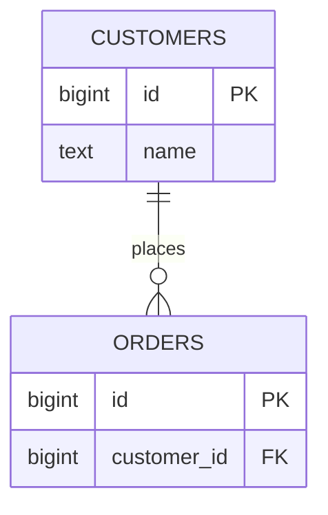

# 09- Primary Key Indexes

## Overview

A **primary key index** is the index structure associated with a table's primary key constraint. A primary key provides a logical identity for each row, while the database typically creates or maintains an index to enforce uniqueness and make primary-key lookups efficient.

For a typical backend table:

```sql
CREATE TABLE users (
    id bigint PRIMARY KEY,
    email varchar(320) NOT NULL,
    created_at timestamp NOT NULL
);
```

the primary key serves two closely related purposes:

- **Data integrity:** every row must have a unique, non-null primary-key value.
- **Data access:** the database can efficiently locate rows by their primary key.

Conceptually:

```text
                 PRIMARY KEY
                      │
          ┌───────────┴───────────┐
          │                       │
      Uniqueness              Index access
          │                       │
          ▼                       ▼
  No duplicate IDs        Fast point lookup
```

The exact physical implementation is database-specific. PostgreSQL, MySQL/InnoDB, and SQL Server do not all organize primary-key storage in the same way.

## Primary Key vs Primary Key Index

These concepts should not be treated as identical.

| Concept | Purpose |
|---|---|
| Primary key | Logical integrity constraint identifying a row |
| Primary-key index | Physical access structure used to enforce or support the constraint |
| Unique constraint | Enforces uniqueness without necessarily representing row identity |
| Secondary index | Additional access path for other query patterns |

For example:

```sql
CREATE TABLE orders (
    id bigint PRIMARY KEY,
    customer_id bigint NOT NULL
);
```

The important application-level rule is:

```text
id uniquely identifies an order
```

The database then uses its own implementation to enforce and support that rule.

## Why Primary Keys Need Efficient Access

Primary-key lookups are extremely common in backend systems.

For example:

```sql
SELECT id, email, created_at
FROM users
WHERE id = $1;
```

Typical application paths include:

- Fetching a resource by REST URL.
- Loading an object in Django ORM.
- Looking up an entity before an update.
- Resolving foreign-key relationships.
- Fetching an entity referenced by another service.
- Applying an update or delete to a specific row.

An efficient primary-key access path makes these operations scale far better than repeatedly scanning the entire table.

## How a Primary Key Lookup Works

For an indexed primary key, a simplified lookup looks like:

```text
Application
    │
    ▼
SELECT ... WHERE id = ?
    │
    ▼
Query optimizer
    │
    ▼
Primary-key access path
    │
    ▼
Matching row
    │
    ▼
Result
```

For a B-tree-style index, the database navigates from the root through internal pages until it reaches the relevant leaf entry.

Conceptually:

```text
                    Root
                   /    \
                  /      \
             Branch      Branch
             /   \        /   \
            10   20      30   40
             │            │
             ▼            ▼
         matching key → row
```

The number of index levels grows logarithmically with the number of entries, so point lookups remain efficient as the table grows.

## Primary Key Guarantees

A primary key normally has two important semantic properties:

```text
UNIQUE
NOT NULL
```

For example:

```sql
CREATE TABLE payments (
    id bigint PRIMARY KEY,
    amount numeric(12, 2) NOT NULL
);
```

The database must reject:

```text
NULL
```

and duplicate values:

```text
1001
1001
```

This guarantee is stronger than application-side validation.

### Why Database Enforcement Matters

Consider two concurrent requests:

```text
Request A                  Request B
    │                          │
    ▼                          ▼
Check ID 1001              Check ID 1001
    │                          │
    ▼                          ▼
Not found                   Not found
    │                          │
    ▼                          ▼
Insert                      Insert
```

Application checks alone cannot reliably prevent this race.

The database constraint provides the authoritative guarantee.

## Primary Keys and Foreign Keys

Primary keys commonly become the target of foreign keys.

Example:

```sql
CREATE TABLE customers (
    id bigint PRIMARY KEY,
    name text NOT NULL
);

CREATE TABLE orders (
    id bigint PRIMARY KEY,
    customer_id bigint NOT NULL,
    CONSTRAINT fk_orders_customer
        FOREIGN KEY (customer_id)
        REFERENCES customers(id)
);
```

The relationship is:



The primary key on `customers` provides the referenced unique identity.

A foreign key does **not** automatically mean that the referencing column is indexed in every database system. For production workloads, indexes on foreign-key columns are often important for joins and parent-row updates/deletes.

## Primary Key Indexes in PostgreSQL

In PostgreSQL:

```sql
CREATE TABLE users (
    id bigint PRIMARY KEY,
    email text NOT NULL
);
```

creates a primary key constraint backed by a unique B-tree index by default.

Inspect the table:

```sql
\d users
```

You may see output conceptually similar to:

```text
Indexes:
    "users_pkey" PRIMARY KEY, btree (id)
```

The index and constraint are related, but the distinction remains important:

```text
PRIMARY KEY constraint
        │
        ▼
unique index
        │
        ▼
efficient access path
```

PostgreSQL's heap table remains separately organized from the ordinary B-tree index.

## Primary Key Indexes in InnoDB

MySQL's InnoDB uses a different model.

The primary key is the **clustered index**. The table's rows are stored in primary-key order within the clustered index structure.

Conceptually:

```text
Primary Key
    │
    ▼
Clustered B-tree
    │
    ├── id = 100
    ├── id = 101
    ├── id = 102
    └── ...
         │
         ▼
      row data
```

This has an important consequence for secondary indexes.

In InnoDB, secondary index entries contain the primary-key value as the row locator.

Therefore:

```text
Secondary index
      │
      ▼
Primary key
      │
      ▼
Clustered index
      │
      ▼
Row
```

The primary-key design can therefore affect the size and performance of every secondary index.

## Primary Key Indexes in SQL Server

SQL Server can implement a primary key using either:

- A clustered index.
- A nonclustered index.

The default behavior for a primary key is typically clustered when no clustered index already exists, but the database can be explicitly configured.

For example:

```sql
CREATE TABLE users (
    id bigint NOT NULL,
    email varchar(320) NOT NULL,
    CONSTRAINT pk_users PRIMARY KEY CLUSTERED (id)
);
```

or:

```sql
CREATE TABLE users (
    id bigint NOT NULL,
    email varchar(320) NOT NULL,
    CONSTRAINT pk_users PRIMARY KEY NONCLUSTERED (id)
);
```

This demonstrates why the phrase **primary key index** should not automatically be interpreted as "clustered index."

The relationship depends on the database engine and schema definition.

## Primary Key Access Patterns

Primary keys are particularly effective for point lookups:

```sql
SELECT *
FROM users
WHERE id = 12345;
```

They are also important for:

```sql
UPDATE users
SET email = $1
WHERE id = $2;
```

and:

```sql
DELETE FROM users
WHERE id = $1;
```

These operations benefit from an efficient unique access path.

However, a primary key does not automatically optimize unrelated queries.

For example:

```sql
SELECT *
FROM users
WHERE email = $1;
```

still requires an index on `email` if this lookup needs to be efficient.

## Primary Key Is Not a Universal Index

A common misconception is:

> "The table has a primary key, so queries against the table are indexed."

Only the primary-key access pattern is directly covered.

Given:

```sql
CREATE TABLE orders (
    id bigint PRIMARY KEY,
    customer_id bigint NOT NULL,
    status text NOT NULL,
    created_at timestamp NOT NULL
);
```

this query can use the primary key:

```sql
SELECT *
FROM orders
WHERE id = 1001;
```

But this query needs a different access path:

```sql
SELECT *
FROM orders
WHERE customer_id = 42;
```

Likewise:

```sql
SELECT *
FROM orders
WHERE status = 'pending';
```

The primary key cannot substitute for indexes designed around these predicates.

## Primary Key Data Types

Common primary-key types include:

| Type | Advantages | Considerations |
|---|---|---|
| `integer` | Compact, fast, simple | Limited range |
| `bigint` | Large range, compact | Slightly larger than `integer` |
| UUID | Globally unique, useful across systems | Larger indexes, random values can affect locality |
| Time-ordered UUID variants | Distributed uniqueness with better locality | Requires appropriate application/database support |
| Application-generated IDs | Flexible across services | Requires careful collision and generation strategy |

For high-scale backend systems, `bigint` and UUID-style identifiers are both common choices.

The correct choice depends on:

- Data volume.
- Distributed-system requirements.
- Public API exposure.
- Index locality.
- Storage overhead.
- ID generation architecture.
- Security requirements.

## Sequential Integer Primary Keys

A common PostgreSQL design is:

```sql
CREATE TABLE orders (
    id bigint GENERATED ALWAYS AS IDENTITY PRIMARY KEY,
    created_at timestamptz NOT NULL DEFAULT now()
);
```

Identity columns allow PostgreSQL to generate values without requiring application-side ID management.

Advantages:

- Compact key.
- Efficient B-tree representation.
- Good locality for insertion.
- Simple foreign keys.
- Easy debugging.

Limitations:

- IDs are generally predictable.
- Values are database-specific rather than globally coordinated.
- Gaps can occur.

### Gaps Are Normal

Suppose:

```text
100
101
102
104
105
```

The missing `103` does not imply corruption.

Sequence/identity values can be consumed by transactions that later roll back, and applications should not depend on primary-key values being gap-free.

If the business requires gapless numbering, that is a separate domain requirement and should not be conflated with database identity generation.

## UUID Primary Keys

A UUID can be used when identifiers need to be generated independently across application instances or services.

Example:

```sql
CREATE TABLE events (
    id uuid PRIMARY KEY,
    event_type text NOT NULL,
    created_at timestamptz NOT NULL
);
```

Advantages:

- Globally unique without centralized allocation.
- Suitable for distributed systems.
- Can be generated before database insertion.
- Useful when IDs cross service boundaries.

Trade-offs:

- Larger than `bigint`.
- Larger foreign keys.
- Larger index entries.
- Random UUID insertion can reduce locality and increase page churn compared with sequential identifiers.

Time-ordered identifier schemes can reduce some locality problems while retaining distributed generation.

## Primary Key Width Matters

A primary key often propagates into other tables.

Consider:

```text
users.id
   │
   ├── orders.user_id
   ├── payments.user_id
   ├── sessions.user_id
   └── audit_logs.user_id
```

If the primary key is wider, foreign keys and related indexes can also become wider.

This means primary-key design is not an isolated decision.

At scale:

```text
Primary key size
      ↓
Foreign key size
      ↓
Secondary index size
      ↓
Memory/cache requirements
      ↓
Storage and I/O
```

For very large schemas, this cumulative effect matters.

## Primary Key Locality

Index locality describes how physically close related index entries tend to be.

Sequential IDs generally produce an insertion pattern like:

```text
1001 → 1002 → 1003 → 1004 → ...
```

Random identifiers may produce:

```text
a91f...
03cd...
f82a...
17be...
```

Random insertion can cause more page splits and poorer locality in some B-tree implementations.

This does not mean UUIDs are inherently bad. It means identifier generation strategy should be evaluated against:

- Write rate.
- Database engine.
- Index implementation.
- Table size.
- Replication.
- Workload characteristics.

## Primary Key and Pagination

Primary keys can be useful for keyset pagination when the ordering matches the primary key.

Instead of:

```sql
SELECT *
FROM orders
ORDER BY id
LIMIT 50 OFFSET 1000000;
```

use:

```sql
SELECT *
FROM orders
WHERE id > $1
ORDER BY id
LIMIT 50;
```

The second pattern allows the database to continue from an index position.

Conceptually:

```text
Last seen ID
     │
     ▼
Index position
     │
     ▼
Next 50 rows
```

This avoids scanning and discarding a large number of earlier rows.

For APIs, this often provides more predictable performance at large offsets.

However, keyset pagination requires a stable and appropriate ordering key. If ordering by `created_at`, for example, a composite cursor such as `(created_at, id)` may be required to guarantee deterministic ordering.

## Primary Key and Joins

Primary keys commonly participate in joins:

```sql
SELECT
    o.id,
    c.name
FROM orders AS o
JOIN customers AS c
    ON c.id = o.customer_id
WHERE o.id = $1;
```

The primary key on:

```text
customers.id
```

provides an efficient access path for locating the referenced customer.

For large workloads, also consider indexing the foreign-key side:

```sql
CREATE INDEX idx_orders_customer_id
ON orders (customer_id);
```

This is particularly important for queries that start from the parent and retrieve many children:

```sql
SELECT *
FROM orders
WHERE customer_id = $1;
```

## Query Plans

Use the execution plan to verify how the database accesses the primary key.

PostgreSQL example:

```sql
EXPLAIN (ANALYZE, BUFFERS)
SELECT *
FROM orders
WHERE id = 12345;
```

A suitable plan may contain:

```text
Index Scan using orders_pkey
```

For a primary-key equality lookup, the optimizer generally has strong statistics about uniqueness and can efficiently estimate the result cardinality.

Do not rely on the presence of an index alone. Production performance should be validated through actual plans and measurements.

## Primary Keys and Constraints

Primary keys are schema-level integrity guarantees.

Prefer:

```sql
CREATE TABLE users (
    id bigint PRIMARY KEY
);
```

over relying on application code such as:

```python
if not user_id_exists(user_id):
    create_user(user_id)
```

The application can perform validation for user experience, but the database must remain the final authority for data integrity.

This is especially important when multiple:

- API servers
- Celery workers
- Kubernetes pods
- microservices
- batch jobs

can write to the same database.

## Primary Keys in Django

Django models commonly define:

```python
from django.db import models


class User(models.Model):
    id = models.BigAutoField(primary_key=True)
    email = models.EmailField(unique=True)
```

Django uses the primary key for:

```python
User.objects.get(pk=user_id)
```

which translates into a database lookup against the primary-key column.

If a model does not explicitly define a primary key, Django automatically adds an appropriate primary-key field according to the configured defaults.

The important production principle is to understand what the ORM generates rather than assuming ORM syntax determines database behavior independently of the database engine.

## Primary Keys in FastAPI

FastAPI itself does not manage database indexes. The database schema does.

A typical service might expose:

```text
GET /orders/{order_id}
```

The application layer validates and passes the identifier to the database:

```python
query = """
    SELECT id, customer_id, status, created_at
    FROM orders
    WHERE id = %s
"""
```

The database then uses the primary-key access path.

The request lifecycle is:

```text
Client
  │
  ▼
Nginx / Load Balancer
  │
  ▼
FastAPI
  │
  ▼
Database driver
  │
  ▼
SQL query
  │
  ▼
Primary-key index
  │
  ▼
Row
```

The API framework does not make the lookup fast; the database schema and execution plan do.

## Changing a Primary Key

Changing a primary key in production is usually more disruptive than adding an ordinary secondary index.

Potential dependencies include:

```text
Primary key
   │
   ├── Foreign keys
   ├── Secondary indexes
   ├── Application references
   ├── APIs
   ├── ETL pipelines
   ├── Events
   └── External systems
```

Before changing one, identify:

- Foreign-key dependencies.
- ORM assumptions.
- API contracts.
- Event payloads.
- Background jobs.
- Replication or CDC consumers.
- Data warehouse mappings.
- Operational tooling.

A primary-key migration should normally be treated as a schema migration project, not a simple column alteration.

## Production Considerations

### Keep Primary Keys Stable

A primary key should generally be immutable.

Avoid:

```sql
UPDATE users
SET id = 2000
WHERE id = 1000;
```

Changing a primary key can require updates to referencing foreign keys and can invalidate assumptions throughout the application.

Use a separate mutable business attribute when the business identity can change.

### Do Not Encode Business Meaning Unnecessarily

Avoid designing IDs such as:

```text
2026-IN-MUM-000123
```

when the value is intended to represent the technical identity of a row.

Business attributes change. Technical identifiers should usually remain stable.

If the business requires such a number, model it as a separate business identifier.

### Avoid Exposing Sequential IDs When Enumeration Is a Concern

Sequential IDs are efficient, but exposing:

```text
/orders/1001
/orders/1002
/orders/1003
```

can make resource enumeration easier.

This is an authorization concern, not an index problem.

Use authorization checks regardless of identifier type. If opaque public identifiers are desirable, use UUIDs or another suitable identifier strategy, but do not treat obscurity as authorization.

### Monitor Primary-Key Growth

For integer keys, monitor the remaining range.

For example, a 32-bit signed integer has a much smaller range than `bigint`.

For long-lived high-volume systems, `bigint` is often a safer default for generated relational identifiers.

## High Availability and Disaster Recovery

Primary keys are part of the schema and therefore need to be consistent across:

- Primary databases.
- Read replicas.
- Standby databases.
- Backup restores.
- Disaster-recovery environments.
- Migration environments.

Schema migrations involving primary keys or their indexes should be tested against realistic replicas and restore procedures.

A backup that restores data without the intended constraints or indexes is not equivalent to the production database.

## Common Mistakes

### Treating Primary Key and Primary-Key Index as the Same Concept

The primary key is a logical constraint. The index is an implementation structure used to enforce and/or support it.

The distinction becomes important when comparing PostgreSQL, InnoDB, and SQL Server.

### Assuming Primary Keys Must Be Clustered

They do not universally have to be.

- PostgreSQL ordinary primary-key indexes are separate from heap storage.
- InnoDB stores table data in the clustered primary-key structure.
- SQL Server can use clustered or nonclustered primary keys.

Always reason in terms of the specific database engine.

### Using Random UUIDs Without Considering Workload

UUIDs provide excellent distributed uniqueness, but randomly distributed values can have larger indexes and poorer insertion locality than sequential keys.

Choose the identifier strategy based on the workload rather than fashion.

### Using `MAX(id) + 1`

Never implement ID generation as:

```sql
SELECT MAX(id) + 1
FROM orders;
```

Concurrent requests can produce the same value.

Use database identity/sequence mechanisms or a properly designed distributed ID generator.

### Assuming IDs Are Gapless

Primary-key values commonly contain gaps.

Do not use primary keys as accounting numbers, invoice sequences, or other values that require gapless semantics unless a separate mechanism explicitly provides that guarantee.

### Updating Primary Keys

Primary keys should normally be immutable.

Changing them can cascade into foreign keys, indexes, caches, events, and external references.

### Forgetting Foreign-Key Indexes

A primary key on the parent table does not automatically make:

```sql
orders.customer_id
```

efficient.

For frequent parent-to-child lookups, index the foreign-key column:

```sql
CREATE INDEX idx_orders_customer_id
ON orders (customer_id);
```

### Assuming the Primary Key Optimizes Every Query

It does not.

This:

```sql
WHERE id = $1
```

and this:

```sql
WHERE email = $1
```

require different access paths.

### Choosing a Key Without Considering Its Propagation

A primary key can appear in:

- Foreign keys.
- Secondary indexes.
- Join conditions.
- Events.
- Cache keys.
- APIs.
- Data warehouse tables.

Its size and representation can therefore affect the wider system.

## Interview Traps

**"Is a primary key an index?"**

A primary key is a constraint. Database systems commonly create or use an index to enforce and support that constraint, but the logical constraint and physical index are distinct concepts.

**"Can a table have multiple primary keys?"**

No. A table has at most one primary key constraint. It can have multiple unique constraints and indexes.

**"Can a primary key contain multiple columns?"**

Yes. This is a composite primary key:

```sql
PRIMARY KEY (tenant_id, user_id)
```

The combination must be unique and non-null.

**"Does a primary key always create a clustered index?"**

No. This is database-engine specific.

**"Why are primary keys usually indexed?"**

Efficient point lookups, uniqueness enforcement, joins, foreign-key references, and updates/deletes by identity all benefit from an efficient unique access path.

**"Should primary keys always be integers?"**

No. `bigint`, UUIDs, and other identifiers can be appropriate depending on scale and architecture.

**"Are UUID primary keys slower?"**

They can have higher storage and indexing costs, particularly with randomly distributed values, but the practical impact depends on the database engine and workload.

**"Does a foreign key automatically create an index?"**

Not universally. Check the behavior of the database engine and ORM, and create the required index explicitly when query patterns need it.

**"Should primary-key values be gapless?"**

No. Identity/sequence-backed IDs are identifiers, not accounting sequences. Gaps are normal.

## Key Takeaways

- **A primary key is a logical integrity constraint; the associated index is a physical access structure whose implementation depends on the database engine.**
- **Primary-key design affects more than point lookups because the key can propagate into foreign keys, secondary indexes, joins, APIs, and distributed-system boundaries.**
- **Choose identifiers such as `bigint` or UUID based on workload, scale, locality, distributed-generation requirements, storage cost, and API considerations.**
- **Primary keys should generally be stable and immutable, while business identifiers and gapless sequences should be modeled separately when required.**
- **Always distinguish database-engine behavior: PostgreSQL, InnoDB, and SQL Server implement primary-key storage and indexing differently.**