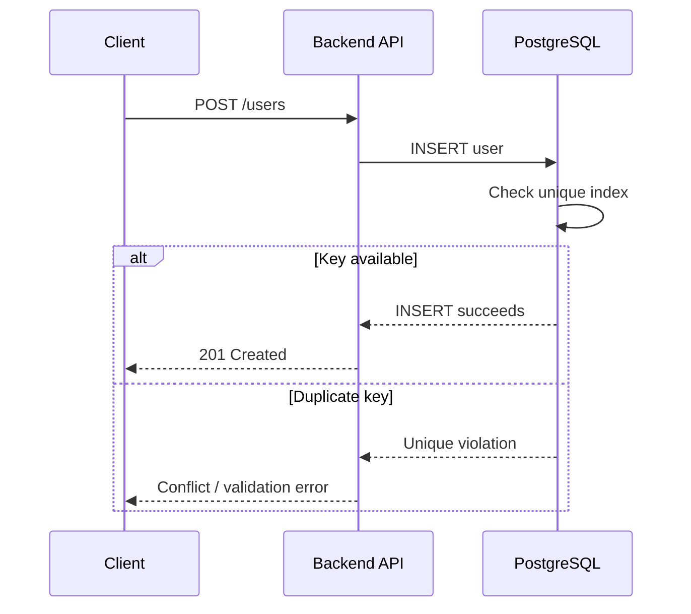

# 10- Unique Indexes

## Overview

A **unique index** is an index that also enforces a uniqueness rule: no two indexed rows may contain the same key value, subject to the database's rules for `NULL` values and any additional index predicates.

Unique indexes serve two purposes simultaneously:

- **Data integrity:** prevent duplicate values from being stored.
- **Query performance:** provide an indexed access path for predicates involving the indexed columns.

For example:

```sql
CREATE UNIQUE INDEX ux_users_email
ON users (email);
```

This means the database must reject two rows with the same `email` value while also maintaining an index that can efficiently locate a user by email.

A unique index should not be viewed merely as a performance optimization. When uniqueness represents a business invariant, enforcing it in the database is usually essential.

## Unique Index vs Unique Constraint

A unique index and a unique constraint are closely related but are not conceptually identical.

| Feature | Unique Constraint | Unique Index |
|---|---|---|
| Primary purpose | Data integrity | Indexed uniqueness/access |
| Prevents duplicates | Yes | Yes |
| Provides an index | Usually backed by an index | Yes |
| Can usually be referenced by foreign keys | Yes, subject to database rules | Database-specific |
| Supports partial uniqueness | Generally no | Yes in systems such as PostgreSQL |
| Supports expression-based uniqueness | Database-specific | Yes in systems such as PostgreSQL |
| Represents a business rule | Strongly | Sometimes |

For a simple business invariant:

```sql
ALTER TABLE users
ADD CONSTRAINT uq_users_email UNIQUE (email);
```

is often preferable because the schema explicitly communicates that `email` must be unique.

For specialized access patterns, a unique index can provide capabilities that a standard unique constraint does not.

## Why Unique Indexes Exist

Suppose an application requires every user email to be unique.

An application-only check might look like:

```python
if not User.objects.filter(email=email).exists():
    create_user(email)
```

This is insufficient under concurrency.

Two requests can execute the check simultaneously:

```text
Request A                         Request B
    │                                 │
    ├── email exists? ── No          │
    │                                 ├── email exists? ── No
    │                                 │
    ├── INSERT user                   │
    │                                 ├── INSERT user
    │                                 │
    └────────────── Race condition ───┘
```

A database uniqueness guarantee closes this race.

```text
Application validation
        │
        ▼
Database unique constraint/index
        │
        ▼
Authoritative uniqueness guarantee
```

Application validation remains useful for friendly errors, but the database must enforce the invariant.

## How a Unique Index Works

A unique index maintains index entries for indexed keys while checking whether the key already exists.

Conceptually:

```text
                Unique Index
                    │
        ┌───────────┼───────────┐
        ▼           ▼           ▼
      alice       bob         charlie
        │           │           │
        ▼           ▼           ▼
      Row 1       Row 2       Row 3
```

An attempt to insert another `bob` must fail:

```text
Existing:
bob → Row 2

New:
bob → ?

       ↓

Duplicate key detected
       ↓
INSERT rejected
```

The exact implementation varies by database engine, but the uniqueness check is performed as part of the database's index/constraint enforcement rather than as a separate application query.

## B-Tree Unique Indexes

B-tree indexes are commonly used for unique indexes.

Example:

```sql
CREATE UNIQUE INDEX ux_users_email
ON users (email);
```

A simplified structure might look like:

```text
                     Root
                   /      \
                  /        \
             a-m            n-z
             /                \
        alice,bob           nina,zara
```

The database navigates the tree to locate the relevant key.

For an insert:

```sql
INSERT INTO users (email)
VALUES ('alice@example.com');
```

the database checks whether the unique index already contains the key.

For a lookup:

```sql
SELECT *
FROM users
WHERE email = 'alice@example.com';
```

the same index can provide an efficient access path.

## Unique Indexes and Query Performance

A unique index provides more than duplicate prevention.

Consider:

```sql
CREATE UNIQUE INDEX ux_users_email
ON users (email);
```

The database now knows:

```text
email → at most one row
```

This can improve query planning because the optimizer can reason about the maximum cardinality of an equality lookup.

For example:

```sql
SELECT id, email
FROM users
WHERE email = $1;
```

is naturally suited to a unique index.

However, uniqueness does not guarantee that the optimizer will always use the index. The optimizer still evaluates:

- Table size.
- Selectivity.
- Query predicates.
- Statistics.
- Cost estimates.
- Available alternative indexes.
- Expected number of rows.

## Single-Column Unique Index

The simplest form is:

```sql
CREATE UNIQUE INDEX ux_users_email
ON users (email);
```

This enforces uniqueness of individual email values.

Valid:

```text
alice@example.com
bob@example.com
charlie@example.com
```

Invalid:

```text
alice@example.com
alice@example.com
```

This pattern is appropriate when the column itself represents a globally unique value within the table.

Common examples include:

- Username.
- External account identifier.
- Payment provider transaction ID.
- Idempotency key, when its uniqueness scope is global.
- Immutable business identifier.

## Composite Unique Indexes

A composite unique index enforces uniqueness across the **combination** of columns.

Example:

```sql
CREATE UNIQUE INDEX ux_memberships_tenant_user
ON memberships (tenant_id, user_id);
```

This permits:

```text
tenant_id | user_id
----------+--------
1         | 100
1         | 101
2         | 100
2         | 101
```

but rejects:

```text
tenant_id | user_id
----------+--------
1         | 100
1         | 100  ← duplicate combination
```

The rule is:

```text
(tenant_id, user_id) must be unique
```

It does **not** mean that either column individually must be unique.

This is a common pattern in multi-tenant systems.

## Composite Uniqueness and Tenant Isolation

A SaaS application might require:

> A user can have only one membership in a given tenant.

Model:

```sql
CREATE TABLE memberships (
    id bigint GENERATED ALWAYS AS IDENTITY PRIMARY KEY,
    tenant_id bigint NOT NULL,
    user_id bigint NOT NULL
);

CREATE UNIQUE INDEX ux_memberships_tenant_user
ON memberships (tenant_id, user_id);
```

This gives:

```text
Tenant A + User 42 → allowed once
Tenant B + User 42 → allowed
Tenant A + User 42 → duplicate, rejected
```

The unique index therefore expresses a domain invariant directly in the database.

## Column Order Matters

For a composite unique index:

```sql
CREATE UNIQUE INDEX ux_orders_customer_external
ON orders (customer_id, external_id);
```

the uniqueness rule applies to:

```text
(customer_id, external_id)
```

Column order also influences query performance.

This query can use the leading portion effectively:

```sql
SELECT *
FROM orders
WHERE customer_id = $1;
```

and this can use the full key:

```sql
SELECT *
FROM orders
WHERE customer_id = $1
  AND external_id = $2;
```

But a query filtering only:

```sql
WHERE external_id = $1
```

does not receive the same benefit from the `(customer_id, external_id)` index.

Therefore, uniqueness requirements and query-access requirements must both be considered when choosing column order.

## Unique Constraints vs Unique Indexes in PostgreSQL

PostgreSQL supports both:

```sql
ALTER TABLE users
ADD CONSTRAINT uq_users_email UNIQUE (email);
```

and:

```sql
CREATE UNIQUE INDEX ux_users_email
ON users (email);
```

A unique constraint is generally the clearer representation of a straightforward business uniqueness rule.

A unique index becomes particularly useful for specialized cases such as:

- Partial uniqueness.
- Expression-based uniqueness.
- Specialized indexing requirements.

### Attaching an Existing Unique Index to a Constraint

PostgreSQL can use an existing unique index for a constraint:

```sql
ALTER TABLE users
ADD CONSTRAINT uq_users_email
UNIQUE USING INDEX ux_users_email;
```

This can be useful during carefully planned migrations when an appropriate unique index already exists.

## Partial Unique Indexes

A **partial unique index** enforces uniqueness only for rows satisfying a predicate.

PostgreSQL example:

```sql
CREATE UNIQUE INDEX ux_users_active_email
ON users (email)
WHERE deleted_at IS NULL;
```

This supports a soft-delete model:

```text
Active:
alice@example.com → unique

Deleted:
alice@example.com → can exist
```

Therefore:

```text
deleted_at IS NULL
```

defines the population for which uniqueness is enforced.

This is extremely useful when the business rule is:

> Only active records must have unique values.

### Practical Soft-Delete Example

Consider:

```sql
CREATE TABLE users (
    id bigint GENERATED ALWAYS AS IDENTITY PRIMARY KEY,
    email text NOT NULL,
    deleted_at timestamptz
);
```

Then:

```sql
CREATE UNIQUE INDEX ux_users_active_email
ON users (lower(email))
WHERE deleted_at IS NULL;
```

Now active users cannot have the same normalized email address, while deleted users do not participate in the uniqueness rule.

## Expression-Based Unique Indexes

A unique index can sometimes enforce uniqueness on a computed expression rather than the raw column.

For example:

```sql
CREATE UNIQUE INDEX ux_users_email_normalized
ON users (lower(email));
```

This enforces uniqueness according to:

```text
lower(email)
```

So these values conflict:

```text
Alice@example.com
alice@example.com
ALICE@example.com
```

because they produce the same indexed expression.

This is useful when the business definition of equality differs from raw byte-for-byte equality.

However, normalization rules should be chosen carefully. Case folding, Unicode behavior, locale considerations, and application semantics can make "case-insensitive equality" more complicated than simply calling `lower()`.

## NULL Semantics

`NULL` requires special attention because SQL does not treat it as an ordinary value.

For example:

```sql
CREATE UNIQUE INDEX ux_users_external_id
ON users (external_id);
```

Depending on the database and configuration, multiple rows containing `NULL` may be permitted because `NULL` represents an unknown/non-value rather than equality with another `NULL`.

PostgreSQL's modern syntax can explicitly control this behavior:

```sql
CREATE UNIQUE INDEX ux_users_external_id
ON users (external_id)
NULLS NOT DISTINCT;
```

This treats `NULL` values as equal for uniqueness purposes.

The exact `NULL` semantics differ across database engines, so production designs should verify the target database's behavior rather than relying on generic SQL assumptions.

## Unique Indexes and Foreign Keys

A unique index can be relevant to foreign-key relationships because referenced columns generally need a uniqueness guarantee.

For example:

```sql
CREATE TABLE customers (
    id bigint PRIMARY KEY,
    external_id text NOT NULL UNIQUE
);
```

A child table may reference a suitable unique key:

```sql
CREATE TABLE invoices (
    id bigint PRIMARY KEY,
    customer_external_id text NOT NULL,
    FOREIGN KEY (customer_external_id)
        REFERENCES customers (external_id)
);
```

Whether a particular unique index is eligible as a foreign-key target depends on the database engine and constraint definition.

For maintainability, prefer explicit unique constraints when the uniqueness is part of the relational model.

## Unique Indexes and Upserts

Unique indexes are frequently used to implement atomic upsert workflows.

PostgreSQL example:

```sql
INSERT INTO idempotency_keys (key, response_hash)
VALUES ($1, $2)
ON CONFLICT (key)
DO NOTHING;
```

with:

```sql
CREATE UNIQUE INDEX ux_idempotency_keys_key
ON idempotency_keys (key);
```

The unique index ensures that concurrent requests cannot successfully insert the same key multiple times.

This is useful for:

- Payment APIs.
- Webhook processing.
- Message consumers.
- REST API idempotency.
- Job deduplication.

The uniqueness guarantee is especially important when multiple application instances can process the same logical request.

## Unique Indexes in Django

Django can express simple uniqueness using:

```python
from django.db import models


class User(models.Model):
    email = models.EmailField(unique=True)
```

For composite uniqueness:

```python
from django.db import models


class Membership(models.Model):
    tenant_id = models.BigIntegerField()
    user_id = models.BigIntegerField()

    class Meta:
        constraints = [
            models.UniqueConstraint(
                fields=["tenant_id", "user_id"],
                name="uq_membership_tenant_user",
            ),
        ]
```

For a conditional uniqueness rule:

```python
from django.db import models


class User(models.Model):
    email = models.EmailField()
    deleted_at = models.DateTimeField(null=True)

    class Meta:
        constraints = [
            models.UniqueConstraint(
                fields=["email"],
                condition=models.Q(deleted_at__isnull=True),
                name="uq_active_user_email",
            ),
        ]
```

The migration should be reviewed as database DDL, not merely as Python model metadata.

## Unique Indexes in API Design

Unique indexes frequently enforce API-level business rules.

For example:

```text
POST /users
{
    "email": "alice@example.com"
}
```

If the email is already registered, the database may reject the insert.

The service should translate the database's uniqueness violation into an appropriate application response rather than assuming a prior existence check is sufficient.

Conceptually:



The database remains the authoritative concurrency boundary.

## Unique Indexes and Idempotency

Consider a payment API:

```text
POST /payments
Idempotency-Key: 7f1...
```

A database table might contain:

```sql
CREATE TABLE payment_requests (
    id bigint GENERATED ALWAYS AS IDENTITY PRIMARY KEY,
    idempotency_key text NOT NULL,
    status text NOT NULL
);

CREATE UNIQUE INDEX ux_payment_requests_idempotency_key
ON payment_requests (idempotency_key);
```

Two concurrent requests using the same key cannot both create independent payment records.

The application can then safely handle the duplicate-key result and return the previously created operation where appropriate.

For distributed systems, this is substantially more reliable than:

```text
Redis check
    ↓
If absent
    ↓
Database insert
```

when Redis is not the authoritative transactional store.

## Performance Costs

Unique indexes provide efficient lookups but have costs.

Every insert or update affecting the indexed columns must maintain the index.

```text
INSERT / UPDATE
      │
      ├── Table write
      │
      └── Unique index maintenance
```

Costs include:

- Additional storage.
- Additional write I/O.
- Additional memory pressure.
- Index page splits.
- Maintenance overhead.
- Vacuum/rebuild considerations depending on database engine.

A unique index is therefore not free.

The correct question is not:

> "Can I add an index?"

but:

> "Does this access path or integrity rule justify its write and storage cost?"

## Unique Indexes and Updates

Updating an indexed value requires index maintenance.

For example:

```sql
UPDATE users
SET email = $1
WHERE id = $2;
```

may require the database to:

1. Locate the row.
2. Remove or update the old index entry.
3. Verify the new value is unique.
4. Add the new index entry.
5. Persist the changes transactionally.

This is one reason frequently changing columns should be evaluated carefully before adding indexes.

## Concurrency and Transactions

Unique indexes participate in database concurrency control.

Consider two concurrent transactions:

```text
Transaction A                  Transaction B
      │                              │
      ├── INSERT X                   │
      │                              ├── INSERT X
      │                              │
      ├── unique check               │
      │                              ├── unique check
      │                              │
      └──────── database resolves concurrent uniqueness ────────
```

The exact locking and conflict behavior is database-specific, but the key principle is consistent:

> A unique constraint/index provides a concurrency-safe uniqueness guarantee that application-level checks cannot provide by themselves.

Transaction isolation and conflict handling still matter. A uniqueness violation should be treated as a normal possible outcome of concurrent writes where appropriate.

## Production Migration Strategy

Adding a unique index to a large production table requires more care than adding it to an empty development database.

First determine whether existing data already violates the intended rule:

```sql
SELECT email, COUNT(*)
FROM users
GROUP BY email
HAVING COUNT(*) > 1;
```

If duplicates exist, creating the unique index will fail.

A safer migration process is:

```text
Inspect existing data
        ↓
Resolve duplicates
        ↓
Create unique index/constraint
        ↓
Deploy application behavior
        ↓
Rely on database enforcement
```

For large PostgreSQL tables, consider concurrency-friendly index creation:

```sql
CREATE UNIQUE INDEX CONCURRENTLY ux_users_email
ON users (email);
```

`CONCURRENTLY` reduces blocking of normal reads/writes compared with a standard index build, but it has operational trade-offs and restrictions. It must be planned carefully, monitored, and handled correctly if the build fails.

For Django migrations, large production index changes may require migration-specific strategies rather than relying blindly on the default migration behavior.

## Monitoring and Operations

Monitor unique-index-related failures as application signals.

Important indicators include:

- Duplicate-key violation rates.
- Failed transactions.
- Index size.
- Index bloat where applicable.
- Index build duration.
- Query latency for indexed access paths.
- Write latency after adding indexes.

A sudden increase in uniqueness violations may indicate:

- Client retry behavior.
- A broken idempotency implementation.
- A race exposed by new concurrency.
- Incorrect normalization.
- A changed business rule.
- A faulty deployment.

Do not automatically treat every unique violation as a database problem.

## High Availability and Disaster Recovery

Unique indexes are part of the database's integrity model.

During replication and recovery:

- The index must remain consistent with the underlying data.
- Schema migrations must be applied safely.
- Backups must preserve constraints and indexes.
- Restore procedures should validate integrity.
- Replicas should be monitored for replication lag during large index builds.

For critical systems, test restores using the same schema and constraints expected in production.

## Security Considerations

Unique indexes can support security-sensitive invariants, but they do not provide authorization.

For example:

```sql
CREATE UNIQUE INDEX ux_api_keys_hash
ON api_keys (key_hash);
```

can ensure that the same credential is not registered multiple times.

However, uniqueness does not determine whether a user is authorized to access a resource.

Do not confuse:

```text
Uniqueness
```

with:

```text
Authorization
```

Likewise, sequentially searchable unique values can still leak information through API enumeration. Authorization checks remain mandatory.

## Common Mistakes

### Checking for Duplicates Only in Application Code

Bad pattern:

```text
SELECT whether value exists
        ↓
If not found
        ↓
INSERT
```

Concurrent requests can pass the check simultaneously.

Use a database uniqueness guarantee.

### Using a Non-Unique Index for a Unique Business Rule

If the rule is:

```text
email must be unique
```

this is insufficient:

```sql
CREATE INDEX idx_users_email
ON users (email);
```

It improves lookup performance but does not prevent duplicates.

Use:

```sql
CREATE UNIQUE INDEX ux_users_email
ON users (email);
```

or an appropriate unique constraint.

### Ignoring NULL Semantics

A nullable unique column may allow multiple `NULL` values depending on the database.

If the business rule requires exactly one missing value or requires the field to always exist, model that explicitly with `NOT NULL` and the appropriate uniqueness semantics.

### Ignoring Soft Deletes

A normal unique constraint:

```sql
UNIQUE (email)
```

may prevent reusing an email after a soft delete.

If the business rule is:

```text
only active users must be unique
```

use a partial unique index where supported.

### Choosing the Wrong Composite Column Order

This:

```sql
UNIQUE (tenant_id, external_id)
```

and this:

```sql
UNIQUE (external_id, tenant_id)
```

enforce the same pairwise uniqueness but provide different index access characteristics.

Choose the order based on both:

- Uniqueness semantics.
- Query patterns.

### Adding Duplicate Indexes

Avoid creating both:

```sql
CREATE UNIQUE INDEX ux_users_email
ON users (email);

CREATE INDEX idx_users_email
ON users (email);
```

The ordinary index is usually redundant because the unique index already provides the indexed access path.

Verify actual index usage before retaining overlapping indexes.

### Assuming Unique Means Case-Insensitive

A normal unique index may treat:

```text
Alice@example.com
alice@example.com
```

as distinct values depending on the database's type and collation behavior.

If the business rule requires normalized equality, explicitly model the normalization strategy.

### Using Uniqueness as Authorization

A unique index can guarantee:

```text
one record per key
```

It cannot guarantee:

```text
this user is allowed to access that record
```

Authorization must remain an application/security concern.

## Interview Traps

**"What is the difference between a unique index and a normal index?"**

A normal index provides an access path. A unique index additionally enforces that indexed keys are unique, subject to the database's `NULL` semantics and index definition.

**"Is a unique constraint the same as a unique index?"**

They provide closely related behavior, but a constraint represents a data-integrity rule while an index is an access structure. Database engines may implement a unique constraint using a unique index.

**"Can a unique index contain multiple columns?"**

Yes. A composite unique index enforces uniqueness of the complete column combination.

**"Can a unique index contain duplicate values?"**

Not for indexed non-null keys under normal uniqueness semantics. `NULL` behavior can differ by database and configuration.

**"Can a unique index improve query performance?"**

Yes. It is still an index and can provide an efficient access path for suitable queries.

**"Does a unique index guarantee that every value is unique across the entire database?"**

No. Its scope is the indexed table and the defined index population. A composite or partial unique index can enforce a much narrower rule.

**"Why use a unique index for idempotency?"**

Because it provides an atomic database-level guarantee against concurrent duplicate inserts. An application-level existence check is vulnerable to races.

**"Why not create a unique index on every column?"**

Indexes have storage and write-maintenance costs. Excessive indexing increases write latency, memory consumption, storage usage, and operational complexity.

**"Can a unique index be partial?"**

Some databases, notably PostgreSQL, support partial unique indexes. They are useful for conditional uniqueness such as "email must be unique only for active rows."

## Key Takeaways

- **Use database-enforced uniqueness for business invariants; application-level existence checks alone are vulnerable to concurrent writes.**
- **Unique indexes provide both integrity and an indexed access path, but they still carry storage and write-maintenance costs.**
- **Composite, partial, and expression-based unique indexes allow precise modeling of real production rules such as tenant-scoped uniqueness and soft-delete behavior.**
- **Always account for database-specific semantics, especially `NULL` handling, foreign-key eligibility, collations, and index implementation.**
- **Treat uniqueness violations as expected concurrency outcomes where appropriate and translate them into deliberate application behavior rather than relying on pre-checks.**