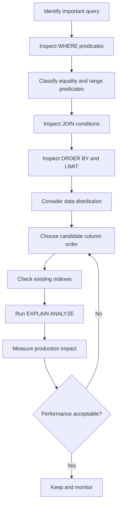

# 12- Index Column Order

## Overview

The **column order of a composite index** determines how the database can navigate that index efficiently. An index on:

```sql
CREATE INDEX idx_orders
ON orders (tenant_id, customer_id, status, created_at);
```

is not equivalent to:

```sql
CREATE INDEX idx_orders
ON orders (status, created_at, tenant_id, customer_id);
```

Both contain the same columns, but they create different ordered access paths.

For B-tree indexes, which are common in PostgreSQL and many relational databases, the leading columns are especially important. A well-designed column order can allow the database to:

- Narrow the search space quickly.
- Satisfy equality predicates efficiently.
- Perform range scans.
- Produce rows in the required order.
- Support keyset pagination.
- Reduce sorting and heap/table access.

A poorly ordered index can remain large and expensive while providing little benefit for the application's important queries.

> **Index column order should be derived from query patterns, not simply from column selectivity or schema order.**

## How Column Order Determines Index Navigation

Consider:

```sql
CREATE INDEX idx_orders
ON orders (customer_id, status, created_at);
```

Conceptually, the index is ordered like:

```text
customer_id
└── status
    └── created_at
```

The database first navigates using `customer_id`. Within a particular customer, entries are ordered by `status`, and within a particular `(customer_id, status)` combination, entries are ordered by `created_at`.

Conceptually:

```text
customer_id = 100
├── cancelled
│   ├── 2026-08-01
│   ├── 2026-08-03
│   └── ...
├── pending
│   ├── 2026-08-02
│   ├── 2026-08-05
│   └── ...
└── shipped
    ├── 2026-08-04
    └── ...

customer_id = 101
├── cancelled
├── pending
└── shipped
```

This ordering explains the **leftmost-prefix principle**.

The index naturally supports access beginning with:

```text
customer_id
customer_id + status
customer_id + status + created_at
```

But it does not provide the same direct lookup path for:

```text
status
created_at
status + created_at
```

because those predicates skip the leading `customer_id` portion.

## The Leftmost-Prefix Principle

Given:

```sql
CREATE INDEX idx_orders
ON orders (a, b, c);
```

the following query patterns are generally well aligned with the index:

```sql
WHERE a = ?
```

```sql
WHERE a = ? AND b = ?
```

```sql
WHERE a = ? AND b = ? AND c = ?
```

A query such as:

```sql
WHERE b = ?
```

does not have the same efficient B-tree lookup because `b` is not the leading key.

Likewise:

```sql
WHERE c = ?
```

does not directly narrow the index from its root using `c`.

This does **not** mean the optimizer can never use the index for such queries. A database may choose other strategies depending on statistics, table size, available indexes, and query predicates. The important point is that the index does not provide the same ordered search capability for a non-leading column.

## Equality, Range, and Ordering

A practical starting point for composite-index design is to classify each predicate.

| Predicate type | Example | Typical index consideration |
|---|---|---|
| Equality | `tenant_id = ?` | Usually strong candidate for leading position |
| Equality | `status = ?` | Often placed before a range column |
| Range | `created_at >= ?` | Often follows equality columns |
| Ordering | `ORDER BY created_at DESC` | Can determine trailing index order |
| Join | `customer_id = customers.id` | May be important depending on access path |
| Prefix search | `email LIKE 'foo%'` | Can use suitable B-tree patterns depending on database/collation |

For a query:

```sql
SELECT id, status, created_at
FROM orders
WHERE tenant_id = $1
  AND customer_id = $2
  AND status = $3
  AND created_at >= $4
ORDER BY created_at DESC
LIMIT 50;
```

a natural starting point is:

```sql
CREATE INDEX idx_orders_tenant_customer_status_created
ON orders (
    tenant_id,
    customer_id,
    status,
    created_at DESC
);
```

The equality predicates establish a narrow region, while `created_at` provides the range and ordering.

## Equality Columns Before Range Columns

A common and useful heuristic is:

```text
Equality
   ↓
Equality
   ↓
Range
   ↓
Ordering / additional access requirements
```

For:

```sql
WHERE tenant_id = $1
  AND status = $2
  AND created_at >= $3
```

consider:

```sql
CREATE INDEX idx_events_tenant_status_created
ON events (tenant_id, status, created_at);
```

The database can first locate:

```text
tenant_id = X
```

then:

```text
status = Y
```

and then scan the relevant `created_at` range.

This is not an absolute rule. Query ordering requirements, data distribution, partial indexes, database-specific optimizer behavior, and workload characteristics can justify a different design.

## Why Range Columns Usually Come Later

Suppose:

```sql
CREATE INDEX idx_orders
ON orders (customer_id, created_at, status);
```

and:

```sql
SELECT *
FROM orders
WHERE customer_id = $1
  AND created_at >= $2
  AND status = $3;
```

The index can efficiently locate:

```text
customer_id = X
```

and then scan the `created_at` range.

However, once the scan enters a range of `created_at`, the later `status` column generally cannot narrow the B-tree search in the same way as a column preceding the range.

Compare:

```sql
(customer_id, status, created_at)
```

with:

```sql
(customer_id, created_at, status)
```

For the workload:

```sql
WHERE customer_id = ?
  AND status = ?
  AND created_at >= ?
```

the first ordering usually gives the B-tree a more selective equality prefix before entering the timestamp range.

## Selectivity Is Important, But Not Sufficient

A common misconception is:

> "Put the most selective column first."

Selectivity matters, but it is not a universal ordering rule.

Suppose:

```text
customer_id → highly selective
status      → low selectivity
created_at  → range
```

For:

```sql
WHERE customer_id = ?
  AND status = ?
  AND created_at >= ?
```

this is often a good design:

```sql
(customer_id, status, created_at)
```

But imagine a different workload:

```sql
WHERE status = ?
ORDER BY created_at DESC
LIMIT 100;
```

Now:

```sql
(status, created_at DESC)
```

may be much more appropriate.

The correct question is not:

> Which column is most selective?

It is:

> **Which ordered access path best serves the important query workload?**

## Query Frequency Matters

Consider two possible queries:

```sql
-- Query A: 20,000 requests/second
WHERE tenant_id = ?
  AND user_id = ?
```

```sql
-- Query B: 1 request/day
WHERE status = ?
  AND created_at >= ?
```

Index design should prioritize the dominant workload rather than blindly optimizing every theoretically possible query.

A senior engineer evaluates:

- Query frequency.
- Query latency.
- Data volume.
- Result cardinality.
- Write frequency.
- SLA requirements.
- Operational cost.
- Whether the query is latency-sensitive.

## Column Order and ORDER BY

Column order can determine whether an index can provide rows in the required order.

Consider:

```sql
CREATE INDEX idx_posts_author_created
ON posts (author_id, created_at DESC);
```

and:

```sql
SELECT id, title, created_at
FROM posts
WHERE author_id = $1
ORDER BY created_at DESC
LIMIT 50;
```

The access path is naturally aligned:

```text
author_id = X
      ↓
created_at DESC
      ↓
first 50 rows
```

Without the ordering component, the database might need to:

```text
Find rows
   ↓
Sort rows
   ↓
Return first 50
```

With the appropriate composite index:

```text
Find author range
   ↓
Read in desired order
   ↓
Return first 50
```

This is especially valuable for feed, timeline, history, and recent-record APIs.

## Column Order and LIMIT

`LIMIT` makes ordering indexes particularly valuable.

Consider:

```sql
SELECT id, created_at
FROM events
WHERE tenant_id = $1
ORDER BY created_at DESC
LIMIT 20;
```

An index such as:

```sql
CREATE INDEX idx_events_tenant_created
ON events (tenant_id, created_at DESC);
```

can allow the database to stop reading once enough qualifying rows have been found.

Without a suitable ordering path, it may need to identify and sort a much larger candidate set before applying the limit.

This does not guarantee an index scan—the optimizer still chooses the cheapest plan—but it gives the optimizer a highly useful access path.

## Composite Indexes and Keyset Pagination

Column order is critical for cursor-based pagination.

Suppose the API returns:

```text
created_at
id
```

as the cursor.

Use:

```sql
CREATE INDEX idx_posts_tenant_created_id
ON posts (
    tenant_id,
    created_at DESC,
    id DESC
);
```

The query can then use a deterministic ordering:

```sql
SELECT id, title, created_at
FROM posts
WHERE tenant_id = $1
  AND (created_at, id) < ($2, $3)
ORDER BY created_at DESC, id DESC
LIMIT 50;
```

The `id` component is important when multiple records have the same timestamp.

The access pattern becomes:

```text
tenant_id
    ↓
created_at DESC
    ↓
id DESC
    ↓
next page
```

For very large tables, this is generally more scalable than repeatedly increasing `OFFSET`.

## Deterministic Ordering

Consider:

```sql
ORDER BY created_at DESC
```

If multiple rows have the same timestamp, their relative order may not be deterministic.

A more robust API ordering is:

```sql
ORDER BY created_at DESC, id DESC
```

with:

```sql
CREATE INDEX idx_posts_created_id
ON posts (created_at DESC, id DESC);
```

This matters for:

- Pagination.
- Event feeds.
- Audit logs.
- Message history.
- Incremental synchronization.
- Change processing.

An index should support the **same logical ordering** required by the query.

## Equality Columns With Different Selectivity

Suppose:

```sql
CREATE INDEX idx_orders
ON orders (tenant_id, status);
```

and:

```text
tenant_id:
10,000 distinct values

status:
5 distinct values
```

For:

```sql
WHERE tenant_id = ?
  AND status = ?
```

putting `tenant_id` first is often sensible because it sharply narrows the search.

However, if the dominant query is:

```sql
WHERE status = ?
ORDER BY created_at DESC
```

the correct index may instead begin with:

```sql
(status, created_at DESC)
```

This illustrates why global cardinality alone does not determine column order.

## Column Correlation

Columns are not always statistically independent.

For example:

```text
tenant_id = enterprise_customer
status = pending
```

may be strongly correlated if that tenant has an unusually large number of pending jobs.

An optimizer that assumes independence can estimate cardinality incorrectly.

In PostgreSQL, extended statistics can improve estimates for correlated columns:

```sql
CREATE STATISTICS orders_tenant_status_stats
ON tenant_id, status
FROM orders;

ANALYZE orders;
```

Extended statistics do not create an index. They improve planner estimates for certain multi-column relationships.

This distinction is important:

```text
Composite index
→ provides an access path

Extended statistics
→ improves cardinality estimation
```

Both can be relevant to query performance.

## Common Column-Ordering Patterns

### Tenant + Entity + Time

Common in multi-tenant applications:

```sql
CREATE INDEX idx_events_tenant_user_created
ON events (tenant_id, user_id, created_at DESC);
```

Useful for:

```sql
WHERE tenant_id = ?
  AND user_id = ?
ORDER BY created_at DESC
LIMIT 50;
```

### Tenant + Status + Time

Common for job queues:

```sql
CREATE INDEX idx_jobs_tenant_status_created
ON jobs (tenant_id, status, created_at);
```

Useful for:

```sql
WHERE tenant_id = ?
  AND status = 'pending'
ORDER BY created_at
LIMIT 100;
```

### Foreign Key + Time

Common for history tables:

```sql
CREATE INDEX idx_order_events_order_created
ON order_events (order_id, created_at DESC);
```

Useful for:

```sql
WHERE order_id = ?
ORDER BY created_at DESC
LIMIT 100;
```

### Status + Time

Useful when the application frequently processes a specific state:

```sql
CREATE INDEX idx_jobs_status_created
ON jobs (status, created_at);
```

This can be particularly useful for operational queues, but a low-cardinality leading column should be evaluated against the actual workload.

## Column Order and JOINs

Consider:

```sql
SELECT o.id, o.total_amount
FROM orders o
JOIN customers c
  ON c.id = o.customer_id
WHERE o.tenant_id = $1
  AND o.status = 'pending';
```

A potentially useful index is:

```sql
CREATE INDEX idx_orders_tenant_status_customer
ON orders (tenant_id, status, customer_id);
```

The optimal design depends on which table the optimizer starts with and how many rows are expected.

Do not assume:

> "A foreign key must always be the first index column."

Instead, determine the dominant access path.

Foreign-key indexes are important for many workloads, including joins and efficient parent-row updates/deletes, but the best composite ordering depends on the queries using them.

## Partial Indexes and Column Order

Sometimes the most useful optimization is to reduce the indexed population.

Suppose most queries target active jobs:

```sql
SELECT id
FROM jobs
WHERE tenant_id = $1
  AND status = 'pending'
ORDER BY created_at
LIMIT 100;
```

A partial index can be:

```sql
CREATE INDEX idx_jobs_pending_tenant_created
ON jobs (tenant_id, created_at)
WHERE status = 'pending';
```

This changes the design:

```text
status
→ fixed by index predicate

tenant_id
→ leading search key

created_at
→ ordering key
```

The index can be much smaller than:

```sql
(tenant_id, status, created_at)
```

if only a small fraction of rows are pending.

The query predicate must be compatible with the partial-index predicate for the optimizer to consider it.

## Composite Indexes and Covering Columns

Column order applies to **key columns**. Some databases, including PostgreSQL, also support non-key included columns.

Example:

```sql
CREATE INDEX idx_orders_customer_created
ON orders (customer_id, created_at DESC)
INCLUDE (status, total_amount);
```

The key order remains:

```text
customer_id
created_at DESC
```

while:

```text
status
total_amount
```

are included as payload.

This can support index-only scans in appropriate circumstances.

Do not use `INCLUDE` as a substitute for correct key ordering. Included columns do not provide the same search ordering as key columns.

## Comparing Different Index Orders

Suppose the query is:

```sql
SELECT id
FROM orders
WHERE tenant_id = $1
  AND status = $2
  AND created_at >= $3
ORDER BY created_at DESC
LIMIT 50;
```

Consider these indexes:

| Index | Suitability |
|---|---|
| `(tenant_id, status, created_at)` | Strong |
| `(status, tenant_id, created_at)` | Also potentially strong for this exact equality query |
| `(tenant_id, created_at, status)` | Usually less effective for using `status` as an additional narrowing key after the range |
| `(created_at, tenant_id, status)` | Better for timestamp-leading workloads; not usually ideal for tenant-first access |
| `(tenant_id)` | Helps tenant filtering but cannot directly provide the full ordering/filtering path |
| `(status)` | Helps only one predicate |
| `(created_at)` | Helps timestamp-oriented access, not the complete query |

Notice that both:

```text
(tenant_id, status, created_at)
```

and:

```text
(status, tenant_id, created_at)
```

can be effective when both leading predicates are equality conditions.

The better choice may depend on:

- Other queries.
- Cardinality.
- Tenant distribution.
- Status distribution.
- Ordering requirements.
- Reusability of the index.

This is why simplistic rules such as "always put the most selective column first" are unreliable.

## Designing One Index for Multiple Queries

Suppose an application has:

```sql
-- Query A
WHERE tenant_id = ?
  AND customer_id = ?
ORDER BY created_at DESC
```

and:

```sql
-- Query B
WHERE tenant_id = ?
  AND customer_id = ?
  AND status = ?
ORDER BY created_at DESC
```

A possible index is:

```sql
CREATE INDEX idx_orders_tenant_customer_status_created
ON orders (
    tenant_id,
    customer_id,
    status,
    created_at DESC
);
```

But Query A does not constrain `status`.

Depending on the database, Query A can still use the leading:

```text
tenant_id
customer_id
```

portion, but the intervening `status` key affects the global ordering of `created_at`.

This is an important senior-level detail:

> An index can be useful for filtering without necessarily providing the exact `ORDER BY` behavior you expect.

If Query A requires:

```sql
ORDER BY created_at DESC
```

the presence of `status` between `customer_id` and `created_at` may prevent the index from directly providing that ordering across all statuses.

The correct index may therefore depend on whether Query A or Query B is more important.

## Index Order Should Follow the Query Shape

A useful design process is:



Do not start by looking at the table and asking:

> "Which columns should I index?"

Start with:

> "Which expensive queries need a better access path?"

## Validate With EXPLAIN

For PostgreSQL:

```sql
EXPLAIN (ANALYZE, BUFFERS)
SELECT id, status, created_at
FROM orders
WHERE tenant_id = 42
  AND customer_id = 1001
  AND status = 'pending'
ORDER BY created_at DESC
LIMIT 50;
```

Evaluate:

- Chosen scan type.
- Actual vs estimated rows.
- Index conditions.
- Filter conditions.
- Sort nodes.
- Rows removed by filter.
- Buffer hits and reads.
- Execution time.

After changing column order, compare plans rather than relying on intuition.

## Production Considerations

### Test With Production-Like Cardinality

Index behavior changes as the table grows.

Test with realistic:

- Row counts.
- Data distributions.
- Tenant sizes.
- Status distributions.
- Timestamp ranges.
- Concurrent traffic.

An index that looks useful on a development database with 50,000 rows may not be optimal for a production table with 500 million rows.

### Consider Write Amplification

Every additional index must be maintained during:

```text
INSERT
UPDATE indexed column
DELETE
```

A wide composite index can increase:

- Disk usage.
- Cache pressure.
- Write latency.
- Index maintenance work.
- Storage costs.

Index design is therefore an optimization problem:

```text
Read latency
    ↕
Write throughput
    ↕
Storage
    ↕
Operational complexity
```

### Monitor Index Usage

In PostgreSQL:

```sql
SELECT
    schemaname,
    relname,
    indexrelname,
    idx_scan,
    pg_size_pretty(pg_relation_size(indexrelid)) AS index_size
FROM pg_stat_user_indexes
ORDER BY pg_relation_size(indexrelid) DESC;
```

Low usage does not automatically mean an index should be removed. A rarely executed but critical operational query may justify its cost.

### Recheck After Data Distribution Changes

Column ordering decisions can become less effective when:

- Tenants grow at different rates.
- Status distributions change.
- A previously rare state becomes common.
- The application's query patterns change.
- New APIs are introduced.

Indexes should be treated as workload-dependent infrastructure.

## Common Mistakes

### Putting Columns in Schema Order

This:

```sql
CREATE INDEX idx_orders
ON orders (id, tenant_id, status, created_at);
```

is not automatically useful just because those columns appear in that order in the table.

Design the index from query access patterns.

### Always Putting the Most Selective Column First

Selectivity matters, but:

```text
selectivity ≠ universal column-order rule
```

Consider equality predicates, range conditions, ordering, workload frequency, and reuse.

### Ignoring ORDER BY

An index that efficiently filters:

```sql
WHERE tenant_id = ?
```

may still require an expensive sort for:

```sql
ORDER BY created_at DESC
```

if the index ordering does not match the requested order.

### Putting a Range Column Too Early

For:

```sql
WHERE tenant_id = ?
  AND status = ?
  AND created_at >= ?
```

this:

```sql
(tenant_id, created_at, status)
```

may be less useful than:

```sql
(tenant_id, status, created_at)
```

when the goal is to narrow using both equality predicates before scanning the timestamp range.

### Assuming `(A, B)` and `(B, A)` Are Equivalent

They contain the same columns but expose different leading access paths and ordering characteristics.

### Creating Every Possible Column Combination

If a table has:

```text
tenant_id
customer_id
status
created_at
```

do not automatically create indexes for every permutation.

The result can be:

- Excessive storage.
- Slower writes.
- More cache pressure.
- Higher maintenance cost.
- More complex query planning.

### Ignoring Existing Indexes

Before creating:

```sql
CREATE INDEX idx_orders_customer_status
ON orders (customer_id, status);
```

inspect existing indexes.

An existing:

```sql
(customer_id, status, created_at)
```

may already provide the required leading-prefix access.

### Assuming the Database Must Use the Index

The optimizer can correctly choose a sequential scan.

For example, if a query returns a large fraction of a small table, scanning the table may be cheaper than traversing an index and fetching many rows.

### Testing Only With Small Data

Index design should be evaluated against production-scale data and representative distributions.

## Interview Traps

### "What determines the order of columns in a composite index?"

The query workload. For B-tree indexes, leading columns determine the ordered search path, while range and ordering requirements influence where later columns should appear.

### "Should the most selective column always be first?"

No. Selectivity is one factor. Equality predicates, query frequency, ordering, range conditions, joins, and workload reuse also matter.

### "Why does `(a, b, c)` not behave like three independent indexes?"

Because it is one ordered structure. Its natural search hierarchy begins with `a`, then `b`, then `c`.

### "Can `(a, b, c)` be used for `WHERE b = ?`?"

Not as the same efficient leading-prefix lookup available for `a`. The optimizer may still choose other strategies involving the index, but `b` is not the leading search key.

### "Why put equality columns before a range column?"

It allows the database to establish a narrower index region using equality conditions before scanning the range.

### "Can an index satisfy both WHERE and ORDER BY?"

Yes, when the index's ordered key structure aligns with the query's filtering and requested ordering. The exact behavior depends on predicates and database implementation.

### "Why might adding a column between the filter and ORDER BY columns hurt?"

Because the intervening column changes the index ordering. If it is not fixed by an equality predicate, the later ordering column may no longer be globally ordered within the filtered set.

### "Are `(a, b)` and `(b, a)` equivalent for equality filtering?"

For a query constraining both columns with equality, either can potentially be effective. They are not equivalent for queries filtering only one column or requiring different ordering.

## PostgreSQL Example

Given:

```sql
CREATE TABLE jobs (
    id bigint GENERATED ALWAYS AS IDENTITY PRIMARY KEY,
    tenant_id bigint NOT NULL,
    status text NOT NULL,
    created_at timestamptz NOT NULL,
    payload jsonb NOT NULL
);
```

Suppose the worker frequently executes:

```sql
SELECT id, payload
FROM jobs
WHERE tenant_id = $1
  AND status = 'pending'
ORDER BY created_at
LIMIT 100;
```

A suitable starting point is:

```sql
CREATE INDEX idx_jobs_tenant_status_created
ON jobs (tenant_id, status, created_at);
```

If only pending jobs matter and pending jobs are a small subset, a partial index may be better:

```sql
CREATE INDEX idx_jobs_pending_tenant_created
ON jobs (tenant_id, created_at)
WHERE status = 'pending';
```

The second index can be significantly smaller because `status` is encoded in the index predicate rather than repeated as an index key.

Which design is preferable should be determined using actual workload measurements.

## Backend Engineering Guidance

For Django, FastAPI, or other application frameworks, the database ultimately sees SQL.

The design loop should therefore be:

```text
API endpoint
    ↓
ORM / query builder
    ↓
Generated SQL
    ↓
Query predicates + ordering
    ↓
Candidate index
    ↓
EXPLAIN ANALYZE
    ↓
Production metrics
```

Do not design indexes exclusively from ORM models.

For example, a Django query:

```python
Order.objects.filter(
    tenant_id=tenant_id,
    customer_id=customer_id,
    status="pending",
).order_by("-created_at")[:50]
```

should be translated mentally into:

```sql
WHERE tenant_id = ?
  AND customer_id = ?
  AND status = ?
ORDER BY created_at DESC
LIMIT 50
```

The SQL access pattern is what determines the useful index ordering.

## Key Takeaways

- **Composite-index column order defines the B-tree access path; `(a, b, c)` and `(c, b, a)` are fundamentally different indexes.**
- **Use equality predicates as a strong starting point, usually before range predicates, while considering `ORDER BY`, joins, pagination, selectivity, and workload frequency together.**
- **Selectivity alone does not determine column order; the best index is the one that matches the application's dominant access patterns.**
- **An extra column can improve filtering but disrupt ordering, so evaluate `WHERE` and `ORDER BY` as one access-path problem.**
- **Validate column order with realistic data, `EXPLAIN (ANALYZE, BUFFERS)`, and production workload metrics before keeping, changing, or removing an index.**