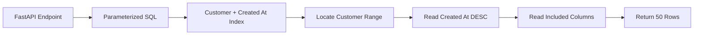

# 13- Covering Indexes

## Overview

A **covering index** contains all the columns required to execute a query without needing to fetch the corresponding table rows. When the database can satisfy the query directly from the index, it may perform an **index-only scan**.

The main objective is to reduce random table access:

```text
Traditional index scan:

Index
  ↓
Find matching row locations
  ↓
Visit table/heap
  ↓
Read required columns
  ↓
Return result
```

With a covering index:

```text
Covering index
  ↓
Find matching entries
  ↓
Read required columns directly
  ↓
Return result
```

Covering indexes can substantially improve read-heavy workloads, particularly for queries that:

- Return a small number of columns.
- Execute frequently.
- Filter using selective predicates.
- Use `ORDER BY ... LIMIT`.
- Run against large tables.
- Are latency-sensitive.
- Can benefit from index-only scans.

A covering index is an **access-path optimization**, not a replacement for good schema design or appropriate query indexing.

## What Makes an Index "Covering"?

An index is covering for a particular query when the index contains everything needed to answer that query.

Consider:

```sql
SELECT id, created_at
FROM orders
WHERE customer_id = $1
ORDER BY created_at DESC
LIMIT 50;
```

A normal index might be:

```sql
CREATE INDEX idx_orders_customer
ON orders (customer_id);
```

The database can find matching rows efficiently, but it may still need to visit the table to obtain:

```text
id
created_at
```

A covering index could be:

```sql
CREATE INDEX idx_orders_customer_created
ON orders (customer_id, created_at DESC)
INCLUDE (id);
```

Now the index contains:

```text
Search/order keys:
customer_id
created_at

Included payload:
id
```

The query can potentially be answered entirely from the index.

## Key Columns vs Included Columns

PostgreSQL supports non-key columns through `INCLUDE`.

For example:

```sql
CREATE INDEX idx_orders_customer_created
ON orders (customer_id, created_at DESC)
INCLUDE (id, status, total_amount);
```

The index has two conceptual parts:

```text
Index key
────────────────────────
customer_id
created_at DESC

Included payload
────────────────────────
id
status
total_amount
```

The distinction is important.

### Key Columns

Key columns:

- Determine the index's ordering.
- Can participate in index navigation.
- Can support filtering and ordering.
- Affect the B-tree structure.

### Included Columns

Included columns:

- Store additional data in index entries.
- Do not determine B-tree ordering.
- Are not equivalent to additional search keys.
- Can allow queries to retrieve columns without accessing the table.

| Property | Key column | Included column |
|---|---:|---:|
| Participates in ordering | Yes | No |
| Used for B-tree navigation | Yes | No |
| Can support `ORDER BY` | Yes | No |
| Stored in index | Yes | Yes |
| Can help index-only scans | Yes | Yes |
| Increases index size | Yes | Yes |

Do not use `INCLUDE` when a column needs to determine the access path.

## Why Covering Indexes Exist

A normal index solves one problem:

> Find matching rows without scanning the entire table.

A covering index can solve an additional problem:

> Retrieve the required columns without visiting the table.

This matters because the table lookup can be expensive.

Consider a large PostgreSQL table:

```text
orders
├── id
├── customer_id
├── tenant_id
├── status
├── created_at
├── total_amount
├── shipping_address
├── metadata
└── payload
```

Suppose the API only needs:

```sql
SELECT id, created_at, status
FROM orders
WHERE tenant_id = $1
ORDER BY created_at DESC
LIMIT 50;
```

If the index contains the required information:

```text
Index
├── tenant_id
├── created_at
├── id
└── status
```

the database may avoid reading wide table rows containing large fields such as:

```text
payload
metadata
shipping_address
```

This can reduce I/O and improve cache efficiency.

## Index-Only Scans

In PostgreSQL, a covering index is useful when the optimizer can use an **Index Only Scan**.

Example:

```sql
CREATE INDEX idx_orders_tenant_created
ON orders (tenant_id, created_at DESC)
INCLUDE (id, status);
```

Query:

```sql
SELECT id, created_at, status
FROM orders
WHERE tenant_id = $1
ORDER BY created_at DESC
LIMIT 50;
```

Inspect the plan:

```sql
EXPLAIN (ANALYZE, BUFFERS)
SELECT id, created_at, status
FROM orders
WHERE tenant_id = 42
ORDER BY created_at DESC
LIMIT 50;
```

A desirable plan may contain:

```text
Index Only Scan using idx_orders_tenant_created
```

rather than:

```text
Index Scan using idx_orders_tenant_created
```

However, **creating a covering index does not guarantee an index-only scan**.

The optimizer still decides whether it is cheaper and valid to use one.

## PostgreSQL Visibility Map

PostgreSQL's index-only scans have an important implementation detail: the index does not normally contain transaction visibility information for every heap tuple.

PostgreSQL maintains a **visibility map** for the table.

Conceptually:

```text
Index entry
    ↓
Can index provide all requested columns?
    ↓
Check visibility information
    ↓
Visibility map says page is all-visible?
    ├── Yes → return data from index
    └── No  → visit heap to verify visibility
```

Therefore, even a covering index may still require heap access for some rows.

This is why PostgreSQL documentation describes index-only scans as depending on both:

1. The index containing the required columns.
2. Heap pages being sufficiently marked all-visible.

Tables with frequent updates may have fewer all-visible pages, reducing the benefit.

## The Visibility Trade-Off

Consider a frequently updated table:

```text
orders
↑
frequent UPDATE operations
↑
visibility map changes
↑
more heap visibility checks
```

A covering index may still help with filtering and ordering, but the expected reduction in heap reads may be smaller.

Conversely, an append-heavy or relatively stable table can have a high proportion of all-visible pages, making index-only scans particularly effective.

This creates an important production distinction:

> **Covering index design and index-only-scan effectiveness are related but not identical.**

## Example: API Read Path

Suppose a FastAPI service exposes:

```text
GET /customers/{customer_id}/orders
```

The endpoint needs:

```text
order_id
created_at
status
total_amount
```

The query is:

```sql
SELECT id, created_at, status, total_amount
FROM orders
WHERE customer_id = $1
ORDER BY created_at DESC
LIMIT 50;
```

A candidate index is:

```sql
CREATE INDEX idx_orders_customer_created
ON orders (customer_id, created_at DESC)
INCLUDE (id, status, total_amount);
```

The access path becomes:



The database can potentially satisfy the query without fetching full heap tuples.

## Covering Indexes and `SELECT *`

Covering indexes work best when the query selects a small, known set of columns.

Avoid:

```sql
SELECT *
FROM orders
WHERE customer_id = $1
ORDER BY created_at DESC
LIMIT 50;
```

and then attempting to create a huge covering index containing every column.

For a wide table, that approach can create an unnecessarily large index.

Prefer:

```sql
SELECT id, created_at, status, total_amount
FROM orders
WHERE customer_id = $1
ORDER BY created_at DESC
LIMIT 50;
```

and cover the actual API response.

This is one reason explicit column selection is valuable in performance-sensitive backend code.

## Covering Indexes and Composite Indexes

Covering and composite indexes solve different aspects of the same query.

Consider:

```sql
SELECT id, status, created_at
FROM orders
WHERE tenant_id = $1
  AND customer_id = $2
ORDER BY created_at DESC
LIMIT 50;
```

A composite index determines the access path:

```sql
CREATE INDEX idx_orders_tenant_customer_created
ON orders (
    tenant_id,
    customer_id,
    created_at DESC
);
```

A covering version can add the remaining selected column:

```sql
CREATE INDEX idx_orders_tenant_customer_created
ON orders (
    tenant_id,
    customer_id,
    created_at DESC
)
INCLUDE (id, status);
```

The design therefore separates:

```text
Keys
→ how to find and order rows

Included columns
→ what additional data can be returned from the index
```

## Covering Indexes and Column Order

The key columns still require careful ordering.

Consider:

```sql
CREATE INDEX idx_events
ON events (tenant_id, created_at DESC)
INCLUDE (id, event_type);
```

This is well aligned with:

```sql
SELECT id, event_type, created_at
FROM events
WHERE tenant_id = $1
ORDER BY created_at DESC
LIMIT 100;
```

The database can:

1. Navigate to the `tenant_id`.
2. Read entries in `created_at DESC` order.
3. Obtain `id` and `event_type` from the index.
4. Stop after 100 rows.

If you instead make `created_at` an included column:

```sql
CREATE INDEX idx_events
ON events (tenant_id)
INCLUDE (id, event_type, created_at);
```

the index contains the data but does not provide `created_at` ordering.

The query may therefore still require a sort.

## Covering Indexes and Pagination

Covering indexes are particularly useful for high-volume list endpoints.

Consider keyset pagination:

```sql
SELECT id, created_at, status
FROM orders
WHERE customer_id = $1
  AND (created_at, id) < ($2, $3)
ORDER BY created_at DESC, id DESC
LIMIT 50;
```

A suitable index is:

```sql
CREATE INDEX idx_orders_customer_created_id
ON orders (
    customer_id,
    created_at DESC,
    id DESC
)
INCLUDE (status);
```

The key columns provide:

```text
customer_id
    ↓
created_at + id cursor
    ↓
descending order
```

The included column provides:

```text
status
```

This is a strong pattern for:

- Activity feeds.
- Order history.
- Audit logs.
- Message history.
- Notification lists.
- Event streams.

## Advantages

### Reduced Heap Access

If an index-only scan is possible, the database can avoid fetching table pages for qualifying rows.

This can significantly reduce I/O for large tables.

### Better Cache Efficiency

Indexes are often smaller than the full table, especially when the table contains large payload columns.

Reading a compact index can therefore be more cache-friendly.

### Lower Latency for Hot Read Paths

Frequently executed queries such as:

```text
GET /orders/recent
GET /notifications
GET /audit-events
```

can benefit when the database can satisfy the query directly from the index.

### Efficient `LIMIT` Queries

A correctly ordered covering index can allow the database to stop early:

```text
Index
 ↓
Locate range
 ↓
Read first 50 entries
 ↓
Return
```

instead of processing many candidate rows and sorting them.

## Limitations

### Larger Indexes

Every included column consumes storage.

For example:

```sql
INCLUDE (
    status,
    total_amount,
    currency,
    shipping_method,
    metadata
)
```

can produce a substantially larger index.

### Higher Write Cost

Indexes must be maintained as data changes.

For:

```sql
UPDATE orders
SET status = 'shipped'
WHERE id = $1;
```

the relevant index entry may need maintenance if `status` is included.

More indexes and wider indexes can increase:

- Insert cost.
- Update cost.
- Delete cost.
- WAL volume.
- Storage consumption.
- Replication traffic.

### Not Every Query Benefits

If a query returns thousands or millions of rows, a covering index may not produce a meaningful advantage.

The optimizer may prefer:

```text
Sequential Scan
```

over repeatedly traversing an index.

### PostgreSQL Visibility Constraints

As discussed earlier, PostgreSQL may still need heap access when pages are not all-visible.

## Covering Index vs Regular Index

| Characteristic | Regular index | Covering index |
|---|---|---|
| Supports filtering | Yes | Yes |
| Supports ordering | Yes, depending on keys | Yes, depending on keys |
| Contains returned columns | Not necessarily | Yes |
| Can enable index-only scan | Sometimes | Specifically designed for it |
| Index size | Smaller | Usually larger |
| Write overhead | Lower | Higher |
| Best for | General access paths | High-value read paths |
| Requires workload analysis | Yes | Yes, especially important |

A covering index should therefore be viewed as a **targeted optimization**, not the default index strategy.

## Covering Indexes in PostgreSQL

PostgreSQL supports included columns:

```sql
CREATE INDEX idx_products_category_price
ON products (category_id, price)
INCLUDE (id, name);
```

The key columns:

```text
category_id
price
```

control the access path.

The included columns:

```text
id
name
```

are payload.

Check index size:

```sql
SELECT
    indexrelname,
    pg_size_pretty(pg_relation_size(indexrelid)) AS index_size
FROM pg_stat_user_indexes
WHERE relname = 'products'
ORDER BY pg_relation_size(indexrelid) DESC;
```

Check whether the index is being used:

```sql
SELECT
    indexrelname,
    idx_scan,
    idx_tup_read,
    idx_tup_fetch
FROM pg_stat_user_indexes
WHERE relname = 'products';
```

For query-level validation:

```sql
EXPLAIN (ANALYZE, BUFFERS)
SELECT id, name, price
FROM products
WHERE category_id = 10
ORDER BY price
LIMIT 50;
```

Look for:

```text
Index Only Scan
```

and compare:

```text
Heap Fetches
```

A low number of heap fetches is generally favorable for an index-only scan.

## Django Example

Consider:

```python
orders = (
    Order.objects
    .filter(customer_id=customer_id)
    .order_by("-created_at")
    .values("id", "created_at", "status", "total_amount")[:50]
)
```

The SQL shape is approximately:

```sql
SELECT id, created_at, status, total_amount
FROM orders
WHERE customer_id = ?
ORDER BY created_at DESC
LIMIT 50;
```

A PostgreSQL index can be:

```sql
CREATE INDEX idx_orders_customer_created
ON orders (customer_id, created_at DESC)
INCLUDE (id, status, total_amount);
```

The ORM does not change the underlying database principles.

The important design inputs remain:

```text
WHERE
ORDER BY
LIMIT
SELECT columns
```

## SQLAlchemy / FastAPI Example

For a SQLAlchemy-based service:

```python
from sqlalchemy import select

stmt = (
    select(
        Order.id,
        Order.created_at,
        Order.status,
        Order.total_amount,
    )
    .where(Order.customer_id == customer_id)
    .order_by(Order.created_at.desc())
    .limit(50)
)
```

The corresponding covering-index decision should be based on the generated SQL and actual execution plan rather than the Python syntax.

Always inspect the database-side query shape.

## When to Use Covering Indexes

Covering indexes are good candidates when all or most of the following are true:

| Condition | Why it matters |
|---|---|
| Query is frequent | Optimization has meaningful aggregate impact |
| Query is latency-sensitive | Reduced I/O can improve tail latency |
| Table is large | Heap access becomes more expensive |
| Result set is small | Index traversal can stop early |
| Selected columns are few | Index remains reasonably compact |
| Table is relatively stable | PostgreSQL index-only scans can be more effective |
| Query has a stable shape | Targeted index remains useful |
| Existing index already matches filtering | Adding included columns may be enough |

Typical workloads include:

- API list endpoints.
- Recent-event queries.
- User dashboards.
- Audit history.
- Notification feeds.
- Read-heavy reporting paths.
- High-frequency existence/list checks.

## When Not to Use Them

Avoid blindly creating covering indexes when:

- The query is rarely executed.
- The table is heavily updated.
- The result set is very large.
- The included columns are wide.
- The index would duplicate another large index.
- The query is not latency-sensitive.
- A sequential scan is already cheaper.
- The workload is write-heavy.

For example, covering a large JSON document:

```sql
INCLUDE (large_json_payload)
```

is usually a strong warning sign.

If the API only occasionally needs that payload, the additional index storage and write amplification are unlikely to be justified.

## Wide Columns Require Special Care

Included columns are not free.

Avoid designing:

```sql
CREATE INDEX idx_orders
ON orders (customer_id)
INCLUDE (
    payload,
    metadata,
    shipping_address,
    billing_address
);
```

on a large transactional table simply to avoid heap access.

Instead, consider:

```text
Index
→ IDs and compact fields needed for the list endpoint

Heap/table
→ large payload loaded only when required
```

A two-step API design can sometimes be better:

```text
List endpoint
→ compact indexed query

Detail endpoint
→ fetch full record
```

This keeps the hot-path index small.

## Production Performance Considerations

### Measure Heap Fetches

For PostgreSQL:

```sql
EXPLAIN (ANALYZE, BUFFERS)
SELECT id, status, created_at
FROM orders
WHERE customer_id = 42
ORDER BY created_at DESC
LIMIT 50;
```

Pay attention to:

```text
Index Only Scan
Heap Fetches
Buffers
Execution Time
```

A plan showing:

```text
Index Only Scan
Heap Fetches: 0
```

is strong evidence that the query was satisfied without heap visibility checks for those rows.

A high heap-fetch count may reduce the expected benefit.

### Compare Before and After

Do not assume:

```text
covering index = faster
```

Measure:

```text
Before
→ execution time
→ buffers
→ CPU
→ I/O
→ p95/p99 latency

After
→ execution time
→ buffers
→ CPU
→ I/O
→ p95/p99 latency
```

A database optimization should be evaluated against the production workload it is intended to improve.

### Monitor Index Growth

Track:

- Index size.
- Index scan frequency.
- Table write rate.
- WAL generation.
- Replica lag.
- Disk utilization.

A large index can have indirect infrastructure costs, especially in replicated PostgreSQL deployments.

## High Availability and Replication Considerations

Indexes are part of the database state and therefore contribute to replication and recovery costs.

A new large index can increase:

- Storage requirements.
- Backup size.
- Restore time.
- WAL generation.
- Replica catch-up work.

For production PostgreSQL systems, consider operational implications before creating a large covering index.

When adding indexes to heavily used tables, use an appropriate deployment strategy. PostgreSQL supports:

```sql
CREATE INDEX CONCURRENTLY idx_orders_customer_created
ON orders (customer_id, created_at DESC)
INCLUDE (id, status, total_amount);
```

`CREATE INDEX CONCURRENTLY` reduces locking impact on normal writes compared with a standard index build, but it is slower and has additional operational considerations. It also cannot run inside a transaction block.

Index creation should therefore be treated as a production deployment operation rather than an isolated SQL change.

## Security Considerations

A covering index can contain copies of sensitive data.

For example:

```sql
INCLUDE (email, phone_number)
```

duplicates those values into the index.

Although normal database permissions still govern access to the table/index through SQL privileges, storing additional copies increases the amount of sensitive data present in database storage and backups.

Before including a column, consider:

- Whether it contains PII.
- Whether it contains secrets or sensitive business data.
- Backup exposure.
- Replication.
- Encryption requirements.
- Data retention policies.

Never include credentials, authentication secrets, tokens, or similarly sensitive material merely to optimize a query.

## Common Mistakes

### Confusing "Covering" With "Composite"

These are different concepts.

```text
Composite index
→ multiple key columns

Covering index
→ contains everything required by a particular query
```

An index can be both.

### Adding Every Selected Column as a Key

Avoid:

```sql
CREATE INDEX idx_orders
ON orders (
    customer_id,
    created_at,
    id,
    status,
    total_amount
);
```

if only `customer_id` and `created_at` need to determine navigation.

Prefer:

```sql
CREATE INDEX idx_orders_customer_created
ON orders (customer_id, created_at DESC)
INCLUDE (id, status, total_amount);
```

when the database supports included columns and that design matches the workload.

### Assuming Index-Only Scan Is Guaranteed

Even with all columns covered, PostgreSQL may perform heap fetches because of visibility-map state or choose another plan altogether.

Always verify with:

```sql
EXPLAIN (ANALYZE, BUFFERS)
```

### Creating Covering Indexes for Wide Columns

Including large payloads can make the index extremely expensive to maintain.

Optimize the hot query path rather than attempting to copy the entire row into the index.

### Ignoring Writes

An index that saves 2 ms on a read but adds substantial overhead to millions of writes may be a poor trade-off.

Evaluate the complete workload.

### Duplicating Existing Indexes

Before creating:

```sql
(customer_id, created_at)
INCLUDE (status)
```

inspect existing indexes.

An existing index may already provide most of the required access path.

### Assuming `SELECT *` Should Be Covered

A covering index should generally target a stable, narrow query rather than attempt to contain an entire wide row.

### Optimizing Without Measuring

Never introduce a covering index solely because:

> "Index-only scans are faster."

The optimizer and actual workload determine whether the optimization is valuable.

## Interview Traps

### "What is a covering index?"

An index that contains all columns needed to answer a particular query, allowing the database to potentially avoid accessing the base table.

### "Does a covering index guarantee an index-only scan?"

No. The optimizer still chooses the execution plan. In PostgreSQL, visibility-map state can also require heap access.

### "What is the difference between a covering index and a composite index?"

A composite index has multiple key columns. A covering index is defined relative to a query: it contains all data needed by that query. A single index can be both.

### "What is `INCLUDE` in PostgreSQL?"

`INCLUDE` stores non-key columns in the index so they can be returned by an index-only scan without participating in index ordering or navigation.

### "Why not put every column into an index?"

Because larger indexes consume storage and memory and increase insert/update/delete cost, WAL generation, replication work, backup size, and maintenance overhead.

### "Can an included column be used for `ORDER BY`?"

Not as an index key. Included columns are payload, not part of the B-tree ordering.

### "Why can PostgreSQL still access the heap during an index-only scan?"

Because PostgreSQL needs to establish tuple visibility. If the relevant heap page is not marked all-visible in the visibility map, it may need to inspect the heap.

### "When are covering indexes especially useful?"

For frequent, latency-sensitive queries that return a small number of columns and rows from large, relatively stable tables, especially when the index can also provide filtering and ordering.

## Practical Design Checklist

Before creating a covering index:

1. Identify the exact query.
2. Identify its `WHERE` predicates.
3. Identify its `JOIN` conditions.
4. Identify its `ORDER BY`.
5. Identify its `LIMIT` or pagination strategy.
6. Identify the exact columns returned.
7. Design the key-column order.
8. Move payload-only columns to `INCLUDE` where appropriate.
9. Check for existing indexes that overlap.
10. Estimate index size and write overhead.
11. Validate with `EXPLAIN (ANALYZE, BUFFERS)`.
12. Test with production-like data and workload.
13. Monitor the index after deployment.

A useful mental model is:

```text
Query
  ↓
What rows must be found?
  ↓
Index key columns
  ↓
What order must they be returned in?
  ↓
Index key ordering
  ↓
What columns must be returned?
  ↓
Included columns
  ↓
Can the database avoid heap access?
  ↓
EXPLAIN + production measurement
```

## Key Takeaways

- **A covering index contains all data required by a query, allowing the database to potentially answer it without fetching base-table rows.**
- **In PostgreSQL, `INCLUDE` stores payload columns without making them part of B-tree ordering; key columns should still be designed around filtering, joins, ordering, and pagination.**
- **A covering index does not guarantee an index-only scan; PostgreSQL's visibility map, optimizer decisions, and workload characteristics determine the actual execution plan.**
- **Covering indexes can reduce I/O and latency on hot read paths, but wider indexes increase storage, write amplification, WAL, replication, backup, and maintenance costs.**
- **Treat covering indexes as targeted production optimizations: validate them with `EXPLAIN (ANALYZE, BUFFERS)` and measure their real workload impact before and after deployment.**