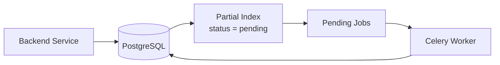
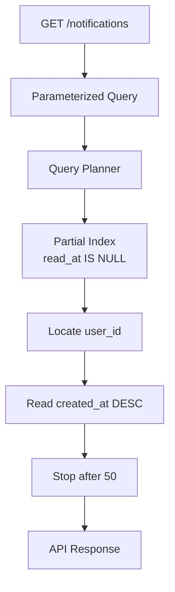

# 14- Partial and Filtered Indexes

## Overview

A **partial index** indexes only the rows that satisfy a specified predicate. A **filtered index** is the SQL Server terminology for the same general optimization pattern.

Instead of indexing an entire table:

```text
Table
├── row
├── row
├── row
├── row
└── row

Index
└── every row
```

a partial/filtered index stores only the relevant subset:

```text
Table
├── active row       ← indexed
├── deleted row
├── active row       ← indexed
├── archived row
└── active row       ← indexed
```

This is particularly valuable when a query repeatedly targets a small, stable subset of a large table.

Typical examples include:

- Active records.
- Unprocessed jobs.
- Pending payments.
- Unread notifications.
- Non-deleted records.
- Rows belonging to a particular operational state.
- Records with non-null values.
- Multi-tenant workloads with a well-defined hot subset.

The central idea is:

> **If most queries only care about a subset of the table, do not necessarily pay the indexing cost for rows those queries never access.**

## Partial vs Filtered Indexes

The terminology depends on the database engine.

| Database | Term | Example capability |
|---|---|---|
| PostgreSQL | Partial index | `CREATE INDEX ... WHERE ...` |
| SQL Server | Filtered index | `CREATE INDEX ... WHERE ...` |
| MySQL | Partial/filtered B-tree indexes | No general equivalent to PostgreSQL's arbitrary partial-index predicate |
| SQLite | Partial index | `CREATE INDEX ... WHERE ...` |

The concept is similar, but syntax, optimizer behavior, supported predicates, and restrictions differ.

This document focuses primarily on **PostgreSQL partial indexes** and **SQL Server filtered indexes**, because both provide first-class support for predicate-based indexes.

## Why Partial Indexes Exist

A conventional index covers every row:

```sql
CREATE INDEX idx_orders_status
ON orders (status);
```

Suppose a production system contains 100 million orders:

```text
status = completed    98,000,000
status = cancelled     1,500,000
status = pending         400,000
status = processing      100,000
```

A workload might overwhelmingly query:

```sql
SELECT id, created_at, total_amount
FROM orders
WHERE status = 'pending'
ORDER BY created_at
LIMIT 100;
```

Indexing all 100 million rows may be unnecessary if only 400,000 rows are operationally relevant.

PostgreSQL can instead create:

```sql
CREATE INDEX idx_orders_pending
ON orders (created_at)
WHERE status = 'pending';
```

The index contains only pending orders.

This can reduce:

- Index size.
- Cache pressure.
- Index traversal work.
- Write maintenance for irrelevant rows.
- Storage requirements.

## How a Partial Index Works

A partial index has two components:

```text
Index key
+
Index predicate
```

For example:

```sql
CREATE INDEX idx_jobs_pending
ON jobs (scheduled_at)
WHERE status = 'pending';
```

Conceptually:

```text
INSERT/UPDATE row
       ↓
Does row satisfy status = 'pending'?
       ↓
   ┌───┴────┐
   │        │
  Yes       No
   │        │
Add/update  Do not
index entry index entry
```

The index therefore represents a subset rather than the entire table.

When the query contains a compatible predicate:

```sql
SELECT id, scheduled_at
FROM jobs
WHERE status = 'pending'
ORDER BY scheduled_at
LIMIT 100;
```

the optimizer can use the smaller index to find the relevant rows.

## PostgreSQL Partial Index

PostgreSQL syntax:

```sql
CREATE INDEX idx_orders_pending
ON orders (created_at DESC)
WHERE status = 'pending';
```

The predicate:

```sql
WHERE status = 'pending'
```

is part of the index definition.

Only rows satisfying that predicate are indexed.

Inspect the index:

```sql
SELECT
    indexname,
    indexdef
FROM pg_indexes
WHERE tablename = 'orders';
```

## PostgreSQL Example: Soft Deletes

A common backend pattern is soft deletion:

```sql
CREATE TABLE users (
    id bigint PRIMARY KEY,
    email text NOT NULL,
    deleted_at timestamptz
);
```

Most application queries need only active users:

```sql
SELECT id, email
FROM users
WHERE deleted_at IS NULL
  AND email = $1;
```

A normal index:

```sql
CREATE INDEX idx_users_email
ON users (email);
```

indexes both active and deleted users.

A partial index can target active users:

```sql
CREATE INDEX idx_users_active_email
ON users (email)
WHERE deleted_at IS NULL;
```

If deleted users represent most historical data, this can make the index substantially smaller.

## Partial Index for Queue Processing

Consider a Celery-like database-backed job queue:

```sql
CREATE TABLE jobs (
    id bigint PRIMARY KEY,
    status text NOT NULL,
    scheduled_at timestamptz NOT NULL,
    payload jsonb NOT NULL
);
```

Workers repeatedly need:

```sql
SELECT id, scheduled_at, payload
FROM jobs
WHERE status = 'pending'
  AND scheduled_at <= now()
ORDER BY scheduled_at
LIMIT 100;
```

A targeted index can be:

```sql
CREATE INDEX idx_jobs_pending_schedule
ON jobs (scheduled_at)
WHERE status = 'pending';
```

The large historical population:

```text
completed
failed
cancelled
```

does not need to occupy this operational index.

The architecture becomes:



This pattern is useful when the active working set is a small fraction of the total table.

## Partial Index Predicate Must Match the Query

A partial index is only useful when the optimizer can establish that the query's predicate implies the index predicate.

For example:

```sql
CREATE INDEX idx_orders_pending
ON orders (created_at)
WHERE status = 'pending';
```

works naturally with:

```sql
SELECT *
FROM orders
WHERE status = 'pending'
ORDER BY created_at;
```

But a query such as:

```sql
SELECT *
FROM orders
WHERE status = $1
ORDER BY created_at;
```

may not be able to use the partial index because the planner may not know at planning time that:

```text
$1 = 'pending'
```

will hold.

The exact behavior depends on the database, query planning mode, prepared statements, and parameter values.

This is an important production consideration for ORM-heavy applications.

## Predicate Implication

The key concept is:

```text
Query predicate
      ↓
Does it guarantee the index predicate?
      ↓
     Yes
      ↓
Partial index is a candidate
```

For example:

```sql
CREATE INDEX idx_orders_active
ON orders (customer_id)
WHERE deleted_at IS NULL;
```

A query containing:

```sql
WHERE deleted_at IS NULL
  AND customer_id = $1
```

clearly targets the indexed subset.

But changing application semantics to:

```sql
WHERE COALESCE(deleted_at, 'infinity') > now()
```

does not necessarily allow PostgreSQL to infer the same predicate.

The SQL may be logically related while still not being a usable match for the partial-index predicate.

## Partial Indexes and Unique Constraints

Partial indexes can enforce conditional uniqueness in PostgreSQL.

Suppose only active users must have unique email addresses:

```sql
CREATE UNIQUE INDEX idx_users_active_email_unique
ON users (lower(email))
WHERE deleted_at IS NULL;
```

This allows:

```text
active:   alice@example.com
deleted:  alice@example.com
deleted:  alice@example.com
```

while preventing:

```text
active:   alice@example.com
active:   alice@example.com
```

This is significantly more precise than application-level checks such as:

```python
if not User.objects.filter(email=email).exists():
    create_user()
```

because concurrent transactions can race.

The database constraint provides the authoritative guarantee.

## Partial Indexes vs Application Filtering

A common mistake is to think:

```sql
CREATE INDEX idx_orders_status
ON orders (created_at);
```

and then rely entirely on:

```python
orders = Order.objects.filter(status="pending")
```

The application filter does not make the index partial.

A partial index is a database-level property:

```sql
CREATE INDEX idx_orders_pending
ON orders (created_at)
WHERE status = 'pending';
```

The database can then maintain only the relevant subset.

## Advantages

### Smaller Indexes

If only 5% of rows satisfy the predicate:

```text
100M table rows
5M indexed rows
```

the resulting index may be substantially smaller than a full-table index.

### Lower Write Maintenance

Rows outside the predicate do not need entries in the partial index.

For example:

```sql
WHERE status = 'pending'
```

means a new:

```text
status = 'completed'
```

row does not require an entry in that index.

This can reduce write amplification for workloads where the indexed subset is small.

### Better Cache Efficiency

A smaller index is more likely to fit into available memory and can reduce cache competition with other indexes and table pages.

### Targeted Optimization

Partial indexes allow indexes to encode business/workload characteristics:

```text
only active rows
only pending rows
only unprocessed rows
only non-null values
```

rather than treating every row equally.

### Conditional Uniqueness

Partial unique indexes can enforce business rules that apply only to a subset of records.

## Limitations

### Predicate Must Be Carefully Chosen

The predicate is part of the access strategy.

If application behavior changes:

```text
status = pending
```

becomes:

```text
status IN ('pending', 'retrying', 'scheduled')
```

the old partial index may no longer adequately serve the workload.

### Not Automatically Better Than a Full Index

If 90% of the table satisfies the predicate:

```sql
WHERE status != 'deleted'
```

the partial index may not provide much reduction.

A normal index may be simpler and more broadly useful.

### Query Shape Matters

A logically equivalent query may not always be recognized as matching the partial predicate.

ORM-generated SQL, prepared statements, expressions, casts, and parameterization can affect planner decisions.

### Additional Operational Complexity

A system with many highly specialized partial indexes can become difficult to reason about.

You may end up with:

```text
idx_orders_active
idx_orders_pending
idx_orders_retrying
idx_orders_recent
idx_orders_tenant_active
idx_orders_customer_active
...
```

Index sprawl increases operational and write costs.

## Partial Indexes vs Full Indexes

| Characteristic | Full index | Partial index |
|---|---|---|
| Rows indexed | Entire table | Predicate-matching rows |
| Index size | Usually larger | Often smaller |
| Write maintenance | Higher | Lower for excluded rows |
| Query applicability | Broad | Predicate-dependent |
| Design complexity | Lower | Higher |
| Conditional uniqueness | Limited | Strong use case |
| Best for | General-purpose access | Stable hot subsets |
| Risk | Over-indexing | Predicate/query mismatch |

The correct choice depends on workload characteristics rather than the index type alone.

## Choosing a Good Predicate

A good partial-index predicate generally has these properties:

| Property | Why it matters |
|---|---|
| Selective | Keeps the index small |
| Stable | Avoids frequent redesign |
| Frequently queried | Produces measurable benefit |
| Operationally meaningful | Represents a real workload subset |
| Easy for optimizer to infer | Improves index usability |
| Excludes low-value rows | Avoids unnecessary maintenance |

Good examples:

```sql
WHERE deleted_at IS NULL
```

```sql
WHERE status = 'pending'
```

```sql
WHERE processed_at IS NULL
```

```sql
WHERE tenant_id = 42
```

The last example requires additional architectural consideration in a multi-tenant system because hard-coding a single tenant into an index usually does not scale to thousands of tenants.

## Multi-Tenant Systems

Suppose:

```sql
orders (
    tenant_id,
    status,
    created_at
)
```

A tempting design is:

```sql
CREATE INDEX idx_tenant_42_pending
ON orders (created_at)
WHERE tenant_id = 42
  AND status = 'pending';
```

This may be useful for a very large, exceptional tenant, but it is generally not a scalable strategy for every tenant.

For a normal multi-tenant workload, prefer a composite access path such as:

```sql
CREATE INDEX idx_orders_tenant_pending
ON orders (tenant_id, created_at DESC)
WHERE status = 'pending';
```

This creates one partial index for all pending rows while retaining tenant-based navigation.

For highly skewed workloads, specialized indexes can sometimes be justified for exceptionally large tenants, but that should be driven by measured workload characteristics.

## Partial Indexes and Composite Keys

Partial indexes can be combined with composite indexes.

Example:

```sql
CREATE INDEX idx_orders_customer_pending
ON orders (customer_id, created_at DESC)
WHERE status = 'pending';
```

This addresses two dimensions:

```text
Predicate
→ only pending orders

Index keys
→ customer_id
→ created_at DESC
```

A query such as:

```sql
SELECT id, created_at, total_amount
FROM orders
WHERE customer_id = $1
  AND status = 'pending'
ORDER BY created_at DESC
LIMIT 50;
```

can potentially use this index very efficiently.

The distinction remains:

```text
WHERE clause in CREATE INDEX
→ determines which rows exist in the index

Index columns
→ determine how those rows are organized and searched
```

## Partial Indexes and Covering Indexes

The techniques can also be combined.

PostgreSQL:

```sql
CREATE INDEX idx_orders_pending_customer_created
ON orders (customer_id, created_at DESC)
INCLUDE (id, total_amount)
WHERE status = 'pending';
```

This index simultaneously provides:

```text
Partial
→ only pending orders

Composite
→ customer_id + created_at

Covering
→ id + total_amount included
```

For a high-frequency endpoint:

```sql
SELECT id, created_at, total_amount
FROM orders
WHERE customer_id = $1
  AND status = 'pending'
ORDER BY created_at DESC
LIMIT 50;
```

this can be an extremely targeted access path.

However, combining optimizations also combines their costs and complexity. Validate the actual workload before introducing such an index.

## SQL Server Filtered Indexes

SQL Server uses the term **filtered index**.

Example:

```sql
CREATE INDEX IX_Orders_Pending
ON dbo.Orders (CustomerId, CreatedAt DESC)
WHERE Status = 'Pending';
```

This creates an index only for rows satisfying the filter.

Filtered indexes are useful for sparse subsets such as:

```sql
WHERE IsProcessed = 0
```

or:

```sql
WHERE DeletedAt IS NULL
```

SQL Server has specific restrictions around which filter predicates and expressions are supported, so filtered-index design should be validated against the target SQL Server version and schema.

## PostgreSQL vs SQL Server

| Capability | PostgreSQL Partial Index | SQL Server Filtered Index |
|---|---|---|
| Predicate-based index | Yes | Yes |
| Predicate specified with `WHERE` | Yes | Yes |
| Conditional uniqueness | Yes | Yes, with appropriate unique filtered index |
| Common use | Sparse/hot subsets | Sparse/hot subsets |
| Included columns | Yes | Yes |
| Predicate restrictions | PostgreSQL-specific | SQL Server-specific |
| Planner matching | Predicate implication | Optimizer/filter matching |
| Terminology | Partial | Filtered |

Do not assume that an index design can be copied between engines without validating syntax and optimizer behavior.

## Production Example: Active Notifications

Consider a notification table:

```sql
CREATE TABLE notifications (
    id bigint PRIMARY KEY,
    user_id bigint NOT NULL,
    created_at timestamptz NOT NULL,
    read_at timestamptz
);
```

The application frequently executes:

```sql
SELECT id, created_at
FROM notifications
WHERE user_id = $1
  AND read_at IS NULL
ORDER BY created_at DESC
LIMIT 50;
```

A suitable PostgreSQL index is:

```sql
CREATE INDEX idx_notifications_unread
ON notifications (user_id, created_at DESC)
WHERE read_at IS NULL;
```

This avoids indexing already-read notifications in this specific access path.

The lifecycle becomes:



This is a strong fit because:

- Unread notifications are a small subset.
- The query is frequent.
- The predicate is stable.
- The result is ordered.
- The query has a small limit.
- Old read notifications do not need to participate in this access path.

## Monitoring Partial Indexes

A partial index should be monitored like any other production index.

PostgreSQL:

```sql
SELECT
    schemaname,
    relname AS table_name,
    indexrelname AS index_name,
    idx_scan,
    idx_tup_read,
    idx_tup_fetch
FROM pg_stat_user_indexes
WHERE relname = 'notifications'
ORDER BY idx_scan DESC;
```

Inspect index size:

```sql
SELECT
    indexrelname AS index_name,
    pg_size_pretty(pg_relation_size(indexrelid)) AS index_size
FROM pg_stat_user_indexes
WHERE relname = 'notifications';
```

For query-level validation:

```sql
EXPLAIN (ANALYZE, BUFFERS)
SELECT id, created_at
FROM notifications
WHERE user_id = 42
  AND read_at IS NULL
ORDER BY created_at DESC
LIMIT 50;
```

Verify that the expected partial index is actually selected.

Do not judge an index solely by whether it exists.

## Deployment Considerations

Creating a partial index on a large production table can still require significant work.

For PostgreSQL:

```sql
CREATE INDEX CONCURRENTLY idx_notifications_unread
ON notifications (user_id, created_at DESC)
WHERE read_at IS NULL;
```

`CREATE INDEX CONCURRENTLY` is often preferable for large, heavily accessed production tables when reducing blocking is important.

It has trade-offs:

- Takes longer.
- Performs more work.
- Uses additional resources.
- Has failure/recovery considerations.
- Cannot execute inside a transaction block.

For Django migrations, operationally sensitive index creation should be designed carefully rather than assuming the migration framework's default transaction behavior is appropriate.

## Data Lifecycle Matters

Partial indexes can be especially valuable when data transitions through lifecycle states:

```text
pending
   ↓
processing
   ↓
completed
```

Suppose:

```sql
CREATE INDEX idx_jobs_pending
ON jobs (scheduled_at)
WHERE status = 'pending';
```

When a row changes:

```sql
UPDATE jobs
SET status = 'completed'
WHERE id = $1;
```

the row no longer satisfies the predicate and therefore no longer belongs in the partial index.

Conceptually:

```text
pending row
    ↓
Index entry exists
    ↓
status changes
    ↓
predicate becomes false
    ↓
Index entry removed
```

This is useful because the index naturally follows the operational working set.

However, if rows constantly move into and out of the predicate, index maintenance can still be significant.

## Common Mistakes

### Indexing a Low-Selectivity Majority

This:

```sql
WHERE status != 'deleted'
```

may include 99% of the table.

The partial index then provides little size reduction.

Measure the distribution before choosing the predicate.

### Using a Predicate That Does Not Match Real Queries

Creating:

```sql
WHERE status = 'pending'
```

is ineffective if application queries usually use:

```sql
WHERE status IN ('pending', 'retrying')
```

unless the index and query design are intentionally aligned.

Design indexes from actual query patterns.

### Assuming Logical Equivalence Is Enough

Two predicates can be logically related but still differ in whether the optimizer can prove that one implies the other.

Keep partial-index predicates simple and aligned with production SQL.

### Creating One Index Per Tenant

Avoid automatically generating:

```text
tenant_1_pending
tenant_2_pending
tenant_3_pending
...
tenant_10000_pending
```

This creates severe index-management and storage overhead.

Use tenant-aware composite indexes unless workload skew justifies specialized indexing.

### Forgetting State Transitions

A row changing from:

```text
pending → completed
```

causes partial-index maintenance.

High-frequency state transitions can create write amplification even when the indexed subset is small.

### Ignoring ORM-Generated SQL

Django, SQLAlchemy, and other frameworks may generate SQL that differs from the SQL developers expect.

Always inspect:

```sql
EXPLAIN (ANALYZE, BUFFERS)
```

against the actual query shape.

### Creating Too Many Specialized Indexes

Partial indexes are powerful enough to make over-indexing tempting.

Every additional index creates:

- Storage cost.
- Write maintenance.
- Backup overhead.
- Replication work.
- Planner complexity.
- Operational ownership.

Use them where they solve a measured workload problem.

## Performance Validation Workflow

Use a repeatable process:

```text
Production query
      ↓
Measure baseline
      ↓
Analyze data distribution
      ↓
Identify selective predicate
      ↓
Design partial index
      ↓
Create safely
      ↓
EXPLAIN ANALYZE
      ↓
Compare latency + buffers
      ↓
Monitor production usage
```

Baseline:

```sql
EXPLAIN (ANALYZE, BUFFERS)
SELECT id, created_at
FROM notifications
WHERE user_id = 42
  AND read_at IS NULL
ORDER BY created_at DESC
LIMIT 50;
```

Create:

```sql
CREATE INDEX CONCURRENTLY idx_notifications_unread
ON notifications (user_id, created_at DESC)
WHERE read_at IS NULL;
```

Validate again:

```sql
EXPLAIN (ANALYZE, BUFFERS)
SELECT id, created_at
FROM notifications
WHERE user_id = 42
  AND read_at IS NULL
ORDER BY created_at DESC
LIMIT 50;
```

Compare:

- Execution time.
- Planning time.
- Shared buffers.
- Heap blocks.
- Rows examined.
- Rows returned.
- Index selected.
- p95/p99 API latency.

## Security Considerations

Partial indexes do not provide authorization or tenant isolation.

For example:

```sql
CREATE INDEX idx_orders_active
ON orders (tenant_id)
WHERE status = 'active';
```

does **not** prevent a query from accessing another tenant's rows.

Authorization must remain enforced through:

- Application-level authorization.
- Database roles.
- Row-level security where appropriate.
- Correct query predicates.
- Transaction and connection policies.

Index predicates are performance structures, not security boundaries.

## Cost and Reliability Considerations

A smaller partial index can reduce storage and potentially improve cache behavior, but its benefits must be evaluated against operational costs.

Consider:

- Index creation time.
- Storage growth.
- WAL generation.
- Replica impact.
- Backup/restore size.
- Index rebuild time.
- Table update frequency.
- Predicate selectivity over time.

The predicate may also become less selective as the dataset evolves.

For example:

```text
2026:
pending = 1%

2028:
pending = 35%
```

An index that was highly effective when created may become much less valuable later.

Treat index design as something to monitor and periodically reassess.

## Interview Traps

### "What is a partial index?"

An index containing only rows that satisfy a specified predicate.

### "Why use a partial index?"

To optimize queries targeting a selective subset of a table while reducing index storage and maintenance compared with indexing every row.

### "What is the difference between a partial index and a normal index?"

A normal index generally contains entries for all applicable table rows. A partial index contains only rows satisfying its predicate.

### "What is a filtered index?"

SQL Server's term for a predicate-restricted index.

### "Can partial indexes enforce uniqueness?"

Yes. PostgreSQL, for example, can use a unique partial index to enforce uniqueness only for rows satisfying a predicate.

### "Is a partial index always faster?"

No. It may be smaller and more targeted, but the optimizer still chooses the execution plan. A poor predicate or low selectivity can make it less useful than a normal index.

### "Can a partial index replace a composite index?"

Not necessarily. They solve different problems.

```text
Partial predicate
→ which rows are indexed

Composite key
→ how indexed rows are organized and searched
```

They are often combined.

### "What happens when a row stops satisfying the predicate?"

The database must maintain the index accordingly. A row transitioning out of the indexed subset causes its index entry to be removed.

### "What is the biggest design risk?"

Creating an index whose predicate does not align with actual production query patterns or whose selectivity deteriorates over time.

## Practical Design Checklist

Before creating a partial or filtered index:

- Identify the exact production query.
- Measure the frequency and latency of the query.
- Determine the percentage of rows matching the predicate.
- Confirm the predicate is stable enough to justify specialization.
- Keep the predicate simple where possible.
- Design key columns independently around filtering and ordering.
- Check existing indexes for overlap.
- Consider write amplification from state transitions.
- Validate ORM-generated SQL.
- Use `EXPLAIN (ANALYZE, BUFFERS)` on PostgreSQL.
- Estimate index size before deployment.
- Consider replication and backup impact.
- Deploy large indexes using an appropriate online/concurrent strategy.
- Monitor index usage after deployment.
- Reassess selectivity as the dataset evolves.

## Key Takeaways

- **Partial indexes contain only rows matching a predicate, making them highly effective for selective, frequently queried subsets such as active, pending, unread, or unprocessed records.**
- **PostgreSQL calls them partial indexes, while SQL Server calls them filtered indexes; optimizer behavior and predicate restrictions are engine-specific.**
- **The partial predicate determines which rows are indexed, while the index key determines how those rows are searched and ordered; the two can be combined with composite and covering-index techniques.**
- **Partial indexes reduce index size and can reduce write maintenance, but state transitions, query-shape mismatches, low selectivity, and index sprawl can eliminate their benefits.**
- **Design partial indexes from measured production queries and validate them with execution plans, workload metrics, index usage, and long-term predicate selectivity.**