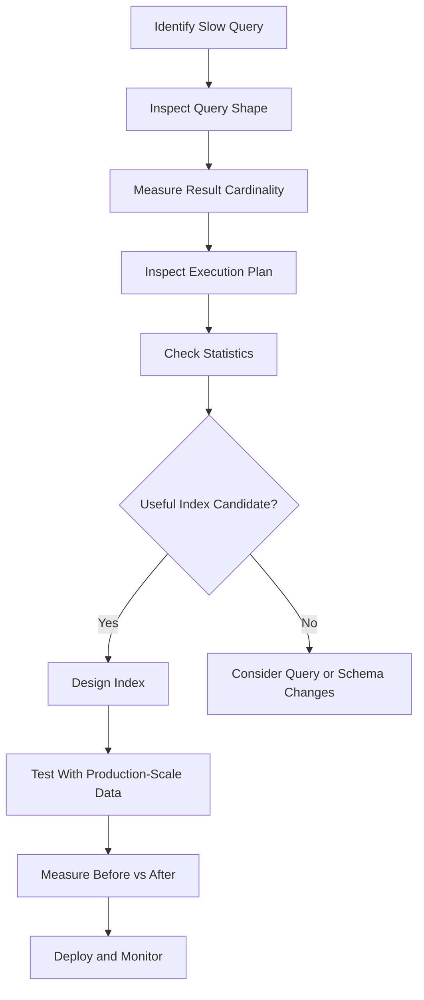

# 21- Index Selectivity

## Overview

Index selectivity describes how effectively an indexed predicate narrows the candidate rows in a table.

A highly selective predicate matches a small fraction of rows:

```text
100,000,000 rows
        ↓
      1,000 matches
```

A low-selectivity predicate matches a large fraction:

```text
100,000,000 rows
        ↓
  80,000,000 matches
```

Selectivity matters because indexes are most valuable when they allow the database to avoid substantial table work. However, **high selectivity is not a requirement for every useful index**, and "always index the most selective column" is an oversimplification.

The optimizer evaluates selectivity together with table size, data distribution, query shape, ordering requirements, available indexes, row width, caching, and estimated I/O cost.

For production systems, index design should therefore be based on **real query patterns and execution plans**, not column cardinality alone.

## Selectivity and Cardinality

These concepts are related but different.

| Concept | Meaning |
|---|---|
| Cardinality | Number of distinct values in a column |
| Selectivity | How much a predicate narrows the result set |
| Density | Roughly, how frequently particular values occur |
| Uniqueness | Whether each value identifies at most one row |

Consider:

```text
users.email
```

with:

```text
10,000,000 rows
9,999,500 distinct emails
```

A predicate such as:

```sql
WHERE email = 'user@example.com'
```

is highly selective.

Now consider:

```text
users.is_active
```

with:

```text
10,000,000 rows
9,500,000 rows = TRUE
500,000 rows = FALSE
```

A predicate:

```sql
WHERE is_active = TRUE
```

has relatively low selectivity because most rows match.

### Important Distinction

High cardinality often makes equality predicates selective, but the two concepts are not interchangeable.

For example:

```text
created_at
```

may have millions of distinct timestamp values, yet:

```sql
WHERE created_at >= '2020-01-01'
```

could match nearly the entire table.

The **predicate**, not just the column, determines practical selectivity.

## Why Selectivity Matters

Suppose a table contains:

```text
50 million orders
```

and:

```sql
SELECT *
FROM orders
WHERE customer_id = 12345;
```

If the customer has only 100 orders, an index can reduce the amount of data the database needs to inspect dramatically.

Conceptually:

```text
Without useful index

50M rows
   ↓
scan/filter
   ↓
100 matches
```

versus:

```text
With selective index

B-tree
   ↓
customer_id = 12345
   ↓
100 matching entries
   ↓
100 rows
```

The difference becomes increasingly important as the table grows.

## A Simple Selectivity Model

A useful approximation is:

```text
Selectivity = matching rows / total rows
```

For example:

```text
10,000 matching rows
--------------------- = 0.01%
1,000,000 total rows
```

Another useful measure is the inverse:

```text
Rows eliminated = 1 - selectivity
```

These values are conceptual rather than exact optimizer formulas.

Database optimizers use much richer statistics and cost models to estimate cardinality and execution cost.

## High-Selectivity Predicates

Typical highly selective predicates include:

```sql
WHERE id = 123456
```

```sql
WHERE email = 'alice@example.com'
```

```sql
WHERE order_id = '8d7e...'
```

when those values are unique or nearly unique.

A B-tree index is particularly effective when the query can locate a very small number of index entries.

Example:

```sql
CREATE UNIQUE INDEX idx_users_email
ON users (email);
```

A lookup by email can potentially locate a single row without scanning the entire table.

## Low-Selectivity Predicates

Examples include:

```sql
WHERE is_active = true
```

or:

```sql
WHERE status = 'completed'
```

when most rows have that value.

A normal index can still be useful, but it is less likely to provide a substantial benefit for queries that retrieve a large fraction of the table.

For example:

```text
10M rows
   ↓
9M rows match
```

Reading 9 million index entries and then fetching 9 million table rows may be more expensive than sequentially scanning the table.

## The Optimizer Does Not Use a Simple Selectivity Threshold

There is no universal rule such as:

```text
< 5%  → use index
> 5%  → don't use index
```

Real database optimizers consider many factors.

| Factor | Effect |
|---|---|
| Table size | Larger tables increase potential benefit of avoiding scans |
| Matching rows | More matches reduce the advantage of selective access |
| Row width | Wide rows make avoiding unnecessary table reads more valuable |
| Cache state | Cached pages can make sequential access relatively cheap |
| Physical ordering | Correlated data can make scans more efficient |
| Index size | Large indexes increase I/O and cache pressure |
| Query projection | Fetching many columns can increase heap/table access |
| `ORDER BY` | An index may eliminate a separate sort |
| `LIMIT` | Ordered index access can stop early |
| Statistics | Inaccurate estimates can lead to poor plan choices |

Therefore:

> **Index usefulness is a cost-model question, not simply a selectivity question.**

## Selectivity and Query Cost

Consider:

```sql
SELECT *
FROM orders
WHERE status = 'completed';
```

Suppose:

```text
10 million rows
9 million completed
```

An index on `status` may require:

```text
Index traversal
    ↓
9 million index entries
    ↓
9 million table lookups
```

A sequential scan may instead perform:

```text
Sequential table scan
    ↓
10 million rows evaluated
```

The sequential scan can be faster because the database reads table pages efficiently and avoids large numbers of random accesses.

This is why seeing an index on a column does not mean the optimizer should use it.

## Selectivity Changes Over Time

Selectivity is not necessarily static.

Suppose:

```sql
status
```

initially contains:

```text
pending:    10%
completed:  20%
cancelled:  70%
```

Six months later:

```text
pending:     1%
completed:  94%
cancelled:   5%
```

The same index can have very different usefulness for different predicates over time.

Similarly, a time-based query can change selectivity as the dataset grows.

For:

```sql
WHERE created_at >= NOW() - INTERVAL '1 hour'
```

the percentage of the table represented by one hour may decrease as historical data accumulates.

This is one reason production query performance should be monitored continuously.

## Selectivity and Index Column Order

Selectivity is important when designing composite indexes, but it should not be reduced to:

> "Put the most selective column first."

Consider:

```sql
SELECT *
FROM orders
WHERE tenant_id = 42
  AND status = 'pending'
  AND created_at >= $1
  AND created_at < $2;
```

A candidate index might be:

```sql
CREATE INDEX idx_orders_tenant_status_created
ON orders (tenant_id, status, created_at);
```

The database can conceptually narrow through:

```text
tenant_id = 42
      ↓
status = 'pending'
      ↓
created_at range
```

This may be more useful than putting the globally most selective column first.

The correct ordering depends on:

- Equality predicates.
- Range predicates.
- `ORDER BY`.
- Join conditions.
- Query frequency.
- Data distribution.
- Other queries sharing the index.

## Equality vs Range Selectivity

Consider:

```sql
WHERE tenant_id = ?
  AND created_at >= ?
  AND created_at < ?
```

Even if `created_at` has extremely high cardinality, putting it first is not automatically optimal.

A common candidate is:

```sql
(tenant_id, created_at)
```

because the database can first restrict the index to one tenant and then perform a range scan.

Conceptually:

```text
All tenants
    ↓
tenant_id = 42
    ↓
August 2026
    ↓
matching rows
```

rather than:

```text
All timestamps in August
    ↓
filter tenant_id = 42
```

The second strategy may touch many more index entries when the time range is broad.

## Composite Selectivity

Individual column selectivity can be misleading.

Suppose:

```text
country
-------
IN:  40%
US:  35%
UK:  15%
Other: 10%
```

and:

```text
status
------
active: 80%
inactive: 20%
```

Individually:

```sql
WHERE country = 'US'
```

matches many rows.

So does:

```sql
WHERE status = 'inactive'
```

But:

```sql
WHERE country = 'US'
  AND status = 'inactive'
```

may match a much smaller subset.

A composite index can exploit this combined filtering:

```sql
CREATE INDEX idx_users_country_status
ON users (country, status);
```

The optimizer's statistics and knowledge of value distributions determine how accurately it estimates this combined selectivity.

## Correlated Columns

Naive selectivity assumptions become particularly problematic when columns are correlated.

Suppose an application has:

```text
country = 'IN'
```

and:

```text
currency = 'INR'
```

These values are strongly correlated.

If the optimizer assumes independence between predicates, it can incorrectly estimate the number of matching rows.

For example:

```sql
WHERE country = 'IN'
  AND currency = 'INR'
```

may not have the selectivity expected from multiplying two independent probabilities.

Modern databases provide mechanisms for improving statistics in some cases. PostgreSQL, for example, supports extended statistics for relationships between columns.

Example:

```sql
CREATE STATISTICS stats_users_country_currency
    (dependencies, ndistinct)
ON country, currency
FROM users;

ANALYZE users;
```

Use extended statistics when execution plans demonstrate persistent cardinality-estimation problems involving correlated columns.

## Selectivity and `NULL`

`NULL` values require careful reasoning because SQL uses three-valued logic.

For example:

```sql
WHERE deleted_at IS NULL
```

may match most rows in a table containing mostly active records.

An index can still be useful, but whether it is beneficial depends on the workload and database implementation.

If the application frequently queries only active rows:

```sql
WHERE deleted_at IS NULL
```

a partial index can sometimes be more appropriate.

In PostgreSQL:

```sql
CREATE INDEX idx_orders_active_created
ON orders (created_at)
WHERE deleted_at IS NULL;
```

This can produce a much smaller index when deleted rows represent a significant portion of the table.

## Selectivity and Partial Indexes

Partial indexes are useful when the workload repeatedly targets a selective subset.

Suppose:

```text
100 million jobs
95 million completed
5 million pending
```

The query:

```sql
SELECT id, created_at
FROM jobs
WHERE status = 'pending'
ORDER BY created_at
LIMIT 100;
```

may benefit from:

```sql
CREATE INDEX idx_jobs_pending_created
ON jobs (created_at)
WHERE status = 'pending';
```

Instead of indexing all 100 million rows, the index covers only the 5 million relevant rows.

Advantages:

- Smaller index.
- Less index maintenance for rows outside the predicate.
- Better cache efficiency.
- Potentially faster queries.

The predicate must match the query semantics closely enough for the optimizer to recognize that the partial index is applicable.

## Selectivity and Unique Indexes

Unique indexes are typically highly selective for equality lookups.

For example:

```sql
CREATE UNIQUE INDEX idx_users_email
ON users (email);
```

supports the integrity rule:

```text
one email → at most one row
```

and provides an efficient access path for:

```sql
SELECT id
FROM users
WHERE email = $1;
```

However, uniqueness is not necessary for an index to be useful.

A non-unique index can still be highly effective when each searched value usually matches only a small number of rows.

## Selectivity and Foreign Keys

Foreign-key columns often have moderate or high cardinality.

For example:

```sql
orders.customer_id
```

may contain millions of distinct customer IDs.

An index such as:

```sql
CREATE INDEX idx_orders_customer_id
ON orders (customer_id);
```

can support:

```sql
SELECT *
FROM orders
WHERE customer_id = $1;
```

It can also be important for join performance:

```sql
SELECT c.id, o.id
FROM customers c
JOIN orders o
  ON o.customer_id = c.id;
```

The decision should consider actual access patterns rather than assuming every foreign key automatically requires a standalone index.

## Selectivity and `ORDER BY ... LIMIT`

A moderately selective predicate can still be valuable when the index provides ordering and the query stops early.

Consider:

```sql
SELECT id, created_at
FROM orders
WHERE status = 'pending'
ORDER BY created_at DESC
LIMIT 50;
```

Even if `pending` represents 20% of the table, an index such as:

```sql
CREATE INDEX idx_orders_status_created
ON orders (status, created_at DESC);
```

can potentially locate pending rows in the required order and stop after finding 50.

The index provides two benefits:

```text
Filtering
   +
Ordering
   +
Early termination through LIMIT
```

This is why evaluating selectivity without considering `ORDER BY` and `LIMIT` can lead to incorrect index decisions.

## Selectivity and Keyset Pagination

Keyset pagination is another case where an index can remain valuable even when the overall predicate is not extremely selective.

Example:

```sql
SELECT id, created_at
FROM orders
WHERE (created_at, id) < ($1, $2)
ORDER BY created_at DESC, id DESC
LIMIT 100;
```

with:

```sql
CREATE INDEX idx_orders_created_id
ON orders (created_at DESC, id DESC);
```

The database can seek to the cursor position and read the next page.

The critical benefit is not necessarily that the predicate matches a tiny percentage of the table. It is that the database can **start at the required position instead of scanning and discarding a large offset**.

## Measuring Selectivity in PostgreSQL

Inspect the distribution of values:

```sql
SELECT
    status,
    COUNT(*) AS row_count,
    ROUND(
        100.0 * COUNT(*) / SUM(COUNT(*)) OVER (),
        2
    ) AS percentage
FROM orders
GROUP BY status
ORDER BY row_count DESC;
```

For numeric or timestamp columns, examine realistic ranges:

```sql
SELECT COUNT(*)
FROM orders
WHERE created_at >= TIMESTAMPTZ '2026-08-01'
  AND created_at < TIMESTAMPTZ '2026-09-01';
```

Then compare:

```sql
SELECT COUNT(*)
FROM orders;
```

This provides a rough application-level understanding of the fraction of rows being targeted.

For production decisions, validate the optimizer's estimates with:

```sql
EXPLAIN (ANALYZE, BUFFERS)
SELECT id, customer_id, total
FROM orders
WHERE created_at >= TIMESTAMPTZ '2026-08-01'
  AND created_at < TIMESTAMPTZ '2026-09-01';
```

Pay particular attention to:

```text
rows=estimated
actual rows
```

Large differences indicate cardinality-estimation problems that can cause poor plan selection.

## PostgreSQL Statistics

PostgreSQL stores column statistics that the optimizer uses for cardinality estimation.

Inspect statistics with:

```sql
SELECT
    tablename,
    attname,
    n_distinct,
    most_common_vals,
    most_common_freqs,
    histogram_bounds
FROM pg_stats
WHERE tablename = 'orders';
```

These statistics help the optimizer understand:

- Approximate distinct-value counts.
- Frequently occurring values.
- Value distributions.
- Histograms for range estimation.

Run:

```sql
ANALYZE orders;
```

when statistics are stale or after significant data distribution changes.

Autovacuum's automatic analyze behavior normally handles this in production, but high-churn or unusual workloads may require tuning.

## Statistics Can Become Stale

Suppose an initially balanced column becomes heavily skewed:

```text
Before:
pending    33%
completed  34%
failed     33%

After:
pending     1%
completed  98%
failed      1%
```

If optimizer statistics do not reflect the new distribution, the database may estimate the cost of:

```sql
WHERE status = 'completed'
```

incorrectly.

That can lead to:

```text
expected small result
        ↓
index plan selected
        ↓
actual huge result
        ↓
expensive execution
```

Accurate statistics are therefore part of index performance.

## Selectivity and Data Skew

Uniform distributions are easier for optimizers to estimate.

Real production data is often skewed.

For example:

```text
tenant_id
-------------------------
Tenant A       70%
Tenant B        5%
Tenant C        2%
Thousands      <1%
```

An index lookup for a small tenant can be extremely selective while the same lookup for Tenant A may match most of the table.

This can result in different optimal plans for different parameter values.

When this occurs, investigate:

- Parameter-sensitive plans.
- Statistics quality.
- Data distribution.
- Generic versus custom plans where applicable.
- Query workload patterns.

Do not assume one parameter's execution plan represents every parameter.

## Selectivity and Parameterized Queries

Backend applications commonly issue parameterized SQL:

```sql
SELECT id, total
FROM orders
WHERE customer_id = $1;
```

This is desirable for correctness and SQL injection prevention.

However, the optimizer may have to make planning decisions without knowing the exact parameter value in some execution contexts.

In heavily skewed datasets, this can affect plan quality.

Production diagnosis should compare:

```text
estimated cardinality
vs
actual cardinality
```

for representative parameter values.

The solution may involve statistics improvements, query redesign, plan configuration, or schema changes rather than simply adding another index.

## Selectivity and Django

Django's ORM does not change the fundamental indexing rules.

For:

```python
orders = Order.objects.filter(
    customer_id=customer_id,
    created_at__gte=start,
    created_at__lt=end,
)
```

the database still evaluates the generated SQL and chooses an access path.

Inspect the generated SQL when necessary:

```python
query = Order.objects.filter(
    customer_id=customer_id,
    created_at__gte=start,
    created_at__lt=end,
)

print(query.query)
```

For actual production diagnosis, use the database's execution-plan tooling rather than relying solely on ORM-level intuition.

Django also provides:

```python
query.explain()
```

for inspecting execution plans.

## When Low-Selectivity Indexes Are Still Useful

A low-selectivity column can still be valuable when:

- It is part of a selective composite index.
- It supports `ORDER BY`.
- The query uses `LIMIT`.
- It enables an index-only scan.
- It participates in a frequently executed join.
- A partial index makes the indexed subset selective.
- The table is very large.
- The index provides a useful access path for particular values.
- It helps avoid an expensive sort.

For example:

```sql
WHERE status = 'pending'
ORDER BY created_at
LIMIT 100
```

may justify:

```sql
(status, created_at)
```

even when `status` alone is not selective.

## When High Selectivity Does Not Guarantee a Good Index

Even a highly selective column may not justify an index if:

- The query is rarely executed.
- The table is tiny.
- The index duplicates an existing index.
- The query applies a non-sargable expression.
- The index maintenance cost is excessive.
- The query returns wide rows and requires many heap fetches.
- The query is dominated by another expensive operation.
- The optimizer cannot effectively use the index because of the query shape.

Indexing is an engineering trade-off:

```text
Read performance
       ↕
Write performance
       ↕
Storage
       ↕
Memory/cache pressure
       ↕
Operational complexity
```

## Common Mistakes and Pitfalls

### "Always Put the Most Selective Column First"

This is one of the most common indexing misconceptions.

For composite indexes, equality predicates, range predicates, ordering, joins, and workload shape can matter more than standalone column selectivity.

### Confusing Cardinality With Selectivity

A column with millions of distinct values can still have a low-selectivity query.

Example:

```sql
WHERE created_at >= '2020-01-01'
```

may match most rows despite `created_at` having extremely high cardinality.

### Assuming Boolean Indexes Are Useless

A Boolean column often has low cardinality, but an index can still be useful in specific workloads, especially when one value is rare or when combined with other columns.

### Assuming High Selectivity Means the Index Must Be Used

The optimizer evaluates cost.

A sequential scan can still be cheaper depending on table size, caching, query projection, and other factors.

### Ignoring Data Distribution

Average cardinality can hide extreme skew.

Always investigate actual value frequencies when diagnosing unexpected plans.

### Ignoring Statistics

A theoretically excellent index can appear ineffective when the optimizer has inaccurate cardinality estimates.

### Creating Indexes Without Measuring

Adding an index because a column appears in a `WHERE` clause is not sufficient.

Measure:

```text
query frequency
latency
rows examined
execution plan
index usage
write overhead
storage
```

### Creating Redundant Indexes

Suppose these exist:

```sql
(customer_id)
(customer_id, created_at)
```

The second index may already support many queries that the first one supports.

Do not keep overlapping indexes blindly. Evaluate actual workload and database-specific index behavior before removing anything.

### Ignoring Write Costs

Every additional index can increase the cost of:

```text
INSERT
UPDATE
DELETE
```

A read optimization must justify its write and storage overhead.

## Production Optimization Workflow

Use a repeatable process rather than guessing.



A practical workflow is:

1. Identify a real production query with measurable performance impact.
2. Determine how frequently it runs and how many rows it returns.
3. Inspect the current execution plan.
4. Compare estimated and actual cardinality.
5. Examine data distribution and selectivity.
6. Design the smallest index that addresses the query shape.
7. Test using production-scale data.
8. Measure latency, I/O, CPU, and write overhead.
9. Deploy the index safely.
10. Monitor query and index behavior after deployment.

## Production Considerations

### Optimize for Workload, Not Individual Columns

A production schema should be designed around query patterns such as:

```text
tenant_id = ?
created_at range
ORDER BY created_at
LIMIT 100
```

rather than simply indexing every frequently filtered column.

### Measure P95 and P99

Average latency can hide poor tail behavior.

Track:

- P50.
- P95.
- P99.
- Query execution time.
- Rows returned.
- Buffer reads.
- CPU utilization.
- Disk I/O.

### Monitor Index Usage

PostgreSQL provides index statistics:

```sql
SELECT
    schemaname,
    relname,
    indexrelname,
    idx_scan,
    idx_tup_read,
    idx_tup_fetch,
    pg_size_pretty(pg_relation_size(indexrelid)) AS index_size
FROM pg_stat_user_indexes
WHERE relname = 'orders'
ORDER BY idx_scan DESC;
```

An index with very low usage may warrant investigation, but low usage alone is not sufficient evidence for removal.

### Consider Storage and Cache Pressure

Indexes consume disk and memory.

Large indexes can:

- Increase database storage costs.
- Consume buffer-cache capacity.
- Increase backup size.
- Increase replication/WAL activity during maintenance.
- Compete with table pages for memory.

### High Availability

In replicated PostgreSQL environments, index creation and maintenance can generate substantial I/O and WAL activity.

For large production indexes, plan migrations carefully and understand:

- Replica lag.
- Disk capacity.
- Lock behavior.
- Build duration.
- Deployment rollback strategy.

### Cost Optimization

An index that saves milliseconds on a query executed millions of times can be highly valuable.

An index that saves milliseconds on a query executed once per day may not justify:

```text
GBs of storage
+
higher write cost
+
maintenance
```

Optimize according to workload impact.

## Interview Traps

### "What Is Selectivity?"

A strong answer should distinguish it from cardinality:

> Selectivity describes how much a predicate narrows the candidate rows. Cardinality describes the number of distinct values or, depending on context, the number of rows in a relation/result. High cardinality often correlates with selective equality predicates, but they are not the same concept.

### "Should the Most Selective Column Always Come First?"

No.

For composite indexes, equality predicates often precede range predicates, and `ORDER BY`, joins, query frequency, and actual data distribution can change the optimal ordering.

### "Are Boolean Indexes Useless?"

No.

They can be useful when one value is rare, when combined with other columns, when supporting ordering, or when used in a partial-index strategy.

### "Why Does the Optimizer Ignore My Highly Selective Index?"

Possible reasons include:

- Stale statistics.
- Incorrect cardinality estimates.
- Query transformation.
- Non-sargable predicates.
- Index/table I/O cost.
- Cached data.
- A competing cheaper plan.
- The query actually returns more rows than expected.

The execution plan is the source of truth.

### "Does High Selectivity Guarantee Faster Queries?"

No.

Selectivity is one input into query cost. Index maintenance, random I/O, row width, sorting, joins, caching, and other operations can dominate total execution time.

## Key Takeaways

- **Selectivity measures how strongly a predicate narrows the result set; it is related to cardinality but is not the same thing.**
- **High selectivity often makes an index attractive, but the optimizer chooses plans using a broader cost model rather than a fixed selectivity threshold.**
- **Do not blindly place the most selective column first in a composite index; equality predicates, ranges, joins, ordering, and workload shape all matter.**
- **Data distribution and accurate optimizer statistics are critical because skew or stale estimates can produce poor execution plans.**
- **Evaluate indexes using real execution plans, production-scale data, workload frequency, and the trade-off between read performance, write overhead, storage, and operational cost.**