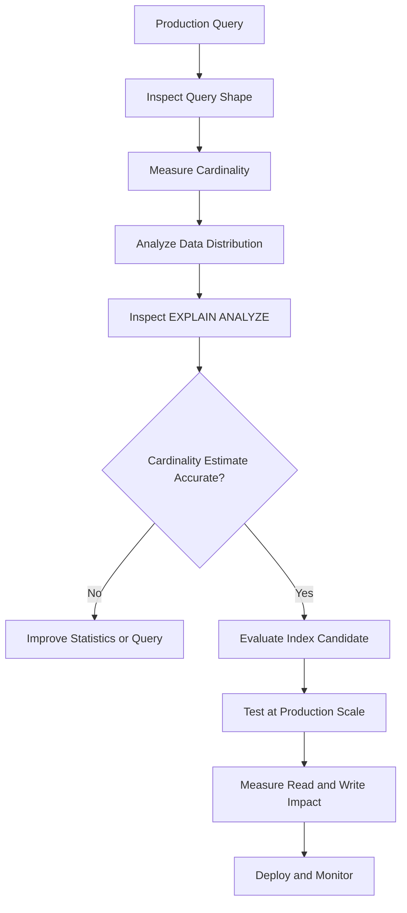

# 22- Cardinality and Index Design

## Overview

Cardinality is a fundamental input to SQL index design and query optimization. In practical terms, it describes how many distinct values a column contains, while **selectivity** describes how effectively a predicate narrows the rows that must be processed.

For example, consider a `users` table with 10 million rows:

| Column | Approximate distinct values | Typical cardinality |
|---|---:|---|
| `id` | 10,000,000 | Very high |
| `email` | 9,999,000 | Very high |
| `country` | 200 | Low |
| `status` | 5 | Very low |
| `created_at` | Millions | Very high |

Cardinality is useful when deciding which columns are likely to benefit from indexes, but it should **never be used as the only index-design criterion**.

A production index decision should consider:

- Query predicates.
- Data distribution.
- Selectivity.
- Composite index ordering.
- `ORDER BY`.
- `GROUP BY`.
- Join conditions.
- `LIMIT` and pagination.
- Index size.
- Write overhead.
- Optimizer statistics.
- Actual execution plans.

The central engineering principle is:

> **Design indexes around workload and query access patterns, using cardinality and selectivity as important inputs rather than absolute rules.**

## Cardinality

### What It Means

Cardinality describes the number of distinct values represented by a column.

Suppose:

```text
users
--------------------------------
10,000,000 rows

country:
200 distinct values

email:
9,999,000 distinct values

status:
5 distinct values
```

Then:

```text
email       → very high cardinality
country     → low cardinality
status      → very low cardinality
```

High cardinality generally means values are more differentiated from each other.

Low cardinality means many rows share the same value.

### Why It Matters for Indexes

An index is most useful when it allows the database to eliminate substantial amounts of work.

Consider:

```sql
SELECT id
FROM users
WHERE email = $1;
```

If `email` is unique or nearly unique:

```text
10,000,000 table rows
        ↓
email index lookup
        ↓
1 matching row
```

The index provides a highly targeted access path.

Compare that with:

```sql
SELECT id
FROM users
WHERE status = 'active';
```

If 95% of users are active:

```text
10,000,000 table rows
        ↓
status = active
        ↓
9,500,000 rows
```

The optimizer may prefer a sequential scan because retrieving millions of rows through an index can be more expensive than scanning the table sequentially.

## Cardinality vs Selectivity

These concepts are frequently confused.

| Concept | Question it answers |
|---|---|
| Cardinality | How many distinct values does this column have? |
| Selectivity | How much does this particular predicate reduce the candidate rows? |
| Data distribution | How frequently does each value occur? |

Consider:

```text
created_at
```

It may have millions of distinct values and therefore high cardinality.

But this query:

```sql
WHERE created_at >= '2020-01-01'
```

could still match nearly every row.

So:

```text
High cardinality ≠ automatically highly selective query
```

Likewise, a low-cardinality column can produce a selective predicate if the requested value is rare.

Example:

```text
status:
active      99%
suspended    1%
```

The column has low cardinality, but:

```sql
WHERE status = 'suspended'
```

can be highly selective.

## Cardinality and Index Suitability

A useful initial heuristic is:

| Column characteristic | Typical index potential |
|---|---|
| Very high cardinality | Often strong for equality lookups |
| Medium cardinality | Depends heavily on distribution and workload |
| Low cardinality | Often weak alone, but useful in composites or partial indexes |
| Very low cardinality | Usually requires workload-specific justification |
| Unique column | Strong candidate for unique index when integrity requires it |

This is only a starting point.

The query planner ultimately evaluates the cost of available execution strategies.

## High-Cardinality Columns

Typical examples:

```text
user_id
order_id
email
UUID
timestamp
```

Consider:

```sql
CREATE UNIQUE INDEX idx_users_email
ON users (email);
```

A lookup:

```sql
SELECT id
FROM users
WHERE email = $1;
```

can efficiently locate a very small result set.

High cardinality is especially valuable for equality predicates where the application commonly searches for individual entities.

Examples include:

```sql
WHERE id = ?
WHERE email = ?
WHERE external_id = ?
WHERE order_id = ?
```

## Low-Cardinality Columns

Common examples include:

```text
status
is_active
is_deleted
gender
country
```

A standalone index may provide limited benefit if a value matches a large percentage of the table.

For example:

```sql
CREATE INDEX idx_users_is_active
ON users (is_active);
```

If:

```text
is_active = TRUE  → 99%
is_active = FALSE → 1%
```

then the index may be useful for:

```sql
WHERE is_active = FALSE
```

but not necessarily for:

```sql
WHERE is_active = TRUE
```

The same index can therefore be useful for one value and ineffective for another.

## Data Distribution Matters More Than Cardinality Alone

Two columns can have the same cardinality but radically different distributions.

Consider:

```text
Column A

A: 50%
B: 25%
C: 15%
D: 10%
```

and:

```text
Column B

A: 25%
B: 25%
C: 25%
D: 25%
```

Both have four distinct values.

But:

```sql
WHERE column_a = 'A'
```

matches half the table, while:

```sql
WHERE column_b = 'A'
```

matches one quarter.

Cardinality alone cannot represent this difference.

Production index decisions should therefore consider **frequency distributions**, not just distinct-value counts.

## Cardinality and the Query Optimizer

Database optimizers estimate how many rows a query will return.

Conceptually:

```text
SQL query
   ↓
Statistics
   ↓
Cardinality estimation
   ↓
Cost estimation
   ↓
Execution plan
```

For example:

```sql
SELECT *
FROM orders
WHERE customer_id = 123;
```

The optimizer may estimate:

```text
estimated rows = 120
```

and choose an index scan.

If the actual result is:

```text
actual rows = 2,000,000
```

the selected plan may be far more expensive than expected.

This makes accurate statistics critical.

## Cardinality Estimation

A simplified example:

```text
table rows = 10,000,000
distinct customer_id values = 1,000,000
```

If values were uniformly distributed, a rough equality estimate could be:

```text
10,000,000 / 1,000,000
= 10 rows
```

Real data is rarely perfectly uniform.

One customer might have:

```text
10 orders
```

while another has:

```text
2,000,000 orders
```

This is why production optimizers maintain statistics describing value distributions.

## Cardinality and Data Skew

Data skew occurs when some values appear much more frequently than others.

Example:

```text
tenant_id
-------------------------
tenant-a     70%
tenant-b      5%
tenant-c      2%
other        23%
```

An index on:

```sql
tenant_id
```

may behave very differently depending on the requested tenant.

```sql
WHERE tenant_id = 'tenant-b'
```

could be highly selective.

While:

```sql
WHERE tenant_id = 'tenant-a'
```

could return most of the table.

### Multi-Tenant Backend Systems

This is particularly important in SaaS systems.

A common query is:

```sql
SELECT id, created_at, status
FROM orders
WHERE tenant_id = $1
ORDER BY created_at DESC
LIMIT 100;
```

A candidate index is:

```sql
CREATE INDEX idx_orders_tenant_created
ON orders (tenant_id, created_at DESC);
```

The index allows the database to first narrow the search to the tenant and then retrieve rows in the required order.

This is often more useful than indexing `created_at` alone.

## Cardinality and Composite Indexes

Composite indexes contain multiple columns:

```sql
CREATE INDEX idx_orders_customer_status
ON orders (customer_id, status);
```

The cardinality of individual columns matters, but the **combined distribution** matters as well.

Suppose:

```text
customer_id → high cardinality
status      → low cardinality
```

A query such as:

```sql
WHERE customer_id = $1
  AND status = 'pending'
```

can be highly selective because the predicates are combined.

The index:

```text
(customer_id, status)
```

can therefore be very effective.

## Column Order Is Not "Highest Cardinality First"

A common indexing mistake is:

> Always put the highest-cardinality column first.

That is not a reliable rule.

Consider:

```sql
SELECT id
FROM orders
WHERE tenant_id = $1
  AND status = 'pending'
  AND created_at >= $2
ORDER BY created_at
LIMIT 100;
```

A candidate index might be:

```sql
CREATE INDEX idx_orders_tenant_status_created
ON orders (tenant_id, status, created_at);
```

The ordering reflects the query's access pattern:

```text
tenant_id equality
        ↓
status equality
        ↓
created_at range/order
```

The optimal order depends on the complete workload rather than cardinality alone.

## Cardinality and Equality Predicates

Equality predicates are often excellent candidates for B-tree indexes:

```sql
WHERE customer_id = $1
```

```sql
WHERE email = $1
```

```sql
WHERE external_id = $1
```

For high-cardinality columns, equality predicates often produce small result sets.

This is one reason primary keys, unique identifiers, and external IDs are frequently indexed.

## Cardinality and Range Predicates

Range queries require additional reasoning.

Example:

```sql
SELECT id
FROM orders
WHERE created_at >= $1
  AND created_at < $2;
```

`created_at` may have very high cardinality, but the range could still cover:

```text
0.1% of rows
```

or:

```text
90% of rows
```

depending on the requested interval.

Therefore:

```text
High column cardinality
        ≠
High range-query selectivity
```

The width of the requested range matters.

## Cardinality and `ORDER BY`

An index can be useful even when its filtering column is not highly selective.

Consider:

```sql
SELECT id, created_at
FROM jobs
WHERE status = 'pending'
ORDER BY created_at
LIMIT 100;
```

Even if:

```text
pending = 20% of rows
```

an index such as:

```sql
CREATE INDEX idx_jobs_status_created
ON jobs (status, created_at);
```

may allow the database to:

1. Locate the `pending` portion of the index.
2. Read entries in `created_at` order.
3. Stop after 100 rows.

The benefit comes from combining filtering, ordering, and early termination.

## Cardinality and `LIMIT`

`LIMIT` can change the value of an index dramatically.

Consider:

```sql
SELECT id
FROM orders
WHERE status = 'pending'
ORDER BY created_at DESC
LIMIT 50;
```

Suppose:

```text
pending = 30% of the table
```

A standalone `status` index may not be particularly attractive.

But:

```sql
CREATE INDEX idx_orders_status_created
ON orders (status, created_at DESC);
```

can provide an ordered access path and allow the database to stop after finding 50 qualifying rows.

This is a key production optimization for APIs that return only a small page of results.

## Cardinality and `GROUP BY`

Indexes can sometimes assist grouping, especially when the index ordering aligns with the grouping keys or when the database can exploit an ordered access path.

For example:

```sql
SELECT customer_id, COUNT(*)
FROM orders
GROUP BY customer_id;
```

An index on:

```sql
(customer_id)
```

may provide an ordered representation of customer IDs.

However, the optimizer may still prefer a sequential scan followed by a hash aggregate.

Do not assume:

```text
GROUP BY column
        ↓
must create index
```

The actual plan determines whether the index is useful.

## Cardinality and JOINs

Foreign-key columns frequently have useful cardinality characteristics.

Consider:

```sql
SELECT o.id, c.name
FROM orders o
JOIN customers c
  ON c.id = o.customer_id;
```

An index on:

```sql
orders(customer_id)
```

can provide an efficient access path depending on join strategy and query shape.

However, primary and unique keys on the referenced side already provide important lookup capabilities.

Indexing the referencing side is often useful for:

- Joins.
- Parent-child lookups.
- Foreign-key maintenance.
- Filtering by the foreign key.

The decision should still be validated against real workloads.

## Cardinality and Partial Indexes

Partial indexes can turn a low-cardinality workload into a much smaller, targeted index.

Suppose:

```text
jobs = 100 million rows

completed = 98 million
pending = 2 million
```

The application repeatedly executes:

```sql
SELECT id, created_at
FROM jobs
WHERE status = 'pending'
ORDER BY created_at
LIMIT 100;
```

A PostgreSQL partial index can target the active subset:

```sql
CREATE INDEX idx_jobs_pending_created
ON jobs (created_at)
WHERE status = 'pending';
```

This provides several advantages:

- Smaller index.
- Lower cache footprint.
- Less index maintenance for completed rows.
- Efficient access to the operational subset.

This is often superior to blindly indexing the low-cardinality `status` column.

## Cardinality and Unique Constraints

When a business rule requires uniqueness, use a unique constraint or unique index rather than relying on application-level checks.

Example:

```sql
CREATE UNIQUE INDEX idx_users_external_id
ON users (external_id);
```

This provides both:

```text
Integrity enforcement
+
Efficient lookup
```

Application code such as:

```python
if not User.objects.filter(external_id=value).exists():
    User.objects.create(external_id=value)
```

is not sufficient for enforcing uniqueness under concurrent requests.

Two requests can pass the check simultaneously.

The database must enforce the invariant.

## Cardinality and ORM Design

In Django, index design should be based on the SQL workload generated by the ORM.

Example:

```python
Order.objects.filter(
    customer_id=customer_id,
    status="pending",
).order_by("-created_at")[:100]
```

A corresponding candidate index might be:

```python
class Order(models.Model):
    customer_id = models.BigIntegerField()
    status = models.CharField(max_length=32)
    created_at = models.DateTimeField()

    class Meta:
        indexes = [
            models.Index(
                fields=["customer_id", "status", "-created_at"],
                name="idx_order_customer_status_created",
            ),
        ]
```

The ORM definition is only the schema declaration.

The database execution plan determines whether the index actually improves performance.

Inspect the generated SQL and execution plan when optimizing:

```python
queryset = Order.objects.filter(
    customer_id=customer_id,
    status="pending",
).order_by("-created_at")[:100]

print(queryset.explain())
```

## Measuring Cardinality in PostgreSQL

For an approximate distinct-value count:

```sql
SELECT
    COUNT(DISTINCT customer_id) AS distinct_customers,
    COUNT(*) AS total_rows
FROM orders;
```

For value distribution:

```sql
SELECT
    status,
    COUNT(*) AS row_count,
    ROUND(
        100.0 * COUNT(*) / SUM(COUNT(*)) OVER (),
        2
    ) AS percentage
FROM orders
GROUP BY status
ORDER BY row_count DESC;
```

Inspect PostgreSQL's optimizer statistics:

```sql
SELECT
    tablename,
    attname,
    n_distinct,
    most_common_vals,
    most_common_freqs,
    histogram_bounds
FROM pg_stats
WHERE tablename = 'orders';
```

These statistics help the optimizer estimate cardinality and predicate selectivity.

## Cardinality Estimation in Execution Plans

Use:

```sql
EXPLAIN (ANALYZE, BUFFERS)
SELECT id, customer_id, total
FROM orders
WHERE customer_id = 12345;
```

Compare:

```text
estimated rows
vs
actual rows
```

For example:

```text
Index Scan using idx_orders_customer
  estimated rows: 20
  actual rows:    850000
```

This is a serious estimation mismatch.

The optimizer expected a highly selective lookup but encountered a huge result set.

Potential causes include:

- Data skew.
- Stale statistics.
- Insufficient statistics detail.
- Correlated predicates.
- Parameter-sensitive distributions.
- Poor query assumptions.

The correct response is to investigate the estimation problem rather than automatically creating another index.

## Extended Statistics

When columns are correlated, individual column statistics may not describe their relationship accurately.

For example:

```sql
WHERE country = 'IN'
  AND currency = 'INR'
```

`country` and `currency` are not independent in many datasets.

PostgreSQL supports extended statistics:

```sql
CREATE STATISTICS stats_country_currency
    (dependencies, ndistinct)
ON country, currency
FROM users;

ANALYZE users;
```

These statistics can improve estimates for multi-column relationships.

Use them when execution-plan analysis demonstrates a persistent cardinality-estimation problem.

## Index Design Decision Matrix

| Situation | Typical strategy |
|---|---|
| Unique equality lookup | Unique B-tree index |
| High-cardinality equality filter | B-tree candidate |
| Rare value in low-cardinality column | Index may be useful |
| Common value in low-cardinality column | Often poor standalone candidate |
| Equality + range | Usually equality columns before range in a composite design |
| Filter + `ORDER BY` + `LIMIT` | Consider a composite index matching access order |
| Rare operational subset | Consider partial index |
| Multi-tenant queries | Include tenant boundary in appropriate composite indexes |
| Correlated predicates | Consider extended statistics |
| Large result set | Validate whether sequential scan is cheaper |
| Frequently updated table | Account for index write overhead |

These are design patterns, not guarantees.

## Common Mistakes and Pitfalls

### Indexing Every High-Cardinality Column

High cardinality does not mean every query against the column benefits from an index.

A column may have high cardinality but be used only in queries that return most of the table.

Always evaluate actual query patterns.

### Avoiding All Low-Cardinality Indexes

A Boolean or status column can still be valuable when:

- One value is rare.
- It participates in a composite index.
- It supports ordering.
- It enables efficient `LIMIT`.
- A partial index targets a useful subset.

### Confusing Distinct Count With Result Size

A timestamp column can have millions of distinct values while:

```sql
WHERE created_at >= '2020-01-01'
```

returns almost the entire table.

Always evaluate the predicate's result distribution.

### Following "Most Selective First" Blindly

Composite indexes should be designed from query access patterns.

Consider:

```text
WHERE tenant_id = ?
  AND status = ?
  AND created_at >= ?
ORDER BY created_at
```

before deciding column order.

### Ignoring Skew

A tenant, customer, or status value may account for a disproportionate percentage of the table.

Average cardinality can hide this.

### Ignoring Statistics

An index may be perfectly designed while the optimizer chooses a poor plan because its cardinality estimates are inaccurate.

Inspect:

```sql
EXPLAIN (ANALYZE, BUFFERS)
```

rather than assuming the index is broken.

### Assuming the Optimizer Must Use an Index

The optimizer can legitimately choose:

```text
Sequential Scan
```

over:

```text
Index Scan
```

when it estimates that scanning the table is cheaper.

That is not necessarily a problem.

### Creating Redundant Indexes

Suppose a table already has:

```text
(customer_id, created_at)
```

Adding:

```text
(customer_id)
```

may be unnecessary depending on the workload and database behavior.

Review overlapping indexes before adding new ones.

### Ignoring Write Amplification

Every additional index increases maintenance work for:

```text
INSERT
UPDATE
DELETE
```

Large write-heavy tables can suffer significantly from excessive indexing.

## Production Index Design Workflow

A reliable workflow is:

1. Identify the production query or workload causing measurable cost.
2. Determine how many rows the query usually returns.
3. Examine cardinality and data distribution for relevant columns.
4. Inspect the current execution plan.
5. Compare estimated and actual row counts.
6. Identify whether filtering, ordering, joining, grouping, or pagination drives the access pattern.
7. Design the smallest index that supports the workload.
8. Test with production-scale and representative data distributions.
9. Measure latency, CPU, I/O, cache behavior, and write overhead.
10. Deploy safely and monitor the result.



## Production Considerations

### Query Workload Comes First

Do not design indexes solely from the schema.

Start from queries such as:

```text
GET /orders/{id}
GET /customers/{id}/orders
GET /jobs?status=pending
GET /events?tenant_id=...&created_after=...
```

Then translate those access patterns into SQL and index requirements.

### Use Production-Scale Data

An index that looks useful on:

```text
10,000 rows
```

may behave differently on:

```text
100 million rows
```

Likewise, a test dataset with uniform values may hide production skew.

Representative data distribution is critical.

### Monitor Query Latency

Track:

- P50 latency.
- P95 latency.
- P99 latency.
- Execution time.
- Rows returned.
- Buffer reads.
- CPU usage.
- Disk I/O.

A query that is fast on average but has expensive P99 behavior may still require index optimization.

### Monitor Index Usage

PostgreSQL exposes index statistics:

```sql
SELECT
    schemaname,
    relname,
    indexrelname,
    idx_scan,
    idx_tup_read,
    idx_tup_fetch,
    pg_size_pretty(pg_relation_size(indexrelid)) AS index_size
FROM pg_stat_user_indexes
WHERE relname = 'orders'
ORDER BY idx_scan DESC;
```

An index with very low usage deserves investigation, particularly if it is large or expensive to maintain.

Do not automatically delete low-use indexes because some indexes exist for rare but critical operations or integrity constraints.

### Consider Index Size

A large index can increase:

- Storage consumption.
- Backup size.
- Cache pressure.
- Maintenance time.
- Replication/WAL activity.
- Vacuum and cleanup work.

Smaller, targeted indexes are often preferable to broad indexes that attempt to satisfy every query.

### High Availability

On large PostgreSQL tables, index creation and maintenance must be treated as operational changes.

For example:

```sql
CREATE INDEX CONCURRENTLY idx_orders_customer_created
ON orders (customer_id, created_at);
```

`CREATE INDEX CONCURRENTLY` can reduce blocking of normal table operations compared with a standard index build, but it takes longer and has additional operational considerations.

For production deployments, account for:

- Build duration.
- Disk capacity.
- I/O pressure.
- Replica lag.
- Deployment failure handling.
- Migration tooling behavior.

### Write-Heavy Systems

For high-throughput systems such as:

```text
Kafka consumers
Celery workers
event ingestion services
transaction-heavy APIs
```

index maintenance can become a significant portion of write cost.

Before adding an index, ask:

```text
How frequently is this query executed?
How much latency will the index remove?
How frequently is the table written?
How large will the index become?
Can an existing index serve the query?
```

## Interview Traps

### "What Is Cardinality?"

Cardinality generally refers to the number of distinct values in a column when discussing index design.

For example:

```text
id          → very high cardinality
status      → low cardinality
```

Be precise about context because "cardinality" can also describe the number of rows in a relation or result set in broader database terminology.

### "Is High Cardinality Always Good for Indexes?"

No.

High cardinality makes equality lookups more likely to be selective, but index usefulness depends on the query predicate, data distribution, access pattern, and optimizer cost.

### "Are Low-Cardinality Columns Bad Index Candidates?"

No.

A low-cardinality column can be useful when:

- The searched value is rare.
- It participates in a composite index.
- It supports ordering.
- The query uses `LIMIT`.
- A partial index targets a selective subset.

### "Should the Highest-Cardinality Column Come First?"

No.

Composite index ordering should reflect query access patterns, including equality predicates, ranges, ordering, joins, and workload frequency.

### "Why Can the Optimizer Ignore an Index?"

Possible reasons include:

- The predicate matches too many rows.
- Sequential scanning is cheaper.
- Statistics are stale.
- Cardinality estimates are wrong.
- Data is heavily skewed.
- The query shape prevents effective index usage.
- Another index provides a cheaper path.

Inspect the actual execution plan before changing the schema.

## Key Takeaways

- **Cardinality describes the number of distinct values; selectivity describes how strongly a predicate reduces the candidate rows.**
- **High cardinality often helps equality lookups, but cardinality alone does not determine whether an index is useful.**
- **Data distribution, skew, query shape, composite index order, ordering, joins, and `LIMIT` must be considered together.**
- **Accurate optimizer statistics are critical because incorrect cardinality estimates can cause otherwise good queries to receive poor execution plans.**
- **Production index design should be driven by real workload measurements and execution plans while balancing read performance against write amplification, storage, and operational cost.**