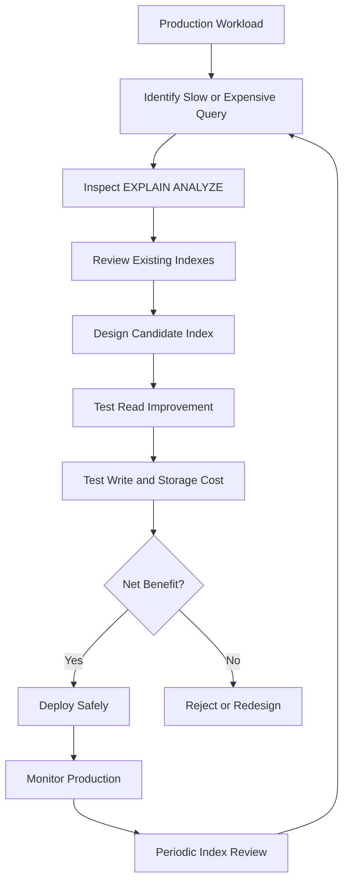

# 23- Read Performance vs Write Performance

## Overview

Database indexes improve read performance by providing efficient access paths to rows, but they introduce additional work on writes. Every index creates another data structure that the database must maintain when rows are inserted, updated, or deleted.

This creates a fundamental database trade-off:

```text
More / better indexes
        │
        ├── Faster reads
        ├── Faster filtering, joins, sorting
        └── Higher write and storage cost
                  │
                  ├── INSERT maintenance
                  ├── UPDATE maintenance
                  ├── DELETE maintenance
                  ├── More storage
                  ├── More cache pressure
                  └── More WAL / replication activity
```

Good index design is therefore not about maximizing the number of indexes. It is about maximizing **useful workload performance** while keeping index maintenance within acceptable operational limits.

For backend systems, this matters particularly when the same database serves both:

- Read-heavy REST or gRPC APIs.
- Transactional writes.
- Background workers.
- Event ingestion.
- Batch processing.
- Reporting and analytics.

A senior-level index decision evaluates the complete workload rather than optimizing an individual query in isolation.

## The Read-Write Trade-Off

Without an index, a query may need to inspect many rows:

```sql
SELECT id, total
FROM orders
WHERE customer_id = $1;
```

With an appropriate index:

```sql
CREATE INDEX idx_orders_customer_id
ON orders (customer_id);
```

the database can potentially locate matching index entries directly.

The read path becomes approximately:

```text
Query
  ↓
Index lookup
  ↓
Matching row locations
  ↓
Table access if required
  ↓
Result
```

However, inserting a new order now requires maintaining the table **and** the index:

```text
INSERT
  │
  ├── Write table row
  │
  └── Update index
```

With five indexes:

```text
INSERT
  │
  ├── Write table
  ├── Update index A
  ├── Update index B
  ├── Update index C
  ├── Update index D
  └── Update index E
```

The exact cost depends on the database engine, index type, data distribution, page layout, cache state, and workload.

## What Indexes Cost on Reads

Indexes can improve:

- Equality lookups.
- Range scans.
- Joins.
- Sorting.
- Pagination.
- Grouping in some workloads.
- Existence checks.
- Covering queries.

For example:

```sql
SELECT id, created_at
FROM orders
WHERE customer_id = $1
ORDER BY created_at DESC
LIMIT 50;
```

A composite index can potentially support both filtering and ordering:

```sql
CREATE INDEX idx_orders_customer_created
ON orders (customer_id, created_at DESC);
```

Instead of scanning and sorting a large set of rows, the database may be able to read the required entries directly from the index and stop after 50 rows.

## What Indexes Cost on Writes

Indexes must remain consistent with the underlying table.

### INSERT

An `INSERT` may require:

```text
Table modification
+
Index entry creation
```

If the inserted row affects multiple indexes, each index requires maintenance.

### DELETE

A `DELETE` can require index maintenance for every affected index.

Depending on the database engine and storage model, cleanup may be immediate, deferred, or handled by background maintenance.

### UPDATE

Updates are more nuanced.

If an updated column is not represented in an index, the database may avoid changing that index.

If an indexed column changes:

```sql
UPDATE orders
SET customer_id = $2
WHERE id = $1;
```

the relevant index structure must reflect the new value.

Updates can therefore become significantly more expensive when frequently modified columns participate in many indexes.

## Write Amplification

**Write amplification** describes the additional storage work generated by maintaining indexes and related database structures.

Conceptually:

```text
Application write
      ↓
Table modification
      ↓
Index maintenance
      ↓
WAL / transaction logging
      ↓
Replication
      ↓
Storage / background maintenance
```

A single logical application operation can therefore produce substantially more physical work than the table write alone.

This matters in high-throughput systems such as:

- Payment processing.
- Event ingestion.
- Kafka consumers.
- Celery workers.
- Telemetry pipelines.
- High-volume order systems.
- Audit-log storage.

## Read-Heavy vs Write-Heavy Workloads

The optimal indexing strategy depends strongly on workload characteristics.

| Workload | Typical index strategy |
|---|---|
| Read-heavy API | More indexes can be justified |
| Write-heavy ingestion | Keep indexes minimal |
| Balanced OLTP | Selective workload-driven indexing |
| Analytics | Different indexing and storage strategy may be appropriate |
| Append-heavy events | Avoid unnecessary indexes |
| High-volume transactional system | Prioritize critical access paths |
| Rarely queried historical data | Consider whether indexes justify maintenance cost |

There is no universal index-per-table target.

## Measuring the Trade-Off

A useful performance comparison includes both read and write metrics.

| Metric | Read-side question | Write-side question |
|---|---|---|
| Latency | Did query latency improve? | Did transaction latency increase? |
| CPU | Did query CPU decrease? | Did write CPU increase? |
| I/O | Did disk reads decrease? | Did writes increase? |
| Buffer usage | Is the index cache-efficient? | Does it increase cache pressure? |
| Storage | Is the index reasonably sized? | How much additional capacity is required? |
| WAL | — | Did write volume increase? |
| Replication | — | Did replica lag increase? |
| Maintenance | — | Did vacuum/rebuild work increase? |

Do not evaluate an index only by asking:

```text
"Did the SELECT become faster?"
```

Also ask:

```text
"How much did the total workload cost change?"
```

## Indexes and Write Frequency

The value of an index is strongly affected by how frequently the underlying table changes.

Consider two tables.

### Reference Table

```text
countries
10,000 rows
Very few writes
Millions of reads
```

Adding several useful indexes may be inexpensive because maintenance activity is low.

### Event Table

```text
events
500 million rows
100,000 inserts/sec
Few read queries
```

Adding multiple secondary indexes can create substantial write amplification.

The second table requires much stronger justification for every index.

## Read Benefit vs Write Cost

A practical way to evaluate an index is:

```text
Net value =
    read performance gained
    -
    write maintenance cost
    -
    storage cost
    -
    operational cost
```

This is not a literal database formula. It is an engineering decision model.

For example:

```text
Index A

Read:
P99 query latency
800 ms → 30 ms

Write:
+4% CPU
+8% storage
minimal replica impact

Decision:
Likely worthwhile
```

Compared with:

```text
Index B

Read:
P99 query latency
50 ms → 42 ms

Write:
+20% CPU
+25% storage
significant replica lag

Decision:
Probably not worthwhile
```

The second index technically improves a query but may make the overall system worse.

## Index Selectivity and Read Efficiency

Indexes are particularly valuable when they reduce the number of rows that must be examined.

For example:

```sql
SELECT *
FROM users
WHERE email = $1;
```

If `email` is unique:

```text
10,000,000 rows
       ↓
Index lookup
       ↓
1 row
```

This is a strong read optimization.

But:

```sql
SELECT *
FROM users
WHERE is_active = TRUE;
```

may match:

```text
9,500,000 / 10,000,000 rows
```

An index on `is_active` may provide little benefit for this particular predicate.

The optimizer can legitimately choose a sequential scan when retrieving a large percentage of the table is cheaper.

## Composite Indexes and Trade-Offs

Suppose an application frequently executes:

```sql
SELECT id, created_at, total
FROM orders
WHERE customer_id = $1
  AND status = 'pending'
ORDER BY created_at DESC
LIMIT 100;
```

A candidate index is:

```sql
CREATE INDEX idx_orders_customer_status_created
ON orders (customer_id, status, created_at DESC);
```

This can support the query efficiently while avoiding separate indexes for every individual predicate.

However, the index also creates additional write maintenance.

A common senior-level optimization is therefore:

> Prefer an index that efficiently serves an important family of queries over several overlapping indexes that each serve one small variation.

## Redundant Indexes

Suppose a table contains:

```text
(customer_id)
(customer_id, created_at)
(customer_id, status, created_at)
```

These indexes may overlap substantially.

Some redundancy may be intentional, but unnecessary indexes increase:

- Storage.
- Write amplification.
- Cache consumption.
- Maintenance overhead.
- Deployment time.
- Backup size.
- Replication workload.

Before adding an index, inspect existing indexes.

In PostgreSQL:

```sql
SELECT
    schemaname,
    tablename,
    indexname,
    indexdef
FROM pg_indexes
WHERE tablename = 'orders'
ORDER BY indexname;
```

## Index Usage in PostgreSQL

PostgreSQL exposes index usage statistics through `pg_stat_user_indexes`.

```sql
SELECT
    schemaname,
    relname,
    indexrelname,
    idx_scan,
    idx_tup_read,
    idx_tup_fetch,
    pg_size_pretty(pg_relation_size(indexrelid)) AS index_size
FROM pg_stat_user_indexes
WHERE relname = 'orders'
ORDER BY idx_scan DESC;
```

A large index with almost no scans deserves investigation.

However, **low usage does not automatically mean an index is useless**.

An index might support:

- Rare administrative queries.
- Disaster-recovery procedures.
- Compliance workflows.
- Critical but infrequent operations.
- Unique constraints.

Always understand why an index exists before removing it.

## Write-Heavy PostgreSQL Example

Consider:

```text
orders
100 million rows

Writes:
20,000 INSERTs/sec

Reads:
mostly by order_id
```

Suppose the table has:

```text
PRIMARY KEY (id)
(customer_id)
(status)
(created_at)
(customer_id, status)
(customer_id, status, created_at)
```

If most reads are:

```sql
SELECT *
FROM orders
WHERE id = $1;
```

then several secondary indexes may provide little value.

They still have to be maintained during writes.

A senior engineer would investigate:

1. Which indexes are actually used?
2. Which queries depend on them?
3. Which indexes overlap?
4. How much storage do they consume?
5. What is their write and maintenance cost?
6. Can a smaller number of indexes serve the workload?

## Partial Indexes as a Read-Write Optimization

Partial indexes can reduce the maintenance cost of indexing a large table.

Suppose:

```text
jobs
100 million rows

pending:
2 million

completed:
98 million
```

The application frequently queries:

```sql
SELECT id, created_at
FROM jobs
WHERE status = 'pending'
ORDER BY created_at
LIMIT 100;
```

Instead of indexing every row:

```sql
CREATE INDEX idx_jobs_status_created
ON jobs (status, created_at);
```

a PostgreSQL partial index can target the operational subset:

```sql
CREATE INDEX idx_jobs_pending_created
ON jobs (created_at)
WHERE status = 'pending';
```

This can produce a much smaller index and reduce maintenance for rows that do not satisfy the predicate.

Partial indexes are particularly useful for:

- Active records.
- Unprocessed jobs.
- Non-deleted records.
- Failed records awaiting retry.
- Current records in otherwise historical tables.

## Covering Indexes and Read Performance

A covering index can allow the database to satisfy a query using the index without fetching every required column from the table.

For example:

```sql
SELECT id, created_at, total
FROM orders
WHERE customer_id = $1
ORDER BY created_at DESC
LIMIT 50;
```

A PostgreSQL index could include additional payload columns:

```sql
CREATE INDEX idx_orders_customer_created_covering
ON orders (customer_id, created_at DESC)
INCLUDE (total);
```

The indexed columns determine the search/order structure, while included columns can provide additional data.

This can reduce table access for suitable queries.

However, covering indexes make the index wider, increasing:

- Storage.
- Memory consumption.
- Write maintenance.
- Index build time.

A covering index should therefore be justified by a significant read workload.

## Index Width Matters

A narrow index:

```text
(customer_id)
```

usually consumes less space than:

```text
(customer_id, status, created_at, total, currency, region, ...)
```

Wider indexes can:

- Require more I/O.
- Consume more cache.
- Increase write cost.
- Increase storage.
- Take longer to build.
- Increase maintenance overhead.

Do not add every selected column to an index simply because a query reads it.

## Updates and Indexed Columns

Suppose:

```sql
CREATE INDEX idx_users_status
ON users (status);
```

and the application frequently executes:

```sql
UPDATE users
SET status = 'active'
WHERE id = $1;
```

The index must reflect the changed indexed value.

Now consider:

```sql
UPDATE users
SET last_seen_at = NOW()
WHERE id = $1;
```

If `last_seen_at` is not part of the index, that particular index does not need to be updated because of the column change.

This distinction is important in write-heavy systems.

A frequently updated column appearing in many indexes can significantly increase write overhead.

## HOT Updates in PostgreSQL

PostgreSQL can sometimes perform a **HOT (Heap-Only Tuple) update** when an update does not modify indexed columns and the new row version can remain on the same heap page.

This can avoid creating new index entries for that update.

Conceptually:

```text
UPDATE non-indexed column
        ↓
Can potentially use HOT
        ↓
Less index maintenance
```

But if an indexed column changes, HOT cannot be used for that update.

Therefore, excessive indexing of frequently updated columns can have consequences beyond simple index maintenance.

## Indexes and Caching

Indexes compete with table data for memory.

Suppose a database has:

```text
16 GB memory available for database caching

Table:
12 GB

Indexes:
20 GB total
```

Not all data can remain cached.

A very large set of indexes can reduce cache efficiency and cause additional I/O.

A smaller index that serves a frequently executed query may therefore outperform a much larger, more comprehensive index.

The goal is not:

```text
"Keep everything indexed."
```

The goal is:

```text
"Keep important access paths efficient and cache-efficient."
```

## Indexes and Replication

In PostgreSQL streaming replication, writes are represented through WAL.

Indexes can contribute to the amount of physical work generated by writes.

A write-heavy system with many indexes can therefore experience:

```text
More indexes
    ↓
More maintenance work
    ↓
Potentially more WAL / I/O pressure
    ↓
Higher replica replay workload
    ↓
Potential replica lag
```

Replica lag can become especially important when read traffic is served from replicas.

An index optimization that improves primary-database reads but increases replica lag may be a poor system-level trade-off.

## Index Build Cost

Creating an index on a large production table can itself be expensive.

For example:

```sql
CREATE INDEX CONCURRENTLY idx_orders_customer_created
ON orders (customer_id, created_at DESC);
```

`CREATE INDEX CONCURRENTLY` can reduce blocking of normal table operations compared with a standard index build, but it generally requires more work and takes longer.

Production deployments should account for:

- Build duration.
- Temporary disk usage.
- I/O utilization.
- CPU utilization.
- Replica behavior.
- Migration failure handling.
- Operational rollback.

Index creation should be treated as a production database operation, not merely a schema declaration.

## ORM and Application-Level Considerations

Django developers can easily accumulate indexes through model definitions and migrations.

Example:

```python
class Order(models.Model):
    customer_id = models.BigIntegerField()
    status = models.CharField(max_length=32)
    created_at = models.DateTimeField()

    class Meta:
        indexes = [
            models.Index(
                fields=["customer_id", "status", "-created_at"],
                name="idx_order_customer_status_created",
            ),
        ]
```

The important question is not:

```text
"Can Django create this index?"
```

but:

```text
"Does the production workload justify maintaining this index?"
```

For a high-write table, review migrations carefully before introducing several new indexes.

## Read Replicas and Index Strategy

Read replicas can shift read traffic away from the primary database, but they do not eliminate the cost of indexes.

The primary still needs to maintain its indexes, and replicas need corresponding physical database structures.

A read-heavy architecture may justify richer indexing because:

```text
Primary
  ↓
Writes + replication
  ↓
Read replicas
  ↓
Many read queries
```

But the write and replication cost remains.

Indexes are not a substitute for architectural separation when workload characteristics demand it.

## When to Favor Read Performance

More aggressive indexing is often justified when:

- The query is executed extremely frequently.
- Latency is user-facing.
- The query is highly selective.
- The query is on a critical API path.
- The table is relatively read-heavy.
- The index significantly reduces CPU or I/O.
- The table changes relatively infrequently.
- The workload benefits from efficient pagination.

Examples:

```text
GET /users/{id}
GET /orders/{id}
GET /customers/{id}/orders
GET /products?sku=...
```

For these paths, a few well-designed indexes can have significant value.

## When to Favor Write Performance

Be conservative with indexes when:

- The table receives very high write volume.
- Reads are rare.
- The indexed columns change frequently.
- The table is append-heavy.
- Indexes are very large.
- Existing indexes already serve the workload.
- Query latency is already acceptable.
- The system is experiencing replication or storage pressure.

Examples include:

```text
event ingestion
telemetry
audit streams
high-volume logs
message ingestion
```

In such systems, unnecessary secondary indexes can become a significant bottleneck.

## Workload-Aware Index Strategy

A useful classification is:

| Query type | Index priority |
|---|---|
| Critical API lookup | Very high |
| Frequent transactional query | High |
| Frequent pagination query | High |
| Common join | High |
| Rare administrative query | Medium/low |
| One-off reporting query | Usually low |
| Unused query | None |
| Query returning most rows | Validate carefully |

Index design should follow **query importance × frequency × performance impact**, not simply the number of queries.

## Common Mistakes and Pitfalls

### Creating an Index for Every `WHERE` Column

This often produces:

```text
status
customer_id
created_at
country
type
region
...
```

as separate indexes.

The result can be excessive storage and write overhead.

Instead, identify actual query patterns and design indexes around them.

### Optimizing Only `SELECT` Latency

A query dropping from:

```text
100 ms → 20 ms
```

looks like a clear win.

But if the index causes:

```text
INSERT latency:
5 ms → 15 ms
```

on a table processing tens of thousands of writes per second, the system may be worse overall.

### Ignoring Index Overlap

Several indexes can provide nearly the same access path.

Review existing indexes before adding new ones.

### Indexing Frequently Updated Columns Without Justification

If a column changes on almost every update, putting it into many indexes can increase write cost substantially.

Evaluate whether the read benefit justifies that cost.

### Making Every Index Covering

Including many columns can reduce table access but can also make indexes substantially larger.

Use covering indexes for proven hot queries, not as a default strategy.

### Removing an Index Based Only on Low Scan Counts

A low-frequency index may still be required for integrity or rare critical operations.

Understand its purpose before dropping it.

### Testing Only on Small Datasets

An index may look excellent on:

```text
100,000 rows
```

but behave differently at:

```text
500 million rows
```

Test with realistic scale and data distribution.

### Ignoring Replication Impact

A read optimization on the primary can have system-wide consequences if it increases write amplification and replica lag.

### Assuming More Indexes Always Mean Faster Reads

The optimizer chooses among available access paths based on estimated cost.

More indexes can actually make the system more expensive without providing meaningful read benefits.

## Production Monitoring

Index optimization should be measurable after deployment.

Monitor:

### Query Metrics

- P50 latency.
- P95 latency.
- P99 latency.
- Query throughput.
- Rows examined.
- Rows returned.
- CPU time.
- I/O.

### Database Metrics

- CPU utilization.
- Storage I/O.
- Buffer/cache hit behavior.
- WAL generation.
- Transaction latency.
- Lock contention.
- Vacuum activity.
- Autovacuum health.

### Replication Metrics

For replicated PostgreSQL deployments:

- Replica lag.
- WAL generation rate.
- Replay rate.
- Replica I/O pressure.

### Index Metrics

Track:

- Index size.
- Index scans.
- Index tuples read.
- Index tuples fetched.
- Growth over time.

Example:

```sql
SELECT
    schemaname,
    relname,
    indexrelname,
    idx_scan,
    pg_size_pretty(pg_relation_size(indexrelid)) AS index_size
FROM pg_stat_user_indexes
WHERE schemaname = 'public'
ORDER BY pg_relation_size(indexrelid) DESC;
```

## A Production Index Review Process

Before adding an index:

1. Identify the production query.
2. Measure its frequency and latency.
3. Inspect the current execution plan.
4. Determine how many rows it reads and returns.
5. Check existing indexes.
6. Evaluate cardinality and data distribution.
7. Design the smallest useful index.
8. Estimate write and storage impact.
9. Test using representative data.
10. Deploy safely.
11. Compare read and write metrics after deployment.
12. Periodically review whether the index remains justified.

The important difference is that index optimization becomes a **feedback loop**, not a one-time schema decision.



## Senior-Level Decision Framework

When evaluating an index, ask:

### Read Side

```text
How frequently is the query executed?
How latency-sensitive is it?
How many rows does it currently examine?
How many rows does it return?
Can the index eliminate sorting?
Can it support LIMIT efficiently?
Can it enable index-only access?
```

### Write Side

```text
How many INSERTs/sec occur?
How many UPDATEs/sec occur?
Which indexed columns change frequently?
How large will the index become?
How much additional I/O will it create?
Could it increase replication lag?
```

### Operational Side

```text
How expensive is index creation?
How will it be deployed?
Does it increase backup/storage requirements?
Does it overlap existing indexes?
How will usage be monitored?
When should it be reconsidered?
```

The best index is usually not the one that makes a single query fastest. It is the one that provides meaningful workload-level improvement at an acceptable total cost.

## Interview Traps

### "Do Indexes Only Affect Reads?"

No.

Indexes primarily provide read access paths, but they also require maintenance during writes.

```text
INSERT / UPDATE / DELETE
        ↓
Table maintenance
+
Index maintenance
```

### "Should a Production Database Have as Many Indexes as Possible?"

No.

Indexes improve some reads while increasing write, storage, memory, and maintenance costs.

### "Why Can an Index Make Writes Slower?"

The database must maintain the index whenever relevant rows or indexed values change.

More indexes generally mean more structures that may need maintenance.

### "Why Is a Covering Index Not Always Better?"

A covering index can reduce table access, but including more columns makes the index wider.

That increases:

- Storage.
- Cache consumption.
- Build cost.
- Write maintenance.

### "Why Not Create Separate Indexes for Every Column?"

Because individual indexes may overlap, may not be selective, and may provide little value for real queries while still imposing write and storage costs.

### "Can an Index Optimization Increase Replica Lag?"

Yes.

Additional index maintenance can increase write-related I/O and WAL activity, potentially increasing the workload that replicas must replay.

### "Is the Fastest Query Always the Best Optimization?"

No.

Database performance must be evaluated at the system level.

A small improvement to one read query may not justify a substantial increase in write latency, storage, CPU, or replication pressure.

## Key Takeaways

- **Indexes trade write, storage, memory, and maintenance cost for faster read access paths; more indexes are not automatically better.**
- **Evaluate indexes at the workload level by measuring query latency, frequency, write throughput, storage, CPU, I/O, and replication impact.**
- **Prefer small, workload-driven indexes and avoid redundant or unnecessarily wide indexes, especially on write-heavy tables.**
- **Frequently updated indexed columns can increase write amplification and reduce opportunities for efficient update mechanisms such as PostgreSQL HOT updates.**
- **Production index design should be continuously validated with execution plans and database/index usage metrics rather than treated as a one-time schema decision.**