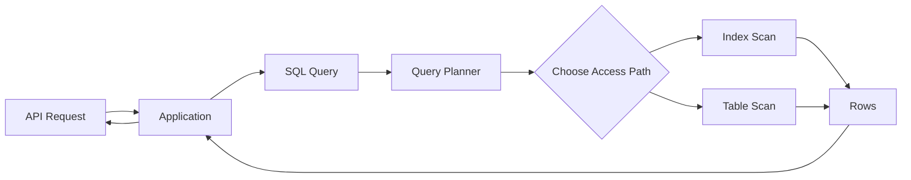
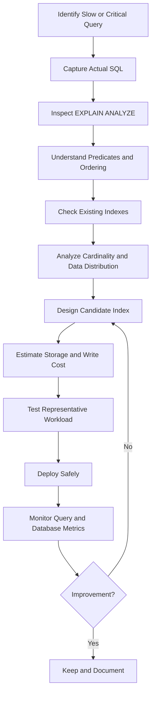
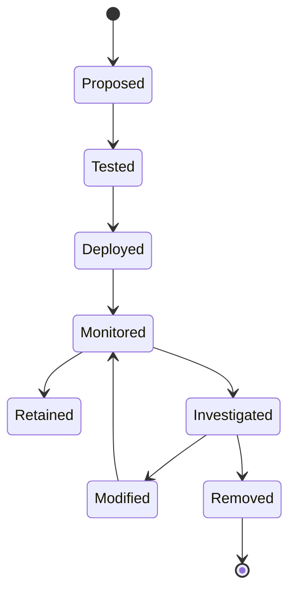

# 25- Indexing Strategy

## Overview

Indexing strategy is the deliberate design of a database's indexes around the application's actual query workload, data distribution, write patterns, and operational constraints.

A good strategy is not:

> "Add an index to every column used in a query."

It is:

> "Design the smallest, most useful index set that gives critical queries predictable performance without imposing unacceptable write, storage, memory, and operational costs."

For backend systems, indexes sit directly on the critical path between application queries and physical data access:



Index design therefore requires understanding both **query behavior** and **database internals**.

## Why Indexing Strategy Matters

Without appropriate indexes, query cost can grow roughly with the amount of data that must be examined.

With a suitable index, the database may locate the required rows without scanning the entire table.

However, indexes introduce their own costs:

| Benefit | Cost |
|---|---|
| Faster selective reads | Additional disk storage |
| Efficient joins | INSERT/UPDATE/DELETE maintenance |
| Faster ordering | More memory/cache pressure |
| Faster grouping in suitable cases | Longer index creation |
| Constraint enforcement | More complex schema |
| Reduced rows examined | Potential index bloat |
| Better latency predictability | Additional backup/replication footprint |

The objective is therefore **workload optimization**, not maximum index count.

## Start With the Workload

Index decisions should begin with real queries.

Typical backend workloads include:

```text
REST / gRPC request
        ↓
Application service
        ↓
ORM / SQL
        ↓
WHERE / JOIN / ORDER BY / GROUP BY
        ↓
Database planner
        ↓
Access path
```

For a Django application, for example:

```python
Order.objects.filter(
    customer_id=customer_id,
    status="pending",
).order_by("-created_at")[:50]
```

The resulting SQL may benefit from an index shaped around:

```text
customer_id
status
created_at
```

But the exact index should be determined from the actual SQL, data distribution, and execution plan rather than the ORM expression alone.

## The Core Indexing Workflow

A production indexing workflow should look like:



This process is more reliable than adding indexes reactively whenever a query appears slow.

## Query Patterns an Index Should Support

Common index-driven access patterns include:

| Query operation | Typical index consideration |
|---|---|
| `WHERE` | Index filtering columns |
| `JOIN` | Join keys |
| `ORDER BY` | Ordering columns |
| `GROUP BY` | Sometimes useful, workload-dependent |
| Equality lookup | Highly selective key |
| Range lookup | Ordered/range-capable index |
| Prefix lookup | Depends on operator and index type |
| Existence checks | Selective lookup |
| Covering query | Key + included columns |
| Active subset | Partial/filtered index |
| Computed lookup | Expression/functional index |

An index should be designed around a **query family**, not necessarily one query.

## Single-Column Indexes

A single-column index is appropriate when a column independently supports an important access path.

Example:

```sql
CREATE INDEX idx_orders_customer_id
ON orders (customer_id);
```

This may support:

```sql
SELECT id, created_at, total
FROM orders
WHERE customer_id = $1;
```

It is particularly useful when:

- The predicate is selective.
- The query is frequent.
- The table is large.
- The indexed column is stable enough that write maintenance is acceptable.

A single-column index can also be useful as part of foreign-key and join workloads.

## Composite Indexes

Composite indexes contain multiple key columns:

```sql
CREATE INDEX idx_orders_customer_status_created
ON orders (customer_id, status, created_at DESC);
```

Column order is critical.

For a B-tree index:

```text
(customer_id, status, created_at)
```

is not equivalent to:

```text
(status, customer_id, created_at)
```

The optimal order depends on the workload.

A useful way to think about a composite index is:

```text
Leftmost / leading columns
        ↓
Narrow the searchable portion
        ↓
Later columns refine or order within it
```

## Equality, Range, and Ordering

A common production pattern is:

```sql
WHERE customer_id = $1
  AND status = $2
  AND created_at >= $3
ORDER BY created_at DESC
LIMIT 50;
```

A candidate index might be:

```sql
CREATE INDEX idx_orders_customer_status_created
ON orders (
    customer_id,
    status,
    created_at DESC
);
```

The design aligns the index with:

```text
Equality predicates
        ↓
Range / ordering column
        ↓
LIMIT
```

This is a common and useful pattern, but it is not a universal rule. Query plans and actual data distribution must validate the choice.

## Index Column Order

For composite indexes, column order can determine whether the optimizer can efficiently use the index.

Compare:

```sql
CREATE INDEX idx_a
ON orders (customer_id, status);
```

with:

```sql
CREATE INDEX idx_b
ON orders (status, customer_id);
```

If the workload commonly searches by:

```sql
WHERE customer_id = $1
  AND status = $2
```

both may be usable.

But if the workload commonly searches by:

```sql
WHERE customer_id = $1;
```

the first index naturally supports that leading-column access path.

The second does not provide the same general-purpose prefix support.

Always evaluate the **actual query workload** rather than applying a simplistic "highest cardinality first" rule.

## Indexes for JOINs

Join-heavy systems often benefit from indexes on join keys.

Example:

```sql
SELECT
    o.id,
    c.email,
    o.total
FROM orders o
JOIN customers c
    ON c.id = o.customer_id
WHERE c.id = $1;
```

A useful index on the child side may be:

```sql
CREATE INDEX idx_orders_customer_id
ON orders (customer_id);
```

This can make it efficient to find orders belonging to a customer.

Foreign keys deserve particular attention in high-volume systems because the referencing column is frequently used for joins and parent-child operations.

## Indexes for ORDER BY

Indexes can sometimes allow the database to produce rows in the required order without an explicit sort.

Example:

```sql
SELECT id, created_at, total
FROM orders
WHERE customer_id = $1
ORDER BY created_at DESC
LIMIT 50;
```

Candidate:

```sql
CREATE INDEX idx_orders_customer_created
ON orders (customer_id, created_at DESC);
```

This is especially valuable for:

- Pagination.
- Feeds.
- Recent activity.
- Time-series access.
- "Latest N records" queries.

The benefit can be substantial because the database may stop after finding the required number of rows.

## Indexes for WHERE Conditions

Index predicates should reflect common filtering patterns.

For:

```sql
SELECT id, total
FROM orders
WHERE customer_id = $1
  AND status = 'pending';
```

a composite index may be preferable to separate indexes:

```sql
CREATE INDEX idx_orders_customer_status
ON orders (customer_id, status);
```

Whether a composite index is better depends on the complete workload.

Do not automatically create:

```text
customer_id index
status index
```

when a workload-specific composite index may serve the important query family more effectively.

## Partial Indexes

Partial indexes index only rows satisfying a predicate.

PostgreSQL example:

```sql
CREATE INDEX idx_orders_pending_customer
ON orders (customer_id, created_at DESC)
WHERE status = 'pending';
```

This can be highly effective when:

```text
Total orders:       500 million
Pending orders:       2 million
```

The index can remain much smaller than a full-table index.

Partial indexes are particularly useful for:

- Active records.
- Pending jobs.
- Unprocessed events.
- Soft-deleted data.
- Frequently queried subsets.

The query predicate must be compatible with the index predicate for the optimizer to use the index effectively.

## Covering Indexes

A covering index contains enough information to satisfy a query without fetching the base table row in suitable cases.

PostgreSQL supports included columns:

```sql
CREATE INDEX idx_orders_customer_created
ON orders (customer_id, created_at DESC)
INCLUDE (total, currency);
```

This can support:

```sql
SELECT customer_id, created_at, total, currency
FROM orders
WHERE customer_id = $1
ORDER BY created_at DESC
LIMIT 50;
```

Covering indexes can reduce heap access, but they increase index width and therefore:

- Storage.
- Cache usage.
- Write maintenance.
- Index build cost.

Use them for measured hot paths rather than as a default optimization.

## Expression and Functional Indexes

Sometimes the query applies a function to a column:

```sql
SELECT id
FROM users
WHERE lower(email) = lower($1);
```

A normal index on `email` may not provide the required access path.

PostgreSQL can use an expression index:

```sql
CREATE INDEX idx_users_lower_email
ON users (lower(email));
```

The indexed expression should match the query expression closely enough for the optimizer to recognize the access path.

Common use cases include:

- Case-insensitive lookups.
- Normalized values.
- Date extraction.
- Computed search keys.

Do not index arbitrary expressions without demonstrating a workload benefit.

## Selectivity and Cardinality

Selectivity describes how effectively a predicate narrows the candidate row set.

For example:

```text
customer_id = 74291
```

may match:

```text
20 rows / 100 million
```

while:

```text
status = 'active'
```

may match:

```text
80 million / 100 million
```

The first predicate is highly selective; the second is not.

However, low selectivity does not automatically make an index useless. The optimizer also considers:

- Table size.
- Correlation.
- Cost estimates.
- Query shape.
- Available indexes.
- Number of rows requested.
- Ordering requirements.
- Statistics.

## Why "High Cardinality First" Is Not a Universal Rule

A common interview rule says:

> Put the highest-cardinality column first.

This is an oversimplification.

Consider:

```sql
WHERE tenant_id = $1
  AND created_at >= $2
ORDER BY created_at DESC
LIMIT 100;
```

Even if `created_at` has extremely high cardinality, putting `tenant_id` first may be essential in a multi-tenant workload because it partitions the index around the tenant access pattern.

The correct design depends on:

```text
Query predicates
+
Query frequency
+
Data distribution
+
Ordering
+
Range conditions
+
Workload shape
```

## Indexes and Write Performance

Every additional index can increase write cost.

Conceptually:

```text
INSERT
  │
  ├── Table
  ├── Primary key index
  ├── Customer index
  ├── Status index
  ├── Composite index
  └── Covering index
```

The database must maintain each relevant index.

This matters especially for:

- Event ingestion.
- High-volume transactional systems.
- Kafka consumers.
- Celery workers.
- Audit/event tables.
- Time-series workloads.

For write-heavy systems, index count should be treated as a performance budget.

## Index Storage Cost

Index storage should be evaluated alongside query performance.

For PostgreSQL:

```sql
SELECT
    indexrelname AS index_name,
    pg_size_pretty(pg_relation_size(indexrelid)) AS index_size,
    idx_scan
FROM pg_stat_user_indexes
WHERE relname = 'orders'
ORDER BY pg_relation_size(indexrelid) DESC;
```

A large index is not automatically bad.

A useful evaluation is:

```text
Performance benefit
        ↓
versus
Storage + memory + write + maintenance cost
```

## Redundant Indexes

Redundant indexes are a common source of unnecessary cost.

Example:

```text
(customer_id)
(customer_id, created_at)
(customer_id, status, created_at)
```

These indexes overlap significantly.

The correct action is not automatically to delete the narrower indexes. Check:

- Query patterns.
- Ordering requirements.
- Partial predicates.
- Uniqueness.
- Included columns.
- Index access frequency.
- Planner behavior.
- Operational requirements.

Index consolidation should be evidence-driven.

## Primary Keys and Unique Constraints

Primary keys and unique constraints commonly create indexes automatically, depending on the database and constraint type.

For example:

```sql
CREATE TABLE customers (
    id BIGINT PRIMARY KEY,
    email TEXT UNIQUE NOT NULL
);
```

The database typically maintains indexes supporting these constraints.

Do not create another identical index:

```sql
CREATE INDEX idx_customers_id
ON customers (id);
```

if the primary-key constraint already provides the required index.

Likewise, a separate non-unique index that duplicates a unique constraint's index is often unnecessary.

## ORM-Aware Indexing

ORMs can hide the actual SQL.

Django example:

```python
Order.objects.filter(
    customer_id=customer_id,
    status="pending",
).order_by("-created_at")[:50]
```

Do not design the index solely from Python code.

Inspect the generated SQL and execution plan.

Django provides query inspection capabilities such as:

```python
queryset = (
    Order.objects
    .filter(customer_id=customer_id, status="pending")
    .order_by("-created_at")[:50]
)

print(queryset.query)
```

The production workflow should ultimately validate the SQL executed by the application against the database's execution plan.

## Query Plan Validation

PostgreSQL example:

```sql
EXPLAIN (ANALYZE, BUFFERS)
SELECT id, created_at, total
FROM orders
WHERE customer_id = 74291
  AND status = 'pending'
ORDER BY created_at DESC
LIMIT 50;
```

Important signals include:

- Actual vs estimated rows.
- Scan type.
- Index chosen.
- Rows removed by filtering.
- Buffer hits.
- Buffer reads.
- Sort operations.
- Execution time.

Example:

```text
Index Scan
  → small number of rows examined
  → no large sort
  → low buffer activity
```

is generally more promising than:

```text
Sequential Scan
  → millions of rows examined
  → large filtering step
  → expensive sort
```

But a sequential scan is not inherently a failure. For queries returning a large percentage of a table, it may be cheaper than using an index.

## Index Scan vs Sequential Scan

The planner chooses an access path based on estimated cost.

| Situation | Possible preferred plan |
|---|---|
| Very selective predicate | Index scan |
| Small table | Sequential scan |
| Large percentage of rows returned | Sequential scan |
| Ordered small result | Index scan |
| Covering index available | Index-only scan |
| Poor statistics | Potentially incorrect choice |
| Function prevents normal index use | Sequential scan or alternative |

Never define "index used" as the sole success criterion.

The real objective is:

> Lowest appropriate execution cost for the workload.

## Statistics Matter

The optimizer relies on statistics to estimate:

```text
How many rows will this predicate match?
```

If statistics are inaccurate, the optimizer can select a poor plan even when an appropriate index exists.

For PostgreSQL, analyze activity is normally handled automatically through autovacuum/autoanalyze, but production systems should still monitor statistics freshness and investigate significant estimation errors.

A major symptom is:

```text
Estimated rows: 100
Actual rows:    5,000,000
```

Such a mismatch can lead to poor join strategies and access-path decisions.

## Multi-Tenant Indexing

Multi-tenant systems often require tenant isolation in access patterns.

Typical query:

```sql
SELECT id, created_at, total
FROM orders
WHERE tenant_id = $1
  AND created_at >= $2
ORDER BY created_at DESC
LIMIT 100;
```

A candidate index:

```sql
CREATE INDEX idx_orders_tenant_created
ON orders (tenant_id, created_at DESC);
```

This reflects the logical access boundary:

```text
Tenant
  ↓
Time range
  ↓
Ordering
  ↓
LIMIT
```

For shared-database multi-tenant systems, tenant-aware indexes are often essential for predictable query performance.

## Pagination and Indexing

Offset pagination:

```sql
SELECT id, created_at
FROM orders
WHERE customer_id = $1
ORDER BY created_at DESC
LIMIT 50 OFFSET 100000;
```

can become expensive because the database may still need to walk past many rows.

Keyset pagination is often more scalable:

```sql
SELECT id, created_at
FROM orders
WHERE customer_id = $1
  AND created_at < $2
ORDER BY created_at DESC
LIMIT 50;
```

with:

```sql
CREATE INDEX idx_orders_customer_created
ON orders (customer_id, created_at DESC);
```

The index and query are designed together.

For deterministic pagination, use a stable tie-breaker when timestamps are not unique:

```sql
CREATE INDEX idx_orders_customer_created_id
ON orders (customer_id, created_at DESC, id DESC);
```

## Soft Deletes

A common backend schema uses:

```sql
deleted_at TIMESTAMP NULL
```

while most application queries use:

```sql
WHERE deleted_at IS NULL
```

A partial index can sometimes reduce unnecessary index entries:

```sql
CREATE INDEX idx_users_active_email
ON users (email)
WHERE deleted_at IS NULL;
```

This is particularly useful when deleted records represent a large historical portion of the table.

The index should be validated against actual query predicates and workload distribution.

## Hot and Cold Data

Indexing should consider data temperature.

```text
Hot data
↓
Frequently queried
↓
Strong index candidates

Cold data
↓
Rarely accessed
↓
Avoid unnecessary indexing
```

For append-heavy tables with historical data, blindly indexing every column can create substantial storage and write costs without providing proportional value.

Retention policies and archival strategies should therefore be considered alongside indexing strategy.

## Indexing by Query Family

Instead of creating indexes per endpoint, group similar SQL patterns.

For example:

```text
Query family A
WHERE tenant_id = ?
ORDER BY created_at DESC

Query family B
WHERE tenant_id = ?
  AND status = ?
ORDER BY created_at DESC

Query family C
WHERE tenant_id = ?
  AND created_at BETWEEN ? AND ?
```

A carefully designed composite index may support multiple members of this family.

This reduces:

- Index count.
- Storage.
- Write amplification.
- Schema complexity.

## Index Lifecycle

Indexes should have a lifecycle:



Every production index should have a reason for existing.

Useful metadata includes:

- Query or workload supported.
- Owning service.
- Expected benefit.
- Creation date.
- Size.
- Usage.
- Migration that created it.

This makes future cleanup significantly safer.

## Safe Index Deployment

For PostgreSQL production environments, large indexes may need concurrent creation:

```sql
CREATE INDEX CONCURRENTLY idx_orders_customer_created
ON orders (customer_id, created_at DESC);
```

`CREATE INDEX CONCURRENTLY` reduces blocking of normal table writes compared with a standard build, but it has trade-offs:

- Takes longer.
- Performs more work.
- Requires additional resources.
- Cannot run inside a transaction block.
- Can leave an invalid index after certain failures.

Database migration tooling must account for these semantics.

For Django migrations, concurrent PostgreSQL index creation generally requires a non-atomic migration and database-specific handling rather than blindly using a standard transactional migration.

## Monitoring Index Effectiveness

Monitor both query and index metrics.

Important signals include:

| Metric | What it tells you |
|---|---|
| Query latency | User-visible performance |
| Rows examined | Filtering efficiency |
| Buffer reads | I/O pressure |
| Buffer hits | Cache effectiveness |
| Index scans | Usage |
| Sequential scans | Potential missing/unused index signal |
| Index size | Storage cost |
| Write latency | Maintenance overhead |
| Replication lag | Replica impact |
| Database CPU | Resource pressure |

PostgreSQL example:

```sql
SELECT
    schemaname,
    relname AS table_name,
    indexrelname AS index_name,
    idx_scan,
    idx_tup_read,
    idx_tup_fetch
FROM pg_stat_user_indexes
ORDER BY idx_scan DESC;
```

Usage statistics should be interpreted over a representative period and in the context of the application's traffic patterns.

## Production Index Review Checklist

Before creating an index:

- What production query requires it?
- How frequently does the query execute?
- How latency-sensitive is it?
- What predicates does it use?
- Does it join another table?
- Does it sort?
- Does it paginate?
- What is the cardinality of the relevant columns?
- What is the expected result-set size?
- Are existing indexes already sufficient?
- Can an existing index be extended instead?
- Would a partial index be better?
- Would an expression index be required?
- Would a covering index provide measurable value?
- What is the expected index size?
- How will writes be affected?
- How will replication be affected?
- How will the index be deployed safely?
- How will the result be measured?

## Common Mistakes

### Indexing Every Column Used in `WHERE`

A query using:

```sql
WHERE a = ?
  AND b = ?
  AND c = ?
```

does not automatically require:

```text
(a)
(b)
(c)
```

Three single-column indexes may be less useful than a workload-specific composite index.

### Blindly Following Cardinality Rules

Rules such as "highest cardinality first" are heuristics, not laws.

Query shape, equality predicates, ranges, ordering, and workload frequency matter.

### Creating Indexes Without Checking Existing Ones

This produces redundant indexes and unnecessary write overhead.

### Ignoring `ORDER BY`

A query may be fast at filtering but slow because it must sort a large result set.

Designing the index around filtering and ordering can eliminate that bottleneck.

### Ignoring `LIMIT`

For:

```sql
ORDER BY created_at DESC
LIMIT 20
```

an appropriately ordered index can allow the database to stop quickly after finding the required rows.

### Indexing Low-Value Columns

A rarely queried column does not justify an index merely because it appears in a query.

### Overusing Covering Indexes

Adding many payload columns can turn a useful index into a large, expensive structure.

### Ignoring Write Workloads

An index optimized for reads can reduce write throughput.

### Dropping Indexes Solely Because Usage Is Low

An index may support rare but critical operations or enforce constraints.

### Assuming the Optimizer Must Use the Index

The optimizer may correctly choose a sequential scan.

The question is whether the chosen plan is efficient, not whether an index appears in every plan.

## Interview Traps

### "More Indexes Always Mean Better Performance"

False.

More indexes can improve reads while increasing:

- Write cost.
- Storage.
- Cache pressure.
- Maintenance.
- Migration complexity.

### "Every Foreign Key Should Always Have an Index"

Foreign-key columns are often good index candidates, especially on large child tables with joins and parent-row modifications, but the decision should still consider workload and existing indexes.

Some database systems also differ in how foreign-key constraints themselves are implemented.

### "A Composite Index Is Just Multiple Single-Column Indexes"

False.

A composite B-tree index has an ordered structure over the combination of columns:

```text
(a, b, c)
```

Its behavior is different from three independent indexes:

```text
(a)
(b)
(c)
```

### "Indexes Make Queries Fast"

Only when the index provides an efficient access path for the query and the planner determines that using it is beneficial.

### "An Index on Every WHERE Column Is Best"

No.

Index design should consider query families, column order, selectivity, ordering, writes, storage, and existing indexes.

### "High Cardinality Always Goes First"

No.

Column order depends on the workload and access pattern.

### "Index Usage Count of Zero Means Delete It"

Not necessarily.

Usage statistics can reset, workloads can be seasonal, and indexes can exist for constraints or infrequent critical operations.

## Practical Strategy

A mature indexing strategy follows these principles:

```text
1. Observe
   ↓
2. Measure
   ↓
3. Understand query shape
   ↓
4. Inspect existing indexes
   ↓
5. Analyze data distribution
   ↓
6. Design the smallest useful index
   ↓
7. Validate with execution plans
   ↓
8. Estimate operational cost
   ↓
9. Deploy safely
   ↓
10. Monitor production behavior
```

The database should be treated as part of the application's performance architecture rather than as a passive persistence layer.

## Best Practices

- Design indexes from real production query patterns.
- Use `EXPLAIN` and `EXPLAIN ANALYZE` to validate assumptions.
- Consider `WHERE`, `JOIN`, `ORDER BY`, `GROUP BY`, and pagination together.
- Design composite indexes around query families rather than isolated statements.
- Treat column order as a workload-specific decision.
- Use partial indexes when only a subset of rows is relevant.
- Use covering indexes selectively for measured hot paths.
- Avoid redundant and overlapping indexes.
- Consider cardinality and data distribution.
- Account for write amplification.
- Include index storage in capacity planning.
- Monitor index usage and query latency over representative periods.
- Deploy large production indexes with appropriate online/concurrent mechanisms.
- Document why important indexes exist.
- Re-evaluate indexes as schemas, data distributions, and workloads evolve.
- Prefer measured execution plans over generic indexing rules.

## Key Takeaways

- **Indexing strategy is workload-driven: design indexes around real query patterns, not around columns in isolation.**
- **Composite index column order, selectivity, ordering, and query shape determine whether an index provides an efficient access path.**
- **Every index has a cost in storage, memory, writes, maintenance, and operational complexity, so minimize redundant and low-value indexes.**
- **Validate index decisions with execution plans, production metrics, and representative data rather than assuming that index usage is automatically beneficial.**
- **Treat indexes as production infrastructure: deploy them safely, monitor them continuously, and revisit them as workloads and data distributions change.**