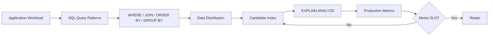
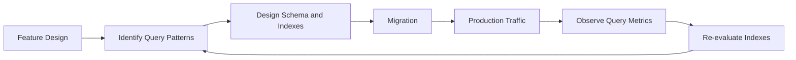

# 26- Usage Pattern Based Indexing

## Overview

Usage pattern based indexing means designing indexes around how the application actually accesses data rather than indexing columns in isolation.

The same table can require very different indexes depending on whether its dominant workload is:

- Point lookups
- Multi-column filtering
- Joins
- Range queries
- Sorting
- Pagination
- Aggregation
- Active-record queries
- Multi-tenant access
- Read-heavy or write-heavy traffic

A production indexing strategy starts with query patterns and works backward toward the physical index design:



The objective is not to maximize index count. It is to create the **smallest index set that efficiently supports important query patterns while keeping write, storage, memory, and operational costs acceptable**.

## Why Usage Patterns Matter

Consider an `orders` table:

```text
orders
--------------------------------
id
tenant_id
customer_id
status
created_at
total
```

These queries represent different access patterns:

```sql
-- Point lookup
SELECT *
FROM orders
WHERE id = $1;

-- Tenant + status filtering
SELECT *
FROM orders
WHERE tenant_id = $1
  AND status = $2;

-- Recent orders
SELECT *
FROM orders
WHERE tenant_id = $1
ORDER BY created_at DESC
LIMIT 50;

-- Time-range query
SELECT *
FROM orders
WHERE tenant_id = $1
  AND created_at >= $2
  AND created_at < $3;
```

An index designed for one pattern may not be optimal for another.

For example:

```sql
CREATE INDEX idx_orders_status
ON orders (status);
```

may help status filtering but does little to optimize:

```sql
WHERE tenant_id = $1
ORDER BY created_at DESC
LIMIT 50
```

The correct question is therefore:

> "How does this application access this table?"

rather than:

> "Which columns should I index?"

## Query Patterns and Index Shapes

Common workload patterns map naturally to different index designs.

| Usage pattern | Typical index approach |
|---|---|
| Primary-key lookup | Primary key / unique index |
| Equality filtering | Single or composite B-tree |
| Equality + equality | Composite index |
| Equality + range | Composite index with range column appropriately positioned |
| Filtering + ordering | Composite index aligned with both |
| Recent-N queries | Equality prefix + ordered timestamp |
| Keyset pagination | Stable ordering columns |
| Join lookup | Index on frequently probed join key |
| Active subset | Partial index |
| Computed lookup | Expression/functional index |
| Query projection | Covering/index-only strategy |
| Full-text search | Database-specific text index |
| Spatial search | Spatial index |

These are patterns, not rigid rules. The query planner and actual workload must validate the design.

## Identify Query Families

A common mistake is designing one index per SQL statement.

Instead, group queries into **query families** with similar access patterns.

For example:

```text
Query Family A
WHERE tenant_id = ?
ORDER BY created_at DESC
LIMIT ?

Query Family B
WHERE tenant_id = ?
  AND status = ?
ORDER BY created_at DESC
LIMIT ?

Query Family C
WHERE tenant_id = ?
  AND created_at BETWEEN ? AND ?
```

These queries share:

```text
tenant_id
created_at
```

A candidate index could therefore be:

```sql
CREATE INDEX idx_orders_tenant_created
ON orders (tenant_id, created_at DESC);
```

A second index may be justified for the status-heavy family:

```sql
CREATE INDEX idx_orders_tenant_status_created
ON orders (tenant_id, status, created_at DESC);
```

But this should be justified by actual workload frequency and execution plans.

## Equality Lookup Patterns

Point lookups are among the simplest indexing cases.

Query:

```sql
SELECT id, email, created_at
FROM users
WHERE email = $1;
```

Candidate:

```sql
CREATE UNIQUE INDEX idx_users_email
ON users (email);
```

This is especially appropriate when `email` must also be unique.

For non-unique lookup:

```sql
CREATE INDEX idx_orders_customer_id
ON orders (customer_id);
```

supports:

```sql
SELECT id, created_at, total
FROM orders
WHERE customer_id = $1;
```

### When to Use

Use a single-column index when:

- The column independently supports an important query family.
- The predicate is selective enough to justify indexed access.
- The query is frequent or latency-sensitive.
- No existing composite index already provides the required access path.

### Production Consideration

Before adding a new index, inspect existing indexes. A composite index may already support the query through its leading columns.

## Multi-Column Equality Patterns

Suppose the dominant query is:

```sql
SELECT id, total
FROM orders
WHERE tenant_id = $1
  AND customer_id = $2;
```

A candidate index is:

```sql
CREATE INDEX idx_orders_tenant_customer
ON orders (tenant_id, customer_id);
```

This can be preferable to relying on:

```text
(tenant_id)
(customer_id)
```

because the composite index directly represents the combined access pattern.

This is particularly useful when the application frequently queries entities within a tenant boundary.

## Equality + Range Patterns

Consider:

```sql
SELECT id, total
FROM orders
WHERE tenant_id = $1
  AND created_at >= $2
  AND created_at < $3;
```

A natural candidate is:

```sql
CREATE INDEX idx_orders_tenant_created
ON orders (tenant_id, created_at);
```

The structure is:

```text
tenant_id
    ↓
restricted tenant portion
    ↓
created_at range
```

This allows the database to navigate to the relevant tenant region and then traverse the requested time range.

This pattern appears frequently in:

- Audit logs
- Events
- Orders
- Transactions
- Metrics
- Notifications
- Job history

## Filtering + Ordering Patterns

A particularly valuable query pattern is:

```sql
SELECT id, created_at, total
FROM orders
WHERE tenant_id = $1
  AND status = $2
ORDER BY created_at DESC
LIMIT 50;
```

Candidate:

```sql
CREATE INDEX idx_orders_tenant_status_created
ON orders (
    tenant_id,
    status,
    created_at DESC
);
```

The index corresponds to the workload:

```text
tenant filter
    ↓
status filter
    ↓
created_at ordering
    ↓
LIMIT 50
```

This can avoid both large-scale filtering and expensive sorting.

The exact benefit should be verified with:

```sql
EXPLAIN (ANALYZE, BUFFERS)
SELECT id, created_at, total
FROM orders
WHERE tenant_id = 42
  AND status = 'pending'
ORDER BY created_at DESC
LIMIT 50;
```

## Top-N and Recent-Record Patterns

Backend applications frequently ask for:

```text
latest 10 notifications
latest 50 orders
most recent login
newest events
recent messages
```

Example:

```sql
SELECT id, created_at, payload
FROM events
WHERE tenant_id = $1
ORDER BY created_at DESC
LIMIT 100;
```

Candidate:

```sql
CREATE INDEX idx_events_tenant_created
ON events (tenant_id, created_at DESC);
```

The `LIMIT` is important.

If the index already provides the required ordering, the database may be able to stop after finding the required number of rows rather than sorting a large result set.

## Keyset Pagination Patterns

Offset pagination:

```sql
SELECT id, created_at
FROM orders
WHERE tenant_id = $1
ORDER BY created_at DESC
LIMIT 50 OFFSET 100000;
```

can become increasingly expensive as the offset grows.

A keyset query can instead use the last returned position:

```sql
SELECT id, created_at
FROM orders
WHERE tenant_id = $1
  AND (created_at, id) < ($2, $3)
ORDER BY created_at DESC, id DESC
LIMIT 50;
```

with:

```sql
CREATE INDEX idx_orders_tenant_created_id
ON orders (
    tenant_id,
    created_at DESC,
    id DESC
);
```

The `id` tie-breaker makes ordering deterministic when multiple rows have the same timestamp.

This pattern is highly useful for:

- REST APIs
- gRPC services
- Infinite scrolling
- Activity feeds
- Large administrative tables

## JOIN Access Patterns

Consider:

```sql
SELECT
    o.id,
    o.total,
    c.email
FROM customers c
JOIN orders o
    ON o.customer_id = c.id
WHERE c.id = $1;
```

An index on:

```sql
CREATE INDEX idx_orders_customer_id
ON orders (customer_id);
```

can make the child-side lookup efficient.

The important usage pattern is:

```text
Known customer
      ↓
Find matching orders
      ↓
Read order rows
```

For large child tables, indexing the frequently probed foreign-key column is often important.

However, an existing composite index may already cover the join key.

## Multi-Tenant Usage Patterns

Multi-tenant systems frequently have a natural leading access boundary:

```sql
WHERE tenant_id = $1
```

Suppose the dominant API query is:

```sql
SELECT id, created_at, total
FROM invoices
WHERE tenant_id = $1
ORDER BY created_at DESC
LIMIT 100;
```

A candidate index is:

```sql
CREATE INDEX idx_invoices_tenant_created
ON invoices (tenant_id, created_at DESC);
```

This aligns the physical access path with the application's logical boundary.

For shared-schema multi-tenant applications, this can improve:

- Tenant isolation at the access-path level.
- Query latency predictability.
- Pagination performance.
- Cache locality.
- Operational scalability.

Do not assume every index should begin with `tenant_id`; confirm that the application's dominant access patterns actually use tenant-scoped queries.

## Status-Based Usage Patterns

A common backend schema contains low-cardinality status columns:

```text
pending
processing
completed
failed
```

A standalone index on `status` may have limited value when most rows share the same status.

For example:

```sql
WHERE status = 'completed'
```

may match almost the entire table.

A better pattern may be:

```sql
WHERE tenant_id = $1
  AND status = 'pending'
ORDER BY created_at
LIMIT 100
```

with:

```sql
CREATE INDEX idx_jobs_tenant_status_created
ON jobs (tenant_id, status, created_at);
```

Or, if only pending jobs are operationally important:

```sql
CREATE INDEX idx_jobs_pending
ON jobs (tenant_id, created_at)
WHERE status = 'pending';
```

The second design can be substantially smaller when pending jobs are a small subset.

## Soft-Delete Usage Patterns

Suppose most application queries exclude deleted records:

```sql
WHERE deleted_at IS NULL
```

A partial index can reflect the actual usage pattern:

```sql
CREATE INDEX idx_users_active_email
ON users (email)
WHERE deleted_at IS NULL;
```

This avoids indexing rows that are irrelevant to the dominant active-record workload.

The approach is especially useful when:

```text
Active records: 20 million
Deleted records: 180 million
```

The exact benefit depends on the query workload and database implementation.

## Expression-Based Usage Patterns

Application queries sometimes normalize values before comparison:

```sql
SELECT id
FROM users
WHERE lower(email) = lower($1);
```

A normal index on `email` may not match the expression efficiently.

PostgreSQL supports:

```sql
CREATE INDEX idx_users_lower_email
ON users (lower(email));
```

This is usage-pattern based indexing because the index represents what the application actually searches for:

```text
Application lookup
    ↓
Normalize email
    ↓
Compare normalized value
    ↓
Expression index
```

The indexed expression should correspond to the expression used by the query.

## Covering Usage Patterns

Some endpoints repeatedly retrieve a small projection:

```sql
SELECT id, created_at, total, currency
FROM orders
WHERE tenant_id = $1
ORDER BY created_at DESC
LIMIT 50;
```

PostgreSQL can use included columns:

```sql
CREATE INDEX idx_orders_tenant_created_covering
ON orders (tenant_id, created_at DESC)
INCLUDE (total, currency);
```

The key columns support the access path:

```text
tenant_id
created_at
```

while included columns can provide additional payload data.

This can reduce base-table access when an index-only scan is possible.

The trade-off is increased index size and write maintenance.

## Read-Heavy vs Write-Heavy Patterns

Usage patterns must include workload composition.

### Read-Heavy

```text
1000 reads/sec
50 writes/sec
```

More specialized indexes may be justified if they significantly reduce latency.

### Write-Heavy

```text
100 reads/sec
10,000 writes/sec
```

Every additional index can become significant because each write may require multiple index updates.

A write-heavy system should generally favor:

- Fewer indexes.
- High-value indexes.
- Compact indexes.
- Avoidance of redundant indexes.
- Careful use of covering indexes.

The correct index set is therefore partly a **read/write trade-off decision**.

## Frequency and Criticality

Query frequency alone is not enough.

Consider:

| Query | Frequency | Latency requirement | Index priority |
|---|---:|---|---|
| Health check | Very high | Low | Low |
| Customer lookup | High | High | High |
| Admin report | Low | Medium | Medium |
| Billing transaction | Low | Very high | High |
| Background cleanup | Low | Low | Low |

A query executed only a few times per minute may still deserve an index if it is on a critical transactional path.

Index prioritization should consider:

```text
Frequency
+
Latency sensitivity
+
Business criticality
+
Data volume
+
Resource consumption
```

## Query Pattern Matrix

A useful production technique is to maintain a query-to-index matrix.

| Query family | Predicate | Ordering | Result size | Candidate index |
|---|---|---|---:|---|
| Customer orders | `customer_id` | None | Medium | `(customer_id)` |
| Recent customer orders | `customer_id` | `created_at DESC` | Small | `(customer_id, created_at DESC)` |
| Pending customer orders | `customer_id, status` | `created_at DESC` | Small | `(customer_id, status, created_at DESC)` |
| Tenant events | `tenant_id` | `created_at DESC` | Small | `(tenant_id, created_at DESC)` |
| Active users | `deleted_at IS NULL` | Email | Small | Partial `(email)` |

This makes index decisions reviewable rather than intuitive.

## Index Consolidation

Usage patterns can reveal overlapping indexes.

Suppose a table has:

```text
idx_orders_customer
(customer_id)

idx_orders_customer_created
(customer_id, created_at DESC)

idx_orders_customer_status_created
(customer_id, status, created_at DESC)
```

These indexes may overlap significantly.

Do not immediately remove the first index. Determine which query families depend on it.

A useful review process is:

```text
Existing indexes
      ↓
Map each index to query families
      ↓
Identify redundant coverage
      ↓
Check usage statistics
      ↓
Validate execution plans
      ↓
Remove only when safe
```

## Unused Indexes

PostgreSQL provides index statistics through `pg_stat_user_indexes`.

```sql
SELECT
    schemaname,
    relname AS table_name,
    indexrelname AS index_name,
    idx_scan,
    pg_size_pretty(pg_relation_size(indexrelid)) AS index_size
FROM pg_stat_user_indexes
ORDER BY pg_relation_size(indexrelid) DESC;
```

An index with very low usage can be a candidate for review.

However, usage statistics must be interpreted carefully:

- Statistics may reset.
- Traffic may be seasonal.
- Rare queries may still be critical.
- An index may enforce a constraint.
- A newly deployed index may not have accumulated usage.
- Replica and primary workloads may differ.

Never automate index deletion solely from a low `idx_scan` value.

## Measuring Before and After

A new index should have a measurable hypothesis.

Example:

```text
Current:
P95 latency = 850 ms
Rows examined = 2,000,000

Expected:
P95 latency < 100 ms
Rows examined ≪ 2,000,000
```

Then compare execution plans.

Before:

```sql
EXPLAIN (ANALYZE, BUFFERS)
SELECT id, created_at, total
FROM orders
WHERE tenant_id = 42
ORDER BY created_at DESC
LIMIT 50;
```

Create the candidate index:

```sql
CREATE INDEX idx_orders_tenant_created
ON orders (tenant_id, created_at DESC);
```

Then measure again.

The goal is not merely:

```text
"Index Scan appears"
```

The goal is:

```text
lower latency
+
lower I/O
+
fewer rows examined
+
acceptable write overhead
```

## Data Distribution Changes

An index that works well today may become less useful as the dataset changes.

Example:

```text
Initial:
pending = 1% of rows

Later:
pending = 40% of rows
```

A partial index designed around pending records may become substantially less advantageous.

Similarly:

```text
Tenant A = 90% of traffic
Tenant B = 0.1% of traffic
```

can produce planner and workload behavior different from a uniformly distributed tenant population.

Index strategy must therefore evolve with data distribution.

## Application Lifecycle and Indexing

Indexes should be considered during application design, migration, and operations.



For Django, an index should generally be represented as a migration so that schema changes are reproducible across environments.

Example:

```python
class Order(models.Model):
    tenant_id = models.BigIntegerField()
    created_at = models.DateTimeField()

    class Meta:
        indexes = [
            models.Index(
                fields=["tenant_id", "-created_at"],
                name="orders_tenant_created_idx",
            ),
        ]
```

The migration should then be reviewed for production deployment characteristics, especially for large tables.

## Production Deployment

Large index creation can consume substantial:

- CPU
- Memory
- Disk I/O
- Temporary storage
- Replication bandwidth

For PostgreSQL, concurrent creation can reduce blocking of normal writes:

```sql
CREATE INDEX CONCURRENTLY idx_orders_tenant_created
ON orders (tenant_id, created_at DESC);
```

However, concurrent creation is not free. It can take longer and requires operational planning.

For large production databases, consider:

- Index build duration.
- Disk headroom.
- Replica impact.
- Failover behavior.
- Deployment windows.
- Lock behavior.
- Migration transaction semantics.
- Monitoring during creation.

## Monitoring Usage Patterns

Production monitoring should connect database behavior back to application workloads.

Useful metrics include:

| Metric | Why it matters |
|---|---|
| Query P50/P95/P99 | User-visible latency |
| Calls per query | Workload frequency |
| Rows returned | Result-set size |
| Rows examined | Filtering efficiency |
| Buffer reads | I/O pressure |
| Buffer hits | Cache effectiveness |
| Index scans | Index utilization |
| Sequential scans | Potential access-path issue |
| Index size | Storage cost |
| Write latency | Index maintenance cost |
| Replication lag | Replica impact |

Application observability should also identify the endpoint, RPC, background job, or service responsible for the query.

## Python, Django, and FastAPI Workloads

Indexing decisions should be based on database queries generated by the application.

Django:

```python
orders = (
    Order.objects
    .filter(
        tenant_id=tenant_id,
        status="pending",
    )
    .order_by("-created_at")[:50]
)
```

FastAPI may execute equivalent SQL through SQLAlchemy or another database layer.

The architecture is:

```text
HTTP / gRPC
    ↓
Python service
    ↓
ORM / query builder
    ↓
SQL
    ↓
Database planner
    ↓
Index access path
```

The ORM is not the final authority on indexing. The executed SQL and database execution plan are.

## Common Mistakes

### Indexing Columns Instead of Query Patterns

Creating:

```text
(status)
(customer_id)
(created_at)
```

without examining the actual workload can produce several mediocre indexes instead of one useful composite index.

### Creating One Index Per Endpoint

Different endpoints may generate the same SQL query family.

Group queries by access pattern before adding indexes.

### Ignoring `ORDER BY`

Filtering may be efficient while sorting remains expensive.

Consider filtering and ordering together.

### Ignoring `LIMIT`

Top-N queries can benefit significantly from indexes that provide the required ordering.

### Overusing Low-Cardinality Indexes

A standalone index on a status column may be ineffective when the predicate matches a large fraction of the table.

### Ignoring Write Cost

Every additional index can increase INSERT, UPDATE, and DELETE work.

### Assuming Composite Indexes Replace All Single-Column Indexes

A composite index may support its leading-column predicates but not every query involving later columns independently.

### Ignoring Existing Indexes

Before creating:

```sql
CREATE INDEX idx_orders_customer
ON orders (customer_id);
```

check whether an existing index such as:

```text
(customer_id, created_at)
```

already provides the required access path.

### Treating `EXPLAIN` as Optional

Index design without execution-plan validation is largely guesswork.

### Deleting Rarely Used Indexes Immediately

Rare usage does not necessarily mean uselessness.

Check constraints, critical workflows, seasonal traffic, and the observation period first.

## Production Pitfalls

### Index Explosion

Large services can accumulate indexes over years as individual teams optimize individual queries.

The result can be:

```text
More indexes
    ↓
More storage
    ↓
More write amplification
    ↓
More cache pressure
    ↓
Longer maintenance
    ↓
More complex schema
```

Periodic index reviews prevent this.

### Stale Assumptions

A query pattern can change after:

- Feature changes.
- ORM changes.
- Data growth.
- Tenant growth.
- Traffic changes.
- Retention-policy changes.

Indexes should evolve with the workload.

### Optimizing a Non-Critical Query

A 5 ms admin query may not justify a large index if a 500 ms customer-facing query remains unresolved.

Prioritize based on system impact.

### Optimizing Only the Happy Path

A query may be fast for typical data but slow for large tenants or pathological parameter values.

Test representative and worst-case distributions.

## Interview Traps

### "Index the Most Selective Column First"

Not universally correct.

Composite index order depends on the complete query workload, including equality predicates, ranges, ordering, and access patterns.

### "One Index Can Optimize Any Query"

No.

An index represents a particular ordered access structure. Different query families may require different structures.

### "If a Column Is in WHERE, It Needs an Index"

False.

Index usefulness depends on selectivity, table size, query frequency, access cost, and existing indexes.

### "More Indexes Always Improve Read Performance"

Not necessarily.

The optimizer may choose a different plan, and additional indexes increase write and maintenance costs.

### "Index Usage Count Tells You Everything"

No.

Usage statistics are historical observations and need to be interpreted in context.

## Senior-Level Design Heuristics

When evaluating an index, reason through the following dimensions:

```text
Query shape
    +
Workload frequency
    +
Business criticality
    +
Data distribution
    +
Cardinality/selectivity
    +
Ordering requirements
    +
Result-set size
    +
Read/write ratio
    +
Existing indexes
    +
Storage budget
    +
Deployment constraints
```

A strong index design is therefore not just a database decision. It is an application architecture decision.

## Practical Index Review Checklist

Before adding an index:

- Identify the exact production query.
- Group it into a query family.
- Measure frequency and latency.
- Inspect `WHERE`, `JOIN`, `ORDER BY`, and `LIMIT`.
- Check existing indexes.
- Examine cardinality and data distribution.
- Determine whether equality, range, and ordering predicates can share an index.
- Consider partial or expression indexes when appropriate.
- Consider covering indexes only for measured hot paths.
- Estimate storage requirements.
- Estimate write overhead.
- Test with representative data.
- Compare `EXPLAIN (ANALYZE, BUFFERS)` results.
- Plan safe production deployment.
- Monitor after release.
- Document the index's supported workload.

## Best Practices

- Design indexes around **query families**, not isolated columns.
- Start with real production SQL and measured workload data.
- Consider filtering, joining, ordering, pagination, and result size together.
- Use composite indexes when multiple predicates form a recurring access pattern.
- Use partial indexes for frequently accessed subsets when the database supports them.
- Use covering indexes selectively when reducing base-table access has measurable value.
- Reuse existing index coverage before adding new indexes.
- Treat write-heavy tables as having a limited index budget.
- Re-evaluate indexes as data distribution and application traffic change.
- Validate every important index with execution plans and production metrics.
- Review unused and overlapping indexes periodically.
- Deploy large indexes with appropriate production-safe mechanisms.
- Document the workload each important index exists to support.

## Key Takeaways

- **Indexes should be designed from actual application usage patterns, with query families providing the primary unit of analysis.**
- **Filtering, joins, ordering, pagination, result size, and data distribution must be considered together when selecting an index shape.**
- **A good index solves an important workload efficiently while minimizing storage, memory, write, and operational costs.**
- **Execution plans and production metrics validate indexing decisions; generic rules such as "index every WHERE column" are unreliable.**
- **Index strategy is an evolving part of system architecture and must be revisited as traffic, data distribution, and application behavior change.**